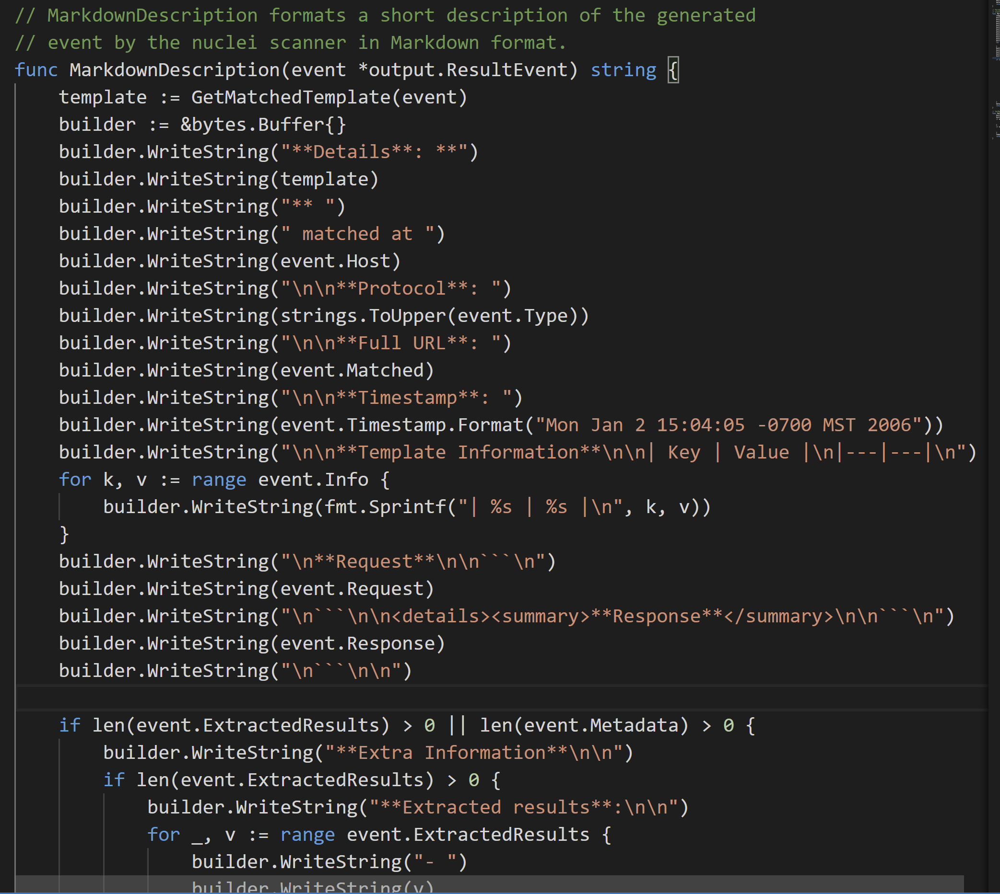
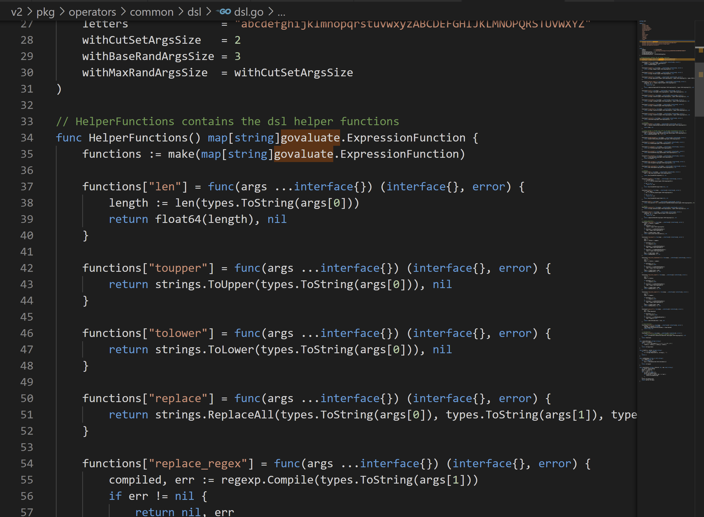
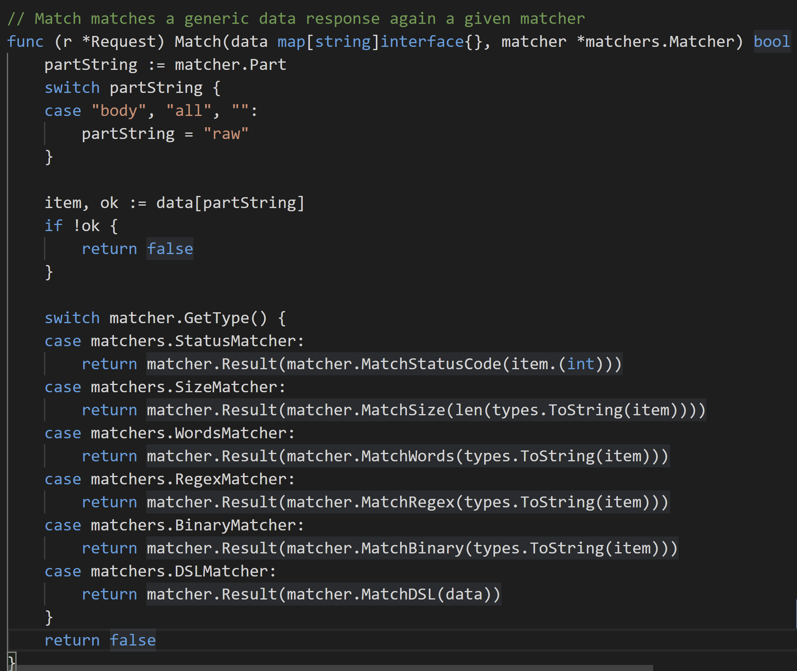

# projectdiscovery之nuclei源码阅读

##  简介 

> Nuclei is a fast tool for configurable targeted vulnerability scanning based on templates offering massive extensibility and ease of use. 
> 
> Github: https://github.com/projectdiscovery/nuclei

和以前基于python的`POC-T`类似，不过它是用`Go`编写，并且基于yaml编写模板。 

这类的工具挺多的，流程也都大同小异，重要的想让人使用的动力，主要还是来自于生态吧。 

nuclei基于社区提供了很多可以白嫖的模板，本着这一点，本文就是记录一下如何在自己扫描器中调用nuclei的模板，以及记录一些有趣的、以及以后可能也会用到的技术细节。 

##  有趣的细节 

###  相同的请求 

相同的请求可以合并，就不需要发送两次啦 

`v2\pkg\protocols\http\cluster.go`
```go 
package http

import (
    "github.com/projectdiscovery/nuclei/v2/pkg/protocols/common/compare"
)

// CanCluster returns true if the request can be clustered.
//
// This used by the clustering engine to decide whether two requests
// are similar enough to be considered one and can be checked by
// just adding the matcher/extractors for the request and the correct IDs.
func (r *Request) CanCluster(other *Request) bool {
    if len(r.Payloads) > 0 || len(r.Raw) > 0 || len(r.Body) > 0 || r.Unsafe {
        return false
    }
    if r.Method != other.Method ||
        r.MaxRedirects != other.MaxRedirects ||
        r.CookieReuse != other.CookieReuse ||
        r.Redirects != other.Redirects {
        return false
    }
    if !compare.StringSlice(r.Path, other.Path) {
        return false
    }
    if !compare.StringMap(r.Headers, other.Headers) {
        return false
    }
    return true
}

```

  * 比较模板请求中的method，最大重定向数，是否共享cookie请求，是否重定向 
  * 比较请求的path 
  * 比较请求的header 


compare的细节函数 
```go 
package compare

import "strings"

// StringSlice 比较两个字符串切片是否相等
func StringSlice(a, b []string) bool {
    // If one is nil, the other must also be nil.
    if (a == nil) != (b == nil) {
        return false
    }
    if len(a) != len(b) {
        return false
    }
    for i := range a {
        if !strings.EqualFold(a[i], b[i]) {
            return false
        }
    }
    return true
}

// StringMap 比较两个字符串map是否相同
func StringMap(a, b map[string]string) bool {
    // If one is nil, the other must also be nil.
    if (a == nil) != (b == nil) {
        return false
    }
    if len(a) != len(b) {
        return false
    }
    for k, v := range a {
        if w, ok := b[k]; !ok || !strings.EqualFold(v, w) {
            return false
        }
    }
    return true
}

```

###  client报告 

nuclei支持github、gitlab、jira、markdown好几种报告模式，刚开始以为是只报告bug呢，后面知道，发现新的结果也会报告的。 

看一下生成markdown的描述  


报告的细节很详细，`请求细节`和`返回细节`都会报告出来。 

###  headless模拟 

nuclei的最新版本支持基于chromium的headless访问，用于直接模拟浏览器访问，在`v2\pkg\protocols\headless`

使用的库是`https://github.com/go-rod/rod`

我看源码结构里面定义了很多`事件`,后面应该是想基于yaml来模拟操作浏览器吧？ 

没有细看实现的完整度有多少，如果这个实现了，就太厉害了 - = 

###  interface转换 

go类型中的interface可以看成是任意类型，但是在使用时需要将他转换成我们指定的类型，nuclei实现了这个方法。未来可能也会用到记录下。 
```go 
// Taken from https://github.com/spf13/cast.

package types

import (
    "fmt"
    "strconv"
    "strings"
)

// ToString converts an interface to string in a quick way
func ToString(data interface{}) string {
    switch s := data.(type) {
    case nil:
        return ""
    case string:
        return s
    case bool:
        return strconv.FormatBool(s)
    case float64:
        return strconv.FormatFloat(s, 'f', -1, 64)
    case float32:
        return strconv.FormatFloat(float64(s), 'f', -1, 32)
    case int:
        return strconv.Itoa(s)
    case int64:
        return strconv.FormatInt(s, 10)
    case int32:
        return strconv.Itoa(int(s))
    case int16:
        return strconv.FormatInt(int64(s), 10)
    case int8:
        return strconv.FormatInt(int64(s), 10)
    case uint:
        return strconv.FormatUint(uint64(s), 10)
    case uint64:
        return strconv.FormatUint(s, 10)
    case uint32:
        return strconv.FormatUint(uint64(s), 10)
    case uint16:
        return strconv.FormatUint(uint64(s), 10)
    case uint8:
        return strconv.FormatUint(uint64(s), 10)
    case []byte:
        return string(s)
    case fmt.Stringer:
        return s.String()
    case error:
        return s.Error()
    default:
        return fmt.Sprintf("%v", data)
    }
}

// ToStringSlice casts an interface to a []string type.
func ToStringSlice(i interface{}) []string {
    var a []string

    switch v := i.(type) {
    case []interface{}:
        for _, u := range v {
            a = append(a, ToString(u))
        }
        return a
    case []string:
        return v
    case string:
        return strings.Fields(v)
    case interface{}:
        return []string{ToString(v)}
    default:
        return nil
    }
}

// ToStringMap casts an interface to a map[string]interface{} type.
func ToStringMap(i interface{}) map[string]interface{} {
    var m = map[string]interface{}{}

    switch v := i.(type) {
    case map[interface{}]interface{}:
        for k, val := range v {
            m[ToString(k)] = val
        }
        return m
    case map[string]interface{}:
        return v
    default:
        return nil
    }
}

```

###  DSL语法 

nuclei的模板语法支持很多静态的匹配条件，regx，word等等，同时也引入了dsl语法，让静态的yaml文件具备了调用函数的特性。 

一个nuclei模板 
```yaml 
id: CVE-2018-18069

info:
  name: Wordpress unauthenticated stored xss
  author: nadino
  severity: medium
  description: process_forms in the WPML (aka sitepress-multilingual-cms) plugin through 3.6.3 for WordPress has XSS via any locale_file_name_ parameter (such as locale_file_name_en) in an authenticated theme-localization.php request to wp-admin/admin.php.
  tags: cve,cve2018,wordpress,xss

requests:
  - method: POST
    path:
      - "{{BaseURL}}/wp-admin/admin.php"
    body: 'icl_post_action=save_theme_localization&locale_file_name_en=EN\"><html xmlns=\"hacked'

    matchers:
      - type: dsl
        dsl:
          - 'status_code==302 && contains(set_cookie, "_icl_current_admin_language")'

```

可以看到dsl是一个表达式。 

`v2\pkg\operators\common\dsl\dsl.go` 展现了实现dsl语法的函数细节 



匹配模式 



识别不同的类型进行不同类型的规则匹配 

nuclei使用的是https://github.com/Knetic/govaluate 这个库，上面有基本用法 
```go 
expression, err := govaluate.NewEvaluableExpression("(mem_used / total_mem) * 100");

parameters := make(map[string]interface{}, 8)
parameters["total_mem"] = 1024;
parameters["mem_used"] = 512;

result, err := expression.Evaluate(parameters);
// result is now set to "50.0", the float64 value.

```

这个库已经3年没有更新了。后面我在用这个库的时候发现一个bug。。就是dsl的函数参数会与自带的语法冲突，官方方案是使用转义，但是这个对于dsl的人来说太痛苦，连`-`都要转义是什么滋味？ 

后面我fork了一份解决了，在使用参数的时候不用管转义的问题了。 

https://github.com/boy-hack/govaluate

官方太久没更新，所以也没提pull request 

###  projectfile 

projectfile是nuclei提供了可以保存项目的选项。 

内部实现是通过一个`map`保存了所有请求的包以及返回结果，key是对`请求体`(request struct)序列化后进行sha256运算。 

再次读取时初始化这个就好了，其中用到了`gob`对数据结构进行序列化和反序列化操作。 

`v2\pkg\projectfile\httputil.go`
```go 
package projectfile

import (
    "bytes"
    "crypto/sha256"
    "encoding/gob"
    "encoding/hex"
    "io"
    "io/ioutil"
    "net/http"
)

func hash(v interface{}) (string, error) {
    data, err := marshal(v)
    if err != nil {
        return "", err
    }

    sh := sha256.New()

    _, err = io.WriteString(sh, string(data))
    if err != nil {
        return "", err
    }
    return hex.EncodeToString(sh.Sum(nil)), nil
}

func marshal(data interface{}) ([]byte, error) {
    var b bytes.Buffer
    enc := gob.NewEncoder(&b)
    err := enc.Encode(data)
    if err != nil {
        return nil, err
    }

    return b.Bytes(), nil
}

func unmarshal(data []byte, obj interface{}) error {
    dec := gob.NewDecoder(bytes.NewBuffer(data))
    err := dec.Decode(obj)
    if err != nil {
        return err
    }

    return nil
}

type HTTPRecord struct {
    Request  []byte
    Response *InternalResponse
}

type InternalRequest struct {
    Target    string
    HTTPMajor int
    HTTPMinor int
    Method    string
    Headers   map[string][]string
    Body      []byte
}

type InternalResponse struct {
    HTTPMajor    int
    HTTPMinor    int
    StatusCode   int
    StatusReason string
    Headers      map[string][]string
    Body         []byte
}

// Unused
// func newInternalRequest() *InternalRequest {
//     return &InternalRequest{
//         Headers: make(map[string][]string),
//     }
// }

func newInternalResponse() *InternalResponse {
    return &InternalResponse{
        Headers: make(map[string][]string),
    }
}

// Unused
// func toInternalRequest(req *http.Request, target string, body []byte) *InternalRequest {
//     intReq := newInternalRquest()

//     intReq.Target = target
//     intReq.HTTPMajor = req.ProtoMajor
//     intReq.HTTPMinor = req.ProtoMinor
//     for k, v := range req.Header {
//         intReq.Headers[k] = v
//     }
//     intReq.Headers = req.Header
//     intReq.Method = req.Method
//     intReq.Body = body

//     return intReq
// }

func toInternalResponse(resp *http.Response, body []byte) *InternalResponse {
    intResp := newInternalResponse()

    intResp.HTTPMajor = resp.ProtoMajor
    intResp.HTTPMinor = resp.ProtoMinor
    intResp.StatusCode = resp.StatusCode
    intResp.StatusReason = resp.Status
    for k, v := range resp.Header {
        intResp.Headers[k] = v
    }
    intResp.Body = body
    return intResp
}

func fromInternalResponse(intResp *InternalResponse) *http.Response {
    var contentLength int64
    if intResp.Body != nil {
        contentLength = int64(len(intResp.Body))
    }
    return &http.Response{
        ProtoMinor:    intResp.HTTPMinor,
        ProtoMajor:    intResp.HTTPMajor,
        Status:        intResp.StatusReason,
        StatusCode:    intResp.StatusCode,
        Header:        intResp.Headers,
        ContentLength: contentLength,
        Body:          ioutil.NopCloser(bytes.NewReader(intResp.Body)),
    }
}

// Unused
// func fromInternalRequest(intReq *InternalRequest) *http.Request {
//     return &http.Request{
//         ProtoMinor:    intReq.HTTPMinor,
//         ProtoMajor:    intReq.HTTPMajor,
//         Header:        intReq.Headers,
//         ContentLength: int64(len(intReq.Body)),
//         Body:          ioutil.NopCloser(bytes.NewReader(intReq.Body)),
//     }
// }

```

##  集成nuclei 

为了白嫖nuclei的poc，我们准备在自己的扫描器中集成nuclei，或者兼容它的语法。 

以前版本想这么做，要深入到很底层的代码去改（因为很多底层接口都是内部的，外部提供的参数我们不需要），一个文件一个文件去扣，很麻烦。 

新版的nuclei好多了，不仅包结构调整为go包的形式，很多类都是interface类型，我们只需要根据interface实现那几个函数就能模拟一个mock的类传入。 

而且nuclei的测试用例页提供了参考,如果也想调用nuclei，可以看下面代码的例子。 

`v2\internal\testutils\testutils.go`

提供很多mock struct 
```go 
package testutils

import (
    "github.com/logrusorgru/aurora"
    "github.com/projectdiscovery/gologger/levels"
    "github.com/projectdiscovery/nuclei/v2/pkg/catalog"
    "github.com/projectdiscovery/nuclei/v2/pkg/output"
    "github.com/projectdiscovery/nuclei/v2/pkg/progress"
    "github.com/projectdiscovery/nuclei/v2/pkg/protocols"
    "github.com/projectdiscovery/nuclei/v2/pkg/protocols/common/protocolinit"
    "github.com/projectdiscovery/nuclei/v2/pkg/types"
    "go.uber.org/ratelimit"
)

// Init initializes the protocols and their configurations
func Init(options *types.Options) {
    _ = protocolinit.Init(options)
}

// DefaultOptions is the default options structure for nuclei during mocking.
var DefaultOptions = &types.Options{
    RandomAgent:          false,
    Metrics:              false,
    Debug:                false,
    DebugRequests:        false,
    DebugResponse:        false,
    Silent:               false,
    Version:              false,
    Verbose:              false,
    NoColor:              true,
    UpdateTemplates:      false,
    JSON:                 false,
    JSONRequests:         false,
    EnableProgressBar:    false,
    TemplatesVersion:     false,
    TemplateList:         false,
    Stdin:                false,
    StopAtFirstMatch:     false,
    NoMeta:               false,
    Project:              false,
    MetricsPort:          0,
    BulkSize:             25,
    TemplateThreads:      10,
    Timeout:              5,
    Retries:              1,
    RateLimit:            150,
    BurpCollaboratorBiid: "",
    ProjectPath:          "",
    Severity:             []string{},
    Target:               "",
    Targets:              "",
    Output:               "",
    ProxyURL:             "",
    ProxySocksURL:        "",
    TemplatesDirectory:   "",
    TraceLogFile:         "",
    Templates:            []string{},
    ExcludedTemplates:    []string{},
    CustomHeaders:        []string{},
}

// MockOutputWriter is a mocked output writer.
type MockOutputWriter struct {
    aurora          aurora.Aurora
    RequestCallback func(templateID, url, requestType string, err error)
    WriteCallback   func(o *output.ResultEvent)
}

// NewMockOutputWriter creates a new mock output writer
func NewMockOutputWriter() *MockOutputWriter {
    return &MockOutputWriter{aurora: aurora.NewAurora(false)}
}

// Close closes the output writer interface
func (m *MockOutputWriter) Close() {}

// Colorizer returns the colorizer instance for writer
func (m *MockOutputWriter) Colorizer() aurora.Aurora {
    return m.aurora
}

// Write writes the event to file and/or screen.
func (m *MockOutputWriter) Write(result *output.ResultEvent) error {
    if m.WriteCallback != nil {
        m.WriteCallback(result)
    }
    return nil
}

// Request writes a log the requests trace log
func (m *MockOutputWriter) Request(templateID, url, requestType string, err error) {
    if m.RequestCallback != nil {
        m.RequestCallback(templateID, url, requestType, err)
    }
}

// TemplateInfo contains info for a mock executed template.
type TemplateInfo struct {
    ID   string
    Info map[string]interface{}
    Path string
}

// NewMockExecuterOptions creates a new mock executeroptions struct
func NewMockExecuterOptions(options *types.Options, info *TemplateInfo) *protocols.ExecuterOptions {
    progressImpl, _ := progress.NewStatsTicker(0, false, false, 0)
    executerOpts := &protocols.ExecuterOptions{
        TemplateID:   info.ID,
        TemplateInfo: info.Info,
        TemplatePath: info.Path,
        Output:       NewMockOutputWriter(),
        Options:      options,
        Progress:     progressImpl,
        ProjectFile:  nil,
        IssuesClient: nil,
        Browser:      nil,
        Catalog:      catalog.New(options.TemplatesDirectory),
        RateLimiter:  ratelimit.New(options.RateLimit),
    }
    return executerOpts
}

// NoopWriter is a NooP gologger writer.
type NoopWriter struct{}

// Write writes the data to an output writer.
func (n *NoopWriter) Write(data []byte, level levels.Level) {}

```

`v2\pkg\protocols\http\build_request_test.go`

一个例子。 
```go 
func TestMakeRequestFromModal(t *testing.T) {
    options := testutils.DefaultOptions

    testutils.Init(options)
    templateID := "testing-http"
    request := &Request{
        ID:     templateID,
        Name:   "testing",
        Path:   []string{"{{BaseURL}}/login.php"},
        Method: "POST",
        Body:   "username=test&password=pass",
        Headers: map[string]string{
            "Content-Type":   "application/x-www-form-urlencoded",
            "Content-Length": "1",
        },
    }
    executerOpts := testutils.NewMockExecuterOptions(options, &testutils.TemplateInfo{
        ID:   templateID,
        Info: map[string]interface{}{"severity": "low", "name": "test"},
    })
    err := request.Compile(executerOpts)
    require.Nil(t, err, "could not compile http request")

    generator := request.newGenerator()
    req, err := generator.Make("https://example.com", map[string]interface{}{})
    require.Nil(t, err, "could not make http request")

    bodyBytes, _ := req.request.BodyBytes()
    require.Equal(t, "/login.php", req.request.URL.Path, "could not get correct request path")
    require.Equal(t, "username=test&password=pass", string(bodyBytes), "could not get correct request body")
}

```

##  最后 

我对于yaml的poc始终感觉怪怪的，但也渐渐明白一个运营安全社区的道理。想让别人接受，得要先把工具和生态做好，此时不要想着别人回赠。等别人用得舒服了，自然就会回赠了，这是一个自然而然的过程，但是需要时间去累积吧。 
