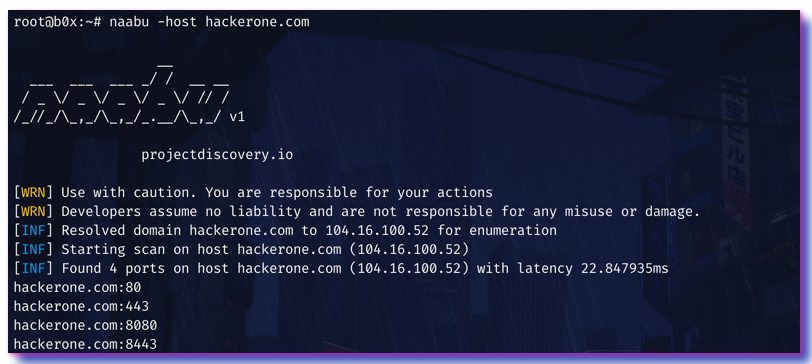
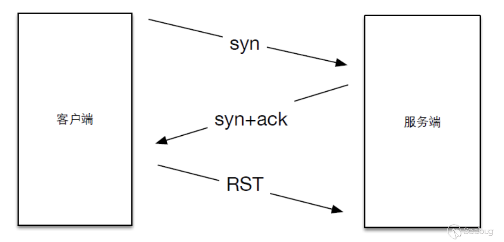
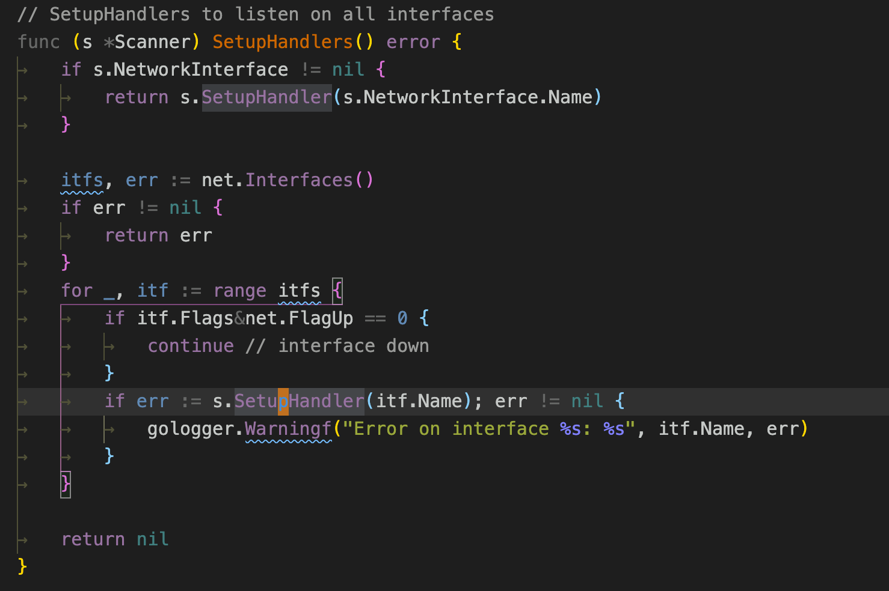

# projectdiscover之naabu 端口扫描器源码学习

ProjectDiscovery组织开源了很多自动化扫描的内部工具和研究，例如`subfinder 被动子域名发现工具`、`nuclei 基于模板的可配置快速扫描工具`、`naabu 端口扫描器`、`dnsprobe dns解析器`、`httpx 多功能http工具包`，它们都是基于`Go`语言编写，并且在实际渗透中有极大的作用。我非常喜欢这个组织开源的软件，它也是我学习`Go`语言的动力之一，所以计划写一个系列文章来研究下它们的代码。 

##  介绍 

naabu的项目地址是：https://github.com/projectdiscovery/naabu

几个特性： 

  * 基于syn/connect两种模式扫描 
  * 多种输入类型支持，包括HOST / IP / CIDR表示法。 
  * 自动处理多个子域之间的重复主机 
  * **Stdin** 和**stdout** 支持集成到工作流中 
  * 易于使用的轻量级资源 



``` 
▶ naabu -host hackerone.com

                  __
  ___  ___  ___ _/ /  __ __
 / _ \/ _ \/ _ \/ _ \/ // /
/_//_/\_,_/\_,_/_.__/\_,_/ v2.0.3

    projectdiscovery.io

[WRN] Use with caution. You are responsible for your actions
[WRN] Developers assume no liability and are not responsible for any misuse or damage.
[INF] Running SYN scan with root privileges
[INF] Found 4 ports on host hackerone.com (104.16.100.52)
hackerone.com:80
hackerone.com:443
hackerone.com:8443
hackerone.com:8080

```

##  扫描方式 

扫描相关的代码在 `v2/pkg/scan`目录 

###  cdn check 

顾名思义，跟踪一下，发现cdn检查调用的是`github.com/projectdiscovery/cdncheck`中的项目。 

通过接口获取一些CDN的ip段，判断ip是否在这些ip段中 
```go 
// scrapeCloudflare scrapes cloudflare firewall's CIDR ranges from their API
func scrapeCloudflare(httpClient *http.Client) ([]string, error) {
    resp, err := httpClient.Get("https://www.cloudflare.com/ips-v4")
    if err != nil {
        return nil, err
    }
    defer resp.Body.Close()

    data, err := ioutil.ReadAll(resp.Body)
    if err != nil {
        return nil, err
    }
    body := string(data)

    cidrs := cidrRegex.FindAllString(body, -1)
    return cidrs, nil
}

// scrapeIncapsula scrapes incapsula firewall's CIDR ranges from their API
func scrapeIncapsula(httpClient *http.Client) ([]string, error) {
    req, err := http.NewRequest(http.MethodPost, "https://my.incapsula.com/api/integration/v1/ips", strings.NewReader("resp_format=text"))
    if err != nil {
        return nil, err
    }
    req.Header.Set("Content-Type", "application/x-www-form-urlencoded")

    resp, err := httpClient.Do(req)
    if err != nil {
        return nil, err
    }
    defer resp.Body.Close()

    data, err := ioutil.ReadAll(resp.Body)
    if err != nil {
        return nil, err
    }
    body := string(data)

    cidrs := cidrRegex.FindAllString(body, -1)
    return cidrs, nil
}

// scrapeAkamai scrapes akamai firewall's CIDR ranges from ipinfo
func scrapeAkamai(httpClient *http.Client) ([]string, error) {
    resp, err := httpClient.Get("https://ipinfo.io/AS12222")
    if err != nil {
        return nil, err
    }
    defer resp.Body.Close()

    data, err := ioutil.ReadAll(resp.Body)
    if err != nil {
        return nil, err
    }
    body := string(data)

    cidrs := cidrRegex.FindAllString(body, -1)
    return cidrs, nil
}

// scrapeSucuri scrapes sucuri firewall's CIDR ranges from ipinfo
func scrapeSucuri(httpClient *http.Client) ([]string, error) {
    resp, err := httpClient.Get("https://ipinfo.io/AS30148")
    if err != nil {
        return nil, err
    }
    defer resp.Body.Close()

    data, err := ioutil.ReadAll(resp.Body)
    if err != nil {
        return nil, err
    }
    body := string(data)

    cidrs := cidrRegex.FindAllString(body, -1)
    return cidrs, nil
}

func scrapeProjectDiscovery(httpClient *http.Client) ([]string, error) {
    resp, err := httpClient.Get("https://cdn.projectdiscovery.io/cdn/cdn-ips")
    if err != nil {
        return nil, err
    }
    defer resp.Body.Close()

    data, err := ioutil.ReadAll(resp.Body)
    if err != nil {
        return nil, err
    }
    body := string(data)

    cidrs := cidrRegex.FindAllString(body, -1)
    return cidrs, nil
}

```

###  connect扫描 

naabu的connect扫描就是简单的建立一个tcp连接 
```go 
// ConnectVerify is used to verify if ports are accurate using a connect request
func (s *Scanner) ConnectVerify(host string, ports map[int]struct{}) map[int]struct{} {
    for port := range ports {
        conn, err := net.DialTimeout("tcp", fmt.Sprintf("%s:%d", host, port), s.timeout)
        if err != nil {
            delete(ports, port)
            continue
        }
        gologger.Debugf("Validated active port %d on %s\n", port, host)
        conn.Close()
    }
    return ports
}

```

###  syn扫描 

syn扫描只能在unix操作系统上运行，如果是windows系统，会切换到connect扫描。 

syn扫描的原理是只用发一个syn包，节省发包时间，而完整的tcp需要进行三次握手。 



####  获取空闲端口 

初始化时，获取空闲端口，并监听这个端口 
```go 
import github.com/phayes/freeport

func NewScannerUnix(scanner *Scanner) error {
    rawPort, err := freeport.GetFreePort()
    if err != nil {
        return err
    }
    scanner.listenPort = rawPort

    tcpConn, err := net.ListenIP("ip4:tcp", &net.IPAddr{IP: net.ParseIP(fmt.Sprintf("0.0.0.0:%d", rawPort))})
    if err != nil {
        return err
    }
    scanner.tcpPacketlistener = tcpConn

    var handlers Handlers
    scanner.handlers = handlers

    scanner.tcpChan = make(chan *PkgResult, chanSize)
    scanner.tcpPacketSend = make(chan *PkgSend, packetSendSize)
    return nil
}

```

####  监听网卡 

获取网卡名称 



SetupHandlerUnix 监听网卡 
```go 
const (
    maxRetries     = 10
    sendDelayMsec  = 10
    chanSize       = 1000
    packetSendSize = 2500
    snaplen        = 65536
    readtimeout    = 1500
)

func SetupHandlerUnix(s *Scanner, interfaceName string) error {
    inactive, err := pcap.NewInactiveHandle(interfaceName)
    if err != nil {
        return err
    }

    err = inactive.SetSnapLen(snaplen)
    if err != nil {
        return err
    }

    readTimeout := time.Duration(readtimeout) * time.Millisecond
    if err = inactive.SetTimeout(readTimeout); err != nil {
        s.CleanupHandlers()
        return err
    }
    err = inactive.SetImmediateMode(true)
    if err != nil {
        return err
    }

    handlers := s.handlers.(Handlers)
    handlers.Inactive = append(handlers.Inactive, inactive)

    handle, err := inactive.Activate()
    if err != nil {
        s.CleanupHandlers()
        return err
    }

    handlers.Active = append(handlers.Active, handle)

    // Strict BPF filter
    // + Packets coming from target ip
    // + Destination port equals to sender socket source port
    err = handle.SetBPFFilter(fmt.Sprintf("tcp and dst port %d and tcp[13]=18", s.listenPort))
    if err != nil {
        s.CleanupHandlers()
        return err
    }
    s.handlers = handlers

    return nil
}

```

从网卡中过滤数据包 `tcp and dst port %d and tcp[13]=18`

%d 即第一步获取的空闲端口，tcp[13]=18 即tcp的第十三位偏移的值为18，即仅抓取 _TCP_ SYN标记的数据包。 

####  监听数据 

通过pcap监听数据 
```go 
func TCPReadWorkerPCAPUnix(s *Scanner) {
    defer s.CleanupHandlers()

    var wgread sync.WaitGroup

    handlers := s.handlers.(Handlers)

    for _, handler := range handlers.Active {
        wgread.Add(1)
        go func(handler *pcap.Handle) {
            defer wgread.Done()

            var (
                eth layers.Ethernet
                ip4 layers.IPv4
                tcp layers.TCP
            )

            // Interfaces with MAC (Physical + Virtualized)
            parserMac := gopacket.NewDecodingLayerParser(layers.LayerTypeEthernet, ð, &ip4, &tcp)
            // Interfaces without MAC (TUN/TAP)
            parserNoMac := gopacket.NewDecodingLayerParser(layers.LayerTypeIPv4, &ip4, &tcp)

            var parsers []*gopacket.DecodingLayerParser
            parsers = append(parsers, parserMac, parserNoMac)

            decoded := []gopacket.LayerType{}

            for {
                data, _, err := handler.ReadPacketData()
                if err == io.EOF {
                    break
                } else if err != nil {
                    continue
                }

                for _, parser := range parsers {
                    if err := parser.DecodeLayers(data, &decoded); err != nil {
                        continue
                    }
                    for _, layerType := range decoded {
                        if layerType == layers.LayerTypeTCP {
                            if !s.IPRanger.Contains(ip4.SrcIP.String()) {
                                gologger.Debugf("Discarding TCP packet from non target ip %s\n", ip4.SrcIP.String())
                                continue
                            }

                            // We consider only incoming packets
                            if tcp.DstPort != layers.TCPPort(s.listenPort) {
                                continue
                            } else if tcp.SYN && tcp.ACK {
                                s.tcpChan <- &PkgResult{ip: ip4.SrcIP.String(), port: int(tcp.SrcPort)}
                            }
                        }
                    }
                }
            }
        }(handler)
    }

    wgread.Wait()
}

```

如果dstport为我们监听的端口，并且标志位是 syn+ack，就将端口和ip加入到结果中。 

####  发送数据包 

核心内容是从之前监听的tcp发送。 
```go 
// SendAsyncPkg sends a single packet to a port
func (s *Scanner) SendAsyncPkg(ip string, port int, pkgFlag PkgFlag) {
    // Construct all the network layers we need.
    ip4 := layers.IPv4{
        SrcIP:    s.SourceIP,
        DstIP:    net.ParseIP(ip),
        Version:  4,
        TTL:      255,
        Protocol: layers.IPProtocolTCP,
    }
    tcpOption := layers.TCPOption{
        OptionType:   layers.TCPOptionKindMSS,
        OptionLength: 4,
        OptionData:   []byte{0x05, 0xB4},
    }

    tcp := layers.TCP{
        SrcPort: layers.TCPPort(s.listenPort),
        DstPort: layers.TCPPort(port),
        Window:  1024,
        Seq:     s.tcpsequencer.Next(),
        Options: []layers.TCPOption{tcpOption},
    }

    if pkgFlag == SYN {
        tcp.SYN = true
    } else if pkgFlag == ACK {
        tcp.ACK = true
    }

    err := tcp.SetNetworkLayerForChecksum(&ip4)
    if err != nil {
        if s.debug {
            gologger.Debugf("Can not set network layer for %s:%d port: %s\n", ip, port, err)
        }
    } else {
        err = s.send(ip, s.tcpPacketlistener, &tcp)
        if err != nil {
            if s.debug {
                gologger.Debugf("Can not send packet to %s:%d port: %s\n", ip, port, err)
            }
        }
    }
}


// send sends the given layers as a single packet on the network.
func (s *Scanner) send(destIP string, conn net.PacketConn, l ...gopacket.SerializableLayer) error {
    buf := gopacket.NewSerializeBuffer()
    if err := gopacket.SerializeLayers(buf, s.serializeOptions, l...); err != nil {
        return err
    }

    var (
        retries int
        err     error
    )

send:
    if retries >= maxRetries {
        return err
    }
    _, err = conn.WriteTo(buf.Bytes(), &net.IPAddr{IP: net.ParseIP(destIP)})
    if err != nil {
        retries++
        // introduce a small delay to allow the network interface to flush the queue
        time.Sleep(time.Duration(sendDelayMsec) * time.Millisecond)
        goto send
    }
    return err
}

```

##  其他 

###  修改ulimit 

大多数类UNIX操作系统（包括Linux和macOS）在每个进程和每个用户的基础上提供了系统资源的限制和控制（如线程，文件和网络连接）的方法。 这些“ulimits”阻止单个用户使用太多系统资源。 
```go 
import (
    _ "github.com/projectdiscovery/fdmax/autofdmax"
)

```

修改ulimit,只针对unix系统 

fdmax.go 
```go 
// +build !windows

package fdmax

import (
    "runtime"

    "golang.org/x/sys/unix"
)

const (
    UnixMax uint64 = 999999
    OSXMax  uint64 = 24576
)

type Limits struct {
    Current uint64
    Max     uint64
}

func Get() (*Limits, error) {
    var rLimit unix.Rlimit
    err := unix.Getrlimit(unix.RLIMIT_NOFILE, &rLimit)
    if err != nil {
        return nil, err
    }

    return &Limits{Current: uint64(rLimit.Cur), Max: uint64(rLimit.Max)}, nil
}

func Set(maxLimit uint64) error {
    var rLimit unix.Rlimit
    rLimit.Max = maxLimit

    rLimit.Cur = maxLimit
    // https://github.com/golang/go/issues/30401
    if runtime.GOOS == "darwin" && rLimit.Cur > OSXMax {
        rLimit.Cur = OSXMax
    }

    return unix.Setrlimit(unix.RLIMIT_NOFILE, &rLimit)
}

```

###  随机IP PICK 
```go 
import "github.com/projectdiscovery/ipranger"

```

ipranger 实现就是来自masscan的随机化地址扫描算法 

在 https://paper.seebug.org/1052 写过 

> ###  随机化地址扫描 
> 
> 在读取地址后，如果进行顺序扫描，伪代码如下 
```c 
> for (i = 0; i < range; i++) {
    scan(i);
}

```
> 
> 但是考虑到有的网段可能对扫描进行检测从而封掉整个网段，顺序扫描效率是较低的，所以需要将地址进行随机的打乱，用算法描述就是设计一个`打乱数组的算法`，Masscan是设计了一个加密算法，伪代码如下 
```c 
> range = ip_count * port_count;
for (i = 0; i < range; i++) {
    x = encrypt(i);
    ip   = pick(addresses, x / port_count);
    port = pick(ports,     x % port_count);
    scan(ip, port);
}

```
> 
> 随机种子就是`i`的值，这种加密算法能够建立一种一一对应的映射关系，即在[1…range]的区间内通过`i`来生成[1…range]内不重复的随机数。同时如果中断了扫描，只需要记住`i`的值就能重新启动，在分布式上也可以根据`i`来进行。 
> 
>   * 如果对这个加密算法感兴趣可以看 Ciphers with Arbitrary Finite Domains 这篇论文。 
> 


###  可缓存的hashmap 

`ipranger`中使用了`github.com/projectdiscovery/hmap/store/hybrid`

看了下代码，是一个带缓存功能的hashmap，也带有超时时间。 

所有添加的目标(ip)会加入到缓存中，让我想到`ksubdomain`中也有实现类似的功能，不过是在内存中进行，导致目标很多的时候内存操作会有点问题。如果用这个库应该可以解决这个问题 。 

##  总结 

naabu的代码架构很清晰，一个文件完成一个功能，通过看文件名就知道这个实现了什么功能，所以看代码的时候很轻松。 

  1. 但是从代码来看，naabu只是实现了在linux上的`syn`，在Windows上会使用三次握手的tcp连接(基于pcap，可以实现在windows上组合tcp发包的，但naabu没有实现)。 

  2. naabu的目标添加是先循环读取目标一遍，如果目标cidr地址很大，会造成很多内存占用(虽然也会有硬盘缓存)，如果边读取边发送就没有这种烦恼，但naabu不是这样的。 

  3. naabu的重试次数，不是对某个ip:port的发送失败的重试，是对所有目标的重试。。 


naabu还不是心中完美的扫描器 - = 
