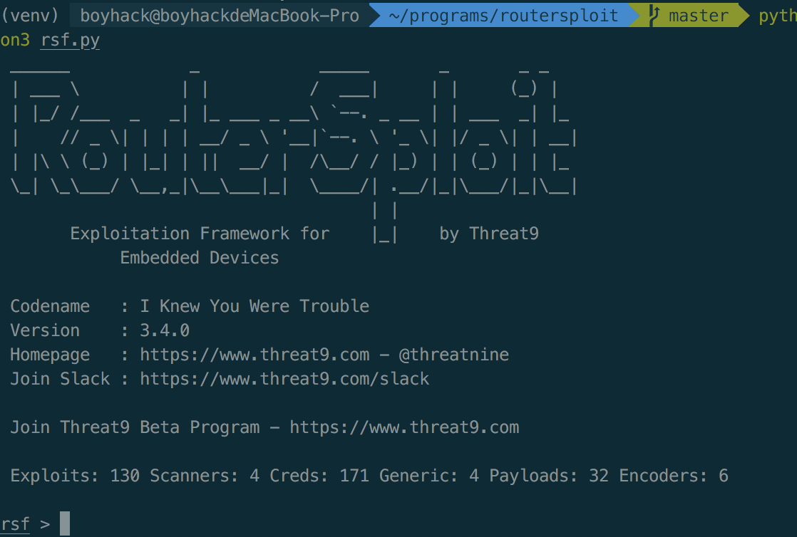
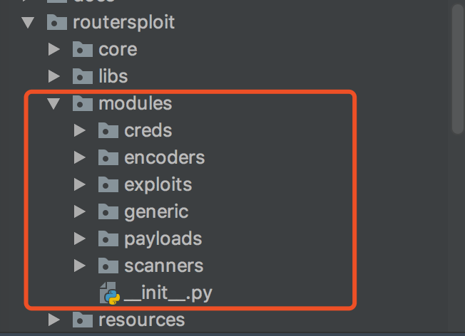

# routersploit 源码分析

> RouteSploit框架是一款开源的漏洞检测及利用框架，其针对的对象主要为路由器等嵌入式设备。

具体介绍可以看：https://www.freebuf.com/sectool/101441.html

routersploit的操作模式有点类似于msf，想看看是如何实现的

## Print

屏幕打印最后都定位到了这个函数
```python 
def __cprint(*args, **kwargs):
    """ Color print()

    Signature like Python 3 print() function
    print([object, ...][, sep=' '][, end='\n'][, file=sys.stdout])
    """
    if not kwargs.pop("verbose", True):
        return

    sep = kwargs.get("sep", " ")
    end = kwargs.get("end", "\n")
    thread = threading.current_thread()
    try:
        file_ = thread_output_stream.get(thread, ())[-1]
    except IndexError:
        file_ = kwargs.get("file", sys.stdout)

    printer_queue.put(PrintResource(content=args, sep=sep, end=end, file=file_, thread=thread))

```

它会把所有输出的内容加入到队列中
```python 
class PrinterThread(threading.Thread):
    def __init__(self):
        super(PrinterThread, self).__init__()
        self.daemon = True

    def run(self):
        while True:
            content, sep, end, file_, thread = printer_queue.get()
            print(*content, sep=sep, end=end, file=file_)
            printer_queue.task_done()

```

最后由这个线程读取输出。这种设计可能是为了防止多线程输出内容的时候线程抢占的问题。

最后还有一点，因为输出函数也是线程中的，所以在一些执行过程中会调用  
`printer_queue.join()`来先让打印输出完，精妙呀

## load module

遍历`modules`文件夹下面的文件,最后所有插件的文件名存放在一个list里面。
```python 
def index_modules(modules_directory: str = MODULES_DIR) -> list:
    """ Returns list of all exploits modules

    :param str modules_directory: path to modules directory
    :return list: list of found modules
    """

    modules = []
    for root, dirs, files in os.walk(modules_directory):
        _, package, root = root.rpartition("routersploit/modules/".replace("/", os.sep))
        root = root.replace(os.sep, ".")
        files = filter(lambda x: not x.startswith("__") and x.endswith(".py"), files)
        modules.extend(map(lambda x: ".".join((root, os.path.splitext(x)[0])), files))

    return modules

```

### 统计



banner中会统计有多少个poc

具体实现是：从模块中分离出文件夹的第一个名称作为统计数据  

```python 
self.modules_count = Counter()
self.modules_count.update([module.split('.')[0] for module in self.modules])

```

在后面打印banner的时候会用到
```python 
self.banner = """ ______            _            _____       _       _ _
 | ___ \\          | |          /  ___|     | |     (_) |
 | |_/ /___  _   _| |_ ___ _ __\\ `--. _ __ | | ___  _| |_
 |    // _ \\| | | | __/ _ \\ '__|`--. \\ '_ \\| |/ _ \\| | __|
 | |\\ \\ (_) | |_| | ||  __/ |  /\\__/ / |_) | | (_) | | |_
 \\_| \\_\\___/ \\__,_|\\__\\___|_|  \\____/| .__/|_|\\___/|_|\\__|
                                     | |
       Exploitation Framework for    |_|    by Threat9
            Embedded Devices

 Codename   : I Knew You Were Trouble
 Version    : 3.4.0
 Homepage   : https://www.threat9.com - @threatnine
 Join Slack : https://www.threat9.com/slack

 Join Threat9 Beta Program - https://www.threat9.com

 Exploits: {exploits_count} Scanners: {scanners_count} Creds: {creds_count} Generic: {generic_count} Payloads: {payloads_count} Encoders: {encoders_count}
""".format(exploits_count=self.modules_count["exploits"],
           scanners_count=self.modules_count["scanners"],
           creds_count=self.modules_count["creds"],
           generic_count=self.modules_count["generic"],
           payloads_count=self.modules_count["payloads"],
           encoders_count=self.modules_count["encoders"])

```

### 加载模块
```python
def import_exploit(path: str):
    """ Imports exploit module

    :param str path: absolute path to exploit e.g. routersploit.modules.exploits.asus_auth_bypass
    :return: exploit module or error
    """

    try:
        module = importlib.import_module(path)
        if hasattr(module, "Payload"):
            return getattr(module, "Payload")
        elif hasattr(module, "Encoder"):
            return getattr(module, "Encoder")
        elif hasattr(module, "Exploit"):
            return getattr(module, "Exploit")
        else:
            raise ImportError("No module named '{}'".format(path))

    except (ImportError, AttributeError, KeyError) as err:
        raise RoutersploitException(
            "Error during loading '{}'\n\n"
            "Error: {}\n\n"
            "It should be valid path to the module. "
            "Use <tab> key multiple times for completion.".format(humanize_path(path), err)
        )

```

不同类型的插件有不同的类名，这样加载的时候也好归类，不错的想法。

## 自动补全，shell上下文

这个主要依赖python的一个内置模块`readline`，可以实现自动补全和类似的上下文输出。参考 https://www.cnblogs.com/blitheG/p/8036630.html

## End

比较惊艳的是对一些插件的管理方式，每个插件都能分门别类放好，然后提供接口供调用，模仿msf的模式真的很好，以前很不喜欢这种方式调用，但是当插件越来越多的时候，这种管理方式确实是比较好的选择。

### Thinking

看完这个我的许多想法都冒出来了，比如我可以模仿它写一个poc框架，目前的poc框架大多数都是用命令行参数调用的，而用msf方式调用可以很好的管理和选择。然后还可以与我的airbug项目连通，poc框架还可以在线加载poc文件调用。
