# sqlmap 1.0源码解析

#  sqlmap1.0 源码解析 

> 前面学习了最初版本的sqlmap，了解了大概的注入流程，同时也知道了大概的sqlmap的结构，这次学习一下sqlmap1.0的源码，看看相比之前的注入流程变化了多少，相比之前的设计增加了哪些东西以及看看sqlmap代码结构设计精巧的地方。 

博主加：这篇文章已经写了好久了，但是发博客的话又要重写上传图片，太麻烦了。最近完成了博客升级计划中的本地记录提交，才有了此文~ 

##  环境 

git下载好源码后，可以方便查看记录 

  * git tag 查看版本 

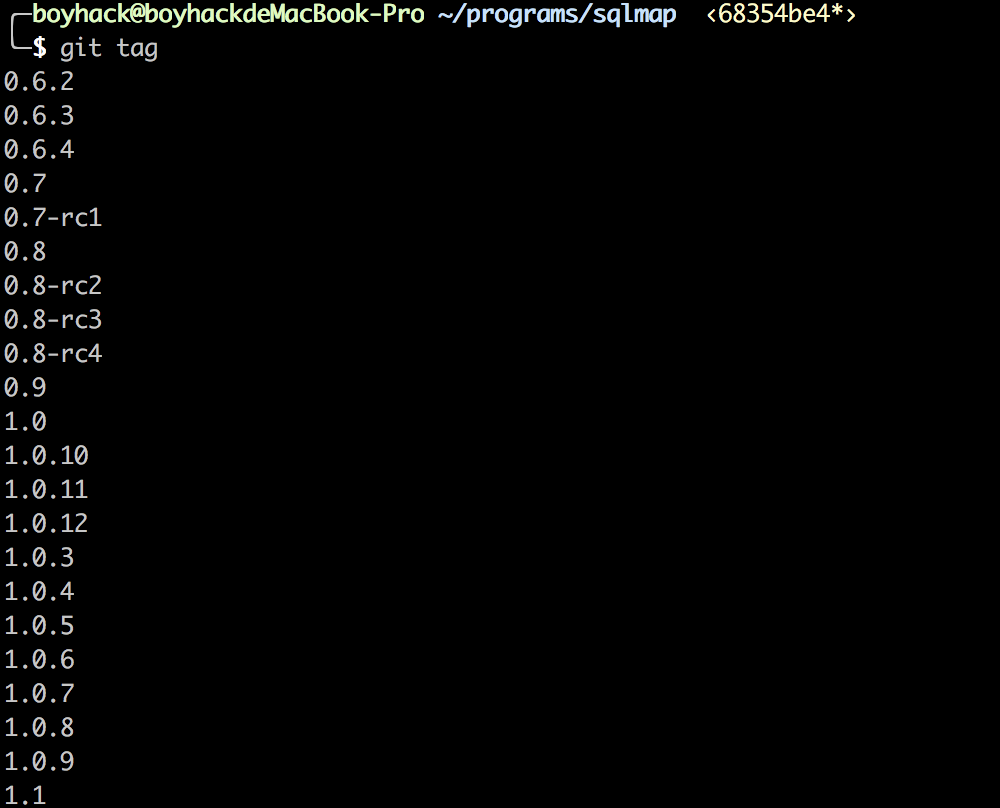

  * 然后用 git checkout 1.0 切换到1.0的版本 

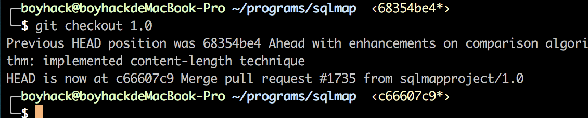

  * 编辑器使用的是vscode + python插件 


##  初步 

最直观的感受，相比最初的版本，sqlmap以及有了大致的雏形。目录也丰富了许多 

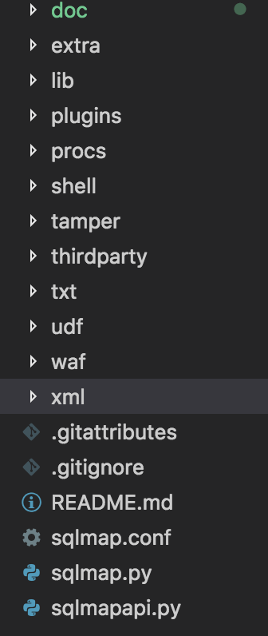

也加入了sqlmapapi，文件的数量和内容相比之前有了明显的增加，到底增加了什么呢，带着这个疑问，继续看源码。 

##  注入流程 

还是从sqlmap最精华的注入流程看起。启动流程和最初版本差不多，先检测各种变量，初始化各种变量，然后便“开始”了。为什么“开始”要打上引号呢，这其实是sqlmap中的一个`start()`函数,这个函数的作用是检测一个URL的稳定性，然后测试GET、POST、Cookie、和User-Agent参数是否动态和sql注入。 

在`start()`函数中，首先肯定是将这些要检测的数据(get参数、post参数、cookie等)分离出来，如果该链接中含有表单的话，还会询问你是否解析表单。 

接着会创建一些文件和数据库来存储这次结果。即`setupTargetEnv()`函数所做的，但具体存储哪些，没有细究，之后再看吧。 

接着检测连通性（`checkConnection()`函数所做的），就是访问一次网页，存储最初访问的时间和访问网页返回的数据。 

然后便检测waf了。 

###  WAF的检测 

既然到了WAF的检测，我们就好好说说这个。在这个版本`1.0`默认是不会检测waf的，需要加上`--identify-waf`才会检测。 

在初始化的时候，有一个函数专门用来加载`检测waf`的脚本。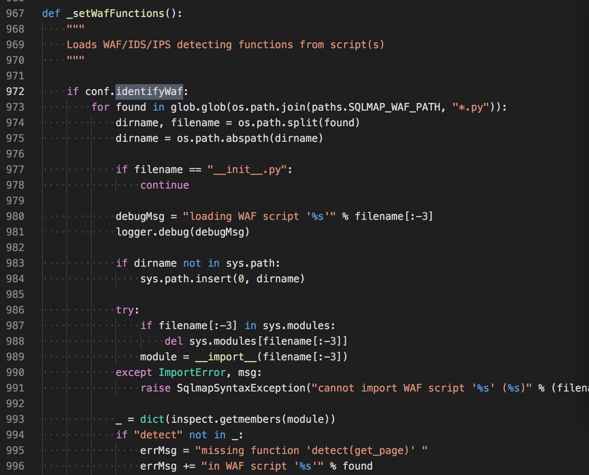

先遍历出waf目录下的py脚本，分离出目录名和文件名，排除`__init__.py`的文件名。若目录名不在python的环境变量下则加入进去且放到第一位，然后用`__import__`动态加载waf模块，和python中使用`import`原理类似，当然，引入的时候不能要`.py`这个后缀，所以用`[:-3]`来过滤掉。 

加载的模块会检测是否有`detect`这个函数，没有回抛出异常。简单来说，加载waf模块就这么几个步骤。 

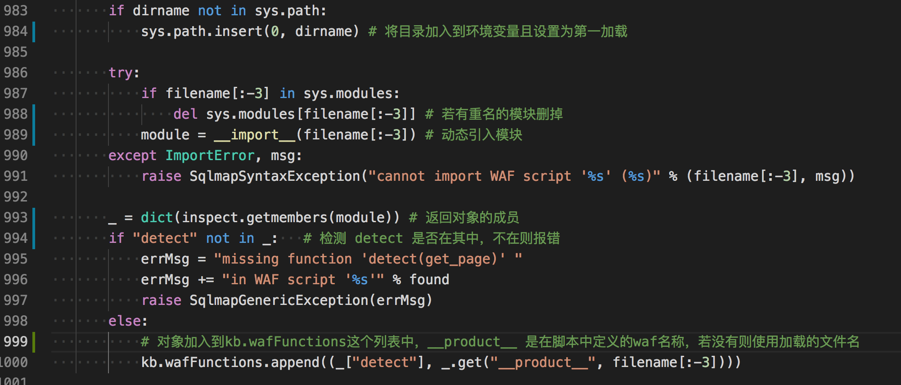

所以初始化的时候所有waf脚本就加载进来了，要使用的时候循环遍历脚本即可。 

附waf脚本demo -> 360.py 
```python 
#!/usr/bin/env python

"""
Copyright (c) 2006-2016 sqlmap developers (https://sqlmap.org/)
See the file 'doc/COPYING' for copying permission
"""

import re

from lib.core.settings import WAF_ATTACK_VECTORS

__product__ = "360 Web Application Firewall (360)"

def detect(get_page):
    retval = False

    for vector in WAF_ATTACK_VECTORS:
        _, headers, _ = get_page(get=vector)
        retval = re.search(r"wangzhan\.360\.cn", headers.get("X-Powered-By-360wzb", ""), re.I) is not None
        if retval:
            break

    return retval

```

看到这个脚本，我想就有几个问题需要我们解决了，首先`WAF_ATTACK_VECTORS`定义的是什么？ 

通过查看定义，得到了它的定义。 
```python 
# Payload used for checking of existence of IDS/WAF (dummier the better)
IDS_WAF_CHECK_PAYLOAD = "AND 1=1 UNION ALL SELECT 1,2,3,table_name FROM information_schema.tables WHERE 2>1-- ../../../etc/passwd"

# Vectors used for provoking specific WAF/IDS/IPS behavior(s)
WAF_ATTACK_VECTORS = (
                        "",  # NIL
                        "search=<script>alert(1)</script>",
                        "file=../../../../etc/passwd",
                        "q=<invalid>foobar",
                        "id=1 %s" % IDS_WAF_CHECK_PAYLOAD
                     )

```

`detect`函数的`get_page`参数是什么意思？ 

所以我们回到原点，查看检测waf函数（`identifyWaf()`）是怎么实现的。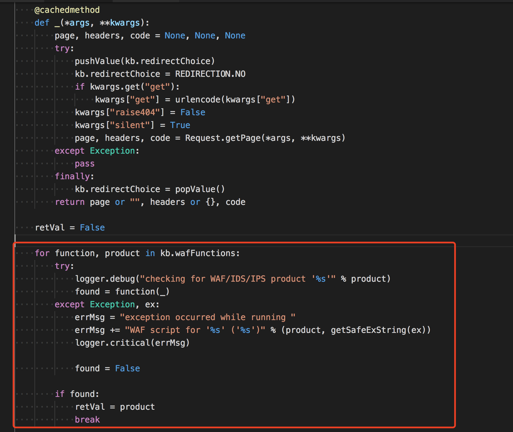

其实和我们想的差不多，循环遍历出函数，一个个来检测。注意到`found = function(_)` function是我们waf脚本定义的detect函数，`_`的定义在图的上方，其实是一个封装的网页访问函数。 

所以我们明白了作者的真正意思，waf脚本不断访问一些含有敏感字符的url，然后通过各自的检测方式来检测waf。 

网络访问函数`_`的上面用了`@cachedmethod`缓存装饰器，用来缓存访问的结果，来节省访问资源。 

###  检测url稳定性 

waf检测完后，如果之前没有发现注入点的话会检测网页是否”稳定”。sqlmap会在很短的两次时间内在访问一次url，与之前连通性测试时候作对比，如果页面一致则说明了url是稳定的，如果不一致还会进行比较（因为有时候同一页面会改变一些东西）。 

这里主要说一下两次访问页面不一致时，是如何比较的？ 

比较有三种方式，基于页面差异（默认），关键词，正则。关键词和正则比较很好理解，如果访问两次的页面里面含有关键词或者正则就可以判断该该页面是稳定的。 

基于页面差异的比较，通过判断两文本的差异度是否大于`0.98`。 

具体的比较算法，这里就不作赘述了，后面再说。 

###  检测参数的动态性 

检测哪些参数在初始化的时候就已经设置好了，比如get里面的，post里面的，cookie的，header头的。在参数后面加一个随机数字，若和连通性测试里面的模板一致，则说明页面相同，该参数不具有动态性。 

当然，为了效率着想，只有参数是”动态的”才具有检测的必要性。 

也是为了效率着想，动态的参数都会进行一次启发性测试(heuristicCheckSqlInjection),这个测试内容很简单，就是通过一些payload,找到报错信息。 

存在报错信息则’may be’注入点。 

如果注入点是数字型的，假设为id?=1,那么会使用id?=5-4来探测网站，若返回相同则确定为注入点。 

后面还会根据payload来探测是否存在xss和文件包含。 

  1. xss探测通过在参数中加入以下(通过随机字符生成) 
    ```python 
    # String used for dummy non-SQLi (e.g. XSS) heuristic checks of a tested parameter value
    DUMMY_NON_SQLI_CHECK_APPENDIX = "<'\">"
    ```

若返回结果中存在则判定。 

  1. 文件包含通过一个正则 
    ```python 
    (?i)[^\n]*(no such file|failed (to )?open)[^\n]*
    ```


###  真正的注入 

接下来进入到的函数`checkSqlInjection()`才是真正的注入检测。这里简述一下它的处理逻辑。 

首先会把要处理的payload和boundaries(边界值，用于闭合sql语句)加载进来，当然payload是有加载顺序的，union类型的payload最后加载，payload信息中含有details和dbms的第二第三加载。 

payload加载好后，如果数据库后端没有被检测到，会用“布尔盲注”来检测数据库。 

事先定义好了各个数据库特有的表 
```python 
FROM_DUMMY_TABLE = {
    DBMS.ORACLE: " FROM DUAL",
    DBMS.ACCESS: " FROM MSysAccessObjects",
    DBMS.FIREBIRD: " FROM RDB$DATABASE",
    DBMS.MAXDB: " FROM VERSIONS",
    DBMS.DB2: " FROM SYSIBM.SYSDUMMY1",
    DBMS.HSQLDB: " FROM INFORMATION_SCHEMA.SYSTEM_USERS",
    DBMS.INFORMIX: " FROM SYSMASTER:SYSDUAL"
}

```

然后只需要构造两个诸如: 
```text 
(SELECT 'abc' FROM DUAL)='abc' 
(SELECT 'abc' FROM DUAL)='abcd'

```

通过二者的正负关系来检测数据库。当然数据库类型检测并不是必须的，因为 sqlmap 实际工作中，如果没有指定 DBMS 则会按照当前测试 Payload 的对应的数据库类型去设置。 

实际上在各种 Payload 的执行过程中，会包含着一些数据库的推断信息(`<details>`)，如果 Payload 成功执行，这些信息可以被顺利推断则数据库类型就可以推断出来。 

接下来的事情就比较简单了，生成payload，然后用各种判断手段来判断是否成立。 

但是是如何生成的payload，怎么进行的判断，各种种类的注入类型是如何判断。所以这也不简单，可以说非常复杂。在解释这些之前，必须要说道sqlmap设计的payload数据，加载进来的payload不仅仅包含payload这一串文本，还会附带各种字段，作用即是辅助判断。所以这一切，都要从payload是如何加载以及生成说起。 

###  payload加载 

在初始化的时候sqlmap会加载xml目录下的boundaries.xml和xml/payload下的所有xml。 

xml/payload 下的xml是各种注入类型的具体语句。 

boundaries.xml 则是用于闭合注入的”边界”值。 

通过追踪，都是在最开始的`init()`函数的时候加载了进来。 

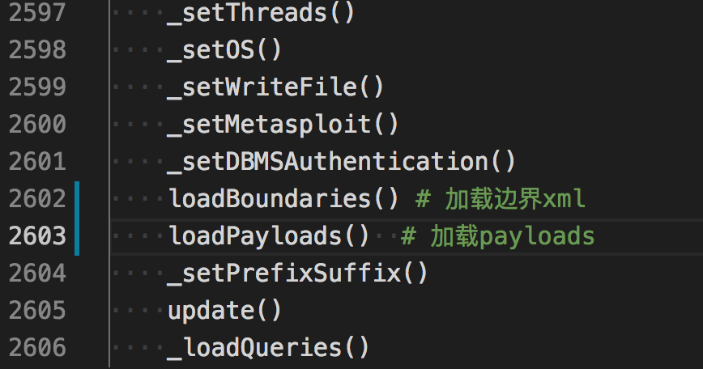

继续追踪这两个函数，主要就是解析xml各节点，然后appaend保存在`conf.boundaries`和`conf.tests`这两个变量中。 

奥，对了，（基于布尔、基于时间、基于错误、union、内联、堆叠）的payload，一般以`<test>`为结点，`<test>`具有特定漏洞的全部信息，包括漏洞的level、risk，漏洞类型，利用的方法，检测方法等。主要格式如下： 

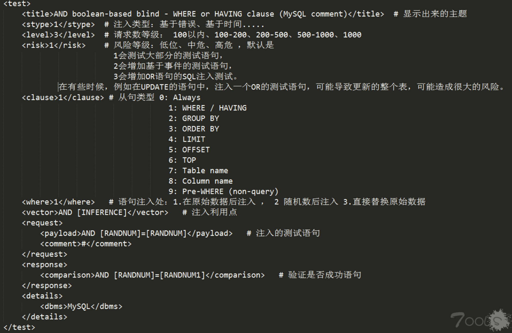

这些定义的payload格式，通过各种的算法组合，后面在通过和Boundary（边界）payload组合，最后通过和tamper(Bypass waf)变换一遍，得到最后的payload。当然，这节省略了这些细节部分，只保留大概的框架。一是这些内容比较思路复杂，各种变换让人眼花缭乱不好分析。二是大概的框架可以让读者了解了解大概的原理，在后面详细分析的部分，读者可自行选择看不看。 

###  Payload的执行 

在那些xml的节点中，payload会首先判断执行位置，就是语句注入的地方，在原始数据后注入，随机数后注入或者直接替换原始数据。然后如果定义了tamper的话就使用tamper函数对payload进行替换。 

开始注入： 

  1. 组合`<test>` `<request>`中的payload 

  2. 获得Templatm模板参考 

  3. 根据不同的注入类型中`<test>` `<response>`的结果判断。 

将结果判断代码折叠后就可以很容易分析其结构了。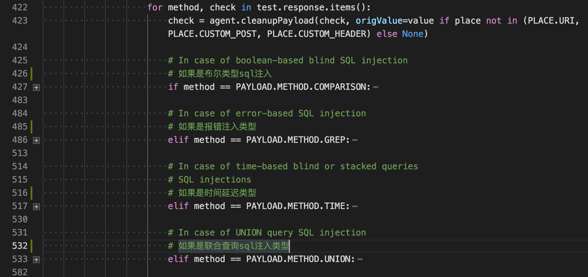

  4. 如果注入测试成功，就保存相关参数，打印输出。 


##  注入点的判断方式 

上面流程中已经提到，根据注入类型的不同（布尔注入、报错注入、延时注入、联合注入）有不同的检测方式。现在我们就来抽丝剥茧，看看检测方式的思路是怎样的。 

###  基于布尔类型的判断 

基于布尔类型的判断中，sqlmap会首先发起一个请求，来生成一个truePage,通过payload中`<response>` `<comparison>`存储的payload，类似于 `and 1=2`这种。 

然后又生成一个正确的页面(truePage),如果truePage存在且truePage!=falsePage,sqlmap会在生成一次falsePage请求，同上面的方式一样，在请求一遍，可能是确保falsePage存在的一些误差可能。 

这个判断如果没有成功，别慌，下面还有一个方法判断注入。 

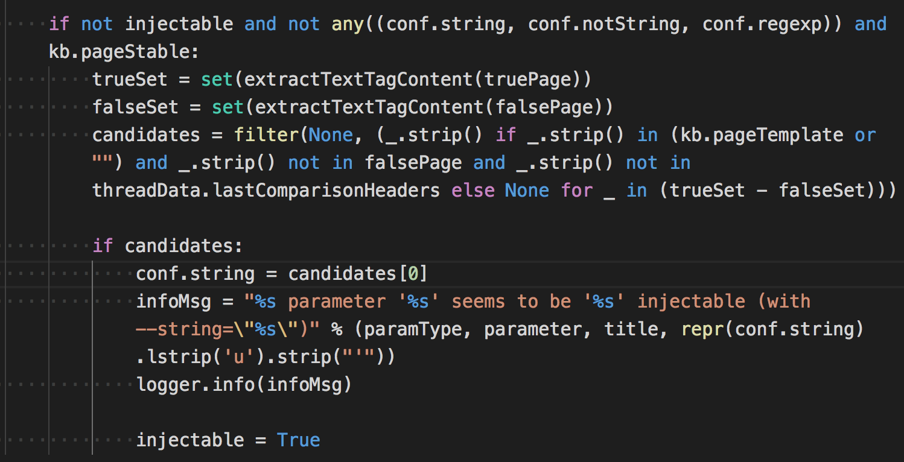

即提取truePage页面和falseTrue页面中的公共字符串，如果在truePage中存在而在false中不存在则会判断为注入点。 

是获取页面中的哪些字符串呢？我们转到`extractTextTagContent`这个函数看看。 

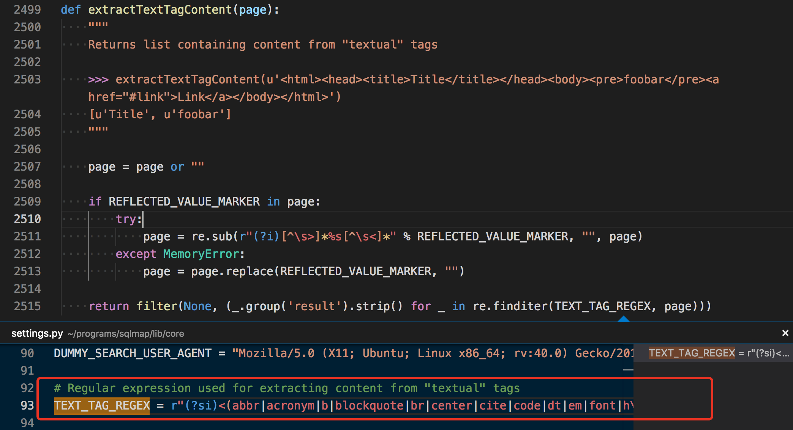

原来主要是根据正则获取这些字段中的信息啊~ 
```python 
TEXT_TAG_REGEX = r"(?si)<(abbr|acronym|b|blockquote|br|center|cite|code|dt|em|font|h\d|i|li|p|pre|q|strong|sub|sup|td|th|title|tt|u)(?!\w).*?>(?P<result>[^<]+)"

```

ps:这个正则设定的字段真是小巧精悍，刚开始我还在想为什么不包含a标签的内容，可能是觉得a标签包含了误差会很大，看了这些数据后觉得作者的经验很足啊~ 

###  基于报错类型的判断 

这个比较简单，我们找到一个报错注入类型的 payload。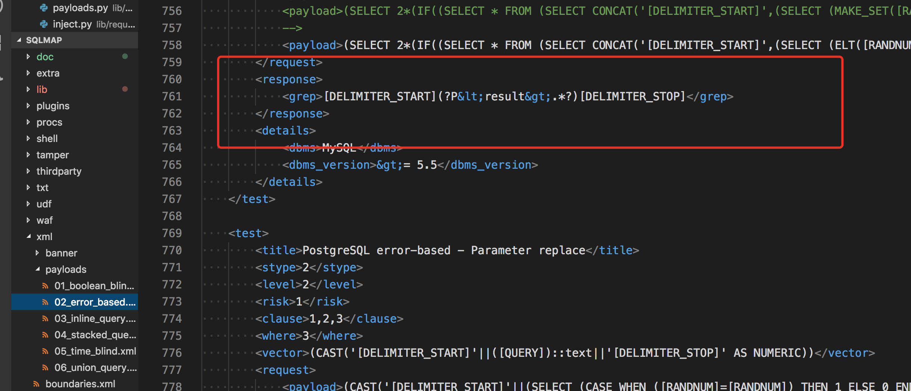

sqlmap基本上在页面/header头/重定向 信息中用正则检测这些内容。 

###  基于时间的注入 

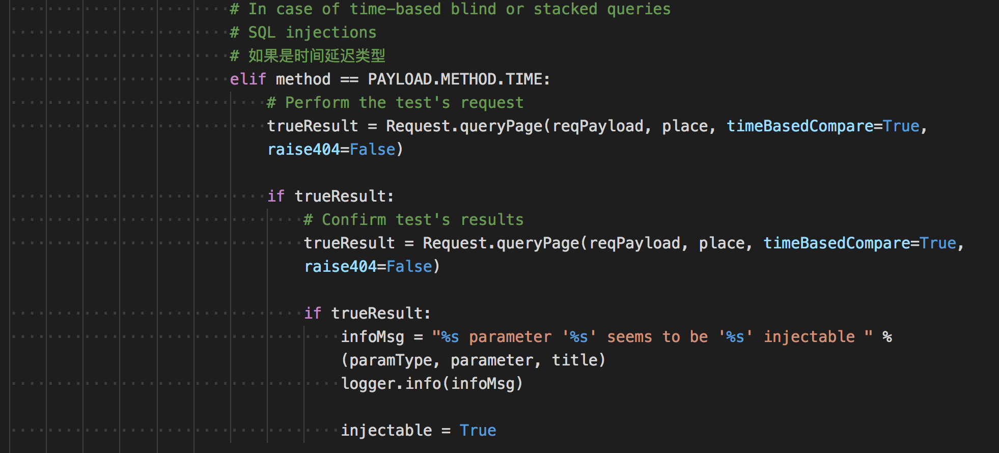

代码看起来简单，主要请求了payload页面，但是设定了一个参数`timeBasedCompare`，调到这个函数找到这个参数。不要觉得这个判断很简单，代码跟踪的时候差点晕了，还好看到了长亭老哥们的分析 https://zhuanlan.zhihu.com/p/45291193，逻辑才慢慢捋顺。

逻辑是这样的，当延时选项(timeBasedCompare)开启的时候，sqlmap会访问30次网页（当然，payload里一些字符随机，数字随机的参数都会变），然后存储和上一次访问的间隔，所以总共会保存有30次的时间间隔。你说为什么是30次？这是它定义的。 

30次访问完成后，通过一个数学公式(标准差)来处理数据。简单来说，一个一组数字做标准差，值越小说明数字之间间隔不大，值越大说明数字之间间隔大。 

根据注释和批注中的解释，设定一个最小 SLEEPTIME 应该至少大于 `样本内平均响应时间 + 7 * 样本标准差`，这样就可以保证过滤掉 `99.99%` 的无延迟请求。 

说道这里可能还是不太明白，我们在从延时注入的payload慢慢琢磨琢磨… 

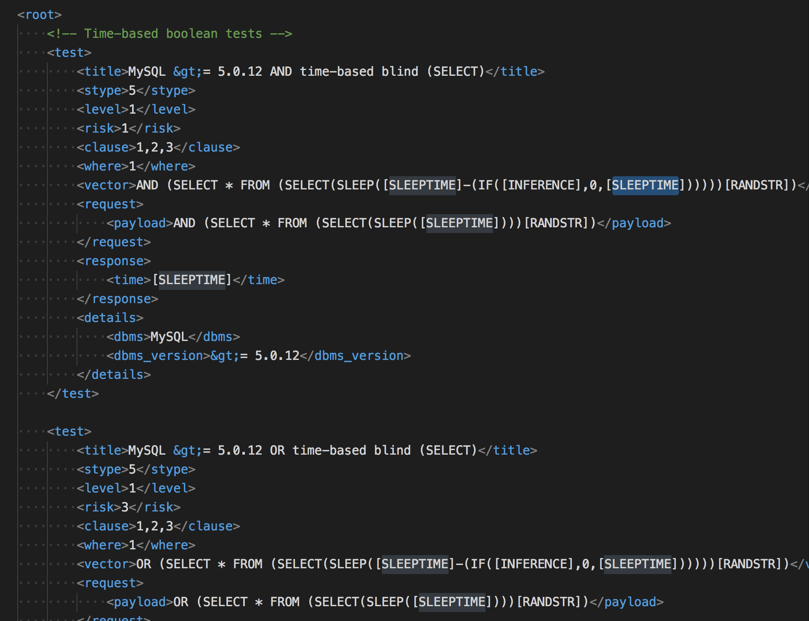

而 [SLEEPTIME] 是由conf.timeSec设定的 

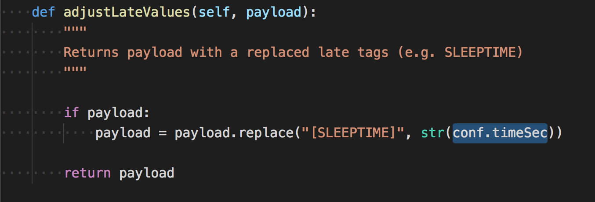

在sqlmap的定义中，timeSec初始为5 

当然，timeSec也会根据一些算法进行动态的调整。 

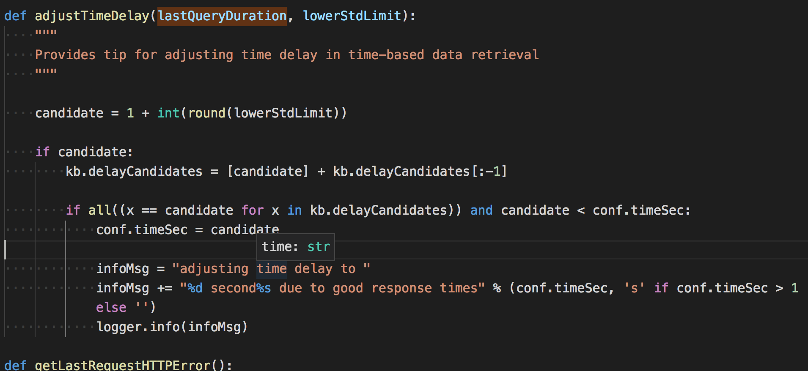

看到这里，不知道大家晕了没，我们在总结一下。 

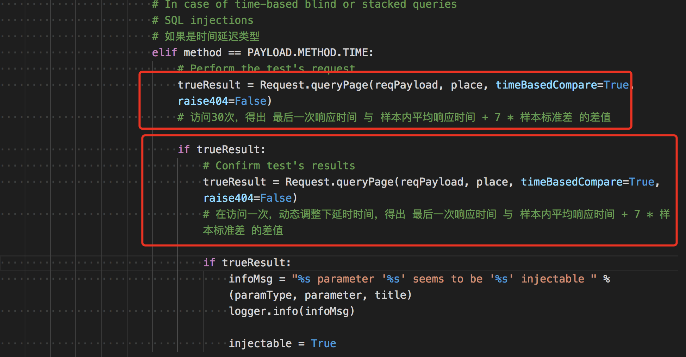

这样是不是就清楚多了？ 

###  基于union注入 

在sql注入中，union的注入前提需要知道列数是多少。然后根据列数一个个的找到输出位置。 

sqlmap也是分这两部进行的。sqlmap的union_query payload也比较特殊，基本上都是在原数据后面进行注入，而且注入语句基本上是为了确定列数，比如列数1-10是一个payload，21-03是一个payload。 

####  获取列数 

在使用第一个payload也就是使用列数1-10的payload的时候，还会使用order by 这个语句查找(其他payload不会！) 

order by的查询流程： 

  * 如果真order by 1成功和order by [四位字符]失败 

  * 成功失败判断的标准： 

    * 没有出现 warning|error|order by|failed 这些字样（这也太草率了？） 
    * 和标准模板对比相似度大于阈值 
    * 或者发现了`data types cannot be compared or sorted` 字样 
  * 如果确认`如果真order by 1成功和order by [四位字符]失败`,就会使用二分法找出列长度 


order by查询不出来？还有方案！ 

通过字段长度例如1~10，生成类似union select null,[N个]的语句，保存和模板的相似度作对比，找出对比最高的那个列长度 

####  定位输出 

将上文中的union select null,[N个]中的null换成随机访问检测这个字符串即可。但sqlmap设计是循环N次，意味着要请求N次网页才能将输出位置检测出来。 

我认为有更好的办法，依次将null换成`[randomstr][num]` randomstr为随机字符，num为依次的数字如1,2,3，这样只需要访问一次网页就可以定位出输出的位置了。 

##  注入点的利用 

注入点检测完毕后，进入到下一个阶段，注入点的利用。 

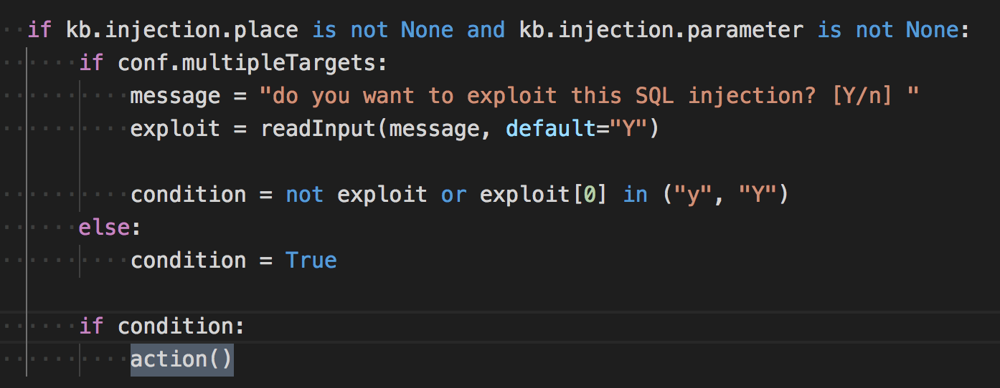

从代码中可以看到，如果选择y（want to exploit this sql injection），则会执行`action()`函数，这个函数就是后续利用的关键函数了。 

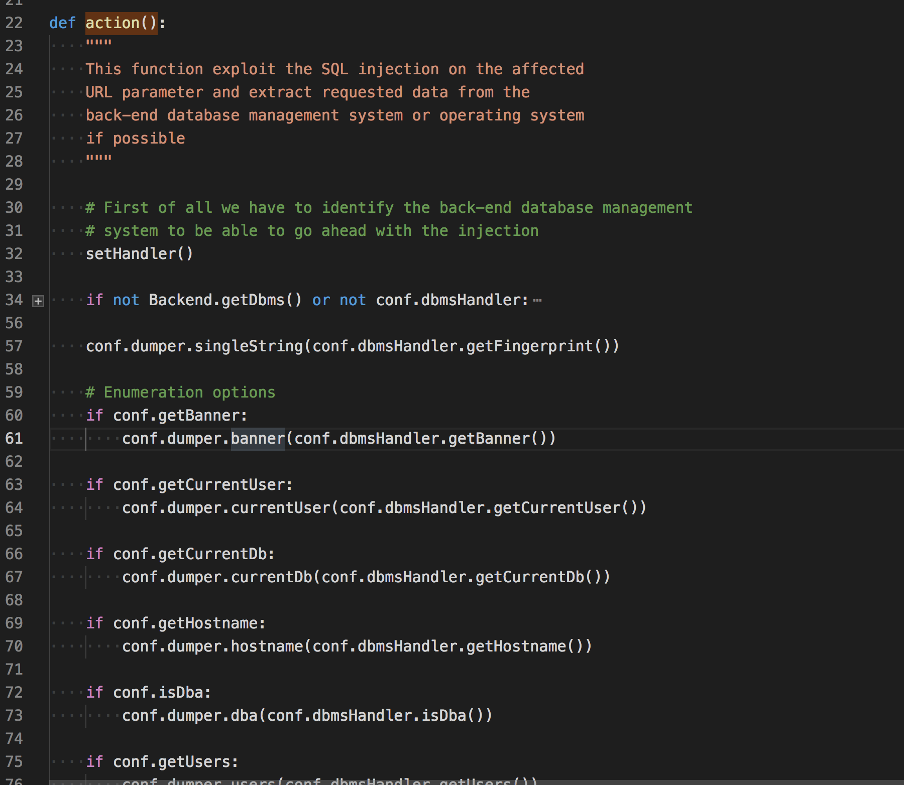

看到上面的注释，首先需要知道后端是什么数据库才能进行下一步的操作。 

###  识别数据库 

这里的识别数据库是为了利用注入点而识别，会先查找之前注入时候通过payload推理出来的数据库或者从报错页面中获取，但这只是参考，目的是在检测时把相关插件提前检测。 

真正的数据库检测和之前`0.6.2`版本一样，调用`plugin\dbms`下的插件来完成检测。 

###  数据库插件 

在`plugin\dbms`下的插件以数据库的名称命名。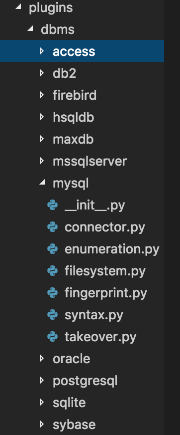

以`MySQL`数据库为例，下面包含了mysql数据库直连类`connector`、枚举信息、文件操作、指纹识别、接管等等操作。 

在`__init___.py`中继承这些类。 

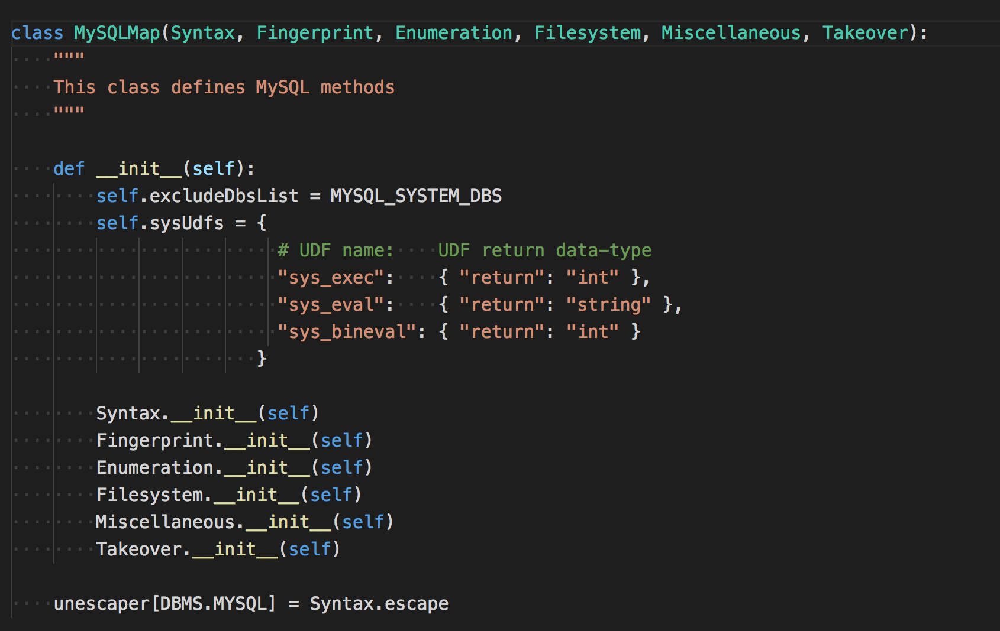

继续回到数据库检测函数，它会把这些插件全部都遍历一遍，逐个调用其中的 
```python 
if handler.checkDbms():
    conf.dbmsHandler = handler
    break
else:
    conf.dbmsConnector = None

```

checkDbms 方法，还是以MySQL为例，之前在`__init__.py`中就已经继承了指纹识别的类，所以我们就很容易找到他的函数定义了。 

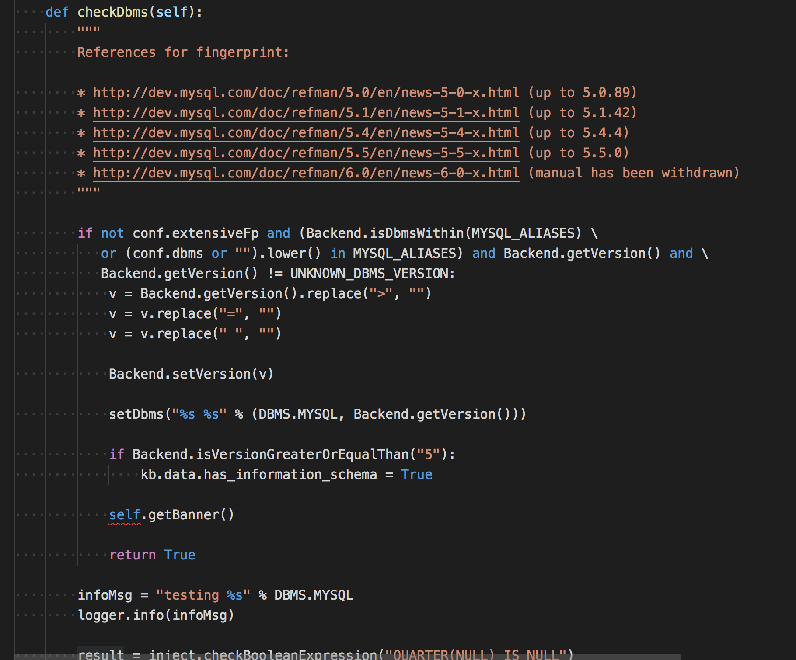

这是检测MySQL数据库的，每个数据库的检测函数都不会一样。 

我们简单看下是如何检测注入的。 

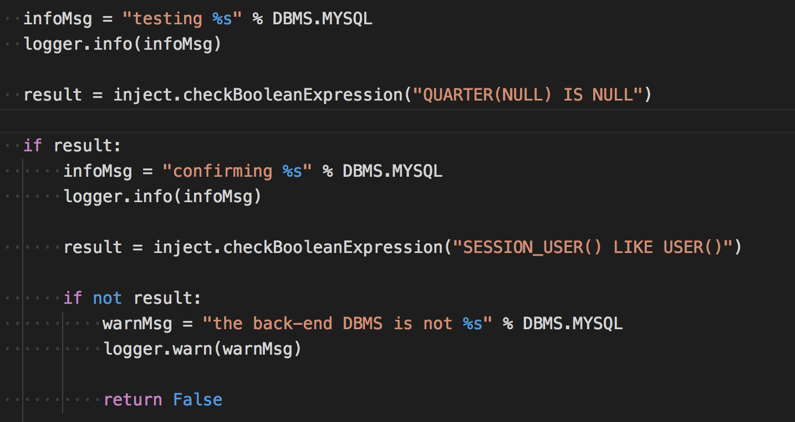

通过`QUARTER(NULL) IS NULL`语句用布尔盲注检测，后面是针对版本的检测，检测方式也大多是针对布尔盲注。 

这样数据库检测就介绍到这吧。 

###  数据的获取 

上面获取到数据库后有一个小细节， 
```python 
conf.dbmsHandler = handler

```

将数据库的接管函数赋给了`conf.dbmsHandler`

后面的一系列数据获取操作都是依靠它来完成。 

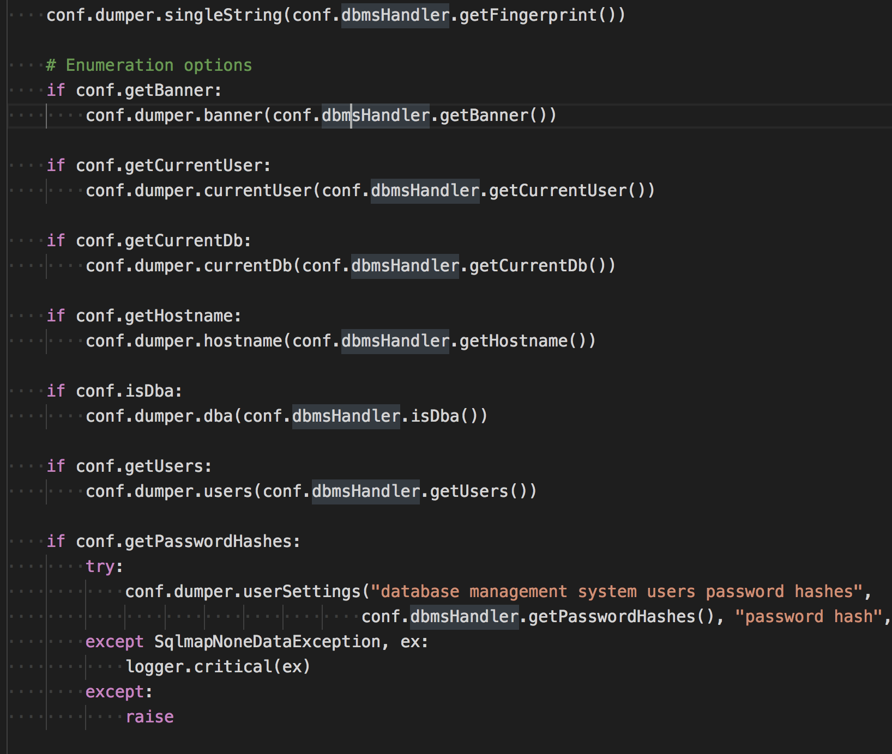

`conf.dumper`的定义在`lib/core/dump.py`中，主要是用来存储获取到的数据，方便打印和写日志。 

比如你想要获取当前用户的名称(以MySQL为例)，这段便生效了 
```python 
if conf.getCurrentUser:
    conf.dumper.currentUser(conf.dbmsHandler.getCurrentUser())

```

而conf.dbmsHandler.getCurrentUser() 实际上就是之前MySQL插件中的getCurrentUser() 

我们直接追到它的定义方法： 
```python 
def getCurrentUser(self):
        infoMsg = "fetching current user"
        logger.info(infoMsg)

        query = queries[Backend.getIdentifiedDbms()].current_user.query

        if not kb.data.currentUser:
            kb.data.currentUser = unArrayizeValue(inject.getValue(query))

        return kb.data.currentUser

```

原来它是获取`xml\queries.xml`这个文件中的字段进行的。我们便找到了这个字段的定义信息 
```xml 
<current_user query="CURRENT_USER()"/>

```

##  参考 

  * sqlmap内核分析3:核心逻辑

  * sqlmap 源码分析


