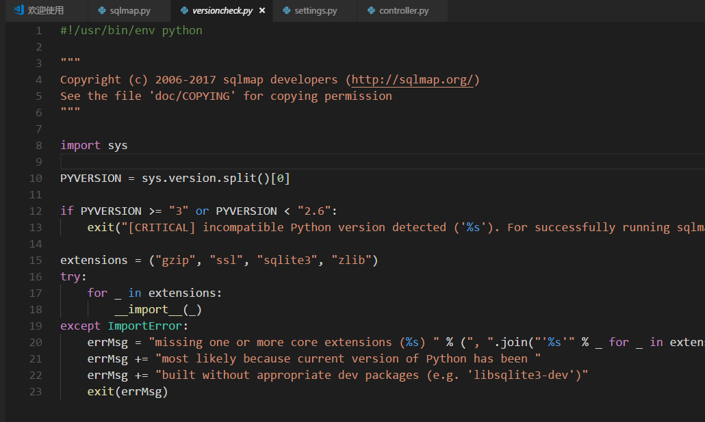
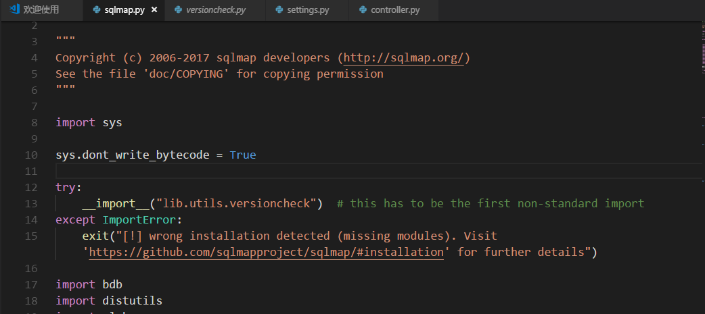
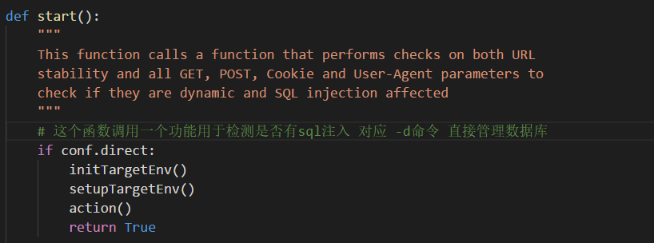

# sqlmap源码解析（五）

## 前言

由于好久都没有写这个系列了，之前自己看得代码都忘记了（都忘记看到哪里了）。最近想要对w9scan结构做下优化。所以跟着这篇文章 https://www.t00ls.net/thread-41863-1-1.html 再来看sqlmap源码

### 版本检测

初始化时python版本的检测 



然后在初始化时动态调用



这样保证了python版本必须为2.7，这样一想w9scan也有必要加上这个功能

### -d 参数详解



#### setupTargetEnv 函数
```
def setupTargetEnv():
    _createTargetDirs() # 创建输出目录
    _setRequestParams() # 检测并检测参数并检测post中的参数
    _setHashDB()
    _resumeHashDBValues()
    _setResultsFile()
_setAuthCred()

```

`SetRequestParams()`函数中的功能
``` 
# /lib/core/target.py 
if conf.data is not None:
    conf.method = HTTPMETHOD.POST if not conf.method or conf.method == HTTPMETHOD.GET else conf.method
    hintNames = []

    def process(match, repl):               
        retVal = match.group(0)         # 先取出整个字符串

        if not (conf.testParameter and match.group("name") not in conf.testParameter):  # 如果没有指定注入参数
            retVal = repl
            while True:
                _ = re.search(r"\\g<([^>]+)>", retVal)
                if _:
                    retVal = retVal.replace(_.group(0), match.group(int(_.group(1)) if _.group(1).isdigit() else _.group(1)))
                else:
                    break
            if kb.customInjectionMark in retVal:            # 如果有注入标记符
                hintNames.append((retVal.split(kb.customInjectionMark)[0], match.group("name")))
        return retVal

    # 如果data中有注入标记符(这里默认的就是*星号，可以用来指定注入位置)
    if kb.processUserMarks is None and kb.customInjectionMark in conf.data:         
        message = "custom injection marker ('%s') found in option " % kb.customInjectionMark
        message += "'--data'. Do you want to process it? [Y/n/q] "
        choice = readInput(message, default='Y').upper()

        if choice == 'Q':
            raise SqlmapUserQuitException
        else:
            kb.processUserMarks = choice == 'Y'

            if kb.processUserMarks:
                kb.testOnlyCustom = True

```

进入`action` 函数  
对应`lib/controller/action.py`
``` 
def action():
    # 这个函数利用sql注入漏洞获取数据库的各个功能

    """
    This function exploit the SQL injection on the affected
    URL parameter and extract requested data from the
    back-end database management system or operating system
    if possible
    """

    # First of all we have to identify the back-end database management
    # system to be able to go ahead with the injection

    # 首先我们必须判定后端数据库可以注入
    setHandler()

    if not Backend.getDbms() or not conf.dbmsHandler:
        htmlParsed = Format.getErrorParsedDBMSes()

        errMsg = "sqlmap was not able to fingerprint the "
        errMsg += "back-end database management system"

        if htmlParsed:
            errMsg += ", but from the HTML error page it was "
            errMsg += "possible to determinate that the "
            errMsg += "back-end DBMS is %s" % htmlParsed

        if htmlParsed and htmlParsed.lower() in SUPPORTED_DBMS:
            errMsg += ". Do not specify the back-end DBMS manually, "
            errMsg += "sqlmap will fingerprint the DBMS for you"
        elif kb.nullConnection:
            errMsg += ". You can try to rerun without using optimization "
            errMsg += "switch '%s'" % ("-o" if conf.optimize else "--null-connection")

        raise SqlmapUnsupportedDBMSException(errMsg)

    conf.dumper.singleString(conf.dbmsHandler.getFingerprint())

    # 枚举各选项
    if conf.getBanner:
        conf.dumper.banner(conf.dbmsHandler.getBanner())

    if conf.getCurrentUser:
        conf.dumper.currentUser(conf.dbmsHandler.getCurrentUser())

    if conf.getCurrentDb:
        conf.dumper.currentDb(conf.dbmsHandler.getCurrentDb())

    if conf.getHostname:
        conf.dumper.hostname(conf.dbmsHandler.getHostname())

    if conf.isDba:
        conf.dumper.dba(conf.dbmsHandler.isDba())

    if conf.getUsers:
        conf.dumper.users(conf.dbmsHandler.getUsers())

    if conf.getPasswordHashes:
        try:
            conf.dumper.userSettings("database management system users password hashes", conf.dbmsHandler.getPasswordHashes(), "password hash", CONTENT_TYPE.PASSWORDS)
        except SqlmapNoneDataException, ex:
            logger.critical(ex)
        except:
            raise

    if conf.getPrivileges:
        try:
            conf.dumper.userSettings("database management system users privileges", conf.dbmsHandler.getPrivileges(), "privilege", CONTENT_TYPE.PRIVILEGES)
        except SqlmapNoneDataException, ex:
            logger.critical(ex)
        except:
            raise

    if conf.getRoles:
        try:
            conf.dumper.userSettings("database management system users roles", conf.dbmsHandler.getRoles(), "role", CONTENT_TYPE.ROLES)
        except SqlmapNoneDataException, ex:
            logger.critical(ex)
        except:
            raise

    if conf.getDbs:
        conf.dumper.dbs(conf.dbmsHandler.getDbs())

    if conf.getTables:
        conf.dumper.dbTables(conf.dbmsHandler.getTables())

    if conf.commonTables:
        conf.dumper.dbTables(tableExists(paths.COMMON_TABLES))

    if conf.getSchema:
        conf.dumper.dbTableColumns(conf.dbmsHandler.getSchema(), CONTENT_TYPE.SCHEMA)

    if conf.getColumns:
        conf.dumper.dbTableColumns(conf.dbmsHandler.getColumns(), CONTENT_TYPE.COLUMNS)

    if conf.getCount:
        conf.dumper.dbTablesCount(conf.dbmsHandler.getCount())

    if conf.commonColumns:
        conf.dumper.dbTableColumns(columnExists(paths.COMMON_COLUMNS))

    if conf.dumpTable:
        conf.dbmsHandler.dumpTable()

    if conf.dumpAll:
        conf.dbmsHandler.dumpAll()

    if conf.search:
        conf.dbmsHandler.search()

    if conf.query:
        conf.dumper.query(conf.query, conf.dbmsHandler.sqlQuery(conf.query))

    if conf.sqlShell:
        conf.dbmsHandler.sqlShell()

    if conf.sqlFile:
        conf.dbmsHandler.sqlFile()

    # 用户自定义函数选项
    if conf.udfInject:
        conf.dbmsHandler.udfInjectCustom()

    # 文件系统选项
    if conf.rFile:
        conf.dumper.rFile(conf.dbmsHandler.readFile(conf.rFile))

    if conf.wFile:
        conf.dbmsHandler.writeFile(conf.wFile, conf.dFile, conf.wFileType)

    # 操作系统选项
    if conf.osCmd:
        conf.dbmsHandler.osCmd()

    if conf.osShell:
        conf.dbmsHandler.osShell()

    if conf.osPwn:
        conf.dbmsHandler.osPwn()

    if conf.osSmb:
        conf.dbmsHandler.osSmb()

    if conf.osBof:
        conf.dbmsHandler.osBof()

    # Windows registry options
    if conf.regRead:
        conf.dumper.registerValue(conf.dbmsHandler.regRead())

    if conf.regAdd:
        conf.dbmsHandler.regAdd()

    if conf.regDel:
        conf.dbmsHandler.regDel()

    # Miscellaneous options
    if conf.cleanup:
        conf.dbmsHandler.cleanup()

    if conf.direct:
        conf.dbmsConnector.close()

```

## 爬虫

sqlmap的爬虫模块主要—crawl这个参数有关，可以收集潜在的可能存在漏洞的连接，后面跟的参数是爬行的深度。crawl函数在爬虫模块`/lib/utils/crawler.py`中。代码就不进行列举了，简单的说明下就是Sqlmap会创建一个visited队列和一个value队列，然后进行爬行，先将页面的url通过正则、sitemap之后放入value队列（去重），然后将爬过了url放入visited队列（去重），每次爬行时都会先看看是否已经visited。

接下来是—forms，解析出页面的所有表单的功能实现。调用了/lib/core/common.py中的findPageForms()函数，而对于除了-u方式直接输入目标url的其他输入方式都采用先解析urls，再分别查表的方式

### 解析sitemap功能
```
def parseSitemap(url, retVal=None):
    global abortedFlag

    if retVal is not None:
        logger.debug("parsing sitemap '%s'" % url)

    try:
        if retVal is None:
            abortedFlag = False
            retVal = oset()

        try:
            content = Request.getPage(url=url, raise404=True)[0] if not abortedFlag else ""
        except httplib.InvalidURL:
            errMsg = "invalid URL given for sitemap ('%s')" % url
            raise SqlmapSyntaxException, errMsg

        for match in re.finditer(r"<loc>\s*([^<]+)", content or ""):
            if abortedFlag:
                break
            url = match.group(1).strip()
            if url.endswith(".xml") and "sitemap" in url.lower():
                if kb.followSitemapRecursion is None:
                    message = "sitemap recursion detected. Do you want to follow? [y/N] "
                    kb.followSitemapRecursion = readInput(message, default='N', boolean=True)
                if kb.followSitemapRecursion:
                    parseSitemap(url, retVal)
            else:
                retVal.add(url)

    except KeyboardInterrupt:
        abortedFlag = True
        warnMsg = "user aborted during sitemap parsing. sqlmap "
        warnMsg += "will use partial list"
        logger.warn(warnMsg)

return retVal

```
