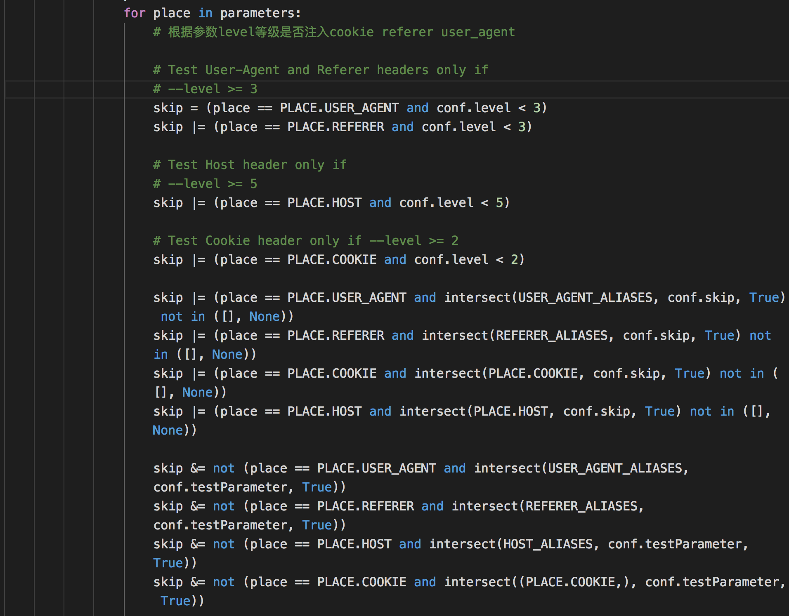

# sqlmap源码解析（六）sqlmap是如何检测注入的

前面五章一直都没有分析到主要的地方，今天有空，就写下sqlmap是如何检测注入，内在的检测逻辑是怎样的。 

之前的分析也有说过，sqlmap整个检测的开始是start()函数，所以一切都要从start()函数开始，在 
```js 
/sqlmap/lib/controller/controller.py
```

  

```js 
 """
    This function calls a function that performs checks on both URL
    stability and all GET, POST, Cookie and User-Agent parameters to
    check if they are dynamic and SQL injection affected
    这个函数功能是检测两个URL的稳定性，然后根据GET、POST、Cookie、和User-Agent参数
    去检测是否存在sql注入
    """

    # direct 对应 -d 命令，直接接管数据库
    if conf.direct:
        initTargetEnv()
        setupTargetEnv()
        action()
        return True

    if conf.url and not any((conf.forms, conf.crawlDepth)):
        # 添加目标
        kb.targets.add((conf.url, conf.method, conf.data, conf.cookie, None))

    # 判断，没有目标就会报错
    if conf.configFile and not kb.targets:
        errMsg = "you did not edit the configuration file properly, set "
        errMsg += "the target URL, list of targets or google dork"
        logger.error(errMsg)
        return False

    if kb.targets and len(kb.targets) > 1:
        infoMsg = "sqlmap got a total of %d targets" % len(kb.targets)
        logger.info(infoMsg)
```

  


函数比较长，我们挑选重要的分段讲解。上面代码的意思还是检测。后面太长就不列出来了，大概意义就是配置HTTP发包响应的各种参数。 

如果用户有输入参数设置的话，会设置各种参数。这里一一忽略 

  

```python
# 该函数主要包含3个子功能：
# 1.创建保存目标执行结果的目录和文件
# 2.将get或post发送的数据解析成字典形式，并保存到conf.paramDict中
# 3.读取session文件（如果存在的话），并提起文件中的数据，保存到kb变量中
setupTargetEnv()

if not checkConnection(suppressOutput=conf.forms) or not checkString() or not checkRegexp():
    continue

checkWaf() # 检测waf

if conf.identifyWaf:
    identifyWaf() # 识别waf
```

  
检测WAF，后面就测试网页的稳定性（查看参数是否是动态的） 

后面根据level等级确定注入的位置 



  


后面又经过了一大段判断代码，来到第一个判断注入的地方。 

  

```js 
# 简单的检测下数字型注入和一些其他漏洞
check = heuristicCheckSqlInjection(place, parameter)
```

这个函数翻译为中文为启发性注入检测，函数里面内容就是判断一下数字型注入，例如id=1这个参数会变成id=randINT+id-randINT，用两个页面的差异性来判断是否存在注入，如果两者相似度很高，则可以说明存在注入了。 

当然，这个参数里面也会用一些payload 来检测XSS和文件包含漏洞。 

接着来到了sqlmap检测的核心地方。 

  

```js 
 injection = checkSqlInjection(place, parameter, value)
```

这里是整个程序最核心的检测函数，函数在 `/lib/controller/checks.py `这个文件中。 

在往后，就是保存信息hash之类的东西了。所以，为了找到sqlmap是如何检测注入的，有必要到checks.py文件中去一探究竟。 

  


  

```python 
def checkSqlInjection(place, parameter, value):
    # Store here the details about boundaries and payload used to
    # successfully inject
    # 存储成功用过的boundaries 和 pyaload细节
    injection = InjectionDict()

    # Localized thread data needed for some methods
    # 局部现成数据为后面方法
    threadData = getCurrentThreadData()

    # Favoring non-string specific boundaries in case of digit-like parameter values
    # 在类似digit的参数值时，支持非特定于字符串的边界
    if value.isdigit():
        kb.cache.intBoundaries = kb.cache.intBoundaries or sorted(copy.deepcopy(conf.boundaries), key=lambda boundary: any(_ in (boundary.prefix or "") or _ in (boundary.suffix or "") for _ in ('"', '\'')))
        boundaries = kb.cache.intBoundaries
    elif value.isalpha():
        kb.cache.alphaBoundaries = kb.cache.alphaBoundaries or sorted(copy.deepcopy(conf.boundaries), key=lambda boundary: not any(_ in (boundary.prefix or "") or _ in (boundary.suffix or "") for _ in ('"', '\'')))
        boundaries = kb.cache.alphaBoundaries
    else:
        boundaries = conf.boundaries

    # Set the flag for SQL injection test mode
    kb.testMode = True

    paramType = conf.method if conf.method not in (None, HTTPMETHOD.GET, HTTPMETHOD.POST) else place
    tests = getSortedInjectionTests()
    # paramType是注入的类型,如GET。tests是要测试的列表，包含了每个测试项的名称，这些数据都是和/sqlmap/xml/payloads/目录下每个xml相对应的。

    seenPayload = set()

    kb.data.setdefault("randomInt", str(randomInt(10)))
    kb.data.setdefault("randomStr", str(randomStr(10)))

    while tests:
        test = tests.pop(0)

        try:
            if kb.endDetection:
                break

            if conf.dbms is None:
                # If the DBMS has not yet been fingerprinted (via simple heuristic check
                # or via DBMS-specific payload) and boolean-based blind has been identified
                # then attempt to identify with a simple DBMS specific boolean-based
                # test what the DBMS may be
                # 如果数据库管理系统还没有指纹(通过简单的启发式检查)
                # 或通过dbms特定的有效负载)和基于booleande的盲人已经被识别。
                # 然后尝试使用一个简单的基于sql的数据库管理系统
                # 测试什么是DBMS
                if not injection.dbms and PAYLOAD.TECHNIQUE.BOOLEAN in injection.data:
                    if not Backend.getIdentifiedDbms() and kb.heuristicDbms is None and not kb.droppingRequests:
                        kb.heuristicDbms = heuristicCheckDbms(injection) # 启发式检测DBms

                # If the DBMS has already been fingerprinted (via DBMS-specific
                # error message, simple heuristic check or via DBMS-specific
                # payload), ask the user to limit the tests to the fingerprinted
                # DBMS
                # 这里DBMS已经被识别出来了，询问用户是否测试别的DBS
                if kb.reduceTests is None and not conf.testFilter and (intersect(Backend.getErrorParsedDBMSes(), SUPPORTED_DBMS, True) or kb.heuristicDbms or injection.dbms):
                    msg = "it looks like the back-end DBMS is '%s'. " % (Format.getErrorParsedDBMSes() or kb.heuristicDbms or injection.dbms)
                    msg += "Do you want to skip test payloads specific for other DBMSes? [Y/n]"
                    kb.reduceTests = (Backend.getErrorParsedDBMSes() or [kb.heuristicDbms]) if readInput(msg, default='Y', boolean=True) else []

            # If the DBMS has been fingerprinted (via DBMS-specific error
            # message, via simple heuristic check or via DBMS-specific
            # payload), ask the user to extend the tests to all DBMS-specific,
            # regardless of --level and --risk values provided
            # 如果数据库管理系统已被指纹(通过特定于DBMS的错误)
            # 消息，通过简单的启发式检查或通过特定于dbms
            # ，要求用户将测试扩展到所有特定于dbms的测试，
            # 不考虑所提供的级别和风险值
            if kb.extendTests is None and not conf.testFilter and (conf.level < 5 or conf.risk < 3) and (intersect(Backend.getErrorParsedDBMSes(), SUPPORTED_DBMS, True) or kb.heuristicDbms or injection.dbms):
                msg = "for the remaining tests, do you want to include all tests "
                msg += "for '%s' extending provided " % (Format.getErrorParsedDBMSes() or kb.heuristicDbms or injection.dbms)
                msg += "level (%d)" % conf.level if conf.level < 5 else ""
                msg += " and " if conf.level < 5 and conf.risk < 3 else ""
                msg += "risk (%d)" % conf.risk if conf.risk < 3 else ""
                msg += " values? [Y/n]" if conf.level < 5 and conf.risk < 3 else " value? [Y/n]"
                kb.extendTests = (Backend.getErrorParsedDBMSes() or [kb.heuristicDbms]) if readInput(msg, default='Y', boolean=True) else []

            title = test.title
            kb.testType = stype = test.stype
            clause = test.clause
            unionExtended = False
            trueCode, falseCode = None, None

            if conf.httpCollector is not None:
                conf.httpCollector.setExtendedArguments({
                    "_title": title,
                    "_place": place,
                    "_parameter": parameter,
                })

            if stype == PAYLOAD.TECHNIQUE.UNION:
                # 会判断是不是union注入，这个stype就是payload文件夹下面xml文件中的stype，如果是union，就会进入，然后配置列的数量等。

                configUnion(test.request.char)

                if "[CHAR]" in title:
                    if conf.uChar is None:
                        continue
                    else:
                        title = title.replace("[CHAR]", conf.uChar)

                elif "[RANDNUM]" in title or "(NULL)" in title:
                    title = title.replace("[RANDNUM]", "random number")

                if test.request.columns == "[COLSTART]-[COLSTOP]":
                    if conf.uCols is None:
                        continue
                    else:
                        title = title.replace("[COLSTART]", str(conf.uColsStart))
                        title = title.replace("[COLSTOP]", str(conf.uColsStop))

                elif conf.uCols is not None:
                    debugMsg = "skipping test '%s' because the user " % title
                    debugMsg += "provided custom column range %s" % conf.uCols
                    logger.debug(debugMsg)
                    continue

                match = re.search(r"(\d+)-(\d+)", test.request.columns)
                if match and injection.data:
                    lower, upper = int(match.group(1)), int(match.group(2))
                    for _ in (lower, upper):
                        if _ > 1:
                            __ = 2 * (_ - 1) + 1 if _ == lower else 2 * _
                            unionExtended = True
                            test.request.columns = re.sub(r"\b%d\b" % _, str(__), test.request.columns)
                            title = re.sub(r"\b%d\b" % _, str(__), title)
                            test.title = re.sub(r"\b%d\b" % _, str(__), test.title)
```

  


sqlmap会根据下面的漏洞类型来生成payload检测注入。 

  


B: Boolean-based blind SQL injection（布尔型注入） 

E: Error-based SQL injection（报错型注入） 

U: UNION query SQL injection（可联合查询注入） 

S: Stacked queries SQL injection（可多语句查询注入） 

T: Time-based blind SQL injection（基于时间延迟注入）  

Q: inline_query(内联查询) 

  


到这里，sqlmap的生成payload流程已经清晰了，通过boundaries.xml来确定payload的前缀和后缀，然后通过上述技术从sqlmap/xml/payloads/中 

  


根据level等级获取payload最后组合成sqlmap发包用的payload。 
