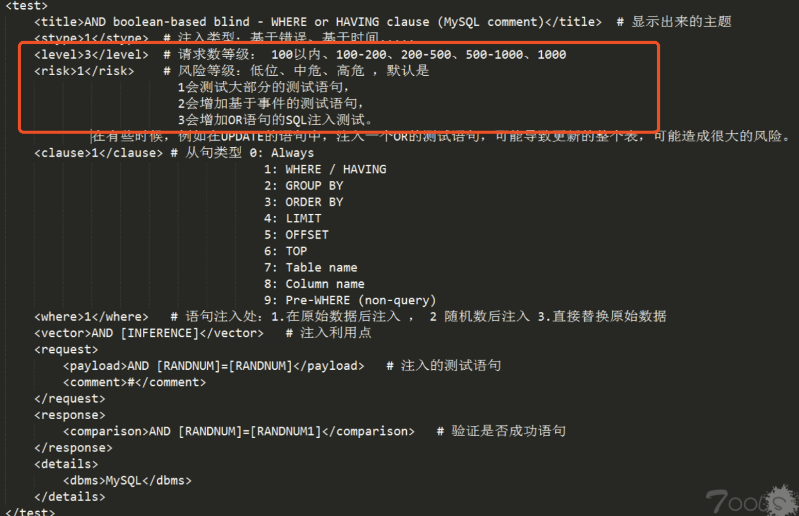
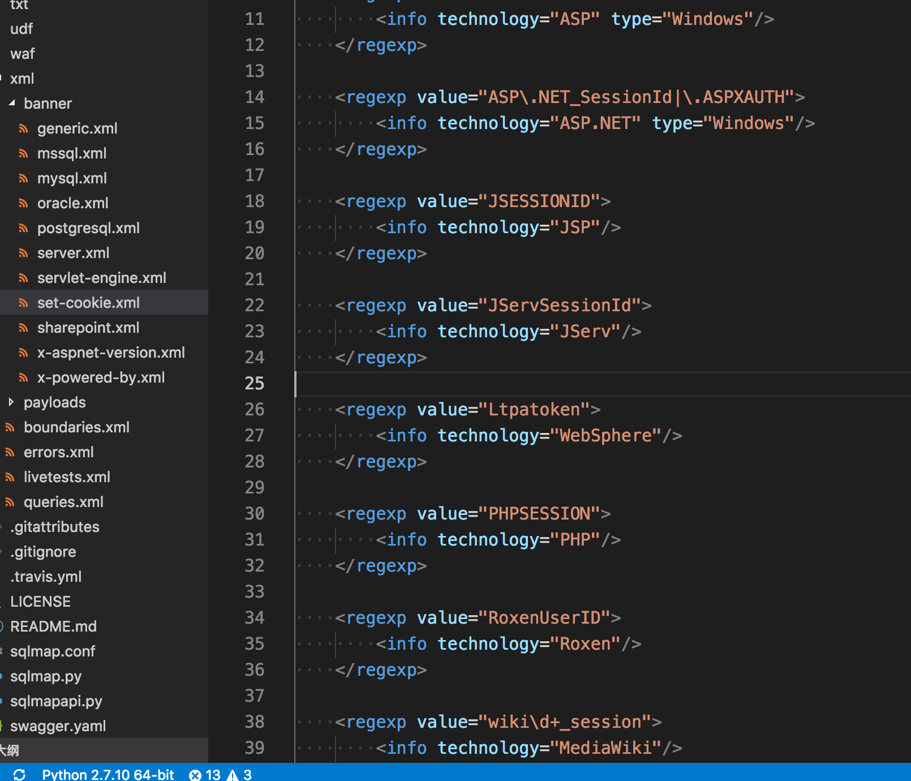
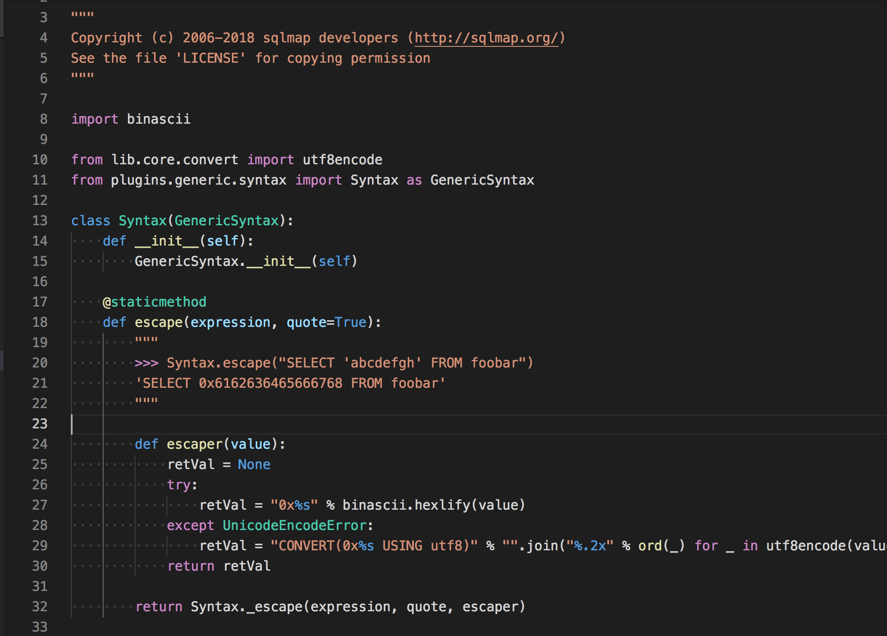
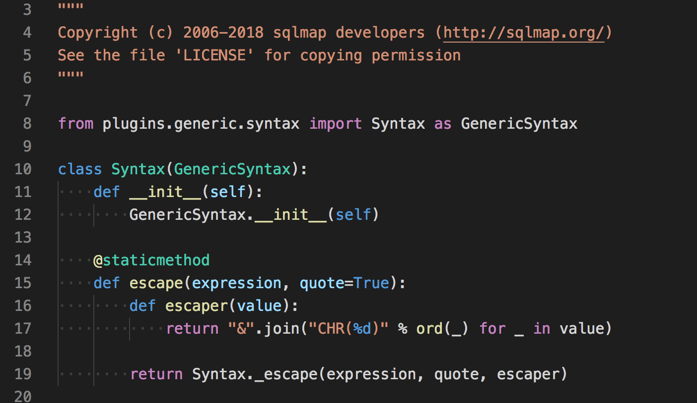

# sqlmap的一些技术细节(2)

​ 如果对一个sql注入工具打分，满分是100分，相信大家都可以写个工具达到60分，但想要接下来40分就需要比之前多几倍的努力，对于技术的追求，也不应只懂得泛泛，更应该精益求精。

## auth权限验证

首先在`sqlmap.conf`可以找到和auth权限验证的相关参数
```python 
# HTTP Authentication type. Useful only if the target URL requires
# HTTP Basic, Digest or NTLM authentication and you have such data.
# Valid: Basic, Digest, NTLM or PKI
authType = 

# HTTP authentication credentials. Useful only if the target URL requires
# HTTP Basic, Digest or NTLM authentication and you have such data.
# Syntax: username:password
authCred = 

# HTTP Authentication PEM private/cert key file. Useful only if the target URL requires
# PKI authentication and you have such data.
# Syntax: key_file
authFile =

```

支持basic,digest,NTLM 证书等权限验证

这个实现思路一想就可以想到，就是把这些东西存到一个全局变量，当然要访问网页的时候，封装一个统一的访问函数，然后在函数里判断一下就好了。但sqlmap似乎没有这样做。

有兴趣可以看一下`_setHTTPHandlers()`函数的实现，精简代码如下
```python 
handlers = filter(None, [multipartPostHandler, proxyHandler if proxyHandler.proxies else None, authHandler, redirectHandler, rangeHandler, httpsHandler])

opener = urllib2.build_opener(*handlers)
urllib2.install_opener(opener)

```

python2中urllib.urlopen()方法不支持验证、Cookie和其他高级操作，必须要使用`build_opener([handler1 [handler2, ...]])`来创建。`install_opener`则是作为`urlopen()`方法的全局实现。

所以sqlmap的思路是在初始化的时候，这些Handler都已经设置到全局设置好了，只需要调用urlopen就可以了。

也许这也是sqlmap只能扫描一个目标的理由之一？

## level、risk、verbose参数的意义

`--level` `--risk` `--verbose` 是用来干什么的？

`sqlmap.conf`对这些参数有详细的定义
```python 
# Level of tests to perform.
# The higher the value is, the higher the number of HTTP(s) requests are
# as well as the better chances to detect a tricky SQL injection.
# Valid: Integer between 1 and 5
# Default: 1
# 级别越高，发送的请求(payload)越多
level = 1

# Risk of tests to perform.
# Note: boolean-based blind SQL injection tests with AND are considered
# risk 1, with OR are considered risk 3.
# Valid: Integer between 1 and 3
# Default: 1
# 执行中的风险系数，1~3，级别越高，可能会使用'or'等等语句
risk = 1

# Verbosity level.
# Valid: integer between 0 and 6
# 0: Show only error and critical messages
# 1: Show also warning and info messages
# 2: Show also debug messages
# 3: Show also payloads injected
# 4: Show also HTTP requests
# 5: Show also HTTP responses' headers
# 6: Show also HTTP responses' page content
# Default: 1
# 级别越高，会在界面上显示更相信的调试信息，http请求信息
verbose = 1

```

level和risk在sqlmap的payloads数据中有相应字段。



实际运行中根据这些字段筛选出需要的payload即可。

## 启发式检测

关键词搜索`heuristic`会发现有两个启发式函数，什么叫启发式？根据维基百科的解释

> **启发法** （ _heuristics_ ，源自古希腊语的εὑρίσκω，又译作：策略法、助发现法、启发力、捷思法）是指依据有限的知识（或“不完整的信息”）在短时间内找到问题解决方案的一种技术。

### 启发式注入检测

  1. 在扫描前简单发些payload探测，通过一个sql报错的payload：`())’”(‘’”`随机生成组合,查找页面中的错误信息。

  2. 如果是数字型的，通过构造一个类似`2-1`的payload，来检测。  


```python 
# String used for dummy non-SQLi (e.g. XSS) heuristic checks of a tested parameter value
DUMMY_NON_SQLI_CHECK_APPENDIX = "<'\">"

```

顺便把XSS和FI也检测了。

主要是通过正则，如FI的检测正则
```python 
# Regular expression used for recognition of file inclusion errors
FI_ERROR_REGEX = r"(?i)[^\n]{0,100}(no such file|failed (to )?open)[^\n]{0,100}"

```

启发式的注入检测只能作为参考，例如数字型注入，用`2-1`这个payload，原本以为会文本比对一下和原始数据的差异性，但是并没有，只要能访问成功，就会对你说 ‘might be injectable ‘

但是如果后端对这个数字，用`intval()`限制了，sqlmap也会友好的提醒你。

具体当`2-1`失败的时候，在发送一个payload`1.4safzxc`,如果这个成功了，则说明使用`intval()`过滤了。

注意：`2-1`、`1.4safzxc`是我杜撰的，真正测试的时候由sqlmap随机生成

### 启发式检测数据库

函数名称叫做`heuristicCheckDbms()`
```python 
FROM_DUMMY_TABLE = {
    DBMS.ORACLE: " FROM DUAL",
    DBMS.ACCESS: " FROM MSysAccessObjects",
    DBMS.FIREBIRD: " FROM RDB$DATABASE",
    DBMS.MAXDB: " FROM VERSIONS",
    DBMS.DB2: " FROM SYSIBM.SYSDUMMY1",
    DBMS.HSQLDB: " FROM INFORMATION_SCHEMA.SYSTEM_USERS",
    DBMS.INFORMIX: " FROM SYSMASTER:SYSDUAL"
}

```

通过遍历上述字典的数据和布尔盲注的方式

使用`(SELECT 'randStr1' FROM DUAL)='randStr1'` 和 `(SELECT 'randStr1' FROM DUAL)='randStr2'`两个payload检测。

## 指纹识别

通过http header、cookie值得的特点，例如，cookie 值为 asp .net _sessionid对于asp.net/iis/windows平台是特定的。

这些数据保存在了`xml\banner`下

通过正则表达式来筛选。

## 数值字符逃逸

每个字符payload会自动escaoed，取决于目标数据库，例如，MySQL中 and username=“root” 会自动转码 username=0x726f6f74

在目录`plugins/dbms`下的’’数据库”目录，每个目录下面有一个`syntax.py`来处理这个。例如`plugins/dbms/mysql/syntax.py`



`plugins/dbms/access/syntax.py`



## 请求自定义python代码

有的链接比如 `http://xxx.com/?id=1&time=12312312313123`,这里time假设是当前时间戳，只需要使用`—eval=“import time as time2;time=time2.time()”`

sqlmap所有的网络请求会调用`queryPage`这个函数，具体实现也在这个函数里，关键词搜索`conf.evalCode`

evalCode每条语句用`;`结束，这并不是python的语法，所以会把所有`;`转换成`\n`

接着解析执行代码，这其中的异常处理很长，看来也是踩了不少坑 - -

## prefix 与 suffix

最近看到这篇文章中https://www.freebuf.com/articles/web/190356.html sqlmap的一些使用，引发了我的一些思考。

一个sql注入语句中例如，`select * from admin where username = 'admin' and password = 'xxxxx'`，通过网页中的一个参数user=admin带入，如果存在注入，你需要思考的就是如何构造一个完整的sql语句。例如你可以这样传入user= admin’ and 2=2 and 0=’ 

这样sql语句就变成了`select * from admin where username = 'admin' and 2=2 and 0='' and password = 'xxxxx'`

这其中，`admin'`便是前缀，`and 0='`便是后缀，中间`and 2=2`便是可以执行我们需要命令的地方。

sqlmap也是这样的模式，前缀后缀我们可以使用—prefix，—suffix来自定义，如果没有定义也没关系，sqlmap会根据`xml/boundaries.xml`中定义的数值来使用，也包含了大部分情况。

看完那篇文章页很有感触，最好的工具不是让它给你fuzz，而是知道其原理后辅助的使用。
