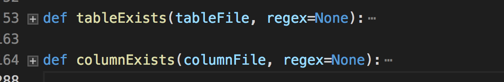

# sqlmap的一些技术细节(3)

这节试图讲解更深层次的东西。

## sqlmap哪些地方使用了多线程

多线程并发可以加快像IO密集型的操作，但是sqlmap哪里使用了多线程呢？是检测的时候？是查表的时候，还是…?带着这个疑问，有了接下来的分析。

sqlmap的一些技术细节(1)中已经分析了多线程是如何实现的，并将线程封装成了函数`runThreads`，所以只需要全局搜索这个函数就找到了多线程使用的地方。

按照场景来划分的话总共在三处找到了它的身影，分别在注入、爆破、爬虫中使用，所以下面三个小结分别介绍其功能。

### 爆破

定位到文件位置`lib/utils/brute.py`中的两处

根据函数名称可以猜测主要是爆破表和爆破表中的字段，具体的实现也比较简单，每个线程都会从字典中拿到一个内容来跑，字典是基于文件的，额外一提的是无论是检测表还是检测字段，sqlmap也会将原始网页中的一些字段设置为字典,具体看下面的函数实现就知道了。
```python 
def getPageWordSet(page):
    """
    Returns word set used in page content

    >>> sorted(getPageWordSet(u'<html><title>foobar</title><body>test</body></html>'))
    [u'foobar', u'test']
    """

    retVal = set()

    # only if the page's charset has been successfully identified
    if isinstance(page, unicode):
        retVal = set(_.group(0) for _ in re.finditer(r"\w+", getFilteredPageContent(page)))

    return retVal

```

### 爬虫

爬虫在抓取和搜集url的时候也是多线程的，sqlmap定义了一个`unprocessed`的set集合，多个线程从里面`取出(pop)`数据。

参考sqlmap的技术细节(1)中的线程设计章节，sqlmap对这些在底层实现了线程安全，所以对这些细节就不需要再考虑了。主要抓取规则也是根据`BeautifulSoup`来查找`<a>`标签进行的，判断url符合条件的规则就是查相同的Host。
```python 
def checkSameHost(*urls):
    """
    Returns True if all provided urls share that same host

    >>> checkSameHost('http://www.target.com/page1.php?id=1', 'http://www.target.com/images/page2.php')
    True
    >>> checkSameHost('http://www.target.com/page1.php?id=1', 'http://www.target2.com/images/page2.php')
    False
    """

    if not urls:
        return None
    elif len(urls) == 1:
        return True
    else:
        return all(re.sub(r"(?i)\Awww\.", "", urlparse.urlparse(url or "").netloc.split(':')[0]) == re.sub(r"(?i)\Awww\.", "", urlparse.urlparse(urls[0] or "").netloc.split(':')[0]) for url in urls[1:])

```

### 注入

多线程在注入中的用途肯定是加快读取数据的速度了，例如如果我们需要读取某个表里的内容，每次请求只能返回一行数据，所以需要根据这个取出长度然后在多线程中运行，sqlmap的设计是每个线程都分配一个id去取出对应的行的内容。

一个简单的理解是，你需要获取一个表中100条数据，在SQL注入的语句中你需要不停的用`limit 1,1`、`limit 2,1`、…、`limit 100,1`来限制读取哪一条。如果在sqlmap中，会先生成一个1~100的列表，每个线程都会从里面拿去一个num(这些都是线程安全的)，返回数据的时候也根据这个num顺序来插入到结果中，所以最后你看到的结果也会是顺序的。

顺便说一下，sqlmap会”智能”的分配线程数，例如此例子中，sqlmap会比较100和设置的线程数(默认是1)，取最小(挺智能的)。

## 页面相似度比较

前面有说道，在进行布尔盲注的时候，如何快速进行判断，通过两个网页之间的相似度判断。在sqlmap中也提到了这种匹配的方式`gestalt pattern matching(Ratcliff-Obershel palgorithm)`，通过Google得到它的定义

> # Ratcliff / Obershelp模式识别
> 
> （算法）
> 
> **定义：** 计算两个 _字符串_的相似度，即匹配字符数除以两个 _字符串_中的字符总数。匹配字符是 _最长公共子序列中的_字符加上递归地匹配最长公共子序列两侧的不匹配区域中的字符。

更完美的是，python自带的库`difflib/SequenceMatcher`实现了该算法。

通过搜索关键词`seqMatcher`可以找到几处比较的例子。

### 检测页面动态内容

这个标题其实是这个函数的字面意思。
```python 
def checkDynamicContent(firstPage, secondPage):
    """
    This function checks for the dynamic content in the provided pages
    """
    pass

```

很明显，作用就是比较两个页面的相似度，真正看它代码时发现不止于此。

  1. 首先会明确，如果其中一个页面长度超过了下列定义的值


```python 
# For preventing MemoryError exceptions (caused when using large sequences in difflib.SequenceMatcher)
MAX_DIFFLIB_SEQUENCE_LENGTH = 10 * 1024 * 1024

```

就不会进行比对的。

  1. 其次，如果相似度小于`0.98` （UPPER_RATIO_BOUND = 0.98），sqlmap会寻找两个页面的动态内容，并找到两个动态内容所共有的`前半部分`和`后半部分`。在接下来的请求中，会删除掉中间的动态内容，然后继续比较，直至相似度大于0.98为止。当然这种过滤也是有次数限制的，超过这个次数以后就不能使用这方法了。
  2. “检测页面动态内容”主要是在“检测页面稳定性”流程当中使用，“检测页面稳定性”是sqlmap在检查注入之前的一个过程，通过在一段时间内访问两次相同的网页，若相似度区别比较大，则通过“检测页面动态内容”来进行筛选。
  3. 所以这个函数并不是在注入中用到的，是在注入之前的“检测页面稳定性”当中使用到。


### sqlmap如何寻找动态的内容？

上文说道 

> sqlmap会寻找两个页面的动态内容，并找到两个动态内容所共有的`前半部分`和`后半部分`

于是定位到了`findDynamicContent`函数中，此函数的例子可以说明一切
```python 
>>> findDynamicContent("Lorem ipsum dolor sit amet, congue tation referrentur ei sed. Ne nec legimus habemus recusabo, natum reque et per. Facer tritani reprehendunt eos id, modus constituam est te. Usu sumo indoctum ad, pri paulo molestiae complectitur no.", "Lorem ipsum dolor sit amet, congue tation referrentur ei sed. Ne nec legimus habemus recusabo, natum reque et per. <script src='ads.js'></script>Facer tritani reprehendunt eos id, modus constituam est te. Usu sumo indoctum ad, pri paulo molestiae complectitur no.")
    >>> kb.dynamicMarkings
    [('natum reque et per. ', 'Facer tritani repreh')]

```

具体的算法懒得去看了，可以想象的意思是不断逼近动态值的前部和后部，各取20个长度的字符作为最后的结果。

### 实际注入中的相似度检查

上文的相似度判断都是“前戏”，没有在实际注入过程中发挥作用。实际注入过程中去获取相似度，会对移除页面的动态内容（检测稳定性中寻找到的），移除html标签等等,后面就是和前面一样，调用`seqMatcher`取值了。

### Null connection

  * 有时候相似度检测不需要获取整个内容，即可以用这种方法,参数中启用`--null-connection`

  * 三种方式来Null connection测试：HEAD Range skip-read

  * Range: bytes=-1

    * Content-Range: bytes 4789-4790/4780
  * HEAD /search.aspx HTTP/1.1

    * Content-Length: 4790
  * 这个时候相似度的计算公式就变为了
      ```python
      ratio = 1. * pageLength / len(kv.pageTemplate)
      if ratio > 1.:
          ratio = 1. / ratio
      ```


## Bug 自动报告机制

当出现了不知名的错误，sqlmap会使用sqlmapreport这个账号自动向github上提交issue,代码在`common.py`下的`createGithubIssue`函数中，这个很值得学习呀，主要通过github的API实现。

在提交的时候会寻找是否有类似的问题已经提交了，这也是一个 不错的设计。

## 总结

看sqlmap的代码是痛苦的，本文憋了两周，消耗了无数“头部结缔组织”才明白sqlmap大致意思。

sqlmap的代码耦合性太高了，但一般我们说代码耦合性越低越好。sqlmap源码值得学习，但是这种耦合性千万不要学。。 - =

## 参考

https://zhuanlan.zhihu.com/p/44157153
