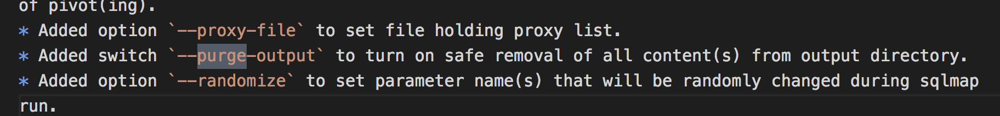
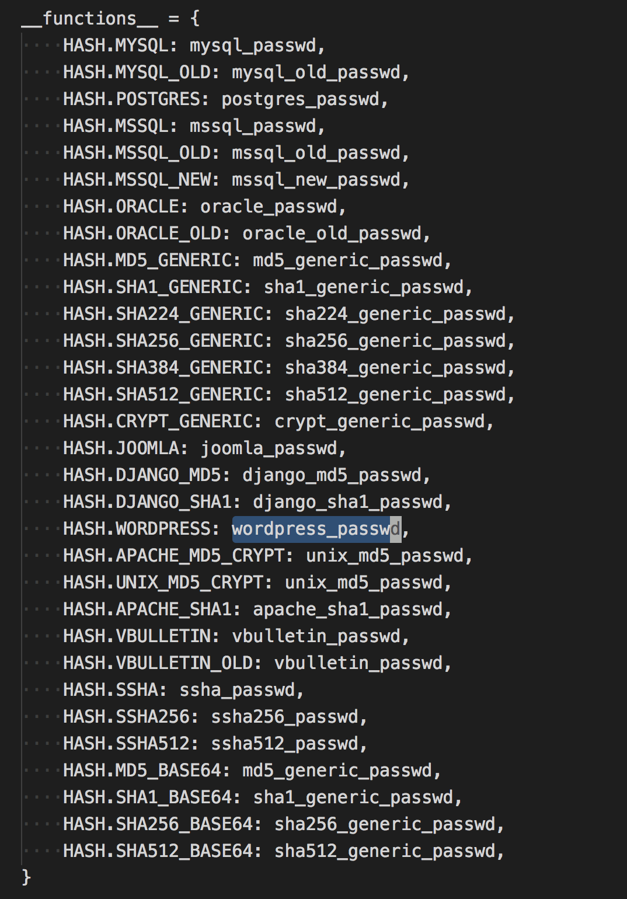

# sqlmap的一些技术细节(4)

好久都没有更新这个系列，觉得自己应该把这件事做完。 

##  安全删除文件 

sqlmap的changelog有一条挺有趣的。 



安全的删除output文件夹，来看看他是如何安全删除的。需要使用`--purge`这个命令使用，我们就直接看代码了。 

代码实现在`lib/utils/purge.py`，主要分为这么几部 
```python 
# 遍历文件
for rootpath, directories, filenames in os.walk(directory):
    dirpaths.extend(os.path.abspath(os.path.join(rootpath, _)) for _ in directories)
    filepaths.extend(os.path.abspath(os.path.join(rootpath, _)) for _ in filenames)

# 修改文件属性
logger.debug("changing file attributes")
    for filepath in filepaths:
        try:
            os.chmod(filepath, stat.S_IREAD | stat.S_IWRITE)
        except:
            pass

# 写入随机文件
for filepath in filepaths:
    try:
        filesize = os.path.getsize(filepath)
        with open(filepath, "w+b") as f:
            f.write("".join(chr(random.randint(0, 255)) for _ in xrange(filesize)))
    except:
    pass

# 截断文件
for filepath in filepaths:
    try:
        with open(filepath, 'w') as f:
            pass
    except:
        pass

# 重命名文件
logger.debug("renaming filenames to random values")
for filepath in filepaths:
    try:
        os.rename(filepath, os.path.join(os.path.dirname(filepath),"".join(random.sample(string.ascii_letters, random.randint(4, 8)))))
    except:
        pass

dirpaths.sort(cmp=lambda x, y: y.count(os.path.sep) - x.count(os.path.sep))

# 重命名文件夹
...

# 最终删除整个文件夹
...

```

如此，删除完文件将不可恢复。 

##  密码碰撞 

sqlmap是支持将注入出来的密文自动碰撞的，整个相关代码在`lib/utils/hash.py`，大概支持以下类型的碰撞 



###  自动分析密码 

sqlmap在爆破跑密码之前当然需要分析密码的类型，如何确定密码类型的呢？其实很简单，在文件`lib/core/enums.py`中定义了如下枚举 
```python 
class HASH:
    MYSQL = r'(?i)\A\*[0-9a-f]{40}\Z'
    MYSQL_OLD = r'(?i)\A(?![0-9]+\Z)[0-9a-f]{16}\Z'
    POSTGRES = r'(?i)\Amd5[0-9a-f]{32}\Z'
    MSSQL = r'(?i)\A0x0100[0-9a-f]{8}[0-9a-f]{40}\Z'
    MSSQL_OLD = r'(?i)\A0x0100[0-9a-f]{8}[0-9a-f]{80}\Z'
    MSSQL_NEW = r'(?i)\A0x0200[0-9a-f]{8}[0-9a-f]{128}\Z'
    ORACLE = r'(?i)\As:[0-9a-f]{60}\Z'
    ORACLE_OLD = r'(?i)\A[0-9a-f]{16}\Z'
    MD5_GENERIC = r'(?i)\A[0-9a-f]{32}\Z'
    SHA1_GENERIC = r'(?i)\A[0-9a-f]{40}\Z'
    SHA224_GENERIC = r'(?i)\A[0-9a-f]{56}\Z'
    SHA256_GENERIC = r'(?i)\A[0-9a-f]{64}\Z'
    SHA384_GENERIC = r'(?i)\A[0-9a-f]{96}\Z'
    SHA512_GENERIC = r'(?i)\A[0-9a-f]{128}\Z'
    CRYPT_GENERIC = r'\A(?!\d{1,3}\.\d{1,3}\.\d{1,3}\.\d{1,3}\Z)(?![0-9]+\Z)[./0-9A-Za-z]{13}\Z'
    JOOMLA = r'\A[0-9a-f]{32}:\w{32}\Z'
    WORDPRESS = r'\A\$P\$[./0-9a-zA-Z]{31}\Z'
    APACHE_MD5_CRYPT = r'\A\$apr1\$.{1,8}\$[./a-zA-Z0-9]+\Z'
    UNIX_MD5_CRYPT = r'\A\$1\$.{1,8}\$[./a-zA-Z0-9]+\Z'
    APACHE_SHA1 = r'\A\{SHA\}[a-zA-Z0-9+/]+={0,2}\Z'
    VBULLETIN = r'\A[0-9a-fA-F]{32}:.{30}\Z'
    VBULLETIN_OLD = r'\A[0-9a-fA-F]{32}:.{3}\Z'
    SSHA = r'\A\{SSHA\}[a-zA-Z0-9+/]+={0,2}\Z'
    SSHA256 = r'\A\{SSHA256\}[a-zA-Z0-9+/]+={0,2}\Z'
    SSHA512 = r'\A\{SSHA512\}[a-zA-Z0-9+/]+={0,2}\Z'
    DJANGO_MD5 = r'\Amd5\$[^$]+\$[0-9a-f]{32}\Z'
    DJANGO_SHA1 = r'\Asha1\$[^$]+\$[0-9a-f]{40}\Z'
    MD5_BASE64 = r'\A[a-zA-Z0-9+/]{22}==\Z'
    SHA1_BASE64 = r'\A[a-zA-Z0-9+/]{27}=\Z'
    SHA256_BASE64 = r'\A[a-zA-Z0-9+/]{43}=\Z'
    SHA512_BASE64 = r'\A[a-zA-Z0-9+/]{86}==\Z'

```

通过正则表达式就可以确定密码类型了，不过能确定这么多类型，确实很厉害！ 

###  多进程爆破 

众所周知，由于python GIL锁的原因，python线程一直伪线程，特别对于计算密集型的需求，想完全发挥多核的能力，需要开启多个进程。 

sqlmap按照加密类型分为两类，有salt和无salt。 
```python 
if _multiprocessing.cpu_count() > 1:
    infoMsg = "starting %d processes " % _multiprocessing.cpu_count()
    singleTimeLogMessage(infoMsg)

    gc.disable()

    retVal = _multiprocessing.Queue()
    count = _multiprocessing.Value('i', _multiprocessing.cpu_count())

    for i in xrange(_multiprocessing.cpu_count()):
        process = _multiprocessing.Process(target=_bruteProcessVariantA, args=(attack_info, hash_regex, suffix, retVal, i, count, kb.wordlists, custom_wordlist, conf.api))
        processes.append(process)

        for process in processes:
            process.daemon = True
            process.start()

            while count.value > 0:
                time.sleep(0.5)

```

不知道为什么，这个代码实现了两次，理论上应该可以复用的。 

##  End 

先说这么多吧，最后一节讲讲backdoor和takeover相关的 
