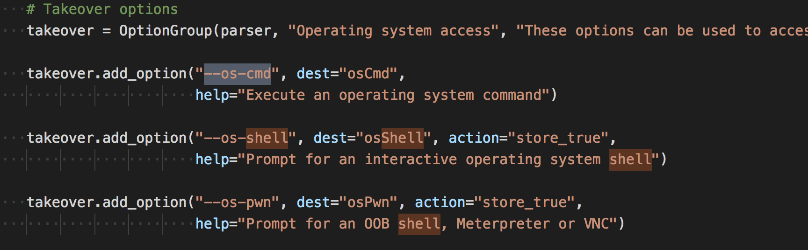
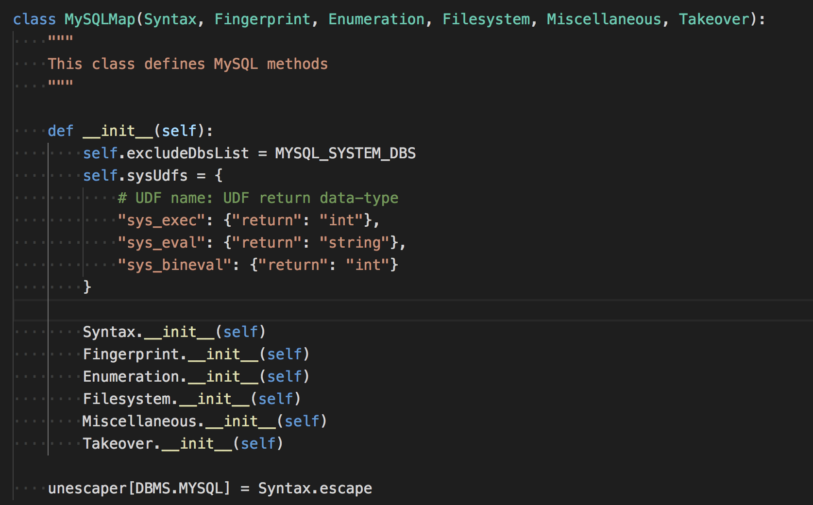
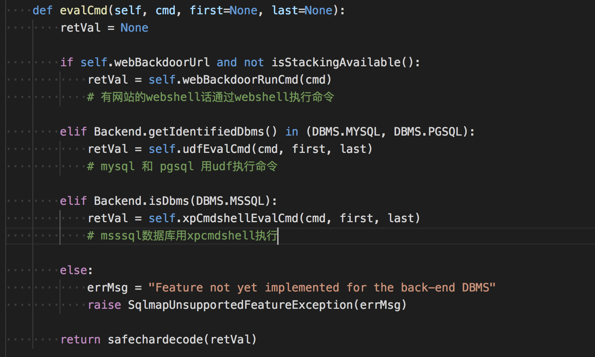
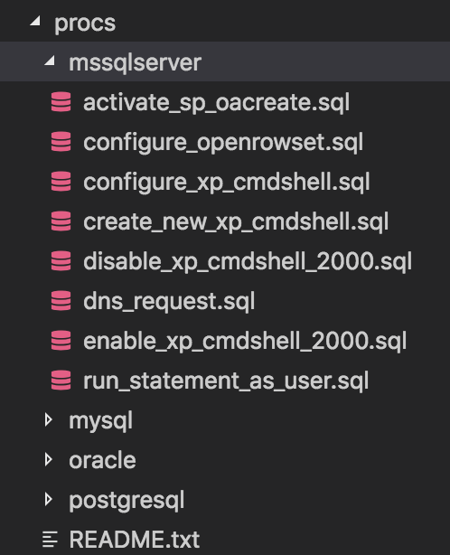
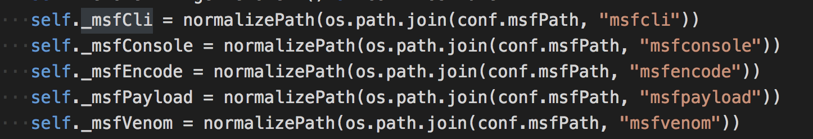
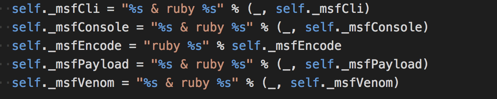

# sqlmap的一些技术细节(5)

这个周末，最后的命令执行，后门，接管系列分析完成~

# 命令执行

sqlmap有下面命令
```bash 
--os-cmd=id # 执行系统命令
--os-shell # 系统交互shell
--os-pwn # 反弹shell

```

我们看看sqlmap是如何通过来接管系统的。

## 流程

先理顺相关的流程，直接看代码追踪把。

先是cmd参数



然后在`lib/controller/action.py`中会有处理
```python 
# Operating system options
if conf.osCmd:
    conf.dbmsHandler.osCmd()

if conf.osShell:
    conf.dbmsHandler.osShell()

if conf.osPwn:
    conf.dbmsHandler.osPwn()

if conf.osSmb:
    conf.dbmsHandler.osSmb()

if conf.osBof:
    conf.dbmsHandler.osBof()

```

`conf.dbmsHandler`是什么，在`lib/controller/handler.py`的`setHandler`有定义，代码有点长。如果读过前面的sqlmap技术分析的话，会知道，在`plugins/dbms` 下会有每个数据库的专门处理文件， 一些读数据，读表，系统操作相关的每个数据库语法都不太一样，这里把常用数据库的操作都整的明明白白~。然后在识别到你的数据库类型后，将处理函数和对应的处理插件挂钩。

还有一点是，有的数据库是不支持执行系统命令，遇到这种数据库我们应该怎么规划整个插件的架构？

以`MySQL`为例，那么最后hander就会调用`plugins/dbms/mysql/__init__.py`，

再以`conf.dbmsHandler.osShell()`这个为例子，聪明的我们很快就就知道这个是父类的`Takeover`的方法，但是父类并没有找到，于是再找它的父类`GenericTakeover`，找到了原型
```python 
def osShell(self):
    if isStackingAvailable() or conf.direct:
        web = False
    elif not isStackingAvailable() and Backend.isDbms(DBMS.MYSQL):
        infoMsg = "going to use a web backdoor for command prompt"
        logger.info(infoMsg)

        web = True
    else:
        errMsg = "unable to prompt for an interactive operating "
        errMsg += "system shell via the back-end DBMS because "
        errMsg += "stacked queries SQL injection is not supported"
        raise SqlmapNotVulnerableException(errMsg)

    self.getRemoteTempPath()
    self.initEnv(web=web)  # 检测初始化环境

    if not web or (web and self.webBackdoorUrl is not None):
        self.shell()

    if not conf.osPwn and not conf.cleanup:
        self.cleanup(web=web)

```

首先`initEnv`函数作用就是检测你的环境能否有执行相关的权限，比如udf没有上传会帮你上传一个，msssql的xp_cmdshell没开你帮你打开。

我们看到最后执行了`self,shell()`定位上去，最后经过层层定位到了`lib/takeover/abstraction.py`的`evalCmd`上

看注释，命令就分三种情况~

## webshell方式执行

web后门程序很好理解了，就上根据脚本语言的类别[‘php’,’asp’,’aspx’,’jsp’]来确定后门程序，最后上传。相关文件在`lib/takeover/web.py`包括上传，生成后门以及执行都有详细的定义。

WEB上传的方式是根据注入点执行`OUTFILE`语句导出（只能在mysql下），于此同时你还需要设置导入的绝对路径，如果没有sqlmap会提供一些通用的目录来尝试。

## UDF执行

> UDF是mysql的一个拓展接口，UDF（Userdefined function）可翻译为用户自定义函数，这个是用来拓展Mysql的技术手段。

当然，执行的前提是你的数据库中已经导入了udf。当然sqlmap也为udf自动提权提供了选项`--udf-inject`，当你选中它之后，它会执行`lib/takeover/udf.py` 的`udfInjectCustom`，它会以交互的形式帮你创建udf。

## xp_cmdshell

> **存储过程为数据库提供了强大的功能，其类似UDF，在MSSQL中xp_cmdshell可谓臭名昭著了。MSSQL强大的存储过程也为黑客提供了遍历，在相应的权限下，攻击者可以利用不同的存储过程执行不同的高级功能，如增加MSSQL数据库用户，枚举文件目录等等。而这些系统存储过程中要数xp_cmdshell最强大，通过该存储过程可以在数据库服务器中执行任意系统命令。MSSQL2005,2008等之后版本的MSSQL都分别对系统存储过程做了权限控制以防止被滥用。**

在前面安装环境的时候已经帮你把所有环境安装了，到了这一步就是随便执行命令了~

顺便一提，很多自动执行的sql命令保存在了`procs`这个文件夹下面

看文件夹我们知道它是支持四种平台的。

# metasploit 接管

在翻文件的时候看到`lib/takeover/metasploit.py`，于是看看它的对metasploit的支持是怎么实现的。

你可以使用`--msf-path`来定义msf框架的路径，没有定义也没关系，如果你使用了`--osPwn --osSmb --osBof`任意命令，它会自动寻找msf的路径。

然后





看到这几个的定义大概也明白了，sqlmap作为msf其中的一个插件，主要是调用msf提供程序进行交互，在深入下去感觉也没有必要了。
