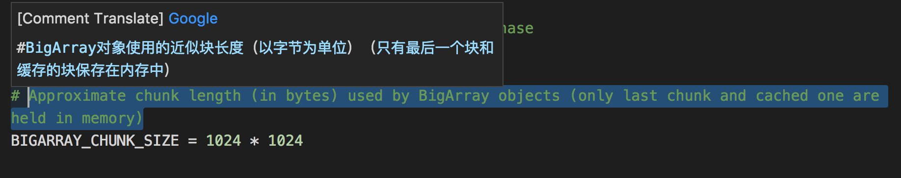
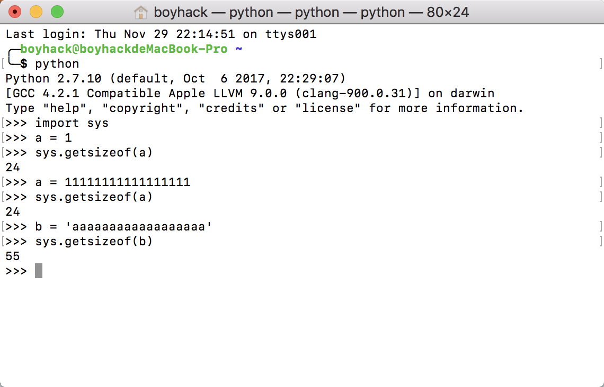
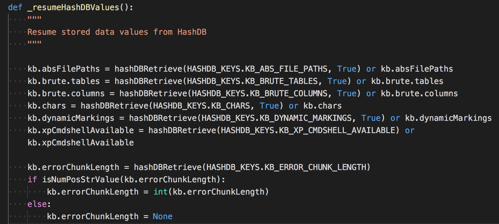
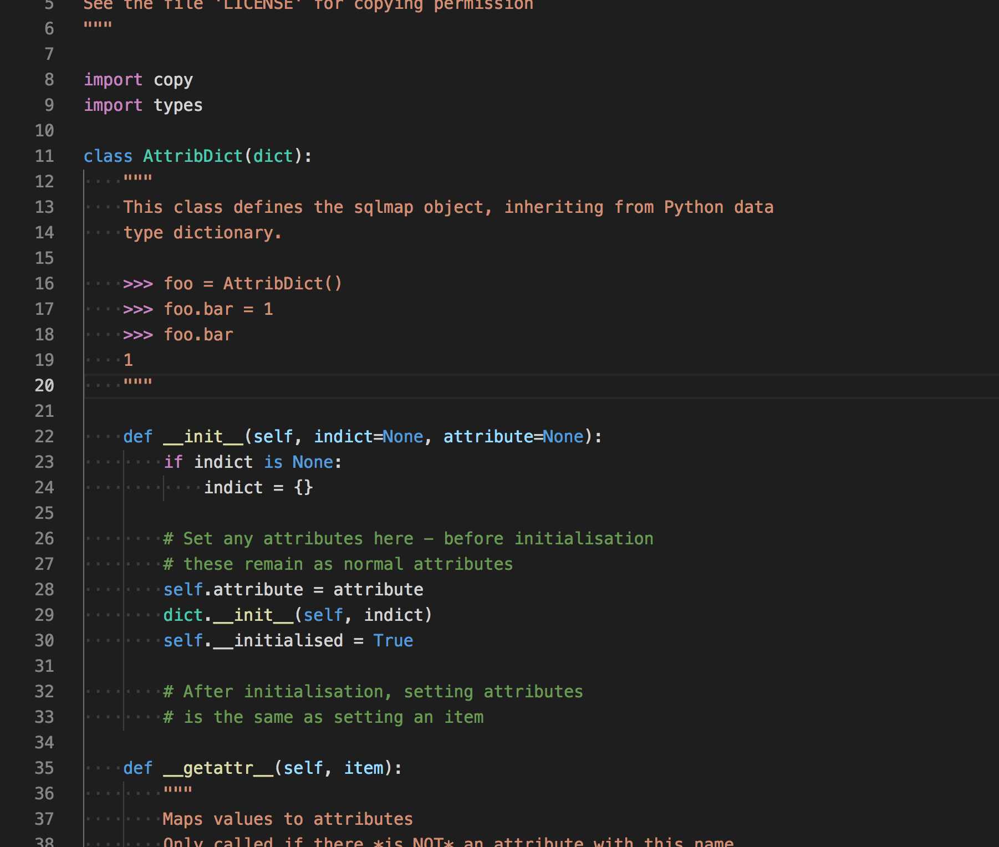
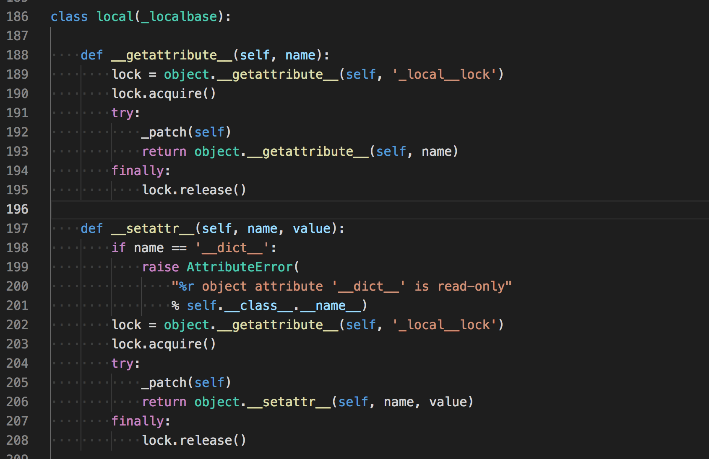

# sqlmap的一些技术细节（1）

一直在想为什么sqlmap能成为一款优秀的工具？而我写的却不行？sqlmap究竟有什么特殊之处？今天探索发现带大家寻找sqlmap的一些神秘细节。

## bigarray 大数组

当你使用dump命令导出数据的时候，有没有想过即使百万行数据sqlmap也可以导出来？从软件开发的思路来说，为了方便管理数据，会将数据存储在内存中，如果百万条数据存在内存中势必会导致内存爆炸，sqlmap如何处理？

sqlmap内部实现了`bigarray`模块`lib/core/bigarray.py`,具体原理是将内存数据存储为一个临时文件，要读取时在读取这个文件就行了。具体多大的数据会被缓存下来，sqlmap中有具体的定义`BIGARRAY_CHUNK_SIZE`



看着挺大，但单位是字节，一个简单的测试可以看到python中一个int占多大的内存(64位)



具体实现原理是，当bigarray存储的数据达到这个长度时，会将数据的内容pickle反序列化成文件，此时bigarray不再存储这些数据，存储这个临时文件名，当需要的时候通过文件名读取在映射到内存中。

## HashDB

Hashdb实现在`lib/utils/hashdb.py`，用于存储注入时候的各种信息，主要是封装了`sqlite3`数据库，因为会在多线程中使用它，所以HashDB内部读写的时候封装了一层线程锁。

经常会有这样一个现象，第一次扫描完后，后面的扫描好像就很快的样子？主要就是它的作用了，它每次初始化的时候都会检查数据库是否保存有相关的信息，如果有，则直接调用，这样就直接获取了前面扫描时的信息，数据库信息，注入点位置等等。

主要读取哪些信息？可以搜索下`_resumeHashDBValues`这个函数，作用就是从数据库中恢复数据。

可以看到恢复的数据都赋值给了kb，kb是什么？这引起了我们下面的要说的。

## 属性字典

上文说道，Kb是什么意思？跳到`lib/core/data.py` 找到了kb原始的定义
```python 
# object to share within function and classes results
kb = AttribDict()

```

`AttribDict()`又是什么？，在找到它的定义



继承了python中的`dict`，但是可以这样调用
``` 
>>> foo = AttribDict()
>>> foo.bar = 1
>>> foo.bar

```

简单来说可以说是自己实现的一种数据结构吧，用它就可以使用类似class的调用了。只需要设置`__getattr__`的魔术方法就可以实现。

那么`kb`这个变量究竟是干嘛的呢？根据我对sqlmap的观察，应该是用于存储扫描的各种信息。因为python是单例模式，kb就可以用于全局的设置各种变量了。

## DNS Cache

为了性能速度的考虑，sqlmap也会将一些IP地址缓存下来，具体实现如下，会在每次初始化的时候运行
```python 
def _setDNSCache():
    """
    Makes a cached version of socket._getaddrinfo to avoid subsequent DNS requests.
    """

    def _getaddrinfo(*args, **kwargs):
        if args in kb.cache.addrinfo:
            return kb.cache.addrinfo[args]

        else:
            kb.cache.addrinfo[args] = socket._getaddrinfo(*args, **kwargs)
            return kb.cache.addrinfo[args]

    if not hasattr(socket, "_getaddrinfo"):
        socket._getaddrinfo = socket.getaddrinfo
        socket.getaddrinfo = _getaddrinfo

```

HOOK了`socket.getaddrinfo`,这种方式还是很hacker的~

## sqlmap的线程设计

位置在`lib/core/threads.py`，里面封装了一个函数`runThreads`用于调度线程，具体实现：
```python 
# Start the threads
for numThread in xrange(numThreads):
    thread = threading.Thread(target=exceptionHandledFunction, name=str(numThread), args=[threadFunction])

    setDaemon(thread)

    try:
        thread.start()
    except Exception, ex:
        errMsg = "error occurred while starting new thread ('%s')" % ex.message
        logger.critical(errMsg)
        break

    threads.append(thread)

# And wait for them to all finish
alive = True
while alive:
    alive = False
    for thread in threads:
        if thread.isAlive():
            alive = True
            time.sleep(0.1)

```

不用`thread.join()`阻塞线程的原因是`thread.join()`的时候无法接收中断的异常`KeyboardInterrupt`

进入`thread.join()`方法内部，实现join的其实是一个Condition,Condition内部实现也是线程锁，具体可以Google。

总之可以想象一下，join使用后，线程会处于一种”锁”的状态，只有当线程结束后才能“唤醒”，所以就接受不到其他的消息了。

如果大家也看过sqlmap源码的话，会发现很多地方调用`getCurrentThreadData()`这个函数，这个的意义是什么？

这个函数其实是实例化的类
```python 
class _ThreadData(threading.local):
    """
    Represents thread independent data
    """

    def __init__(self):
        self.reset()

    def reset(self):
        """
        Resets thread data model
        """

        self.disableStdOut = False
        self.hashDBCursor = None
        self.inTransaction = False
        self.lastCode = None
        self.lastComparisonPage = None
        self.lastComparisonHeaders = None
        self.lastComparisonCode = None
        self.lastComparisonRatio = None
        self.lastErrorPage = None
        self.lastHTTPError = None
        self.lastRedirectMsg = None
        self.lastQueryDuration = 0
        self.lastPage = None
        self.lastRequestMsg = None
        self.lastRequestUID = 0
        self.lastRedirectURL = None
        self.random = random.WichmannHill()
        self.resumed = False
        self.retriesCount = 0
        self.seqMatcher = difflib.SequenceMatcher(None)
        self.shared = shared
        self.validationRun = 0
        self.valueStack = []

```

继承自`threading.local`类，看一下这个类的实现

可以看到，操作这个类的属性的时候都会有一把”锁”，所以他是线程安全的。

它的实现有什么用呢？例如有时候你需要根据前一个的运行结果来判断，然而在多线程中操作变量都需要考虑到线程冲突的情况，所以`ThreadData`就解决这个问题，用来存储运行过程中的各种信息、数据。

## sqlmap request -r 是如何解析的

有的时候，你将从Burpsuite的原始请求数据保存下来，用`python sqlmap.py -r xx.txt`来执行，sqlmap是如何解析这些数据的？在写hack-requests的时候，也有这个需求，如何从原始数据直接发包。

全局搜索`requestFile`关键词，定位到初始化时候运行的函数`_setRequestFromFile()`，跟到解析的函数`parseRequestFile()`

这个函数的注释是`Parses WebScarab and Burp logs and adds results to the target URL list`,支持从WebScarab和Burp logs添加目标。

解析和我想的差不多，反正就会考虑到各种特殊情况，解析最后返回url,method,data,cookie,headers就行了。

## payload 内容检测

如果你的注入点在一个post包里面，sqlmap会对post内容的payload进行检测，判断它是soap,json,还是xml,具体定义如下
```python 
POST_HINT_CONTENT_TYPES = {
    POST_HINT.JSON: "application/json",
    POST_HINT.JSON_LIKE: "application/json",
    POST_HINT.MULTIPART: "multipart/form-data",
    POST_HINT.SOAP: "application/soap+xml",
    POST_HINT.XML: "application/xml",
    POST_HINT.ARRAY_LIKE: "application/x-www-form-urlencoded; charset=utf-8",
}

class POST_HINT:
    SOAP = "SOAP"
    JSON = "JSON"
    JSON_LIKE = "JSON-like"
    MULTIPART = "MULTIPART"
    XML = "XML (generic)"
    ARRAY_LIKE = "Array-like"

```

然后当检测到注入payload是xml或soap时，会将`<`替换为`>`,`<`替换为`<`等等…

## sqlmap的爬虫

具体文件在`lib/utils/crawler.py`

sqlmap的爬虫会爬取自定义的深度以及寻找form表单并自动填充缺失的数据加入扫描，在爬虫运行之前，会先收集sitemap.xml的链接。

爬虫逻辑很常规，没有什么特殊的，重点看看是如何解析表单的。

解析表单内置了一个第三方库`https://pypi.org/project/ClientForm/`

代码很长，懒得看了。。

## Keepalive

keepalive也是一个第三方库`thirdparty/keepalive/keepalive.py`主要用于使urllib2 支持 HTTP 1.1 和 keepalive，来减轻网络的拥挤。

以前访问每个网页都需要建立三次TCP握手，而这个可以大大减缓TCP握手带来的消耗（只建立一次TCP连接）可以通过—KeepAlive开启，默认是关闭的。

因为写hack-requests的时候也涉及到了连接池，所以看了一下。

## Tor

`--tor`就可以开启Tor来进行注入了。

关键函数`_setTorProxySettings()`

首先会根据代理类型检测本地是否开放了这个端口
```python 
# Default SOCKS ports used by Tor
DEFAULT_TOR_SOCKS_PORTS = (9050, 9150)

# Default HTTP ports used by Tor
DEFAULT_TOR_HTTP_PORTS = (8123, 8118)

```

如果开放了端口，则设置conf.proxy，之后的访问请求中都会带上这个代理（针对HTTP代理）。如果是socks代理，通过hook 全局中的socket来实现。

如何检测Tor是否成功？访问一次https://check.torproject.org/ 根据关键词来判断就可以了。
