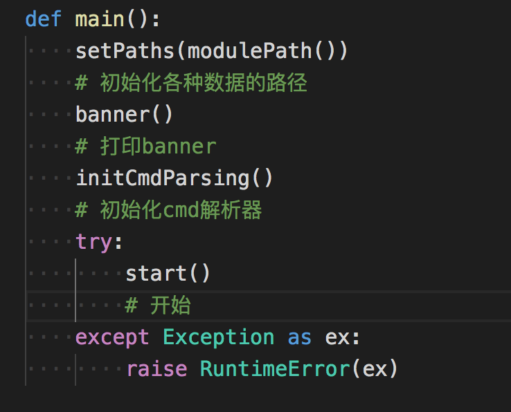
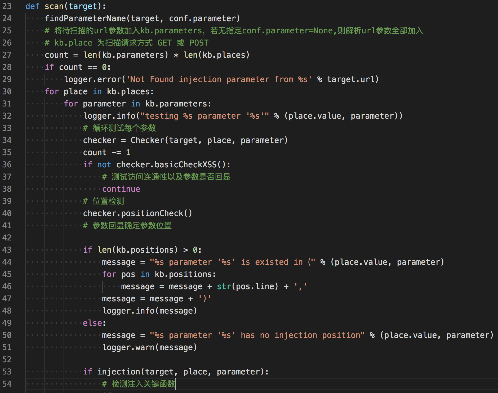
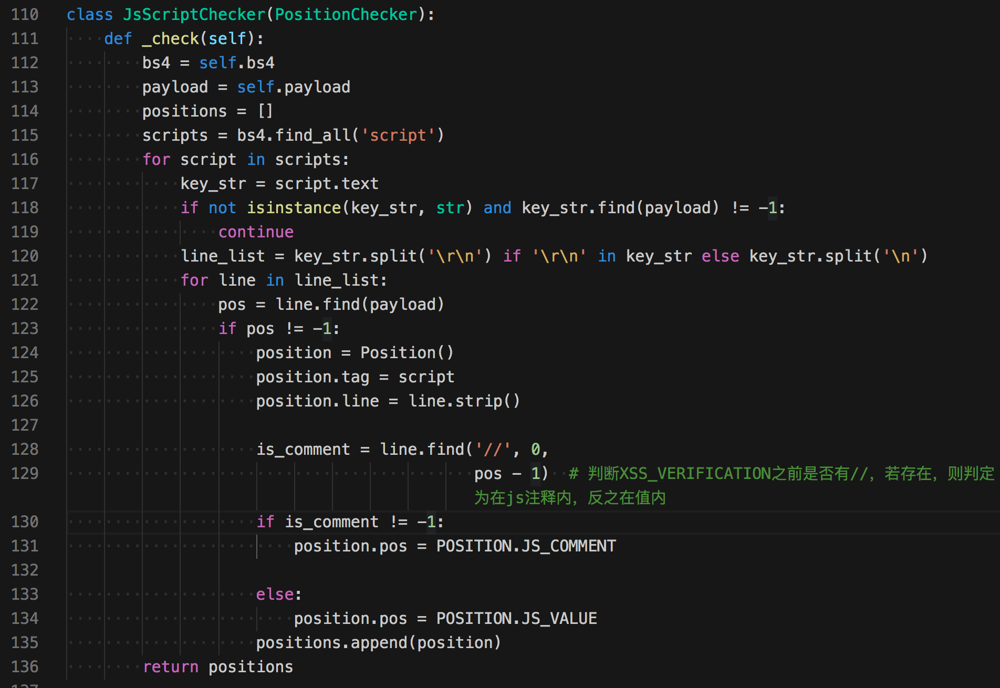
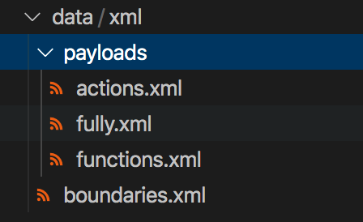
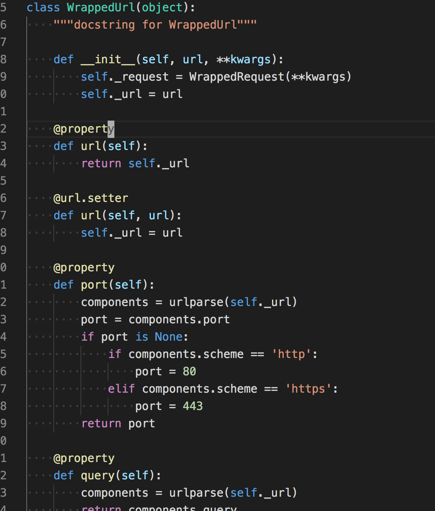

# xssing源码学习

无意中在github上看到的xss扫描器项目

> xssing是一个根据参数存在位置构造payload，并结合chromium保证xss的正确率。
> 
> Github:https://github.com/ziizhuwy/xssing

看了代码后觉得代码的结构和检测方式很适合学习，以后部分代码可能会用到，所以写个简单的源码阅读笔记。

## 结合chromium检测xss

这是一个python程序，在需要的支持库`requirement.txt`看到了`pyppeteer`，这个库提供了对chromium headless的支持。

使用它即可以用python代码来操纵浏览器，作者的想法是利用chromium来保证xss的正确率，它是如何保证的？

在文件`lib/request/xssdrive.py`有相关代码，精简一下流程如下
```python 
self.browser = await launch(headless=True, ignoreHTTPSErrors=True, autoClose=True,args=['--disable-xss-auditor', '--no-sandbox'])
# 启动浏览器

page = await self.browser.newPage()
# 创建一个页面

await before_request(page)
# 请求之前执行函数

page.on('dialog', lambda dialog: dialog.dismiss())
# 禁止弹窗

response = await page.goto(url)
# 请求一个url
await after_request(page)
# 请求之后执行函数

```

这是调用`pyppeteer`简单操作chromium访问url的流程。

在请求url之前执行的`brfore_request`函数，会注入页面一个全局js函数。
```python 
def _xss_auditor(self, message):
        message = str(message)
            if message in [str(XSS_MESSAGE), '[\'' + str(XSS_MESSAGE) + '\']']:
                        self.found_xss = True

async def before_request(self, page):
        if self.func:
            await page.exposeFunction(
                self.func, lambda message: self._xss_auditor(message)
            )

```

`page.exposeFunction`这个 API 用来在页面注册全局函数。

所以可以推测xssing检测xss的大体思路：

  1. 在浏览器访问前注册一个随机全局函数
  2. 随机全局函数被调用，且参数与内置参数相同，即可判定存在xss


这些只是针对自动触发的xss，对于需要点击才能触发的xss，在访问url完毕后，会通过寻找这个需要点击元素的位置来模拟点击,见`after_request`的定义
```python 
async def after_request(self, page):
        if self.trigger is not None:
            element = await page.querySelector(self.trigger)
            if element is not None:
                await element.click()
                await page.waitForSelector(self.trigger)

```

。

## 代码结构与扫描流程

整份代码看得出来比较精简的模仿了`sqlmap`的结构，如果还不了解sqlmap的代码，看完这份代码也能比较清晰了解sqlmap代码的结构。

主函数



跟进`start()`
```python 
def start():
    if not kb.targets:
        raise SystemExit('No Found target')
    for target in kb.targets:
        # 循环每个目标
        assert isinstance(target, WrappedUrl)
        scan(target)

```

跟进`scan`函数



`scan()`函数中检测分为三步

  1. 测试访问连通性以及确定参数是否回显
  2. 检测出回显参数的位置
  3. 检测注入


### 回显位置检测

跟进`checker.positionCheck()`函数
```python 
kb.positions += JsScriptChecker(page, payload).check() # 在js脚本中探测
kb.positions += BlockChecker(page, payload).check() # 在html代码块中探测
kb.positions += AttributeChecker(page, payload).check() # 在html标签属性中探测

```

#### 在js位置探测



在js代码中探测，这部分还是比较粗糙，从script标签中取出数据，并获得回显的那行代码，在多判断一步是否是注释。

#### 在html代码块中探测

html代码块回显位置主要处理三种情况，1是在注释中，2是在标签中内，3是在标签中的文本中。主要使用`BeautifulSoup`模块中的搜索功能。
```python 
class BlockChecker(PositionChecker):
    def _check(self):
        bs4 = self.bs4
        payload = self.payload
        positions = []
        comments = bs4.find_all(string=lambda text: isinstance(text, Comment))
        # 搜索html注释类型
        for comment in comments:
            if payload in str(comment):
                position = Position()
                position.pos = POSITION.COMMENT
                position.line = '<!--... %s ...-->' % str(comment)
                position.tag = comment  # TODO test
                positions.append(position)
                return positions
        inBody = bs4.find(text=payload)
        # 纯文本搜索payload
        bs4.find()
        if inBody is None:  # 检测是否在body标签内
            body = bs4.body
            if body is not None:
                text = body.text
                line = '<body>...[PARAMETER]...</body>'
                if text.find(payload) != -1:
                    position = Position()
                    position.pos = POSITION.LABEL_INSIDE
                    position.line = line
                    position.tag = body
                    positions.append(position)
                    return positions
                contents = body.contents
                for content in contents:  # first method
                    if isinstance(content, NavigableString) and content.find(payload) != -1:
                        position = Position()
                        position.pos = POSITION.LABEL_INSIDE
                        position.line = line
                        position.tag = body
                        positions.append(position)
                        return positions

        elif isinstance(inBody, NavigableString):
        # NavigableString 表达字符串类，及回显内容在标签中的字符串中
        # https://www.crummy.com/software/BeautifulSoup/bs3/documentation.zh.html
            parent_tag = inBody.parent
            if isinstance(parent_tag, Tag):  # TODO test
                position = Position()
                position.line = str(parent_tag)
                position.tag = parent_tag
                position.pos = POSITION.LABEL_INSIDE
                positions.append(position)
        return positions

```

#### 在html属性中回显
```python
SPECIAL_ATTR = {
    'href',
    'action',
    'formaction'
}
# 特殊属性

NON_EVENT_ATTRIBUTE = (
    'accesskey',
    'class',
    'children',
    'contenteditable',
    'dir',
    'draggable',
    'dropzone',
    'hidden',
    'id',
    'value',
    'lang',
    'spellcheck',
    'style',
    'tabindex',
    'title',
    'src',
    'translate')
# 无法使用事件的属性

EVENT_ATTRIBUTE = (
    'onload',
    'onunload',
    'onblur',
    'onchange',
    'oncontextmenu',
    'onfocus',
    'onforminput',
    'oninput',
    'oninvalid',
    'onreset',
    'onselect',
    'onsubmit',
    'onkeydown',
    'onkeypress',
    'onkeyup',
    'onclick',
    'ondblclick',
    'ondrag',
    'onmousedown',
    'onmousemove',
    'onmouseout',
    'onmouseover',
    'onmouseup',
    'onmousewheel',
    'onscroll',
    'onerror',
    'oncanplay',
    'oncanplaythrough',
    'ondurationchangeNew',
    'onemptiedNew',
    'onendedNew',
    'onplayNew',
    'onseeked',
    'onseeking'
)
# 能够利用事件的属性

class AttributeChecker(PositionChecker):

    def _check(self):
        bs4 = self.bs4
        payload = self.payload
        positions = []
        # 判断非事件属性
        for non_eve_attr in NON_EVENT_ATTRIBUTE:
            tag = bs4.find(attrs={non_eve_attr: payload})
            if isinstance(tag, Tag):
                position = Position()
                position.line = str(tag)
                position.tag = tag
                position.pos = POSITION.NON_EVE_ATTR_INSIDE
                positions.append(position)
        # 判断事件型属性
        for eve_attr in EVENT_ATTRIBUTE:
            tag = bs4.find(attrs={eve_attr: payload})
            if isinstance(tag, Tag):
                position = Position()
                position.line = str(tag)
                position.tag = tag
                position.pos = POSITION.EVE_ATTR_INSIDE
                positions.append(position)
                # 判断特殊属性
        for eve_attr in SPECIAL_ATTR:
            tag = bs4.find(attrs={eve_attr: payload})
            if isinstance(tag, Tag):
                position = Position()
                position.line = str(tag)
                position.tag = tag
                position.pos = POSITION.SPECIAL_ATTR
                position.attr = eve_attr
                positions.append(position)
        return positions

```

#### 回显位置结构
```python
class Position(object):
    def __init__(self):
        self._pos = None
        self._token = None
        self._line = None
        self._tag = None
        self._attr = None

    @property
    def pos(self):
        return self._pos

    @pos.setter
    def pos(self, pos):
        self._pos = pos

    @property
    def token(self):
        return self._token

    @token.setter
    def token(self, token):
        self._token = token

    @property
    def line(self):
        return self._line

    @line.setter
    def line(self, line):
        self._line = line

    @property
    def tag(self):
        return self._tag

    @tag.setter
    def tag(self, tag):
        self._tag = tag

    @property
    def attr(self):
        return self._attr

    @attr.setter
    def attr(self, attr):
        self._attr = attr

position = Position()
position.line = str(tag) # 当前payload的回显内容
position.tag = tag    # 回显的标签
position.pos = POSITION.SPECIAL_ATTR # 位置类型
position.attr = eve_attr # html属性类型

```

通过查看枚举类型，position.pos 位置类型主要定义如下
```python 
class POSITION(Enum):
    LABEL_INSIDE = 'lable' # 在label中
    NON_EVE_ATTR_INSIDE = 'non-event attributes' # 无法执行的属性
    EVE_ATTR_INSIDE = 'event attributes'# 可执行的属性
    COMMENT = 'comment' # 注释
    JS_COMMENT = 'javascript comment' # js注释
    JS_VALUE = 'javascript variable' # js value
    SPECIAL_ATTR = 'special attribute' # html特殊属性

```

### 检测注入

检测注入的方法在`lib/core/controler.py` `injection`函数，
```python 
def injection(target, place, parameter):
    testXss = False
    payloads_dict = dict()
    loop = asyncio.get_event_loop()
    browser = loop.run_until_complete(run_browser())
    # 初始化一个chromuim浏览器
    xss_drive = XSSCheckRequest(browser)
    # 初始化xss drive类，这个类可以使用chromuim检测xss

    def request(target):
        # 访问一个目标
        loop.run_until_complete(xss_drive.request(target))

    for position in kb.positions:
        info = 'heuristic (basic) test shows that %s parameter \'%s\' position(%s)' % (
            place.value, parameter, position.line)
        if not heuristicCheckXss(target, place, parameter, position):
            # 主要检测注入点的边界
            info += 'might not be injectable'
            logger.warn(info)
            continue
        info += 'might be injectable'
        logger.info(info)
        payloads = getPayload(position)
        # 生成 payload
        if payloads is None or len(payloads) == 0:
            msg = 'position(%s) no payload generated' % position.line
            logger.warn(msg)
        else:
            payloads_dict[position] = payloads

    if len(payloads_dict) == 0:
        return False
    payloads_sorted = sorted(payloads_dict.items(), key=lambda item: len(item[1]))

    for payload in payloads_sorted:
        position = payload[0]
        payloads = payload[1]
        logger.info('Testing position(%s)' % position.line)
        i = 0
        bar = None
        if conf.verbose < 1:
            bar = progressbar.ProgressBar(prefix="payload testing", max_value=progressbar.UnknownLength)
        for payload in payloads:
            if conf.verbose >= 1:
                logger.payload(payload.value)
            else:
                i += 1
                bar.update(i)
            target = payloadCombined(target, place, parameter, payload.value)
            # 将payload组合到参数中
            xss_info = {'trigger': payload.trigger, 'func': payload.func, 'payload': payload.value}
            # 设定触发方式，chromuim定义的全局func
            target.kwargs.update(xss_info)

            try:
                # 请求前睡眠时间
                time.sleep(0.2)
                time.sleep(conf.sleep)
                request(target)
                # 请求url
                if xss_drive.is_exist_xss():
                    # 获取chromuim定义的全局func是否被执行了
                    paramKey = (target, place.value, parameter, payload.value)
                    kb.testedParamed.append(paramKey)
                    testXss = True
                    xss_drive.clear()
                    if not conf.test_all:
                        if bar is not None:
                            bar.finish()
                        time.sleep(0.2)
                        msg = 'Found xss in %s parameter(%s)' % (place.value, parameter)
                        logger.info(msg)
                        browser.close()
                        return testXss
            except KeyboardInterrupt:
                raise KeyboardInterrupt
            except ChromiumRequestError as e:
                logger.debug(e)
        if bar is not None:
            bar.finish()
    browser.close()
    return testXss

```

### 匹配注入边界(上下文)

和sqlmap一样，xssing也通过xml描述了payload的生成方法，在`data`目录下有相关的定义文件。



在正式注入前，和sql注入一样，首先要匹配出注入的边界用于闭合上下文，看`boundaries.xml`中的定义格式
```xml 
<!--
context:回显位置对应上下文的关系
type: xss注入类型
    1：内联注入
    2：块注入
    3：代码注入
-->
<root>
    <boundary>
        <context>1,5,6</context>
        <type>2</type>
        <prefix></[TAG]></prefix>
    </boundary>
    <boundary>
        <context>1,5,6</context>
        <type>2</type>
        <prefix><%2f[TAG]></prefix>
    </boundary>
    <boundary>
        <context>6</context>
        <type>3</type>
        <prefix>';</prefix>
        <suffix>;//</suffix>
    </boundary>
    <boundary>
        <context>2,3,7</context>
        <type>1</type>
        <prefix>'</prefix>
        <suffix>'</suffix>
    </boundary>
    <boundary>
        <context>2,3,7</context>
        <type>1</type>
        <prefix>"</prefix>
        <suffix>"</suffix>
    </boundary>
    <boundary>
        <context>2,3,7</context>
        <type>2</type>
        <prefix>'></prefix>
    </boundary>
    <boundary>
        <context>2,3,7</context>
        <type>2</type>
        <prefix>"></prefix>
    </boundary>
    <boundary>
        <context>4</context>
        <type>2</type>
        <prefix>--></prefix>
        <suffix><--</suffix>
    </boundary>
</root>

```

context字段定义如下
``` 
# xss vuln postion
POS_LABEL_INSIDE = 1  # 普通标签内
POS_NON_EVE_ATTR_INSIDE = 2  # 非事件属性
POS_EVE_ATTR_INSIDE = 3  # 事件属性
POS_COMMENT = 4  # 注释中
POS_JS_COMMENT = 5  # JS的注释中
POS_JS_VALUE = 6  # JS的值中
POS_SPECIAL_ATTR = 7  # 特殊的属性内

```

例如`<context>1,5,6</context>`即表明回显位置是在`普通标签内`,`js注释中`,`js值中`

type字段定义如下
``` 
# 注入的类型
INLINE = '1'  # 内联注入
BLOCK = '2'  # 块注入
CODE = '3'  # 代码注入
PSEUDO_PROTOCOL = '4'  # 伪协议注入

```

`prefix`和`suffix`即是用来闭合html上下文标签的字段。

#### 边界匹配函数

边界匹配具体实现由`heuristicCheckXss`函数开始，而它的实现具体要看`_heuristicCheckXss`
```python 
def _heuristicCheckXss(target, place, parameter, position, boundaries):
    '''
    :return: 匹配到的边界
    '''
    u_boundaries = []
    if position.pos == POSITION.SPECIAL_ATTR:
        u_boundaries.append(INLINE_PSEUDO_PROTOCOL_BOUNDARY)
    if position.pos == POSITION.EVE_ATTR_INSIDE:
        u_boundaries.append(INLINE_BOUNDARY)
    for b in boundaries:
        if str(position.pos.name) in POS and str(POS[str(position.pos.name)]) in b.context:
            # 若位置在标签内，且是则需要闭合标签
            ran = randomStr(2)
            if BLOCK in b.type and position.pos in (POSITION.JS_VALUE, POSITION.JS_COMMENT, POSITION.LABEL_INSIDE):
                # 判断位置在js值、js注释、属性内，并且标签需要闭合，边界增加闭合操作
                if position.tag.name.lower() in CLOSED_LABEL:
                    payload = b.prefix = b.prefix.replace(REPLACE_TAG, position.tag.name)
                else:
                    u_boundaries.append(BLOCK_BOUNDARY)
                    return u_boundaries
            else:
                payload = ran + b.prefix
            if payload is None:
                continue
            target = payloadCombined(target, place, parameter, payload)
            resp = open(target)
            if resp is not None and resp.status_code == 200 and resp.content is not None and urllib.parse.unquote(
                    payload) in resp.text:
                # 若位置在属性内，需要进一步进行语义分析判定是否注入成功
                if position.pos in (
                        POSITION.EVE_ATTR_INSIDE, POSITION.NON_EVE_ATTR_INSIDE,
                        POSITION.SPECIAL_ATTR):
                    if not _token_check(position, ran, str(resp.text), b.type):
                        continue
                u_boundaries.append(b)
    return u_boundaries

```

这段代码的意义主要是根据回显的位置信息从`boundaries.xml`找到满足context条件的payload。并在之后将这些payload放入`kb.boundaries`变量中。

### 生成payload

初步的payload被找到后，再添加`前缀`，`后缀`等信息，根据前面探索边界得到的边界`type`信息组合不同的内置payload，即组合成完整的payload了。
```python 
def getPayload(position):
    payloads = []
    if len(kb.boundaries) == 0:
        return None
    for boundary in kb.boundaries:
        if not isinstance(boundary, str):
            suffix = boundary.suffix if 'suffix' in boundary else ''
            prefix = boundary.prefix
            # 添加边界的前缀后缀
            payloads += genPayload(boundary.type, position)
            for payload_obj in payloads:
                payload_obj.value = prefix + payload_obj.value + suffix
        else:
            payloads += genPayload(type=BLOCK) if boundary == BLOCK_BOUNDARY else []
            payloads += genPayload(type=PSEUDO_PROTOCOL,
                                   position=position) if boundary == INLINE_PSEUDO_PROTOCOL_BOUNDARY else []
            payloads += gen_function(position) if boundary == INLINE_BOUNDARY else []
    abs_payloads = []
    for payload in payloads:
        payload = Agent.payload(payload)
        abs_payloads.append(payload)
    return abs_payloads


def genPayload(type, position=None):
    payloads = []
    if BLOCK in type:
        # 获取完整html tag，添加到payload中
        payloads = payloads + genFullyTag()
        payloads = payloads + gen_block()
    if INLINE in type:
        payloads += gen_inline(position)
    if CODE in type:
        payloads += gen_code()
    if PSEUDO_PROTOCOL in type:
        payloads += gen_pseudo_protocol(position)
    return payloads

```

相关函数路径`lib/core/payloads.py`,更多函数详情可自行查阅。

### 测试payload

测试payload调用chromium检测自定义函数是否被执行,这部分很简单，直接上代码吧
```python 
payloads_sorted = sorted(payloads_dict.items(), key=lambda item: len(item[1]))

    for payload in payloads_sorted:
        position = payload[0]
        payloads = payload[1]
        logger.info('Testing position(%s)' % position.line)
        i = 0
        bar = None
        if conf.verbose < 1:
            bar = progressbar.ProgressBar(prefix="payload testing", max_value=progressbar.UnknownLength)
        for payload in payloads:
            if conf.verbose >= 1:
                logger.payload(payload.value)
            else:
                i += 1
                bar.update(i)
            target = payloadCombined(target, place, parameter, payload.value)
            # 将payload组合到参数中
            xss_info = {'trigger': payload.trigger, 'func': payload.func, 'payload': payload.value}
            # 设定触发方式，chromuim定义的全局func
            target.kwargs.update(xss_info)

            try:
                # 请求前睡眠时间
                time.sleep(0.2)
                time.sleep(conf.sleep)
                request(target)
                # 请求url
                if xss_drive.is_exist_xss():
                    # 获取chromuim定义的全局func是否被执行了
                    paramKey = (target, place.value, parameter, payload.value)
                    kb.testedParamed.append(paramKey)
                    testXss = True
                    xss_drive.clear()
                    if not conf.test_all:
                        if bar is not None:
                            bar.finish()
                        time.sleep(0.2)
                        msg = 'Found xss in %s parameter(%s)' % (place.value, parameter)
                        logger.info(msg)
                        browser.close()
                        return testXss
            except KeyboardInterrupt:
                raise KeyboardInterrupt
            except ChromiumRequestError as e:
                logger.debug(e)
        if bar is not None:
            bar.finish()
    browser.close()
    return testXss

```

## 代码学习

这份代码比较简单，结构也和sqlmap的结构类似，学习它的同时似乎对sqlmap的检测方式也有所明白了，如果想写类似的扫描器，里面有一些点值得学习。

### payload数据库

本项目中将所有xss的payload封装到了一个xml文件中，虽然不明白为什么要用xml格式，如果是我，更想用python的字典 - =

### 数据类型

例如一个url，想获得它的`域名`,`参数信息`,`请求方式`等信息，不如创建一个类，并用python的`@property`装饰符，就避免每次写同一个功能，也方便调用。详情可参看`lib/request/url.py`



### 统一请求处理

对于通用漏扫模块，如`xss`，`sql`之类的来说，除了漏洞规则之外，我们还要考虑注入参数的位置，如url上的参数，post中的请求包，cookie，uri等地方。

sqlmap中可注入的位置
```python 
class PLACE:
    GET = "GET"
    POST = "POST"
    URI = "URI"
    COOKIE = "Cookie"
    USER_AGENT = "User-Agent"
    REFERER = "Referer"
    HOST = "Host"

```

一个个处理这些地方会显得繁杂，sqlmap上是将这些位置保存到一个变量中，在统一请求时根据变量来进行不同的请求。

## 后续思考

这份代码适合学习，用chromium检测xss是很好的思路，但是只对反射型xss，并且chromium的作用只是为了验证xss是否被执行，有些大材小用了。用html语义解析与js语义解析，找到新增的标签来判定xss也是很容易实现的(相比来说)。

有个思路可以研究，想充分发挥chromium的作用，用chromium来检测dom-xss，通过hook一些关键的js触发函数`document.write`之类的，并查看参数中是否有特定的字符，应该更酷更有趣吧。
