# yii框架异常处理导致的xss

最近XSS扫描器发现了一些奇怪的漏洞，对一些特征归类,查询，发现是属于yii 1.x框架。 

> Yii是一个免费的，开源的，基于PHP的Web**应用程序开发框架**

虽然YII 已经发布了2.x,但1.x的使用量还是很大的 

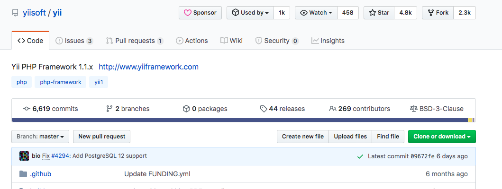

##  复现 

下载yii 1.x 

git clone https://github.com/yiisoft/yii 

运行自带的blog demo 

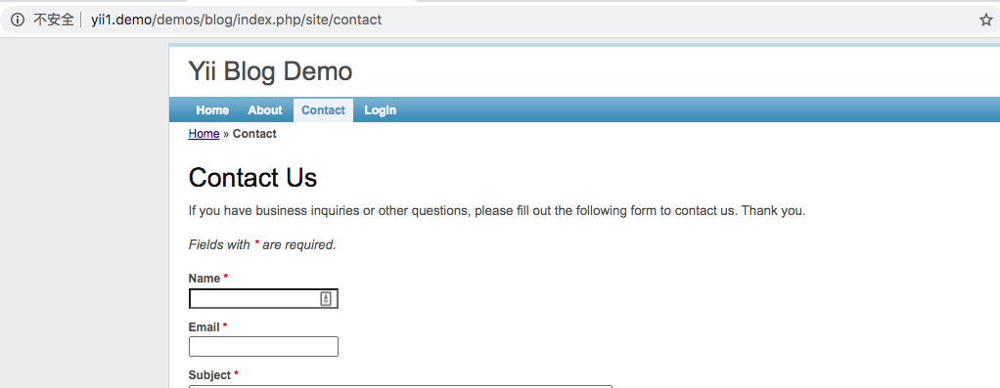

当请求头带有`X-Requested-With: XMLHttpRequest`时，并且含有yii不能识别的路径时，yii会报错，并且回显出路径，这部分也没有进行html转码。 

发送如下请求体 

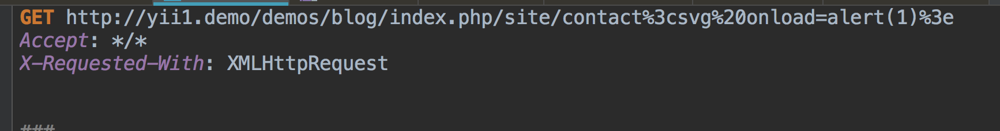

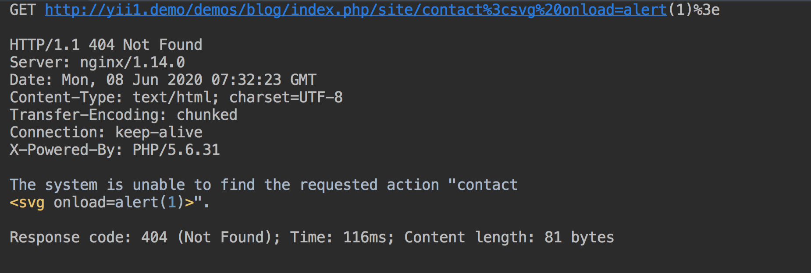

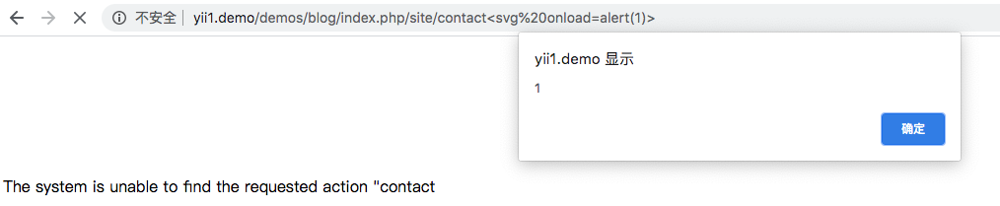

##  代码分析 

问题发生在`framework/base/CErrorHandler.php`

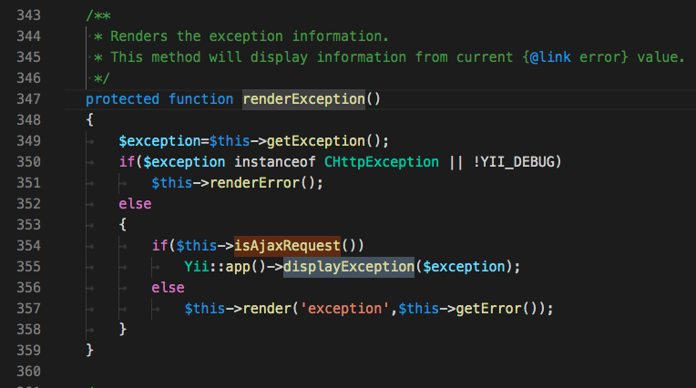

`displayException`函数在`framework/console/CConsoleApplication.php`中被定义，直接echo输出 

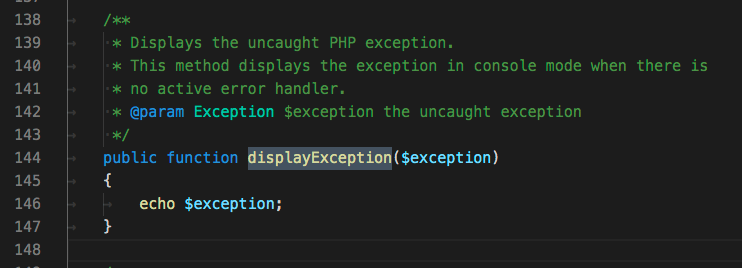

##  yii 2.x 

`vendor/yiisoft/yii2/base/Module.php`，runAction方法遇到不存在的路由会抛出`InvalidRouteException`并将错误的路由输出 

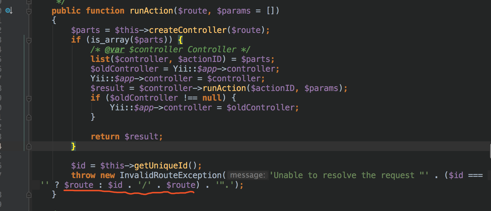

同样在`vendor/yiisoft/yii2/web/ErrorAction.php`内，对于处理ajax的错误响应，没有转义html代码 

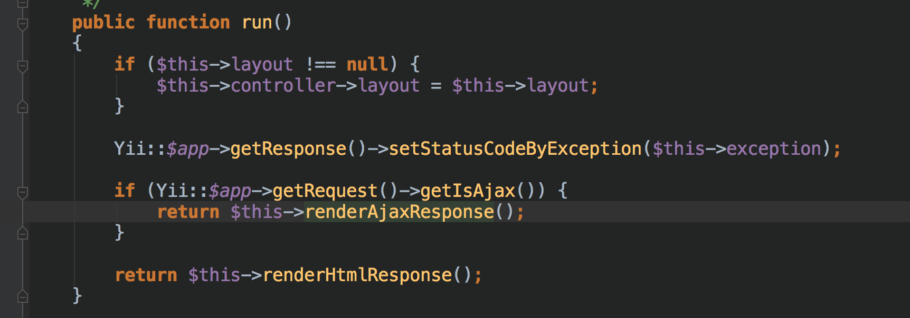

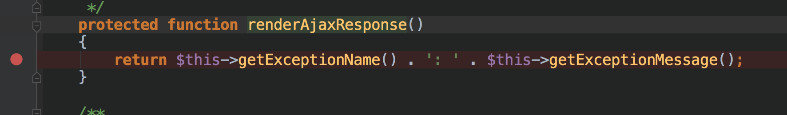

理论上也存在1.x的漏洞，但是在web处理的最后 

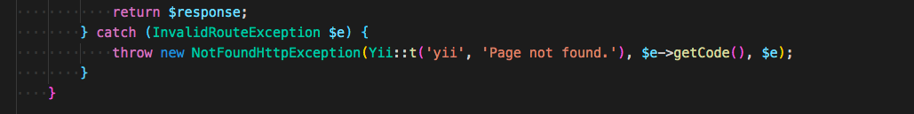

会捕获这个异常并抛出一个新的异常，新异常控制的输出无法控制。 

虽然捕获了这个异常，但是出现问题的异常依然在整个异常类中 

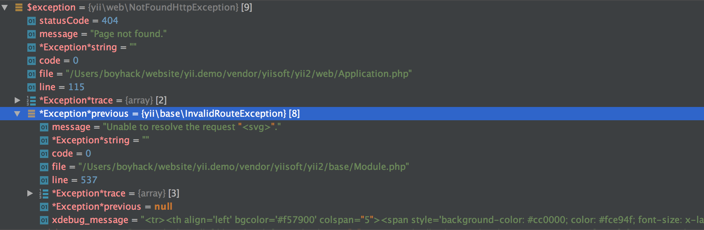

如果程序员在YII2框架中处理异常，将所有异常都输出，也有可能造成xss。 
