# 从masscan,zmap源码分析到开发实践

Zmap和Masscan都是号称能够快速扫描互联网的扫描器，十一因为无聊，看了下它们的代码实现，发现它们能够快速扫描，原理其实很简单，就是实现两种程序，一个发送程序，一个抓包程序，让发送和接收分隔开从而实现了速度的提升。但是它们识别的准确率还是比较低的，所以就想了解下为什么准确率这么低以及应该如何改善。 

##  Masscan源码分析 

首先是看的Masscan的源码，在readme上有它的一些设计思想，它指引我们看`main.c`中的入口函数`main()`，以及发送函数和接收函数`transmit_thread()`和`receive_thread()`，还有一些简单的原理解读。 

###  理论上的6分钟扫描全网 

在后面自己写扫描器的过程中，对Masscan的扫描速度产生怀疑，目前Masscan是号称6分钟扫描全网，以每秒1000万的发包速度。 

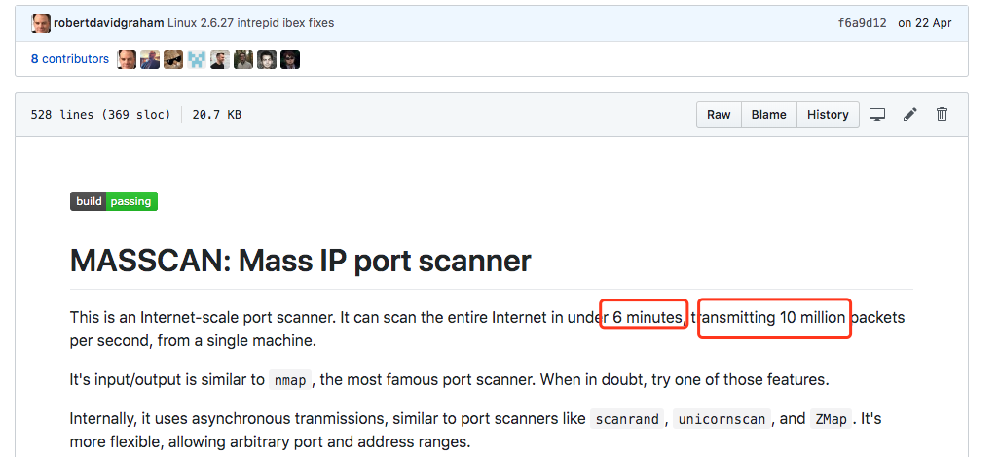

但是255^4/10000000/60 ≈ 7.047 ？？？ 

之后了解到，默认模式下Masscan使用`pcap`发送和接收数据包，它在Windows和Mac上只有30万/秒的发包速度，而Linux可以达到150万/秒，如果安装了PF_RING DNA设备，它会提升到1000万/秒的发包速度（这些前提是硬件设备以及带宽跟得上）。 

注意，这只是按照扫描**一个** 端口的计算。 

PF_RING DNA设备了解地址：http://www.ntop.org/products/pf_ring/ 

####  那为什么Zmap要45分钟扫完呢？ 

在Zmap的主页上说明了 

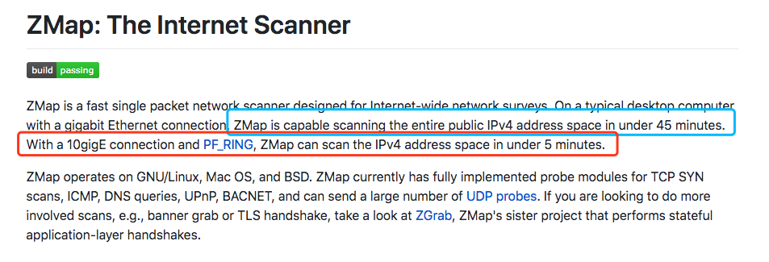

用PF_RING驱动，可以在5分钟扫描全网，而默认模式才是45分钟，Masscan的默认模式计算一下也是45分钟左右才扫描完，这就是宣传的差距吗 （- 

###  历史记录 

观察了readme的历史记录 https://github.githistory.xyz/robertdavidgraham/Masscan/blob/master/README.md 

之前构建时会提醒安装`libpcap-dev`，但是后面没有了，从releases上看，是将静态编译的`libpcap`改为了动态加载。 

###  C10K问题 

c10k也叫做client 10k，就是一个客户端在硬件性能足够条件下如何处理超过1w的连接请求。Masscan把它叫做C10M问题。 

Masscan的解决方法是不通过系统内核调用函数，而是直接调用相关驱动。 

主要通过下面三种方式： 

  * 定制的网络驱动 
  * Masscan可以直接使用PF_RING DNA的驱动程序，该驱动程序可以直接从用户模式向网络驱动程序发送数据包而不经过系统内核。 
  * 内置tcp堆栈 
  * 直接从tcp连接中读取响应连接，只要内存足够，就能轻松支持1000万并发的TCP连接。但这也意味着我们要手动来实现tcp协议。 
  * 不使用互斥锁 
  * 锁的概念是用户态的，需要经过CPU，降低了效率，Masscan使用`rings`来进行一些需要同步的操作。与之对比一下Zmap，很多地方都用到了锁。 
    * 为什么要使用锁？ 
    * 一个网卡只用开启一个接收线程和一个发送线程，这两个线程是不需要共享变量的。但是如果有多个网卡，Masscan就会开启多个接收线程和多个发送线程，这时候的一些操作，如打印到终端，输出到文件就需要锁来防止冲突。 
    * 多线程输出到文件 
    * Masscan的做法是每个线程将内容输出到不同文件，最后在集合起来。在`src/output.c`中，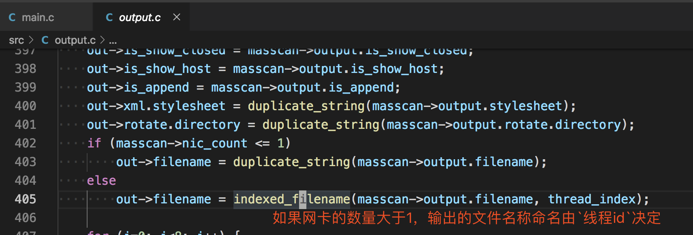


###  随机化地址扫描 

在读取地址后，如果进行顺序扫描，伪代码如下 
```c 
for (i = 0; i < range; i++) {
    scan(i);
}

```

但是考虑到有的网段可能对扫描进行检测从而封掉整个网段，顺序扫描效率是较低的，所以需要将地址进行随机的打乱，用算法描述就是设计一个`打乱数组的算法`，Masscan是设计了一个加密算法，伪代码如下 
```c 
range = ip_count * port_count;
for (i = 0; i < range; i++) {
    x = encrypt(i);
    ip   = pick(addresses, x / port_count);
    port = pick(ports,     x % port_count);
    scan(ip, port);
}

```

随机种子就是`i`的值，这种加密算法能够建立一种一一对应的映射关系，即在[1...range]的区间内通过`i`来生成[1...range]内不重复的随机数。同时如果中断了扫描，只需要记住`i`的值就能重新启动，在分布式上也可以根据`i`来进行。 

  * 如果对这个加密算法感兴趣可以看 Ciphers with Arbitrary Finite Domains 这篇论文。 


###  无状态扫描的原理 

回顾一下tcp协议中三次握手的前两次 

  1. 客户端在向服务器第一次握手时，会组建一个数据包，设置syn标志位，同时生成一个数字填充seq序号字段。 
  2. 服务端收到数据包，检测到了标志位的syn标志，知道这是客户端发来的建立连接的请求包，服务端会回复一个数据包，同时设置syn和ack标志位，服务器随机生成一个数字填充到seq字段。并将客户端发送的seq数据包+1填充到ack确认号上。 


在收到syn和ack后，我们返回一个rst来结束这个连接，如下图所示 

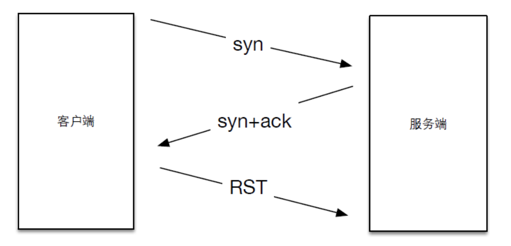

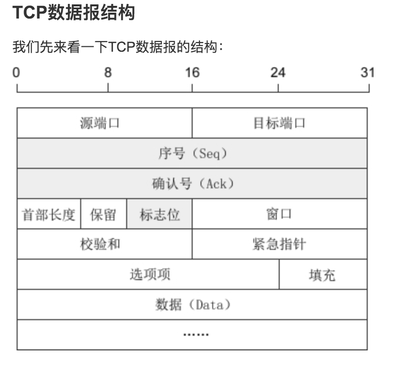

Masscan和Zmap的扫描原理，就是利用了这一步，因为seq是我们可以自定义的，所以在发送数据包时填充一个特定的数字，而在返回包中可以获得相应的响应状态，即是无状态扫描的思路了。 接下来简单看下Masscan中发包以及接收的代码。 

####  发包 

在`main.c`中，前面说的随机化地址扫描 

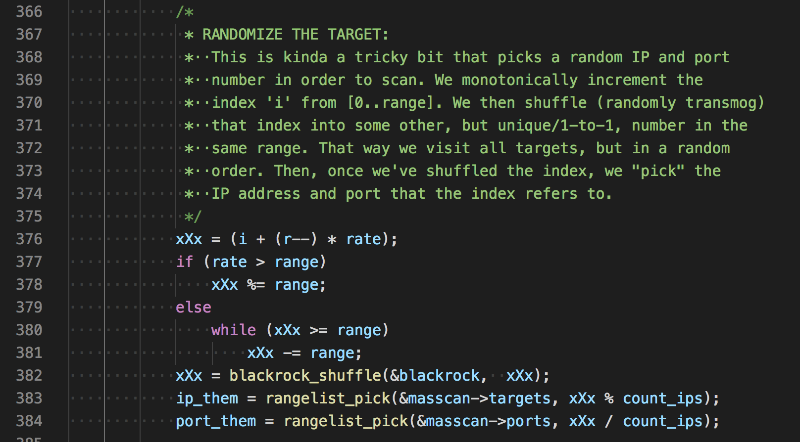

接着生成cookie并发送 

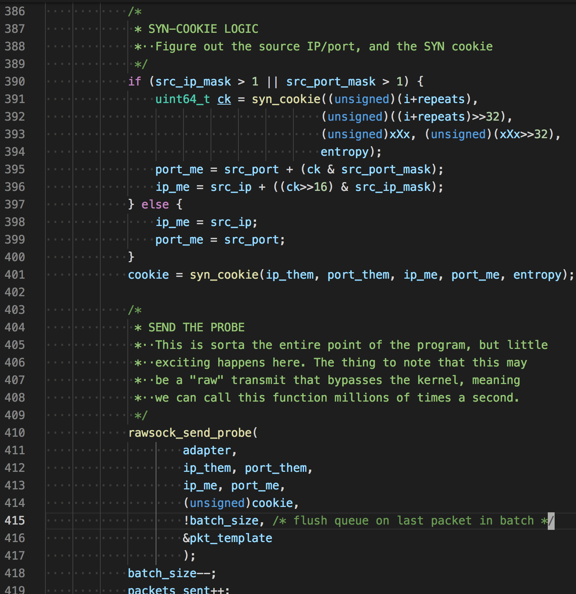
```c 
uint64_t
syn_cookie( unsigned ip_them, unsigned port_them,
            unsigned ip_me, unsigned port_me,
            uint64_t entropy)
{
    unsigned data[4];
    uint64_t x[2];

    x[0] = entropy;
    x[1] = entropy;

    data[0] = ip_them;
    data[1] = port_them;
    data[2] = ip_me;
    data[3] = port_me;
    return siphash24(data, sizeof(data), x);
}

```

看名字我们知道，生成cookie的因子有源ip，源端口，目的ip，目的端口，和entropy(随机种子，Masscan初始时自动生成)，siphash24是一种高效快速的哈希函数，常用于网络流量身份验证和针对散列dos攻击的防御。 

组装tcp协议`template_set_target()`,部分代码 
```c 
case Proto_TCP:
        px[offset_tcp+ 0] = (unsigned char)(port_me >> 8);
        px[offset_tcp+ 1] = (unsigned char)(port_me & 0xFF);
        px[offset_tcp+ 2] = (unsigned char)(port_them >> 8);
        px[offset_tcp+ 3] = (unsigned char)(port_them & 0xFF);
        px[offset_tcp+ 4] = (unsigned char)(seqno >> 24);
        px[offset_tcp+ 5] = (unsigned char)(seqno >> 16);
        px[offset_tcp+ 6] = (unsigned char)(seqno >>  8);
        px[offset_tcp+ 7] = (unsigned char)(seqno >>  0);

        xsum += (uint64_t)tmpl->checksum_tcp
                + (uint64_t)ip_me
                + (uint64_t)ip_them
                + (uint64_t)port_me
                + (uint64_t)port_them
                + (uint64_t)seqno;
        xsum = (xsum >> 16) + (xsum & 0xFFFF);
        xsum = (xsum >> 16) + (xsum & 0xFFFF);
        xsum = (xsum >> 16) + (xsum & 0xFFFF);
        xsum = ~xsum;

        px[offset_tcp+16] = (unsigned char)(xsum >>  8);
        px[offset_tcp+17] = (unsigned char)(xsum >>  0);
        break;

```

发包函数 
```c 
/***************************************************************************
 * wrapper for libpcap's sendpacket
 *
 * PORTABILITY: WINDOWS and PF_RING
 * For performance, Windows and PF_RING can queue up multiple packets, then
 * transmit them all in a chunk. If we stop and wait for a bit, we need
 * to flush the queue to force packets to be transmitted immediately.
 ***************************************************************************/
int
rawsock_send_packet(
    struct Adapter *adapter,
    const unsigned char *packet,
    unsigned length,
    unsigned flush)
{
    if (adapter == 0)
        return 0;

    /* Print --packet-trace if debugging */
    if (adapter->is_packet_trace) {
        packet_trace(stdout, adapter->pt_start, packet, length, 1);
    }

    /* PF_RING */
    if (adapter->ring) {
        int err = PF_RING_ERROR_NO_TX_SLOT_AVAILABLE;

        while (err == PF_RING_ERROR_NO_TX_SLOT_AVAILABLE) {
            err = PFRING.send(adapter->ring, packet, length, (unsigned char)flush);
        }
        if (err < 0)
            LOG(1, "pfring:xmit: ERROR %d\n", err);
        return err;
    }

    /* WINDOWS PCAP */
    if (adapter->sendq) {
        int err;
        struct pcap_pkthdr hdr;
        hdr.len = length;
        hdr.caplen = length;

        err = PCAP.sendqueue_queue(adapter->sendq, &hdr, packet);
        if (err) {
            rawsock_flush(adapter);
            PCAP.sendqueue_queue(adapter->sendq, &hdr, packet);
        }

        if (flush) {
            rawsock_flush(adapter);
        }

        return 0;
    }

    /* LIBPCAP */
    if (adapter->pcap)
        return PCAP.sendpacket(adapter->pcap, packet, length);

    return 0;
}

```

可以看到它是分三种模式发包的，`PF_RING`,`WinPcap`,`LibPcap`,如果没有装相关驱动的话，默认就是pcap发包。如果想使用PF_RING模式，只需要加入启动参数`--pfring`

####  接收 

在接收线程看到一个关于cpu的代码 

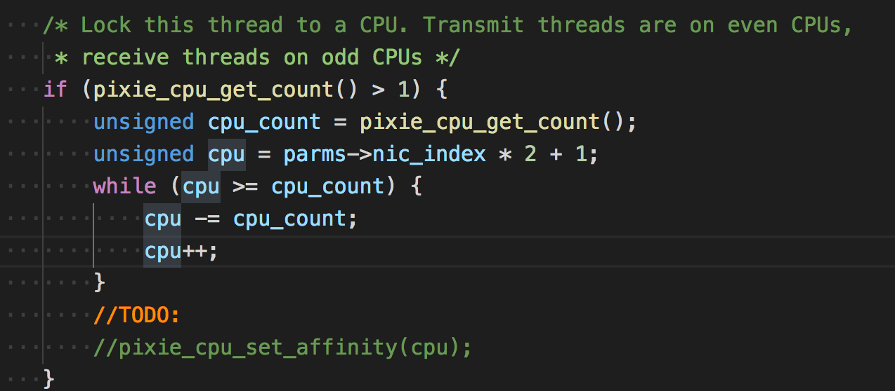

大意是锁住这个线程运行的cpu，让发送线程运行在双数cpu上，接收线程运行在单数cpu上。但代码没怎么看懂 

接收原始数据包 
```c 
int rawsock_recv_packet(
    struct Adapter *adapter,
    unsigned *length,
    unsigned *secs,
    unsigned *usecs,
    const unsigned char **packet)
{

    if (adapter->ring) {
        /* This is for doing libpfring instead of libpcap */
        struct pfring_pkthdr hdr;
        int err;

        again:
        err = PFRING.recv(adapter->ring,
                        (unsigned char**)packet,
                        0,  /* zero-copy */
                        &hdr,
                        0   /* return immediately */
                        );
        if (err == PF_RING_ERROR_NO_PKT_AVAILABLE || hdr.caplen == 0) {
            PFRING.poll(adapter->ring, 1);
            if (is_tx_done)
                return 1;
            goto again;
        }
        if (err)
            return 1;

        *length = hdr.caplen;
        *secs = (unsigned)hdr.ts.tv_sec;
        *usecs = (unsigned)hdr.ts.tv_usec;

    } else if (adapter->pcap) {
        struct pcap_pkthdr hdr;

        *packet = PCAP.next(adapter->pcap, &hdr);

        if (*packet == NULL) {
            if (is_pcap_file) {
                //pixie_time_set_offset(10*100000);
                is_tx_done = 1;
                is_rx_done = 1;
            }
            return 1;
        }

        *length = hdr.caplen;
        *secs = (unsigned)hdr.ts.tv_sec;
        *usecs = (unsigned)hdr.ts.tv_usec;
    }


    return 0;
}

```

主要是使用了PFRING和PCAP的api来接收。后面便是一系列的接收后的处理了。在`mian.c`757行 

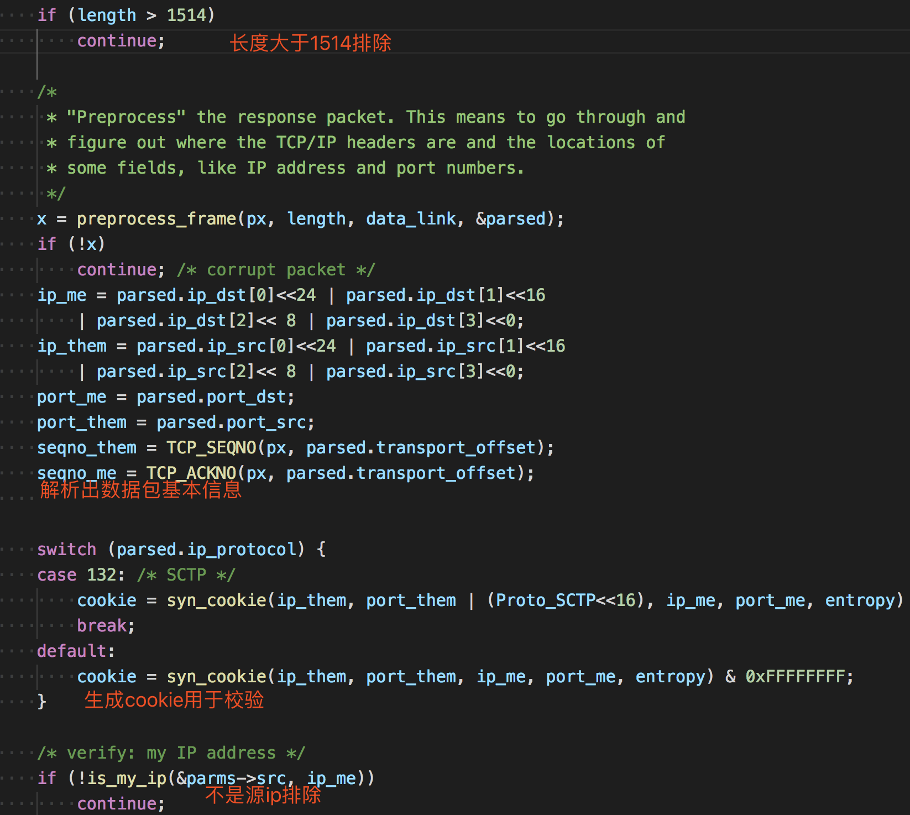

后面还会判断是否为源ip，判断方式不是相等，是判断某个范围。 
```c 
int is_my_port(const struct Source *src, unsigned port)
{
    return src->port.first <= port && port <= src->port.last;
}

```

接着后面的处理 
```c 
if (TCP_IS_SYNACK(px, parsed.transport_offset)
    || TCP_IS_RST(px, parsed.transport_offset)) {
    // 判断是否是syn+ack或rst标志位

  /* 获取状态 */
  status = PortStatus_Unknown;
  if (TCP_IS_SYNACK(px, parsed.transport_offset))
    status = PortStatus_Open; // syn+ack 说明端口开放
  if (TCP_IS_RST(px, parsed.transport_offset)) {
    status = PortStatus_Closed; // rst 说明端口关闭
  }

  /* verify: syn-cookies 校验cookie是否正确 */
  if (cookie != seqno_me - 1) {
    LOG(5, "%u.%u.%u.%u - bad cookie: ackno=0x%08x expected=0x%08x\n",
        (ip_them>>24)&0xff, (ip_them>>16)&0xff,
        (ip_them>>8)&0xff, (ip_them>>0)&0xff,
        seqno_me-1, cookie);
    continue;
  }

  /* verify: ignore duplicates  校验是否重复*/
  if (dedup_is_duplicate(dedup, ip_them, port_them, ip_me, port_me))
    continue;

  /* keep statistics on number received 统计接收的数字*/
  if (TCP_IS_SYNACK(px, parsed.transport_offset))
    (*status_synack_count)++;

  /*
   * This is where we do the output
   * 这是输出状态了
   */
  output_report_status(
    out,
    global_now,
    status,
    ip_them,
    6, /* ip proto = tcp */
    port_them,
    px[parsed.transport_offset + 13], /* tcp flags */
    parsed.ip_ttl,
    parsed.mac_src
  );


  /*
   * Send RST so other side isn't left hanging (only doing this in
   * complete stateless mode where we aren't tracking banners)
   */
  // 发送rst给服务端，防止服务端一直等待。
  if (tcpcon == NULL && !Masscan->is_noreset)
    tcp_send_RST(
    &parms->tmplset->pkts[Proto_TCP],
    parms->packet_buffers,
    parms->transmit_queue,
    ip_them, ip_me,
    port_them, port_me,
    0, seqno_me);

}

```

##  Zmap源码分析 

Zmap官方有一篇paper，讲述了Zmap的原理以及一些实践。上文说到Zmap使用的发包技术和Masscan大同小异，高速模式下都是调用pf_ring的驱动进行，所以对这些就不再叙述了，主要说下其他与Masscan不同的地方，paper中对丢包问题以及扫描时间段有一些研究，简单整理下 

  1. 发送多个探针：结果表明，发送8个SYN包后，响应主机数量明显趋于平稳 
  2. 哪些时间更适合扫描 
  3. 我们观察到一个±3.1%的命中率变化依赖于日间扫描的时间。最高反应率在美国东部时间上午7时左右，最低反应率在美国东部时间下午7时45分左右。 
  4. 这些影响可能是由于整体网络拥塞和包丢失率的变化，或者由于只间断连接到网络的终端主机的总可用性的日变化模式。在不太正式的测试中，我们没有注意到任何明显的变化 


还有一点是Zmap只能扫描单个端口，看了一下代码，这个保存端口变量的作用也只是在最后接收数据包用来判断srcport用，不明白为什么还没有加上多端口的支持。 

###  宽带限制 

相比于Masscan用`rate=10000`作为限制参数，Zmap用`-B 10M`的方式来限制 

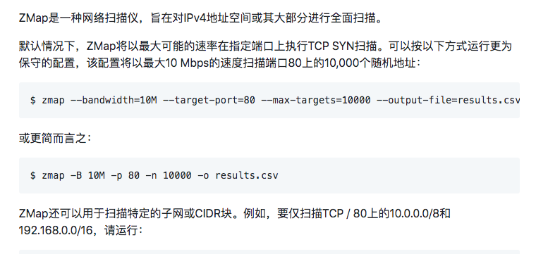

我觉得这点很好，因为不是每个使用者都能明白每个参数代表的原理。实现细节 

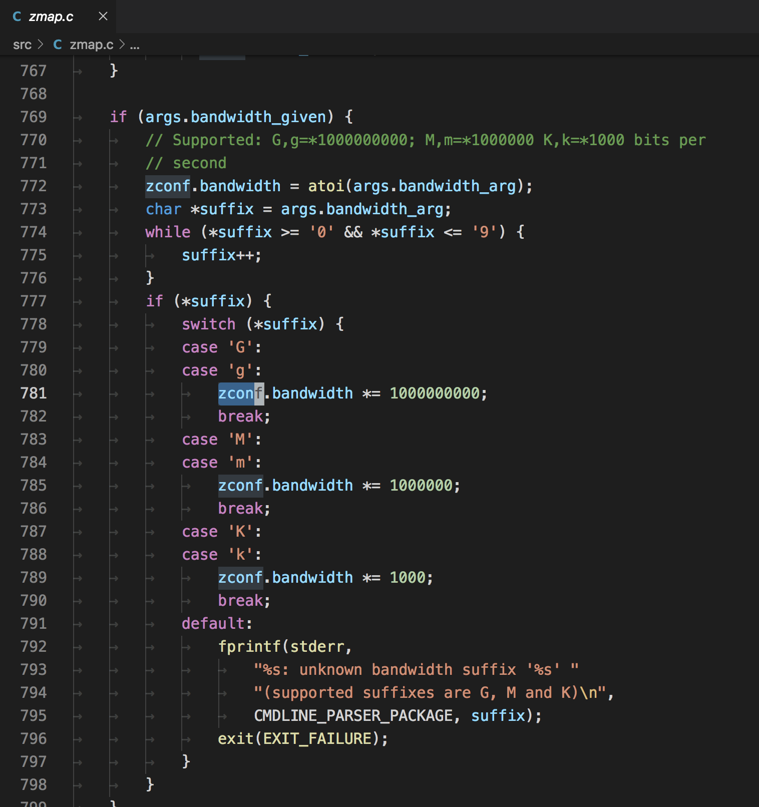

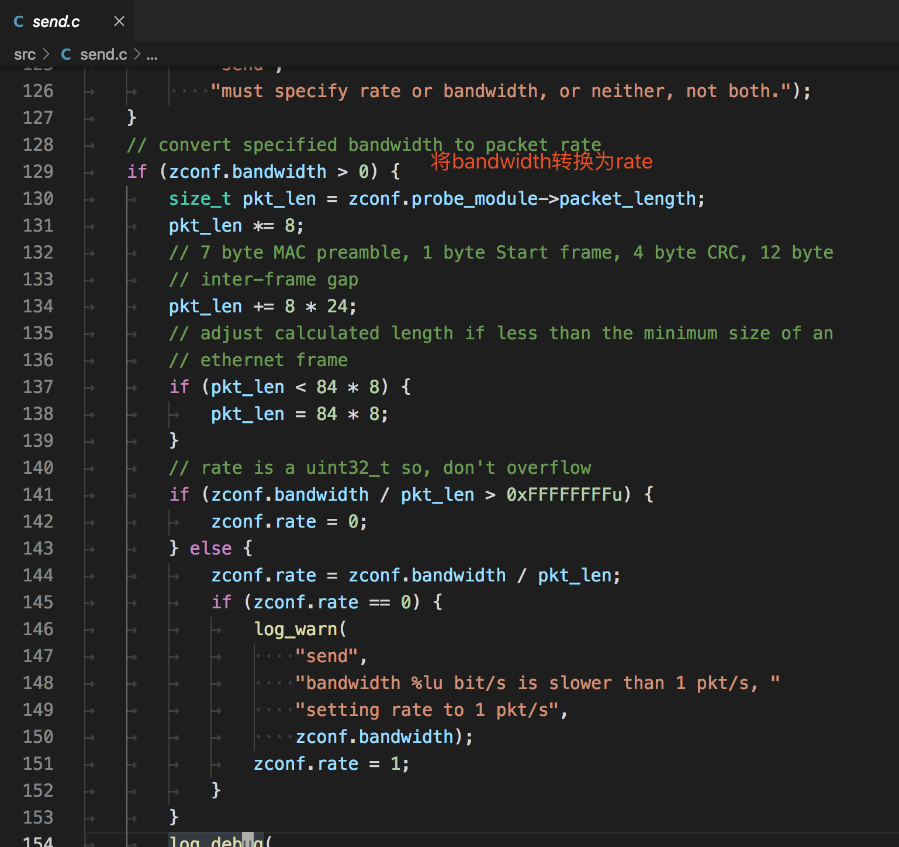

###  发包与解包 

Zmap不支持Windows，因为Zmap的发包默认用的是socket，在window下可能不支持tcp的组包(猜测)。相比之下Masscan使用的是pcap发包，在win/linux都有支持的程序。Zmap接收默认使用的是pcap。 

在构造tcp包时，附带的状态信息会填入到seq和srcport中 

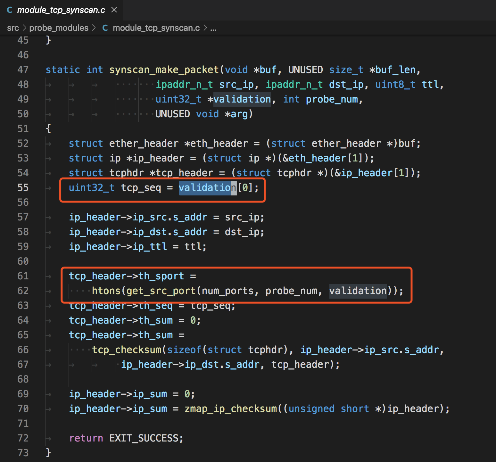

在解包时，先判断返回dstport的数据 

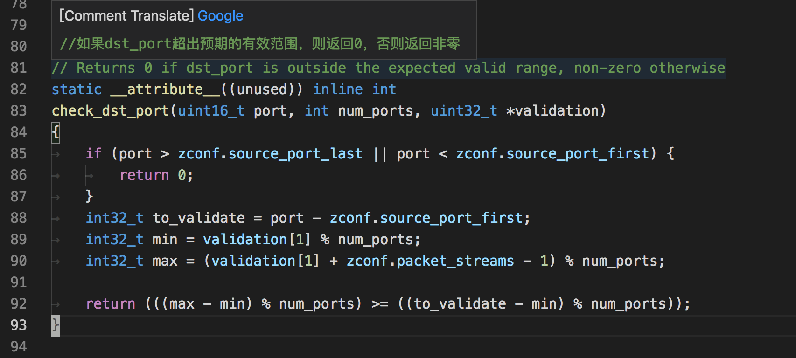

再判断返回的ack中的数据 

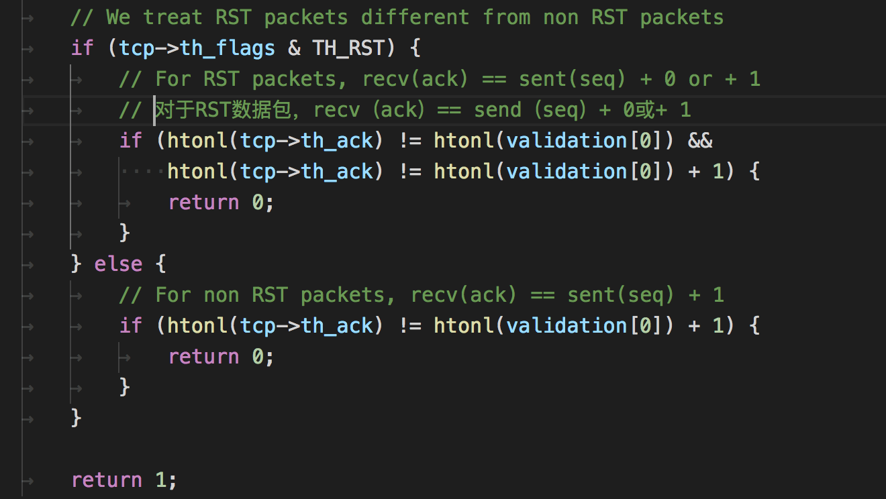

##  用go写端口扫描器 

在了解完以上后，我就准备用go写一款类似的扫描器了，希望能解决丢包的问题，顺便学习go。 

在上面分析中知道了，Masscan和Zmap都使用了pcap，pfring这些组件来原生发包，值得高兴的是go官方也有原生支持这些的包 https://github.com/google/gopacket，而且完美符合我们的要求。 

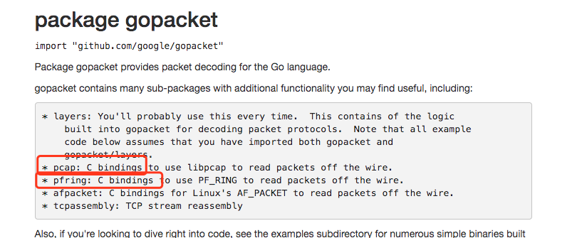

接口没问题，在实现了基础的无状态扫描功能后，接下来就是如何处理丢包的问题。 

###  丢包问题 

按照tcp协议的原理，我们发送一个数据包给目标机器，端口开放时返回`ack`标记，关闭会返回`rst`标记。 

但是通过扫描一台外网的靶机，发现扫描几个端口是没问题的，但是扫描大批量的端口(1-65535)，就可能造成丢包问题。而且不存在的端口不会返回任何数据。 

####  控制速率 

刚开始以为是速度太快了，所以先控制下每秒发送的频率。因为发送和接收都是启动了一个goroutine,目标的传入是通过一个channel传入的(go的知识点)。 

所以控制速率的伪代码类似这样 
```go 
rate := 300 // 每秒速度
var data = []int{1, 2, 3, 4, 5, 6，...,65535} // 端口数组
ports := make(chan int, rate)
go func() {
        // 每秒将data数据分配到ports
        index := 0
        for {
            OldTimestap := time.Now().UnixNano() / 1e6 // 取毫秒

            for i := index; i < index+rate; i++ {
                if len(datas) <= index {
                    break
                }
                index++
                distribution <- data[i]

            }
            if len(datas) <= index {
                break
            }
            Timestap := time.Now().UnixNano() / 1e6
            TimeTick := Timestap - OldTimestap
            if TimeTick < 1000 {
                time.Sleep(time.Duration(1000-TimeTick) * time.Millisecond)
            }
        }
        fmt.Println("发送完毕..")
    }()

```

###  本地状态表 

即使将速度控制到了最小，也存在丢包的问题，后经过一番测试，发现是防火墙的原因。例如常用的`iptables`，其中拒绝的端口不会返回信息。将端口放行后再次扫描，就能正常返回数据包了。 

此时遇到的问题是有防火墙策略的主机如何进行准确扫描，一种方法是扫描几个端口后就延时一段时间，但这不符合快速扫描的设想，所以我的想法是维护一个本地的状态表，状态表中能够动态修改每个扫描结果的状态，将那些没有返回包的目标进行重试。 

Ps：这是针对一个主机，多端口(1-65535)的扫描策略，如果是多个IP，Masscan的`随机化地址扫描`策略就能发挥作用了。 

设想的结构如下 
```go 
// 本地状态表的数据结构
type ScanData struct {
    ip     string
    port   int
    time   int64 // 发送时间
    retry  int   // 重试次数
    status int   // 0 未发送 1 已发送 2 已回复 3 已放弃
}

```

初始数据时`status`为0，当发送数据时，将`status`变更为1，同时记录发送时间`time`,接收数据时通过返回的标记，`dstport`,`seq`等查找到本地状态表相应的数据结构，变更`status`为2，同时启动一个监控程序，监控程序每隔一段时间对所有的状态进行检查，如果发现`stauts`为1并且当前时间-发送时间大于一定值的时候，可以判断这个ip+端口的探测包丢失了，准备重发，将`retry`+1，重新设置发送时间`time`后，将数据传入发送的channel中。 

###  概念验证程序 

因为只是概念验证程序，而且是自己组包发送，需要使用到本地和网关的mac地址等，这些还没有写自动化程序获取，需要手动填写。mac地址可以手动用wireshark抓包获得。 

如果你想使用该程序的话，需要修改全局变量中的这些值 
```go 
var (
    SrcIP  string           = "10.x.x.x" // 源IP
    DstIp  string           = "188.131.x.x" // 目标IP
    device string           = "en0" // 网卡名称
    SrcMac net.HardwareAddr = net.HardwareAddr{0xf0, 0x18, 0x98, 0x1a, 0x57, 0xe8} // 源mac地址
    DstMac net.HardwareAddr = net.HardwareAddr{0x5c, 0xc9, 0x99, 0x33, 0x37, 0x80} // 网关mac地址
)

```

整个go语言源程序如下，单文件。 
```go 
package main

import (
    "fmt"
    "github.com/google/gopacket"
    "github.com/google/gopacket/layers"
    "github.com/google/gopacket/pcap"
    "log"
    "net"
    "sync"
    "time"
)

var (
    SrcIP  string           = "10.x.x.x" // 源IP
    DstIp  string           = "188.131.x.x" // 目标IP
    device string           = "en0" // 网卡名称
    SrcMac net.HardwareAddr = net.HardwareAddr{0xf0, 0x18, 0x98, 0x1a, 0x57, 0xe8} // 源mac地址
    DstMac net.HardwareAddr = net.HardwareAddr{0x5c, 0xc9, 0x99, 0x33, 0x37, 0x80} // 网关mac地址
)
// 本地状态表的数据结构
type ScanData struct {
    ip     string
    port   int
    time   int64 // 发送时间
    retry  int   // 重试次数
    status int   // 0 未发送 1 已发送 2 已回复 3 已放弃
}

func recv(datas *[]ScanData, lock *sync.Mutex) {
    var (
        snapshot_len int32         = 1024
        promiscuous  bool          = false
        timeout      time.Duration = 30 * time.Second
        handle       *pcap.Handle
    )
    handle, _ = pcap.OpenLive(device, snapshot_len, promiscuous, timeout)
    // Use the handle as a packet source to process all packets
    packetSource := gopacket.NewPacketSource(handle, handle.LinkType())
    scandata := *datas

    for {
        packet, err := packetSource.NextPacket()
        if err != nil {
            continue
        }

        if IpLayer := packet.Layer(layers.LayerTypeIPv4); IpLayer != nil {
            if tcpLayer := packet.Layer(layers.LayerTypeTCP); tcpLayer != nil {
                tcp, _ := tcpLayer.(*layers.TCP)
                ip, _ := IpLayer.(*layers.IPv4)
                if tcp.Ack != 111223 {
                    continue
                }
                if tcp.SYN && tcp.ACK {
                    fmt.Println(ip.SrcIP, " port:", int(tcp.SrcPort))
                    _index := int(tcp.DstPort)
                    lock.Lock()
                    scandata[_index].status = 2
                    lock.Unlock()

                } else if tcp.RST {
                    fmt.Println(ip.SrcIP, " port:", int(tcp.SrcPort), " close")
                    _index := int(tcp.DstPort)
                    lock.Lock()
                    scandata[_index].status = 2
                    lock.Unlock()
                }
            }
        }

        //fmt.Printf("From src port %d to dst port %d\n", tcp.SrcPort, tcp.DstPort)
    }
}

func send(index chan int, datas *[]ScanData, lock *sync.Mutex) {
    srcip := net.ParseIP(SrcIP).To4()

    var (
        snapshot_len int32 = 1024
        promiscuous  bool  = false
        err          error
        timeout      time.Duration = 30 * time.Second
        handle       *pcap.Handle
    )
    handle, err = pcap.OpenLive(device, snapshot_len, promiscuous, timeout)
    if err != nil {
        log.Fatal(err)
    }
    defer handle.Close()
    scandata := *datas
    for {
        _index := <-index

        lock.Lock()
        data := scandata[_index]
        port := data.port
        scandata[_index].status = 1
        dstip := net.ParseIP(data.ip).To4()
        lock.Unlock()

        eth := &layers.Ethernet{
            SrcMAC:       SrcMac,
            DstMAC:       DstMac,
            EthernetType: layers.EthernetTypeIPv4,
        }
        // Our IPv4 header
        ip := &layers.IPv4{
            Version:    4,
            IHL:        5,
            TOS:        0,
            Length:     0, // FIX
            Id:         0,
            Flags:      layers.IPv4DontFragment,
            FragOffset: 0,  //16384,
            TTL:        64, //64,
            Protocol:   layers.IPProtocolTCP,
            Checksum:   0,
            SrcIP:      srcip,
            DstIP:      dstip,
        }
        // Our TCP header
        tcp := &layers.TCP{
            SrcPort:  layers.TCPPort(_index),
            DstPort:  layers.TCPPort(port),
            Seq:      111222,
            Ack:      0,
            SYN:      true,
            Window:   1024,
            Checksum: 0,
            Urgent:   0,
        }
        //tcp.DataOffset = 5 // uint8(unsafe.Sizeof(tcp))
        _ = tcp.SetNetworkLayerForChecksum(ip)
        buf := gopacket.NewSerializeBuffer()
        err := gopacket.SerializeLayers(
            buf,
            gopacket.SerializeOptions{
                ComputeChecksums: true, // automatically compute checksums
                FixLengths:       true,
            },
            eth, ip, tcp,
        )
        if err != nil {
            log.Fatal(err)
        }
        //fmt.Println("\n" + hex.EncodeToString(buf.Bytes()))
        err = handle.WritePacketData(buf.Bytes())
        if err != nil {
            fmt.Println(err)
        }
    }
}

func main() {
    version := pcap.Version()
    fmt.Println(version)
    retry := 8

    var datas []ScanData
    lock := &sync.Mutex{}
    for i := 20; i < 1000; i++ {
        temp := ScanData{
            port:   i,
            ip:     DstIp,
            retry:  0,
            status: 0,
            time:   time.Now().UnixNano() / 1e6,
        }
        datas = append(datas, temp)
    }
    fmt.Println("target", DstIp, " count:", len(datas))

    rate := 300
    distribution := make(chan int, rate)

    go func() {
        // 每秒将ports数据分配到distribution
        index := 0
        for {
            OldTimestap := time.Now().UnixNano() / 1e6

            for i := index; i < index+rate; i++ {
                if len(datas) <= index {
                    break
                }
                index++
                distribution <- i

            }
            if len(datas) <= index {
                break
            }
            Timestap := time.Now().UnixNano() / 1e6
            TimeTick := Timestap - OldTimestap
            if TimeTick < 1000 {
                time.Sleep(time.Duration(1000-TimeTick) * time.Millisecond)
            }
        }
        fmt.Println("发送完毕..")
    }()

    go recv(&datas, lock)
    go send(distribution, &datas, lock)
    // 监控
    for {
        time.Sleep(time.Second * 1)
        count_1 := 0
        count_2 := 0
        count_3 := 0
        var ids []int
        lock.Lock()
        for index, data := range datas {
            if data.status == 1 {
                count_1++
                if data.retry >= retry {
                    datas[index].status = 3
                    continue
                }
                nowtime := time.Now().UnixNano() / 1e6
                if nowtime-data.time >= 1000 {
                    datas[index].retry += 1
                    datas[index].time = nowtime
                    ids = append(ids, index)
                    //fmt.Println("重发id:", index)
                    //distribution <- index
                }
            } else if data.status == 2 {
                count_2++
            } else if data.status == 3 {
                count_3++
            }
        }
        lock.Unlock()
        if len(ids) > 0 {
            time.Sleep(time.Second)
            increase := 0
            interval := 60
            for _, v := range ids {
                distribution <- v
                increase++
                if increase > 1 && increase%interval == 0 {
                    time.Sleep(time.Second)
                }
            }
        }
        fmt.Println("status=1:", count_1, "status=2:", count_2, "status=3:", count_3)
    }
}

```

运行结果如下 

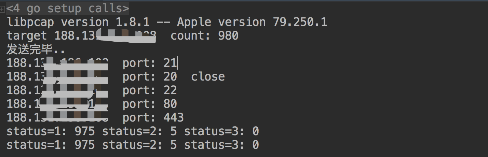

但这个程序并没有解决上述说的防火墙阻断问题，设想很美好，但是在实践的过程中发现这样一个问题。比如扫描一台主机中的1000个端口，第一次扫描后由于有防火墙的策略只检测到了5个端口，剩下995个端口会进行第一次重试，但是重试中依然会遇到防火墙的问题，所以本质上并没有解决这个问题。 

###  Top端口 

这是Masscan源码中一份内置的Top端口表 
```c 
staticconstunsignedshorttop_tcp_ports[]={
1,3,4,6,7,9,13,17,19,20,21,22,23,24,25,26,30,32,33,37,42,43,49,53,70,
79,80,81,82,83,84,85,88,89,90,99,100,106,109,110,111,113,119,125,135,
139,143,144,146,161,163,179,199,211,212,222,254,255,256,259,264,280,
301,306,311,340,366,389,406,407,416,417,425,427,443,444,445,458,464,
465,481,497,500,512,513,514,515,524,541,543,544,545,548,554,555,563,
587,593,616,617,625,631,636,646,648,666,667,668,683,687,691,700,705,
711,714,720,722,726,749,765,777,783,787,800,801,808,843,873,880,888,
898,900,901,902,903,911,912,981,987,990,992,993,995,999,1000,1001,
1002,1007,1009,1010,1011,1021,1022,1023,1024,1025,1026,1027,1028,
1029,1030,1031,1032,1033,1034,1035,1036,1037,1038,1039,1040,1041,
1042,1043,1044,1045,1046,1047,1048,1049,1050,1051,1052,1053,1054,
1055,1056,1057,1058,1059,1060,1061,1062,1063,1064,1065,1066,1067,
1068,1069,1070,1071,1072,1073,1074,1075,1076,1077,1078,1079,1080,
1081,1082,1083,1084,1085,1086,1087,1088,1089,1090,1091,1092,1093,
1094,1095,1096,1097,1098,1099,1100,1102,1104,1105,1106,1107,1108,
1110,1111,1112,1113,1114,1117,1119,1121,1122,1123,1124,1126,1130,
1131,1132,1137,1138,1141,1145,1147,1148,1149,1151,1152,1154,1163,
1164,1165,1166,1169,1174,1175,1183,1185,1186,1187,1192,1198,1199,
1201,1213,1216,1217,1218,1233,1234,1236,1244,1247,1248,1259,1271,
1272,1277,1287,1296,1300,1301,1309,1310,1311,1322,1328,1334,1352,
1417,1433,1434,1443,1455,1461,1494,1500,1501,1503,1521,1524,1533,
1556,1580,1583,1594,1600,1641,1658,1666,1687,1688,1700,1717,1718,
1719,1720,1721,1723,1755,1761,1782,1783,1801,1805,1812,1839,1840,
1862,1863,1864,1875,1900,1914,1935,1947,1971,1972,1974,1984,1998,
1999,2000,2001,2002,2003,2004,2005,2006,2007,2008,2009,2010,2013,
2020,2021,2022,2030,2033,2034,2035,2038,2040,2041,2042,2043,2045,
2046,2047,2048,2049,2065,2068,2099,2100,2103,2105,2106,2107,2111,
2119,2121,2126,2135,2144,2160,2161,2170,2179,2190,2191,2196,2200,
2222,2251,2260,2288,2301,2323,2366,2381,2382,2383,2393,2394,2399,
2401,2492,2500,2522,2525,2557,2601,2602,2604,2605,2607,2608,2638,
2701,2702,2710,2717,2718,2725,2800,2809,2811,2869,2875,2909,2910,
2920,2967,2968,2998,3000,3001,3003,3005,3006,3007,3011,3013,3017,
3030,3031,3052,3071,3077,3128,3168,3211,3221,3260,3261,3268,3269,
3283,3300,3301,3306,3322,3323,3324,3325,3333,3351,3367,3369,3370,
3371,3372,3389,3390,3404,3476,3493,3517,3527,3546,3551,3580,3659,
3689,3690,3703,3737,3766,3784,3800,3801,3809,3814,3826,3827,3828,
3851,3869,3871,3878,3880,3889,3905,3914,3918,3920,3945,3971,3986,
3995,3998,4000,4001,4002,4003,4004,4005,4006,4045,4111,4125,4126,
4129,4224,4242,4279,4321,4343,4443,4444,4445,4446,4449,4550,4567,
4662,4848,4899,4900,4998,5000,5001,5002,5003,5004,5009,5030,5033,
5050,5051,5054,5060,5061,5080,5087,5100,5101,5102,5120,5190,5200,
5214,5221,5222,5225,5226,5269,5280,5298,5357,5405,5414,5431,5432,
5440,5500,5510,5544,5550,5555,5560,5566,5631,5633,5666,5678,5679,
5718,5730,5800,5801,5802,5810,5811,5815,5822,5825,5850,5859,5862,
5877,5900,5901,5902,5903,5904,5906,5907,5910,5911,5915,5922,5925,
5950,5952,5959,5960,5961,5962,5963,5987,5988,5989,5998,5999,6000,
6001,6002,6003,6004,6005,6006,6007,6009,6025,6059,6100,6101,6106,
6112,6123,6129,6156,6346,6389,6502,6510,6543,6547,6565,6566,6567,
6580,6646,6666,6667,6668,6669,6689,6692,6699,6779,6788,6789,6792,
6839,6881,6901,6969,7000,7001,7002,7004,7007,7019,7025,7070,7100,
7103,7106,7200,7201,7402,7435,7443,7496,7512,7625,7627,7676,7741,
7777,7778,7800,7911,7920,7921,7937,7938,7999,8000,8001,8002,8007,
8008,8009,8010,8011,8021,8022,8031,8042,8045,8080,8081,8082,8083,
8084,8085,8086,8087,8088,8089,8090,8093,8099,8100,8180,8181,8192,
8193,8194,8200,8222,8254,8290,8291,8292,8300,8333,8383,8400,8402,
8443,8500,8600,8649,8651,8652,8654,8701,8800,8873,8888,8899,8994,
9000,9001,9002,9003,9009,9010,9011,9040,9050,9071,9080,9081,9090,
9091,9099,9100,9101,9102,9103,9110,9111,9200,9207,9220,9290,9415,
9418,9485,9500,9502,9503,9535,9575,9593,9594,9595,9618,9666,9876,
9877,9878,9898,9900,9917,9929,9943,9944,9968,9998,9999,10000,10001,
10002,10003,10004,10009,10010,10012,10024,10025,10082,10180,10215,
10243,10566,10616,10617,10621,10626,10628,10629,10778,11110,11111,
11967,12000,12174,12265,12345,13456,13722,13782,13783,14000,14238,
14441,14442,15000,15002,15003,15004,15660,15742,16000,16001,16012,
16016,16018,16080,16113,16992,16993,17877,17988,18040,18101,18988,
19101,19283,19315,19350,19780,19801,19842,20000,20005,20031,20221,
20222,20828,21571,22939,23502,24444,24800,25734,25735,26214,27000,
27352,27353,27355,27356,27715,28201,30000,30718,30951,31038,31337,
32768,32769,32770,32771,32772,32773,32774,32775,32776,32777,32778,
32779,32780,32781,32782,32783,32784,32785,33354,33899,34571,34572,
34573,35500,38292,40193,40911,41511,42510,44176,44442,44443,44501,
45100,48080,49152,49153,49154,49155,49156,49157,49158,49159,49160,
49161,49163,49165,49167,49175,49176,49400,49999,50000,50001,50002,
50003,50006,50300,50389,50500,50636,50800,51103,51493,52673,52822,
52848,52869,54045,54328,55055,55056,55555,55600,56737,56738,57294,
57797,58080,60020,60443,61532,61900,62078,63331,64623,64680,65000,
65129,65389};

```

可以使用`--top-ports = n`来选择数量。 

这是在写完go扫描器后又在Masscan中发现的，可能想象到Masscan可能也考虑过这个问题，它的方法是维护一个top常用端口的排行来尽可能减少扫描端口的数量，这样可以覆盖到大多数的端口(猜测)。 

##  总结 

概念性程序实践失败了，所以再用go开发的意义也不大了，后面还有一个坑就是go的pcap不能跨平台编译，只能在Windows下编译windows版本，mac下编译mac版本。 

但是研究了Masscan和Zmap在tcp协议下的syn扫描模式，还是有很多收获，以及明白了它们为什么要这么做，同时对网络协议和一些更低层的细节有了更深的认识。 

这里个人总结了一些tips： 

  * Masscan源码比Zmap读起来更清晰，注释也很多，基本上一看源码就能明白大致的结构了。 
  * Masscan和Zmap最高速度模式都是使用的pfring这个驱动程序，理论上它两的速度是一致的，只是它们宣传口径不一样？ 
  * 网络宽带足够情况下，扫描单个端口准确率是最高的(通过自己编写go扫描器的实践得出)。 
  * Masscan和Zmap都能利用多网卡，但是Zmap线程切换用了锁，可能会消耗部分时间。 
  * 设置发包速率时不仅要考虑自己带宽，还要考虑目标服务器的承受情况（扫描多端口时） 


##  参考链接 

  * 基于无状态的极速扫描技术
  * Github:Masscan
  * Github:Zmap
  * Zmap源码解读之Zmap扫描快的原因


