# 代码分析引擎CodeQL初体验

QL是一种查询语言，支持对C++，C#，java，JavaScript，python，go等多种语言进行分析，可用于分析代码，查找代码中控制流等信息。

之前笔者有简单的研究通过JavaScript语义分析来查找XSS，所以对于这款引擎有浓厚的研究兴趣 。

## 安装

  1. 下载分析程序：https://github.com/github/codeql-cli-binaries/releases/latest/download/codeql.zip

    1. 分析程序支持主流的操作系统,Windows,Mac,Linux
  2. 下载相关库文件：https://github.com/Semmle/ql

    1. 库文件是开源的，我们要做的是根据这些库文件来编写QL脚本。
  3. 下载最新版的VScode，按照CodeQL扩展程序：https://marketplace.visualstudio.com/items?itemName=GitHub.vscode-codeql

    1. 用vscode的扩展可以方便我们看代码

    2. 然后到扩展中心配置相关参数

      1. 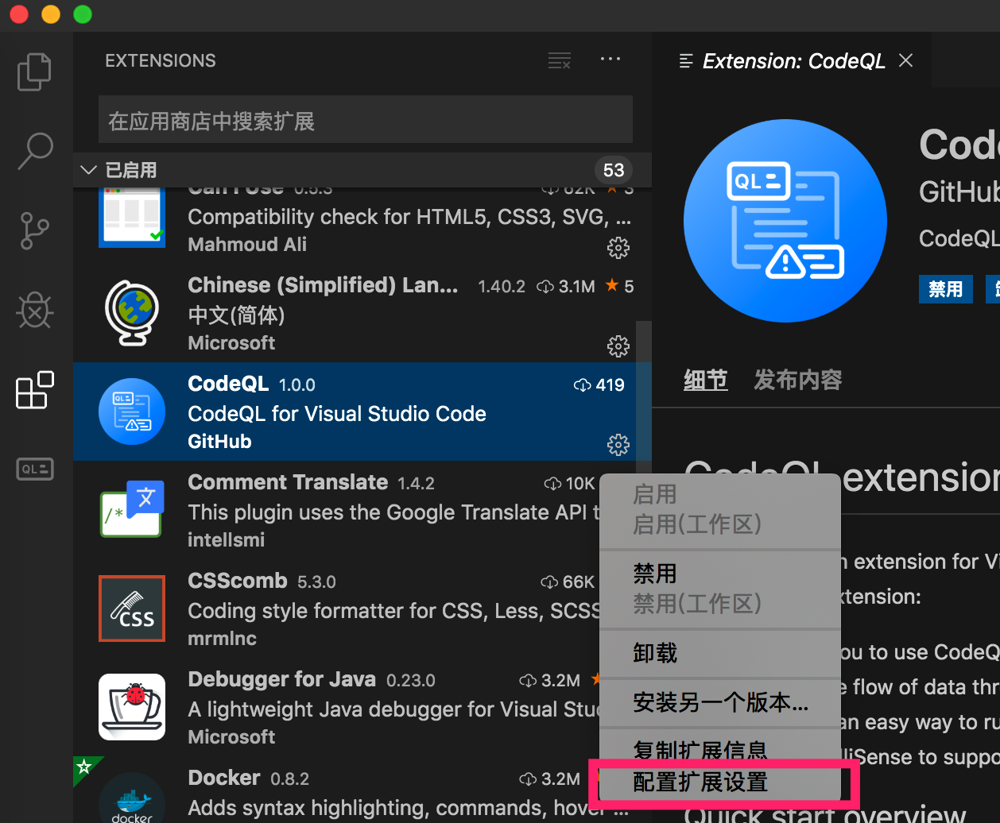
  4. 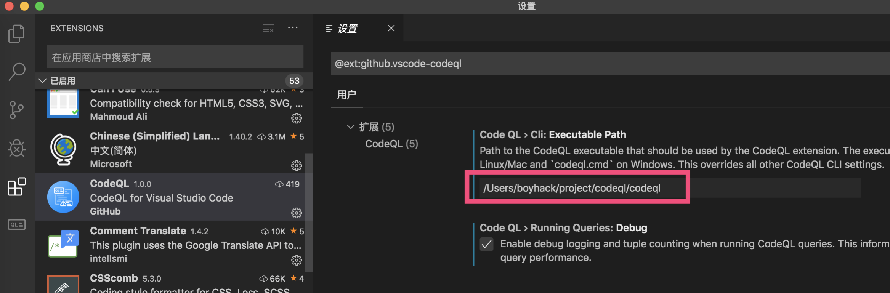
    1. cli填写下载的分析程序路径就行了，windows可以填写codeql.cmd
    2. 其他地方默认就行


## 建立数据库

以JavaScript为例，建立分析数据库，建立数据库其实就是用分析程序来分析源码。到要分析源码的根目录，执行`codeql database create jstest --language=javascript`

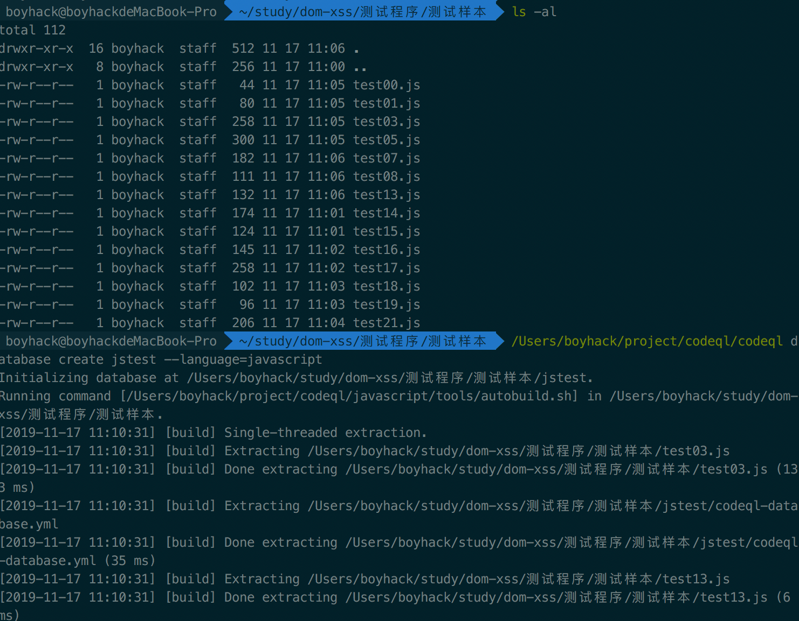

接下来会在该目录下生成一个`jstest`的文件夹，就是数据库的文件夹了。

接着用vscode打开之前下载的ql库文件，在ql选择夹中添加刚才的数据库文件，并设置为当前数据库。

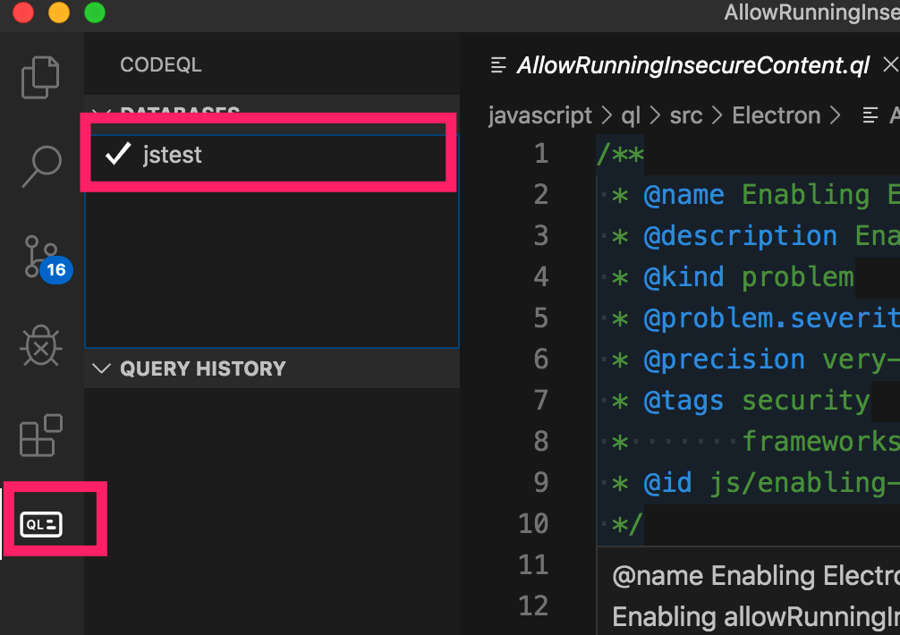

接着在QL/javascript/ql/src目录下新建一个test.ql，用来编写我们的ql脚本。为什么要在这个目录下建立文件呢，因为在其他地方测试的时候`import javascript`导入不进来，在这个目录下，有个`javascript.qll`就是基础类库，就可以直接引入`import javascript`，当然可能也有其他的方法。

看它的库文件，它基本把JavaScript中用到的库，或者其他语言的定义语法都支持了。

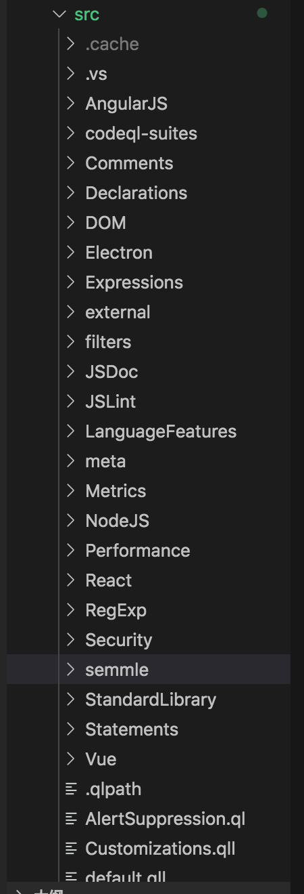

输出一段hello world试试？

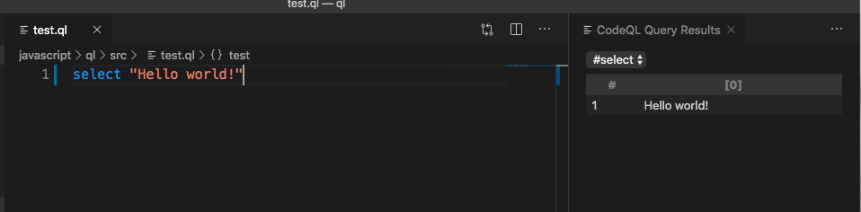

## 语义分析查找的原理

刚开始接触ql语法的时候可能会感到它的语法有些奇怪，它为什么要这样设计？我先说说自己之前研究基于JavaScript语义分析查找dom-xss是怎样做的。

首先一段类似这样的javascript代码
```javascript 
var param = location.hash.split("#")[1];
document.write("Hello " + param + "!");

```

常规的思路是，我们先找到`document.write`函数，由这个函数的第一个参数回溯寻找，如果发现它最后是`location.hash.split("#")[1];`，就寻找成功了。我们可以称`document.write`为`sink`,称`document.write`为`source`。基于语义分析就是由sink找到source的过程(当然反过来找也是可以的)。

而基于这个目标，就需要我们设计一款理解代码上下文的工具，传统的正则搜索已经无法完成了。

第一步要将JavaScript的代码转换为语法树,通过`pyjsparser`可以进行转换
```python 
from pyjsparser import parse
import json
html = '''
    var param = location.hash.split("#")[1];
document.write("Hello " + param + "!");
    '''
js_ast = parse(html)
print(json.dumps(js_ast)) # 它输出的是python的dict格式，我们用转换为json方便查看

```

最终就得到了如下一个树结构

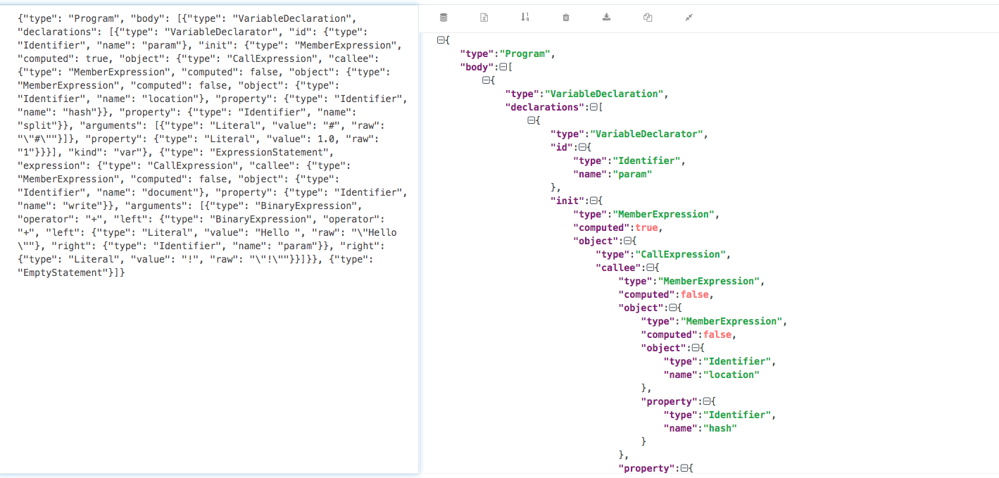

这些树结构的一些定义可以参考：https://esprima.readthedocs.io/en/3.1/syntax-tree-format.html

大概意思可以这样理解：变量`param`是一个`Identifier`类型，它的初始化定义的是一个`MemberExpression`表达式，该表达式其实也是一个`CallExpression`表达式，`CallExpression`表达式的参数是一个`Literal`类型，而它具体的定义又是一个`MemberExpression`表达式。

第二步，我们需要设计一个递归来找到每个表达式，每一个`Identifier`,每个`Literal`类型等等。我们要将之前的`document.write`转换为语法树的形式
```json 
{
"type":"MemberExpression",
  "object":{
    "type":"Identifier",
    "name":"document"
  },
  "property":{
    "type":"Identifier",
    "name":"write"
  }
}

```

`location.hash`也是同理
```json 
{
  "type":"MemberExpression",
  "object":{
    "type":"Identifier",
    "name":"location"
  },
  "property":{
    "type":"Identifier",
    "name":"hash"
  }
}

```

在找到了这些`sink`或`source`后，再进行正向或反向的回溯分析。回溯分析也会遇到不少问题，如何处理对象的传递，参数的传递等等很多问题。之前也基于这些设计写了一个在线基于语义分析的demo

## QL语法

QL语法虽然隐藏了语法树的细节，但其实它提供了很多类似`类`,`函数`的概念来帮助我们查找相关’语法’。

依旧是这段代码为例子
```javascript 
var param = location.hash.split("#")[1];
document.write("Hello " + param + "!");

```

上文我们已经建立好了查询的数据库，现在我们分别来看如何查找sink，source，以及怎样将它们关联起来。

我也是看它的文档:https://help.semmle.com/QL/learn-ql/javascript/introduce-libraries-js.html 学习的，它提供了很多方便的函数，我没有仔细看。我的查询语句都是基于语法树的查询思想，可能官方已经给出了更好的查询方式，所以看看就行了，反正也能用。

### 查询 document.write
```
import javascript

from Expr dollarArg,CallExpr dollarCall
where dollarCall.getCalleeName() = "write" and
    dollarCall.getReceiver().toString() = "document" and
    dollarArg = dollarCall.getArgument(0)
select dollarArg

```

这段语句的意思是查找document.write，并输出它的第一个参数

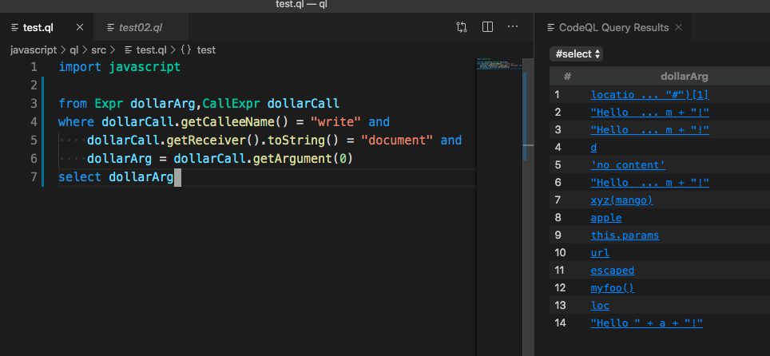

### 查找 location.hash.split
```
import javascript

from CallExpr dollarCall
where dollarCall.getCalleeName() = "split" and
    dollarCall.getReceiver().toString() = "location.hash"
select dollarCall

```

查找location.hash.split并输出

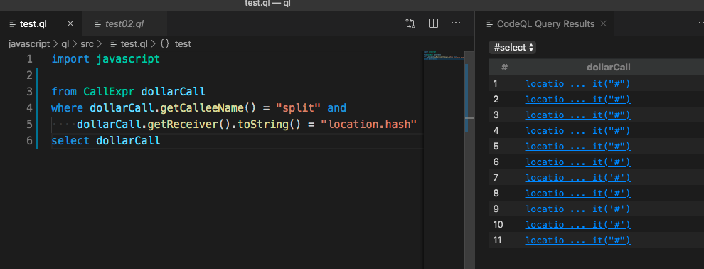

### 数据流分析

接着从`sink`来找到`source`，将上面语句组合下，按照官方的文档来就行
``` 
class XSSTracker extends TaintTracking::Configuration {
  XSSTracker() {
    // unique identifier for this configuration
    this = "XSSTracker"
  }

  override predicate isSource(DataFlow::Node nd) {
   exists(CallExpr dollarCall |
      nd.asExpr() instanceof CallExpr and
      dollarCall.getCalleeName() = "split" and
      dollarCall.getReceiver().toString() = "location.hash" and
      nd.asExpr() = dollarCall
    ) 
  }

  override predicate isSink(DataFlow::Node nd) {
    exists(CallExpr dollarCall |
      dollarCall.getCalleeName() = "write" and
      dollarCall.getReceiver().toString() = "document" and
      nd.asExpr() = dollarCall.getArgument(0)
    )
  }
}

from XSSTracker pt, DataFlow::Node source, DataFlow::Node sink
where pt.hasFlow(source, sink)
select source,sink

```

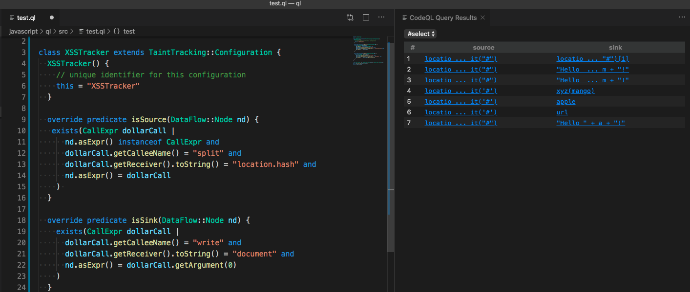

将source和sink输出，就能找到它们具体的定义。

我们找到查询到的样本

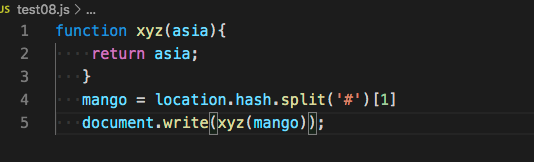

可以发现它的回溯是会根据变量，函数的返回值一起走的。

当然从source到sink也不可能是一马平川的，中间肯定也会有阻挡的条件，ql官方有给出解决方案。总之就是要求我们更加细化完善ql查询代码。

接下来放出几个查询还不精确的样本，大家可以自己尝试如何进行查询变得精确。
``` 
var custoom = location.hash.split("#")[1];
var param = '';
param = " custoom:" + custoom;
param = param.replace('<','');
param = param.replace('"','');
document.write("Hello " + param + "!");

```
```
quora = {
    zebra: function (apple) {
        document.write(this.params);
    },
    params:function(){
        return location.hash.split('#')[1];
    }
};
quora.zebra();

```

## 最后

CodeQL将语法树抽离出来，提供了一种用代码查询代码的方案，更增强了基于数据分析的灵活度。唯一的遗憾是它并没有提供很多查询漏洞的规则，它让我们自己写。这也不由得让我想起另一款强大的基于语义的代码审计工具fortify,它的规则库是公开的，将这两者结合一下说不定会有不一样的火花。

Github公告说将用它来搜索开源项目中的问题，而作为安全研究员的我们来说，也可以用它来做类似的事情？
