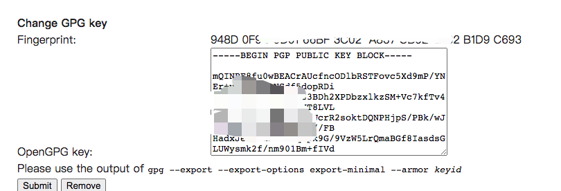
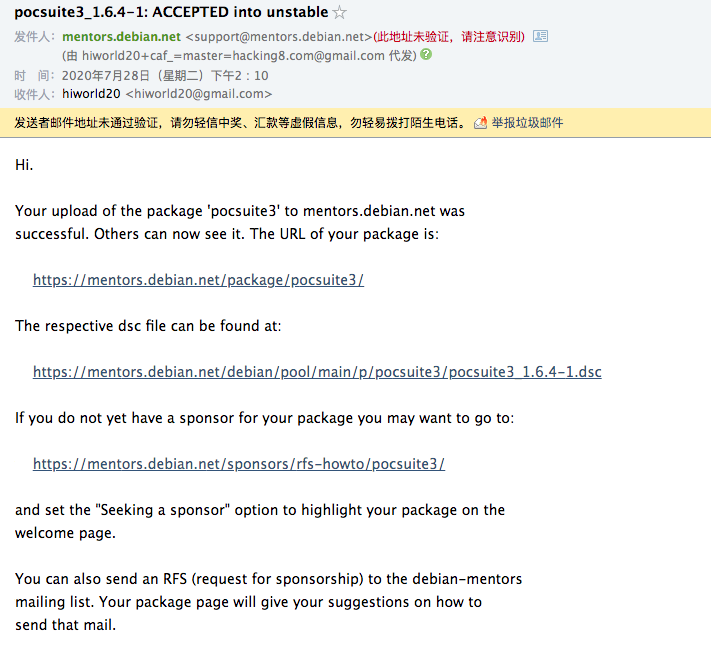
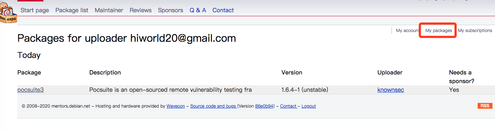
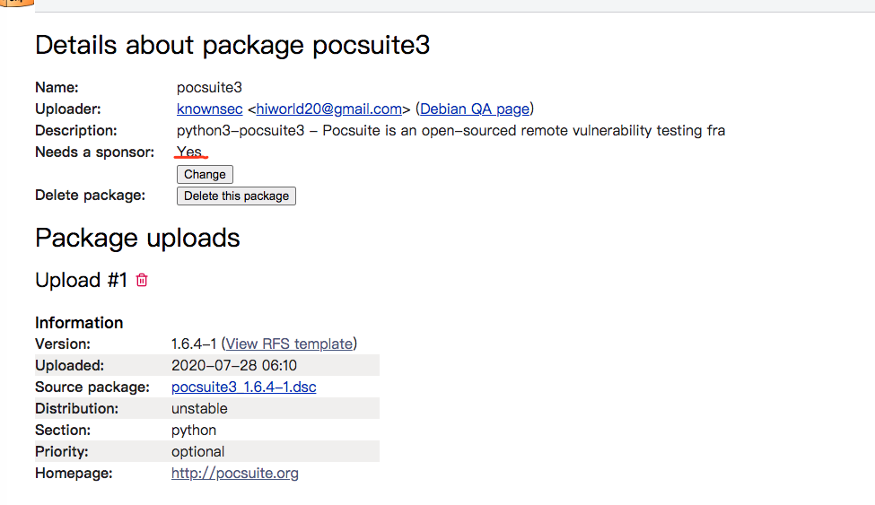

# 发布软件到debian源

这是将pocsuite3发布到debian源中的记录文档。官方的参考文档在 https://mentors.debian.net/intro-maintainers/ 

官方文档部分过程比较简略，这里记录详细过程。 

##  1.新建 _ITP_ 请求 

想将自己的工具打包上传到debian的第一步，是通过reportbug来报告自己的工具。 

参考文档：https://www.debian.org/devel/wnpp/ 
``` 
apt-get install reportbug
reportbug --email username@domain.tld wnpp
    选择 Intent To Package ITP

```

reportbug原理就是向debian官方邮件组发送一封邮件，邮件内容最后如下（可参考） 
``` 
Package: wnpp
Owner: root <hiworld20@gmail.com>
Severity: wishlist

* Package name    : pocsuite3
  Version         : 1.6.4
  Upstream Author : w7ay <hiworld20@gmail.com>
* URL             : https://github.com/knownsec/pocsuite3
* License         : GPL2.0
  Programming Lang: Python3
  Description     : pocsuite3 is an open-sourced remote vulnerability testing and proof-of-concept development framework developed by the Knownsec 404 Team. It comes with a powerful proof-of-concept engine, many powerful features for the ultimate penetration testers and security researchers.

pocsuite3 is a poc verification framework launched by the knownsec 404 team, which can quickly verify whether the service has vulnerabilities. It is an open source framework written in Python. I think it is very effective and it is necessary to put it into debian.
The packages that pocsuite3 depends on all exist in Debian, such as python3-requests.
Our team is packaging and planning to maintain this package.

```

##  2.构建软件包 

打包为deb格式，需要参考官方文档https://www.debian.org/doc/manuals/maint-guide/ 来配置相关文件,同时查阅https://www.debian.org/doc/manuals/maint-guide/build.zh-cn.html#completebuild来构建软件包。 

但pocsuite3是python3编写的，python有个打包工具可以自动化转化为debian的包 

https://github.com/astraw/stdeb 
``` 
apt-get install python3-stdeb fakeroot python3-all

```

stdeb会自动运行tests.py测试用例，保证测试用例全部运行成功 

只生成源包，包含copyright 
``` 
python3 setup.py --command-packages=stdeb.command sdist_dsc --copyright-file COPYING

```

构建完成后，会生成文件到deb_dist目录 

源包编译.deb 
``` 
cd deb_dist/reindent-0.1.0
dpkg-buildpackage -rfakeroot -uc -us

```

建立.deb软件包后，用`lintian`来检查打包格式还有哪些错误。 eg：lintian somescripts_0.1-1_i386.deb或lintian package-source.changes 

##  3.上传debian 

上传deb包前先要创建自己gpg公钥(需要4096bit)，其他默认即可。 

同时在https://mentors.debian.net/ 创建一个用户(qq邮箱收不到邮件，可以用gmail)，设置中填写公钥。 



接着使用`debsign`工具对deb_dist目录中的.dsc,.changes文件签名,签名之前设置下签名使用的用户ID，编辑`~/.devscripts`

填写 
``` 
DEBSIGN_KEYID=Your_GPG_keyID

```

签名 
``` 
debsign example.dsc
debsign dexample.changes

```

签名完成后可以开始上传软件了。 

创建配置文件`~/.dput.cf`，配置debian的ftp地址 
``` 
[mentors-ftp]
fqdn = mentors.debian.net
login = anonymous
progress_indicator = 2
passive_ftp = 1
incoming = /pub/UploadQueue/
method = ftp
allow_unsigned_uploads = 0
# Allow uploads for UNRELEASED packages
allowed_distributions = .*

```

上传文件 
``` 
dput mentors your_sourcepackage_1.0.changes

```

上传完毕后，会收到一封邮件，告诉我pocsuite3已经被接受了 



同时给出了项目地址 https://mentors.debian.net/package/pocsuite3/ 

和下载地址 https://mentors.debian.net/debian/pool/main/p/pocsuite3/pocsuite3_1.6.4-1.dsc 

同时在自己的打包记录中看到记录。 



##  4.寻求赞助 

自己的包已经被debian添加上了，但还不能下载，这时相当于一个“审核”时刻。不是所有上传的包都能被debian官方收录，需要寻找debian的开发人员，帮助你将包上传到官方仓库。debian开发人员帮助你的过程称为“赞助”。 

如何让别人赞助呢？首先到包的页面，有个是否需要赞助，修改一下状态，表明需要赞助 



然后撰写一封邮件，或使用reportbug工具发送给官方，我选择直接发邮件。 

To: submit@bugs.debian.org 

邮件内容 
``` 
Package: sponsorship-requests
Severity: wishlist

Dear mentors,

I am looking for a sponsor for my package "pocsuite3":

 * Package name    : pocsuite3
   Version         : 1.6.4-1
   Upstream Author : knownsec 404 team (hiworld20@gmail.com)
 * URL             : http://pocsuite.org
 * License         : GPL2.0
 * Vcs             : https://github.com/knownsec/pocsuite3
   Section         : python

It builds those binary packages:

  python3-pocsuite3 - Pocsuite is an open-sourced remote vulnerability testing framework.

To access further information about this package, please visit the following URL:

  https://mentors.debian.net/package/pocsuite3/

Alternatively, one can download the package with dget using this command:

  dget -x https://mentors.debian.net/debian/pool/main/p/pocsuite3/pocsuite3_1.6.4-1.dsc

Changes since the last upload:

 pocsuite3 (1.6.4-1) unstable; urgency=low
 .
   * source package automatically created by stdeb 0.8.5

Regards

```

之后就是等待有兴趣的debian开发人员来帮助你标准化包和上传了。 
