# 如何消除Go的编译特征

Go默认编译会自带一堆信息，通过这些信息基本可以还原Go的源码架构，

本文就是研究如何消除或者混淆这些信息，记录了这个研究过程，如果不想看可以直接跳到文章末尾，文章末尾提供了一款工具，可以一键消除Go二进制中的这些敏感信息。

但还是推荐看看研究过程，可以明白这个工具的运行原理。

## 从逆向Go开始

先写一个简单的程序

我的go版本是
``` 
go version go1.16.2 windows/amd64

```
```go
package main

import (
    "fmt"
    "log"
    "math/rand"
)

func main() {
    fmt.Println("hello world!")

    log.SetFlags(log.Lshortfile | log.LstdFlags)
    for i:=0;i<10;i++{
        log.Println(rand.Intn(100))
    }

    panic("11")
}

```

编译
``` 
go build main.go

```

它运行后会如下输出

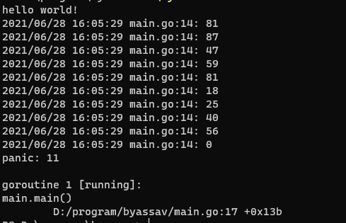

可以观察到程序日志打印时打印了文件名，panic抛出错误的时候堆栈的文件名也抛出了，可以想象Go编译的二进制程序内部肯定有个数据结构存储了这些信息。

用IDA打开这个二进制

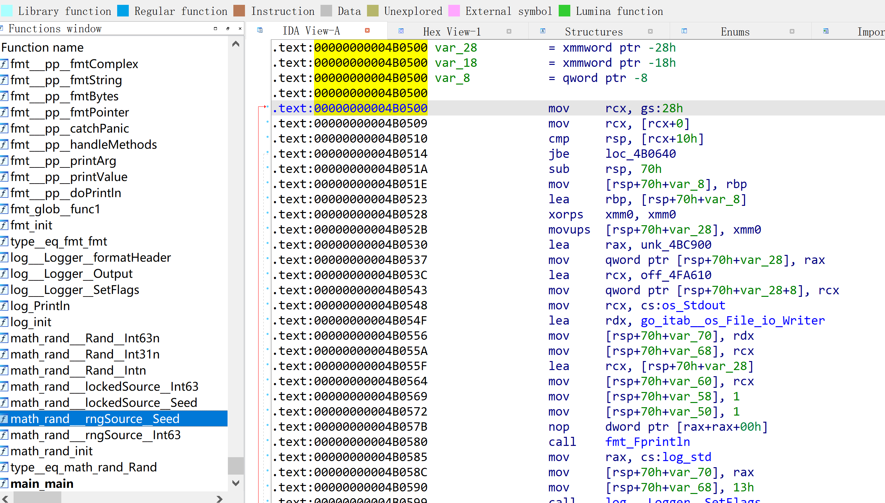

能够看到函数符号的名称。

查看PE的结构发现有个`symtab`区段

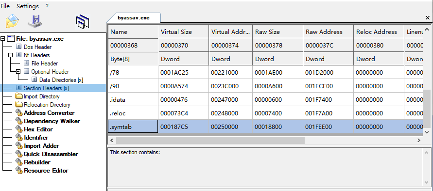

原来普通的使用`go build .`进行编译，会连符号和调试信息一起编译到里面。

重新使用命令编译
``` 
go build -ldflags "-s -w" main.go

```

再次用IDA打开，发现符号信息都不见了。

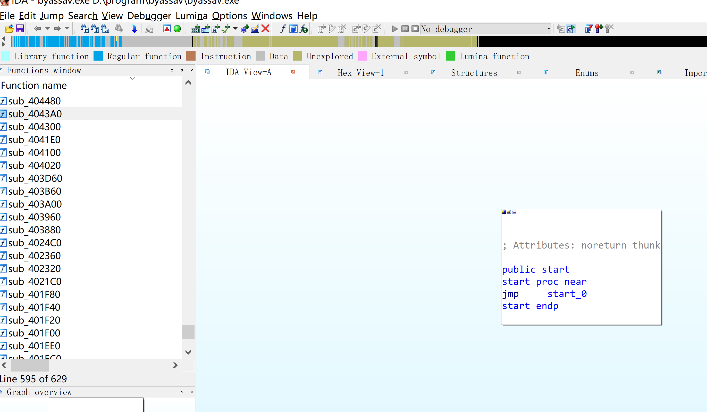

再次运行程序，却发现文件路径信息还是存在。

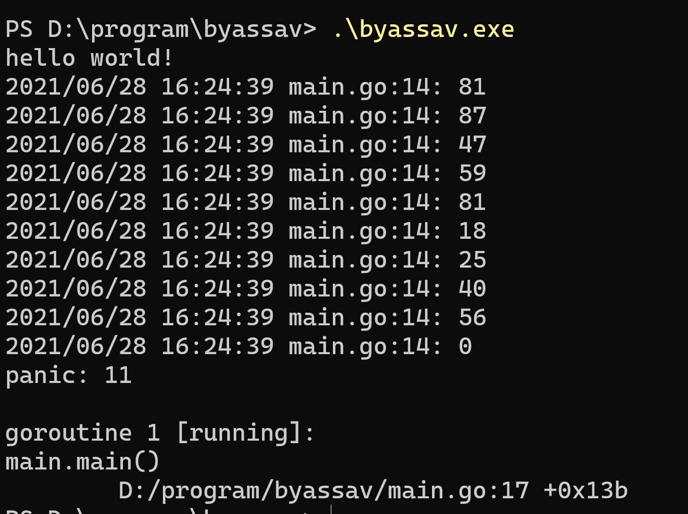

但是自己写的代码中根本没有这些字符啊，只可能是go在编译的时候自己打包进去的。

所以引出两个问题

  * Go为什么要打包这些信息
  * Go打包了哪些信息


### Go为什么要打包这些信息

> Go 二进制文件里打包进去了 **runtime** 和 **GC** 模块，还有独特的 **Type Reflection**(类型反射) 和 **Stack Trace** 机制，都需要用到这些信息。

来自 Go二进制文件逆向分析从基础到进阶——综述 - 安全客，安全资讯平台 (anquanke.com)

### Go打包了哪些信息

  * Go Version
  * Go BuildID
  * GOROOT
  * 函数名称和源码路径
  * struct 和 type 和 interface


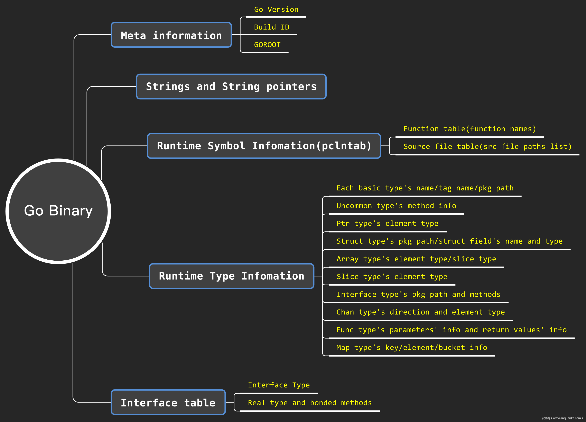

### Go逆向方式

看 https://www.anquanke.com/post/id/214940 这篇文章就能知道，通过解析Go二进制中这些内置的数据结构，就可以还原出符号信息。

> 有安全研究员发现除了可以从 **pclntab** 结构中解析、恢复函数符号，Go 二进制文件中还有大量的类型、方法定义的信息，也可以解析出来。这样就可以大大方便对 Go 二进制文件中复杂数据结构的逆向分析。

基于这种方式，已经有人写好了ida的脚本来恢复

  * https://github.com/0xjiayu/go_parser
    * 仅支持到Go1.6，Go1.6之后数据结构有略微的改动，但是项目还没更新
  * https://github.com/renzhexigua/go_parser/tree/py3_1.16
    * 支持到Go1.6的脚本


运行这些脚本，就能还原一些符号信息了。

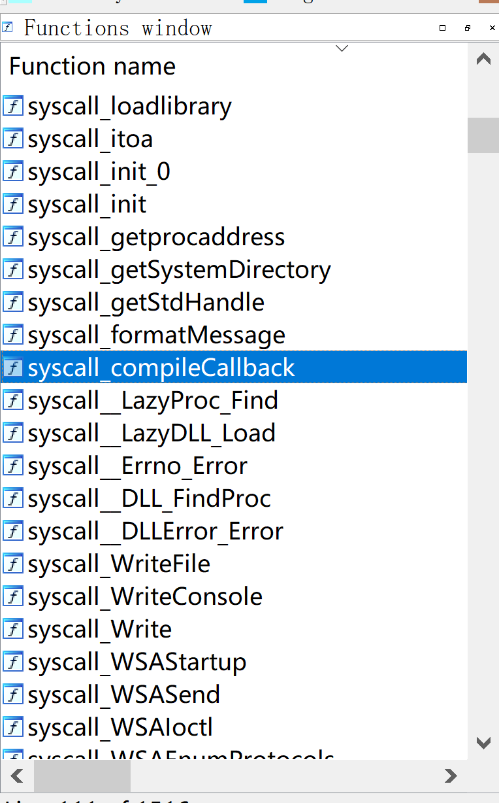

## redress和gore

前面的是基于IDA的脚本，因为Go也内置了自己的数据结构，用Go来解析Go更方便。

goretk/redress: Redress - A tool for analyzing stripped Go binaries

  * https://github.com/goretk/redress


``` 
.\redress.exe -pkg -std -filepath  -interface main.exe

```

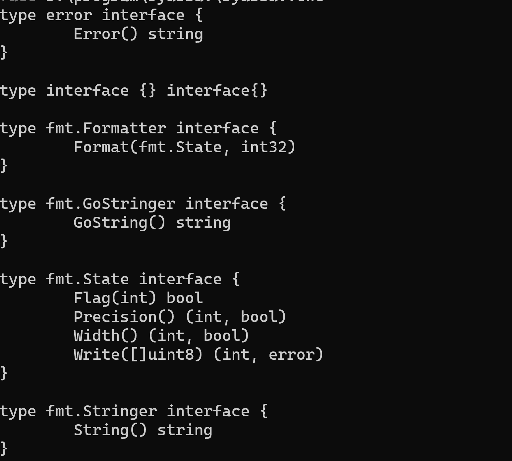

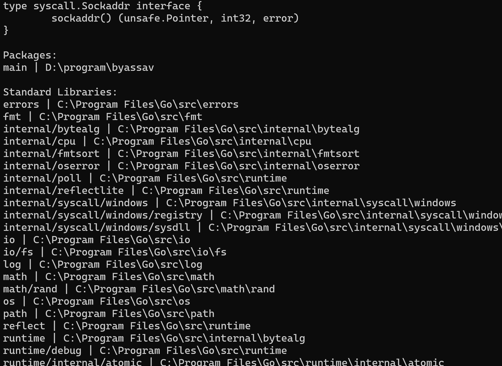

redress只是工具的前端，如果看它代码的话会发现，实际的解析代码在

  * https://github.com/goretk/gore


这款工具能从Go二进制中获取非常多的信息，几乎可以用它来还原Go的源码结构，这么神奇的工具，怎能不看看它是如何实现的呢。

## GoRE 代码学习

在GoRE中，`PCLNTab`是直接使用内置的`debug/gosym`生成，可用于获取源码路径和函数名称。

其他解析数据结构的地方很枯燥，有兴趣可以看@J!4Yu师傅的文章，很全面的讲解了Go的数据结构

  * https://www.anquanke.com/post/id/214940


我就说说看得几个有意思的点

### Go version 获取

go官方命令`go version`不仅可以获取自身的go版本信息，如果后面跟一个Go文件路径， 就能获得那个文件的go的编译器信息。

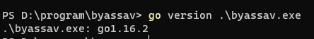

查看Go源代码，看看是怎么实现的

`src\cmd\go\internal\version\version.go`
```go 
var buildInfoMagic = []byte("\xff Go buildinf:")

```

Go官方是通过搜索这个魔术字符，用IDA定位到这个地方，可以看到，这个魔术字符后面就跟着Go版本信息的地址偏移。

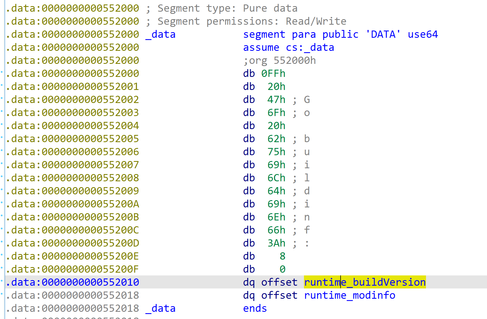

官方实现代码
```go 
// The build info blob left by the linker is identified by
// a 16-byte header, consisting of buildInfoMagic (14 bytes),
// the binary's pointer size (1 byte),
// and whether the binary is big endian (1 byte).
var buildInfoMagic = []byte("\xff Go buildinf:")

// findVers finds and returns the Go version and module version information
// in the executable x.
func findVers(x exe) (vers, mod string) {
    // Read the first 64kB of text to find the build info blob.
    text := x.DataStart()
    data, err := x.ReadData(text, 64*1024)
    if err != nil {
        return
    }
    for ; !bytes.HasPrefix(data, buildInfoMagic); data = data[32:] {
        if len(data) < 32 {
            return
        }
    }

    // Decode the blob.
    ptrSize := int(data[14])
    bigEndian := data[15] != 0
    var bo binary.ByteOrder
    if bigEndian {
        bo = binary.BigEndian
    } else {
        bo = binary.LittleEndian
    }
    var readPtr func([]byte) uint64
    if ptrSize == 4 {
        readPtr = func(b []byte) uint64 { return uint64(bo.Uint32(b)) }
    } else {
        readPtr = bo.Uint64
    }
    vers = readString(x, ptrSize, readPtr, readPtr(data[16:]))
    if vers == "" {
        return
    }
    mod = readString(x, ptrSize, readPtr, readPtr(data[16+ptrSize:]))
    if len(mod) >= 33 && mod[len(mod)-17] == '\n' {
        // Strip module framing.
        mod = mod[16 : len(mod)-16]
    } else {
        mod = ""
    }
    return
}

// readString returns the string at address addr in the executable x.
func readString(x exe, ptrSize int, readPtr func([]byte) uint64, addr uint64) string {
    hdr, err := x.ReadData(addr, uint64(2*ptrSize))
    if err != nil || len(hdr) < 2*ptrSize {
        return ""
    }
    dataAddr := readPtr(hdr)
    dataLen := readPtr(hdr[ptrSize:])
    data, err := x.ReadData(dataAddr, dataLen)
    if err != nil || uint64(len(data)) < dataLen {
        return ""
    }
    return string(data)
}

```

### GoRE version 获取

交叉引用上文的`runtime_buildVersion`字符串，可以看到三处调用的地方。

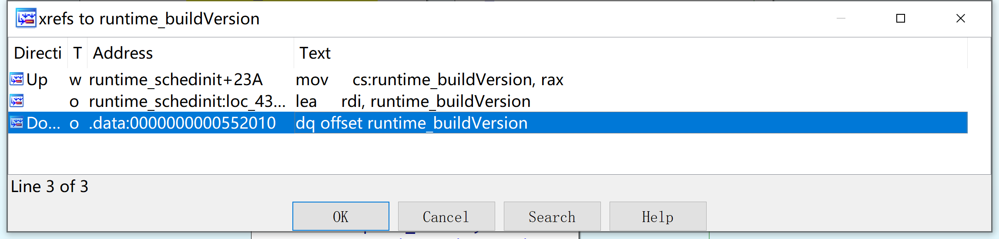

前两个是`runtime_schedinit`内部的实现，第三个是官方工具go version的实现方式。

转到`runtime_schedinit`地址查看

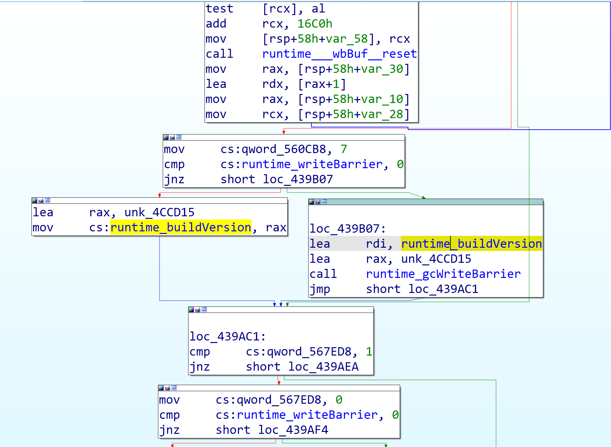

GoRE的 verison 实现就是基于`runtime_schedinit`的，首先找到`runtime_schedinit`函数的地址，反汇编寻找`lea`的机器码，寻找基于EIP或RIP的地址。这种寻找地址的办法和我之前学习的直接用机器码匹配的方式不同，算是学习到了~

在后面这种方式也帮助我成功解析到了Go Root。

### Go Root解析

GoRe已经是解析Go的比较完美的工具，但是发现没有解析Go Root，这个也是能作为一个字符特征的，所以我准备加上这个功能。

我的go环境是
``` 
go version go1.16.2 windows/amd64

```

可以直接用这个测试代码
```go 
package main

import (
    "fmt"
    "runtime"
)

func main() {
    fmt.Println("hello world!")
    fmt.Println(runtime.GOROOT())
}

```
``` 
go build . 编译

```

编译后运行会输出GOROOT路径

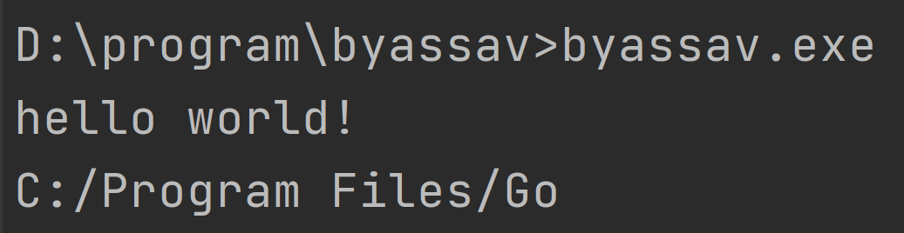

用IDA搜索这个字符串 `C:/Program Files/Go`，但是并没有搜到。于是转到Main函数，看到了符号信息。

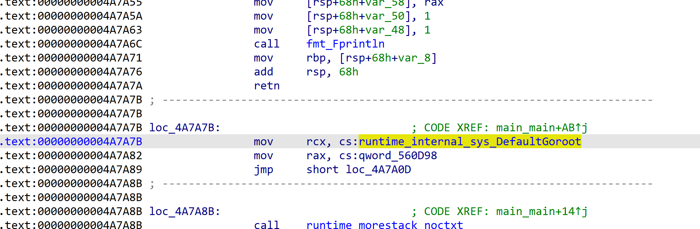

原来它是`C:\\Program Files\\Go`字符串，输出的时候将它改变了。

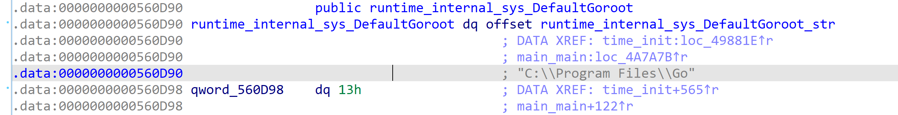

交叉引用查看

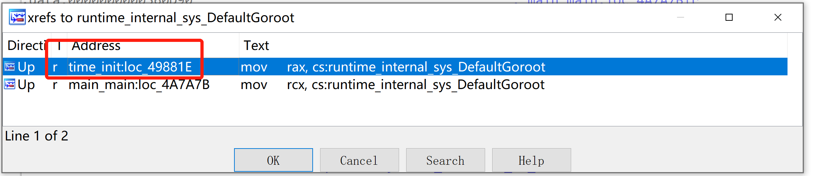

有两个地方，一个是main函数我们调用的地方，一个是`time_init`，这个是内部函数的实现。

我们就可以通过这个函数来定位到它。

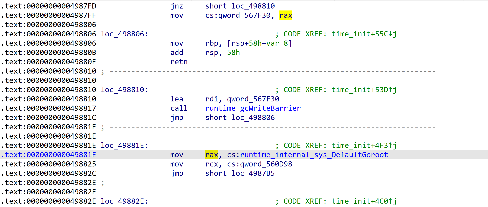

刚刚新学了反汇编寻找地址方式，现在正好派上了用场，程序先解析pclntab获取函数`time_init`的地址范围，从这个地址开始反汇编，寻找`mov rax，立即数`指令。

因为这个赋值的汇编指令是mov，写代码的时候还要注意32位和64位寻址的不同。
```go 
func tryFromTimeInit(f *GoFile) (string, error) {
    // Check for non supported architectures.
    if f.FileInfo.Arch != Arch386 && f.FileInfo.Arch != ArchAMD64 {
        return "", nil
    }

    is32 := false
    if f.FileInfo.Arch == Arch386 {
        is32 = true
    }

    // Find shedinit function.
    var fcn *Function
    std, err := f.GetSTDLib()
    if err != nil {
        return "", nil
    }

pkgLoop:
    for _, v := range std {
        if v.Name != "time" {
            continue
        }
        for _, vv := range v.Functions {
            if vv.Name != "init" {
                continue
            }
            fcn = vv
            break pkgLoop
        }
    }

    // Check if the functions was found
    if fcn == nil {
        // If we can't find the function there is nothing to do.
        return "", nil
    }
    // Get the raw hex.
    buf, err := f.Bytes(fcn.Offset, fcn.End-fcn.Offset)
    if err != nil {
        return "", nil
    }
    s := 0
    mode := f.FileInfo.WordSize * 8

    for s < len(buf) {
        inst, err := x86asm.Decode(buf[s:], mode)
        if err != nil {
            return "", nil
        }
        s = s + inst.Len
        if inst.Op != x86asm.MOV {
            continue
        }
        if inst.Args[0] != x86asm.RAX && inst.Args[0] != x86asm.ECX {
            continue
        }
        kindof := reflect.TypeOf(inst.Args[1])
        if kindof.String() != "x86asm.Mem" {
            continue
        }
        arg := inst.Args[1].(x86asm.Mem)
        addr := arg.Disp
        if arg.Base == x86asm.EIP || arg.Base == x86asm.RIP {
            addr = addr + int64(fcn.Offset) + int64(s)
        } else if arg.Base == 0 && arg.Disp > 0 {
        } else {
            continue
        }
        b, _ := f.Bytes(uint64(addr), uint64(0x20))
        if b == nil {
            continue
        }

        r := bytes.NewReader(b)
        ptr, err := readUIntTo64(r, f.FileInfo.ByteOrder, is32)
        if err != nil {
            // Probably not the right instruction, so go to next.
            continue
        }
        l, err := readUIntTo64(r, f.FileInfo.ByteOrder, is32)
        if err != nil {
            // Probably not the right instruction, so go to next.
            continue
        }

        ver := string(bstr)
        if !IsASCII(ver) {
            return "", nil
        }
        return ver, nil
    }
    return "", nil
}

```

此外还要注意一个版本问题。`go1.16`以上版本的GoRoot是这样解析，`go1.16`以下可以直接定位到`runtime_GoRoot`函数，再使用上述方式解析即可。

我也向GoRe提交了这部分代码 

  * https://github.com/boy-hack/gore

  * https://github.com/goretk/gore/pull/42/files


## Go-Strip

GoRe可以读取Go二进制的信息，反过来，把读取的文本修改成替换文本，不就达到了消除/混淆go编译信息的目的吗。

基于此写了一个工具，可以一键混淆Go编译的二进制里的信息。

还是以最开始的Go代码为例
```go 
package main

import (
    "fmt"
    "log"
    "math/rand"
)

func main() {
    fmt.Println("hello world!")

    log.SetFlags(log.Lshortfile | log.LstdFlags)
    for i:=0;i<10;i++{
        log.Println(rand.Intn(100))
    }

    panic("11")
}

```

编译
``` 
go build -ldflags "-s -w" main.go

```

使用程序消除信息

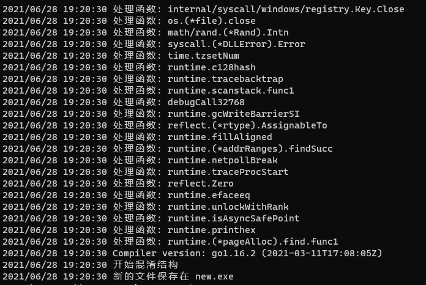

运行新的程序

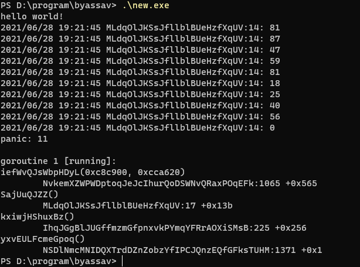

运行没有问题，之前含有的文件信息都用随机字符串填充了。

用之前的IDA脚本查看

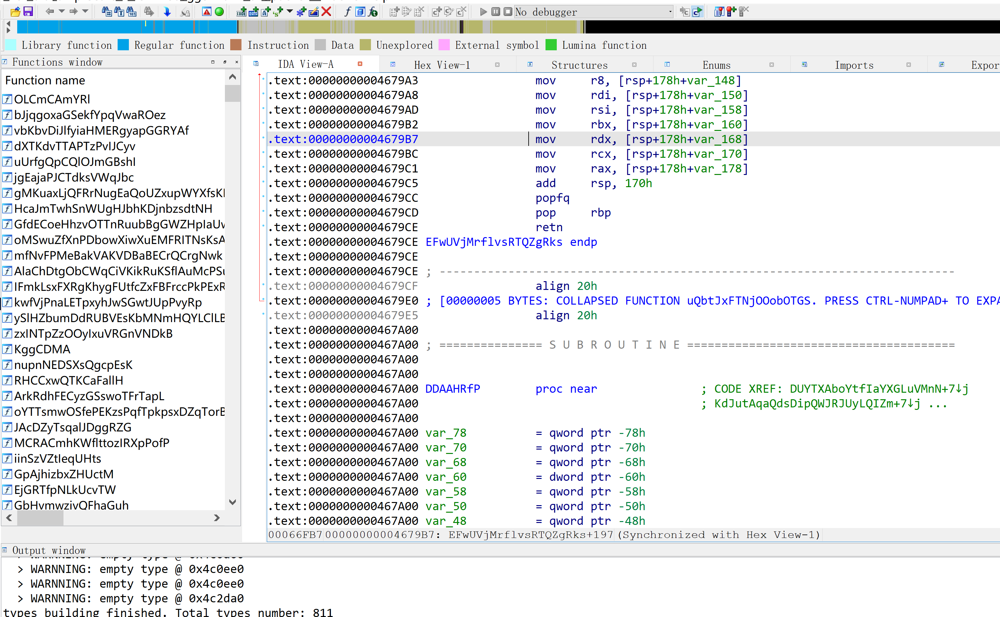

函数名称也都填充了。

### 与其他工具的对比

知名的Go混淆工具有`gobfuscate`、`garble`

像`gobfuscate`,核心思想是将源码以及源码引入的包转移到一个随机目录，然后基于AST语法树修改代码信息，但这样效率有很大问题。之前测试过`deimos-C2`和`sliver`的生成混淆，生成一个简单的源码需要半个多小时甚至更长时间，并且混淆的不彻底，像Go的一些内置包、文件名都没有混淆。

像`garble`采取的混淆中间语言的方法，但是也有混淆不彻底和效率的问题。

相比之下`go-strip`混淆更彻底，效率快，支持多个平台架构，能比较方便的消除Go编译的信息。

### 程序下载

https://github.com/boy-hack/go-strip

## 参考

  * Go语言逆向初探
    * https://bbs.pediy.com/thread-268042.htm
  * Go二进制文件逆向分析从基础到进阶——综述 - 安全客，安全资讯平台 
    * https://www.anquanke.com/post/id/214940
  * https://github.com/goretk/gore
  * https://github.com/goretk/redress


