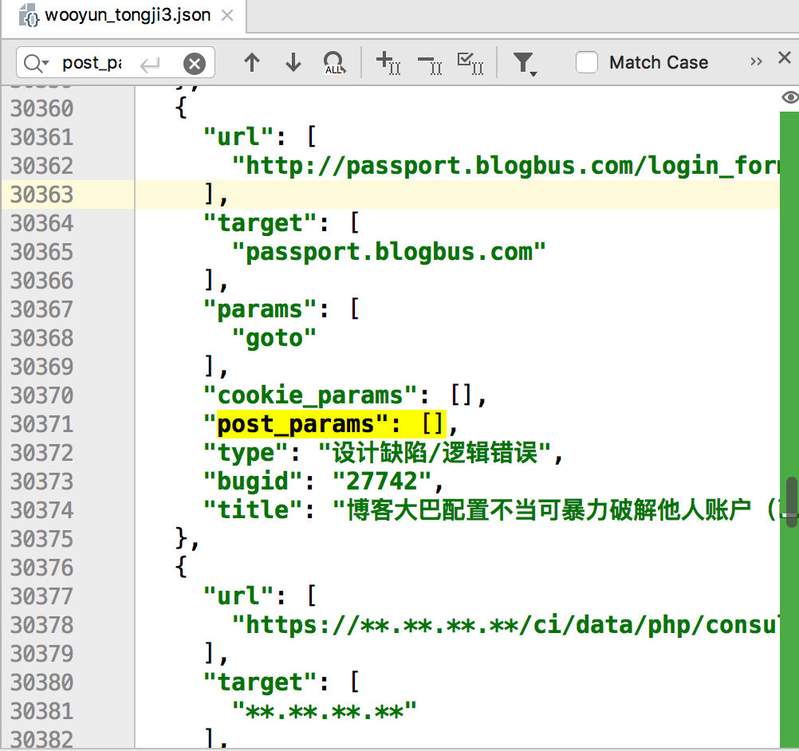

# 对乌云漏洞库的分析

漏洞都是相似的，但挖洞姿势却各有各的不同。 

最近收集了很多src的资产域名，正在琢磨怎么用自动化扫描器来扫描，于是有了这个想法。乌云漏洞库有很多样本案例，网络上好像还没有人公开整理过乌云漏洞库中的payload，所以来分析一下吸取乌云前辈们的经验吧。 

# 过程

过程很容易，爬取了乌云镜像库，并将所有出现过的漏洞链接存储起来。但网页中展示的格式都不太一致，在通过手工测试三四十个样本后，才终于将提取规则完善。

存储格式类似

最后保存的json格式大概有30M大小。

# 结论

## 出现漏洞的端口Top100

端口号 | 出现次数  
---|---  
8080 | 6710  
80 | 2458  
81 | 1345  
8081 | 925  
7001 | 885  
8000 | 882  
8088 | 740  
8888 | 735  
9090 | 578  
8090 | 477  
88 | 446  
8001 | 406  
82 | 401  
9080 | 350  
8082 | 301  
8089 | 265  
9000 | 225  
8443 | 206  
9999 | 185  
8002 | 162  
89 | 160  
8083 | 142  
8200 | 141  
8008 | 135  
90 | 135  
8086 | 129  
801 | 127  
8011 | 120  
8085 | 120  
9001 | 118  
9200 | 117  
8100 | 111  
8012 | 108  
85 | 105  
8084 | 102  
8070 | 101  
7002 | 99  
8091 | 94  
8003 | 92  
99 | 91  
7777 | 84  
8010 | 78  
443 | 73  
8028 | 72  
8087 | 71  
83 | 70  
7003 | 70  
10000 | 68  
808 | 64  
38888 | 64  
8181 | 64  
800 | 63  
18080 | 63  
8099 | 62  
8899 | 62  
86 | 62  
8360 | 58  
8300 | 57  
8800 | 52  
8180 | 52  
3505 | 49  
7000 | 49  
9002 | 47  
8053 | 43  
1000 | 42  
7080 | 40  
8989 | 38  
28017 | 38  
9060 | 36  
888 | 34  
3000 | 34  
8006 | 34  
41516 | 34  
880 | 34  
8484 | 34  
6677 | 33  
8016 | 32  
84 | 32  
7200 | 31  
9085 | 30  
5555 | 30  
8280 | 29  
7005 | 29  
1980 | 29  
8161 | 28  
9091 | 27  
7890 | 27  
8060 | 27  
6080 | 27  
8880 | 26  
8020 | 26  
7070 | 26  
889 | 26  
8881 | 24  
9081 | 24  
8009 | 24  
7007 | 24  
8004 | 23  
38501 | 23  
1010 | 23  
  
最后得到的端口数量在1104，说明在端口扫描时，只需要扫描这一千端口就行，很大节省了效率。

## 对路径的统计

### ASP Top100

路径 | 出现次数  
---|---  
/news_show.asp | 233  
/about.asp | 205  
/news.asp | 201  
/login.asp | 173  
/index.asp | 167  
/admin/login.asp | 141  
/list.asp | 130  
/show.asp | 112  
/shownews.asp | 88  
/search.asp | 85  
/News_show.asp | 85  
/product.asp | 83  
/news_list.asp | 70  
/article.asp | 67  
/view.asp | 59  
/default_standard.asp | 59  
/info.asp | 58  
/news_more.asp | 57  
/newshow.asp | 54  
/news_detail.asp | 48  
/news_view.asp | 47  
/admin/index.asp | 46  
/products.asp | 46  
/nzcms_list_news.asp | 46  
/read.asp | 44  
/index1.asp | 44  
/detail.asp | 43  
/contact.asp | 42  
/tt/inc/login.asp | 41  
/default.asp | 41  
/readnews.asp | 40  
/mucc/about.asp | 39  
/doc/page/main.asp | 38  
/About.asp | 37  
/onews.asp | 37  
/cp.asp | 37  
/News.asp | 36  
/content.asp | 36  
/doc/page/login.asp | 36  
/productshow.asp | 35  
/view_n.asp | 34  
/new.asp | 33  
/pic.asp | 33  
/newsDetail.asp | 33  
/job.asp | 33  
/_JBRCMS/Manager/jbr_UploadConfig.asp | 33  
/newsinfo.asp | 32  
/newsbrow.asp | 30  
/newsview.asp | 29  
/admin/admin_login.asp | 29  
/class.asp | 28  
/ProductShow.asp | 28  
/productview.asp | 28  
/Article_Print.asp | 27  
/newsshow.asp | 27  
/LstInfo.asp | 27  
/page.asp | 25  
/jiannya/default.asp | 25  
/CompHonorBig.asp | 24  
/adminqibo5/Edit/editor/resurm_upfile.asp | 24  
/feedback.asp | 23  
/viewnews.asp | 22  
/manage/login.asp | 22  
/ShowNews.asp | 22  
/more.asp | 22  
/hn_type.asp | 22  
/1.asp | 21  
/service.asp | 20  
/admin/Login.asp | 20  
/readpro.asp | 20  
/sbweb/nameedit.asp | 20  
/Body.asp | 20  
/opensoft.asp | 20  
/main.asp | 19  
/showcareer.asp | 19  
/company.asp | 19  
/Pro_shcn.asp | 19  
/jjweb/nameedit.asp | 19  
/cpinfo.asp | 19  
/Htmledit/admin/login.asp | 19  
//liuyan.asp | 19  
/showfwly.asp | 19  
/MoralsView.asp | 18  
/user/reg.asp | 18  
/product_show.asp | 18  
/fuwu_list.asp | 18  
/lesiure/up.asp | 18  
/shell.asp | 17  
/admin.asp | 17  
/admin/admin.asp | 17  
/showservices.asp | 17  
/manage/html/ewebeditor/admin_login.asp | 17  
/Newsview.asp | 17  
/admin/Admin_Login.asp | 16  
/down.asp | 16  
/info_Print.asp | 16  
/person/mailbox.asp | 16  
/jieshao.asp | 16  
/type.asp | 16  
/product_cate.asp | 16  
  
### ASPX Top100

路径 | 出现次数  
---|---  
/Default.aspx | 349  
/login.aspx | 341  
/UIFrameWork/login.aspx | 307  
/Login.aspx | 288  
/Detail.aspx | 209  
/admin/login.aspx | 157  
/index.aspx | 127  
/default.aspx | 124  
/OT.OA.WEB/UIFrameWork/login.aspx | 76  
/search.aspx | 58  
/userlogin.aspx | 57  
/list.aspx | 54  
/Admin/login.aspx | 48  
/custom/GroupNewsList.aspx | 45  
//SubCategory.aspx | 42  
/manage/login.aspx | 38  
/aspx/gqxx.aspx | 38  
/newsView.aspx | 38  
/news.aspx | 37  
/Search.aspx | 34  
/admin/index.aspx | 31  
/Web/Login/PSCP01001.aspx | 30  
/city_index.aspx | 30  
/main.aspx | 29  
/newslist.aspx | 29  
/admin/Login.aspx | 28  
/show.aspx | 28  
/Admin/Index.aspx | 27  
/SubCategory.aspx | 26  
/G2S/AdminSpace/QE/AddCustomForm.aspx | 26  
/NewsList.aspx | 25  
/Index.aspx | 24  
/about.aspx | 23  
/gmis/leftmenu.aspx | 23  
/Permission/Application_Query_List.aspx | 22  
/test.aspx | 22  
/site/ajax/WebSiteAjax.aspx | 22  
/select_e.aspx | 22  
/ExhibitionCenter.aspx | 22  
/system/stu_user_regist.aspx | 21  
/News.aspx | 21  
/workplate/xzsp/gxxt/tjfx/spsl.aspx | 21  
/manager/member/admin_add.aspx | 20  
/workplate/xzsp/tjfx/grbjtj/list.aspx | 20  
/zfmllist.aspx | 20  
/workplate/base/person/listbyorgsel.aspx | 20  
/NewsDetail.aspx | 19  
/Supplylist.aspx | 19  
/Product/ProductList.aspx | 19  
/Web/Login.aspx | 18  
/articleview.aspx | 18  
/model/TwoGradePage/equipmentlist.aspx | 18  
/json_db/other_report.aspx | 18  
/json_db/flight_return.aspx | 18  
//bos/desktop/RequestOrResponse.aspx | 18  
/Broadcast/Broadcast.aspx | 18  
/json_db/meb_list.aspx | 18  
/searchbargain.aspx | 18  
/json_db/air_company.aspx | 18  
/RiskInfo.aspx | 18  
/owa/auth/logon.aspx | 17  
/WebDefault3.aspx | 17  
/article.aspx | 17  
/G2S//AdminSpace/PublicClass/AddCourseWare.aspx | 17  
/news_view.aspx | 16  
/info.aspx | 16  
/CommonPage.aspx | 16  
/DownLoadPage.aspx | 16  
/fckeditor/editor/filemanager/connectors/aspx/connector.aspx | 16  
/support/minisite/thinkpad/htmls/advancedsearch.aspx | 16  
/emlib4/format/release/aspx/eml_homepage.aspx | 16  
/Gmis/Byyxwgl/xls_lwdbxxedit.aspx | 16  
/CMSUploadFile.aspx | 16  
/Main.aspx | 15  
/OrderDetail.aspx | 15  
/webSchool/list.aspx | 15  
/Magazine/NewMagazine.aspx | 15  
/k4/list.aspx | 15  
/k1/preview.aspx | 15  
/MoreIndex.aspx | 15  
/sysadmin/Login.aspx | 15  
/persondh/urgent.aspx | 15  
/OnlineQuery/QueryList.aspx | 15  
/Broadcast/displayNewsPic.aspx | 15  
/Web/News.aspx | 15  
/ModifyPassWord.aspx | 15  
/ftb.imagegallery.aspx | 14  
/TableDataManage/BaseInforQueryContent.aspx | 14  
/presellbuild.aspx | 14  
/tabid/2159/Default.aspx | 14  
/cart.aspx | 14  
/G2S/AdminSpace/PublicClass/AddCathedraWare.aspx | 14  
/admin/course/uploaddemo.aspx | 14  
/searchLines.aspx | 14  
/help/pendantShow.aspx | 14  
/BsGuide.aspx | 13  
/NewsView.aspx | 13  
/Admin/fileManage.aspx | 13  
/ShowNews.aspx | 13  
/Web_Site/Search.aspx | 13  
  
### Jsp Top100

路径 | 出现次数  
---|---  
/login.jsp | 317  
/index.jsp | 176  
/kingdee/login/loginpage.jsp | 160  
/get_pwd.jsp | 126  
/zecmd/zecmd.jsp | 109  
/console/login/LoginForm.jsp | 103  
/login/Login.jsp | 88  
/customer.jsp | 87  
/is/index.jsp | 81  
/uddiexplorer/SearchPublicRegistries.jsp | 79  
/yyoa/common/js/menu/test.jsp | 74  
/jcms/interface/user/out_userinfo.jsp | 59  
/seeyon/index.jsp | 53  
/download.jsp | 53  
/yyoa/checkWaitdo.jsp | 50  
/admin/login.jsp | 49  
/list.jsp | 46  
/defaultroot/login.jsp | 45  
/upload5warn/shell.jsp | 45  
/search.jsp | 43  
/myname/wooyun.jsp | 40  
/web/epublic/upload.jsp | 39  
/yyoa/indexPass.jsp | 39  
/yyoa/common/selectPersonNew/initData.jsp | 37  
/bak.jsp | 35  
/yyoa/index.jsp | 35  
/postAjax.jsp | 35  
/cK/foot.jsp | 34  
/tools/SWFUpload/upload.jsp | 32  
/nei.jsp | 32  
/1.jsp | 31  
/wooyun.jsp | 31  
/is/cmd.jsp | 30  
/download/download.jsp | 29  
/cmd.jsp | 29  
/webschool/News/news_list.jsp | 28  
/chopper/chopper.jsp | 27  
/business/notifyView.jsp | 27  
/sofpro/gecs/consulmanage/wsts/bbs_title_list1.jsp | 27  
/live800/downlog.jsp | 26  
/Silic.jsp | 26  
/edoas2/oa.jsp | 26  
/wooyun/wooyun.jsp | 25  
/jmxroot/jmxroot.jsp | 25  
/manage/content/docmanage/download.jsp | 25  
/ConInfoParticular.jsp | 24  
/uddiexplorer/out.jsp | 23  
/1/sx/login.jsp | 23  
/templates/index/hrlogon.jsp | 23  
/comm_front/tzzx/uploadImageFile_do.jsp | 23  
/yyoa/ext/https/getSessionList.jsp | 22  
/admin/index.jsp | 22  
/shell.jsp | 22  
/admin/upload.jsp | 22  
/detail.jsp | 22  
/1/sjleader/login.jsp | 22  
/admin/select.jsp | 22  
/admin/fxx.jsp | 22  
/jbossass/jbossass.jsp | 21  
/yyoa/HJ/iSignatureHtmlServer.jsp | 21  
/eol/homepage/common/index.jsp | 21  
/a/pwn.jsp | 21  
/web/common/getfile.jsp | 21  
/upload.jsp | 20  
/test.jsp | 20  
/homepage/LoginHomepage.jsp | 20  
/page/maint/common/UserResourceUpload.jsp | 20  
/zpsys/index.jsp | 20  
/vc/vc/para/opr_initvc.jsp | 20  
/pages/manager/managerAddNManager.jsp | 20  
/hdcy/zxzx_show.jsp | 20  
/yyoa/assess/js/initDataAssess.jsp | 19  
/upload5warn/wooyun.jsp | 19  
/cms/weblawcase/impList.jsp | 19  
/nicknamelogin.jsp | 19  
/ca/ma3.jsp | 19  
/gkznInfo.jsp | 19  
/myname/index.jsp | 18  
/df/index.jsp | 18  
/guige.jsp | 18  
/coremail/index.jsp | 18  
/syfile/swfUpload.jsp | 18  
/admin/protected/index.jsp | 17  
/2/sjtj/login.jsp | 17  
/news.jsp | 17  
/site/law_artile.jsp | 17  
/zwdtSjgl/Directory/lastDirList_iframe.jsp | 17  
/content/topicdeal.jsp | 17  
/webschool/Book/news_list.jsp | 17  
//web/careerapply/HrmCareerApplyPerView.jsp | 16  
/cms/web/downloadFiles.jsp | 16  
/TSPB/web/xzzx/xzzx.jsp | 16  
/prosec.jsp | 16  
/adminroot/common/downLoadFile.jsp | 16  
/uddiexplorer/SetupUDDIExplorer.jsp | 15  
/kingdee/login/loginpage2.jsp | 15  
/wui/theme/ecology7/page/login.jsp | 15  
/f1print/F1PrintKernelJ1.jsp | 15  
/login/login.jsp | 15  
/eln3_asp/public/cscec8b/bulletin.jsp | 15  
  
### PHP Top100

路径 | 出现次数  
---|---  
/index.php | 2456  
/admin.php | 278  
/login.php | 243  
/forum.php | 240  
/share/share.php | 227  
/news.php | 208  
/info.php | 191  
/phpinfo.php | 181  
/plus/search.php | 173  
/test.php | 162  
/admin/login.php | 162  
/src/system/login.php | 146  
/article.php | 140  
/plus/recommend.php | 138  
/search.php | 136  
/list.php | 132  
/api.php | 117  
/admin/index.php | 117  
/CmxDownload.php | 113  
/about.php | 109  
/news_show.php | 98  
/download.php | 97  
/home.php | 81  
/login/login.php | 80  
/user.php | 79  
/show.php | 76  
/page.php | 71  
/product.php | 68  
/wp-login.php | 67  
/main.php | 67  
/detail.php | 65  
/news_detail.php | 64  
/faq.php | 64  
/default.php | 60  
/content.php | 59  
//plus/recommend.php | 58  
/news_display.php | 57  
/up/UploadTemp/eval.php | 57  
/down.php | 55  
/www/index.php | 55  
/user/storage_explore.php | 54  
/abouts.php | 53  
/uc_server/admin.php | 50  
/rss.php | 49  
/wescms/index.php | 49  
/1.php | 45  
/news_info.php | 43  
/products_display.php | 42  
/newsdetail.php | 41  
/phpmyadmin/index.php | 39  
/class.php | 39  
/more.php | 38  
//index.php | 38  
/userlist.php | 37  
/plugin.php | 36  
/_*_.php | 36  
/products.php | 35  
/pics_list.php | 34  
/plus/mytag_js.php | 34  
/news_list.php | 34  
/newsinfo.php | 34  
/smenu.php | 33  
/include/web_content.php | 31  
/batch.common.php | 31  
/space.php | 30  
/modules.php | 30  
/view.php | 30  
/read.php | 30  
/job.php | 30  
/do.php | 29  
/link.php | 29  
/displaynews.php | 29  
/viewthread.php | 28  
/m.php | 28  
/web/index.php | 28  
/member/index.php | 28  
/ajax.php | 27  
/impl/rpc_company_info_minkh.php | 27  
//plus/search.php | 27  
/thi.php | 27  
/i.php | 26  
/member.php | 25  
/webmail/login.php | 25  
/admincp.php | 25  
/download_list.php | 25  
/cmxlogin.php | 25  
/auto_reg.php | 25  
/register.php | 24  
/news/class/index.php | 24  
/prog/index.php | 24  
/thi_details.php | 23  
/topic.php | 23  
/shopadmin/index.php | 23  
/cp.php | 23  
/phpsso_server/index.php | 23  
/common/web_meeting/index.php | 23  
/cn/products.php | 23  
/Customize/Audit/MessageMonitor/groupSearch.php | 23  
/new/client.php | 23  
/notice.php | 22  
  
### Action Top100

路径 | 出现次数  
---|---  
/root/chat.action | 429  
/login.action | 291  
/index.action | 227  
/homeLogin.action | 46  
/portal/login_init.action | 46  
/stardy/Login.action | 40  
/login_login.action | 24  
/license!getExpireDateOfDays.action | 23  
/indexAction.action | 23  
/index/downLoadFile.action | 22  
/common/common_info.action | 21  
/pages/xxfb/editor/uploadAction.action | 21  
/accountlossList.action | 21  
/ggxxfb.action | 21  
/ivhs/ajax_updateUserInfo.action | 20  
/download.action | 19  
/Login.action | 19  
/syfile/imageCompress.action | 18  
/managerOneGgxxfb.action | 18  
/user/login.action | 17  
/loginAction!login.action | 16  
/index!index.action | 15  
/login/login.action | 15  
/managerNManager.action | 15  
/home.action | 14  
/indexmanagerLogin.action | 14  
/ahsffyww/Default3.action | 14  
/DRP/login.action | 12  
/spam/system/index.action | 12  
/user/gotoLoginPage.action | 12  
/ecp/announcement/announcement_view2.action | 12  
/managerAddNManager.action | 12  
/managerEditNManager.action | 12  
/main.action | 11  
/system/login_login.action | 11  
/login!login.action | 10  
/loginAction.action | 10  
/login/index.action | 10  
/logout.action | 10  
/register.action | 10  
/security/loginInit.action | 10  
/bgxz/bgxzAction_executeBack.action | 10  
/nFixcardAllList.action | 10  
/beian/login_login.action | 10  
//opac_two/mylibrary/comment/queryAllComment.action | 10  
/module/newzwgk/getmainById.action | 10  
/index/index.action | 9  
/shop/member!passwordRecover.action | 9  
/mail/login.action | 9  
/admin/login.action | 9  
/htweixin/InsuranceDownload.action | 9  
//admin/user_logon.action | 9  
/BSBM/loginedLogin.action | 9  
/robot/check-login.action | 8  
/website/dflz/dflzSiteAction!sjList.action | 8  
/module/newzwgk/viewquan.action | 8  
/hbwz/wcms/searchAll.action | 8  
/ahsffyww/Default2.action | 8  
/wfvideo/login.action | 8  
/website-rank/addVoteRecord.action | 8  
/module/newzwgk/viewZwxxQianMore.action | 8  
/superadmin/index.action | 7  
/mall/ui/giftIndex.action | 7  
/userlogin.action | 7  
/cms/admin/login.action | 7  
/szxy/logon.action | 7  
/virtual/shouye.action | 7  
/feedback/buyIntention!saveBuyIntentionInfo.action | 7  
/superadmin/adminLogin.action | 7  
/Index.action | 7  
/security/login.action | 7  
/MemberToLoginIgnore.action | 7  
/rdms/satisfyaid/actions/cstContactAction!register.action | 7  
/regmail/download.action | 7  
/IndexAction.action | 6  
/publish/query/indexFirst.action | 6  
/manage/login.action | 6  
/home/index.action | 6  
/eeoaftp/downloadFile.action | 6  
/eis/index.action | 6  
/gzwl/visit/renewBusinessOrder/renewBusinessOrderDetail.action | 6  
/css/myquery/queryWQSBill.action | 6  
/LoginAction.action | 6  
/detail.action | 6  
/index/index!list.action | 6  
/auth/login.action | 6  
/server/spreq/attachment!download.action | 6  
/lmsv5/user!editUserInfo.action | 6  
/5clib/bookWeb.action | 6  
/otomc/user/loginUI.action | 6  
/im-client/imclient/selfHelp.action | 6  
/ahsffyww/ZXDefault2.action | 6  
/user!login.action | 6  
/Dzsw/Shky/hwky.wai/index.action | 6  
/aic/webnz/welcome-web-home!welcome.action | 6  
/ess/Homepage.action | 6  
/skypearl/cn/toPrintCard.action | 6  
/spdt/spdt_listSp.action | 6  
/xxsearch.action | 6  
/web/Info!list.action | 6  
  
## 目录Top100

路径 | 出现次数  
---|---  
/admin | 2639  
/user | 848  
/.svn | 825  
/.git | 670  
/login | 615  
/plus | 550  
/news | 533  
/web | 517  
/upload | 495  
/manager | 469  
/xxgk/services | 465  
/root | 437  
/manage | 411  
/ftp/com1/html | 409  
/cgi-bin | 406  
/servlet | 348  
/content | 333  
/api | 331  
/share | 329  
/member | 315  
/UIFrameWork | 309  
/cn | 277  
/bbs | 275  
/jmx-console | 273  
/index | 245  
/invoker | 244  
/s | 231  
/phpmyadmin | 222  
/search | 220  
/Admin | 211  
/papers | 208  
/yyoa | 207  
/common | 206  
/system | 202  
/opac | 196  
/account | 196  
/uddiexplorer | 195  
/ajax | 190  
/cms | 188  
/2001 | 187  
/kingdee/login | 178  
/Gmis/xw | 173  
/1999 | 168  
/include | 164  
/portal | 161  
/back/ticket | 161  
/oa | 159  
/Gmis/Byyxwgl | 158  
/home | 156  
/data | 155  
/src/system | 148  
/WEB-INF | 141  
/main | 140  
/Chinese | 134  
/order | 132  
/gov/services | 132  
/wap | 131  
/console | 130  
/app | 130  
/is | 129  
/Web | 127  
/resin-doc/resource/tutorial/jndi-appconfig | 126  
/seeyon | 124  
/config | 123  
/images | 121  
/download | 120  
/view | 118  
/public | 117  
/product | 117  
/model/TwoGradePage | 117  
/knowledge/ClassShow | 115  
/en | 114  
/zecmd | 114  
/m | 114  
/soap/envelope | 112  
/about | 111  
/install | 110  
/tushu | 107  
/ckq | 107  
/poweb | 106  
/tips | 105  
/resin-doc/viewfile | 104  
/www | 104  
/console/login | 103  
/html | 103  
/bbs/topic | 103  
/data/admin | 103  
/wscgs | 102  
/sys | 102  
/test | 99  
/list | 99  
/v_show | 98  
/p | 97  
/fckeditor/editor/filemanager/browser/default | 97  
/User | 96  
/uc_server | 96  
//plus | 96  
/site | 95  
/detail | 95  
/index.php | 94  
  
## 参数分析

因为无法通过自动化程序把存在漏洞的参数提取出来，所以只是暴力的把所有url的参数都提取了出来，所以这些top参数不一定有代表性，但作为字典应该是不错的。

### get参数Top100

参数 | 出现次数  
---|---  
id | 6845  
action | 1643  
type | 1503  
m | 1013  
a | 992  
c | 855  
act | 829  
page | 813  
uid | 616  
url | 585  
method | 545  
cid | 545  
ID | 528  
mod | 521  
aid | 490  
keyword | 474  
key | 449  
t | 449  
q | 444  
callback | 427  
sid | 426  
s | 421  
name | 407  
tid | 399  
pid | 392  
code | 354  
r | 316  
p | 307  
file | 301  
Type | 294  
do | 294  
redirect | 292  
username | 291  
_ | 278  
op | 259  
filename | 252  
path | 251  
from | 230  
classid | 227  
f | 222  
fid | 221  
app | 213  
cmd | 213  
typeid | 203  
_FILES | 201  
ac | 194  
title | 192  
fileName | 191  
userid | 190  
v | 189  
flag | 176  
catid | 170  
Connector | 166  
bid | 158  
order | 150  
wd | 150  
mid | 150  
lang | 145  
nid | 143  
city | 142  
CurrentFolder | 139  
newsid | 138  
Command | 137  
password | 131  
d | 128  
source | 127  
sort | 126  
user | 125  
token | 122  
module | 120  
class | 118  
userId | 115  
dir | 113  
ie | 111  
Id | 108  
pwd | 107  
num | 106  
email | 103  
appid | 102  
u | 102  
mobile | 102  
i | 102  
keywords | 100  
version | 100  
status | 99  
gid | 99  
typeArr | 96  
g | 96  
service | 95  
o | 95  
ArticleID | 94  
query | 94  
filePath | 94  
orderId | 94  
redirect%3A%24%7B%23req%3D%23context.get%28%27com.opensymphony.xwork2.dispatcher.HttpServletRequest%27%29%2C%23a%3D%23req.getSession%28%29%2C%23b%3D%23a.getServletContext%28%29%2C%23c%3D%23b.getRealPath%28%22%2F%22%29%2C%23matt%3D%23context.get%28%27com.opensymphony.xwork2.dispatcher.HttpServletResponse%27%29%2C%23matt.getWriter%28%29.println%28%23c%29%2C%23matt.getWriter%28%29.flush%28%29%2C%23matt.getWriter%28%29.close%28%29%7D | 93  
category | 92  
word | 92  
user_id | 92  
k | 91  
channel | 90  
  
### post参数Top100

参数 | 出现次数  
---|---  
password | 457  
__VIEWSTATE | 430  
__EVENTVALIDATION | 315  
username | 313  
__EVENTTARGET | 210  
__EVENTARGUMENT | 210  
type | 145  
name | 113  
id | 111  
Submit | 109  
__VIEWSTATEGENERATOR | 103  
action | 98  
email | 97  
mobile | 87  
page | 86  
submit | 85  
pwd | 67  
uid | 66  
act | 64  
phone | 59  
code | 54  
userName | 54  
keyword | 52  
__LASTFOCUS | 50  
city | 50  
<a href | 47  
userid | 47  
content | 43  
account | 42  
y | 42  
address | 41  
x | 41  
UserName | 40  
title | 39  
button | 39  
token | 38  
Password | 37  
Button1 | 37  
passwd | 37  
province | 36  
tel | 36  
sex | 35  
pageSize | 33  
txtPassword | 29  
userId | 29  
version | 29  
txtUserName | 29  
url | 28  
sort | 28  
key | 27  
ImageButton1.y | 27  
ImageButton1.x | 27  
user | 27  
pageNo | 25  
method | 25  
status | 24  
login | 22  
sid | 22  
channel | 22  
qq | 21  
flag | 21  
TextBox1 | 20  
btnSearch | 20  
pass | 20  
user_id | 20  
domain | 20  
rows | 20  
?> | 19  
from | 19  
sign | 19  
uname | 19  
order | 19  
txtPwd | 19  
pid | 18  
btnLogin | 18  
pageIndex | 18  
search | 18  
keywords | 18  
loginName | 18  
lang | 17  
user_name | 17  
timestamp | 17  
imei | 17  
PassWord | 17  
captcha | 16  
number | 16  
language | 16  
B1 | 16  
appid | 16  
area | 15  
**hash** | 15  
} | 15  
(b)((‘\43context[\’xwork.MethodAccessor.denyMethodExecution\’]\75false’)(b)) | 14  
(‘\43c’)((‘\43_memberAccess.excludeProperties\<a href | 14  
imageField.y | 14  
imageField.x | 14  
limit | 14  
loginname | 14  
txtName | 14  
cmd | 14  
  
### Cookie参数Top100

参数 | 出现次数  
---|---  
__utma | 226  
__utmz | 221  
__utmc | 169  
__utmb | 142  
HMACCOUNT | 126  
bdshare_firstime | 100  
pgv_pvi | 99  
_ga | 91  
BAIDUID | 80  
__utmt | 71  
pgv_si | 69  
AJSTAT_ok_times | 56  
ci_session | 55  
_gat | 49  
uid | 37  
CheckCode | 33  
safedog-flow-item | 33  
SERVERID | 31  
lzstat_uv | 27  
username | 23  
IESESSION | 23  
vjuids | 23  
ECS_ID | 22  
ECS[display] | 21  
ECS[history] | 21  
AJSTAT_ok_pages | 21  
ECS[visit_times] | 18  
pgv_pvid | 18  
SUV | 18  
vjlast | 18  
city | 17  
iweb_hisgoods[15] | 16  
IPLOC | 15  
cck_count | 15  
cck_lasttime | 15  
lvsessionid | 14  
LXB_REFER | 14  
iweb_hisgoods[26] | 13  
cookie | 13  
CoreID6 | 13  
NTKF_T2D_CLIENTID | 13  
userName | 12  
loginName | 12  
BAIDU_DUP_lcr | 12  
td_cookie | 12  
ECSCP_ID | 12  
_jzqx | 12  
userid | 12  
hd_sid | 11  
real_ipd | 11  
password | 11  
route | 11  
vary | 11  
nTalk_CACHE_DATA | 11  
token | 11  
WT_FPC | 10  
ADMINCONSOLESESSION | 10  
pgv_info | 10  
nickname | 10  
guid | 10  
jiathis_rdc | 10  
HMVT | 10  
tma | 10  
tmd | 10  
s | 10  
S[CART_TOTAL_PRICE] | 10  
S[CART_COUNT] | 10  
S[CART_NUMBER] | 10  
sessionid | 10  
_jzqa | 10  
looyu_id | 10  
dyh_lastactivity | 9  
SESSIONID | 9  
s_cc | 9  
s_sq | 9  
.ASPXAUTH | 9  
DedeUserID | 9  
DedeUserID__ckMd5 | 9  
sid | 9  
user | 9  
clientlanguage | 9  
_jzqc | 9  
lang | 9  
wordpress_test_cookie | 8  
__qc_wId | 8  
language | 8  
hasshown | 8  
cityid | 8  
myie | 8  
s_nr | 8  
__RequestVerificationToken | 8  
… | 8  
DedeUsername | 8  
DedeUsername__ckMd5 | 8  
loginState | 8  
ip_ck | 8  
vn | 8  
lv | 8  
pageReferrInSession | 8  
__cfduid | 8  
  
# 历史漏洞参数API

上面的top记录说实话我也看不出什么来，在整理了相关字典后，又有了这样一个想法。之前国外有大神通过深度学习了大量开源软件的源码及结构后做出来一款辅助编程的程序，当你输入代码前半段的时候会自动猜测意图并匹配出代码后半段，效果还不错。

所以，通过分析了这些样本后，我也能做出一个API，只需要一段url或从burpsuite中截取的请求包，api会分析域名，返回该域名的历史漏洞以及漏洞类型，通过分析参数(get,post,cookie),从历史漏洞库中匹配出该参数的历史漏洞以及漏洞类型。

如果把这个api集成到一些扫描器或burpsuite中，也不失为一个好的辅助手段～

### 2019.12.22 更新

将Burpsuite插件完成了：https://github.com/boy-hack/wooyun-payload
