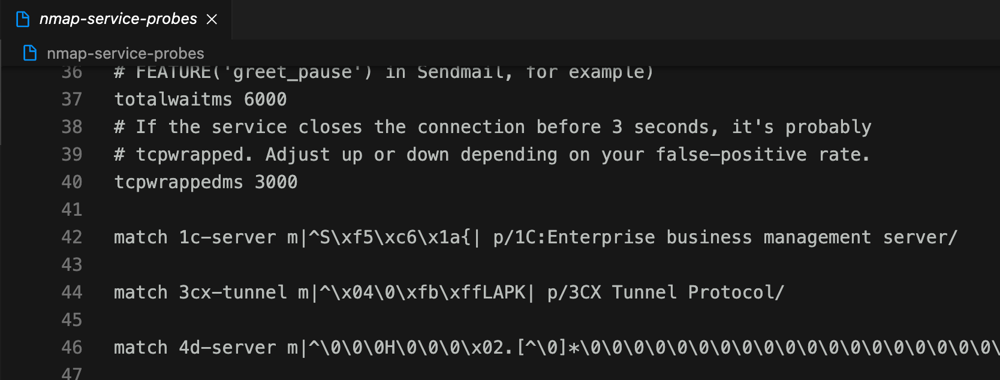
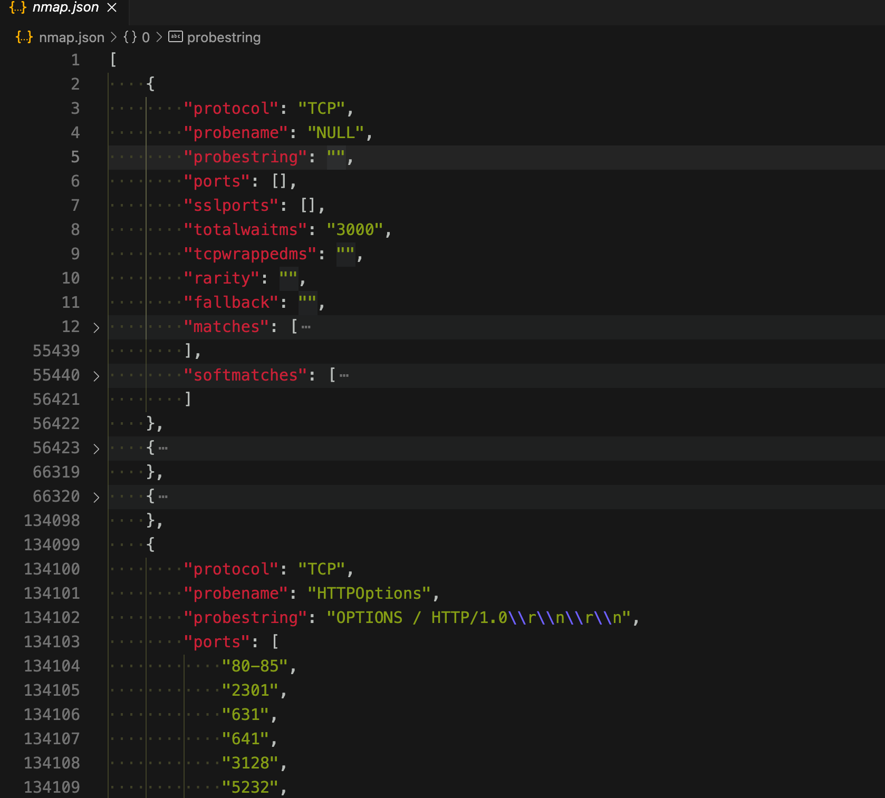

# 将nmap指纹集成到扫描器中

nmap真是一款神器，并且开源了这么多年依旧在更新。

六天前依然在更新。

每次做扫描时调用nmap虽然没什么大碍，但也总想着能自己实现一款可控的端口指纹识别工具。

## nmap指纹解析

nmap的指纹是开源的，下载 https://raw.githubusercontent.com/nmap/nmap/master/nmap-service-probes 这个文件就好。

但是想调用它的指纹，你需要写一套脚本来解析它的格式。

关于指纹的格式描述可以参考下面链接

  * 官方文档
    * https://nmap.org/book/vscan-fileformat.html
  * Nmap原理02 - 编写自己的服务探测脚本
    * https://www.cnblogs.com/liun1994/p/6986544.html

不想看也没关系，我根据上面的参考，写了一个脚本，可以将nmap的指纹转换为json可读的模式，只需要引入这个json文件，就更方便进行扫描的操作了。

脚本地址：https://github.com/boy-hack/nmap-parser

json化之后指纹是这样的

### 每个字段的解释

  * `protocol`是协议，tcp或udp
  * `probename`是协议的名称
  * `probestring`是这个协议要发送的payload
  * `ports`是一个端口列表，在这个端口里才使用这个协议
  * `matches`和`softmatches`是匹配的指纹列表
    * 
    * 根据正则匹配就可以获取到name，版本等的信息了

## 用nmap做网络空间探测

有了指纹，就可以自己写一个关于网络空间探测的小玩具了，但要做大，还需要考虑一些可能的技术问题。

依稀记得@白帽会赵武 发过一篇文章。

指纹探测技术上可分为三类

  * 连接端口后，会回显一个包，这个包可以当作指纹

  * 发送一个包，会返回一个包，这个包可作为指纹

  * 发送一个包，这个包正确才会显示内容

根据nmap指纹就可以获得前两类的指纹信息了，后一类得靠自己根据协议自己实现了（这也是大厂的技术壁垒）。

还有一个壁垒就是扫描速度如何优化，用无状态扫描器，zmap或者masscan可以快速的扫描ip开放的端口，但是它们的运行原理只在握手的第一个包，所以它们只能进行探测。

进行指纹识别就要进行有状态的扫描，在无状态发包获取成功后再次发包变成正常的握手模式，再发各种探针来进行指纹识别，但此时速度肯定会有下降。

这里的流程可以优化为无状态发包，收到回复后继续无状态发送探针，然后标记，最后网卡收包的时候探测到这个标记的就行。

## 参考

  * nmap

    * https://github.com/nmap/nmap
  * nmap指纹转换json文件

    * https://github.com/boy-hack/nmap-parser

