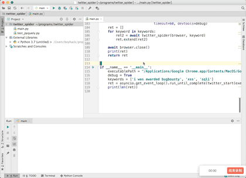

# 推特安全资讯监控

通过chromium headless模式来对Twitter进行爬虫，通过一些关键词来监控Twitter上的安全资讯。

代码参考 ,需要python3.7以上，安装支持库
``` 
pip3 install pyquery pyppeteer

```
```python
#!/usr/bin/env python3
# -*- coding: utf-8 -*-
# @Time    : 2020/3/16 5:14 PM
# @Author  : w8ay
# @File    : main.py
import asyncio
import hashlib
from urllib.parse import urljoin
from pyppeteer import launch
from pyquery import PyQuery as pq


def getTwitter(html):
    doc = pq(html)

    items = doc("section.css-1dbjc4n article")
    # print(len(items))
    r = []
    for item in list(items.items()):
        article = item(".r-1iusvr4")

        alink = article("a.css-4rbku5.css-18t94o4.css-901oao.r-1re7ezh.r-1loqt21.r-1q142lx.r-1qd0xha")
        href = alink.attr("href")

        url = urljoin("https://twitter.com/", href)

        # name = article(
        #     "div.css-901oao.css-bfa6kz.r-hkyrab.r-1qd0xha.r-a023e6.r-vw2c0b.r-ad9z0x.r-bcqeeo.r-3s2u2q.r-qvutc0").text()
        name2 = article(
            "div .css-1dbjc4n.r-18u37iz.r-1wbh5a2.r-1f6r7vd .css-901oao.css-16my406.r-1qd0xha.r-ad9z0x.r-bcqeeo.r-qvutc0").text()
        # print(name)
        content = article(
            "div .css-1dbjc4n .css-901oao.r-hkyrab.r-1qd0xha.r-a023e6.r-16dba41.r-ad9z0x.r-bcqeeo.r-bnwqim.r-qvutc0").text()
        # print(url, name2, content)
        print("地址:{}\n昵称:{}\n内容:{}\n".format(url, name2, content))
        r.append((url, name2, content))
    return r


async def request_check(req):
    if req.resourceType in ["image", "media", "eventsource", "websocket", "stylesheet", "font"]:
        await req.abort()
    else:
        await req.continue_()


async def twitter_spider(browser, keyword):
    result = []
    url = "https://twitter.com/search?q={}&src=typd".format(keyword)
    page = await browser.newPage()
    page.setDefaultNavigationTimeout(1000 * 60 * 5)  # 5 min

    await page.setRequestInterception(True)
    page.on('request', lambda req: asyncio.ensure_future(request_check(req)))
    waitUntil = [
        'load',
        'domcontentloaded',
        # 'networkidle0',
        # 'networkidle2'
    ]
    await page.goto(url, waitUntil=waitUntil)
    # https://github.com/miyakogi/pyppeteer/pull/160/files
    await page.waitForSelector("#react-root section .r-my5ep6")
    await page.waitFor(1000 * 2)

    hash_set = set()

    for i in range(1, 20):
        js = 'window.scrollBy(0,400)'
        await page.evaluate(js)
        await page.waitFor(1200)
        content = await page.content()
        rlist = getTwitter(content)
        for item in rlist:
            url, name2, content = item
            h1 = hashlib.md5()
            h1.update(content.encode('utf-8'))
            # md5加密后的结果
            md5 = h1.hexdigest()
            if md5 in hash_set:
                continue
            hash_set.add(md5)
            result.append(item)
    await page.close()
    return result


async def twitter_start(executablePath, keywords):
    browser = await launch(headless=True, ignoreHTTPSErrors=True, executablePath=executablePath, autoClose=True,
                           args=[
                               "--disable-gpu",
                               "--disable-web-security",
                               "--disable-xss-auditor",  # 关闭 XSS Auditor
                               "--no-sandbox",
                               "--disable-setuid-sandbox",
                               "--allow-running-insecure-content",  # 允许不安全内容
                               "--disable-webgl",
                               "--window-size=1250,600",
                               "--disable-popup-blocking",
                               # 使用代理取消下面注释
                               # "--proxy-server=socks5://127.0.0.1:1080",
                           ],
                           timeout=60, devtools=debug)
    ret = []
    for keyword in keywords:
        ret2 = await twitter_spider(browser, keyword)
        ret.extend(ret2)

    await browser.close()
    print(ret)
    return ret


if __name__ == '__main__':
    executablePath = "/Applications/Google Chrome.app/Contents/MacOS/Google Chrome"
    debug = True
    keywords = ['i was awarded bugbounty', 'xss', 'sqli']
    ret = asyncio.get_event_loop().run_until_complete(twitter_start(executablePath, keywords))
    print(len(ret))

```

`executablePath`为chrome的执行路径，`debug`为`True`时会显示浏览器窗口方便调试，为`False`时即不显示窗口。

`keywords`为搜索的关键词。

效果图



后续可以自己设定定时脚本和推送方式，来每日推送。
