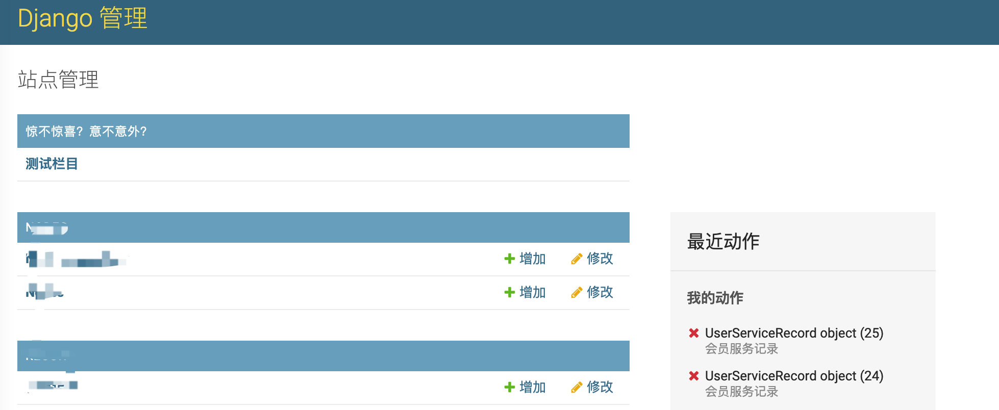
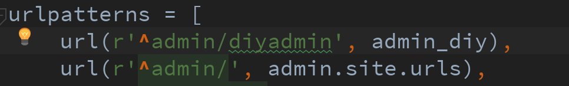
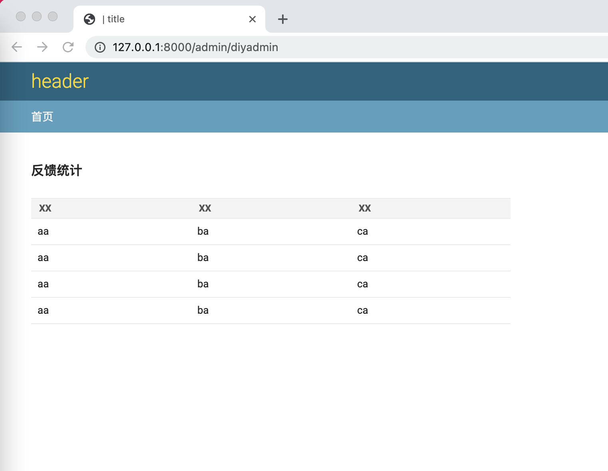
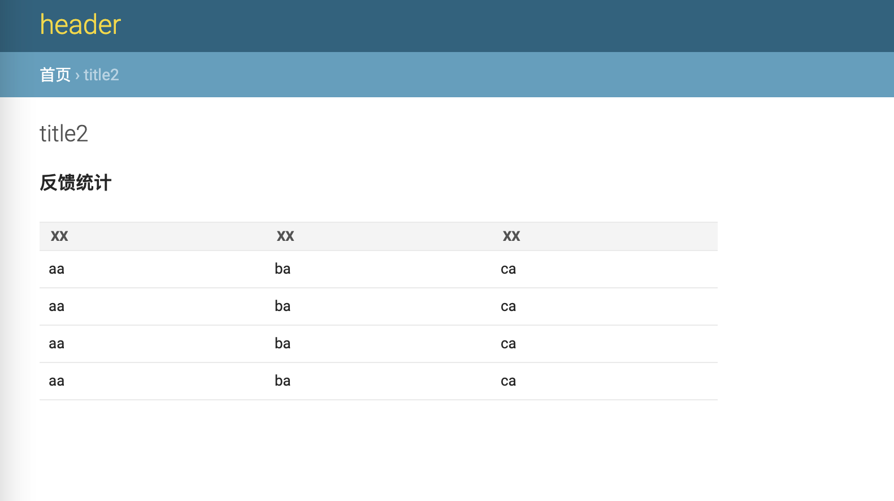

# 改造Django默认的后台

Django用的时间久了会觉得挺方便，定义好model，便有一套默认的后台系统给你提供一整套的增删改查服务，对于不想写后台的懒人来说非常方便，Hacking8的信息流就是用的默认Django后台。

但有时候我想在后台里加点自定义的东西，或是展示一些数据，或是增加一些自定义的按钮，就有点束手无策了。

这几天简单看了下django admin的代码，琢磨出了一些方案。。

## 简单的

在`template`新建一个`admin`目录，admin目录下新建一个`index.html`
```html 



    <div id="content-main">
        <div>
            <div class="app-diy module">
                <table>
                    <caption>
                        <span class="section"
                              title="">惊不惊喜？意不意外？</span>
                    </caption>
                    <tr>
                        <th scope="row"><a href="/">测试栏目</a></th>
                        <td></td>
                    </tr>
                </table>
            </div>
        </div>
    </div>
    {{ block.super }}


```

然后打开后台



我们就在后台新增了几个可以转到自定义页面的超链接。

接下来添加一个自定义页面

新建一个`diy_admin.py`
```python 
from django.shortcuts import render
from django.template.response import TemplateResponse


def admin_diy(request):
    context = {
        'site_title': "title",
        'site_header': "header",
        'site_url': "/",
        'has_permission': True,
    }
    return render(request, "admin/admindiy.html", context)

```

在`admin`目录下新建`admindiy.html`
```html 





    <div>
        <label><h2>反馈统计</h2></label>
        </br>
        <table class="table" table-layout="fixed" width="600px">
            <thead>
            <tr>
                <th> xx</th>
                <th> xx</th>
                <th> xx</th>
            </tr>
            </thead>
            <tbody>
            <tr>
                <td> aa</td>
                <td> ba</td>
                <td> ca</td>
            </tr>
            <tr>
                <td> aa</td>
                <td> ba</td>
                <td> ca</td>
            </tr>
            <tr>
                <td> aa</td>
                <td> ba</td>
                <td> ca</td>
            </tr>
            <tr>
                <td> aa</td>
                <td> ba</td>
                <td> ca</td>
            </tr>
            </tbody>
        </table>
    </div>


```

在原 admin路由上面添加一个自定义页面的路由





不过可以观察到这个页面没有面包导航，也没有权限验证，任何人都能访问

看django admin的代码，添加了一些权限验证和context
```python 
def admin_diy(request):
    if not (request.user.is_active and request.user.is_staff):
        index_path = reverse('admin:index')
        return HttpResponseRedirect(index_path)
    context = {
        'site_title': "title",
        'site_header': "header",
        'site_url': "/",
        'title': "title2",
        'has_permission': True,
    }
    return render(request, "admin/admindiy.html", context)

```



现在好多了，对于只想定义几个单页面来说，这样就足够了。

## 复杂一点

新建一个`myadmin.py`文件
```python 
class MyAdminSite(AdminSite):

    def get_urls(self):
        from django.urls import path

        urls = super().get_urls()
        urls += [
            path('my_view/', self.admin_view(self.diy_home), name="haha")
        ]
        return urls

    def diy_home(self, request):
        """
        Display the main admin index page, which lists all of the installed
        apps that have been registered in this site.
        """

        context = {
            **self.each_context(request),
            'title': "测试",
        }
        request.current_app = self.name

        return TemplateResponse(request, 'admin/admindiy.html', context)

admin_site = MyAdminSite(name='myadmin')

```

然后setting.py中`INSTALLED_APPS`中`django.contrib.admi`替换成自己的`app.myadmin.admin_site`

**替换admin url**

原来的admin url是`url(r'^admin/', admin.site.urls)`替换为`url(r'^admin/', admin_site)`

**替换register**

然后在所有app下的admin.py下，`admin.site.register`替换为`myadmin.admin_site.register`

这个模式相当于继承了django admin之前的方法，继承并新增里面的url，导入到自己的设定的view中，权限验证context之类的可以直接复用它写好的就行了，但是缺点就是要将之前使用原版admin的方法都替换为我们自定义的这个新方法。
