# 红队视角下木马架构整理

## 红队视角下的后门

来自 https://www.freebuf.com/news/259752.html

  1. dll劫持执行恶意代码
  2. 9层环境检测，判断环境上下文安全，是否继续执行
  3. 检查通过，使用DGA算法生成的域名发送DNS上线通知，检查DNS解析结果是否满足自身运行要求
  4. DNS上线通知成果，使用两种User-Agent和三种代理模式，与C2服务器建立HTTP控制通道
  5. 前期后门不需要处理很多指令，只需要能够下载自定义Payload，例如Cobalt Strike beacon，进行下一步操作

### 代码执行

无论是红队后渗透还是真实APT攻击，第一步要在受害者的机器上运行起来控制程序（agent/implant/artifact）。Windows系统上的代码执行的方法有很多，也可以从多种角度进行分类和总结。这里作者将之分为以下三类：

(1)BYOB: Bring Your Own Binary，就是把后门、工具、武器编译成exe文件，上传到目标主机上并运行。这也是最直接的执行方式。缺点是需要不断的编译和上传、要处理杀软和EDR的静态检测等等。

(2)LotL: Living off the Land，可以理解为就地取材，利用Windows系统和应用程序来加载执行恶意代码，典型的案例就是利用powershell的攻击。这种方式利用白名单程序来加载，会有一定规避检查的优点，但会产生明显的父子进程关系和进程参数，容易被猎捕。

(3)BYOL: Bring Your Own Land，这也是FireEye提出的一种方法，在使用前两种方法建立了基本的代码执行能力后，在内存中加载并运行Windows的PE文件、.NET assembly文件。优点是跳过了静态文件查杀，不会明显产生进程间调用关系和进程调用参数，缺点是需要自己开发内存加载执行的代码，很多常规的命令需要自己重新实现。

#### 值得关注的

代码使用自定义hash算法，常量字符串都进行hash处理，避免敏感字符串在传输流量和本地文件扫描时发现。实际使用的地方有9处，下图是进程名检测部分:

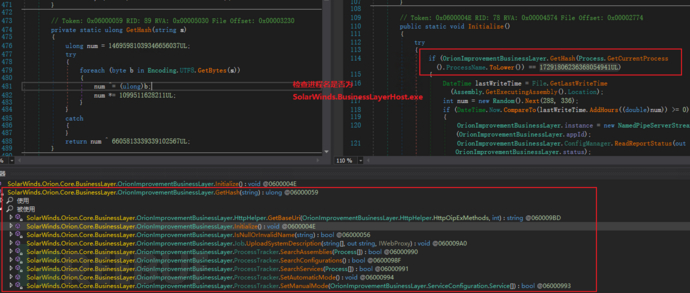

### 环境检测

9层检测机制，都通过时，再执行上线。

  1. 通过hash判断加载的恶意dll进程名称
  2. 写入时间比当前时间至少提前12～14天，潜伏半个月执行
  3. 硬编码检测命名通道，避免多进程重复执行
  4. 检查当前设备所在域，域名中不能包含哈希值校验的黑名单patternHashes中的一些字符串；域名不能匹配到正则表达式“(?i)([^a-z]|^)(test)([^a-z]|$)”，该表达示主要用来检查当前域名是不是测试用的域名；”(?i)(solarwinds)”，猜测该表达式主要用来检测是否处于sloarwinds公司办公环境
  5. 检查第一个非回环网卡，不在IP黑名单中
  6. 检测进程Hash黑名单(包含137个进程)，确保当前环境中没有安全相关软件和服务程序，如Windbg,Autoruns,Wireshark，并尝试关闭服务名单中服务
  7. 检测当前环境是否存在13个安全软件的驱动程序
  8. 主机解析 api.solarwinds.com 为指令ip地址(供应链攻击隐藏)

#### 值得关注的

红队技术传统技术往往高度关注进程列表检测、驱动列表检测的技巧

对于杀软和安全软件的检测，我们通常使用taskllist /v和tasklist /svc来检查进程和服务，可以认为这是一种手工判断+LotL的方法。这里推荐两款自动化的检测脚本和工具，大家可以根据自己的需求进行改造，结合内存加载实现BYOL的方式来检查安全软件。

(1)ProcessColor.cna，一款Cobalt Strike的插件脚本，可以帮助我们标记出常见的安全软件、监控软件、分析软件。

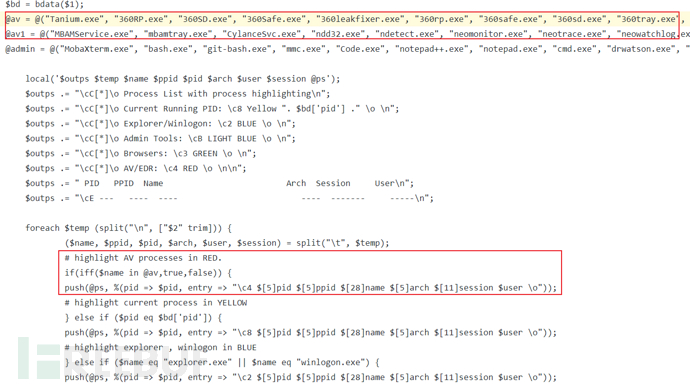

(2)Seatbelt的InterestingProcesses命令，C#开发的多功能信息搜集工具，可单独使用，可结合其他程序实现内存加载。

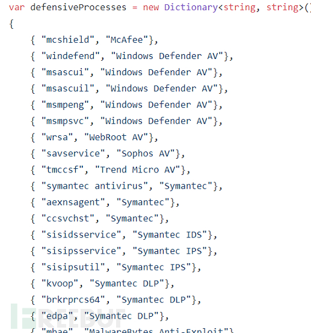

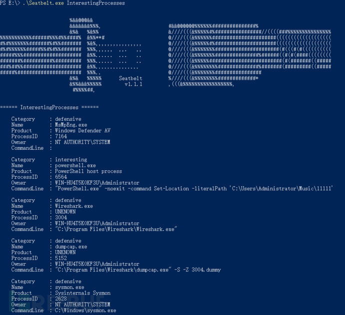

**2.1.2 驱动检测**

既然进程和服务都检测了，那么检测这些驱动有什么意义吗？

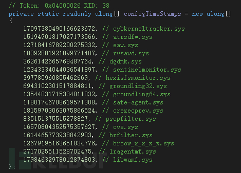

在常规的情况下，检查进程和服务名称就可以了解当前系统的安全软件运行情况，但是一些高级系统管理员会修改进程和服务的名称，我们就没办法判断了。Sunburst后门在环境检测中还检查了系统驱动，这些驱动大部分都是杀软和EDR产品使用的。这一点是值得红队人员借鉴的，下面以sysmon为例进行说明。

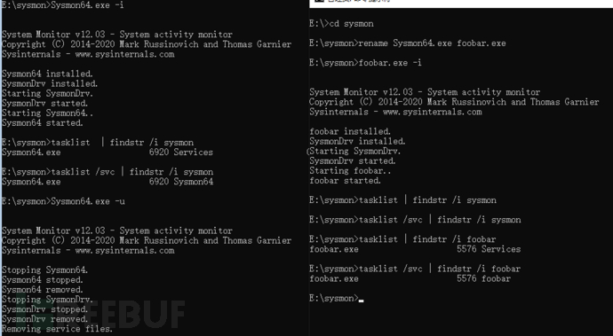

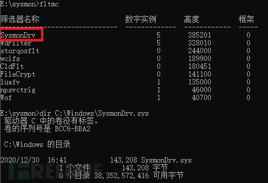

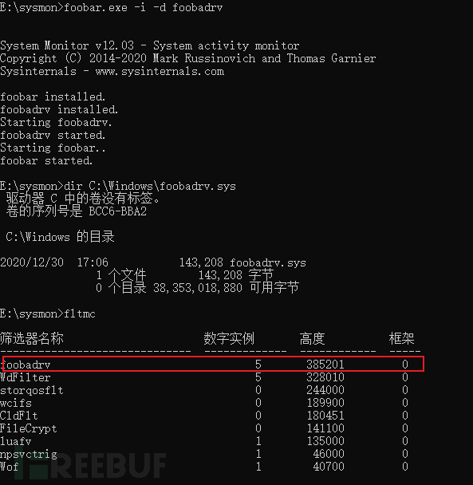

### C2通道

对于红队来说，最常规的出网协议是HTTP[S]和DNS协议，但是大多数情况是手动判断目标的网络环境后来选择C2通信的方式。虽然能够修改和自定义C2通信协议，无疑是规避流量检测的好方法，但是相对的成本会比较高，需要同时兼顾客户端和服务端，还需要保证通信质量。简易的做法是利用后渗透框架自身的配置来修改C2流量特征，比如Cobalt Strike、Empire、Covenant等工具都支持Malleable C2 profile的配置。

#### 监测蓝队是否分析自己implant

将制定DNS域名以常量字符串形式嵌入implant，生成独一无二的DNS域名，只要收到这个DNS查询请求，说明我们的行动已经被发现。

同理，可监测web

#### 尽可能展现正常的数据

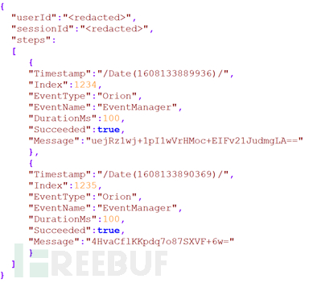

回复正常的数据，客户端从正常数据中提取需要的数据

以下是黑客C2服务器对远端受害主机控制命令的类型和功能：

命令 | 值 | 详细描述  
---|---|---  
空闲 | 0 | 无  
退出 | 1 | 结束当前进程  
设置延迟时间 | 2 | 设置主事件循环执行的延迟时间  
收集系统信息 | 3 | 解析本地系统信息，包括主机名、用户名、操作系统版本、MAC地址、IP地址、DHCP配置和域信息  
上传系统信息 | 4 | 向指定的URL发送HTTP请求，并把系统信息以特殊格式发送到C2服务器  
启动新任务 | 5 | 根据文件路径和参数启动新进程  
枚举进程信息 | 6 | 获取进程列表，并根据参数决定是否获取父进程ID、用户名、域名  
结束任务 | 7 | 根据PID结束指定进程  
枚举文件信息 | 8 | 根据文件路径枚举文件和目录  
写入文件 | 9 | 根据文件路径和Base64编码字符串，将Base64解密字符串的内容以追加模式写入文件，写入后延迟1-2秒  
判断文件是否存在 | 10 | 判断文件路径是否存在  
删除文件 | 11 | 根据文件路径删除文件  
获取文件哈希 | 12 | 获取文件的MD5哈希信息  
读注册表值 | 13 | 读取注册表值  
设置注册表值 | 14 | 设置注册表值  
删除注册表值 | 15 | 删除注册表值  
获取注册表子项和值 | 16 | 获取注册表路径下的子项和值名称的列表  
重启 | 17 | 尝试使系统重启  
  
#### 高度迷惑性的DGA算法

如果样本通过上述阶段，则样本将在while循环中通过DGA算法开始生成域。样本会延迟域生成之间的随机间隔；此时间间隔可以是1到3分钟，30到120分钟或在错误条件下最长420到540分钟（9小时）范围内的任意随机值。

总共用四种方法来生成url，分别为GetCurrentString，GetPreviousString，GetNextStringEx和GetNextString函数。

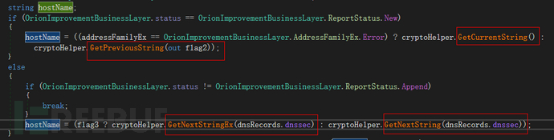

其中GetCurrentString/GetPreviousString可以认为是第一阶段DGA，包含可以完整解析的域名，GetNextStringEx/GetNextString可以认为是第二阶段DGA，包含了有效的服务器时间戳等信息。

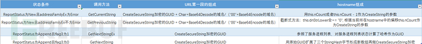不管哪种生成方式，在OrionImprovementBusinessLayer.GetOrCreateUserID中，HKEY_LOCAL_MACHINE\SOFTWARE\Microsoft\Cryptography的 MachineGuid值和第一个网络适配器的物理地址MAC组成了UID，并通过计算UID的MD5哈希，再用ComputeHash类的方法将 MD5 哈希值作为16字节的数组返回，异或之后最终输出64位哈希值这样得到目标GUID。GUID通过CreateSecureString函数进行加密，CreateSecureString函数中使用了CryptoHelper.Base64Encode算法加密。所以整个加密过程全是CryptoHelper.Base64Encode函数和CryptoHelper.Base64Decode函数实现的，**研究的重点就是CryptoHelper.Base64Encode函数和CryptoHelper.Base64Decode函数** 。然而这两个函数都并不是名称表示的常见的Base64编解码函数。

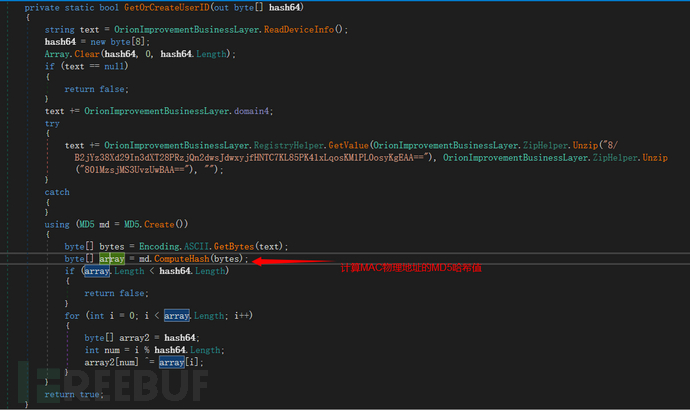

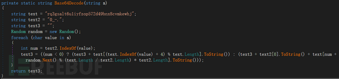

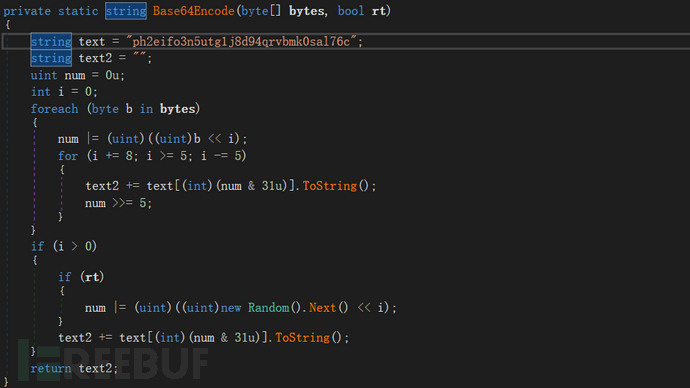

一、前15个字节是GUID被加密过后的编码0fn7oe4cegrf933

二、中间一个字节是通过CreatString生成的“c”

三、后面的mudofi75f4tjvh则是AD域被编码后的字符串。

因为这里十六个字节过后有“00”开头的标志，所以可以断定应该调用OrionImprovementBusinessLayer.CryptoHelper.Base64Decode对应的解码算法。解码后可以得到域名称：WASHO。

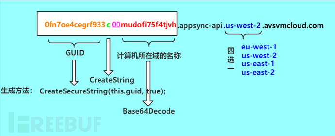

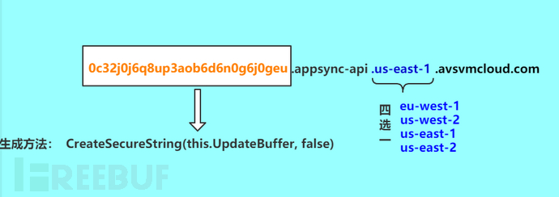

## 总结整理

loader -> 加载更多模块

  * loader
    * 明文字符串都用算法加密
    * 功能尽可能简单，使用模块化手段加载
    * 可选加入反av 反沙箱功能，检测调试退出
  * 模块

    * 压缩代码数据
    * 加密代码数据
    * shellcode化
  * 服务端

    * dns，http探查反跟踪

  * 通过动物名字下达指令

### 中间服务器

client 到 server端可以通过中间服务器中转，中间服务器中转正常流量，对于client流量中转到另外地方

### 长时间C2 短时间C2

长时间C2 用于长时间控制，12小时控制一次

短时间C2用于对目标频繁交互

### 第三方服务C2

google twitter email
