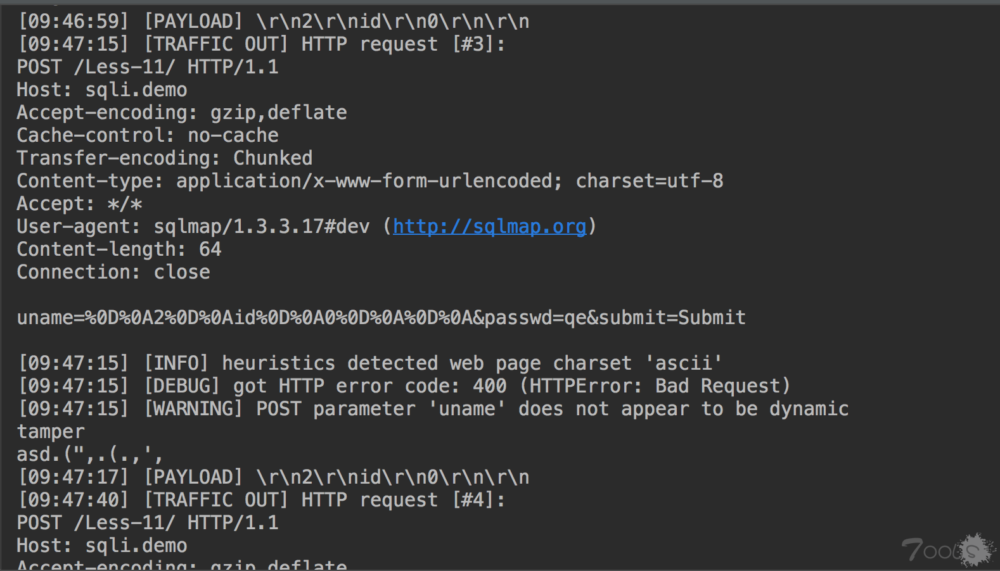
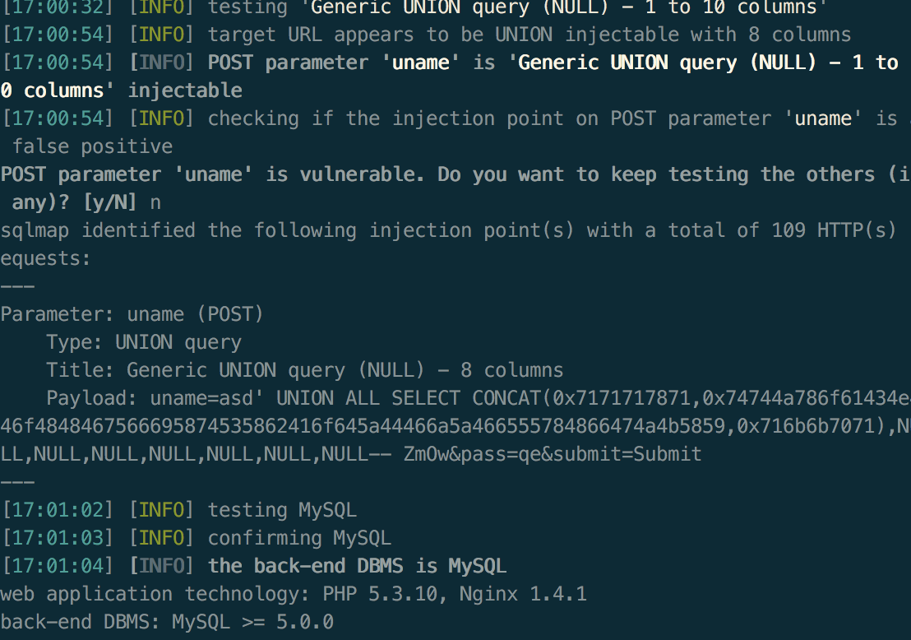

# 给sqlmap插上chunk transfer的翅膀

最近在研究sqlmap，好早就看到这篇 https://www.t00ls.net/thread-50229-1-1.html ，今天有空测试一下，主要是看sqlmap的原因。

因为要替换payload，首先想到是编写一个tamper, 因为是用于测试目的，主要打印几个关键点就行了
```python 
#!/usr/bin/env python
# -*- coding: utf-8 -*-
# @Time    : 2019/3/12 5:45 PM
# @Author  : w8ay
# @File    : chunk.py

"""
Copyright (c) 2006-2019 sqlmap developers (http://sqlmap.org/)
See the file 'LICENSE' for copying permission
"""

from lib.core.enums import PRIORITY
from random import sample

__priority__ = PRIORITY.NORMAL


def dependencies():
    pass


def randomIP():
    numbers = []

    while not numbers or numbers[0] in (10, 172, 192):
        numbers = sample(xrange(1, 255), 4)

    return '.'.join(str(_) for _ in numbers)


def tamper(payload, **kwargs):
    """
    Append a fake HTTP header 'X-Forwarded-For'
    """

    headers = kwargs.get("headers", {})
    headers["Transfer-Encoding"] = "Chunked"
    print "tamper"
    print payload
    # return payload
    payload = "\r\n" + "2" + "\r\n" + "id" + "\r\n" + "0" + "\r\n\r\n"
    return payload

```

sqlmap命令  
`-u "http://testphp.vulnweb.com/login.php" --tamper chunkaaa.py --data "uname=asd&pass=111&submit=Submit" -v 4`

返回">

可以看到chunked是添加上了的，但是payload被转换成了参数，猜测tamper的机制只是替换payload中的某个参数，而不是整个替换，由于不符合chunk的规则，所以报错了。

暂时想通过sqlmap来好像无解..

## 原生支持

那么尝试下在sqlmap中直接集成这种功能呢。sqlmap的通用发包函数是`lib/request/connect.py`的`getPage`函数，通过调试了解到是整个访问请求是封装的urllib2。

这里有一个坑就是如果只用urllib2发送分块，最后抓包的时候都会带有`content-legnth`，花了好长时间定为发现在httplib和urllib2的请求中，都会检查是否存在`content-legnth`请求，没有会自动添加…

最后用hook解决了这些问题，最后分块生成使用的是https://www.t00ls.net/thread-50185-1-1.html ，会自动将提交的数据转换为chunk的形式，并且按照会关键词分割，确保每个块中不会包含关键词。

## 最后的效果

给sqlmap添加了一个参数`—chunk`,在进行post注入时，添加这个参数会自动将请求包转换成chunk包的形式，并且每个块中不会包含敏感的关键词。

测试
``` 
python sqlmap.py  -u "http://testphp.vulnweb.com/userinfo.php" --data "uname=asd&pass=qe&submit=Submit" --random-agent --chunk

```



噢对了，写好的脚本在https://github.com/boy-hack/sqlmap 已经给官方提交pr了。
