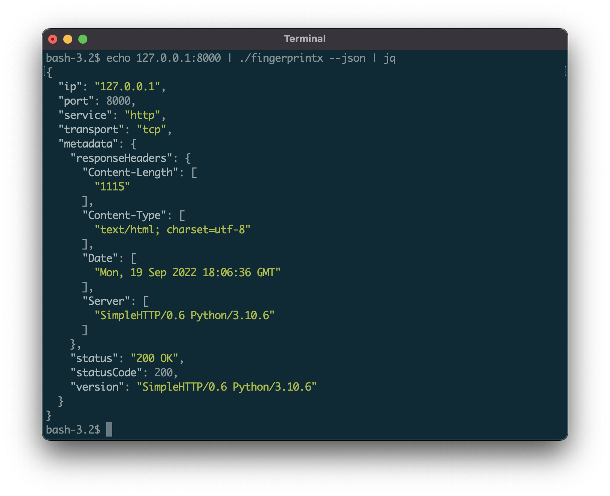
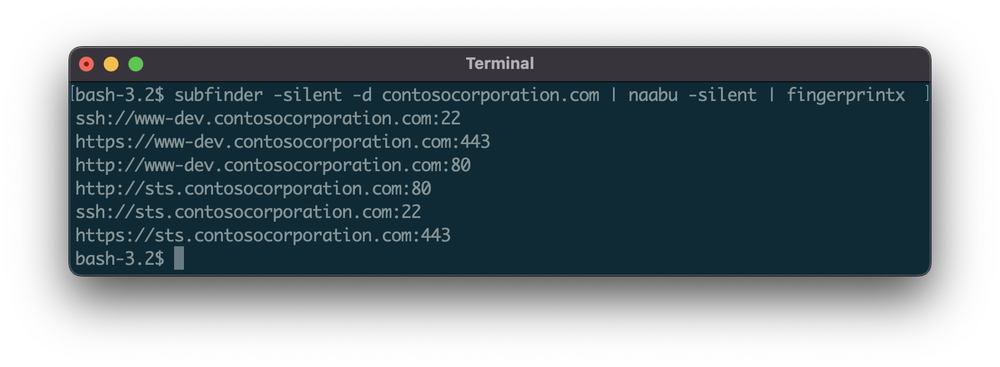
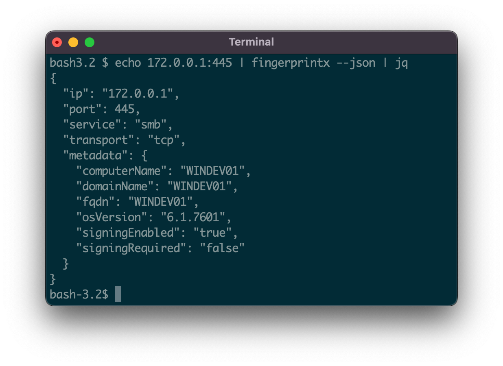
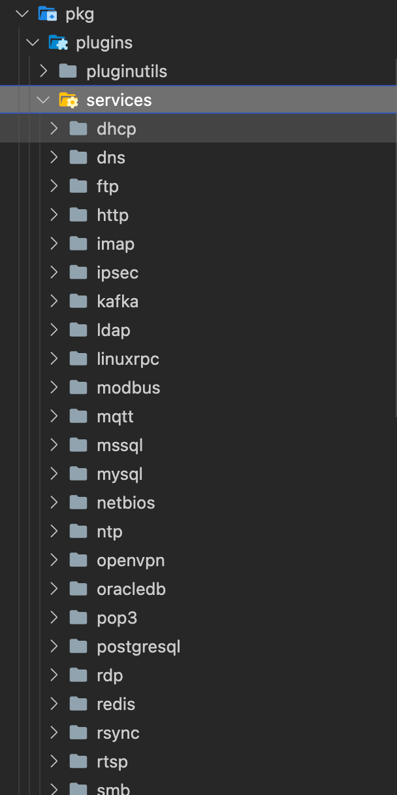
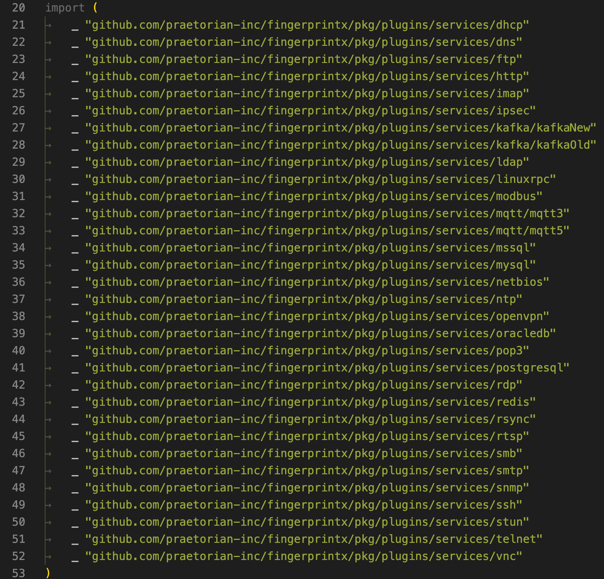
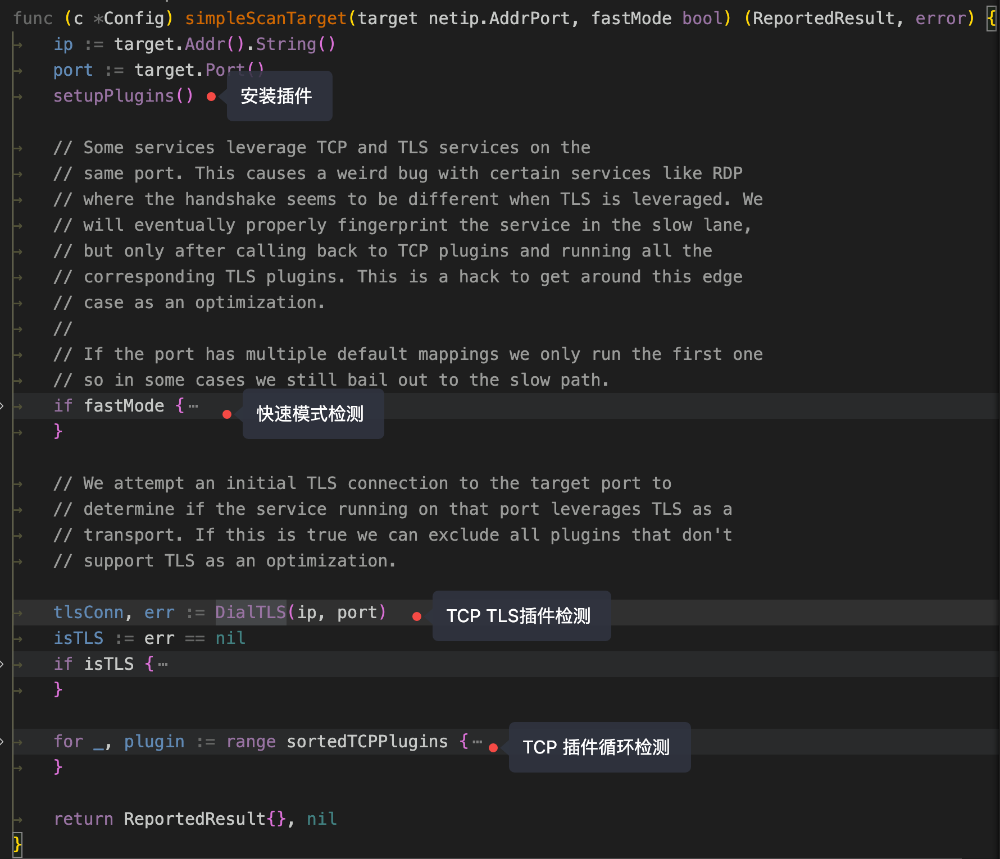

# fingerprintx 代码赏析，端口指纹识别工具

GitHub：https://github.com/praetorian-inc/fingerprintx

> fingerprintx是一个类似于httpx的实用程序，它还支持 RDP、SSH、MySQL、PostgreSQL、Kafka 等指纹识别服务。fingerprintx可以与Naabu等端口扫描仪一起使用，对端口扫描期间识别的一组端口进行指纹识别。例如，工程师可能希望扫描 IP 范围，然后快速识别在所有发现的端口上运行的服务。







输入ip+端口，就能输出端口服务指纹相关的信息

支持的协议：

SERVICE | TRANSPORT | SERVICE | TRANSPORT  
---|---|---|---  
HTTP | TCP | REDIS | TCP  
SSH | TCP | MQTT3 | TCP  
MODBUS | TCP | VNC | TCP  
TELNET | TCP | MQTT5 | TCP  
FTP | TCP | RSYNC | TCP  
SMB | TCP | RPC | TCP  
DNS | TCP | OracleDB | TCP  
SMTP | TCP | RTSP | TCP  
PostgreSQL | TCP | MQTT5 | TCP (TLS)  
RDP | TCP | HTTPS | TCP (TLS)  
POP3 | TCP | SMTPS | TCP (TLS)  
KAFKA | TCP | MQTT3 | TCP (TLS)  
MySQL | TCP | RDP | TCP (TLS)  
MSSQL | TCP | POP3S | TCP (TLS)  
LDAP | TCP | LDAPS | TCP (TLS)  
IMAP | TCP | IMAPS | TCP (TLS)  
SNMP | UDP | Kafka | TCP (TLS)  
OPENVPN | UDP | NETBIOS-NS | UDP  
IPSEC | UDP | DHCP | UDP  
STUN | UDP | NTP | UDP  
DNS | UDP |   

想看看源码，这些协议是怎么做识别以及怎么组织的。

看官方描述，使用`fingerprintx`有一个快速模式`fast`

> 该fast模式将仅尝试为每个目标识别与该端口关联的默认服务。例如，如果praetorian.com:8443是输入，则只会https运行插件。如果https未在 上运行praetorian.com:8443，则不会有输出。为什么要这样做？这是在大量主机列表中识别大多数服务的快速方法（想想2/8原则 ）。

**和nmap的区别**

> 一个在 8080 端口打开的服务器上运行的插件是 http 插件。默认服务方法在最好的情况下减少了扫描时间。大多数情况下，在端口 80、443、22 上运行的服务是 http、https 和 ssh——所以这是fingerprintx首先检查的内容。

## 插件组织结构

这个项目提供了很好的一个插件架构，fingerprintx的指纹识别是以插件的形式进行的，如ftp识别是一个插件，mysql识别也是一个插件。

插件目录位于`pkg/plugins/services`



虽然不是动态插件加载，作为go的也值得学习。

插件的接口是
```go 
type Plugin interface {
  Run(net.Conn, PluginConfig) (*PluginResults, error) // 运行插件，返回结果
  PortPriority(uint16) bool // 返回端口的优先级，比如ssh的端口优先级是22,优先级可以让识别更快
  Name() string  // 返回服务插件的名称
  Type() Protocol // 返回该插件的协议类型 TCP或UDP
  Priority() int // 插件调用的优先级，数字越大优先级越高
}

```

所有的插件都要实现这些方法。

看一个简单的插件源码，例如ftp
```go 
package ftp

import (
  "net"
  "regexp"

  "github.com/praetorian-inc/fingerprintx/pkg/plugins"
  utils "github.com/praetorian-inc/fingerprintx/pkg/plugins/pluginutils"
)

var ftpResponse = regexp.MustCompile(`^\d{3}[- ](.*)\r`)

const FTP = "ftp"

type FTPPlugin struct{}

func init() {
  plugins.RegisterPlugin(&FTPPlugin{})
}

func (p *FTPPlugin) Run(conn net.Conn, config plugins.PluginConfig) (*plugins.PluginResults, error) {
  response, err := utils.Recv(conn, config.Timeout)
  if err != nil {
    return nil, err
  }
  if len(response) == 0 {
    return nil, nil
  }

  matches := ftpResponse.FindStringSubmatch(string(response))
  if matches == nil {
    return nil, nil
  }

  return &plugins.PluginResults{
    Info: map[string]any{
      "banner": string(response),
    }}, nil
}

func (p *FTPPlugin) PortPriority(i uint16) bool {
  return i == 21
}

func (p *FTPPlugin) Name() string {
  return FTP
}

func (p *FTPPlugin) Type() plugins.Protocol {
  return plugins.TCP
}

func (p *FTPPlugin) Priority() int {
  return 10
}

```

每个插件初始化时候都会进行默认注册
```go 
func init() {
  plugins.RegisterPlugin(&FTPPlugin{})
}

```

跟进``RegisterPlugin``函数
```go 

var Plugins = make(map[Protocol][]Plugin)
var pluginIDs = make(map[PluginID]bool)

// This function must not be run concurrently.
// This function should only be run once per plugin.
func RegisterPlugin(p Plugin) {
  id := CreatePluginID(p)
  if pluginIDs[id] {
    panic(fmt.Sprintf("plugin: Register called twice for driver %+v\n", id))
  }

  pluginIDs[id] = true

  var pluginList []Plugin
  if list, exists := Plugins[p.Type()]; exists {
    pluginList = list
  } else {
    pluginList = make([]Plugin, 0)
  }

  Plugins[p.Type()] = append(pluginList, p)
}

```

他会把实例化的类加入到`Plugins`这个全局变量中。在程序初始化中，`pkg/scan/plugin_list.go` 进行初始化所有插件。



后面运行直接遍历`Plugins`全局变量的内容即可实现插件化调用了。

## 识别流程

初始化插件，以及对每个类别的插件进行排序，按照协议类型`TCP`、`TCPTLS`、`UDP`整理
```go 
func setupPlugins() {
  if len(sortedTCPPlugins) > 0 {
    // already sorted
    return
  }

  sortedTCPPlugins = append(sortedTCPPlugins, plugins.Plugins[plugins.TCP]...)
  sortedTCPTLSPlugins = append(sortedTCPTLSPlugins, plugins.Plugins[plugins.TCPTLS]...)
  sortedUDPPlugins = append(sortedUDPPlugins, plugins.Plugins[plugins.UDP]...)

  sort.Slice(sortedTCPPlugins, func(i, j int) bool {
    return sortedTCPPlugins[i].Priority() < sortedTCPPlugins[j].Priority()
  })
  sort.Slice(sortedUDPPlugins, func(i, j int) bool {
    return sortedUDPPlugins[i].Priority() < sortedUDPPlugins[j].Priority()
  })
  sort.Slice(sortedTCPTLSPlugins, func(i, j int) bool {
    return sortedTCPTLSPlugins[i].Priority() < sortedTCPTLSPlugins[j].Priority()
  })
}

```

fingerxprint的扫描模式分为快速模式和精准模式，快速模式只检查常用端口对应的服务，所以速度较快，精准模式不在乎性能，只求精准，会将所有插件都运行一遍。



## End

fingerprintx readme后面还提到了zgrab2，也是类似的用Go编写的服务指纹识别工具，他和zmap是同一个项目组，后面再看看它的源码。
