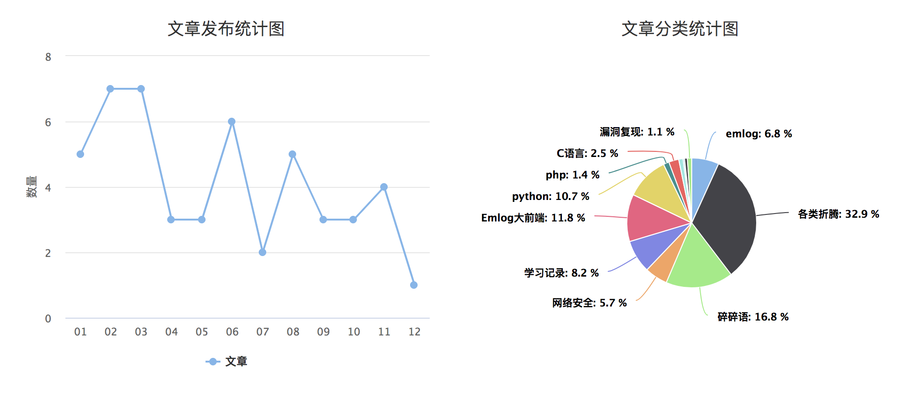

# 2019年终总结&毕业半年

和2018总结一样，2019年博客每月都发表了文章。那么和2018年有什么变化呢？  

## 回顾

  1. 一月，一个突如其来的想法建造了Hacking8 www.hacking8.com，一个简单的类似wiki的学习网站。
  2. 二月，w12scan基本完成，做了一个宣传视频以及在线部署的记录。同时T00ls的专访报告也发布了，欢喜之余也深知更要努力。
  3. 三月，为sqlmap加入了一个简单的chunk发包操作，第一份向sqlmap提交的代码，很自豪。
  4. 四～五月，主要是为毕业答辩做准备，写了很多w12scan的文章。5月份同时和公司小伙伴参加《拟态防御国际精英挑战赛》，第一次参加ctf，被ctf的氛围所感染。
  5. 六～八月，毕业了，答辩完成的同时松了一口气，这三个在看一些扫描器的源码和架构，想将这些源码转换为自己的“代码”，所以开源了w13scan被动扫描器。
  6. 九月，度过了毕业后第一个中秋，有惆怅，有感叹，明月几时有？
  7. 十月，将我的开源项目做了一个主页 https://opensource.hacking8.com/,用来纪念我那逝去的，无处安放的魅力。
  8. 十一～十二月，年末最后两月有些懈怠，沉迷上了游戏，对技术的热情有所减小了。

## 一些遗憾

  1. 今年原本还计划写一本关于sqlmap的书籍，列好大纲，尝试写了几篇后就没有再动笔了。因为不像随笔，可以想到哪写到哪，作为技术书籍我认为还是需要严谨的，有很多地方需要看代码求证，无疑会耗费很多时间。但今年，我想把它写出来。
  2. 自动化刷SRC平台没有写出来。基于快速开发的实践，我先写了一个资产收集平台，再把各大src的资产收集得差不多的时候，又花了很大精力来写前端和一些交互逻辑，这上面耗费的时间太多，而且还不太满意。自动化刷SRC平台，用来开发扫描工具可能只需要五天，但是为此编写前后端交互逻辑，ui设计等等，需要几个月时间，又由于拖延，所以没有完成。还有一个原因是，它并没有我想要的自动化刷漏洞的效果，都是一些资产收集的手段。所以后面我又想着自己尝试做一下BugHunter刷刷src，获得一些经验，再来对应开发我所需要的工具。但似乎陷入了死循环，我并不想手动的一个个点击资产，所以又开发了批量扫描工具来帮助我，但是这些工具又帮不上我太多。。

## 一些感想

有时候我在想，工作的意义是什么？为什么要占据我这么多时间？有一个假设，如果有一种工作只需要你工作一两个月，完成某个任务，便可以获得正常工作一年的薪水，你做不做呢，以什么形式做呢？

又是一年，随着岁数的增大，一些兴趣的占比只能占人生的一小块了，更多的是什么呢，各种琐事，对未来的迷茫，对过去的怀念，挣扎在各式各样的欲望中。

## 2020 目标清单

2019的各种目标中，只有sqlmap书籍没有完成，其他的都或多或少完成了。今年希望全部完成！

  1. sqlmap写书计划
  2. 某个src排行榜月度前50 [ok]
  3. 学习golang，用golang写个无状态子域名爆破工具。
  4. 能继续维护w13scan 

### 3.8 更新

  * 通过编写xss自动化工具，刷了几个src，月度前50还是挺容易的，已经达成。
  * w13scan,一直在探索更新插件，但是并没有推到github，现在就是修复一些之前的bug
  * sqlmap写书计划还未开始，需要加油了。
  * 无状态子域名爆破还未开始，需要加油了

