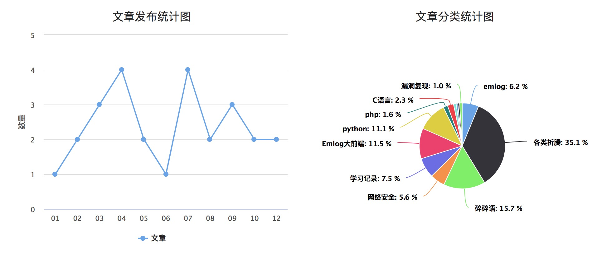
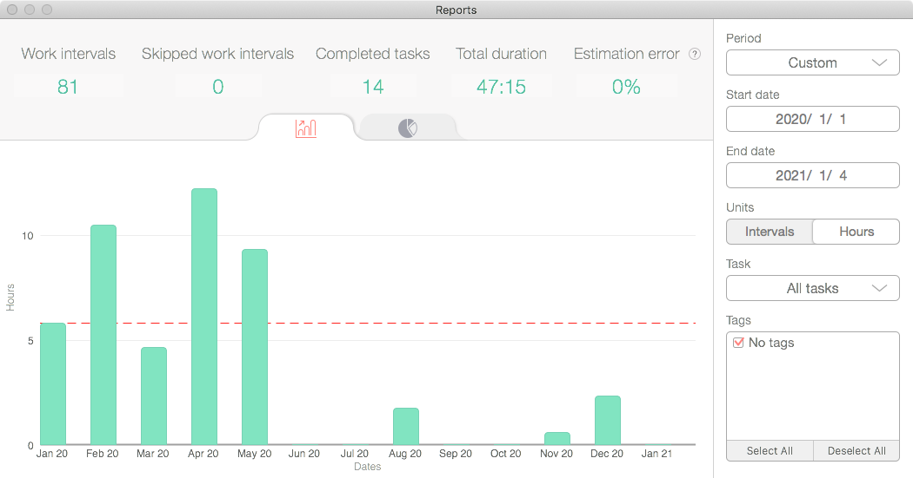
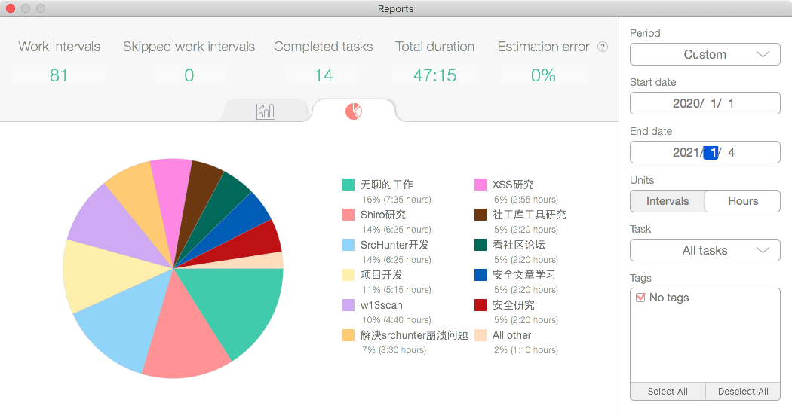
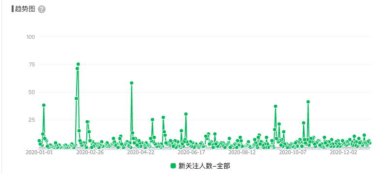
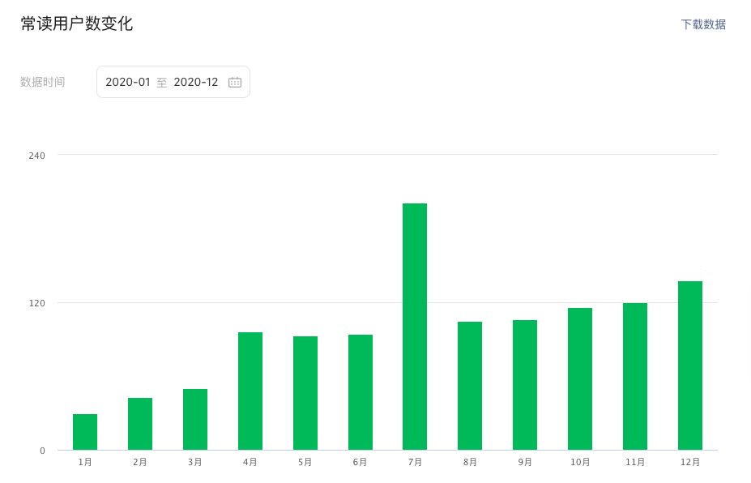
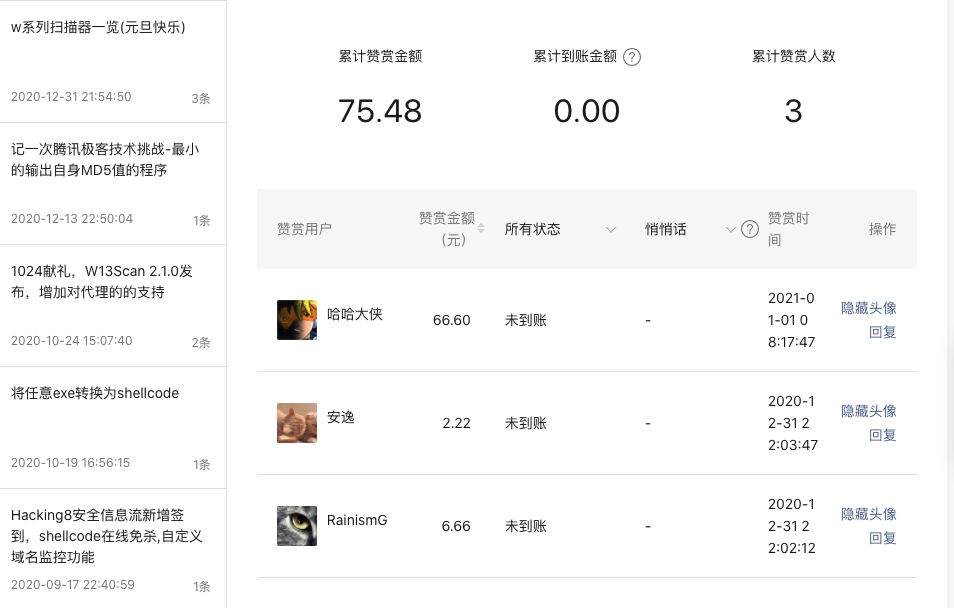
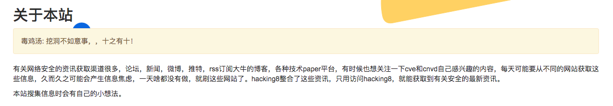
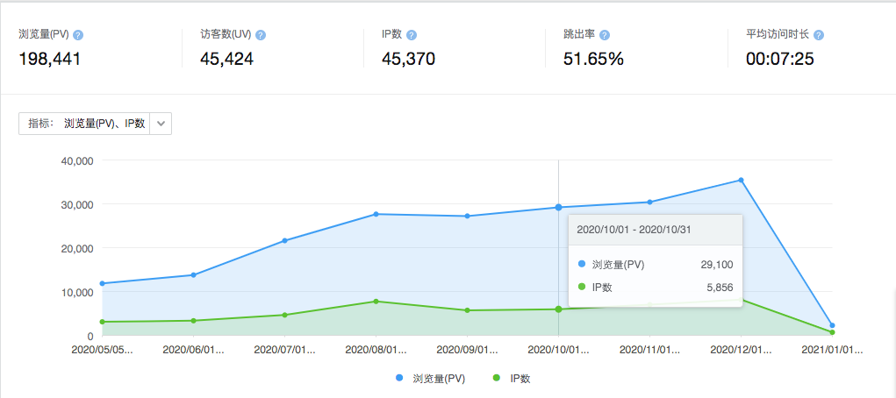
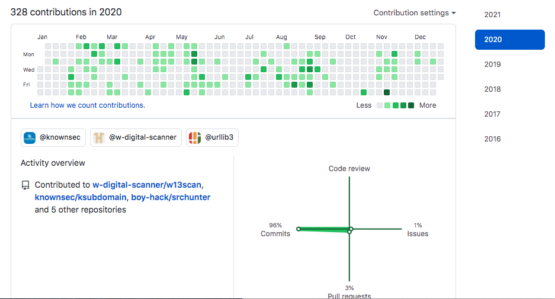
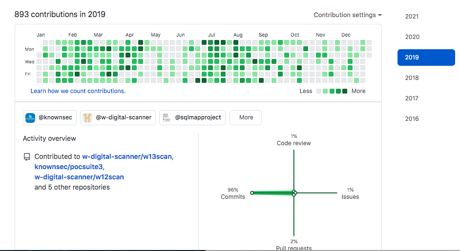

# 2020年总结

工作了一年多，加上实习的时间，相当于工作两年了。逐渐摸清了工作中的套路，没有了之前编程的好奇和热情，取而代之的是平平淡淡的搬砖，工作很轻松，但是感觉太舒适了，不适合现在充满好奇的我，年后准备改变了。

2020年文章发布统计图

和2019年相比，发的文章少了，11月甚至一篇文章都没有发，主要原因是有些研究属于公司范畴，不好公开。

## 回顾

  1. 1～2月，捣鼓xss自动化扫描器，批量刷src
  2. 3～4月，w13scan 2.0的更新
  3. 5月，用劳动节几天创建了`Hacking8安全信息流`
  4. 6月，在`Hacking8安全信息流`创建了SRC自动收集项目
  5. 7月，继续为`安全信息流`更新代码
  6. 8～9月，开源`ksubdomain`无状态子域名爆破工具，shellcode在线免杀
  7. 10月，研究任意exe转shellcode工具
  8. 11～12月，参加腾讯极客技术挑战第二期《最小输出md5程序》

## 2019任务完成情况

见2019年终总结&毕业半年

几个目标清单

  1. [-] sqlmap写书计划
    1. 未完成，
  2. [x] 某个src排行榜月度前50
    1. 编写了一个xss自动扫描器，自动化扫描各种src的xss，得到了一些成绩。国内src奖励太低，转去扫了下微软的网站，连续扫了几个月，每个月都能得到在线服务的致谢，有一个还命中了赏金计划的网址，得到了微软的赏金。嘿嘿。
    2. 主要受限于服务器太差，扫描速度很慢，后面就没再扫描了。
  3. [x] 学习golang，用golang写个无状态子域名爆破工具。
    1. ksubdomain已经发布～
  4. [x] 能继续维护w13scan
    1. w13scan 2.0 发布了，优化了整个框架和插件编写模式，生成html报告格式，已经符合我心目中扫描器的样子了。
    2. 用python写的工具总有些不便，后面的开源工具，想都尝试用go去写。

四个清单完成了三个，sqlmap写书计划，目录大纲都写好了，但是有些东西，知道了和说出来，以及说出来它的原因来，还有很大的鸿沟，要知道其原理，需要去看很多东西。暂时还没有精力去做这件事。。

## 一些数据

今年开始学习别人有意识的做了一些数据统计

### 体重数据

有空的时候我都会站在体重秤上称一称，然后手写到记录纸上，没有使用app或者电子化的数据，觉得这样还富有一些仪式感。

比较隐私就不展现了，但是可以知道的是，原来年初80kg，疫情在家待了两月后回来变成了86kg，后面满满的又降了下去，一直在81～84之间徘徊，今年11月去体检了下，就一直稳定在85kg以上了。

新的一年，我也要有意识的减肥了。

### 工作数据

用到了一个软件`Be Focused Pro`来记录工作中的一些时间消耗，但总会忘记打开。。所以只能当成一个参考，不足以盖全。

大部分记录在一月到五月，主要是做一些项目开发，和poc的改写，然后就是看看和学习各个社区的文章以及自己的一些扫描器开发的项目。

工作没有稀奇古怪的东西，都是自己给自己找事，所以才会有开头的平平淡淡的搬砖 - =

## 公众号和信息流

今年开始运营一个自己的公众号，主要目的是想分享一下自己写工具的感想给大家，公众号可以精准的投送给粉丝，非常适合～

目前关注的人数有2400+

常读人数在今年也不断增多

支持我不断更新公众号，还有一个动力，就是那些可爱的赞赏的同学们，非常感谢大家。微信里面找了好久没看到有统计总计接受了多少赞赏，只能截图看一看。

再次谢谢大家支持～

### 信息流

今年五一的时候，我创造了一个网站，取名叫`Hacking8安全信息流`，用于汇集有关安全的信息流，然后在此基础上增加一些好玩的东西。

网站很长一段时间都是开放注册，需要”解题”才能获得邀请码，这样很酷。目前注册人数已经有700多人了，每天大约会有5个人签到～

访问量也挺多的。

平均每天会有200来个独立IP访问。

## 开源项目的更新

我的2020年的提交对比2019年明显少了很大一截

开一个坑容易，维护与更新他真的很难。。今年主要维护的是公司的pocsuite3，ksubdomain，自己的w13scan。虽然都可以基本满足要求了，但自我感觉，这几个还需要进行一些代码上的大更新，才能满足我心中的那个符合完美的形象，但是事情又很多，完成了事情后，也就没有精力再去看这些开源项目的issue了。。

迟迟没有动坑开源w14scan，是我在想，还有什么好玩有趣的代码值得分享呢？今年还没有发现，明年再探一探。

## < /2020>

今年博客更新少，还有一个重要的原因，就是我交到了一个非常好的女朋友，同时也让我知道了为什么一点小架可以吵那么长时间，以前想的是可以双方有效沟通来说清楚这件事情，但感性的情绪上来，是说不清楚的 - -。

2020，还有很多自动化安全的程序想去完成，还有很多思路想去验证，收藏了很多文章、网站、教程，没有来得及去看，但它已经过去了。

## < 2021>

2020，接触到了一个词，`红队`。新的一年，想去研究红队的自动化工具,将红队评估过程中常用的战术及技术进行模块化、武器化以及可视化。

这是一个有趣的目标，但我还不清楚红队的一些需求，是`初始访问/持久化/权限提升/防御绕过/凭证访问/信息收集/横向移动`？不管怎样，我先立几个flag，到年中时再来总结回顾～

  * 分析一个远控了解它的功能和隐藏，执行手段，写个分析以及模仿写个软件
  * Hacking8信息流还有很多功能需要更新，列个清单并更新它
  * 建造一个SRC自动化信息收集平台，输入一些域名，就能得到src需要的一切信息收集相关的东西。主要是整合自己之前做的一些东西。

