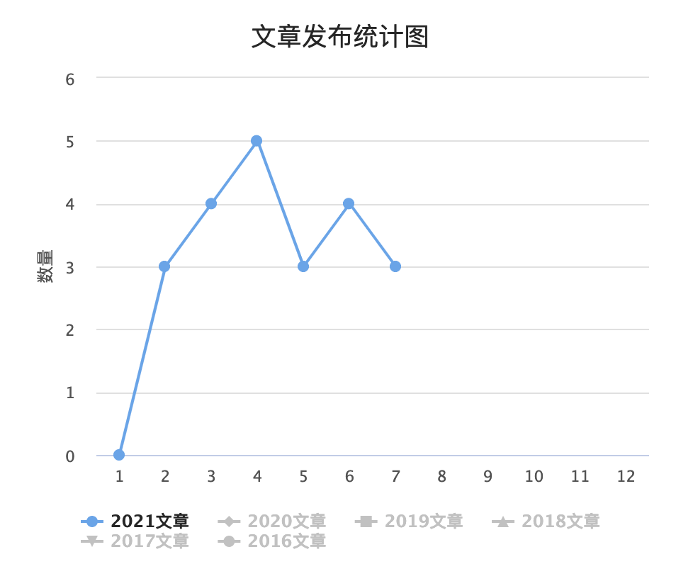

# 2021年中总结

以前很爱总结，没事就总结一下反省一番，其实是我时间太多不知道干嘛了，用总结来强制规划一下未来要做的。

现在空闲的时间很少，有很多问题等着去探索，但有些时候会感到不知所措，事情似乎干完了，又似乎没干完，似乎学到了，又似乎没学到。我想这可能是我上半年没有一个准确的目标导致的，不知道该往哪个地方去努力。

所以还是有必要写一篇文章，来总结一下上半年和展望一下下半年。

## 前言

今年年初我换工作到了大神云集的360，也来到了北京，开始了我的北漂之旅。

刚开始还是有些不适应的，好贵的房租，早上排队上挤满人的电梯，大家都是各顾各的工作，人多了，但反而没有之前公司那样热闹了。

但所幸的360大佬云集，看公司内网的一些公开资料和别人的分享，都能让整个人的思路和眼界提升很多，原来这个技术现在的做法是这样的。

这半年加入公司，主要从事的是对红队武器的研发，以及将能自动化的流程给抽离出来进行自动化实现，这也是我感兴趣的方向。

之前的工作是开发辅以一点安全研究，现在的工作变成了安全对抗为主，开发为辅，其中不可避免的要涉及到红队和二进制相关的东西，上半年也主要在不停的恶补这些，但还是得花很多时间去消化这些内容。

## 上半年做的

因为做的也是类似安全研究+写代码的工作，上半年基本就是 写代码、看代码、写文章、看文章的循环。

看博客的文章统计图

主要就是记录了一下各种黑客工具里面比较有意思的点，把projectdiscover的项目基本上都过了一遍，一些代码有bug的地方顺手提交个pr之类的。

### 解决问题中学习

在学习逆向的基本和原理思路后，想找个练习的来加固一下学到的知识，逆向一般有crackme，pwn也有一些ctf的题目可以刷刷，我选择针对pc端的微信，实现一个检测僵尸粉的功能，根据一些大佬的讲解，实现一个发送一个任意wxid的名片给别人即可，花了一个多星期，看着B站的教程，完成了内存读通讯录，发送文本，发送xml名片，基本完成了我的需求。算是正式入门二进制的敲门砖吧。

## 目标总结

在2020年终总结的时候对2021写了一些目标，列了三个点，看看完成情况。

  * 分析一个远控了解它的功能和隐藏，执行手段，写个分析以及模仿写个软件

    * 看了一众go、python、c#、c++写的c2和rat，一些功能什么的都大同小异，也收集了一些可能未来会用到的功能。
    * 关于自己写c2，尝试用go写了个玩具，但越写到后面，越觉得一些规避手段、通信机制都需要一个很好的统筹和框架能力才能写好，写好一个c2还要写implant、teamserver、中转器之类的，东西有点多，后面就没在写了。
  * Hacking8信息流还有很多功能需要更新，列个清单并更新它

    * hacking8是这半年另一个重心，写了好多功能，基本上讲清单上的都实现了。昨天写了一篇hacking8使用广告过滤的手段的文章，没有多大的关注，挺失望的，后面原本还想写篇介绍hacking8的技术和架构的，但看来大家还是喜欢漏洞分析和工具利用啊。
    * 写了很多代码后也日趋稳定了，各种自动化的机制也做好了，崩溃了也能自己重启，下半年应该就不用管它，它已经会自己跑了。
  * 建造一个SRC自动化信息收集平台，输入一些域名，就能得到src需要的一切信息收集相关的东西。主要是整合自己之前做的一些东西。

    * 在hacking8实现了自动化工具，包含了子域名扫描+检测、httpx扫描、指纹识别、nuclei+xray模板扫描。

    * 但主要是没有服务器了，只能我自己一个人用，如果要多用户使用又得写好多代码，太浪费时间了。

    * 原本还想模仿bugscan的模式，写一个go程序，运行go程序就能自动化进行各种扫描，本来已经在构思流程和各种功能的代码了，但是最近安全法出来了，不得发布漏洞利用工具，不知道这算不算。可能一个美好的想法又死在了筹备阶段。

列的计划总的来说都尝试了，但100分满分的话给自己70分，自己写c2，写到一半就放弃了，扣20，写src自动化信息收集平台，虽然写了但是最后也没有上线，和没写一样，扣10。比较满意的是对hacking8信息流的一些功能都完成了。

## 下半年

  * 准备做一个知识星球，用于分享安全与开发的一些东西，一些开源代码的讲解，它们有什么功能，特点是啥，有哪些值得学习的。比较纠结的是安全圈感兴趣的是各种漏洞的利用，各种工具的使用，对工具原理并不是那么在乎，我的知识星球能坚持多久也未知。
  * 模仿bugscan扫描器的go版本扫描器还是得做，不管其他的，我得要有，自己用也行啊。
  * 二进制还得看，完成10道简单的crackme和pwn题吧，写文章发博客～

