# 2022年终总结 - 技术与生活

迟来了很多天的总结，在春节都快过完了，才有灵感来总结我的2022。

三年前我希望自己能够成为一名优秀的计算机(安全)工程师，能用自动化的思维去帮助和解决各种遇到的问题，也希望能够把自己所学到的知识分享给其他人，帮助他们也能成为优秀的计算机(安全)工程师。

毕业三年后 ，看到以前热枕并书生逻辑感十足的技术记录，不免会心一笑。我对技术比以往有了更深的理解，但对于技术热情却大不复之前，我的一些精力投入到了生活中，虽微小但不得不的地方。

每天忙忙碌碌，但偶尔也会忙里偷个闲，比如现在，浅浅回味一下2022年生活中的各种。

## 疫情物语

2022年的疫情是挥之不去的，在北京，每三天需要进行一次核酸检测，健康码弹窗，否则将去不了任何地方。全国各地严防疫情，回家要报备，火车出站要根据健康码，行程码分类排队做核酸。

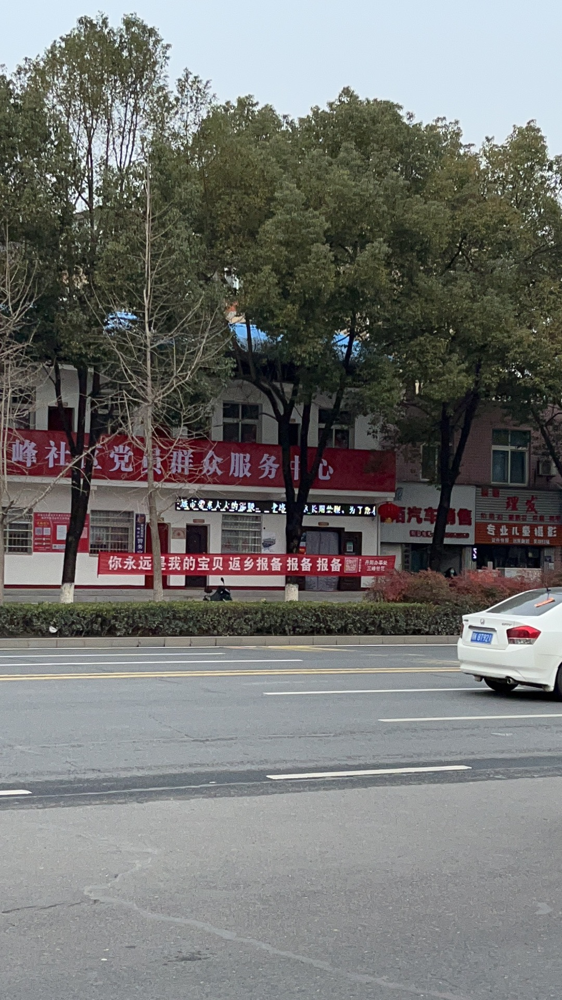

年底放开后，又经历了难受的感染七天，期间买不到任何药物，最后只能靠家里寄，朋友送。

到了2023年，一切转眼间又恢复如常，仿佛什么也没有发生过。

这里面有很多值得思考的地方。

“就像是一场梦，醒来还是很感动”

## 生活的记录

一些生活的小确幸值得被记录。

### 三月

北京三月的雪如此之大

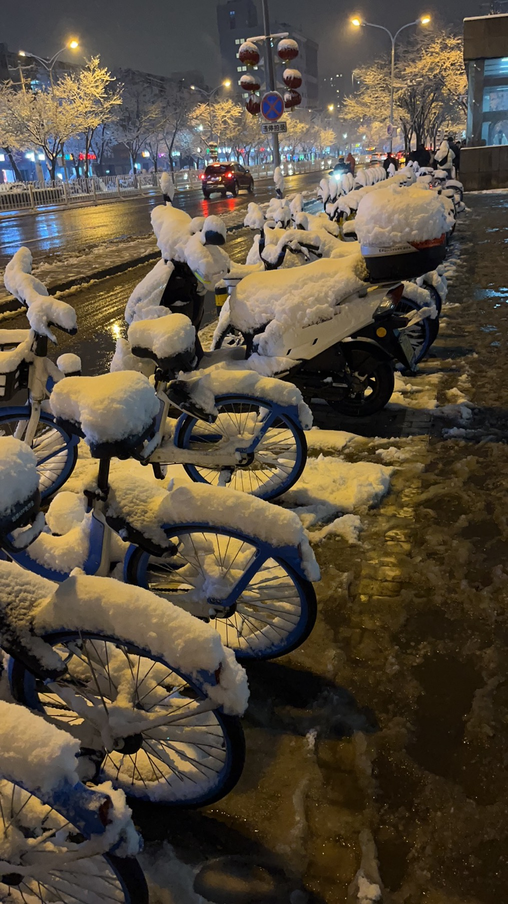

### 四月

女朋友送的apple watch，改造了一下，太酷了

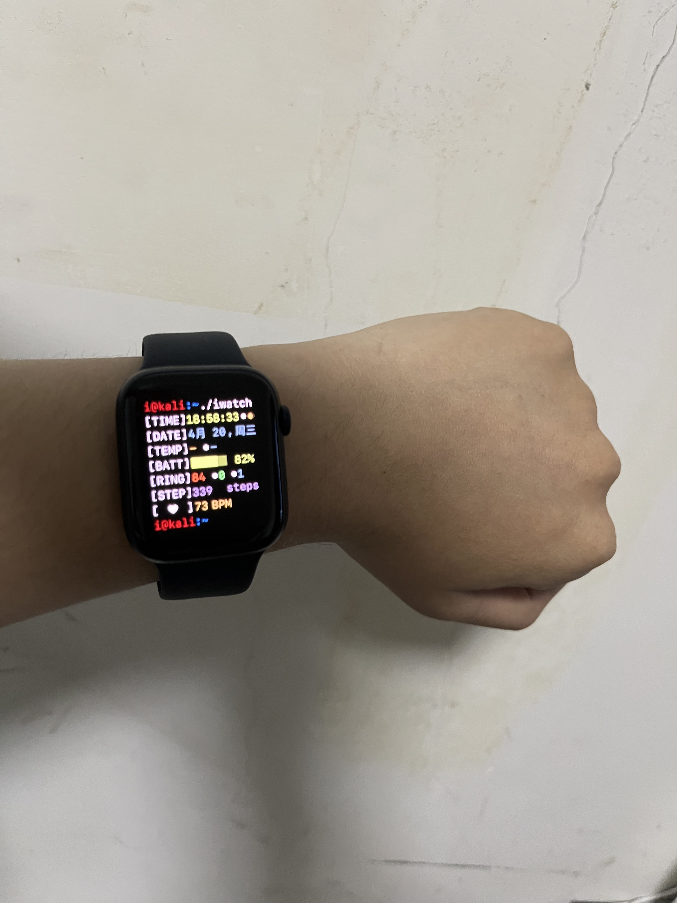

### 五月

在北京，随手抓拍，只觉得天很蓝，水很清，阳光正好。生活突然就美妙了起来。

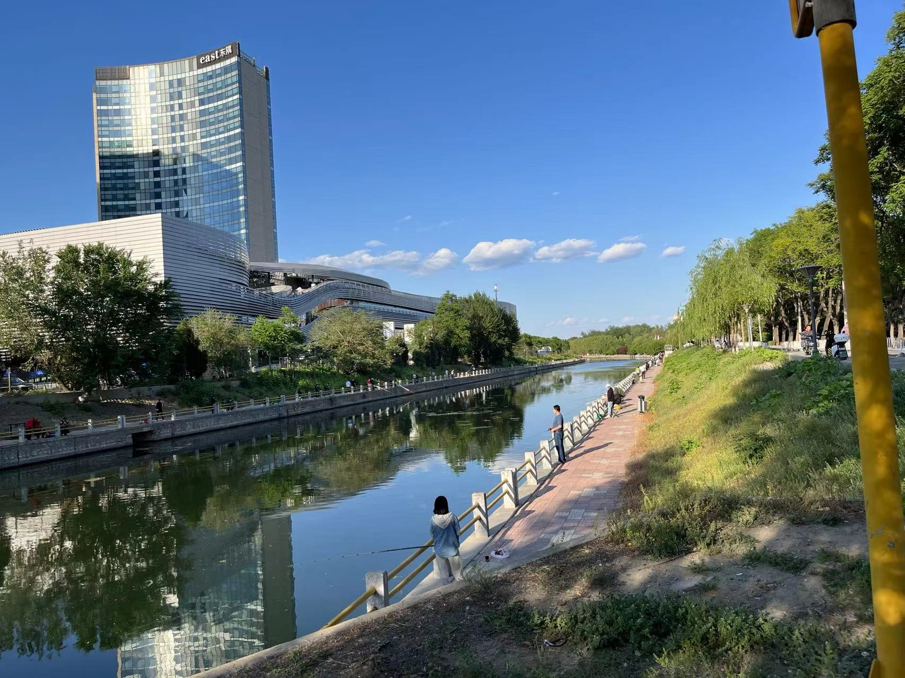

### 八月

去了圆明园

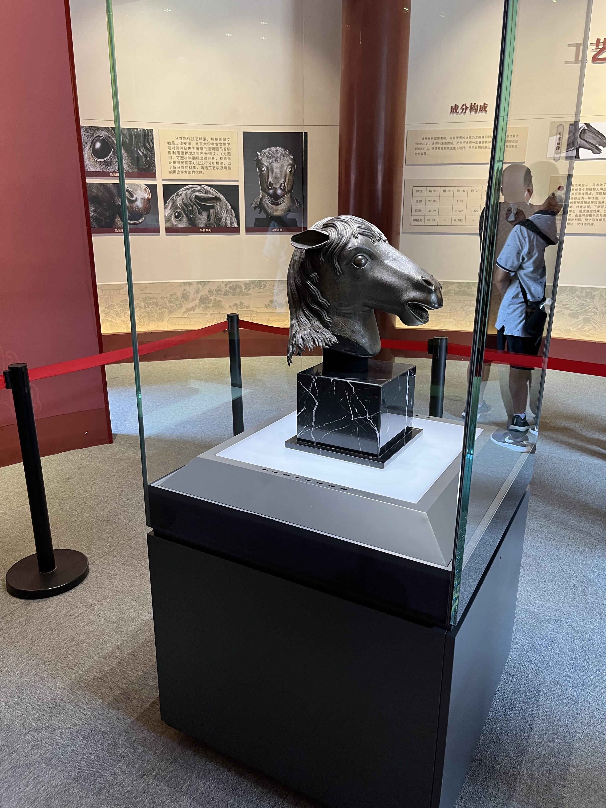

我喜欢买包饲料喂鱼，看着它们游动，将自己进入发呆状态，游目骋怀，信可乐也，能喂一下午。

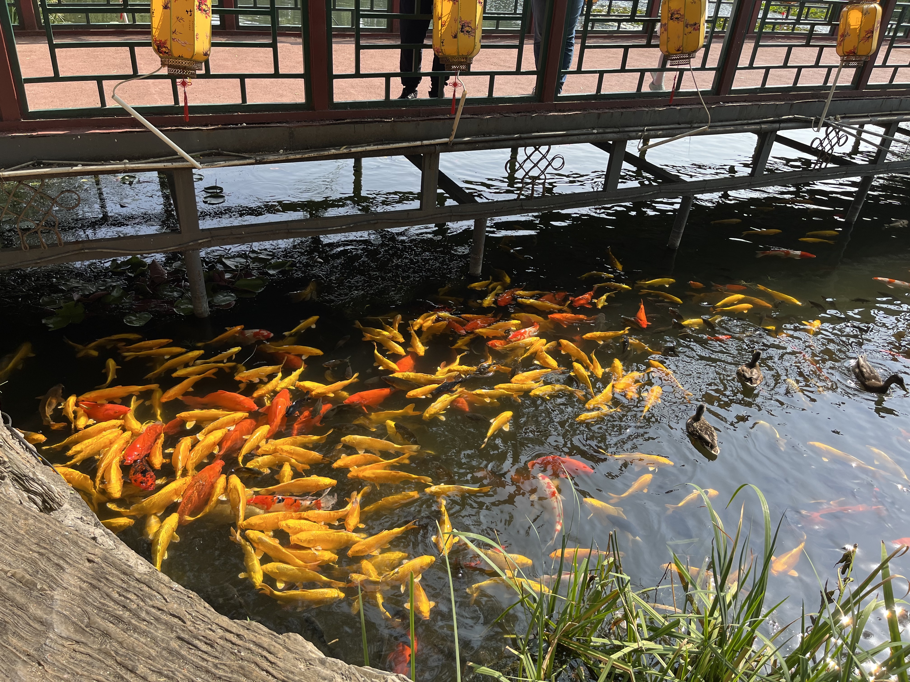

### 十月

用小电锅自己煮火锅，非常快乐

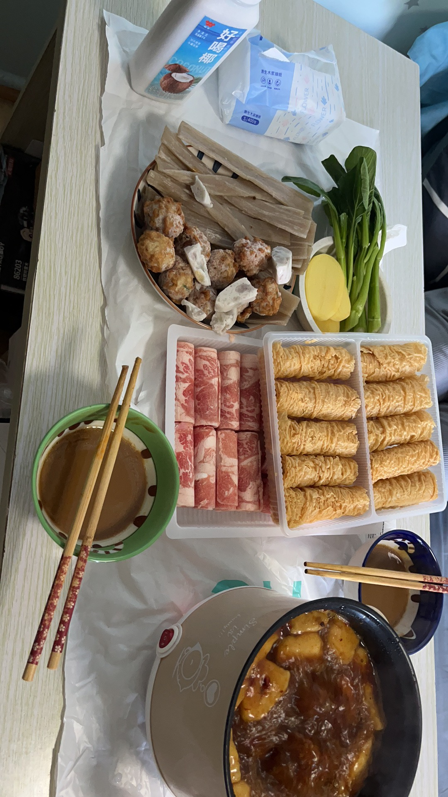

## 技术

### 技术上死磕一件事情，直至成功

在2021年，因为知识星球上的一个flag，我最终将goby的yara指纹逆向了出来 [goby指纹提取与yara逆向](../Tech/网络安全/goby指纹提取与yara逆向.md)

今年一个值得自豪的事情是将 nmap os detection功能用go实现一遍。[https://mp.weixin.qq.com/s?__biz=MzU2NzcwNTY3Mg==&mid=2247484668&idx=1&sn=a01d0e9ccc9394dfae69c3e4033480ce&chksm=fc986ddbcbefe4cdf62c95a598c832670af7065ee4fb85564823b8feeb2dbccf7e01110634a9&token=1085980980&lang=zh_CN#rd](https://mp.weixin.qq.com/s?__biz=MzU2NzcwNTY3Mg==&mid=2247484668&idx=1&sn=a01d0e9ccc9394dfae69c3e4033480ce&chksm=fc986ddbcbefe4cdf62c95a598c832670af7065ee4fb85564823b8feeb2dbccf7e01110634a9&token=1085980980&lang=zh_CN#rd)

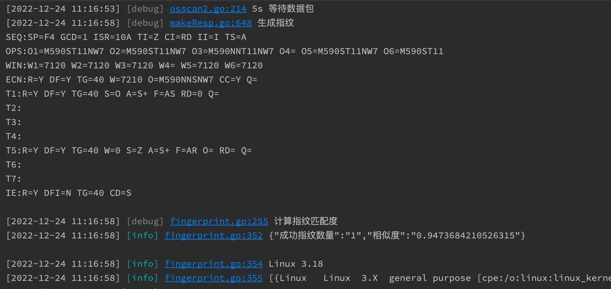

整整花了我两个月，一个月啃基础文档和相关原理，一个月实现功能，每天都在想应该如何实现，在终于完成的时刻，我知道，再技术上死磕任何一件事情，都能直至成功。

### 知识星球

让我进步的不是工作上的挑战，而是**知识星球** 。

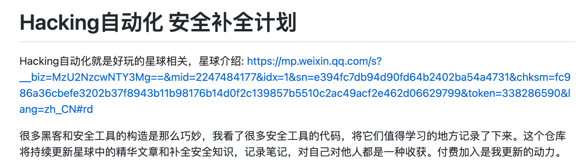

做了一个安全知识补全计划 https://github.com/boy-hack/zsxq ，知识星球促使我多研究，多写文章，多写代码。大家付费进入，也能促进我死磕，都挺不错的。每个月能有近**2000** 的额外收入。

### 大佬的认可

在写弱口令扫描时看到rdp协议挺感兴趣，看到fofa类似的功能挺感兴趣的，分析了一下 [像fofa一样解析RDP信息_RDP提取操作系统_RDP登录截屏 （Golang实现）](../Tech/网络安全/像fofa一样解析RDP信息_RDP提取操作系统_RDP登录截屏%20（Golang实现）.md)

没想到被大佬翻了牌，骄傲一下

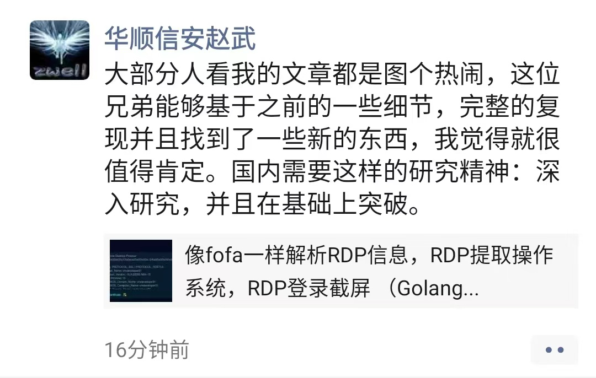

后面能看到fofa已经借鉴了我的代码，更自豪了（嘿嘿）

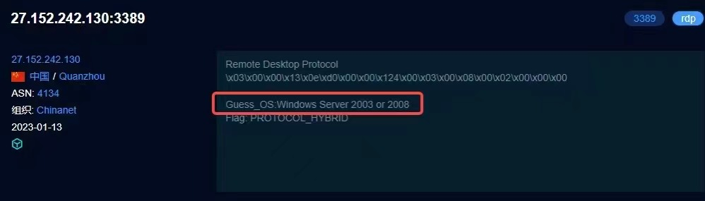

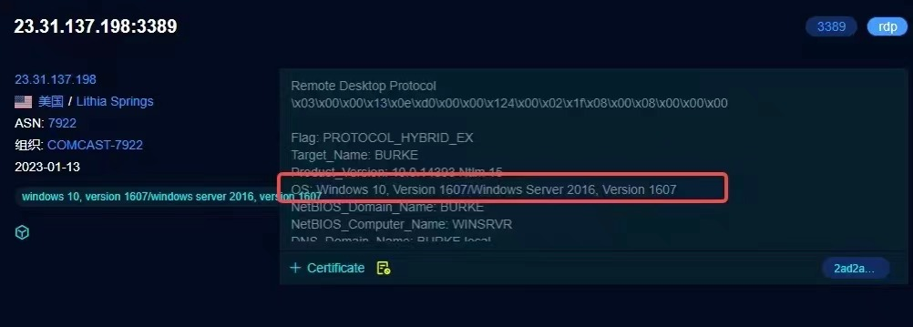

### Hacking8信息流的改变

> 很早就有这个想法了，看到很多技术文档和一些安全大会的内容是pdf形式放出的，于是也想让hacking8支持pdf全文索引。

因为换服务器，为了节省部署难度，删除了以前用户可用的很多功能，但是加入了对pdf的索引，让hacking8对安全信息的检索更上了一层楼。但是成本已经有点日渐消耗过大，入不敷出了。

在去年，网站日ip达到了`500-600`，今年，最高值达到了 `800`，虽有增加，但效果不大。

今年的目标是让其成本和收支能达到平衡，保持正常的运转，同时让日IP到`1000`。

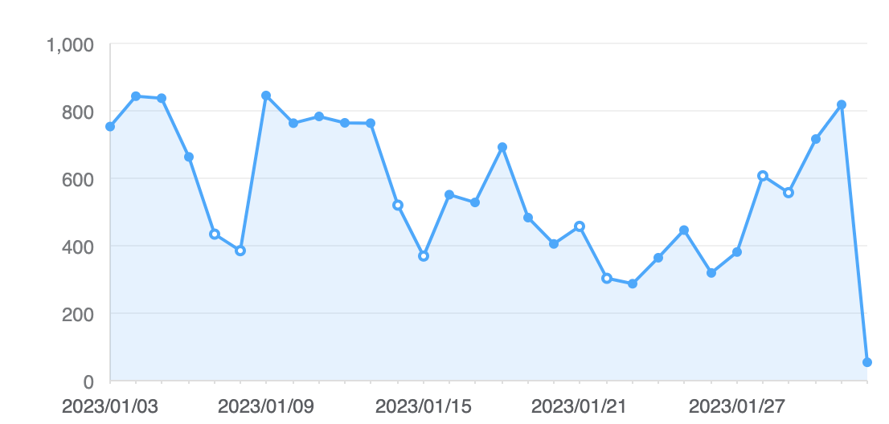

### 失败的

做了一个微信小程序 《画几个画》，算是较早的根据文本AI作画的小程序，最终因为 成本，运营的因素，停止了。

## 2023计划

技术热情确实在消退，在完全消逝之前，我想将w15scan写出来，它是一个真正的，提供白帽子用的扫描器，技术上的洁癖让我觉得它应该是效率的，代码可控的，跨平台的。“自己是自己的产品经理”，它应该易于操作，有一定美观度的。

春节看了《流浪地球2》，瑕不掩瑜，它给了我一种新的科幻片概念和感受。我的w15scan也会是这样，一种全新的，白帽视角下的资产(bugbounty)平台。虽然难，好在有小伙伴愿意和我一起完成，期待它的诞生吧～
