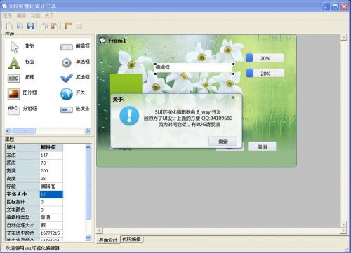
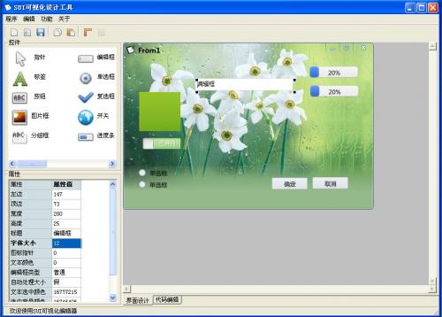
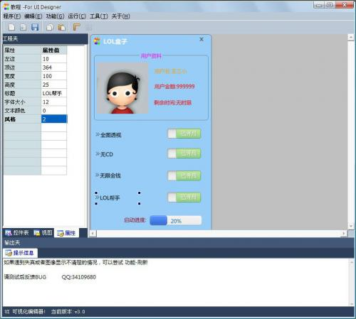
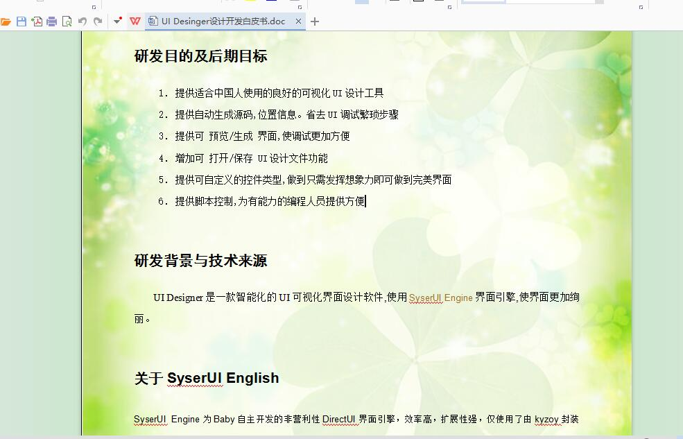
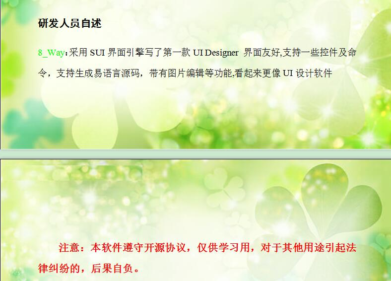

# 回忆啊_初中写的程序

无意间上了下易论坛，发现好多人关注我和加分 

看了下，是我在初中的时候发布的一款程序。即使在中考的时候还在写，甚是怀念啊。。 

当时对于UI的创建没有可视化设计模式很是尴尬，于是自己设计了这款程序 

  

第一版开源： 

  

  

  

  

  

第二版开源及部分基于此设计的软件 

  

  

  

  

今天早已没有了当年编程的激情，不知道是成长了还是老了呢。。 

写的代码也没有当时的多了，现在代码一写多，逻辑一复杂就烦，就不想写了。好怀念当时上英语课我默默的在下面设计程序的逻辑，，画了几张纸来着 

现在想想，当时为此写的UI 可视化设计白皮书是不是很可笑？ 

  

开源地址 http://bbs.eyuyan.com/read.php?tid=367363 

http://bbs.eyuyan.com/read.php?tid=348284 
