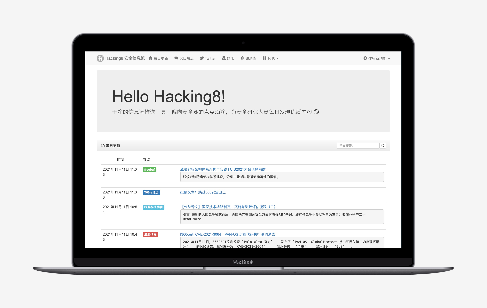
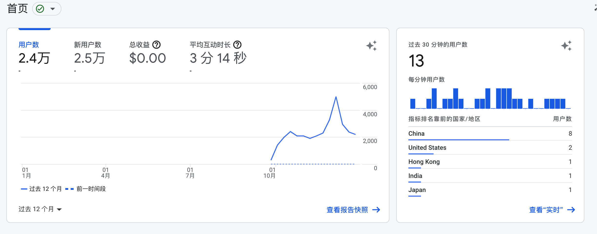
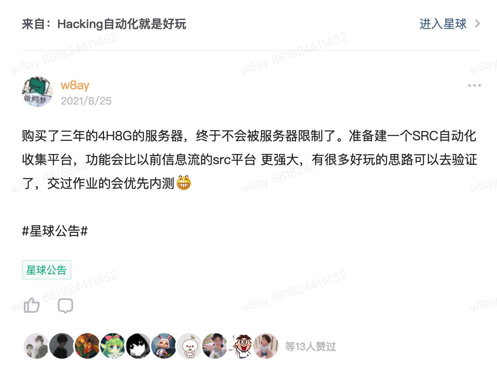
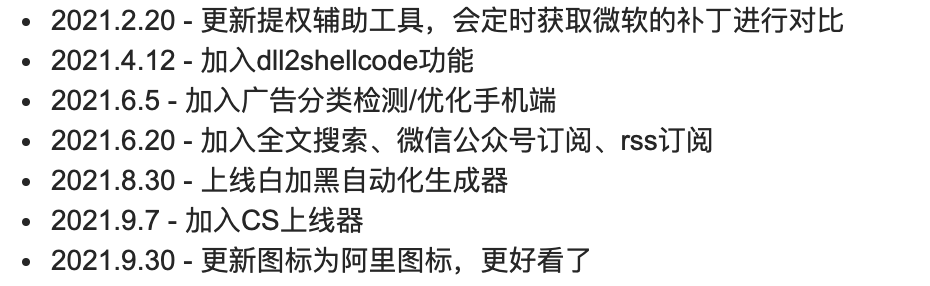
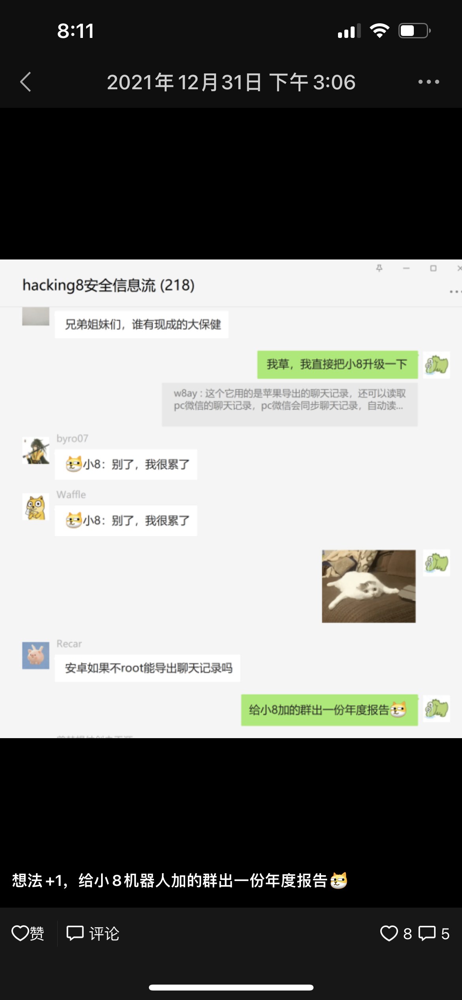
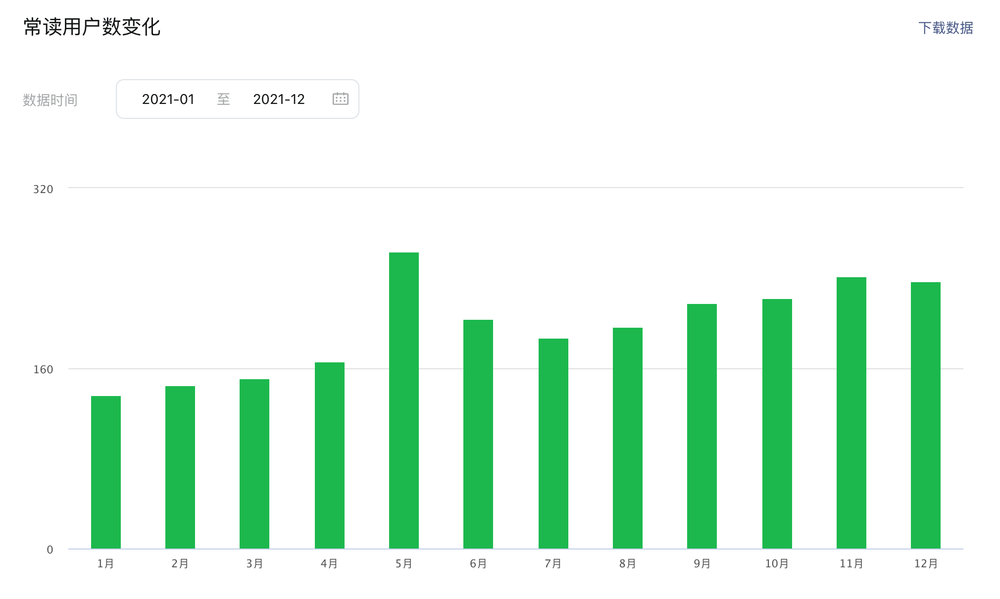
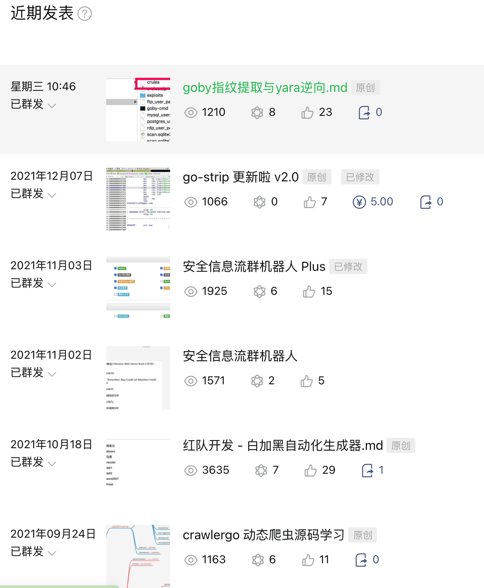
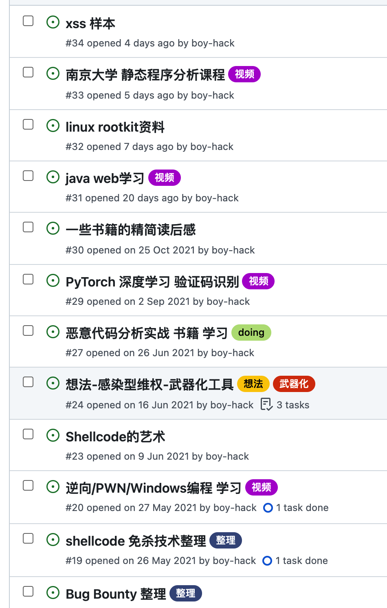
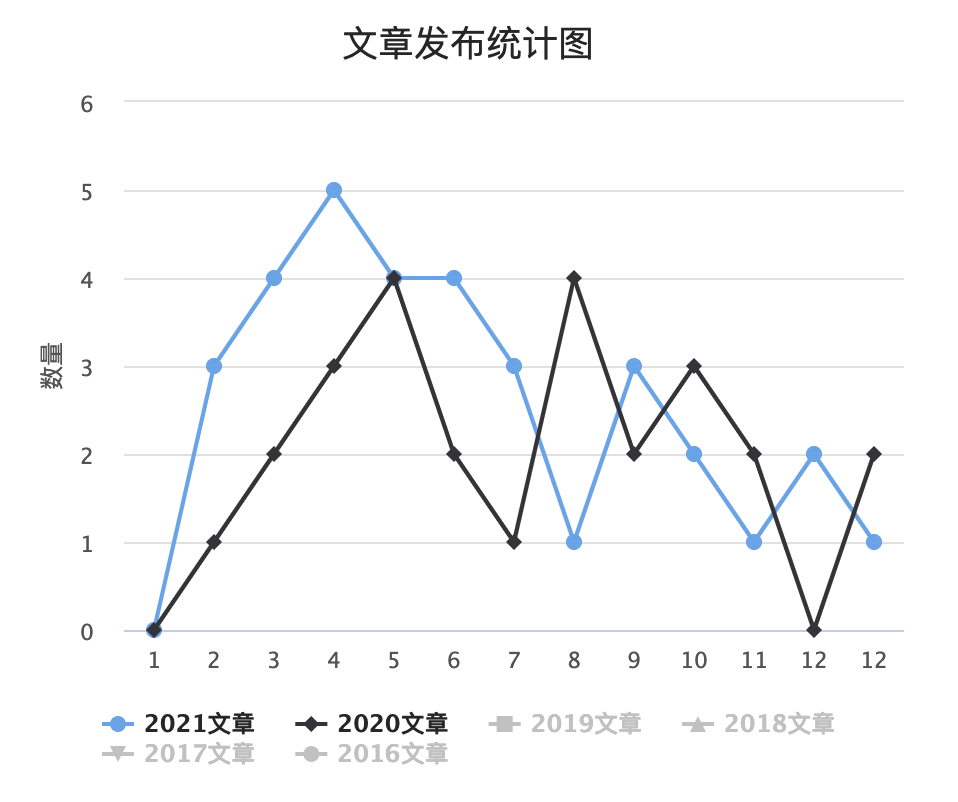

# 我的2021年终总结

又到了提笔写年终总结的时候，和以前拼命想记录生活状态不同，这次我却不知道从哪开始写起。就想到啥写啥吧。

## 北京

今年年初来到了北京，没有了昔日了朋友，在北京还是很孤独的。跨年夜我和女朋友吃完晚饭，说想找个地方一起跨年，竟然发现没有什么好去的地方。想到三里屯离我们最近，那边应该好玩，打开打车软件发现附近堵车已经堵了几条街了，瞬间打消了去意，想买点东西回家吃，但是已经快10点，附近超市什么的都关门了，也想不到买点啥，就这样两手空空回到出租屋和好友们在游戏中度过了跨年的钟声。

## Hacking8安全信息流

写总结第二个想到的就是总结一下hacking8，这是我今年花费时间最多的一个东西，我得好好总结下，从去年五月一号写第一行代码到现在，从中踩了不少坑和学到了不少东西。

去年的总结中

> 网站很长一段时间都是开放注册，需要”解题”才能获得邀请码，这样很酷。目前注册人数已经有700多人了，每天大约会有5个人签到～ 平均每天会有200来个独立IP访问。

今年这个数字都翻倍了，注册用户到了`1700+`，每天大约会有`40`人签到，网站日ip达到了`500-600`。

这不算是很高的增长，不过对于我个人来说还是很激动。毕竟有越来越多的人认可了hacking8。

之前服务器部署一些服务都抠抠搜搜，今年索性买了一台好点的服务器，用来支持一些研究，也上了全文索引，让搜索更加方便。

今年上半年花了很多时间用在修改hacking8的bug上，因为涉及用户系统的操作，代码量的成倍增加，一会web挂了，一会爬虫挂了，一会又要处理一些小工具服务的bug，服务挂掉后，会通过`Bark`手机提醒我，但我把它声音提醒早早就关闭了，因为有时候晚上会一直响。。

常常就是早上醒来，发现了提醒99+的错误消息。。然后每次都要重新登陆上服务器，检查服务，修改bug，重启服务。

下半年我决心改掉这些，不想在过多去手动操作了，想让hacking8全程都自动起来，此时才明白开发中自动测试的重要性，于是做了一键自动部署/重启爬虫，自动测试爬虫失效状态，自动化的服务监测系统等等，开发完后就很少再登陆服务器检查错误了，觉得还不错～

**新功能**

日常在做的还有不停的**砍需求** ，经过这么一年，hacking8的主体功能就是信息流的推送工具，外加一些其他的辅助功能。平时我会有很多新的想法，但奈何只有我一人业余开发维护，很多想法突然来了灵感，就想立马加上，此时我的另一个脑袋就会拼命拉住我，说不行，让子弹飞一会。

所以什么周报总结、github监控、微信公众号监控等等都被自我否掉了，精力实在有限。之前还想模仿即刻做用户的圈子社区，写了个笔记记录了下想法，之后也被自我否掉了，因为我还没有能力能运营起一个圈子社区，不能营造那种氛围。

Hacking8的界面主体还是`bootstrap`框架搭建的，几年过去还是没有一丝丝改变，虽然比较简陋，看长了也就习惯了。界面上改变的就是把图标焕然一新了，把原先的`Font AweSome`换成了阿里的`iconfont`，也算是有个新气象。

Hacking8在今年也加入了些功能，通常就是一些小想法，将它实现为了在线的方式。

这些小功能通常也都写了博客记录了，如

  * 白加黑自动化生成器
  * CS上线器
  * dll2shellcode

**小8微信机器人**

刚开始做微信机器人，主要目的是监控公众号的，后面有点想法，想做个群聊机器人，对接信息流的最新数据用于学习，定时推送或主动@机器人推送。然后机器人第一天就被加爆了，被官方风控，现在还没解封。。

写这篇文章前一天，又想到一个点子。看在元旦能不能给安排上。。

## 微信公众号

公众号”Hacking就是好玩”在去年关注的人有`2400+`，今年也整整番了一倍，有`4800+`

常读用户

今年在公众号发了文章27篇，也刷新了我的记录，每篇都是原创，阅读量都在1000+。

**收入**

有好多人联系想在公众号投放广告，一篇的价格在700左右，挺诱人的，我想了想，还是拒绝了。写公众号是作为一个业余爱好，有些东西还是保持最初的样子比较好。

通过`知识星球`的收入，也能够支撑起`Hacking8信息流`和`公众号`的日常维护了。

## 工作

今年换了工作，也聚集于安全开发上，主要做windows方面的，将红队中常用的手段以工程化的方式实现，语言在Go、C、C++、Python、NodeJs上切换，前三个主要是写客户端，用Python主要写后端和一些爬虫脚本，用node和vue主要写`electron`。在windows上，没有写c#是一个遗憾，除非必要，我也不太想花精力再学一门语言了。

公司氛围也很轻松，所以有时间进行各种的技术学习，看了很多代码，把它们一些精华吸收了下记录在了博客，github和知识星球。

github issue收集了不少感兴趣的资料

  * https://github.com/boy-hack/boy-hack/issues

回望一下今年做了些什么，这是今年我博客发表文章的统计图，和去年相比文章数量是增加的。

今年把`projectdiscover`的项目全都过了一遍，写了几篇源码阅读分享，在知识星球上我还布置了几次有关扫描器的作业。

今年学习了逆向，基于逆向，对Go编译的二进制进行混淆，基于逆向，逆向yara和提取goby指纹，这是最好玩的事情之一了。

关于红队开发，目前还是停留在免杀层面，从免杀入手，开始了解windows平台的各种机制，和杀软对抗，用工程化的方式将免杀的技战术组合在一起，组合成各类免杀模块。没有深入内网，也是今年的遗憾之一。

**关于技术的深度和广度**

我的技术栈很广，总是这个想了解一下，那个也想试试，保持了足够的好奇心。但要说哪个厉害，似乎也没有哪个。

技术的精进还是得有一个长处，还是得对一个技术保持深度的理解和影响力。

## 回顾计划

去年的年终和年中总结都制定了计划

2020年终

  * 分析一个远控了解它的功能和隐藏，执行手段，写个分析以及模仿写个软件
    * 完成，看了很多go的rat和c2源码，写了一些分析在知识星球
  * Hacking8信息流还有很多功能需要更新，列个清单并更新它
    * 基本完成，没有完成的都砍掉了
  * 建造一个SRC自动化信息收集平台，输入一些域名，就能得到src需要的一切信息收集相关的东西。主要是整合自己之前做的一些东西。
    * 没有完成。但是实现了自动化工具，包含了子域名扫描+检测、httpx扫描、指纹识别、nuclei+xray模板扫描。只等待有空集成进去。

2021年中

  * 准备做一个知识星球，用于分享安全与开发的一些东西，一些开源代码的讲解，它们有什么功能，特点是啥，有哪些值得学习的。比较纠结的是安全圈感兴趣的是各种漏洞的利用，各种工具的使用，对工具原理并不是那么在乎，我的知识星球能坚持多久也未知。

    * 今年也创建了我的知识星球，知识星球的收入很大程度缓解了压力。

    * > 很多黑客和安全工具的构造是那么巧妙，我看了很多安全工具的代码，将它们值得学习的地方记录了下来。一点点开发+安全的结合，Hacking自动化就是好玩，这个仓库将持续更新星球中的精华文章，源码和思路，付费加入是我更新的动力。

    * 目前星球的人数有199人，承蒙大家相信，未来星球会分享更多东西。

  * 模仿bugscan扫描器的go版本扫描器还是得做，不管其他的，我得要有，自己用也行啊。

    * 没做成。。
  * 二进制还得看，完成10道简单的crackme和pwn题吧，写文章发博客～

    * 完成了一些简单的re题，pwn还没开始学…

## 生活

生活很平常了，两点一线，除了公司就是出租屋了，并且在一条街道上，真正的两点一线了，都不带拐弯的。

在去公司路上听听书，听了《明朝那些事》，又在B站看了《大明王朝1566》的解说，还挺不错。

健康：这一年身体确实有点差，运动也很少，甚至还打了一次120（最后是虚惊一场），但还是值得警惕，体检报告里好几项指标都超了，对于身体的bug，我能做的似乎只有多喝热水和多锻炼吧。

看了一本书《只是为了好玩——Linux 之父林纳斯自传》,里面有很多有趣的句子和思考，如下：

**关于生活的意义的讨论**

三件事：生存、社会秩序、娱乐，生活中所有事情遵循这个顺序，某种意义上说，生活的意义就是要达到第三个阶段。我的理解，计算机编程也能有这三个意义，第一是通过计算机编程这门手艺生存，第二是凭借计算机编程这门手艺进入一家大公司，进入到第三个境界，把编程看作一项娱乐活动来玩，写代码也能获得快乐。

之前我的一些随笔又在疑惑，为什么工作后一些有关代码的兴趣消失了，这个“生活的意义”似乎可以解答，在大学时候，处于生活意义的第三阶段，所以写代码是快乐的，但是工作后，退回到了第二阶段。

**关于编程的美妙**

下面这段话很有同感

> 为什么对编程这么狂热，我自己也解释不来，我姑且说说看吧：在编程的人看来，编程是世上最有意思的事情了，它要比国际象棋之类的游戏复杂得多，你想要什么规则都可以自己设定。按照你定下的规则，它的结果该是什么，就会是什么。不过，似乎在外行人看起来，编程简直是地球上最无趣的事。 编程刚刚开始会令人觉得特别刺激，这个原因很好解释：因为你让电脑干什么，它就干什么，没有毫厘之差，并且永远服从、毫无怨言。但是单靠这一点，并不足以让你真正喜欢上编程。事实上，电脑的盲从只会让编程变得无趣，编程真正让人欲罢不能的魅力是:你想让电脑干什么事情之前，必须先弄清除，怎么样才能让它这么干。计算机科学和物理科学有不少相似的地方，它们都是在一个非常基础的层面上探讨整个学科的运作原理，不同的是在物理科学上，你得去弄清楚这个已存在世界是如何正常运转的，而在计算机科学上，你得从零开始创造出一个新世界来，而且还得设法让它正常运转。

**书中一个趣事**

> 新上的unix课，老师和我们一样，对unix也不熟悉。他一开始就很坦率的告诉了我们这一点，所以这不是什么大问题。不过他只会提前预习下一章，但有时候我们会提前跳着读后面三个章节，于是上课就变成了一种师生比赛，学生们向老师提一些三章后才学到的问题，看能不能把老师问倒，看他是不是已经读到了那里。
> 
> Unix系统的简洁并不是天生就有。要知道，这个有着建筑构件概念的操作系统，可是AT&T贝尔实验室的丹尼斯里奇和肯汤普逊辛辛苦苦花了大力气写出来的！你也千万别把简洁和容易混为一谈。简洁需要良好的设计和卓然的品味，要做到简洁可一点都不容易。

对里面的师生比赛很是羡慕，如果未来我要做老师的话，我也要做这样的老师。

## New 2022()

惯例给自己新的一年制定下计划(暂定)。

  * 去年定了学习pwn，就看了几篇文章，然后之后都忘了。去年在做yara逆向的时候看到了几篇有关yara漏洞的文章，漏洞点知道在哪，但是利用层面完全不懂了，今年学习下pwn的一些漏洞点和利用方式吧。
  * 自动化刷src
    * 想给自己被动赚钱多一个门路，一些基础的地基项目差不多完成了，现在只要组装一下测试效果。
    * 之前有过一段时间的研究，后面是条件限制终止了，但是也挖到了较大的成果。现在服务器有了，web2.0爬虫有开源的了，w13scan所具备的技战术，以及我对go差不多摸清楚了，所以想重启这个研究，挖点大事情。
  * 对一个技术做深入的研究
    * 具体哪个技术，我还没想好，但是深入的研究，我想应该先把相关的文章和paper读完，做到了这一步，到年中的时候再来规划吧。

2021自己觉得还是做了挺多有意思的研究，学习了很多东西，2022不知道还有哪些有意思的事情在等着呢？
