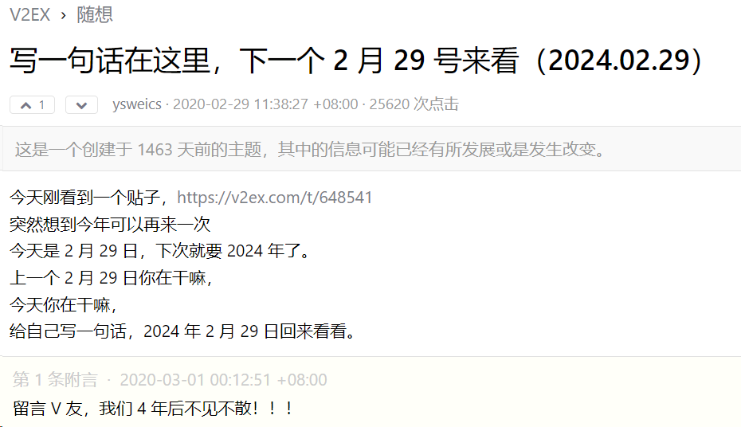
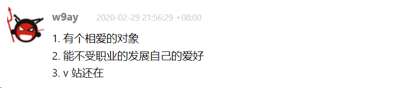

## 2025/7/20
技术越来越精进，手却越来越懒。博客也不想写，再也没有把玩技术的折腾了。

## 2024/3/2
准备更新一下一尘不变的博客，把它变为知识库的形式，会有个比较好的分类形式。
好看的知识库如vuepress是基于js的，但我不想用纯静态的方式去做，因为想展示博客之前的评论等等内容，虽然现在很多评论大多数是机器人。

## 2024/3/1
4年前在V2ex无心的回帖 

在四年后会@到的瞬间，还是会有一点感动

大学时写过一个贴吧生日提醒机器人，就是抓取贴吧所有人的生日，然后在生日的当天会@他，当时是觉得好玩，但是效果还不错，很多人都回复：谢谢，既然还有人记得之类的话。
我被@到也是这种心情吧，四年前的愿望在四年后实现了多少，还有多少人记得

## 2022-10-27
写自己想写的代码

## 2022-09-18
想做一个小产品，能赚钱更好

## 2021-06-01
二进制很酷，疯狂学习#(原谅她|2)

## 2022-03-16
少写代码

## 2021-01-01
本命年，想看看会有哪些水逆的故事～

## 2020-03-03
用爱发电的项目注定无法长久，有时候我在想从中我到底得到了什么？

## 2020-02-20
爱编程的人，运气都不会差

## 2019-11-26
今天心路历程。一个小项目想找个前端能够快速使用的后台框架，会一点点react所以找到了ant design pro。但它居然还要我去了解umi，dva，ts本来想发个帖子吐槽一下，这么不友好，在我斟酌字句打了一半后，觉得有这功夫还不如去学一下。一个小时后,嗯，真香#(原谅她|2)

## 2019-11-13
"关于我"加入了图表，瞬间逼格满满～

## 2019-11-10
原本只是想用python写个burpsuite雏形，但今天冷静了下，如果要写得更好的话，用Go+electron 是不是更合适？虽然这个我的工作量会增加很多很多。。

## 2019-11-08
上了一下许久未上的精易论坛，这届开源大赛又看到了很多有趣的东西，编程社区里只看到了易语言有如此活力，也许只有这里只凭借兴趣而不参杂其他因素。

## 2019-08-27
中国的安全大会都是为了宣传和普及基础知识而演讲的吗？

## 2019-07-11
今天实验室的伙伴找到微软的漏洞获得了致谢和w美刀的奖励，羡慕啊，这才是黑客啊，好想像他一样啊。

## 2019-06-03
一个手滑的操作删掉了”关于我“中的”我的项目“，现在也没有精力总结了，就让它逝去吧～

## 2019-05-25
会pwn太帅了，就像在计算机底层世界遨游，我要学习pwn了！

## 2019-04-22
鱼和熊掌不可得兼，想要简单，就需要牺牲性能，想要多扩展性，就需要复杂的安装，甚至复杂到文档都不想写。说的是W12Scan

## 2019-04-08
今天让w12scan支持也能在1G1H的服务器运行了，我将对w12scan进行新一轮的优化！

## 2019-04-04
有想要做的有趣的事情吗？没有。

## 2019-03-30
w12scan的Telegram 中文讨论组：https://t.me/joinchat/AAAAAFgRC6n8pEiP7p1cjg

## 2019-03-24
这个周末好无聊，没有感到有趣的东西，在知乎上看到https://github.com/zhangyiyong141/robot3DopenGL，实现了碰撞，这个可以看看，之前我写的游戏就没有实现碰撞，但是用Mac调试应该会遇到一些困难吧..

## 2019-03-19
向sqlmap贡献了第一份代码，非常nice！

## 2019-03-14
sqlmap写书计划是第一优先级

## 2019-03-08
漏洞真是太奇妙了，看到反弹回shell的那一刻真是太激动了~

## 2019-03-11
今晚将w12scan国际化了（翻译成了e文）

## 2019-02-25
写字计划准备每天写一小段文字，写作计划写几本电子书《sqlmap源码解析》《php代码审计》和一个类似现实主义的小说《我的职业是安全研究员》，每天写一点东西，保证脑袋不生锈~

## 2019-02-04
(不出所料|1)今天大年30，w12scan WEB端基本完成了，忍不住想说一句，太漂亮了！

## 2019-02-11
写完w12scan,整个人都轻松了，我想培养一个和技术无关的爱好，最近《流浪地球》很火呀，写作也是我上学时最大的爱好。写字和写作，我觉得可以。

## 2019-01-27
新的一年感觉对新技术越来越恐惧了，再也没有之前折腾的心情。每天不是这漏洞就是那漏洞，意义何在呢，我的一些想法也迟迟没有开动第一行code。或许是各种压力陡然而至的原因，真的有些累了。

## 2019-01-20
Happy hacking!

## 2018-12-05
初中的时候我就尝试过写一款中文编程软件，今天到精易论坛看贴子的时候没想到开源了中文安卓，这又燃起了我写中文编程的兴趣呀！

## 2018-11-25
博客升级已完毕~

## 2018-11-24
没想到whatcms积压了好多的url，说明一下，是备案的时候节点掉线了。。运行几年其实还蛮稳定的，但我计划这几周重写一下。还有，看了requests源码后我承认hackrequests不如它，555~

## 2018-10-11
突然想DIY一个人形机器人

## 2018-10-06
十一过得我快费了..

## 2018-10-02
w9scan会成为世界第一的扫描器！

## 2018-08-31
antSword真是漂亮，搞得我想去学前端了#(呀咩爹|2) 收下我的膝盖

## 2018-08-26
kcon参加完的感受是，听不懂的高深莫测，听得懂的废话连篇

## 2018-08-16
弄清楚了，如果访问不了本博客，可尝试科学上网，看来国墙又升级了

## 2018-08-16
自从上传了w11scan的视频博客就一直打不开，是不是我的小水管太小了 # _ #

## 2018-08-14
一直没有更新w9scan是因为爬虫一直写不好，所以也导致了w8scan的断更...不依赖第三方库写爬虫太难了 :&lt; 哭 [哭]

## 2018-07-27
终于入手了mac pro,想想就激动，可以大大提高工作效率 :）

## 2018-07-23
有点碎语，看到别人魔改自己的w8scan并堂而皇之宣传自己制作，心里真的很不爽，我想重写w8scan并免费发布！

## 2018-05-31
别人视野真高，硬件hacker,无人机，路由器，这些比千篇一律的web安全有趣多了

## 2018-05-26
[嘻嘻] 买了0.00197BTC玩玩

## 2018-04-18
游戏与黑客似乎是年轻一代的标签了

## 2018-04-14
终于找到了opengl独占鼠标的算法！

## 2018-02-22
一年又是一年

## 2018-02-12
广撒网式的漏洞扫描，真的强！

## 2018-01-25
又被拒绝了 ╮(╯▽╰)╭

## 2018-01-16
不能对某圈的人有太多期待，傻逼是服从28定律的，安安静静做自己就好

## 2018-01-12
接下来把分析sqlmap写完，白帽子讲web安全读完

## 2018-01-01
写了一年的新年插件，又可以派上用场了

## 2017-12-15
QQ评论已经修复~

## 2017-12-04
博客的服务器由于在香港，无法使用QQ评论，暂后将更新

## 2017-11-17
谈谈可笑的开源精神吧，既然是开放源码，却弄出一大堆可笑的文字规定，想让别人帮助你测试源码和修改，大多数却只是借助开源来满足自己的业务而已- =

## 2017-11-11
双十一剁手了，买了阿里云的服务器 - = 不想受腾讯的限制了！！

## 2017-09-20
这个月不用吃馒头了，接了几个单子，，熬夜做出来了。#(原谅她|2)

## 2017-11-02
最近打算:先完成手头项目，然后给博客换套主题，技术文章和模板文章分离成两个博客，然后继续探索Sqlmap源码和bugscan源码，重写w8scan扫描器!#(你懂的|2)

## 2017-10-27
这几个月很忙很忙....

## 2017-09-12
没想到窘迫到需要接单了，各位需要定制服务的话可以联系我，在“关于我”栏目中可以看到我能做什么。

## 2017-08-31
开始入坑java

## 2017-08-05
请还没有更换友链的朋友更换下友链奥，，原域名已经停用了[可怜]

## 2017-08-05
使用了instantclick插件，现在切换的速度好快

## 2017-07-24
乌云8w漏洞查询重新开启：https://bugs.hacking8.com/

## 2017-07-23
之前mysql总是崩溃，又找不到解决办法。今天把vps重装了，用的宝塔的面板，不错，自动支持ssl，不用我手动去配置。技术真的是越来越方便了。

## 2017-07-23
事情要慢慢来，列了好多计划，总是这写一点，那写一点，却总是感觉没有做完。还是先专注完成第一个目标再来第二个。这样"顺序"执行感觉比"多线程"执行更好，毕竟人脑不是CPU。。

## 2017-07-16
无聊，准备重写w8scan了

## 2017-06-26
破学习机算法，，，

## 2017-06-23
[开心]将开启全力更新模式

## 2017-05-06
博客开启了邮件回复功能咯[可爱]

## 2017-05-02
网站ssl证书更换为了AlphaSSL，主要不想每三个月续一次Encrypt的证书。这个证书可以用一年呢

## 2017-04-23
...大部分是从别的网站引流过的，，真想屏蔽这些IP

## 2017-04-23
今天才看到。。。

## 2017-04-22
[喷]当扫描器写到一半才知道，，意义何在呢？但还是硬着头皮写出来了

## 2017-03-19
One smile can start a friendship.One word can end a fight.One look can save a relationship.One person can change your life.

## 2017-02-25
There is only happiness in life,to love and be loved.

## 2017-01-15
想写个操作系统~

## 2016-12-29
脚本小子想开车驰向远方，却因为偏见，把时间花在如何造轮子上

## 2016-12-17
自由的灵魂无论善恶exp都有它纯在的意义

## 2016-12-15
周末会清理下以前过期的教程，免得误导了大家 = - 加油！[开心]

## 2016-11-27
记录了emlog学习的记录：https://boy-hack.gitbooks.io/emlogdev/content/

## 2016-11-08
有种想把博客建在Github上的冲动！！

## 2016-11-06
Markdown 好东西哦[真棒]

## 2016-11-06
花了一天时间写Markdown插件，终于写完了，好累[大哭]

## 2016-10-29
[可怜]博客又一次被黑，心里想想就有点小激动[滑稽]刚刚恢复数据，有bug欢迎反馈

## 2016-10-16
不小心删除了很多评论。。郁闷了

## 2016-10-13
找个时间写下4.4的帮助文档 ...233

## 2016-08-23
发现了emlog一处漏洞，太可怕了

## 2016-09-06
4.4杂志模式和图片模式已完成，下部解决一些ajax问题就完成了[开心]

## 2016-08-09
[喷]自带的编辑器写文章真麻烦，用百度的也麻烦，，想去试下原生的markdown了

## 2016-08-16
弃坑了，太烦了

## 2016-08-01
[喷]好了，把所有用户都删了

## 2016-07-21
会员中心后台支持上传头像了，试试吧[可爱]

## 2016-07-19
原主机商跑路了，无良奸商

## 2016-07-07
暑假弄下Python和github

## 2016-07-02
[滑稽]播放几天音乐就关掉的~ [真棒]测试下pjax

## 2016-05-29
[真棒]4.2完成了，呼呼(～ o ～)~zZ

## 2016-05-29
[流泪]新的一天开始了

## 2016-05-04
[可怜][程序猿]这是单身狗

## 2016-05-04
[程序猿][程序猿][滑稽][滑稽]

## 2016-05-04
[程序猿][程序猿][程序猿]

## 2016-04-15
这几天好烦[愤怒][愤怒]

## 2016-04-15
操蛋的空间

## 2016-04-15
草

## 2016-04-12
emlog4.0来了[开心][开心]

## 2016-04-07
[开心]会员中心 用户回复可见写完，这个大模块写完了，离终点不远了

## 2016-04-05
会员中心完成注册部分[滑稽]

## 2016-04-03
换回了最原始的评论

## 2016-03-27
新主题将重点优化手机端

## 2016-03-19
[流泪]诶，新浪云被禁用了，杯具了。。

## 2016-03-17
[滑稽]今天有时间更新了下博客哈，以后也会继续更新[可爱][可爱]

## 2016-03-02
使用微语记录您身边的新鲜事
